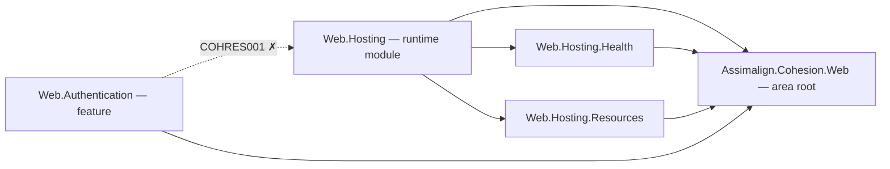

---
paths:
  - "**/*.md"
  - "**/docs/**"
---

# Documentation

## Markdown file naming

Markdown files use UPPERCASE names (`README.md`, `OVERVIEW.md`, `DESIGN.md`). Exception: files whose names are fixed by external tooling keep their conventional casing (e.g., `.github/pull_request_template.md`, files under `.claude/**`). API reference under `docs/Assembly/` needs no exception — its **folders** mirror CLR namespace/type names, while every file is `OVERVIEW.md` (see "Assembly documentation layout" below).

## Three layers of documentation

Cohesion has three layers of documentation, each with distinct purpose and audience.

1. **Area-level `README.md`** — overview of a major area (e.g., `resources/Web/`, `libraries/Core/`)
2. **Project-level docs** — `OVERVIEW.md`, `DESIGN.md`, and `docs/Assembly/` per project
3. **XML doc comments** — on public APIs

Each project with `src/` and `tests/` folders should also have a sibling `docs/` folder.

## Diagrams — Mermaid

Structure that prose holds badly — dependency direction, lifecycle states, message exchange,
pipeline order — is drawn in a fenced `mermaid` code block. GitHub renders those natively, so
nothing is checked in as an image and no build step is involved.

### Where a diagram belongs

- **`docs/DESIGN.md`** — at least one diagram, covering whichever of these the library actually
  has (first match wins; more than one is fine when each earns its place):
  1. **Family / dependency direction** — any multi-package family or area. This is the visual form
     of the required *Family map* section: keep the table (it carries roles and exact package
     names) and put the graph above it.
  2. **Lifecycle or state machine** — connection state, disposal, host start/stop, retry state.
  3. **Protocol / message exchange** — handshakes, request/response sequences, wire flows.
  4. **Pipeline / data flow** — middleware order, parse → bind → execute, producer → consumer.
- **Area `README.md`** — one project-map diagram: the area's packages and the direction of their
  references. For a `resources/<Area>/` README this is the picture of the hosting-isolation rule
  (`resource-areas.md`) — area root, feature libraries, hosting family, runtime module.
- **`docs/OVERVIEW.md`** — at most one *orientation* diagram: where this project sits relative to
  its neighbors. Optional, and only when it answers "what talks to what". Never restate
  `DESIGN.md`'s diagram; link to it.
- **`docs/Assembly/<Namespace>/<Type>/OVERVIEW.md`** — normally none. Add one only for a type
  hierarchy or state machine that can't be read off the signatures.

**There is no backfill mandate.** A diagram is added when the file is created, or when a change
alters the structure a diagram would show — not as a sweep across the ~200 existing `DESIGN.md`
files. A diagram that exists to satisfy a checklist is worse than no diagram.

### House conventions

- **An arrow always means "references" / "depends on".** `Web.Hosting --> Web` reads
  "`Web.Hosting` references `Web`" — the same direction the dependency rules are written in ("the
  dependency arrow always points root → child"). Never flip it to mean "provides" or "delivers".
- **No colors, no themes.** No `%%{init: ...}%%` blocks; no `style`/`classDef` carrying `fill:`,
  `stroke:`, or `color:`. The same markdown renders on light and dark backgrounds, and hardcoded
  colors are unreadable on one of them. Meaning rides on shape, direction, and edge labels.
- **Short ASCII node IDs, quoted labels.** `Hosting["Assimalign.Cohesion.Web.Hosting"]`, never a
  bare dotted ID. An unquoted `.`, `-`, `(`, `[`, or `{` inside a label is the most common parse
  failure in this repo's namespace names.
- **`flowchart`, not the legacy `graph` keyword.** `flowchart LR` for dependency graphs,
  `flowchart TD` for pipelines, `stateDiagram-v2` for lifecycle, `sequenceDiagram` for protocol
  exchange, `classDiagram`/`erDiagram` only when the relationships themselves are the point.
- **Twelve nodes is the ceiling.** Past that it's two diagrams or a table. A diagram nobody can
  read at a glance has failed at the only thing it does better than prose.
- **A prohibited edge may be drawn** — dotted and labeled with the rule id — but the prohibition
  must also be stated in prose. Dotted-vs-solid never carries a rule on its own.

Canonical shape, the Web area's dependency direction:



Solid edges are the references the area permits; the dotted edge is the one `COHRES001` rejects —
a feature library may never reference its area's runtime module, which the surrounding prose has
to say in words as well.

### The prose still has to stand alone

Every diagram gets a one-line lead-in saying what it shows, and **no fact may live only in the
diagram**. These docs are read in plain-text editors, terminals, diff views, and by screen
readers, where a mermaid block is a wall of source. The diagram is a second, faster view of
something the text already says — not a place to park information.

### Keeping diagrams current

A stale diagram misleads harder than stale prose: it looks authoritative and gets skimmed rather
than read. If a change alters what a diagram depicts — a package joins the family, a lifecycle
state appears, a pipeline is reordered — the diagram is updated in the same commit, on the same
terms as the surrounding `DESIGN.md` text.

Mermaid parse errors surface as a rendering error on GitHub and **nothing in CI catches them**.
Preview the rendered markdown before committing.

### Box-drawing ASCII

Existing box-drawing diagrams are fine where they sit; convert one to mermaid when you're already
editing that section, never as a standalone sweep. Don't add new box art for graphs or flows.
**Exception: directory and file trees stay ASCII** in a plain fenced block (as in `testing.md` and
`build-system.md`) — mermaid has no good tree-listing form.

## Project-level documentation

Required files per project:

- `docs/OVERVIEW.md` — project purpose, scope, dependencies, and usage at a high level
- `docs/DESIGN.md` — architecture, important design choices, lifecycle behavior, extension points, operational concerns, known constraints
- `docs/Assembly/` — API reference material organized by namespace and type

### `docs/DESIGN.md` — required for every library

Every library under `libraries/` must have a `docs/DESIGN.md`. The purpose is to make the *reasoning* behind the library's shape readable without re-deriving it from diffs, commit history, or code archaeology — when a future session surveys the code, `DESIGN.md` is what tells them why it looks the way it does.

**Canonical example:** `libraries/Dns/Assimalign.Cohesion.Dns/docs/DESIGN.md`. Match its depth and structure for new libraries.

**Typical sections** (adapt to the library — these aren't a rigid template):

- **Design intent** — what the library is for at the architectural level, in one or two paragraphs.
- **Why-this-not-that decisions** — each major design choice (e.g., abstract class vs interface, sealed hierarchy vs plugin model, single root exception vs family) with the rationale and the trade-off accepted. The "contrast with X" framing in the Dns DESIGN.md (interfaces for FileSystem, abstract classes for DNS) is the model — name the alternative you rejected and why.
- **Family map** — if the library is part of a multi-package family, list the packages, their roles, and the one-way dependency direction. Pair the table with a `mermaid` dependency graph (see *Diagrams — Mermaid*); the table carries roles and exact package names, the graph carries direction at a glance.
- **Lifecycle pattern** — how disposal, cancellation, and resource ownership work, with the base-class shape if applicable. A non-trivial state machine is drawn as a `stateDiagram-v2`.
- **Error model** — exception root, error codes, wire/transport mappings, who throws what.
- **Wire/protocol scope** — for protocol libraries, what's parsed/serialized, what's intentionally not.
- **AOT posture** — what the library deliberately avoids to stay AOT-clean.
- **Adding to the family / extending** — concrete steps for the next library in the family or the next extension point.
- **Non-goals** — what the library deliberately won't do, and why. This is high-value because it heads off future "should we add X?" questions.

### Keeping `DESIGN.md` current

When a code change alters or extends a design decision, `DESIGN.md` is updated in the same commit. Examples of what triggers an update:

- Lifecycle pattern changes (new `DisposeAsyncCore` hook, new ownership rule)
- Error model changes (new error code, changed mapping, new exception root)
- Contract shape changes (interface → abstract base, new family member, new extension point)
- AOT posture relaxations or tightenings
- Non-goal becomes a goal, or vice versa
- A new "why-this-not-that" decision is made (record it before you forget the alternative you rejected)
- A diagram in the file no longer matches what it depicts (a package joined the family, a lifecycle state appeared, a pipeline was reordered)

A `DESIGN.md` that lags the code actively misleads — worse than not having one. If you're not sure whether a change rises to the level of a `DESIGN.md` update, ask: *"would the existing DESIGN.md surprise or mislead someone reading it after this change?"* If yes, update it.

### Assembly documentation layout

- Namespace folders under `docs/Assembly/` mirror the documented namespace (e.g., `docs/Assembly/System.IO/`)
- Each documented type gets a **folder** named for the type, containing an `OVERVIEW.md` (e.g., `docs/Assembly/System.IO/Glob/OVERVIEW.md`). The folder leaves room for additional per-member or design pages beside the overview later.
- A namespace folder may also carry its own `OVERVIEW.md` introducing the assembly/namespace (the IdentityModel family uses this while its per-type reference is pending).
- Folder names mirror CLR namespace and type names exactly; the markdown files themselves stay UPPERCASE (`OVERVIEW.md`), so API reference needs no naming exception.
- API reference docs should outline: public surface area, constructor or factory behavior, methods, properties, exceptions, usage notes

## Area-level `README.md`

Each major area root contains a `README.md` providing an overview. Examples:
- `resources/Web/README.md`
- `resources/Database/README.md`
- `libraries/Core/README.md`

Area `README.md` files should summarize:
- The purpose of the area
- The major projects or services it contains
- How the area fits into the L1, L2, L3 layering model
- Important dependencies on other areas
- Links to project-level `OVERVIEW.md` and `DESIGN.md` files where relevant

An area `README.md` also carries the area project-map diagram described under *Diagrams — Mermaid*.

## XML documentation requirements

**Public APIs MUST have:**
- `<summary>` — brief description
- `<param>` — for each parameter
- `<returns>` — for non-void methods
- `<exception>` — for thrown exceptions
- `<remarks>` — for additional details (optional but recommended)

**Example:**
```csharp
/// <summary>
/// Executes a database query asynchronously.
/// </summary>
/// <param name="query">The SQL query to execute.</param>
/// <param name="parameters">Query parameters to bind.</param>
/// <param name="cancellationToken">Cancellation token for the operation.</param>
/// <returns>A task representing the query result.</returns>
/// <exception cref="DatabaseConnectionException">Thrown when connection fails.</exception>
/// <remarks>
/// This method automatically retries on transient failures up to 3 times.
/// </remarks>
public async Task<QueryResult> ExecuteAsync(
    string query,
    Dictionary<string, object> parameters,
    CancellationToken cancellationToken = default)
{
    // Implementation
}
```

**Internal types MAY omit XML docs** but should use code comments for complex logic.

## When XML docs drift

Common drift modes worth checking before completion:
- A new public method added without `<summary>`
- A `CancellationToken` parameter added without a `<param>` entry
- A new exception thrown from a method without a matching `<exception>`
- A `<returns>` left over from a refactor that now describes the wrong shape

Commit-message and branch-naming conventions live in `workflow.md` (always loaded).
