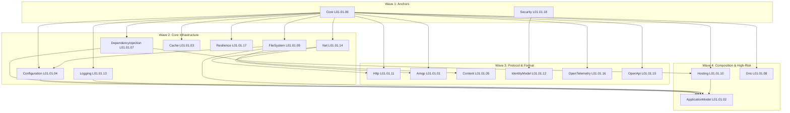

# Cohesion

Cohesion is 

- [Cohesion](#cohesion)
- [Sdk](#sdk)
  - [Libraries](#libraries)
  - [Services/Resources](#servicesresources)
  - [Tooling](#tooling)
  - [Extensions](#extensions)
- [Repository Structure](#repository-structure)

# Sdk

Cohesion is a mono repository 

## Libraries

## Services/Resources

The service section of this repository is broken into a two layer approach folder structure `Layer 1 [Service/Resource] -> Layer 2 [Library]`. This approach

## Tooling

## Extensions

# Repository Structure

Cohesion is a mono repository that contains all the source code, extensions, and tooling in one. This allows for easier development. When working with cohesion it's best to scope development to specific areas of the repository 

The following l

| Folder         | Usage                                                                 |
| -------------- | --------------------------------------------------------------------- |
| `./.build`     | This contains all the scripts and process for packaging the SDK which |
| `./.docs`      |                                                                       |
| `./.samples`   |                                                                       |
| `./libraries`  | All the source code for cohesion lives in the following folder.       |
| `./tooling`    |                                                                       |
| `./extensions` |                                                                       |
| `./sdk`        | This contains source code for MSBuild SDK Style Project.              |

