# Cohesion

Cohesion is a code-first, multi-service application framework for .NET. It provides the building blocks — foundation libraries, an application model, MSBuild SDKs, and NuGet-distributed shared frameworks — for composing services that can run in-process, out-of-process, or across machines without changing application code. Everything targets the latest .NET with NativeAOT compatibility as a standing requirement.

- [Cohesion](#cohesion)
- [Sdk](#sdk)
  - [Libraries](#libraries)
  - [Services/Resources](#servicesresources)
  - [Tooling](#tooling)
  - [Extensions](#extensions)
- [Repository Structure](#repository-structure)

# Sdk

Cohesion ships as a family of MSBuild SDKs (`Assimalign.Cohesion.Sdk`, `Assimalign.Cohesion.Sdk.<Domain>`) paired with NuGet-distributed shared frameworks (`Assimalign.Cohesion.App[.<Domain>]`), modeled on `Microsoft.NET.Sdk` + `Microsoft.NETCore.App`. A consumer project picks the SDK for its domain and automatically receives every Cohesion library that belongs to the matching framework — no installer required. See [sdks/README.md](sdks/README.md) for consumption details and [AGENTS.md](AGENTS.md) for the full architecture.

## Libraries

The foundation libraries under [`libraries/`](libraries/README.md) are the L1 layer: every protocol, abstraction, and runtime primitive the services compose. Each library is its own project with co-located `src/`, `tests/`, and `docs/`.

## Services/Resources

The service section of the repository follows a two-layer folder approach: `Layer 1 [Service/Resource] -> Layer 2 [Library]`. Each service under `resources/` composes the foundation libraries and ships as its own `Sdk.<Name>` + `App.<Name>` framework family, so a consumer can target exactly the service domain they are building against.

## Tooling

Developer tooling lives under `tooling/` — the `cohesion` CLI and repository dev scripts.

## Extensions

IDE and platform integrations live under `extensions/` — the Visual Studio extension and the `dotnet new` project templates.

# Repository Structure

Cohesion is a mono repository that contains all the source code, extensions, and tooling in one place. When working with Cohesion it is best to scope development to a specific area of the repository:

| Folder          | Usage                                                                                                     |
| --------------- | --------------------------------------------------------------------------------------------------------- |
| `./analyzers`   | Roslyn analyzers, code fixes, and source generators.                                                        |
| `./assets`      | Shared assets such as the `cohesion.config` JSON schemas.                                                   |
| `./build`       | Custom MSBuild infrastructure: centralized targets, package versions, and build tasks shared by every project. |
| `./docs`        | Repository-level documentation (delivery roadmap, service design, build system, versioning).               |
| `./extensions`  | IDE and platform integrations (Visual Studio extension, `dotnet new` templates).                           |
| `./frameworks`  | Shared-framework producer projects (`App[.Domain]` Ref + Runtime packs) and the framework membership manifest. |
| `./installer`   | WiX MSI source and delivery scripts (`Install-Local.ps1`, domain scaffolding).                              |
| `./libraries`   | Foundation libraries (L1) — every Cohesion building block.                                                  |
| `./resources`   | Service/resource implementations (L3), each paired with an `Sdk.<Name>` + `App.<Name>` framework family.   |
| `./sdks`        | MSBuild SDK projects (`Assimalign.Cohesion.Sdk[.Domain]`).                                                  |
| `./tooling`     | Developer tooling (`cohesion` CLI, dev scripts).                                                            |

The delivery waves below reflect the dependency order of the foundation libraries (see [docs/DELIVERY_ROADMAP.md](docs/DELIVERY_ROADMAP.md) for the full plan):

```mermaid
graph TD
    subgraph W1["Wave 1: Anchors"]
        Core["Core L01.01.06"]
        Security["Security L01.01.18"]
    end

    subgraph W2["Wave 2: Core Infrastructure"]
        DI["DependencyInjection L01.01.07"]
        Config["Configuration L01.01.04"]
        Logging["Logging L01.01.13"]
        FS["FileSystem L01.01.09"]
        Connections["Connections L01.01.14"]
        Cache["Cache L01.01.03"]
        Resilience["Resilience L01.01.17"]
    end

    subgraph W3["Wave 3: Protocol & Format"]
        Http["Http L01.01.11"]
        Amqp["Amqp L01.01.01"]
        Content["Content L01.01.05"]
        Identity["IdentityModel L01.01.12"]
        OTel["OpenTelemetry L01.01.16"]
        OpenApi["OpenApi L01.01.15"]
    end

    subgraph W4["Wave 4: Composition & High-Risk"]
        Hosting["Hosting L01.01.10"]
        AppModel["ApplicationModel L01.01.02"]
        Dns["Dns L01.01.08"]
    end

    Core --> DI
    Core --> Config
    Core --> Logging
    Core --> FS
    Core --> Connections
    Core --> Cache
    Core --> Resilience
    Core --> Http
    Core --> Amqp
    Core --> Dns
    Core --> Hosting
    Core --> OTel
    Core --> OpenApi
    Security --> Identity
    FS --> Config
    FS --> Content
    Connections --> Http
    Connections --> Amqp
    DI --> Hosting
    DI --> AppModel
    Config --> AppModel
    Logging --> AppModel
    FS --> AppModel
    Hosting --> AppModel

```

