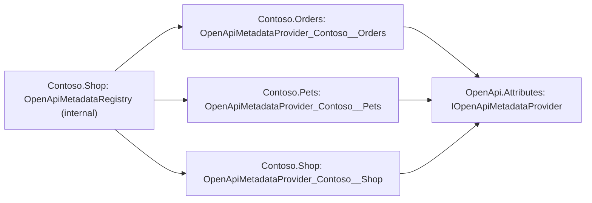

# Assimalign.Cohesion.OpenApi.SourceGeneration — Design

## Design intent

The AOT-safe discovery half of the attribute path: find the OpenApi authoring attributes at compile
time and emit their metadata as static data, so an application never reflects over its own assembly at
run time to build an OpenAPI description. This is the reflection-free replacement for a
`Type.GetCustomAttributes` scan, and it is what makes the attribute path NativeAOT- and trimming-safe.

An application's endpoints rarely live in one assembly, so the generator also composes: each annotated
assembly publishes its metadata through a provider, and every compilation that references such
assemblies gets a registry built from all of them at compile time.

## Pipeline

An `IIncrementalGenerator` with four inputs combined into one emit:

- **Operations** — `ForAttributeWithMetadataName(OpenApiOperationAttribute)` over method declarations.
  The transform reads the operation attribute plus the method's parameter, request-body, response, and
  security-requirement attributes, and builds one `OpenApiOperationMetadata` initializer.
- **Schemas** — `ForAttributeWithMetadataName(OpenApiSchemaAttribute)` over type declarations, reading
  each member's `[OpenApiSchemaProperty]`.
- **Document-level** — a `CompilationProvider` scan for `[OpenApiTag]` and `[OpenApiSecurityScheme]` on
  the assembly and on types (these attributes allow assembly targets, which `ForAttributeWithMetadataName`
  does not surface, so a scan is used; there are few of them and they are cross-cutting).
- **Advertised providers** — a `CompilationProvider` scan of the `[assembly: OpenApiMetadataProvider]`
  attributes on this assembly and on every referenced assembly. A referenced binary's assembly
  attributes are metadata, not syntax, so no syntax provider can surface them. The scan skips any
  assembly that does not reference `Assimalign.Cohesion.OpenApi.Attributes`, which is where the
  attribute type lives.

The four are `Combine`d, and `RegisterSourceOutput` emits one `OpenApiMetadataRegistry.g.cs` file in the
`Assimalign.Cohesion.OpenApi.Generated` namespace:

- When the compilation declares metadata of its own, a public `OpenApiMetadataProvider_<name>` class
  implementing `IOpenApiMetadataProvider`, plus the `[assembly: OpenApiMetadataProvider(typeof(...))]`
  that advertises it.
- When it declares metadata or sees at least one advertised provider, an internal static
  `OpenApiMetadataRegistry` that composes them: `Providers`, and `Operations`, `Schemas`, `Tags`, and
  `SecuritySchemes` concatenated across the providers.

A compilation with neither emits nothing.

## Composing metadata across assemblies

Each annotated assembly contributes a provider, and each compilation composes the providers it can see.
The registry in the application constructs every provider directly, and every provider implements the
one interface in `OpenApi.Attributes`. An arrow below means "references", as everywhere in this
repository:

The generator used to emit a **public** `OpenApiMetadataRegistry` with a fixed name in every annotated
assembly (#1169). An application referencing two annotated libraries failed with CS0433, and an
annotated application referencing annotated libraries built with CS0436 while its registry silently
omitted the libraries' operations and schemas. The design below replaces it.

### The seam

The cross-assembly contract is public and hand-written, in `Assimalign.Cohesion.OpenApi.Attributes`:

- `IOpenApiMetadataProvider` — the four metadata lists one assembly contributes.
- `OpenApiMetadataProviderAttribute` — an assembly-level attribute naming a provider type
  (`AllowMultiple = true`).

What the generator emits around it:

- **One provider per annotated assembly, public and uniquely named.** The type is public because a
  referencing compilation constructs it. Its name, `OpenApiMetadataProvider_` plus the escaped assembly
  name, is unique per assembly, so no two providers in one compilation collide. It is marked
  `[EditorBrowsable(Never)]`, since only generated registries are meant to name it.
- **One registry per compilation, internal.** Internal types of separate assemblies never conflict, so
  every compilation can have its own `OpenApiMetadataRegistry`, and code written against the old public
  registry keeps compiling inside its own assembly.
- **Composition at compile time.** The registry's provider list is generated from the attributes the
  compilation can see, so it is deterministic, needs no runtime discovery, and survives trimming: each
  provider is constructed with `new`, so the trimmer keeps it. A NativeAOT publish of an application
  composing two package-delivered libraries produced no trim or AOT warnings, and the native binary
  listed all three assemblies' operations.

A provider describes only its own assembly. A library that references another annotated library
composes it into its own internal registry but does not re-advertise it, so an application referencing
both counts each once.

### Which assemblies compose

The registry reaches every assembly the compilation references. SDK-style projects pass transitive
references to the compiler by default, so an application sees the annotated libraries its libraries
reference. An assembly that is not a reference of the compilation, such as a transitive project
reference in a project that sets `DisableTransitiveProjectReferences`, cannot be named in generated code
and contributes nothing; reference it directly.

### Order and duplicates

Providers are composed in a fixed order:

1. Providers that referenced assemblies advertise, ordered by assembly name and then by fully qualified
   type name, both ordinal.
2. Hand-written providers this assembly advertises, ordered by type name.
3. This assembly's generated provider.

The lists are concatenated without de-duplication, the same way `OpenApiIntegration.CreateProvider`
concatenates endpoint sources. The generation pipeline keys schemas and security schemes by name and
operations by path and method, so a later entry replaces an earlier one with the same key: the
composing assembly's own metadata has the final say. Tags are appended as given.

### Provider names

The provider's name is `OpenApiMetadataProvider_` followed by the assembly name, with ASCII letters and
digits kept, a dot written as two underscores, and any other character written as `_x` and its
four-digit hexadecimal code. Every underscore after the prefix therefore starts one of the two escapes,
which makes the mapping injective: `Contoso.Pets` becomes `OpenApiMetadataProvider_Contoso__Pets` and
`Contoso_Pets` becomes `OpenApiMetadataProvider_Contoso_x005FPets`. A plain replace-invalid-characters
scheme would map both to the same name. The ApplicationModel SDK names its per-assembly anchor type
with the hexadecimal encoding of the whole assembly name (`CohesionResourceEntry` plus hex), which is
equally unique. This generator keeps the name readable instead, because the composed registry is where
a developer checks which assemblies contributed.

### Hand-written providers

Because the attribute is public, an assembly can advertise a provider it writes by hand, for metadata
built without attributes. The registry composes it like a generated one. The provider type must be
declared in the advertising assembly and must be a public, non-abstract class that is not an open
generic type, implements `IOpenApiMetadataProvider`, and has a public parameterless constructor. A
declaration that does not qualify is skipped with warning `OPENAPIGEN0001`. The warning carries the
attribute's location when the declaration is in source, and no location when it comes from a
referenced assembly's metadata.

### Known limit: `InternalsVisibleTo`

An assembly that grants `InternalsVisibleTo` to another compilation that also has a registry, typically
its test project, exposes its own internal registry there. Code in the friend that names
`OpenApiMetadataRegistry` then gets CS0436. The compiler still binds the friend's own registry, which
already composes the granting assembly's provider, so the warning is noise. Suppress it in the friend
(`<NoWarn>$(NoWarn);CS0436</NoWarn>`) or at the use site. Removing the warning would take a registry name
that is local to each compilation; both ways of getting one are rejected below.

### Alternatives rejected

- **A public registry with a fixed name** — the defect. Every annotated assembly exported the same type.
- **A `[ModuleInitializer]` in each assembly registering into a public static registry in
  `OpenApi.Attributes`.** A module initializer runs only when its module is first touched, so a library
  whose types the application has not used before it reads the registry contributes nothing: the same
  silent omission #1169 reports. It also adds process-wide mutable state, and an application that never
  references a library's types lets trimming drop the library, initializer included.
- **A per-assembly type name that the application composes by hand.** Explicit and AOT-safe, but every
  new library needs an edit in every application, and a forgotten edit is a silent omission again. Hand
  composition stays possible, because any `IOpenApiMetadataProvider` can feed an
  `OpenApiGenerationInput`; it is just not the default.
- **Reading the OpenApi attributes of referenced assemblies directly.** The compiler does not import a
  referenced assembly's private members, or its internal ones without `InternalsVisibleTo`, so the
  attributes on such endpoint methods would be invisible. It would also walk every type of every
  annotated reference on each compilation change and re-run the attribute rules in every consumer.
- **A registry name local to each compilation**, either a generated `global using` alias over an
  assembly-unique type or a `partial` class the project declares for the generator to fill. Both remove
  the `InternalsVisibleTo` warning. The alias puts a global using into every consuming compilation, which
  this repository forbids in its own code, and it can clash with a consumer's own global names. The
  declared partial puts a required declaration in every composition root, and a project that forgets it
  has no combined view at all.
- **A registry in the project's root namespace** (`build_property.RootNamespace`). A friend assembly
  whose code sits in the granting assembly's namespace would bind the granting assembly's registry
  without any warning, which is worse than CS0436.

## Emitting data, not the model

The generator emits the flat **metadata** records (from `Assimalign.Cohesion.OpenApi.Attributes`) as
object initializers — not the canonical model. This keeps the generated code simple (plain data) and
defers model assembly to the generation pipeline (feature .06's `OpenApiDocumentGenerator`), which the
consumer references. `ModelType = typeof(Pet)` resolves to `#/components/schemas/Pet` by the type's
name — the same convention the runtime mapper uses — so a symbol name and a runtime `Type` produce the
same reference.

## Incremental caching

Generator pipeline models must compare by value or the incremental cache never recognizes unchanged
inputs. Two decisions enforce that:

- Each per-symbol transform returns a **string** initializer fragment (value-equatable) rather than a
  model holding `ISymbol`s. The provider scan likewise returns assembly and type names, not symbols.
- Diagnostics are captured as `DiagnosticInfo` — a value-equatable record holding a serializable
  location (file path + spans) rather than a `Location` — wrapped in an `EquatableArray<T>` so the
  collection compares by element.

## Diagnostics

The generator reports the runtime mapper's rules for the attributes it reads, under the mapper's ids:
empty operation path (`OPENAPIATTR0001`), ambiguous body schema (`OPENAPIATTR0002`), non-required path
parameter (`OPENAPIATTR0003`, a warning; the metadata is corrected), and an incomplete API key scheme
(`OPENAPIATTR0006`). It does not read `[OpenApiExample]`, so the two example rules are raised only by
the runtime mapper: `OPENAPIATTR0004` (conflicting values) has a descriptor here but nothing reports it,
and `OPENAPIATTR0005` (neither value) has none.

Composition adds one rule of its own, outside the mapper's `OPENAPIATTR` range because the mapper has no
counterpart: `OPENAPIGEN0001` (warning), an advertised provider that cannot be composed and was skipped.
Analyzer release tracking is declared in `AnalyzerReleases.*.md`.

## Build posture

netstandard2.0, `IsRoslynComponent=true`, `IsAotCompatible=false` — inherited from
`analyzers/Directory.Build.props`. The generator is a build-time component; the AOT constraint applies
to the *generated* code (which is reflection-free static data), not to the generator assembly itself.

## Delivery

The generator ships inside the `Assimalign.Cohesion.OpenApi.Attributes` package. That project declares
`<CohesionAnalyzerReference Include="Assimalign.Cohesion.OpenApi.SourceGeneration" />`, which runs the
generator in the Attributes compile (it finds no annotations there and emits nothing) and packs the DLL
at `analyzers/dotnet/cs/` in the Attributes `.nupkg`. This is the precedent the repository already set
for an ordinary NuGet library: `ObjectMapping` carries `SourceGeneration` and `Core` carries
`SourceGeneration.ComponentModel` the same way.

Attributes is the carrier for two reasons:

- **It reaches every compilation that needs the generator.** The generator sees only the compilation it
  runs in, and every compilation that applies the attributes references Attributes. The SDK also loads
  analyzers from every package in the restore graph, transitive ones included, so a consumer that
  references only `OpenApi.Generation` or `OpenApi.Integration` gets the generator through their
  Attributes dependency. This was checked against locally packed packages: a plain `Microsoft.NET.Sdk`
  project with a single package reference to Generation produced `OpenApiMetadataRegistry.g.cs`.
- **The package that delivers the generator delivers what its output compiles against.** The emitted
  code names only Attributes' metadata records and provider contract and the root model's enums, all in
  Attributes' own closure. The generator and the contract ship in one package, so they cannot version
  apart.

A project reference carries no analyzer: `CohesionAnalyzerReference` marks its reference
`PrivateAssets="all"` (`build/Targets/Build.References.Analyzers.targets`), so the generator never flows
past the project that declares it. A project inside this repository that needs the registry declares
its own `CohesionAnalyzerReference`, as the Generation and Integration test projects do.

Alternatives rejected:

- **Carry it in `OpenApi.Generation`.** Generation consumes the registry, but the generated code does
  not reference Generation. An assembly that only declares annotated endpoints references Attributes and
  has no reason to reference Generation, so its annotations would compile with no registry.
- **A package of its own.** No analyzer in the repository ships alone (`analyzers/Directory.Build.props`
  sets `IsPackable=false`), and an opt-in generator package lets a project apply the attributes and
  silently produce no metadata.
- **A shared framework's `CohesionFrameworkAnalyzer` entry.** That is how `SourceGeneration.Web`
  reaches `Sdk.Web` applications, but OpenApi is in no framework (`App.Web` lists the root only as a
  commented-out candidate), and a targeting pack reaches only SDK consumers. If OpenApi joins `App.Web`,
  `resources/Web/Assimalign.Cohesion.Web.Runtime/Directory.Build.props` needs a
  `CohesionFrameworkAnalyzer` entry for this generator, because an assembly resolved from a framework
  brings no package analyzer with it.
- **Not shipping it.** The runtime mapper maps attribute instances it is handed, and obtaining them from
  an assembly takes `GetCustomAttributes` reflection, which the attribute design rules out for
  NativeAOT. Without the generator, the attribute path has no AOT-safe discovery.

## Non-goals

- Emitting the canonical model — that is the generation pipeline's job; the generator stops at metadata.
- Structural schema inference — a body schema is referenced by type name, matched to an
  `[OpenApiSchema]` model; the generator does not synthesize property schemas from arbitrary CLR types.
- Reading other assemblies' attributes — the generator reads the attributes of the compilation it runs
  in. Other assemblies contribute only through the providers they advertise.
- De-duplicating composed metadata — the registry concatenates; resolving clashes is the generation
  pipeline's concern.
