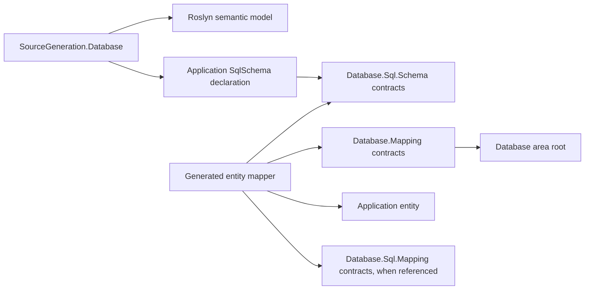

# Database mapper generator design

## Intent and ownership

The generator turns retained C# SQL declarations into static object mapping. It does not execute
application callbacks in the compiler and does not invent a second schema. Semantic analysis
resolves the real `SqlSchema.Create`/`Compile` calls, including static imports, and binds the
builder calls and selected CLR members. The resulting private generator model is a lowering of
those declarations, not another application-maintained database description.

The dependency diagram shows the compiler component and generated runtime code separately:

| Component | Responsibility |
| --- | --- |
| `Assimalign.Cohesion.SourceGeneration.Database` | Compiler-only declaration analysis, diagnostics and source emission |
| `Assimalign.Cohesion.Database.Sql.Schema` | Existing retained and compiled schema authority |
| `Assimalign.Cohesion.Database.Mapping` | Store-neutral identity, snapshot comparison, materialization and atomic save contracts |
| Generated entity mapper | Direct member access, schema ordinal conversion, key extraction, detached snapshots and relational metadata |

The generator references Roslyn packages, not the `net10.0` schema/runtime assemblies. It reads
their symbols in the consuming compilation, so it stays loadable in the sanctioned
`netstandard2.0`, `IsAotCompatible=false` compiler host. Generated code makes direct calls and
casts; it emits no `Type`, `typeof`, reflection, expression compilation, dynamic code or query
translation.

## Declaration subset and fail-closed behavior

Generation explicitly opts in through the compiler-visible MSBuild property
`CohesionGenerateDatabaseMappers=true`. The Database SDK supplies the property visibility and
framework analyzer payload. Default absence, false and malformed values leave schema-only
applications untouched, even when the framework makes mapping contracts available. This is a
build behavior switch, not mapping metadata. Generator tests cover disabled declarations that
would otherwise be rejected, proving both generated output and diagnostics remain absent.

Schema and table callbacks must be inline lambdas or source-declared methods/local functions with
one builder parameter. Their bodies contain direct calls on that parameter. Expressions and
blocks are both supported. Named arguments and constant table names are supported. Conditions,
loops, builder aliases, callback delegates stored in variables, helper composition and callbacks
from referenced assemblies produce `COHMAP001`. They cannot be statically lowered safely without
an execution model, so the generator does not guess which declarations execute.

`Column`, `Key`, `PrimaryKey`, `Index` and `References` all select a direct member. As in the real
builder, the first mention establishes column order, repeated mentions are deduplicated, and the
last key declaration determines the primary key. Indexes and references contribute their selected
column, and their declarations are retained for compiled table metadata and relationship ordering. Functions, triggers, principals, custom type
declarations and extensions retain their existing schema ownership; their runtime behavior is not
part of entity mapping. A custom scalar selected into an entity is diagnosed until a deliberate
conversion contract is supplied by model-specific work.

Entities are accessible, concrete, non-generic classes with an accessible parameterless
constructor. Selected members are readable and writable fields or properties, including init
properties. Required members must all appear in the declaration. Unsupported construction,
members, custom scalars, inaccessible members and file-local classes produce `COHMAP002`. The
nested snapshot reserves `Snapshot`, `Matches`, `BytesEqual` and names beginning `_value`; selecting
one produces the same focused diagnostic instead of uncompilable generated code.

A mapper needs a declared, immutable scalar primary key. Nullable and binary keys produce
`COHMAP003`. String keys are statically non-null and checked on extraction. One entity may appear
in multiple identical declarations, yielding one mapper. Different table names, column order or
keys for that entity produce `COHMAP004`. Mapper names are `<Entity>Mapper` in the entity namespace;
nested entities use their enclosing names joined by underscores. Name collisions with another
entity or an existing application type are diagnosed. Source hint names use a bounded prefix and
deterministic SHA-256 identity suffix to avoid collisions between dotted and underscored namespace
names and filesystem component limits.

SQL adapter keys additionally exclude `float`, `double`, `DateTime` and `DateTimeOffset` with
`COHMAP003`. SQL equality promotes floating-point values to Decimal, while temporal equality
ignores `DateTime.Kind` or `DateTimeOffset.Offset`; stored identity preserves representations that
those predicates cannot distinguish. An UPDATE or DELETE could otherwise address the wrong key
or fail to address an existing key. These types remain supported as ordinary SQL columns and as
core-only mapping keys, where the adapter chooses its identity/predicate semantics.

Relational consistency is checked within each schema callback. Duplicate table names and CLR row
types, case-insensitive column collisions, duplicate indexes/references, missing foreign-key
targets and foreign-key storage type mismatches produce `COHMAP005`. A target declared only in
another schema does not satisfy a reference. Nullable foreign keys are allowed; storage types
must match, including CLR `byte` and `short` sharing SQL `Int16`. Primitive custom-type overrides
are rejected when used by a mapped column because they would invalidate emitted scalar casts.
Repeated declarations of one entity must agree on indexes, foreign-key targets and target table
names as well as columns and keys. Invalid schema callbacks emit no mappers.

The SQL adapter quotes identifiers. The engine lexer cannot escape a double quote inside a quoted
identifier, so SQL mapper table names containing double quotes or NUL produce `COHMAP005`.
Unsupported SQL is rejected before emission. C# member names cannot contain either character.

## Materialization and ownership

Readers accept `IReadOnlyList<object?>`; writers fill an existing `IList<object?>` of exactly the
declared column count. This is the SQL declaration's ordinal value shape and does not constrain
the generic materialization contracts. Supported members are Boolean, signed integer primitives,
`byte`, floating-point primitives, `decimal`, `string`, `byte[]`, `DateOnly`, `TimeOnly`, `DateTime`,
`DateTimeOffset`, `TimeSpan`, `Guid`, and nullable value-type equivalents.

Values use the retained compiler's storage types. In particular CLR `byte` maps to SQL `Int16`:
writers box `short`, readers perform checked narrowing and reject values outside 0–255. Other
supported scalars cast directly to their declared storage representation. Nulls follow the
retained schema: reference members can receive null even if their C# annotation is non-null;
nullable value types retain null; a null non-nullable value fails its cast. Shape, cast and
overflow failures surface as ordinary argument/cast/overflow exceptions. Reading a null string
key does not invent an identity: `GetKey` rejects it when tracking/extracting identity.

Binary arrays are owned separately by the source entity, emitted value sequence, materialized
entity and snapshot. Capture copies bytes. Snapshot getters return copies, so a persistence
adapter cannot mutate captured state. `Snapshot` exposes one typed getter for every selected
member because atomic writes must use captured values rather than a subsequently mutated entity.

## Change detection

Snapshots compare only declared members. Scalars use typed value equality; strings are ordinal.
Binary arrays use content equality, with null distinct from empty. `DateTime` compares ticks and
kind, and `DateTimeOffset` uses exact value-and-offset equality, including nullable forms,
because those representations survive database serialization. Floating-point values use .NET
value equality: negative zero and positive zero compare equal, as do NaN representations.

Undeclared state, navigation objects, collection graphs, event handlers, setters' side effects and
transient mutations reverted before capture are not tracked. The generator emits no proxies or
mutation interception. Identity changes are exposed by `GetKey`; the unit of work decides whether
they are legal for its already tracked entities.

## SQL adapter and AOT schema deployment

When the consuming compilation references `Database.Sql.Mapping.ISqlEntityMapping`, the same
mapper implements that interface, which extends the core mapper/reader/writer contracts. It adds
the retained `TableName`, ordered `ColumnNames` and `ColumnTypes`, `KeyColumnName`, distinct `ReferencedTables`, and
`WriteSnapshot`. Snapshot writes use captured values and the same checked storage conversions and
binary ownership as entity writes. The runtime adapter supplies change writers and transaction
ordering; the generator emits no connection or transaction implementation.

Nested `Columns` exposes one `SqlColumn<TEntity,TValue>` per mapped member. These statically typed
values feed the adapter's limited predicate and ordering surface. No expression trees or query
provider are emitted. `ColumnTypes` lets the runtime validate even manually constructed column
tokens against the generated storage type before compiling a query. A member named `Columns` is diagnosed because it conflicts with that nested
type's generated member name.

Static `SchemaTable` supplies a `CompiledSchemaTable` from those same declarations, including the
canonical CLR row identity, ordered storage types and nullability, primary key, secondary indexes
and foreign-key constraints. Reference nullability follows the retained builder's CLR behavior:
reference members are nullable regardless of C# nullable annotations. This property permits an AOT
application to construct `SqlCompiledSchema` for deployment without executing the metadata-based
schema callback. It emits only the mapped table, not unrelated functions, triggers, principals,
custom types or extensions. Applications must include every required generated table when
assembling the compiled schema; the compiled-schema validator checks references.

Tests compare the entire canonical document of generated tables against `SqlSchema.Compile`,
including nested CLR row identities, quoted identifiers containing spaces, indexes, nullable
foreign keys, and `byte`/`short` storage compatibility. The SQL mapper NativeAOT guard deploys these
generated tables and exercises the mapper through the real engine. The declaration method is
compiler input and is never executed in that guard.

## Evidence and extension boundaries

Generator tests execute real `SqlSchema.Compile`, verify ordered compiled columns, storage types
and primary keys, emit a complete assembly and execute mapper round trips. The test harness alone
uses reflection to invoke that dynamic test assembly. It is never part of shipped runtime code.
Mutation tests cover detached binary state, scalar/null changes, undeclared state, exact temporal
representation and checked storage conversions. Diagnostic tests cover unsupported declarations,
unmaterializable members, missing/mutable keys and conflicting schemas/names.

The NativeAOT guard under the Mapping library's `samples/` compiles the same declaration shape
without invoking the pre-existing schema builder at runtime, then runs generated materialization,
identity, snapshots and transactional save. This proves the mapper runtime after trimming. It
does not broaden the claim to execution of the existing metadata-based schema compiler itself.

`Database.Sql.Mapping` owns SQL query generation, explicit relationship queries, ownership
enforcement and the real SQL transactional writer. `#1009` can compare snapshot members for partial document
updates without importing table semantics. `#1010` can implement the same generic reader contract
with a path-shaped source; nothing in the core requires this generator's ordinal sequence.
`#1011` should compose typed serializers and streaming accessors directly and need not acquire a
unit of work or a query surface. The unresolved cross-model work is adapter-specific transaction
capability and representation, not a requirement for a shared query language.
