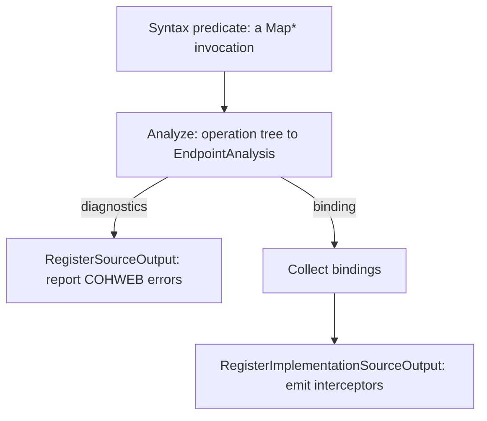

# Assimalign.Cohesion.SourceGeneration.Web Design

## Design Intent

This project is a build-time Roslyn source generator that gives `Assimalign.Cohesion.Web.Api` its
typed-delegate endpoint binding. Because the framework targets NativeAOT, binding must be generated —
no reflection over handler signatures and no `Expression.Compile`. The generator is the AOT-sanctioned
path (ASP.NET reached the same conclusion with `RequestDelegateGenerator`).

Like every project under `analyzers/`, it targets `netstandard2.0` with `IsAotCompatible=false` and
`EnablePreviewFeatures=false` — the one sanctioned exception to the repo-wide TFM/AOT defaults, because
the compiler loads generators as netstandard2.0 components. It ships no NuGet package of its own; the
consuming library bundles the DLL under `analyzers/dotnet/cs/` (see delivery below).

## What It Intercepts

`EndpointBindingGenerator` is an `IIncrementalGenerator`. Its syntax predicate cheaply matches
`Map`/`MapGet`/`MapPost`/`MapPut`/`MapPatch`/`MapDelete` invocations in every form a call can take: a
member access (`app.MapGet(...)`), a member binding under a conditional access (`app?.MapGet(...)`),
and the static form, which is a member access on the extension class
(`WebApplicationPipelineBuilderExtensions.MapGet(app, ...)`, `RouterGroupBuilderEndpointExtensions.MapGet(group, ...)`).
Before #1175 the predicate matched only a member access and the transform read the receiver from it,
so a conditional-access call was never seen and a static-form call produced an interceptor typed over
the static class; both reached the throwing placeholder or broke the build. The semantic transform then
keeps only the calls that resolve to a typed overload — one whose handler parameter is `System.Delegate`
(the `WebApplicationMiddleware` overloads are registered verbatim and ignored). A static-form call binds
the extension block's implementation method directly, so its receiver is that method's first parameter
rather than the block's extension parameter; both resolve to the same interceptor signature.

The transform reads the call through the compiler's operation tree (`IInvocationOperation`), not the
symbol API. Two reasons. A method group converted to `System.Delegate` has no symbol of its own (the
semantic model reports it only as an overload-resolution candidate), while its `IDelegateCreationOperation`
carries the target method and the delegate type the compiler inferred. And arguments resolve through
the parameters they bind to, so named arguments in any order work. The handler's own delegate type
(its natural `Func<...>`/`Action<...>`, or a delegate type the caller created explicitly) is the type
the interceptor casts to, so the cast always matches the runtime delegate.

For each typed call site the transform produces an `EndpointAnalysis`: either an equatable
`EndpointBinding` model — the interceptable location, the interceptor's receiver shape, whether an explicit
`HttpMethod` parameter is present, the handler's delegate type, its return shape, how the returned
value is written, and a classified `ParameterBinding` per handler parameter — or the diagnostics that
explain why the call site cannot be rewritten (see "Diagnostics"). Only a call site the compiler itself
rejects (an unresolved type, an invalid handler expression) produces neither, because the compiler
already reports it.



Diagnostics go through `RegisterSourceOutput`, so the IDE shows them while the code is typed; the
interceptors are implementation-only output.

## Parameter Classification

Per parameter, in order: direct injections (`IHttpContext`, `IHttpRequest`, `IHttpResponse`,
`CancellationToken`, `IHttpFeature` implementations) win first — the request and response since #1176,
before which they fell through to the complex-type convention and bound from the body; then an explicit `[From*]` attribute; then convention (route-token name
match → route, scalar → query, complex → body). When the call site cannot see the whole template, a
scalar the visible template does not name binds **route-or-query** instead of query (#1055): route
values first, then the query string. The call site cannot see the whole template when the receiver
is an `IRouterGroupBuilder`, whose prefix is declared elsewhere, or when the pattern argument is not
a string literal. Scalar-ness is decided by `System.IParsable<T>`,
enum-ness, `string`, and `Nullable<>` of those. The model stores fully-qualified type strings so the
emit phase needs no symbols and incremental caching stays value-based (via `EquatableArray<T>`).

## Emission

The generator emits one file, `EndpointBinding.Interceptors.g.cs`, containing a file-local
`InterceptsLocationAttribute` shim (in `System.Runtime.CompilerServices`) and a `file static class` of
interceptors in `Assimalign.Cohesion.Web.Api.Generated`, produced through `RegisterImplementationSourceOutput`.
Each interceptor:

- Casts the `Delegate` to the handler's delegate type and invokes it directly (AOT-safe).
- Emits inline binding per parameter: route (`TryGetRouteValues` + boxed fast-path/`TryParse`
  fallback), query/form (`TryGetValue` + `TryParse`), header (`GetValue` + `TryParse`), body, and
  direct injections. The body is probed through the registry's non-throwing lookup first: a missing or
  unparseable `Content-Type`, or one `IHttpContentSerializationFeature.GetReader` has no reader for,
  is a 415. `ReadContentAsync<T>` then reads it, and a `JsonException` is a 400. An
  `HttpContentSerializationException` from the read is not caught (#1173): after the probe it can only
  mean no registry at all or a reader with no contract for the type, a composition fault that reaches
  the exception boundary exactly as it does when a returned value is written.
- Writes the value the handler returns, if any (see "Returned Values").
- Chains the endpoint's description onto the mapped route (see "Endpoint Descriptions").
- Registers the thunk through the raw `Map` overload — which binds to `WebApplicationMiddleware`, not
  the typed overload, so generated registration is never itself intercepted — and returns the raw
  overload's `IRouterRouteBuilder`, the intercepted overload's return type (#1055), so the caller's
  `.WithMetadata(...)`/`.WithName(...)` chain applies to the generated route.
- Takes the intercepted method's own receiver parameter as its `this` parameter, after type
  substitution, not the static type of the receiver expression (#1174). The `Map*` verbs are C# 14
  extension-block members, so the receiver is the block's extension parameter
  (`ContainingType.ExtensionParameter`) and the signature the interceptor matches is the block's
  static implementation method (`AssociatedExtensionImplementation`). An application call takes the
  application's type (`TBuilder` of `extension<TBuilder>(TBuilder builder)`, substituted); a group call
  takes `IRouterGroupBuilder` even when the receiver is a `TGroup : IRouterGroupBuilder`, whose raw `Map`
  overload lives in Web.Api's `RouterGroupBuilderEndpointExtensions`.
- Is generic when generated code cannot name the receiver: a type parameter (a reusable
  `MapModule<TApp>(TApp app)` calling `app.MapGet`) or an inaccessible application type. The
  interceptor then repeats the implementation's type parameter list and constraints
  (`Intercept_0<TBuilder>(this TBuilder builder, ...) where TBuilder : ...`), and the compiler constructs
  it with the call site's type arguments, so the receiver is never spelled out. Before #1174 the
  generator wrote `this TApp builder`, which does not compile outside `TApp`'s method. A receiver it can
  name keeps the plain, non-generic interceptor.

Conversions use `IParsable<T>.TryParse` / `Enum.TryParse<T>` with `InvariantCulture`, so no runtime
binder helper is required and the emitted code carries no reflection.

Every binding key reaches the emitted code as a C# string literal produced by
`SymbolDisplay.FormatLiteral` — the route, query, header and form reads, the `errors` key of a 400,
and the description name alike (#1172). Keys come from attribute `Name` values, which may hold any
character; spliced between quotes, a `"` or `\` would break the build on code the application did not
write, or bind a different key than the one declared.

## Returned Values (#1059)

The return shape is read from the delegate type's `Invoke` method: `void`, `Task` and `ValueTask` are
awaited (when asynchronous) and nothing more; `T`, `Task<T>` and `ValueTask<T>` produce a value the
thunk stores in a `__result` local of the declared result type and then writes:

- **Null check.** For a reference type or a `Nullable<T>`, `if (__result is null)` sets
  `204 No Content` when the status is still the default 200 and returns without a body. A non-nullable
  value type gets no check.
- **Text.** A `string` is written as UTF-8 to `context.Response.Body`, under `text/plain; charset=utf-8`
  unless the handler already set a `Content-Type`. It needs no serialization registry.
- **Negotiated.** Anything else is written with `context.WriteNegotiatedContentAsync<TWritten>(value, ...)`,
  where `TWritten` is the result type without its top-level nullable annotation, or the underlying type
  of a `Nullable<T>` (written as `__result.Value`), so one registered contract serves both `int` and
  `int?`. The status is untouched; the writer handles negotiation, `Vary: Accept` and the bodyless 406.

The model records the result type and the written type as display strings plus a `ResponseKind`
(`None`, `Text`, `Serialized`) and a `ResultNullCheck`, so the emit phase needs no symbols. The runtime
contract — why `null` is 204, why `string` is text, what happens without a contract — is the
`Web.Api` DESIGN's "Return Values" section.

## Endpoint Descriptions (#152 groundwork)

Every interceptor chains one `.WithMetadata(...)` call onto the route it maps, before the antiforgery
requirement and before the caller's own chain:

```csharp
})
.WithMetadata(
    new global::Assimalign.Cohesion.Web.EndpointParameterMetadata("id", global::Assimalign.Cohesion.Web.EndpointParameterSource.Route, typeof(global::System.Int64), true),
    new global::Assimalign.Cohesion.Web.EndpointResponseMetadata(global::Assimalign.Cohesion.Http.HttpStatusCode.Ok, typeof(global::Order), null),
    new global::Assimalign.Cohesion.Web.EndpointResponseMetadata(global::Assimalign.Cohesion.Http.HttpStatusCode.NoContent, null, null))
```

- **Parameters.** One item per parameter whose `BindingSource` is a request source; injections are
  skipped. The name is the binding key, emitted with `SymbolDisplay.FormatLiteral`. The type is the
  declared type in a display format without nullable reference annotations (`ParameterBinding.DescribedType`),
  because `typeof(string?)` does not compile; `Nullable<T>` keeps its `?`. `IsRequired` is the
  binding's own required flag, and `true` for a body.
- **Responses.** A `200` with `typeof(written type)` (`null` for `void`/`Task`/`ValueTask`) and
  `HttpMediaType.TextPlain` for a string; a `204` when `EndpointBinding.DescribesNoContent` is set.
- **When the result may be null.** A `Nullable<T>` always lists the 204. For a reference type, the
  annotation of the delegate's return or the handler's declared return decides when it is `Annotated`.
  An implicitly typed lambda's inferred return type is nullable-oblivious even in an enabled context,
  so for a lambda the generator also reads the null-state (`TypeInfo.Nullability.FlowState`) of each
  value the lambda itself returns — returns inside a nested lambda or local function are skipped — and
  a maybe-null value lists the 204. Without this, `(long id) => orders.Get(id)` returning `Order?`
  would describe no 204, and treating "oblivious" as nullable would describe one on every lambda.

The contract the metadata carries for its readers is the `Web.Api` DESIGN's "Endpoint Description
Metadata" section.

## Diagnostics (#1059)

A typed call site the transform cannot model becomes compile-time errors instead of a silent
fall-through to the throwing placeholder. The transform collects every problem it finds in one handler
(a parameter that cannot bind does not hide a bad return type), and a call site with any diagnostic
emits no interceptor; the others in the compilation are still emitted.

| ID | Condition |
| --- | --- |
| COHWEB0001 | The handler is a delegate instance, not a lambda or method group: no `IDelegateCreationOperation`, or one whose target is itself a delegate instance (`new Func<int, string>(existing)`, silently skipped before #1175) |
| COHWEB0002 | The return type cannot be written (`async void`, a stream, an awaitable that is not `Task`/`ValueTask`, an anonymous type, a ref struct, `dynamic`, a pointer, a by-reference return, a type parameter, an inaccessible type) |
| COHWEB0003 | A parameter cannot be bound: a scalar source on a complex type, a by-reference modifier, a default value or `params` array that forced an anonymous delegate type, or a type generated code cannot name or bind |
| COHWEB0004 | A second request-body parameter |
| COHWEB0005 | A request-body parameter alongside form fields |
| COHWEB0006 | An anonymous delegate type with no parameter-level cause (more than 16 parameters), or an explicitly created delegate type generated code cannot name |
| COHWEB0007 | A body parameter or a serialized result, but the compilation cannot name `Web.Serialization`'s request reader or negotiated writer |

Mechanics, following the house convention (`OpenApi.SourceGeneration`, `SourceGeneration.ComponentModel`):

- **Descriptors** live in `Internal/EndpointBindingDiagnostics.cs`, category `Web`, all `Error`.
  Messages name the endpoint (`MapGet("/orders/{id}")`), the problem, and what to write instead. Each
  descriptor is listed in `AnalyzerReleases.Unshipped.md` (release tracking, enforced by
  `Microsoft.CodeAnalysis.Analyzers`).
- **Captured, not created, in the transform.** `Internal/DiagnosticInfo.cs` stores the descriptor id,
  a serializable location and the message arguments, so the pipeline model stays value-equatable and
  incremental caching keeps working; the reporting step resolves the descriptor and creates the
  `Diagnostic`.
- **Locations.** Handler-level problems point at the handler: a lambda's parameter list and arrow, or
  the method-group expression. A lambda parameter's problem points at the parameter; a method group's
  parameters are declared away from the call site, so theirs point at the method group.
- **Type rules** (`Internal/HandlerTypeRules.cs`) decide whether generated code can name a type (an
  anonymous type, a type parameter, a pointer, or a private, protected or file-local type cannot be
  named from the generated file's class) and whether a result can be written.
- **Anonymous delegate types.** A default value, a `params` array, a by-reference parameter or more
  than 16 parameters make the compiler infer an anonymous delegate type for the lambda or method group,
  which the interceptor cannot name in its cast. The transform reports the parameter-level cause when
  there is one (COHWEB0003) and COHWEB0006 otherwise.
- **Packages resolved by name.** Like the antiforgery requirement, `Web.Serialization` is not referenced
  by the generator: COHWEB0007 fires when the consuming compilation cannot resolve
  `HttpRequestSerializationExtensions` (for a body) or `HttpContentNegotiationExtensions` (for a
  serialized result). A `string` result does not need it.

## Antiforgery on Form-Bound Endpoints (#1057)

A call site with a `[FromForm]` parameter (`EndpointBinding.UsesForm`) is the request a cross-site page
can forge, so its interceptor chains
`.WithMetadata(global::Assimalign.Cohesion.Web.Antiforgery.AntiforgeryMetadata.Required)` onto the route
the raw `Map` overload returns. `UseAntiforgery` then validates the endpoint's unsafe requests, and
routing fails the endpoint at dispatch when the middleware did not process it.

- **Emitted only when the application can name it.** The generator does not reference
  `Web.Antiforgery`. The transform resolves `AntiforgeryMetadata` by metadata name in the consuming
  compilation and records `EndpointBinding.RequiresAntiforgery` only when the type resolves, is
  accessible, and exposes a public static `Required`. An application without the package compiles as
  before and needs no `UseAntiforgery`; every `Sdk.Web` application has it through `App.Web`.
- **Route-level metadata.** The requirement is attached where the route is mapped, so it is more specific
  than any route-group declaration, and the caller's own `.DisableAntiforgery()` (chained after the
  interceptor's return) still wins under last-wins resolution.
- **Driven by `UsesForm`, not by the HTTP method.** A `Map(method, ...)` call site has no static method,
  and a safe-method request passes the middleware anyway. A future form-file binding source that sets
  `UsesForm` inherits the requirement.

## Delivery

The generator is consumed exactly like the base `SourceGeneration` generator:

- In-repo and test projects add `<CohesionAnalyzerReference Include="Assimalign.Cohesion.SourceGeneration.Web" />`,
  which activates the analyzer at compile time and bundles the DLL into the consuming library's own
  `.nupkg`.
- Sdk.Web consumers get it through the `<CohesionFrameworkAnalyzer Include="Assimalign.Cohesion.SourceGeneration.Web" />`
  entry in the `App.Web` member list (`resources/Web/Assimalign.Cohesion.Web.Runtime/Directory.Build.props`),
  bundled at `analyzers/dotnet/cs/` inside `App.Web.Ref`.

Consumers must allow-list the generated namespace with
`<InterceptorsNamespaces>$(InterceptorsNamespaces);Assimalign.Cohesion.Web.Api.Generated</InterceptorsNamespaces>`
(the interceptor feature's opt-in), which the Web.Api test project demonstrates.

## Testing

`tests/` drives the generator with a hand-rolled `CSharpGeneratorDriver` and asserts on the emitted
source and the reported diagnostics. A case models an application with or without `Web.Antiforgery`
or `Web.Serialization` by adding or withholding that assembly from the compilation's references.
Cases compile the generated code with interceptors enabled (the antiforgery requirement, every
supported return shape, method groups), and every `COHWEB` diagnostic has a case that asserts its
severity, message and location. The call-shape cases (generic, conditional-access and static-form
receivers) also ask the output compilation, through `SemanticModel.GetInterceptorMethod`, whether
every call that binds a typed placeholder is intercepted, so no shape can silently fall through to it. Runtime behavior — real requests through every binding source, the
400/415 outcomes, injection, every return shape with its 204/406/fault outcomes, and the description
metadata read back from the built route table — is proven end-to-end in
`Assimalign.Cohesion.Web.Api/tests` against the in-memory `WebApplicationTestFactory`;
the antiforgery requirement on form-bound endpoints is proven in `Assimalign.Cohesion.Web.Antiforgery/tests`.

## Non-Goals

Result types, filter chains and OpenApi emission are out of scope for v1 (see `Web.Api/docs/DESIGN.md`).
A returned value is written as plain data; there is no result abstraction for the generator to
recognize. The generator emits neutral description metadata, never OpenApi types: the OpenAPI adapter
(#152) maps the description onto its own model.
