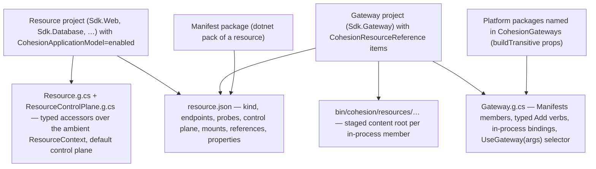
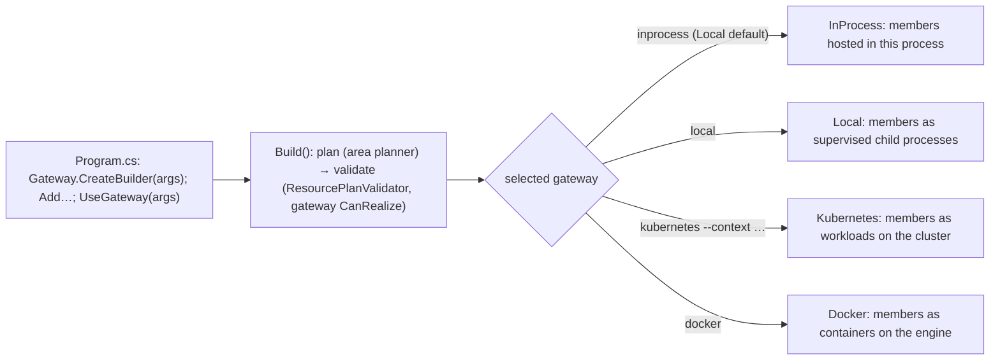
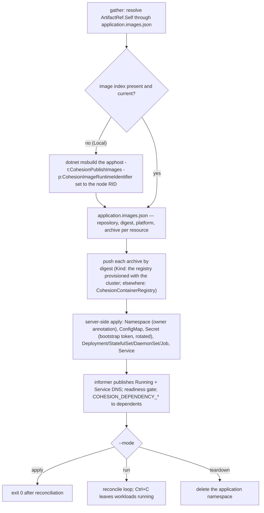

# Application model: build and deploy flow

This is the visual companion to §4 of the
[developer-experience design](DEVELOPER_EXPERIENCE_DESIGN.md) and to §7–§8 of the
[ApplicationModel architecture record](libraries/ApplicationModel/DESIGN.md). Those documents are
the direction of record; this one draws the flow they describe, from an SDK build through the
three ways one apphost realizes the same model: in this process, as local child processes, and on
a live Kubernetes cluster. Every fact here is stated in prose as well, so the diagrams are a second
view, not the only one.

## 1. Build plane: what the SDKs generate

A resource is an ordinary executable on an area SDK with `CohesionApplicationModel=enabled`. A
gateway is an executable on `Sdk.Gateway` that references those resources. Nothing about a target
platform is decided at build time.

- The resource build writes `resource.json` and the generated `Resource` and `ResourceControlPlane`
  classes. `artifact.image` stays empty: image identity is gateway-owned (O37).
- The gateway build reads every referenced manifest and emits `Gateway.g.cs`: the `Manifests`
  members, one typed `Add<Name>()` verb per resource, the in-process entry bindings (registered by
  both the verb and `Gateway.CreateBuilder`, B38), and the `UseGateway(args)` selector over the
  providers that the platform packages contribute. Cohesion source never names a platform type.
- With `CohesionGatewayInProcess=true`, the referenced resources become real runtime references and
  their declared content is staged under `bin/cohesion/resources/<name>/`.

## 2. Run plane: one selector, three realizations

`Program.cs` composes the model once. The environment and gateway are run-time selections; an
unset environment is `Local`, and in `Local` an unset gateway is the first `CohesionGateways`
entry (O36). `Build()` plans and validates every resource for the selected gateway before anything
is realized.

## 3. Local: in process and as child processes

Both local gateways realize the plan on the developer's machine from build output; neither
publishes an image.

```mermaid
flowchart TD
    subgraph InProcess["InProcess gateway"]
        I1["validate: artifact.composable and an entry binding"] --> I2["invoke the member's Program.Main on its own thread under an ambient ResourceContext"]
        I2 --> I3["adopt the IHost the area builder returns; probe its default control plane"]
        I3 --> I4["loopback ports persisted in .cohesion/app/.state/ports.json; Ctrl+C stops members in reverse order"]
    end
    subgraph Local["Local gateway"]
        L1["build each referenced resource project"] --> L2["launch the apphost as a child process with the COHESION_* environment"]
        L2 --> L3["materialize mounts, settings, and the bootstrap credential under .cohesion/app/resource/"]
        L3 --> L4["probe /readyz, inject COHESION_DEPENDENCY_*, supervise; Ctrl+C → stop event → grace → kill"]
    end
```

The member code is identical in both: the area builder honors the ambient `ResourceContext`
(endpoints, mounts, settings, references, bootstrap credential) whichever gateway supplied it.
See [RUNTIME_CONTRACT.md](RUNTIME_CONTRACT.md) for the `COHESION_*` variables the Local gateway
sets and the in-process gateway projects.

## 4. Live cluster: publish, push, apply, reconcile

The Kubernetes gateway is the only path that produces and moves artifacts. In `Local` it publishes
stale images itself with the target node's architecture (O38) and pushes them by digest to a
registry the cluster can pull from (O39). In a deployed environment the pipeline supplies the
context, kubeconfig, and registry.

- The SDK's input fingerprint decides staleness, so a repeat apply reports the image current and
  skips the publish; server-side apply with restored `apiVersion`/`kind` updates in place with
  unchanged UIDs (B36).
- `--mode render` compiles the same objects offline from an explicit index and never contacts the
  cluster; `--mode describe` emits the model document without realizing anything.
- The pod pulls by digest. Pods default to `runAsNonRoot` with uid 1654 so the projected `0400`
  bootstrap token is readable (B34).

## 5. Where the paths diverge

| | InProcess | Local | Kubernetes |
| --- | --- | --- | --- |
| Unit of realization | adopted host in the gateway process | child process | Deployment / StatefulSet / DaemonSet / Job |
| Artifact | gateway build output | resource build output | container image, published if stale, pulled by digest |
| Endpoints | persisted loopback ports | persisted loopback ports | ClusterIP Service; public exposure realized by the platform |
| Inputs | ambient `ResourceContext` per invocation | `COHESION_*` environment + files under `.cohesion/` | ConfigMap + Secret projected into the pod |
| Readiness | member default control plane over loopback | `/readyz` over loopback | readiness/liveness/startup probes 1:1 from the plan |
| Stop | reverse-order member stop | stop event → grace → kill | `--mode teardown`; `run` leaves workloads on Ctrl+C |
| Repeat | new port lease | new process | in-place update, image skipped when current |

The first real deployment through this flow is the `docs.assimalign.com` landing zone; its
apphost-level view of the same flow is
[APPHOST_BUILD_AND_DEPLOY.md](https://dev.azure.com/assimalign/Core/_git/aaln-service-docs?path=/docs/APPHOST_BUILD_AND_DEPLOY.md)
in that repository.
