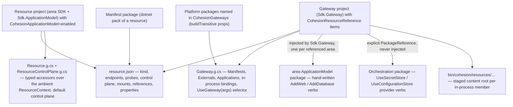
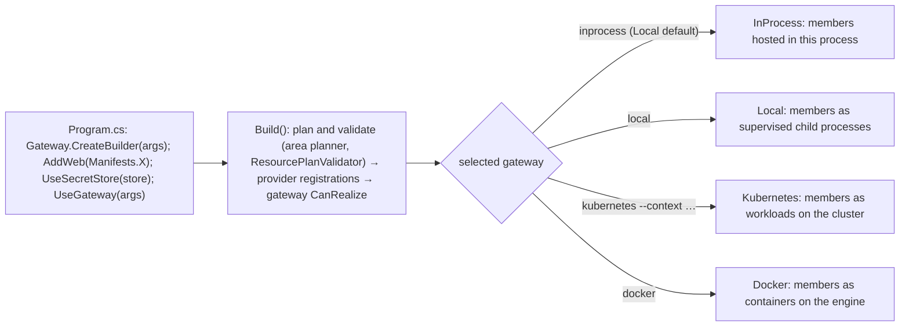
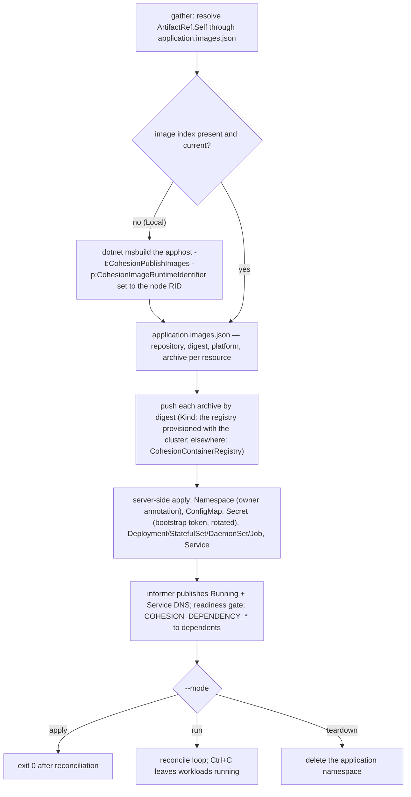

# Application model: build and deploy flow

This is the visual companion to §4 of the
[developer-experience design](DEVELOPER_EXPERIENCE_DESIGN.md) and to §7–§8 of the
[ApplicationModel architecture record](libraries/ApplicationModel/DESIGN.md). Those documents are
the direction of record; this one draws the flow they describe, from an SDK build through the
three ways one apphost realizes the same model: in this process, as local child processes, and on
a live Kubernetes cluster. Every fact here is stated in prose as well, so the diagrams are a second
view, not the only one.

## 1. Build plane: what the SDKs generate

A resource is an ordinary executable on an area SDK with `CohesionApplicationModel=enabled`. A
gateway is an executable on `Sdk.Gateway` that references those resources. Nothing about a target
platform is decided at build time. The general-purpose `Assimalign.Cohesion.Sdk` supplies common
.NET build tooling; the area SDK conditionally imports
`Assimalign.Cohesion.Sdk.ApplicationModel` to generate the resource outputs. Gateway imports that
SDK unconditionally because it is itself a Composite resource.

```mermaid
flowchart TD
    Resource["Resource project (area SDK + Sdk.ApplicationModel) with CohesionApplicationModel=enabled"] --> Manifest["resource.json — kind, endpoints, probes, control plane, mounts, references, properties"]
    Resource --> ResourceCode["Resource.g.cs + ResourceControlPlane.g.cs — typed accessors over the ambient ResourceContext, default control plane"]
    Gateway["Gateway project (Sdk.Gateway) with CohesionResourceReference items"] --> Manifest
    Gateway --> GatewayCode["Gateway.g.cs — Manifests, Externals, Applications, in-process bindings, UseGateway(args) selector"]
    Gateway -->|"injected by Sdk.Gateway, one per referenced area"| AreaModel["area ApplicationModel package — hand-written AddWeb / AddDatabase verbs"]
    Gateway -->|"explicit PackageReference, never injected"| Orchestration["Orchestration package — UseSecretStore / UseConfigurationStore provider verbs"]
    Gateway --> Staged["bin/cohesion/resources/… — staged content root per in-process member"]
    Package["Manifest package (dotnet pack of a resource)"] --> Manifest
    Providers["Platform packages named in CohesionGateways (buildTransitive props)"] --> GatewayCode
```

- The resource build writes `resource.json` and the generated `Resource` and `ResourceControlPlane`
  classes through `Assimalign.Cohesion.Sdk.ApplicationModel`. `artifact.image` stays empty: image
  identity is gateway-owned (O37).
- The gateway build reads every referenced manifest and emits `Gateway.g.cs`: the `Manifests`
  members, `Externals`, `Applications`, `References`, the in-process entry bindings (registered by
  manifest identity in `Gateway.CreateBuilder`, B38), and the `UseGateway(args)` selector over the
  providers that the platform packages contribute. Cohesion source never names a platform type.
- The gateway build generates **no per-resource verb**. `Program.cs` adds each resource with its
  area's hand-written verb over the generated manifest —
  `builder.AddWeb(Manifests.AppAApi, new WebResourceOptions { Replicas = 2 })` — or with
  `builder.AddResource(Manifests.<Name>)` for a kind that has no ApplicationModel package.
  `Sdk.Gateway` injects the `<Area>.ApplicationModel` package of every area whose resource project
  the gateway references, so the area verb is in scope. The generated `Add<Name>()` verbs, the
  `CohesionGatewayResourceKind` table, and the `COHGW003` fallback were withdrawn by the owner
  decisions of 2026-09-25 (R8 in the [developer-experience design](DEVELOPER_EXPERIENCE_DESIGN.md)).
- No provider package is injected. Store, certificate-authority, and trust-store providers come
  from the opt-in `<Area>.ApplicationModel.Orchestration` packages, which the gateway project
  references itself and registers in `Program.cs` (`builder.UseSecretStore(secrets).AsCertificateAuthority().AsTrustStore()`,
  `builder.UseConfigurationStore(config)`). A telemetry sink, a credential issuer, and extra
  control-plane caller authenticators are assigned on `builder.Providers`. No `<Area>.Client`
  package is injected either: a store's client reaches the gateway only transitively, through the
  Orchestration package it references, and resource commands travel through the gateway's generic
  control-plane command client.
- With `CohesionGatewayInProcess=true`, the referenced resources become real runtime references and
  their declared content is staged under `bin/cohesion/resources/<name>/`.

## 2. Run plane: one selector, three realizations

`Program.cs` composes the model once: it adds each resource through its area's hand-written verb,
registers the providers the application uses, and selects the gateway. The environment and gateway
are run-time selections; an unset environment is `Local`, and in `Local` an unset gateway is the
first `CohesionGateways` entry (O36). `Build()` plans and validates every resource, then checks the
provider registrations against the built graph — every `<source>:<key>` mount of the application's
own resources has a registered provider, every bound store is a resource of the application with the
provider's kind, and no source reaches another application — and finally asks the selected gateway
whether it can realize every plan. All of it happens before anything is realized.

```mermaid
flowchart LR
    Program["Program.cs: Gateway.CreateBuilder(args); AddWeb(Manifests.X); UseSecretStore(store); UseGateway(args)"] --> Build["Build(): plan and validate (area planner, ResourcePlanValidator) → provider registrations → gateway CanRealize"]
    Build --> Select{"selected gateway"}
    Select -->|"inprocess (Local default)"| InProcess["InProcess: members hosted in this process"]
    Select -->|"local"| Local["Local: members as supervised child processes"]
    Select -->|"kubernetes --context …"| K8s["Kubernetes: members as workloads on the cluster"]
    Select -->|"docker"| Docker["Docker: members as containers on the engine"]
```

## 3. Local: in process and as child processes

Both local gateways realize the plan on the developer's machine from build output; neither
publishes an image.

```mermaid
flowchart TD
    subgraph InProcess["InProcess gateway"]
        I1["validate: artifact.composable and an entry binding"] --> I2["invoke the member's Program.Main on its own thread under an ambient ResourceContext"]
        I2 --> I3["adopt the IHost the area builder returns; probe its default control plane"]
        I3 --> I4["loopback ports persisted in .cohesion/app/.state/ports.json; Ctrl+C stops members in reverse order"]
    end
    subgraph Local["Local gateway"]
        L1["build each referenced resource project"] --> L2["launch the apphost as a child process with the COHESION_* environment"]
        L2 --> L3["materialize mounts, settings, and the bootstrap credential under .cohesion/app/resource/"]
        L3 --> L4["probe /readyz, inject COHESION_DEPENDENCY_*, supervise; Ctrl+C → stop event → grace → kill"]
    end
```

The member code is identical in both: the area builder honors the ambient `ResourceContext`
(endpoints, mounts, settings, references, bootstrap credential) whichever gateway supplied it.
See [RUNTIME_CONTRACT.md](RUNTIME_CONTRACT.md) for the `COHESION_*` variables the Local gateway
sets and the in-process gateway projects.

Two fallbacks exist only in the `Local` environment. They are keyed on the environment, not on the
selected gateway, so both local gateways have them. An endpoint certificate mount without a source
gets its leaf from the gateway's development certificate authority when the application registers
no certificate authority, or while the registered one is not yet Running and able to issue. `cohesion trust add` writes to `.cohesion/<app>/trust/trusted-issuers.json` when
the application registers no trust store. In every other environment an unbound certificate
authority fails the endpoint loudly and `cohesion trust add` refuses the grant; there is no silent
downgrade to the development authority. The certificate-authority resource's own TLS leaf is the one
exception: it always comes from the gateway's authority, because that resource cannot issue its own
first certificate.

## 4. Live cluster: publish, push, apply, reconcile

The Kubernetes gateway is the only path that produces and moves artifacts. In `Local` it publishes
stale images itself with the target node's architecture (O38) and pushes them by digest to a
registry the cluster can pull from (O39). In a deployed environment the pipeline supplies the
context, kubeconfig, and registry.

```mermaid
flowchart TD
    Gather["gather: resolve ArtifactRef.Self through application.images.json"] --> Stale{"image index present and current?"}
    Stale -->|"no (Local)"| Publish["dotnet msbuild the apphost -t:CohesionPublishImages -p:CohesionImageRuntimeIdentifier set to the node RID"]
    Publish --> Index["application.images.json — repository, digest, platform, archive per resource"]
    Stale -->|"yes"| Index
    Index --> Push["push each archive by digest (Kind: the registry provisioned with the cluster; elsewhere: CohesionContainerRegistry)"]
    Push --> Apply["server-side apply: Namespace (owner annotation), ConfigMap, Secret (bootstrap token, rotated), Deployment/StatefulSet/DaemonSet/Job, Service"]
    Apply --> Observe["informer publishes Running + Service DNS; readiness gate; COHESION_DEPENDENCY_* to dependents"]
    Observe --> Mode{"--mode"}
    Mode -->|"apply"| Exit["exit 0 after reconciliation"]
    Mode -->|"run"| Watch["reconcile loop; Ctrl+C leaves workloads running"]
    Mode -->|"teardown"| Delete["delete the application namespace"]
```

- The SDK's input fingerprint decides staleness, so a repeat apply reports the image current and
  skips the publish; server-side apply with restored `apiVersion`/`kind` updates in place with
  unchanged UIDs (B36).
- `--mode render` compiles the same objects offline from an explicit index and never contacts the
  cluster; `--mode describe` emits the model document without realizing anything.
- The pod pulls by digest. Pods default to `runAsNonRoot` with uid 1654 so the projected `0400`
  bootstrap token is readable (B34).

## 5. Where the paths diverge

| | InProcess | Local | Kubernetes |
| --- | --- | --- | --- |
| Unit of realization | adopted host in the gateway process | child process | Deployment / StatefulSet / DaemonSet / Job |
| Artifact | gateway build output | resource build output | container image, published if stale, pulled by digest |
| Endpoints | persisted loopback ports | persisted loopback ports | ClusterIP Service; public exposure realized by the platform |
| Inputs | ambient `ResourceContext` per invocation | `COHESION_*` environment + files under `.cohesion/` | ConfigMap + Secret projected into the pod |
| Readiness | member default control plane over loopback | `/readyz` over loopback | readiness/liveness/startup probes 1:1 from the plan |
| Stop | reverse-order member stop | stop event → grace → kill | `--mode teardown`; `run` leaves workloads on Ctrl+C |
| Repeat | new port lease | new process | in-place update, image skipped when current |

The first real deployment through this flow is the `docs.assimalign.com` landing zone; its
apphost-level view of the same flow is
[APPHOST_BUILD_AND_DEPLOY.md](https://dev.azure.com/assimalign/Core/_git/aaln-service-docs?path=/docs/APPHOST_BUILD_AND_DEPLOY.md)
in that repository.
