<!--
    GENERATED FILE - DO NOT EDIT BY HAND.
    Regenerate with: pwsh build/scripts/Update-CohesionDependencyGraph.ps1
    Verify with:     pwsh build/scripts/Update-CohesionDependencyGraph.ps1 -Check
-->

# Dependency Graph

Every reference declared by every Cohesion project, read straight from the csprojs. This is
the 10,000-foot view: which assembly depends on which, which areas cross, and what the
most-depended-on assemblies are.

**This file is generated.** Edit the csprojs, then rerun the generator:

```bash
pwsh build/scripts/Update-CohesionDependencyGraph.ps1
```

An arrow always means "references" / "depends on", the same direction the dependency rules are
written in: `Web.Hosting --> Web` reads "`Web.Hosting` references `Assimalign.Cohesion.Web`".
The `Assimalign.Cohesion.` prefix is stripped from node labels; tables carry the exact names.

| | Count |
| --- | --- |
| Projects indexed | 647 |
| Shipped library/resource projects | 245 |
| Library areas | 21 |
| Resource areas | 18 |
| Declared project references | 584 |

## Ambiguous project names

More than one project file shares each of these base names. That matters beyond this
document: `CohesionProjectReference` resolves **by file name**
(`build/Targets/Build.References.Projects.targets`), so a reference to one of these names is
ambiguous and the winner is whichever the resolver indexed last. Where a name is shared by a
`src/` project and a harness, this document resolves it to the `src/` one.

| Name | Files |
| --- | --- |
| `Assimalign.Cohesion.Database.Cache.Tests` | `resources/Database/Assimalign.Cohesion.Database.Cache/src/Assimalign.Cohesion.Database.Cache.Tests.csproj`<br>`resources/Database/Assimalign.Cohesion.Database.Cache/tests/Assimalign.Cohesion.Database.Cache.Tests.csproj` |
| `Assimalign.Cohesion.Database.Graph.Language` | `resources/Database/Assimalign.Cohesion.Database.Graph.Language/src/Assimalign.Cohesion.Database.Graph.Language.csproj`<br>`resources/Database/Assimalign.Cohesion.Database.Graph.Language/tests/Assimalign.Cohesion.Database.Graph.Language.csproj` |
| `DisabledResource` | `sdks/Assimalign.Cohesion.Sdk.Gateway/Tasks/tests/TestProjects/DisabledResource/DisabledResource.csproj`<br>`sdks/Assimalign.Cohesion.Sdk/Tasks/tests/TestProjects/DisabledResource/DisabledResource.csproj` |
| `CohesionProject` | `tooling/templates/Assimalign.Cohesion.Templates/src/content/cohesion-composite/CohesionProject.csproj`<br>`tooling/templates/Assimalign.Cohesion.Templates/src/content/cohesion-configurationstore/CohesionProject.csproj`<br>`tooling/templates/Assimalign.Cohesion.Templates/src/content/cohesion-database/CohesionProject.csproj`<br>`tooling/templates/Assimalign.Cohesion.Templates/src/content/cohesion-gateway/CohesionProject.csproj`<br>`tooling/templates/Assimalign.Cohesion.Templates/src/content/cohesion-identityhub/CohesionProject.csproj`<br>`tooling/templates/Assimalign.Cohesion.Templates/src/content/cohesion-rezolvr/CohesionProject.csproj`<br>`tooling/templates/Assimalign.Cohesion.Templates/src/content/cohesion-secretstore/CohesionProject.csproj`<br>`tooling/templates/Assimalign.Cohesion.Templates/src/content/cohesion-spa/CohesionProject.csproj`<br>`tooling/templates/Assimalign.Cohesion.Templates/src/content/cohesion-web/CohesionProject.csproj` |

## Area roll-up

Which areas reference which, collapsed to one node per area. Resource areas sit on library
areas; library areas sit on each other in L1 dependency order. An area never appears as its
own target — intra-area references are in the per-area sections below.

**Depends on no other area:** `libraries/Content`, `libraries/Core`, `libraries/IdentityModel`, `libraries/ObjectValidation`, `libraries/Security`.

**Depends on `libraries/Core` and nothing else:** `libraries/Cache`, `libraries/Connections`, `libraries/DependencyInjection`, `libraries/Dns`, `libraries/FileSystem`, `libraries/Logging`, `libraries/ObjectMapping`, `libraries/ObjectPool`, `libraries/OpenTelemetry`.

Every remaining library area, with the resource areas collapsed into one node:

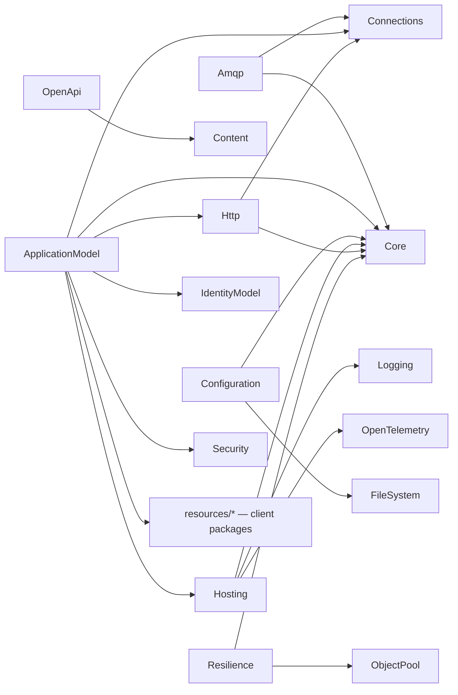

The edge into `resources/*` is the gateway consuming resource **client** packages to
orchestrate them; it is not an L2-on-L3 layering inversion. `COHRES003` enforces the
direction that matters — no shipped project under `resources/**` may reference an
`ApplicationModel.Gateway*` assembly.

| Area | References |
| --- | --- |
| `libraries/Amqp` | libraries/Connections, libraries/Core |
| `libraries/ApplicationModel` | libraries/Connections, libraries/Core, libraries/Hosting, libraries/Http, libraries/IdentityModel, libraries/Security, resources/ConfigurationStore, resources/Database, resources/IdentityHub, resources/LogSpace, resources/Rezolvr, resources/SecretStore, resources/Web |
| `libraries/Cache` | libraries/Core |
| `libraries/Configuration` | libraries/Core, libraries/FileSystem |
| `libraries/Connections` | libraries/Core |
| `libraries/Content` | _(none)_ |
| `libraries/Core` | _(none)_ |
| `libraries/DependencyInjection` | libraries/Core |
| `libraries/Dns` | libraries/Core |
| `libraries/FileSystem` | libraries/Core |
| `libraries/Hosting` | libraries/Core, libraries/Logging, libraries/OpenTelemetry |
| `libraries/Http` | libraries/Connections, libraries/Core |
| `libraries/IdentityModel` | _(none)_ |
| `libraries/Logging` | libraries/Core |
| `libraries/ObjectMapping` | libraries/Core |
| `libraries/ObjectPool` | libraries/Core |
| `libraries/ObjectValidation` | _(none)_ |
| `libraries/OpenApi` | libraries/Content |
| `libraries/OpenTelemetry` | libraries/Core |
| `libraries/Resilience` | libraries/Core, libraries/ObjectPool |
| `libraries/Security` | _(none)_ |
| `resources/ApiManager` | libraries/ApplicationModel, libraries/Connections, libraries/Core, libraries/Hosting, libraries/Http, resources/Web |
| `resources/ConfigurationStore` | libraries/ApplicationModel, libraries/Core, libraries/Hosting, libraries/IdentityModel, resources/Web |
| `resources/Database` | libraries/ApplicationModel, libraries/Connections, libraries/Core, libraries/Hosting, libraries/IdentityModel, resources/Web |
| `resources/EmailHub` | libraries/ApplicationModel, libraries/Connections, libraries/Core, libraries/Hosting, libraries/Http, resources/Web |
| `resources/EventHub` | libraries/ApplicationModel, libraries/Connections, libraries/Hosting, libraries/Http, resources/Web |
| `resources/IdentityHub` | libraries/ApplicationModel, libraries/Connections, libraries/Core, libraries/Hosting, libraries/Http, libraries/IdentityModel, resources/Web |
| `resources/IoTHub` | libraries/ApplicationModel, libraries/Connections, libraries/Hosting, libraries/Http, resources/Web |
| `resources/LoadBalancer` | libraries/ApplicationModel, libraries/Connections, libraries/Hosting, libraries/Http, resources/Web |
| `resources/LogSpace` | libraries/ApplicationModel, libraries/Connections, libraries/Core, libraries/Hosting, libraries/Http, libraries/IdentityModel, resources/Web |
| `resources/MediaHub` | libraries/ApplicationModel, libraries/Connections, libraries/Core, libraries/Hosting, libraries/Http, resources/Web |
| `resources/MessageHub` | libraries/ApplicationModel, libraries/Connections, libraries/Core, libraries/Hosting, libraries/Http, resources/Web |
| `resources/NatGateway` | libraries/ApplicationModel, libraries/Connections, libraries/Core, libraries/Hosting, libraries/Http, resources/Web |
| `resources/NotificationHub` | libraries/ApplicationModel, libraries/Connections, libraries/Core, libraries/Hosting, libraries/Http, resources/Web |
| `resources/Rezolvr` | libraries/ApplicationModel, libraries/Connections, libraries/Core, libraries/Hosting, libraries/Http, resources/Web |
| `resources/Scheduler` | libraries/ApplicationModel, libraries/Connections, libraries/Core, libraries/Hosting, libraries/Http, libraries/IdentityModel, resources/Web |
| `resources/SecretStore` | libraries/ApplicationModel, libraries/Connections, libraries/Core, libraries/Hosting, libraries/Http, libraries/IdentityModel, libraries/Security, resources/Web |
| `resources/VpnGateway` | libraries/ApplicationModel, libraries/Connections, libraries/Core, libraries/Hosting, libraries/Http, resources/Web |
| `resources/Web` | libraries/ApplicationModel, libraries/Cache, libraries/Configuration, libraries/Connections, libraries/Core, libraries/DependencyInjection, libraries/FileSystem, libraries/Hosting, libraries/Http, libraries/IdentityModel, libraries/Logging, libraries/Security |

## Areas

### `libraries/Amqp`

2 shipped projects.

| Project | References | Private references | Packages |
| --- | --- | --- | --- |
| `Assimalign.Cohesion.Amqp` | — | — | — |
| `Assimalign.Cohesion.Amqp.Connections` | `Assimalign.Cohesion.Connections`<br>`Assimalign.Cohesion.Core` | — | — |

### `libraries/ApplicationModel`

6 shipped projects.

Intra-area references:

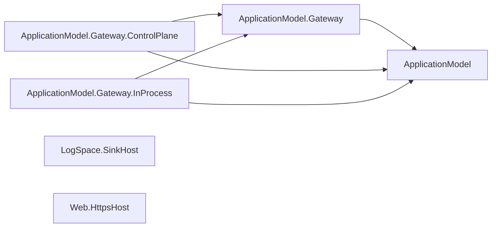

| Project | References | Private references | Packages |
| --- | --- | --- | --- |
| `Assimalign.Cohesion.ApplicationModel` | `Assimalign.Cohesion.Core` | — | — |
| `Assimalign.Cohesion.ApplicationModel.Gateway` | `Assimalign.Cohesion.ApplicationModel`<br>`Assimalign.Cohesion.ConfigurationStore.Client`<br>`Assimalign.Cohesion.Database.Client`<br>`Assimalign.Cohesion.Hosting.Resources`<br>`Assimalign.Cohesion.IdentityHub.Client`<br>`Assimalign.Cohesion.IdentityModel.Token.JsonWebToken`<br>`Assimalign.Cohesion.Rezolvr.Client`<br>`Assimalign.Cohesion.SecretStore.Client`<br>`Assimalign.Cohesion.Security.DataProtection` | — | `System.Security.Cryptography.ProtectedData` |
| `Assimalign.Cohesion.ApplicationModel.Gateway.ControlPlane` | `Assimalign.Cohesion.ApplicationModel`<br>`Assimalign.Cohesion.ApplicationModel.Gateway`<br>`Assimalign.Cohesion.Connections.Tcp`<br>`Assimalign.Cohesion.Core`<br>`Assimalign.Cohesion.Hosting.Resources`<br>`Assimalign.Cohesion.Http`<br>`Assimalign.Cohesion.Http.Connections`<br>`Assimalign.Cohesion.IdentityModel`<br>`Assimalign.Cohesion.IdentityModel.Token.JsonWebToken`<br>`Assimalign.Cohesion.Web.Routing` | — | — |
| `Assimalign.Cohesion.ApplicationModel.Gateway.InProcess` | `Assimalign.Cohesion.ApplicationModel`<br>`Assimalign.Cohesion.ApplicationModel.Gateway`<br>`Assimalign.Cohesion.Hosting`<br>`Assimalign.Cohesion.Hosting.Resources` | — | — |
| `Assimalign.Cohesion.LogSpace.SinkHost` | `Assimalign.Cohesion.Hosting.Resources`<br>`Assimalign.Cohesion.LogSpace.Hosting` | — | — |
| `Assimalign.Cohesion.Web.HttpsHost` | `Assimalign.Cohesion.Hosting.Resources`<br>`Assimalign.Cohesion.Web.Hosting` | — | — |

### `libraries/Cache`

2 shipped projects.

Intra-area references:

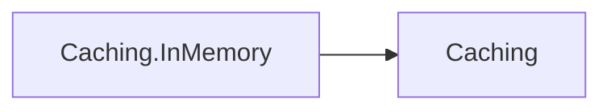

| Project | References | Private references | Packages |
| --- | --- | --- | --- |
| `Assimalign.Cohesion.Caching` | `Assimalign.Cohesion.Core` | — | — |
| `Assimalign.Cohesion.Caching.InMemory` | `Assimalign.Cohesion.Caching` | — | — |

### `libraries/Configuration`

7 shipped projects.

Intra-area references:

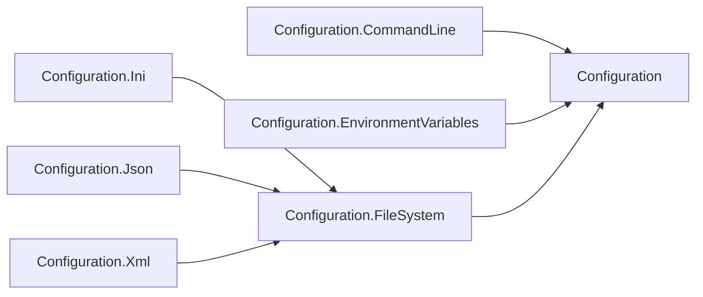

| Project | References | Private references | Packages |
| --- | --- | --- | --- |
| `Assimalign.Cohesion.Configuration` | `Assimalign.Cohesion.Core` | — | — |
| `Assimalign.Cohesion.Configuration.CommandLine` | `Assimalign.Cohesion.Configuration` | — | — |
| `Assimalign.Cohesion.Configuration.EnvironmentVariables` | `Assimalign.Cohesion.Configuration` | — | — |
| `Assimalign.Cohesion.Configuration.FileSystem` | `Assimalign.Cohesion.Configuration`<br>`Assimalign.Cohesion.FileSystem` | — | — |
| `Assimalign.Cohesion.Configuration.Ini` | `Assimalign.Cohesion.Configuration.FileSystem` | — | — |
| `Assimalign.Cohesion.Configuration.Json` | `Assimalign.Cohesion.Configuration.FileSystem` | — | — |
| `Assimalign.Cohesion.Configuration.Xml` | `Assimalign.Cohesion.Configuration.FileSystem` | — | `System.Security.Cryptography.Xml` |

### `libraries/Connections`

7 shipped projects.

Intra-area references:

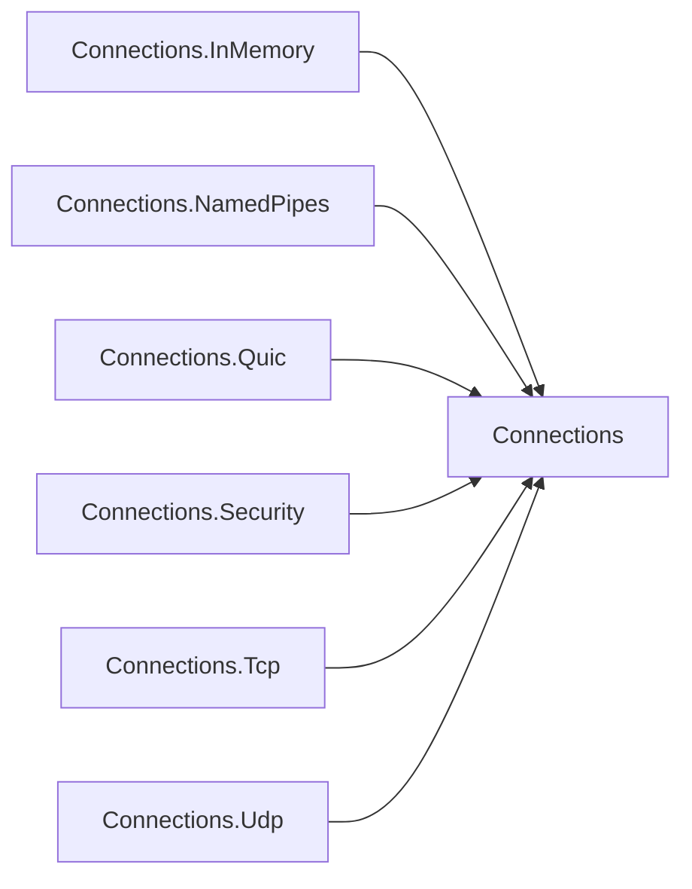

| Project | References | Private references | Packages |
| --- | --- | --- | --- |
| `Assimalign.Cohesion.Connections` | `Assimalign.Cohesion.Core` | — | — |
| `Assimalign.Cohesion.Connections.InMemory` | `Assimalign.Cohesion.Connections`<br>`Assimalign.Cohesion.Core` | — | — |
| `Assimalign.Cohesion.Connections.NamedPipes` | `Assimalign.Cohesion.Connections`<br>`Assimalign.Cohesion.Core` | — | — |
| `Assimalign.Cohesion.Connections.Quic` | `Assimalign.Cohesion.Connections`<br>`Assimalign.Cohesion.Core` | — | — |
| `Assimalign.Cohesion.Connections.Security` | `Assimalign.Cohesion.Connections`<br>`Assimalign.Cohesion.Core` | — | — |
| `Assimalign.Cohesion.Connections.Tcp` | `Assimalign.Cohesion.Connections`<br>`Assimalign.Cohesion.Core` | — | — |
| `Assimalign.Cohesion.Connections.Udp` | `Assimalign.Cohesion.Connections`<br>`Assimalign.Cohesion.Core` | — | — |

### `libraries/Content`

12 shipped projects.

Intra-area references:

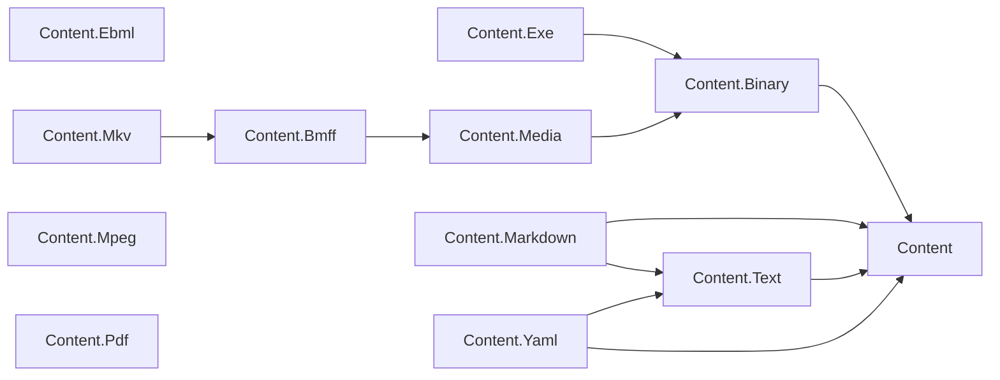

| Project | References | Private references | Packages |
| --- | --- | --- | --- |
| `Assimalign.Cohesion.Content` | — | — | — |
| `Assimalign.Cohesion.Content.Binary` | `Assimalign.Cohesion.Content` | — | — |
| `Assimalign.Cohesion.Content.Bmff` | `Assimalign.Cohesion.Content.Media` | — | — |
| `Assimalign.Cohesion.Content.Ebml` | — | — | — |
| `Assimalign.Cohesion.Content.Exe` | `Assimalign.Cohesion.Content.Binary` | — | — |
| `Assimalign.Cohesion.Content.Markdown` | `Assimalign.Cohesion.Content`<br>`Assimalign.Cohesion.Content.Text` | — | — |
| `Assimalign.Cohesion.Content.Media` | `Assimalign.Cohesion.Content.Binary` | — | — |
| `Assimalign.Cohesion.Content.Mkv` | `Assimalign.Cohesion.Content.Bmff` | — | — |
| `Assimalign.Cohesion.Content.Mpeg` | — | — | — |
| `Assimalign.Cohesion.Content.Pdf` | — | — | — |
| `Assimalign.Cohesion.Content.Text` | `Assimalign.Cohesion.Content` | — | — |
| `Assimalign.Cohesion.Content.Yaml` | `Assimalign.Cohesion.Content`<br>`Assimalign.Cohesion.Content.Text` | — | — |

### `libraries/Core`

1 shipped project.

| Project | References | Private references | Packages |
| --- | --- | --- | --- |
| `Assimalign.Cohesion.Core` | — | — | — |

### `libraries/DependencyInjection`

1 shipped project.

| Project | References | Private references | Packages |
| --- | --- | --- | --- |
| `Assimalign.Cohesion.DependencyInjection` | `Assimalign.Cohesion.Core` | — | — |

### `libraries/Dns`

5 shipped projects.

Intra-area references:

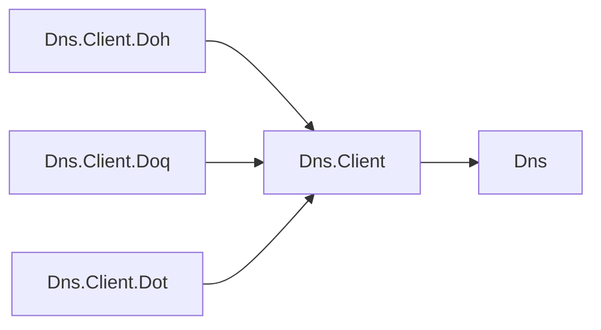

| Project | References | Private references | Packages |
| --- | --- | --- | --- |
| `Assimalign.Cohesion.Dns` | `Assimalign.Cohesion.Core` | — | — |
| `Assimalign.Cohesion.Dns.Client` | `Assimalign.Cohesion.Dns` | — | — |
| `Assimalign.Cohesion.Dns.Client.Doh` | `Assimalign.Cohesion.Dns.Client` | — | — |
| `Assimalign.Cohesion.Dns.Client.Doq` | `Assimalign.Cohesion.Dns.Client` | — | — |
| `Assimalign.Cohesion.Dns.Client.Dot` | `Assimalign.Cohesion.Dns.Client` | — | — |

### `libraries/FileSystem`

6 shipped projects.

Intra-area references:

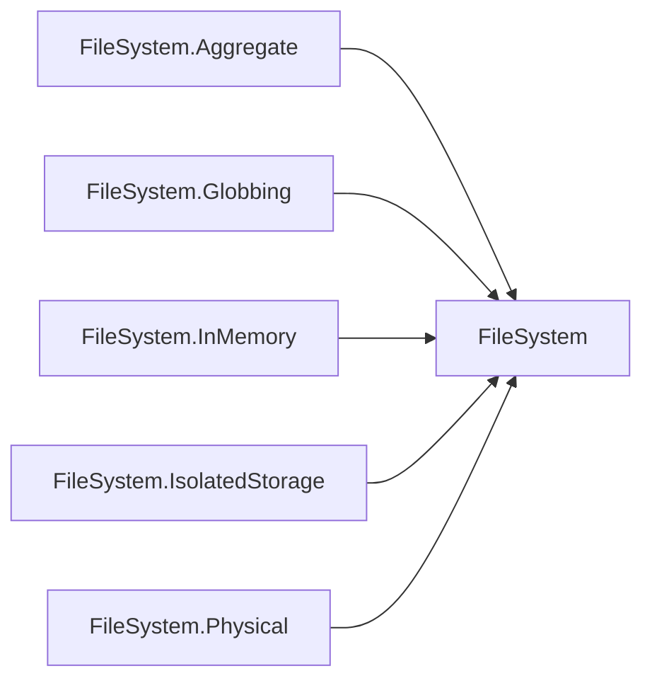

| Project | References | Private references | Packages |
| --- | --- | --- | --- |
| `Assimalign.Cohesion.FileSystem` | `Assimalign.Cohesion.Core` | — | — |
| `Assimalign.Cohesion.FileSystem.Aggregate` | `Assimalign.Cohesion.FileSystem` | — | — |
| `Assimalign.Cohesion.FileSystem.Globbing` | `Assimalign.Cohesion.FileSystem` | — | — |
| `Assimalign.Cohesion.FileSystem.InMemory` | `Assimalign.Cohesion.FileSystem` | — | — |
| `Assimalign.Cohesion.FileSystem.IsolatedStorage` | `Assimalign.Cohesion.FileSystem` | — | — |
| `Assimalign.Cohesion.FileSystem.Physical` | `Assimalign.Cohesion.FileSystem` | — | — |

### `libraries/Hosting`

4 shipped projects.

Intra-area references:

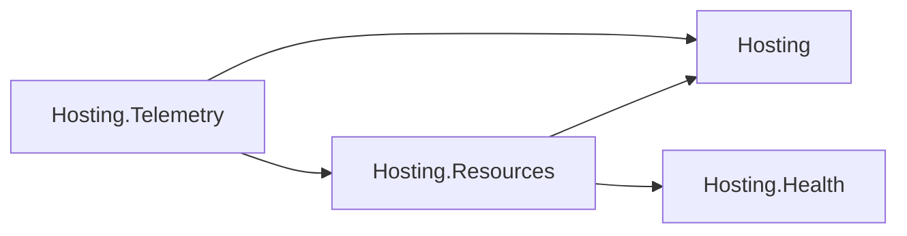

| Project | References | Private references | Packages |
| --- | --- | --- | --- |
| `Assimalign.Cohesion.Hosting` | `Assimalign.Cohesion.Core` | — | — |
| `Assimalign.Cohesion.Hosting.Health` | `Assimalign.Cohesion.Core` | — | — |
| `Assimalign.Cohesion.Hosting.Resources` | `Assimalign.Cohesion.Core`<br>`Assimalign.Cohesion.Hosting`<br>`Assimalign.Cohesion.Hosting.Health` | — | `System.Security.Cryptography.ProtectedData` |
| `Assimalign.Cohesion.Hosting.Telemetry` | `Assimalign.Cohesion.Hosting`<br>`Assimalign.Cohesion.Hosting.Resources`<br>`Assimalign.Cohesion.Logging`<br>`Assimalign.Cohesion.Logging.Console`<br>`Assimalign.Cohesion.OpenTelemetry` | — | — |

### `libraries/Http`

15 shipped projects.

_More than twelve projects: the table below is the area's graph (see the node ceiling in `.claude/rules/documentation.md`)._

| Project | References | Private references | Packages |
| --- | --- | --- | --- |
| `Assimalign.Cohesion.Http` | `Assimalign.Cohesion.Core` | — | — |
| `Assimalign.Cohesion.Http.Antiforgery` | `Assimalign.Cohesion.Http`<br>`Assimalign.Cohesion.Http.Cookies`<br>`Assimalign.Cohesion.Http.Forms` | — | — |
| `Assimalign.Cohesion.Http.ClientFactory` | `Assimalign.Cohesion.Http` | — | — |
| `Assimalign.Cohesion.Http.Connections` | `Assimalign.Cohesion.Connections`<br>`Assimalign.Cohesion.Http` | — | — |
| `Assimalign.Cohesion.Http.Cookies` | `Assimalign.Cohesion.Http` | — | — |
| `Assimalign.Cohesion.Http.DigestFields` | `Assimalign.Cohesion.Http` | — | — |
| `Assimalign.Cohesion.Http.ExtendedConnect` | `Assimalign.Cohesion.Http` | — | — |
| `Assimalign.Cohesion.Http.Forms` | `Assimalign.Cohesion.Http` | — | — |
| `Assimalign.Cohesion.Http.Forwarded` | `Assimalign.Cohesion.Http` | — | — |
| `Assimalign.Cohesion.Http.InterimResponses` | `Assimalign.Cohesion.Http` | — | — |
| `Assimalign.Cohesion.Http.ProtocolUpgrade` | `Assimalign.Cohesion.Http`<br>`Assimalign.Cohesion.Http.Cookies` | — | — |
| `Assimalign.Cohesion.Http.RequestLimits` | `Assimalign.Cohesion.Http` | — | — |
| `Assimalign.Cohesion.Http.ServerSentEvents` | `Assimalign.Cohesion.Http`<br>`Assimalign.Cohesion.Http.Streaming` | — | — |
| `Assimalign.Cohesion.Http.Sessions` | `Assimalign.Cohesion.Http` | — | — |
| `Assimalign.Cohesion.Http.Streaming` | `Assimalign.Cohesion.Http` | — | — |

### `libraries/IdentityModel`

7 shipped projects.

Intra-area references:

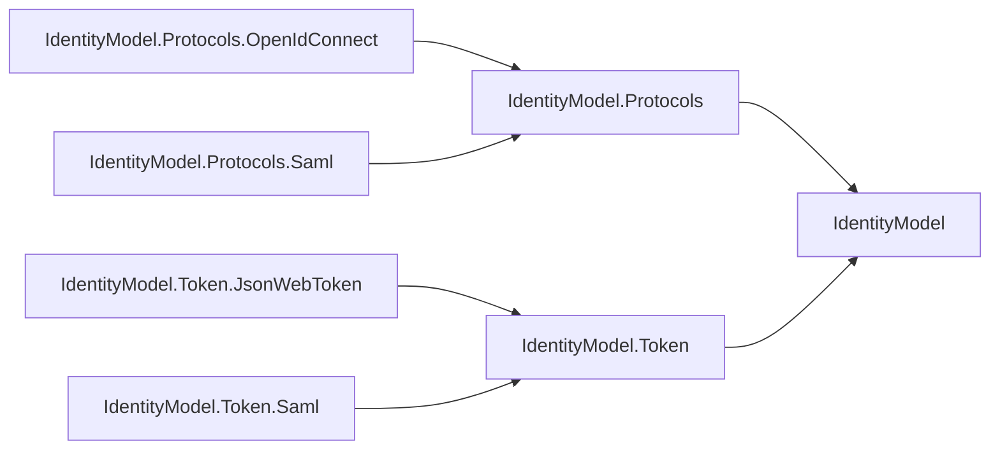

| Project | References | Private references | Packages |
| --- | --- | --- | --- |
| `Assimalign.Cohesion.IdentityModel` | — | — | — |
| `Assimalign.Cohesion.IdentityModel.Protocols` | `Assimalign.Cohesion.IdentityModel` | — | — |
| `Assimalign.Cohesion.IdentityModel.Protocols.OpenIdConnect` | `Assimalign.Cohesion.IdentityModel.Protocols` | — | — |
| `Assimalign.Cohesion.IdentityModel.Protocols.Saml` | `Assimalign.Cohesion.IdentityModel.Protocols` | — | — |
| `Assimalign.Cohesion.IdentityModel.Token` | `Assimalign.Cohesion.IdentityModel` | — | — |
| `Assimalign.Cohesion.IdentityModel.Token.JsonWebToken` | `Assimalign.Cohesion.IdentityModel.Token` | — | — |
| `Assimalign.Cohesion.IdentityModel.Token.Saml` | `Assimalign.Cohesion.IdentityModel.Token` | — | — |

### `libraries/Logging`

3 shipped projects.

Intra-area references:

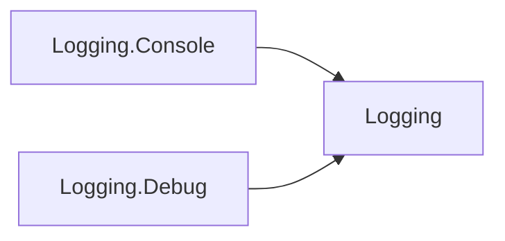

| Project | References | Private references | Packages |
| --- | --- | --- | --- |
| `Assimalign.Cohesion.Logging` | `Assimalign.Cohesion.Core` | — | — |
| `Assimalign.Cohesion.Logging.Console` | `Assimalign.Cohesion.Logging` | — | — |
| `Assimalign.Cohesion.Logging.Debug` | `Assimalign.Cohesion.Logging` | — | — |

### `libraries/ObjectMapping`

1 shipped project.

| Project | References | Private references | Packages |
| --- | --- | --- | --- |
| `Assimalign.Cohesion.ObjectMapping` | `Assimalign.Cohesion.Core` | — | — |

### `libraries/ObjectPool`

1 shipped project.

| Project | References | Private references | Packages |
| --- | --- | --- | --- |
| `Assimalign.Cohesion.ObjectPool` | `Assimalign.Cohesion.Core` | — | — |

### `libraries/ObjectValidation`

1 shipped project.

| Project | References | Private references | Packages |
| --- | --- | --- | --- |
| `Assimalign.Cohesion.ObjectValidation` | — | — | — |

### `libraries/OpenApi`

8 shipped projects.

Intra-area references:

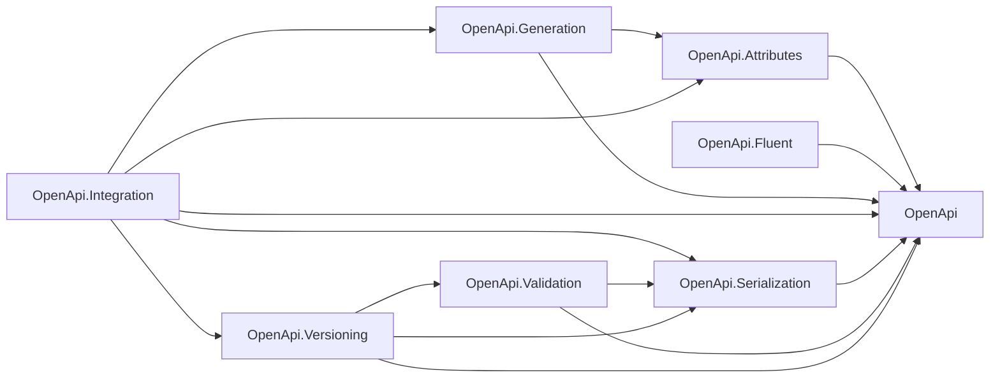

| Project | References | Private references | Packages |
| --- | --- | --- | --- |
| `Assimalign.Cohesion.OpenApi` | — | — | — |
| `Assimalign.Cohesion.OpenApi.Attributes` | `Assimalign.Cohesion.OpenApi` | — | — |
| `Assimalign.Cohesion.OpenApi.Fluent` | `Assimalign.Cohesion.OpenApi` | — | — |
| `Assimalign.Cohesion.OpenApi.Generation` | `Assimalign.Cohesion.OpenApi`<br>`Assimalign.Cohesion.OpenApi.Attributes` | — | — |
| `Assimalign.Cohesion.OpenApi.Integration` | `Assimalign.Cohesion.OpenApi`<br>`Assimalign.Cohesion.OpenApi.Attributes`<br>`Assimalign.Cohesion.OpenApi.Generation`<br>`Assimalign.Cohesion.OpenApi.Serialization`<br>`Assimalign.Cohesion.OpenApi.Versioning` | — | — |
| `Assimalign.Cohesion.OpenApi.Serialization` | `Assimalign.Cohesion.Content.Yaml`<br>`Assimalign.Cohesion.OpenApi` | — | — |
| `Assimalign.Cohesion.OpenApi.Validation` | `Assimalign.Cohesion.OpenApi`<br>`Assimalign.Cohesion.OpenApi.Serialization` | — | — |
| `Assimalign.Cohesion.OpenApi.Versioning` | `Assimalign.Cohesion.OpenApi`<br>`Assimalign.Cohesion.OpenApi.Serialization`<br>`Assimalign.Cohesion.OpenApi.Validation` | — | — |

### `libraries/OpenTelemetry`

1 shipped project.

| Project | References | Private references | Packages |
| --- | --- | --- | --- |
| `Assimalign.Cohesion.OpenTelemetry` | `Assimalign.Cohesion.Core` | — | — |

### `libraries/Resilience`

7 shipped projects.

Intra-area references:

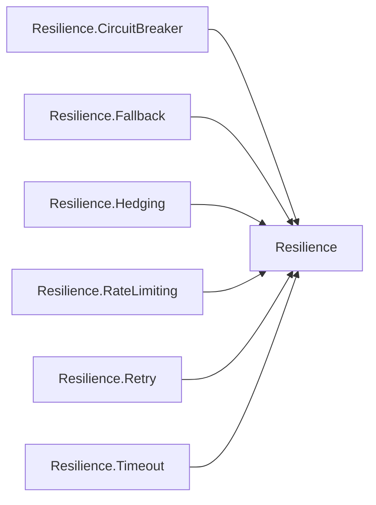

| Project | References | Private references | Packages |
| --- | --- | --- | --- |
| `Assimalign.Cohesion.Resilience` | `Assimalign.Cohesion.Core`<br>`Assimalign.Cohesion.ObjectPool` | — | — |
| `Assimalign.Cohesion.Resilience.CircuitBreaker` | `Assimalign.Cohesion.Resilience` | — | — |
| `Assimalign.Cohesion.Resilience.Fallback` | `Assimalign.Cohesion.Resilience` | — | — |
| `Assimalign.Cohesion.Resilience.Hedging` | `Assimalign.Cohesion.Resilience` | — | — |
| `Assimalign.Cohesion.Resilience.RateLimiting` | `Assimalign.Cohesion.Resilience` | — | `System.Threading.RateLimiting` |
| `Assimalign.Cohesion.Resilience.Retry` | `Assimalign.Cohesion.Resilience` | — | — |
| `Assimalign.Cohesion.Resilience.Timeout` | `Assimalign.Cohesion.Resilience` | — | — |

### `libraries/Security`

2 shipped projects.

| Project | References | Private references | Packages |
| --- | --- | --- | --- |
| `Assimalign.Cohesion.Security` | — | — | — |
| `Assimalign.Cohesion.Security.DataProtection` | — | — | — |

### `resources/ApiManager`

3 shipped projects.

Intra-area references:


| Project | References | Private references | Packages |
| --- | --- | --- | --- |
| `Assimalign.Cohesion.ApiManager` | `Assimalign.Cohesion.Core` | — | — |
| `Assimalign.Cohesion.ApiManager.ApplicationModel` | `Assimalign.Cohesion.ApplicationModel`<br>`Assimalign.Cohesion.Hosting.Resources` | — | — |
| `Assimalign.Cohesion.ApiManager.Hosting` | `Assimalign.Cohesion.ApiManager`<br>`Assimalign.Cohesion.Hosting`<br>`Assimalign.Cohesion.Hosting.Health`<br>`Assimalign.Cohesion.Hosting.Resources`<br>`Assimalign.Cohesion.Hosting.Telemetry` | `Assimalign.Cohesion.Connections.Tcp`<br>`Assimalign.Cohesion.Http`<br>`Assimalign.Cohesion.Http.Connections`<br>`Assimalign.Cohesion.Web`<br>`Assimalign.Cohesion.Web.Hosting`<br>`Assimalign.Cohesion.Web.Hosting.Resources` | — |

### `resources/ConfigurationStore`

4 shipped projects.

Intra-area references:

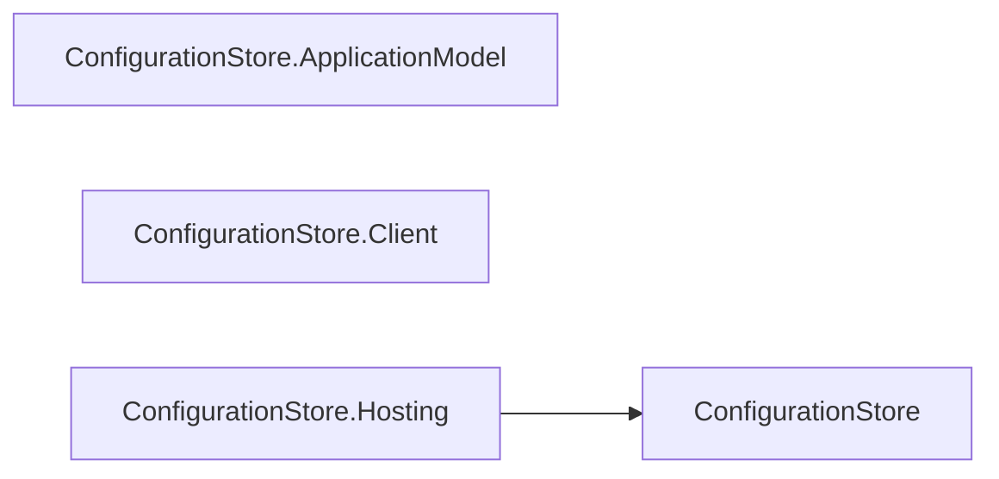

| Project | References | Private references | Packages |
| --- | --- | --- | --- |
| `Assimalign.Cohesion.ConfigurationStore` | `Assimalign.Cohesion.Core` | — | — |
| `Assimalign.Cohesion.ConfigurationStore.ApplicationModel` | `Assimalign.Cohesion.ApplicationModel`<br>`Assimalign.Cohesion.Hosting.Resources` | — | — |
| `Assimalign.Cohesion.ConfigurationStore.Client` | `Assimalign.Cohesion.Core` | — | — |
| `Assimalign.Cohesion.ConfigurationStore.Hosting` | `Assimalign.Cohesion.ConfigurationStore`<br>`Assimalign.Cohesion.Hosting`<br>`Assimalign.Cohesion.Hosting.Health`<br>`Assimalign.Cohesion.Hosting.Resources`<br>`Assimalign.Cohesion.Hosting.Telemetry` | `Assimalign.Cohesion.IdentityModel.Token.JsonWebToken`<br>`Assimalign.Cohesion.Web.Hosting` | — |

### `resources/Database`

57 shipped projects.

_More than twelve projects: the table below is the area's graph (see the node ceiling in `.claude/rules/documentation.md`)._

| Project | References | Private references | Packages |
| --- | --- | --- | --- |
| `Assimalign.Cohesion.Database` | `Assimalign.Cohesion.Core`<br>`Assimalign.Cohesion.Database.Execution`<br>`Assimalign.Cohesion.Database.Governance`<br>`Assimalign.Cohesion.Database.Indexing`<br>`Assimalign.Cohesion.Database.Language`<br>`Assimalign.Cohesion.Database.Protocol`<br>`Assimalign.Cohesion.Database.Security`<br>`Assimalign.Cohesion.Database.Storage`<br>`Assimalign.Cohesion.Database.Transactions`<br>`Assimalign.Cohesion.Database.Types` | `Assimalign.Cohesion.Web` | — |
| `Assimalign.Cohesion.Database.ApplicationModel` | `Assimalign.Cohesion.ApplicationModel`<br>`Assimalign.Cohesion.Hosting.Resources` | — | — |
| `Assimalign.Cohesion.Database.Blob` | `Assimalign.Cohesion.Database`<br>`Assimalign.Cohesion.Database.Storage` | — | — |
| `Assimalign.Cohesion.Database.Blob.Catalog` | — | — | — |
| `Assimalign.Cohesion.Database.Blob.Client` | — | — | — |
| `Assimalign.Cohesion.Database.Blob.Replication` | — | — | — |
| `Assimalign.Cohesion.Database.Blob.Security` | — | — | — |
| `Assimalign.Cohesion.Database.Blob.Storage` | — | — | — |
| `Assimalign.Cohesion.Database.Cache` | — | — | — |
| `Assimalign.Cohesion.Database.Cache.Catalog` | — | — | — |
| `Assimalign.Cohesion.Database.Cache.Client` | — | — | — |
| `Assimalign.Cohesion.Database.Cache.Language` | — | — | — |
| `Assimalign.Cohesion.Database.Cache.Storage` | — | — | — |
| `Assimalign.Cohesion.Database.Cache.Tests` | — | — | — |
| `Assimalign.Cohesion.Database.Client` | `Assimalign.Cohesion.Connections`<br>`Assimalign.Cohesion.Database`<br>`Assimalign.Cohesion.Database.Protocol`<br>`Assimalign.Cohesion.Database.Types` | — | — |
| `Assimalign.Cohesion.Database.Documents` | `Assimalign.Cohesion.Database` | — | — |
| `Assimalign.Cohesion.Database.Documents.Catalog` | — | — | — |
| `Assimalign.Cohesion.Database.Documents.Client` | — | — | — |
| `Assimalign.Cohesion.Database.Documents.Language` | `Assimalign.Cohesion.Database.Language` | — | — |
| `Assimalign.Cohesion.Database.Documents.Replication` | — | — | — |
| `Assimalign.Cohesion.Database.Documents.Security` | — | — | — |
| `Assimalign.Cohesion.Database.Documents.Storage` | `Assimalign.Cohesion.Database.Storage` | — | — |
| `Assimalign.Cohesion.Database.Embedded` | `Assimalign.Cohesion.Database` | — | — |
| `Assimalign.Cohesion.Database.Execution` | `Assimalign.Cohesion.Database.Language`<br>`Assimalign.Cohesion.Database.Types` | — | — |
| `Assimalign.Cohesion.Database.Governance` | — | — | — |
| `Assimalign.Cohesion.Database.Graph` | `Assimalign.Cohesion.Database` | — | — |
| `Assimalign.Cohesion.Database.Graph.Catalog` | — | — | — |
| `Assimalign.Cohesion.Database.Graph.Client` | — | — | — |
| `Assimalign.Cohesion.Database.Graph.Language` | `Assimalign.Cohesion.Database.Language` | — | — |
| `Assimalign.Cohesion.Database.Graph.Replication` | — | — | — |
| `Assimalign.Cohesion.Database.Graph.Security` | — | — | — |
| `Assimalign.Cohesion.Database.Graph.Storage` | — | — | — |
| `Assimalign.Cohesion.Database.Hosting` | `Assimalign.Cohesion.Database`<br>`Assimalign.Cohesion.Hosting`<br>`Assimalign.Cohesion.Hosting.Health`<br>`Assimalign.Cohesion.Hosting.Resources`<br>`Assimalign.Cohesion.Hosting.Telemetry` | `Assimalign.Cohesion.Web.Health`<br>`Assimalign.Cohesion.Web.Hosting`<br>`Assimalign.Cohesion.Web.Hosting.Health`<br>`Assimalign.Cohesion.Web.Hosting.Resources` | — |
| `Assimalign.Cohesion.Database.Indexing` | `Assimalign.Cohesion.Database.Storage`<br>`Assimalign.Cohesion.Database.Transactions`<br>`Assimalign.Cohesion.Database.Types` | — | — |
| `Assimalign.Cohesion.Database.KeyValuePair` | `Assimalign.Cohesion.Connections`<br>`Assimalign.Cohesion.Database`<br>`Assimalign.Cohesion.Database.KeyValuePair.Catalog`<br>`Assimalign.Cohesion.Database.KeyValuePair.Storage`<br>`Assimalign.Cohesion.Database.Storage`<br>`Assimalign.Cohesion.Database.Types` | — | — |
| `Assimalign.Cohesion.Database.KeyValuePair.Catalog` | `Assimalign.Cohesion.Database`<br>`Assimalign.Cohesion.Database.Indexing`<br>`Assimalign.Cohesion.Database.KeyValuePair.Storage`<br>`Assimalign.Cohesion.Database.Storage`<br>`Assimalign.Cohesion.Database.Types` | — | — |
| `Assimalign.Cohesion.Database.KeyValuePair.Client` | `Assimalign.Cohesion.Connections`<br>`Assimalign.Cohesion.Database`<br>`Assimalign.Cohesion.Database.Client`<br>`Assimalign.Cohesion.Database.Types` | — | — |
| `Assimalign.Cohesion.Database.KeyValuePair.Replication` | — | — | — |
| `Assimalign.Cohesion.Database.KeyValuePair.Security` | — | — | — |
| `Assimalign.Cohesion.Database.KeyValuePair.Storage` | `Assimalign.Cohesion.Database.Storage` | — | — |
| `Assimalign.Cohesion.Database.Language` | — | — | — |
| `Assimalign.Cohesion.Database.Memory` | — | — | — |
| `Assimalign.Cohesion.Database.Protocol` | — | — | — |
| `Assimalign.Cohesion.Database.Replication` | `Assimalign.Cohesion.Database.Storage` | — | — |
| `Assimalign.Cohesion.Database.SampleHost` | — | — | — |
| `Assimalign.Cohesion.Database.Security` | — | — | — |
| `Assimalign.Cohesion.Database.Sql` | `Assimalign.Cohesion.Connections`<br>`Assimalign.Cohesion.Connections.Tcp`<br>`Assimalign.Cohesion.Database`<br>`Assimalign.Cohesion.Database.Sql.Catalog`<br>`Assimalign.Cohesion.Database.Sql.Language`<br>`Assimalign.Cohesion.Database.Sql.Storage`<br>`Assimalign.Cohesion.Database.Storage`<br>`Assimalign.Cohesion.Database.Types` | — | — |
| `Assimalign.Cohesion.Database.Sql.Catalog` | `Assimalign.Cohesion.Database`<br>`Assimalign.Cohesion.Database.Indexing`<br>`Assimalign.Cohesion.Database.Sql.Storage`<br>`Assimalign.Cohesion.Database.Storage`<br>`Assimalign.Cohesion.Database.Types` | — | — |
| `Assimalign.Cohesion.Database.Sql.Client` | `Assimalign.Cohesion.Connections`<br>`Assimalign.Cohesion.Database`<br>`Assimalign.Cohesion.Database.Client`<br>`Assimalign.Cohesion.Database.Types` | — | — |
| `Assimalign.Cohesion.Database.Sql.Language` | `Assimalign.Cohesion.Database.Language`<br>`Assimalign.Cohesion.Database.Types` | — | — |
| `Assimalign.Cohesion.Database.Sql.Replication` | `Assimalign.Cohesion.Database.Replication`<br>`Assimalign.Cohesion.Database.Sql` | — | — |
| `Assimalign.Cohesion.Database.Sql.Security` | — | — | — |
| `Assimalign.Cohesion.Database.Sql.Storage` | `Assimalign.Cohesion.Database.Storage` | — | — |
| `Assimalign.Cohesion.Database.Storage` | — | — | — |
| `Assimalign.Cohesion.Database.Testing` | `Assimalign.Cohesion.Core`<br>`Assimalign.Cohesion.Database.Hosting`<br>`Assimalign.Cohesion.Hosting`<br>`Assimalign.Cohesion.Hosting.Health`<br>`Assimalign.Cohesion.Hosting.Resources`<br>`Assimalign.Cohesion.IdentityModel.Token.JsonWebToken` | — | — |
| `Assimalign.Cohesion.Database.Transactions` | `Assimalign.Cohesion.Database.Storage` | — | — |
| `Assimalign.Cohesion.Database.Types` | — | — | — |

### `resources/EmailHub`

3 shipped projects.

Intra-area references:

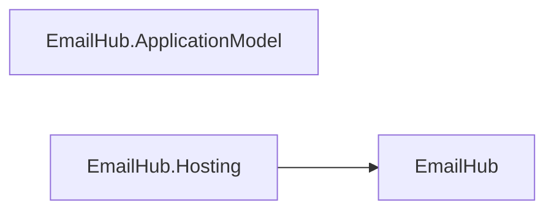

| Project | References | Private references | Packages |
| --- | --- | --- | --- |
| `Assimalign.Cohesion.EmailHub` | `Assimalign.Cohesion.Core` | — | — |
| `Assimalign.Cohesion.EmailHub.ApplicationModel` | `Assimalign.Cohesion.ApplicationModel`<br>`Assimalign.Cohesion.Hosting.Resources` | — | — |
| `Assimalign.Cohesion.EmailHub.Hosting` | `Assimalign.Cohesion.EmailHub`<br>`Assimalign.Cohesion.Hosting`<br>`Assimalign.Cohesion.Hosting.Health`<br>`Assimalign.Cohesion.Hosting.Resources`<br>`Assimalign.Cohesion.Hosting.Telemetry` | `Assimalign.Cohesion.Connections.Tcp`<br>`Assimalign.Cohesion.Http`<br>`Assimalign.Cohesion.Http.Connections`<br>`Assimalign.Cohesion.Web`<br>`Assimalign.Cohesion.Web.Hosting`<br>`Assimalign.Cohesion.Web.Hosting.Resources` | — |

### `resources/EventHub`

3 shipped projects.

Intra-area references:


| Project | References | Private references | Packages |
| --- | --- | --- | --- |
| `Assimalign.Cohesion.EventHub` | `Assimalign.Cohesion.Connections` | — | — |
| `Assimalign.Cohesion.EventHub.ApplicationModel` | `Assimalign.Cohesion.ApplicationModel`<br>`Assimalign.Cohesion.Hosting.Resources` | — | — |
| `Assimalign.Cohesion.EventHub.Hosting` | `Assimalign.Cohesion.EventHub`<br>`Assimalign.Cohesion.Hosting`<br>`Assimalign.Cohesion.Hosting.Health`<br>`Assimalign.Cohesion.Hosting.Resources`<br>`Assimalign.Cohesion.Hosting.Telemetry` | `Assimalign.Cohesion.Connections.Tcp`<br>`Assimalign.Cohesion.Http`<br>`Assimalign.Cohesion.Http.Connections`<br>`Assimalign.Cohesion.Web`<br>`Assimalign.Cohesion.Web.Hosting`<br>`Assimalign.Cohesion.Web.Hosting.Resources` | — |

### `resources/IdentityHub`

5 shipped projects.

Intra-area references:

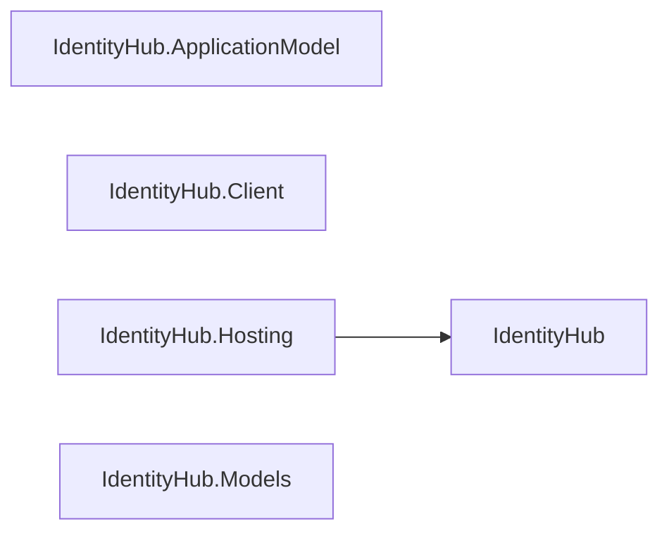

| Project | References | Private references | Packages |
| --- | --- | --- | --- |
| `Assimalign.Cohesion.IdentityHub` | `Assimalign.Cohesion.Core`<br>`Assimalign.Cohesion.IdentityModel` | — | — |
| `Assimalign.Cohesion.IdentityHub.ApplicationModel` | `Assimalign.Cohesion.ApplicationModel`<br>`Assimalign.Cohesion.Hosting.Resources` | — | — |
| `Assimalign.Cohesion.IdentityHub.Client` | `Assimalign.Cohesion.Core` | — | — |
| `Assimalign.Cohesion.IdentityHub.Hosting` | `Assimalign.Cohesion.Hosting`<br>`Assimalign.Cohesion.Hosting.Health`<br>`Assimalign.Cohesion.Hosting.Resources`<br>`Assimalign.Cohesion.Hosting.Telemetry`<br>`Assimalign.Cohesion.IdentityHub` | `Assimalign.Cohesion.Connections`<br>`Assimalign.Cohesion.Connections.Security`<br>`Assimalign.Cohesion.Connections.Tcp`<br>`Assimalign.Cohesion.Http`<br>`Assimalign.Cohesion.Http.Connections`<br>`Assimalign.Cohesion.Http.Forms`<br>`Assimalign.Cohesion.IdentityModel`<br>`Assimalign.Cohesion.IdentityModel.Token`<br>`Assimalign.Cohesion.IdentityModel.Token.JsonWebToken`<br>`Assimalign.Cohesion.Web`<br>`Assimalign.Cohesion.Web.Hosting` | — |
| `Assimalign.Cohesion.IdentityHub.Models` | `Assimalign.Cohesion.Core`<br>`Assimalign.Cohesion.IdentityModel` | — | — |

### `resources/IoTHub`

3 shipped projects.

Intra-area references:

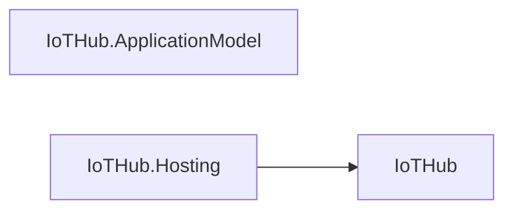

| Project | References | Private references | Packages |
| --- | --- | --- | --- |
| `Assimalign.Cohesion.IoTHub` | `Assimalign.Cohesion.Connections` | — | — |
| `Assimalign.Cohesion.IoTHub.ApplicationModel` | `Assimalign.Cohesion.ApplicationModel`<br>`Assimalign.Cohesion.Hosting.Resources` | — | — |
| `Assimalign.Cohesion.IoTHub.Hosting` | `Assimalign.Cohesion.Hosting`<br>`Assimalign.Cohesion.Hosting.Health`<br>`Assimalign.Cohesion.Hosting.Resources`<br>`Assimalign.Cohesion.Hosting.Telemetry`<br>`Assimalign.Cohesion.IoTHub` | `Assimalign.Cohesion.Connections.Tcp`<br>`Assimalign.Cohesion.Http`<br>`Assimalign.Cohesion.Http.Connections`<br>`Assimalign.Cohesion.Web`<br>`Assimalign.Cohesion.Web.Hosting`<br>`Assimalign.Cohesion.Web.Hosting.Resources` | — |

### `resources/LoadBalancer`

3 shipped projects.

Intra-area references:

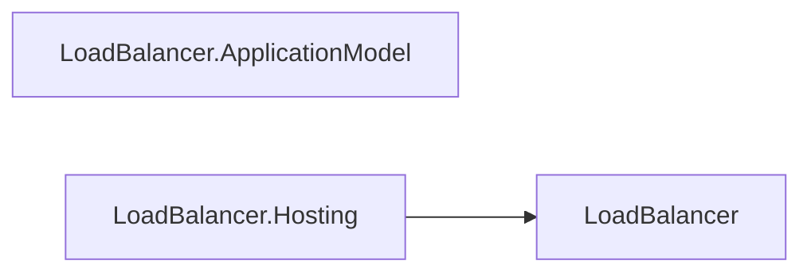

| Project | References | Private references | Packages |
| --- | --- | --- | --- |
| `Assimalign.Cohesion.LoadBalancer` | `Assimalign.Cohesion.Http` | — | — |
| `Assimalign.Cohesion.LoadBalancer.ApplicationModel` | `Assimalign.Cohesion.ApplicationModel`<br>`Assimalign.Cohesion.Hosting.Resources` | — | — |
| `Assimalign.Cohesion.LoadBalancer.Hosting` | `Assimalign.Cohesion.Hosting`<br>`Assimalign.Cohesion.Hosting.Health`<br>`Assimalign.Cohesion.Hosting.Resources`<br>`Assimalign.Cohesion.Hosting.Telemetry`<br>`Assimalign.Cohesion.LoadBalancer` | `Assimalign.Cohesion.Connections.Tcp`<br>`Assimalign.Cohesion.Http`<br>`Assimalign.Cohesion.Http.Connections`<br>`Assimalign.Cohesion.Web`<br>`Assimalign.Cohesion.Web.Hosting`<br>`Assimalign.Cohesion.Web.Hosting.Resources` | — |

### `resources/LogSpace`

4 shipped projects.

Intra-area references:

```mermaid
flowchart LR
    N0["LogSpace"]
    N1["LogSpace.ApplicationModel"]
    N2["LogSpace.Hosting"]
    N3["LogSpace.Telemetry"]
    N2 --> N0
```

| Project | References | Private references | Packages |
| --- | --- | --- | --- |
| `Assimalign.Cohesion.LogSpace` | `Assimalign.Cohesion.Core` | — | — |
| `Assimalign.Cohesion.LogSpace.ApplicationModel` | `Assimalign.Cohesion.ApplicationModel`<br>`Assimalign.Cohesion.Hosting.Resources` | — | — |
| `Assimalign.Cohesion.LogSpace.Hosting` | `Assimalign.Cohesion.Hosting`<br>`Assimalign.Cohesion.Hosting.Health`<br>`Assimalign.Cohesion.Hosting.Resources`<br>`Assimalign.Cohesion.Hosting.Telemetry`<br>`Assimalign.Cohesion.LogSpace` | `Assimalign.Cohesion.Connections`<br>`Assimalign.Cohesion.Connections.Security`<br>`Assimalign.Cohesion.Connections.Tcp`<br>`Assimalign.Cohesion.Http`<br>`Assimalign.Cohesion.Http.Connections`<br>`Assimalign.Cohesion.Http.RequestLimits`<br>`Assimalign.Cohesion.IdentityModel`<br>`Assimalign.Cohesion.IdentityModel.Token`<br>`Assimalign.Cohesion.IdentityModel.Token.JsonWebToken`<br>`Assimalign.Cohesion.Web`<br>`Assimalign.Cohesion.Web.Hosting`<br>`Assimalign.Cohesion.Web.Hosting.Resources` | — |
| `Assimalign.Cohesion.LogSpace.Telemetry` | — | — | — |

### `resources/MediaHub`

3 shipped projects.

Intra-area references:

```mermaid
flowchart LR
    N0["MediaHub"]
    N1["MediaHub.ApplicationModel"]
    N2["MediaHub.Hosting"]
    N2 --> N0
```

| Project | References | Private references | Packages |
| --- | --- | --- | --- |
| `Assimalign.Cohesion.MediaHub` | `Assimalign.Cohesion.Core` | — | — |
| `Assimalign.Cohesion.MediaHub.ApplicationModel` | `Assimalign.Cohesion.ApplicationModel`<br>`Assimalign.Cohesion.Hosting.Resources` | — | — |
| `Assimalign.Cohesion.MediaHub.Hosting` | `Assimalign.Cohesion.Hosting`<br>`Assimalign.Cohesion.Hosting.Health`<br>`Assimalign.Cohesion.Hosting.Resources`<br>`Assimalign.Cohesion.Hosting.Telemetry`<br>`Assimalign.Cohesion.MediaHub` | `Assimalign.Cohesion.Connections.Tcp`<br>`Assimalign.Cohesion.Http`<br>`Assimalign.Cohesion.Http.Connections`<br>`Assimalign.Cohesion.Web`<br>`Assimalign.Cohesion.Web.Hosting`<br>`Assimalign.Cohesion.Web.Hosting.Resources` | — |

### `resources/MessageHub`

4 shipped projects.

Intra-area references:

```mermaid
flowchart LR
    N0["MessageHub"]
    N1["MessageHub.ApplicationModel"]
    N2["MessageHub.Client"]
    N3["MessageHub.Hosting"]
    N3 --> N0
```

| Project | References | Private references | Packages |
| --- | --- | --- | --- |
| `Assimalign.Cohesion.MessageHub` | `Assimalign.Cohesion.Core` | — | — |
| `Assimalign.Cohesion.MessageHub.ApplicationModel` | `Assimalign.Cohesion.ApplicationModel`<br>`Assimalign.Cohesion.Hosting.Resources` | — | — |
| `Assimalign.Cohesion.MessageHub.Client` | — | — | — |
| `Assimalign.Cohesion.MessageHub.Hosting` | `Assimalign.Cohesion.Hosting`<br>`Assimalign.Cohesion.Hosting.Health`<br>`Assimalign.Cohesion.Hosting.Resources`<br>`Assimalign.Cohesion.Hosting.Telemetry`<br>`Assimalign.Cohesion.MessageHub` | `Assimalign.Cohesion.Connections.Tcp`<br>`Assimalign.Cohesion.Http`<br>`Assimalign.Cohesion.Http.Connections`<br>`Assimalign.Cohesion.Web`<br>`Assimalign.Cohesion.Web.Hosting`<br>`Assimalign.Cohesion.Web.Hosting.Resources` | — |

### `resources/NatGateway`

3 shipped projects.

Intra-area references:

```mermaid
flowchart LR
    N0["NatGateway"]
    N1["NatGateway.ApplicationModel"]
    N2["NatGateway.Hosting"]
    N2 --> N0
```

| Project | References | Private references | Packages |
| --- | --- | --- | --- |
| `Assimalign.Cohesion.NatGateway` | `Assimalign.Cohesion.Core` | — | — |
| `Assimalign.Cohesion.NatGateway.ApplicationModel` | `Assimalign.Cohesion.ApplicationModel`<br>`Assimalign.Cohesion.Hosting.Resources` | — | — |
| `Assimalign.Cohesion.NatGateway.Hosting` | `Assimalign.Cohesion.Hosting`<br>`Assimalign.Cohesion.Hosting.Health`<br>`Assimalign.Cohesion.Hosting.Resources`<br>`Assimalign.Cohesion.Hosting.Telemetry`<br>`Assimalign.Cohesion.NatGateway` | `Assimalign.Cohesion.Connections.Tcp`<br>`Assimalign.Cohesion.Http`<br>`Assimalign.Cohesion.Http.Connections`<br>`Assimalign.Cohesion.Web`<br>`Assimalign.Cohesion.Web.Hosting`<br>`Assimalign.Cohesion.Web.Hosting.Resources` | — |

### `resources/NotificationHub`

4 shipped projects.

Intra-area references:

```mermaid
flowchart LR
    N0["NotificationHub"]
    N1["NotificationHub.ApplicationModel"]
    N2["NotificationHub.Client"]
    N3["NotificationHub.Hosting"]
    N3 --> N0
```

| Project | References | Private references | Packages |
| --- | --- | --- | --- |
| `Assimalign.Cohesion.NotificationHub` | `Assimalign.Cohesion.Core` | — | — |
| `Assimalign.Cohesion.NotificationHub.ApplicationModel` | `Assimalign.Cohesion.ApplicationModel`<br>`Assimalign.Cohesion.Hosting.Resources` | — | — |
| `Assimalign.Cohesion.NotificationHub.Client` | — | — | — |
| `Assimalign.Cohesion.NotificationHub.Hosting` | `Assimalign.Cohesion.Hosting`<br>`Assimalign.Cohesion.Hosting.Health`<br>`Assimalign.Cohesion.Hosting.Resources`<br>`Assimalign.Cohesion.Hosting.Telemetry`<br>`Assimalign.Cohesion.NotificationHub` | `Assimalign.Cohesion.Connections.Tcp`<br>`Assimalign.Cohesion.Http`<br>`Assimalign.Cohesion.Http.Connections`<br>`Assimalign.Cohesion.Web`<br>`Assimalign.Cohesion.Web.Hosting`<br>`Assimalign.Cohesion.Web.Hosting.Resources` | — |

### `resources/Rezolvr`

4 shipped projects.

Intra-area references:

```mermaid
flowchart LR
    N0["Rezolvr"]
    N1["Rezolvr.ApplicationModel"]
    N2["Rezolvr.Client"]
    N3["Rezolvr.Hosting"]
    N3 --> N0
```

| Project | References | Private references | Packages |
| --- | --- | --- | --- |
| `Assimalign.Cohesion.Rezolvr` | `Assimalign.Cohesion.Core` | — | — |
| `Assimalign.Cohesion.Rezolvr.ApplicationModel` | `Assimalign.Cohesion.ApplicationModel`<br>`Assimalign.Cohesion.Hosting.Resources` | — | — |
| `Assimalign.Cohesion.Rezolvr.Client` | `Assimalign.Cohesion.Core` | — | — |
| `Assimalign.Cohesion.Rezolvr.Hosting` | `Assimalign.Cohesion.Hosting`<br>`Assimalign.Cohesion.Hosting.Health`<br>`Assimalign.Cohesion.Hosting.Resources`<br>`Assimalign.Cohesion.Hosting.Telemetry`<br>`Assimalign.Cohesion.Rezolvr` | `Assimalign.Cohesion.Connections.Tcp`<br>`Assimalign.Cohesion.Http`<br>`Assimalign.Cohesion.Http.Connections`<br>`Assimalign.Cohesion.Web`<br>`Assimalign.Cohesion.Web.Hosting`<br>`Assimalign.Cohesion.Web.Hosting.Resources` | — |

### `resources/Scheduler`

5 shipped projects.

Intra-area references:

```mermaid
flowchart LR
    N0["Scheduler"]
    N1["Scheduler.ApplicationModel"]
    N2["Scheduler.Cron"]
    N3["Scheduler.Hosting"]
    N4["Scheduler.Timer"]
    N2 --> N0
    N3 --> N0
    N4 --> N0
```

| Project | References | Private references | Packages |
| --- | --- | --- | --- |
| `Assimalign.Cohesion.Scheduler` | `Assimalign.Cohesion.Core` | — | — |
| `Assimalign.Cohesion.Scheduler.ApplicationModel` | `Assimalign.Cohesion.ApplicationModel`<br>`Assimalign.Cohesion.Hosting.Resources` | — | — |
| `Assimalign.Cohesion.Scheduler.Cron` | `Assimalign.Cohesion.Scheduler` | — | — |
| `Assimalign.Cohesion.Scheduler.Hosting` | `Assimalign.Cohesion.Hosting`<br>`Assimalign.Cohesion.Hosting.Health`<br>`Assimalign.Cohesion.Hosting.Resources`<br>`Assimalign.Cohesion.Hosting.Telemetry`<br>`Assimalign.Cohesion.Scheduler` | `Assimalign.Cohesion.Connections.Tcp`<br>`Assimalign.Cohesion.Http`<br>`Assimalign.Cohesion.Http.Connections`<br>`Assimalign.Cohesion.IdentityModel`<br>`Assimalign.Cohesion.IdentityModel.Token`<br>`Assimalign.Cohesion.IdentityModel.Token.JsonWebToken`<br>`Assimalign.Cohesion.Web`<br>`Assimalign.Cohesion.Web.Hosting` | — |
| `Assimalign.Cohesion.Scheduler.Timer` | `Assimalign.Cohesion.Scheduler` | — | — |

### `resources/SecretStore`

4 shipped projects.

Intra-area references:

```mermaid
flowchart LR
    N0["SecretStore"]
    N1["SecretStore.ApplicationModel"]
    N2["SecretStore.Client"]
    N3["SecretStore.Hosting"]
    N3 --> N0
```

| Project | References | Private references | Packages |
| --- | --- | --- | --- |
| `Assimalign.Cohesion.SecretStore` | `Assimalign.Cohesion.Core` | — | — |
| `Assimalign.Cohesion.SecretStore.ApplicationModel` | `Assimalign.Cohesion.ApplicationModel`<br>`Assimalign.Cohesion.Hosting.Resources` | — | — |
| `Assimalign.Cohesion.SecretStore.Client` | `Assimalign.Cohesion.Core` | — | — |
| `Assimalign.Cohesion.SecretStore.Hosting` | `Assimalign.Cohesion.Hosting`<br>`Assimalign.Cohesion.Hosting.Health`<br>`Assimalign.Cohesion.Hosting.Resources`<br>`Assimalign.Cohesion.Hosting.Telemetry`<br>`Assimalign.Cohesion.SecretStore` | `Assimalign.Cohesion.Connections`<br>`Assimalign.Cohesion.Connections.Security`<br>`Assimalign.Cohesion.Connections.Tcp`<br>`Assimalign.Cohesion.Http`<br>`Assimalign.Cohesion.Http.Connections`<br>`Assimalign.Cohesion.IdentityModel`<br>`Assimalign.Cohesion.IdentityModel.Token`<br>`Assimalign.Cohesion.IdentityModel.Token.JsonWebToken`<br>`Assimalign.Cohesion.Security.DataProtection`<br>`Assimalign.Cohesion.Web`<br>`Assimalign.Cohesion.Web.Hosting` | — |

### `resources/VpnGateway`

3 shipped projects.

Intra-area references:

```mermaid
flowchart LR
    N0["VpnGateway"]
    N1["VpnGateway.ApplicationModel"]
    N2["VpnGateway.Hosting"]
    N2 --> N0
```

| Project | References | Private references | Packages |
| --- | --- | --- | --- |
| `Assimalign.Cohesion.VpnGateway` | `Assimalign.Cohesion.Core` | — | — |
| `Assimalign.Cohesion.VpnGateway.ApplicationModel` | `Assimalign.Cohesion.ApplicationModel`<br>`Assimalign.Cohesion.Hosting.Resources` | — | — |
| `Assimalign.Cohesion.VpnGateway.Hosting` | `Assimalign.Cohesion.Hosting`<br>`Assimalign.Cohesion.Hosting.Health`<br>`Assimalign.Cohesion.Hosting.Resources`<br>`Assimalign.Cohesion.Hosting.Telemetry`<br>`Assimalign.Cohesion.VpnGateway` | `Assimalign.Cohesion.Connections.Tcp`<br>`Assimalign.Cohesion.Http`<br>`Assimalign.Cohesion.Http.Connections`<br>`Assimalign.Cohesion.Web`<br>`Assimalign.Cohesion.Web.Hosting`<br>`Assimalign.Cohesion.Web.Hosting.Resources` | — |

### `resources/Web`

31 shipped projects.

_More than twelve projects: the table below is the area's graph (see the node ceiling in `.claude/rules/documentation.md`)._

| Project | References | Private references | Packages |
| --- | --- | --- | --- |
| `Assimalign.Cohesion.Web` | `Assimalign.Cohesion.Http` | — | — |
| `Assimalign.Cohesion.Web.Api` | `Assimalign.Cohesion.Web`<br>`Assimalign.Cohesion.Web.ProblemDetails`<br>`Assimalign.Cohesion.Web.Routing` | — | — |
| `Assimalign.Cohesion.Web.ApplicationModel` | `Assimalign.Cohesion.ApplicationModel`<br>`Assimalign.Cohesion.Hosting.Resources` | — | — |
| `Assimalign.Cohesion.Web.Authentication` | `Assimalign.Cohesion.Http`<br>`Assimalign.Cohesion.Security.DataProtection`<br>`Assimalign.Cohesion.Web` | — | — |
| `Assimalign.Cohesion.Web.Authentication.Bearer` | `Assimalign.Cohesion.Http`<br>`Assimalign.Cohesion.IdentityModel.Token.JsonWebToken`<br>`Assimalign.Cohesion.Web.Authentication` | — | — |
| `Assimalign.Cohesion.Web.Authentication.Cookie` | `Assimalign.Cohesion.Http`<br>`Assimalign.Cohesion.Http.Cookies`<br>`Assimalign.Cohesion.Security.DataProtection`<br>`Assimalign.Cohesion.Web.Authentication`<br>`Assimalign.Cohesion.Web.Routing` | — | — |
| `Assimalign.Cohesion.Web.Authorization` | `Assimalign.Cohesion.Http` | — | — |
| `Assimalign.Cohesion.Web.Caching` | `Assimalign.Cohesion.Caching`<br>`Assimalign.Cohesion.Caching.InMemory`<br>`Assimalign.Cohesion.Http`<br>`Assimalign.Cohesion.Http.Streaming`<br>`Assimalign.Cohesion.Web`<br>`Assimalign.Cohesion.Web.Routing` | — | — |
| `Assimalign.Cohesion.Web.Compression` | `Assimalign.Cohesion.Http`<br>`Assimalign.Cohesion.Http.Streaming`<br>`Assimalign.Cohesion.Web` | — | — |
| `Assimalign.Cohesion.Web.CookiePolicy` | `Assimalign.Cohesion.Http.Cookies`<br>`Assimalign.Cohesion.Web` | — | — |
| `Assimalign.Cohesion.Web.Cors` | `Assimalign.Cohesion.Http` | — | — |
| `Assimalign.Cohesion.Web.Diagnostics` | `Assimalign.Cohesion.Logging`<br>`Assimalign.Cohesion.Web`<br>`Assimalign.Cohesion.Web.Routing` | — | — |
| `Assimalign.Cohesion.Web.ErrorHandling` | `Assimalign.Cohesion.Http`<br>`Assimalign.Cohesion.Http.Streaming`<br>`Assimalign.Cohesion.Web`<br>`Assimalign.Cohesion.Web.ProblemDetails` | — | — |
| `Assimalign.Cohesion.Web.Forms` | `Assimalign.Cohesion.Http.Forms`<br>`Assimalign.Cohesion.Web` | — | — |
| `Assimalign.Cohesion.Web.ForwardedHeaders` | `Assimalign.Cohesion.Http.Forwarded`<br>`Assimalign.Cohesion.Web` | — | — |
| `Assimalign.Cohesion.Web.Health` | `Assimalign.Cohesion.Web` | — | — |
| `Assimalign.Cohesion.Web.HostFiltering` | `Assimalign.Cohesion.Http`<br>`Assimalign.Cohesion.Web` | — | — |
| `Assimalign.Cohesion.Web.Hosting` | `Assimalign.Cohesion.Configuration`<br>`Assimalign.Cohesion.Configuration.CommandLine`<br>`Assimalign.Cohesion.Configuration.EnvironmentVariables`<br>`Assimalign.Cohesion.Configuration.Json`<br>`Assimalign.Cohesion.Connections`<br>`Assimalign.Cohesion.Connections.Quic`<br>`Assimalign.Cohesion.Connections.Security`<br>`Assimalign.Cohesion.Connections.Tcp`<br>`Assimalign.Cohesion.DependencyInjection`<br>`Assimalign.Cohesion.FileSystem`<br>`Assimalign.Cohesion.FileSystem.Physical`<br>`Assimalign.Cohesion.Hosting`<br>`Assimalign.Cohesion.Hosting.Health`<br>`Assimalign.Cohesion.Hosting.Resources`<br>`Assimalign.Cohesion.Hosting.Telemetry`<br>`Assimalign.Cohesion.Http.Connections`<br>`Assimalign.Cohesion.Http.RequestLimits`<br>`Assimalign.Cohesion.Logging`<br>`Assimalign.Cohesion.Web`<br>`Assimalign.Cohesion.Web.Hosting.Resources` | — | — |
| `Assimalign.Cohesion.Web.Hosting.Health` | `Assimalign.Cohesion.Hosting.Health`<br>`Assimalign.Cohesion.Web.Health` | — | — |
| `Assimalign.Cohesion.Web.Hosting.Resources` | `Assimalign.Cohesion.Hosting.Health`<br>`Assimalign.Cohesion.Hosting.Resources`<br>`Assimalign.Cohesion.IdentityModel.Token.JsonWebToken`<br>`Assimalign.Cohesion.Web` | — | — |
| `Assimalign.Cohesion.Web.HttpsPolicy` | `Assimalign.Cohesion.Http`<br>`Assimalign.Cohesion.Web` | — | — |
| `Assimalign.Cohesion.Web.ProblemDetails` | `Assimalign.Cohesion.Http` | — | — |
| `Assimalign.Cohesion.Web.Query` | `Assimalign.Cohesion.Web` | — | — |
| `Assimalign.Cohesion.Web.RateLimiting` | `Assimalign.Cohesion.Http`<br>`Assimalign.Cohesion.Http.Forwarded`<br>`Assimalign.Cohesion.Http.Streaming`<br>`Assimalign.Cohesion.Web`<br>`Assimalign.Cohesion.Web.Routing` | — | `System.Threading.RateLimiting` |
| `Assimalign.Cohesion.Web.RequestTimeouts` | `Assimalign.Cohesion.Http.Streaming`<br>`Assimalign.Cohesion.Web`<br>`Assimalign.Cohesion.Web.ProblemDetails`<br>`Assimalign.Cohesion.Web.Routing` | — | — |
| `Assimalign.Cohesion.Web.Routing` | `Assimalign.Cohesion.Web` | — | — |
| `Assimalign.Cohesion.Web.Serialization` | `Assimalign.Cohesion.Http`<br>`Assimalign.Cohesion.Web` | — | — |
| `Assimalign.Cohesion.Web.Sessions` | `Assimalign.Cohesion.Http`<br>`Assimalign.Cohesion.Http.Cookies`<br>`Assimalign.Cohesion.Http.Sessions`<br>`Assimalign.Cohesion.Http.Streaming`<br>`Assimalign.Cohesion.Web` | — | — |
| `Assimalign.Cohesion.Web.StaticFiles` | `Assimalign.Cohesion.FileSystem`<br>`Assimalign.Cohesion.FileSystem.Physical`<br>`Assimalign.Cohesion.Http`<br>`Assimalign.Cohesion.Web` | — | — |
| `Assimalign.Cohesion.Web.Testing` | `Assimalign.Cohesion.Connections`<br>`Assimalign.Cohesion.Connections.InMemory`<br>`Assimalign.Cohesion.DependencyInjection`<br>`Assimalign.Cohesion.Hosting`<br>`Assimalign.Cohesion.Hosting.Resources`<br>`Assimalign.Cohesion.Http.Connections`<br>`Assimalign.Cohesion.IdentityModel.Token.JsonWebToken`<br>`Assimalign.Cohesion.Web`<br>`Assimalign.Cohesion.Web.Hosting` | — | — |
| `Assimalign.Cohesion.Web.Testing.TestHost` | `Assimalign.Cohesion.Core`<br>`Assimalign.Cohesion.Hosting`<br>`Assimalign.Cohesion.Hosting.Health`<br>`Assimalign.Cohesion.Hosting.Resources`<br>`Assimalign.Cohesion.Http`<br>`Assimalign.Cohesion.Web`<br>`Assimalign.Cohesion.Web.Hosting` | — | — |

## Most-referenced assemblies

Fan-in across every indexed project, harnesses included. A high count is a change-blast-radius
warning, not a problem in itself: these are the assemblies whose contracts cost the most to move.

| Assembly | Referenced by | Top referrers |
| --- | --- | --- |
| `Assimalign.Cohesion.Hosting.Resources` | 90 | Assimalign.Cohesion.ApiManager.ApplicationModel, Assimalign.Cohesion.ApiManager.ApplicationModel.Tests, Assimalign.Cohesion.ApiManager.Hosting, Assimalign.Cohesion.ApiManager.Hosting.Tests, … |
| `Assimalign.Cohesion.Http` | 76 | Assimalign.Cohesion.ApiManager.Hosting, Assimalign.Cohesion.ApplicationModel.Gateway.ControlPlane, Assimalign.Cohesion.Connections.NamedPipes.Tests, Assimalign.Cohesion.Connections.Tcp.Tests, … |
| `Assimalign.Cohesion.Core` | 60 | Assimalign.Cohesion.Amqp.Connections, Assimalign.Cohesion.ApiManager, Assimalign.Cohesion.ApplicationModel, Assimalign.Cohesion.ApplicationModel.Gateway.ControlPlane, … |
| `Assimalign.Cohesion.Web` | 53 | Assimalign.Cohesion.ApiManager.Hosting, Assimalign.Cohesion.Database, Assimalign.Cohesion.EmailHub.Hosting, Assimalign.Cohesion.EventHub.Hosting, … |
| `Assimalign.Cohesion.IdentityModel.Token.JsonWebToken` | 35 | Assimalign.Cohesion.ApiManager.Hosting.Tests, Assimalign.Cohesion.ApplicationModel.Gateway, Assimalign.Cohesion.ApplicationModel.Gateway.ControlPlane, Assimalign.Cohesion.ApplicationModel.Gateway.Tests, … |
| `Assimalign.Cohesion.Web.Hosting` | 32 | Assimalign.Cohesion.ApiManager.Hosting, Assimalign.Cohesion.ConfigurationStore.Hosting, Assimalign.Cohesion.Database.Hosting, Assimalign.Cohesion.EmailHub.Hosting, … |
| `Assimalign.Cohesion.Hosting` | 30 | Assimalign.Cohesion.ApiManager.Hosting, Assimalign.Cohesion.ApplicationModel.Gateway.InProcess, Assimalign.Cohesion.ApplicationModel.Gateway.InProcess.Tests, Assimalign.Cohesion.ConfigurationStore.Hosting, … |
| `Assimalign.Cohesion.Connections` | 29 | Assimalign.Cohesion.Amqp.Connections, Assimalign.Cohesion.Amqp.Connections.Tests, Assimalign.Cohesion.Connections.InMemory, Assimalign.Cohesion.Connections.NamedPipes, … |
| `Assimalign.Cohesion.Http.Connections` | 29 | Assimalign.Cohesion.ApiManager.Hosting, Assimalign.Cohesion.ApplicationModel.Gateway.ControlPlane, Assimalign.Cohesion.Connections.NamedPipes.Tests, Assimalign.Cohesion.Connections.Tcp.Tests, … |
| `Assimalign.Cohesion.ApplicationModel` | 28 | Assimalign.Cohesion.ApiManager.ApplicationModel, Assimalign.Cohesion.ApplicationModel.Gateway, Assimalign.Cohesion.ApplicationModel.Gateway.ControlPlane, Assimalign.Cohesion.ApplicationModel.Gateway.ControlPlane.Tests, … |
| `Assimalign.Cohesion.Connections.Tcp` | 28 | Assimalign.Cohesion.ApiManager.Hosting, Assimalign.Cohesion.ApplicationModel.Gateway.ControlPlane, Assimalign.Cohesion.Connections.Tcp.Tests, Assimalign.Cohesion.Database.KeyValuePair.Client.Tests, … |
| `Assimalign.Cohesion.Hosting.Health` | 28 | Assimalign.Cohesion.ApiManager.Hosting, Assimalign.Cohesion.ConfigurationStore.Hosting, Assimalign.Cohesion.Database.Hosting, Assimalign.Cohesion.Database.Hosting.Tests, … |
| `Assimalign.Cohesion.Hosting.Telemetry` | 19 | Assimalign.Cohesion.ApiManager.Hosting, Assimalign.Cohesion.ConfigurationStore.Hosting, Assimalign.Cohesion.Database.Hosting, Assimalign.Cohesion.EmailHub.Hosting, … |
| `Assimalign.Cohesion.Http.Streaming` | 17 | Assimalign.Cohesion.Http.Connections.Tests, Assimalign.Cohesion.Http.ServerSentEvents, Assimalign.Cohesion.Http.ServerSentEvents.Examples.Sse, Assimalign.Cohesion.Http.ServerSentEvents.Tests, … |
| `Assimalign.Cohesion.Web.Testing` | 16 | Assimalign.Cohesion.Web.Api.Tests, Assimalign.Cohesion.Web.Caching.Tests, Assimalign.Cohesion.Web.Compression.Tests, Assimalign.Cohesion.Web.Diagnostics.Tests, … |
| `Assimalign.Cohesion.IdentityModel` | 15 | Assimalign.Cohesion.ApplicationModel.Gateway.ControlPlane, Assimalign.Cohesion.ConfigurationStore.Hosting.Tests, Assimalign.Cohesion.IdentityHub, Assimalign.Cohesion.IdentityHub.Hosting, … |
| `Assimalign.Cohesion.Web.Hosting.Resources` | 15 | Assimalign.Cohesion.ApiManager.Hosting, Assimalign.Cohesion.Database.Hosting, Assimalign.Cohesion.EmailHub.Hosting, Assimalign.Cohesion.EventHub.Hosting, … |
| `Assimalign.Cohesion.Connections.InMemory` | 14 | Assimalign.Cohesion.Amqp.Connections.Tests, Assimalign.Cohesion.Connections.InMemory.Tests, Assimalign.Cohesion.Connections.Security.Tests, Assimalign.Cohesion.Connections.Tests, … |
| `Assimalign.Cohesion.Database` | 14 | Assimalign.Cohesion.Database.Blob, Assimalign.Cohesion.Database.Client, Assimalign.Cohesion.Database.Documents, Assimalign.Cohesion.Database.Embedded, … |
| `Assimalign.Cohesion.FileSystem` | 14 | Assimalign.Cohesion.Configuration.FileSystem, Assimalign.Cohesion.Configuration.FileSystem.Tests, Assimalign.Cohesion.Configuration.Ini.Tests, Assimalign.Cohesion.Configuration.Json.Tests, … |
| `Assimalign.Cohesion.Web.Routing` | 14 | Assimalign.Cohesion.ApplicationModel.Gateway.ControlPlane, Assimalign.Cohesion.SourceGeneration.WebTests, Assimalign.Cohesion.Web.Api, Assimalign.Cohesion.Web.Api.Tests, … |
| `Assimalign.Cohesion.Database.Storage` | 13 | Assimalign.Cohesion.Database, Assimalign.Cohesion.Database.Blob, Assimalign.Cohesion.Database.Documents.Storage, Assimalign.Cohesion.Database.Indexing, … |
| `Assimalign.Cohesion.IdentityModel.Token` | 13 | Assimalign.Cohesion.ConfigurationStore.Hosting.Tests, Assimalign.Cohesion.IdentityHub.Hosting, Assimalign.Cohesion.IdentityHub.Hosting.Tests, Assimalign.Cohesion.IdentityModel.AotSample, … |
| `Assimalign.Cohesion.Database.Types` | 12 | Assimalign.Cohesion.Database, Assimalign.Cohesion.Database.Client, Assimalign.Cohesion.Database.Execution, Assimalign.Cohesion.Database.Indexing, … |
| `Assimalign.Cohesion.Configuration` | 10 | Assimalign.Cohesion.Configuration.CommandLine, Assimalign.Cohesion.Configuration.EnvironmentVariables, Assimalign.Cohesion.Configuration.FileSystem, Assimalign.Cohesion.Configuration.FileSystem.Tests, … |

## Harnesses

293 test, sample, and example projects are indexed for fan-in but excluded from the
area graphs above: they consume the shipped assemblies rather than forming part of the product
graph, and the dependency guards exempt them by path.

| Kind | Count |
| --- | --- |
| `examples/` | 5 |
| `samples/` | 9 |
| `tests/` | 279 |

Samples, which live in the repository-root `samples/` tree:

| Sample | Path | References |
| --- | --- | --- |
| `Assimalign.Cohesion.IdentityModel.AotSample` | `libraries/IdentityModel/Assimalign.Cohesion.IdentityModel/samples/Assimalign.Cohesion.IdentityModel.AotSample/Assimalign.Cohesion.IdentityModel.AotSample.csproj` | `Assimalign.Cohesion.IdentityModel`<br>`Assimalign.Cohesion.IdentityModel.Protocols`<br>`Assimalign.Cohesion.IdentityModel.Protocols.OpenIdConnect`<br>`Assimalign.Cohesion.IdentityModel.Protocols.Saml`<br>`Assimalign.Cohesion.IdentityModel.Token`<br>`Assimalign.Cohesion.IdentityModel.Token.JsonWebToken`<br>`Assimalign.Cohesion.IdentityModel.Token.Saml` |
| `Assimalign.Cohesion.ObjectMapping.AotSample` | `libraries/ObjectMapping/Assimalign.Cohesion.ObjectMapping/samples/Assimalign.Cohesion.ObjectMapping.AotSample/Assimalign.Cohesion.ObjectMapping.AotSample.csproj` | `Assimalign.Cohesion.ObjectMapping` |
| `Database` | `sdks/Assimalign.Cohesion.Sdk.Gateway/samples/GatewaySmoke/Database/Database.csproj` | _(SDK-delivered)_ |
| `Gateway` | `sdks/Assimalign.Cohesion.Sdk.Gateway/samples/GatewaySmoke/Gateway/Gateway.csproj` | _(SDK-delivered)_ |
| `SdkSmoke.Analyzer` | `samples/SdkSmoke/SdkSmoke.Analyzer/SdkSmoke.Analyzer.csproj` | _(SDK-delivered)_ |
| `SdkSmoke.App` | `samples/SdkSmoke/SdkSmoke.App/SdkSmoke.App.csproj` | _(SDK-delivered)_ |
| `SdkSmoke.Database` | `samples/SdkSmoke/SdkSmoke.Database/SdkSmoke.Database.csproj` | _(SDK-delivered)_ |
| `SdkSmoke.Web` | `samples/SdkSmoke/SdkSmoke.Web/SdkSmoke.Web.csproj` | _(SDK-delivered)_ |
| `Web` | `sdks/Assimalign.Cohesion.Sdk.Gateway/samples/GatewaySmoke/Web/Web.csproj` | _(SDK-delivered)_ |

