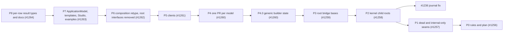

# Database concrete-first types: plan of record

**Status:** Phase 0 landed with this file; phase 1 (#1257) re-verified and implemented on
2026-10-05 (§7, §6.9) · **Created:** 2026-10-04 · **Owner:** Chase Crawford
**Epic:** #1255 (`L03.02.01.56`) · **Phases:** #1256 to #1264 · **Rule:** `.claude/rules/database-area.md`
· **Owner decision:** O34a in `docs/DEVELOPER_EXPERIENCE_DESIGN.md` · **Supersedes:** #1232
**Branch:** every phase branches from the integration branch
`claude/database-inventory-sql-expansion-aa27d1` (draft PR #1168) and merges back.

> **Why this file exists.** It is the sequencing record for one program: moving the Database area
> off its 106 public interfaces without a red build at any step. Each phase's GitHub issue holds the
> acceptance criteria. This file holds the inventory, the order, and the critique corrections every
> phase has to honor. The binding rule text is `database-area.md`. Each phase moves its own
> `docs/DESIGN.md` text with its code (`documentation.md`). When phase 8 lands, the durable parts of
> this file move into those DESIGN files and this file is deleted.

Confidence tags follow the design review that produced this plan. **[Certain]** means checked in
this tree on 2026-10-04 or in a cited reference source. **[Likely]** means a strong inference.
**[Guessing]** means a gap filled by judgment. File references are `path:line` at commit `3f379cca`.

---

## 1. What this program buys, and what it does not

- **It does not make the engine faster.** [Likely] Under NativeAOT, a call site that sees three or
  fewer types devirtualizes. Past that, an abstract call is about 1.5 ns cheaper than an interface
  call, and the run-to-run variance is about ±60% (§9). Model-level calls happen once per
  operation, so moving them from interfaces to abstract classes does not change throughput.
- **The bottleneck that matters is elsewhere.** [Certain] Storage journals two full 8 KiB images
  per touched page per transaction: a `BeforePageImage` on the first touch
  (`Database.Storage/src/Storage.cs:1283-1284`) and an `AfterPageImage` at commit (`:983-984`).
  That is #1236, a journal record-design problem. This program does not touch it, and #1236 lands
  before phase 2 because both rewrite `Storage.cs`.
- **What it does buy:**
  - [Certain] No casts. `resources/Database` has 270 casts today: 258 to a model database
    interface (`(ISqlDatabase)` and its siblings) and 12 to a model engine
    (`(SqlDatabaseEngine)` and its siblings). Studio, the templates and cohesion-examples have more.
  - One copy of each shared contract. The explicit-transaction state machine exists four times
    and the "transaction already active" check five times, with three different messages (§6.4).
  - Sealed hot types: `StorageTransaction`, `StoragePageHandle`, `BTreeIndex`, `TransactionContext`.
  - [Likely] 53 to 58 fewer public types (§10).
- **It is a source break.** [Certain] Tag `v10.0.0-preview.1` (`c0dbbd42`) contains all 106
  `Abstractions/I*.cs` files. Owner decision 2026-10-04 (#1152): no `[Obsolete]` shims, no
  compatibility layer, no upgrade path. The release notes carry one line.

## 2. Decisions this plan records

The owner approved every recommendation on 2026-10-04, after giving the direction on 2026-10-03
(#1255). As they bind implementation:

| # | Decision | Where it lands |
|---|---|---|
| D1 | The Database area deviates from "Public APIs use interfaces" and "Interface-first with a guided abstract base". The deviation is scoped to the area by `.claude/rules/database-area.md`, with a code marker and a change-summary line (`deviations.md`). | P0 |
| D2 | In scope: the five models, the kernel child roots (Storage, Transactions, Indexing, Protocol, Security) and the clients. | P1 to P5 |
| D3 | Exactly five interfaces stay: `IDatabaseApplication`, `IDatabaseApplicationBuilder`, `IDatabaseApplicationContext`, `IDatabaseResourceDescriptor` and `IDatabaseApplicationTestFactory`. | P6 retypes the first three |
| D4 | `IDatabase` becomes `DatabaseInstance`, never `Database`. [Certain, probe] Code in a namespace such as `Acme.Database` that names the type fails with CS0118. | P3 |
| D5 | Builders become sealed with internal constructors. This supersedes the 2026-10-02 ruling ("meant to be implemented elsewhere", `Database.Sql/docs/DESIGN.md:627-631`), its 2026-10-03 narrowing, and #1232. | P4 |
| D6 | Deleted: the unused Execution query pipeline, `Database.Governance`, and the Replication placeholders. | P1 |
| D7 | The existing per-row result types (`QueryRow`, `QueryResultSet`, …) are tightened too. | P8 |
| D8 | Blob and Documents sessions use option B: the typed session exposes the operations, and `session.Database` returns the unbound database. | P4 |
| D9 | All five storage strategies become `internal abstract` (critique correction, §4). | P4 |
| D10 | #1236 lands before phase 2. | Gate on P2 |
| D11 | Breaking the preview.1 surface is accepted, with a release-notes line. | Release |
| D12 | Diagnostics and other result collections are never null. `QueryResult.Diagnostics` returns an empty list instead of `null`, which matches #1228's `GraphSchemaResult<T>.Diagnostics` (§6.8). A member where `null` means "absent" keeps it. | P8 |

**Not decided:** whether an analyzer (`COHDB0xx` under `analyzers/`) should reject deriving from
the root bases outside `resources/Database`. The review made no recommendation, so the approval
did not cover it. The program proceeds without one, and phase 8 raises it again if a phase review
finds misuse (§11).

## 3. Principles

The binding text is `database-area.md`. This section records the evidence behind it.

- **Sealed by default. Abstract only for a variant set, for Hosting, or for an inverted seam**
  (§8 records which case each base meets). PostgreSQL keeps
  its variant sets behind routine tables (`TableAmRoutine`, `src/include/access/tableam.h:322`;
  `IndexAmRoutine`, `src/include/access/amapi.h:233`), and its core managers stay single concrete
  implementations. RavenDB's `DocumentDatabase` is a concrete class
  (`src/Raven.Server/Documents/DocumentDatabase.cs:87`).
- **NVI, the ADO.NET shape.** A public non-virtual member calls a protected abstract core
  (`DbConnection.BeginTransaction`, `System.Data.Common/.../DbConnection.cs:56`, over
  `BeginDbTransaction`, `:51`). A capability is a flag plus a throwing virtual
  (`DbTransaction.SupportsSavepoints`, `DbTransaction.cs:83`). ADO.NET makes the flag itself
  virtual; here it is a constructor-set field (rule 6), so reading it makes no virtual call. A
  virtual member that falls back to another member is banned: the default
  `DbConnection.OpenAsync` runs the synchronous `Open` (`DbConnection.cs:324-341`).
- **Constructor visibility follows assembly topology.** The root bases' leaves live in model
  assemblies, and shipped-to-shipped `InternalsVisibleTo` is banned, so those constructors are
  `protected`. Npgsql closes `NpgsqlDataSource` with an internal constructor (`NpgsqlDataSource.cs:96`),
  but that only works inside one assembly. [Certain, probe] A base with a `private protected`
  constructor can be derived from by its friend test assembly, and any other assembly fails with
  CS0122.
- **Typed surface without casts.** The runtime and NativeAOT support covariant returns of classes
  (`RuntimeFeature.CovariantReturnsOfClasses`, `RuntimeFeature.cs:30`). Async factories use
  Npgsql's `new` shape (`public new ValueTask<NpgsqlTransaction> BeginTransactionAsync`,
  `NpgsqlConnection.cs:627`) and await the base NVI member. Construction-fixed references are base
  fields, and the leaf re-exposes them typed with `new` (critique correction, §6.5).
- **No generic virtual methods.** ILC never devirtualizes them
  (`ILCompiler.Compiler/Compiler/ILScanner.cs:728`).
- **The devirtualization limit.** NativeAOT guards at most 3 types when optimizing for speed and 1
  when optimizing for size (`src/coreclr/jit/compiler.h:8272-8292`), with a hard maximum of 5
  (`jitconfigvalues.h:744`). A host running all five models makes every root call site megamorphic.
  That is why abstract root bases are slightly better than interfaces there, and why it does not
  matter at one call per operation.
- **Tests fake through the bases, not through interfaces.** Model behavior tests use real
  in-memory engines, as RavenDB does (`RunInMemory`, `Config/Categories/CoreConfiguration.cs:60-61`).
  Npgsql's `NpgsqlConnection` is sealed (`NpgsqlConnection.cs:28`).

Npgsql references are to a snapshot of `npgsql/npgsql` `main` taken for the design review. No
local clone exists. The .NET references are to the local `dotnet/runtime` clone, and the
PostgreSQL and RavenDB references to the clones under `C:\Source\repos`.

## 4. Critique corrections folded in

The design review's adversarial critique returned `needs-changes`: 14 problems and 10 missing
items. Each item is resolved below. Line references were re-measured on 2026-10-04, after #1226,
#1228 and #1237 landed. Several had moved.

| # | Critique item | Resolution | Phase |
|---|---|---|---|
| C1 | **Blocker.** P1 cannot make `ITransactionManager` internal: `TransactionCoordinator.Manager` exposes it (`TransactionCoordinator.cs:106`), Indexing.Tests builds one (`IndexTestHarness.cs:26-27`, `:39-40`, `:52`), and Sql.Tests reads it (`SqlMvccBindingTests.cs:63`, `:71`). | `TransactionManager` stays public as a sealed type with an internal constructor and a public static `Create`. The Transactions → Transactions.Tests grant (already present for the deferred-undo clock) is the only one P1 relies on; P1 adds none. Foreign tests are rewritten (§6.9). The gate includes Indexing.Tests and Sql.Tests. | P1 |
| C2 | Four public static factories collide with the planned type names (`LockManager`, `TransactionManager`, `TransactionLog`, `VersionStore`). Three more take or return deleted interfaces: `SqlSchemaCompiler`, `ProtocolFraming`, `TransactionRecovery`. | Each gets a name decision in §5.2. | P1, P2, P4 |
| C3 | The statement-snapshot view cannot be internal: Documents, Graph and Blob build it from other assemblies. | `public TransactionContext PinStatementSnapshot()` (§6.1). | P2 |
| C4 | The four `IStorageTransactionSource` wrappers throw different exception types. Indexing may not reference `DatabaseException`. | A per-engine delegate on `BTreeIndexManagerOptions`. Each engine keeps its own exception vocabulary (§6.3). | P2 |
| C5 | The root bases need protected attach semantics. A covariant `Engine` contradicts field-backed getters. `DatabaseEngineWorker` breaks NVI. `VersionStore`'s leaves share one assembly. | Non-virtual `protected` attach, frozen after build. Typed fields behind `new` properties. `DatabaseEngineWorker` through NVI. A `private protected` `VersionStore` constructor (§6.5, rows 5, 7 and 45). | P2, P3 |
| C6 | Option A gives `Dispose` two meanings on one sealed Blob or Documents type. | Option B (§6.6). | P4 |
| C7 | The Sql.Schema declaration records are positional and cannot be closed. | The declaration model stays internal behind an opaque `public sealed SqlSchema`, and `SqlSchemaCompiler` becomes internal (§6.7). Correction to the critique: Sql.Schema has **no** `InternalsVisibleTo` today. Phase 4 adds Sql.Schema → Sql.Schema.Tests. | P4 |
| C8 | The existing public abstract hot types were not audited. | Each is audited in the phase that touches it (§5.3). | P2, P3, P8 |
| C9 | Test doubles that are both a `Storage` and a record space break under single inheritance. | They are split. Verification found three: `CoordinatorStorage` (`TransactionCoordinatorRecoveryTests.cs:318`), `RollbackStorage` (`TransactionCoordinatorRollbackTests.cs:926`) and `RecordStorage` (`RecordSpaceVersionStoreTests.cs:246`). The first two also name `IStorage` in their base lists and re-implement its members, which breaks in P1, not P2: P1 removes those and moves the hooks to the coordinator (§6.9). Only the record-space split waits for P2. **At P2:** five doubles, not three (two crash-suite doubles came later); all split (§6.9). | P1, P2 |
| C10 | The shared `DatabaseEngineBuilderState.cs` is typed against the root interfaces. The bridge must still satisfy `IDatabaseServer.Context`. | Step P4.0 makes the state generic before the first model PR. The context classes are deleted in P6. | P4.0, P6 |
| C11 | The performance numbers were tagged `[Certain, measured]`, but they do not reproduce. | They are retagged `[Likely]`, given as ranges with ±60% variance, and the "whatever the type shape" claim is dropped (§9). | P0 |
| C12 | Rule conflicts the original rule changes missed: access-modifier rule 1, "internal types are internal", the `Internal/` namespace, one public type per file. | `database-area.md` ("How this relates to the other rules") explains why rule 1 and the checklist line still hold. The moves out of `Internal/`, with their namespace changes and test `using` lines, are counted in P2, P4 and P5 (§10). | P0 |
| C13 | Smaller gaps: the Execution files `QueryPipelineDelegate.cs` and `QueryTransactionStatus.cs`; `EmbeddedDatabase.TryGetEngine`; Studio's casts index a root-typed collection; cohesion-docs; #1236 is two images per page, not one. | All added: rows 15 and 5, §5.2, P7, P8, and §1. | P1, P6, P7, P8 |
| C14 | Some planned surface was wider than needed: the public strategies, `public virtual` observer hooks, and an unexplained provisioning flag. | All five strategies are `internal abstract`. Observer hooks are `protected internal virtual`. `SupportsSchemaProvisioning` is the only capability member on `DatabaseInstance`. | P4, P5, P3 |

Program items added with the critique:

- The four copies of the explicit-transaction state machine (the #1225 follow-up) are
  consolidated in the `DatabaseTransaction` base (§6.4).
- One Diagnostics convention is chosen: never null (§6.8, from #1228).
- #1232 is superseded (D5).

Two defects of the design were found while verifying it for this plan:

- **`EngineLockManager`.** `TransactionCoordinator` wraps the lock manager in a private
  `EngineLockManager` view (`TransactionCoordinator.cs:624`) that defers release-all to the
  transaction manager. That is what keeps #1226's deferred writers holding their locks. A sealed
  `LockManager` cannot be decorated, so the view becomes an internal mode of the type (§6.2).
- **`VersionStore` visibility.** It cannot be `internal abstract`: the public
  `RecordSpaceVersionStore` (`RecordSpaceVersionStore.cs:15`, exposed at
  `TransactionCoordinator.cs:132`) derives from it, and a public class cannot have an internal
  base (CS0060). It is public, with a `private protected` constructor (row 45).

The phase-0 review (2026-10-04) found more. Each is folded in where it lands:

- **Storage sub-components are reachable.** Rows 31, 34, 37 and 38 were marked internal-only on
  a name search. Public `Storage` members return them, and nine shipped assemblies call through
  those members, so the rows become sealed public types in P2 (§5.1).
- **P1 removes the coordinator tests' hooks.** Deleting `IStorage` and `IStorageJournal` removes
  the interception the coordinator tests rely on (eight tests at P1, re-counted in §6.9). The
  hooks move to the coordinator in P1 (§6.9).
- **P3 cannot gate on model behavior.** No model derives from the root bases until P4, so P3
  tests the bases through root-level doubles, and each model's P4 PR carries its own #1188,
  #1225 and #1226 gate (§6.4).
- **The base criteria were incomplete.** Four approved bases have one shipped implementation or
  none. They are inverted seams, a third case the rule now names (§8).
- **The schema-provisioning bridge.** Hosting's type test needs `IDatabaseSchemaProvisioner`
  until P6, so `SqlDatabase` keeps it in its base list until then (row 8).

## 5. Inventory

### 5.1 The 106 public interfaces

[Certain] `rg "interface I\w+" resources/Database --glob '**/src/**'` finds exactly 106
declarations on 2026-10-04. All are public and all are in `Abstractions/`. None are internal or
nested, and no `shared/` folder declares one. The set matches the design inventory row for row.
Paths in the Project column are under `resources/Database/Assimalign.Cohesion.<Project>/src/`.

**How "delete" was checked.** [Certain] A name search cannot see a consumer that reaches a type
through `var` or member access, so every delete row was checked a second way: each public member
whose type is the deleted interface was found (`rg "public .*\bI<Name>\b" --glob '**/src/**'`), and
its member-access consumers were searched outside the owning project, for the storage rows with
`rg "\.(PageManager|FreeSpaceMap|BufferPool)\b|GetUnitIterator\(" resources/Database`. That moved
rows 31, 34, 37 and 38 from delete to sealed: `Storage.PageManager`, `Storage.FreeSpaceMap` and
`Storage.GetUnitIterator` are public (`Storage.cs:113`, `:121`, `:837`, `:843`), and Indexing,
Graph.Catalog, Graph.Storage, Transactions, Sql, Sql.Catalog, KeyValuePair.Catalog,
Documents.Catalog and Blob.Catalog call through them. Making the types internal would need a
shipped-to-shipped `InternalsVisibleTo`. The other delete rows hold:

- row 30's carrier, `Storage.BufferPool` (`Storage.cs:117`), is read only by Storage.Tests
  (`StorageConcurrencyTests.cs:211`, `:338`), so the property becomes internal;
- row 42's carriers are the `TransactionLog` factories (§5.2);
- row 23's carrier is `BTreeIndexManagerOptions.TransactionSource` (§6.3);
- rows 93 to 101 are reached only through `ISqlSchema`, which becomes the opaque `SqlSchema` (§6.7);
- the remaining delete rows have no public carrier.

**Proposal** is one of four values:

- **keep**: the interface stays.
- **delete**: the interface goes and no public type replaces it.
- **sealed**: a public sealed type replaces it.
- **abstract**: an abstract base replaces it. A trailing *(internal)* marks an `internal abstract`
  base.

**Phase** is the phase that changes the row. "P3/P6" means the base arrives in P3 and the
interface is deleted in P6.

| # | Interface | Project | Layer | Proposal | Target | Phase |
|---|---|---|---|---|---|---|
| 1 | `IDatabase` | Database `Abstractions/IDatabase.cs:16` | area root | abstract | `public abstract class DatabaseInstance`, with a protected constructor taking the name, the owning engine and the schema-provisioning capability. `Name` and `Engine` are non-virtual and field-backed, and leaves re-expose `Engine` with `new`. NVI `CreateSessionAsync` calls `CreateSessionCoreAsync`. It absorbs schema provisioning (row 8). | P3/P6 |
| 2 | `IDatabaseApplication` | Database `:19` | area root | keep | Unchanged; `Context` is retyped transitively. The O34 seam. | — |
| 3 | `IDatabaseApplicationBuilder` | Database `:7` | area root | keep | Retyped: `AddEngine(DatabaseEngine)` and `AddEngine(Func<IDatabaseApplicationContext, DatabaseEngine>)`. | P6 |
| 4 | `IDatabaseApplicationContext` | Database `:6` | area root | keep | `Engines` becomes `IReadOnlyList<DatabaseEngine>`, `Servers` becomes `IReadOnlyList<DatabaseServer>`, and `GetEngine` returns `DatabaseEngine`. Adds a static extension `GetEngine<TEngine>(name) where TEngine : DatabaseEngine`. | P6 |
| 5 | `IDatabaseEngine` | Database `:29` | area root | abstract | `public abstract class DatabaseEngine : IAsyncDisposable, IDisposable`, with a protected constructor taking the name and model. `Name`, `Model`, `State`, `Workers` and `Servers` are non-virtual and field-backed. `protected` non-virtual `AttachWorker` and `AttachServer` are refused after `CompleteComposition()` (§6.5). NVI create, open, drop, list and try-get members call `*Core` members. A non-virtual `DisposeAsync` keeps the order servers, then workers, then `DisposeAsyncCore`. Leaves add `public new ValueTask<SqlDatabase> OpenDatabaseAsync(...)` over the base NVI member. | P3/P6 |
| 6 | `IDatabaseEngineBuilder` | Database `:7` | area root | delete | Five `public sealed <Model>DatabaseEngineBuilder` types with internal constructors, typed `AddWorker(Func<SqlDatabaseEngine, DatabaseEngineWorker>)` and `AddServer(Func<SqlDatabaseEngine, DatabaseServer>)`, and a `Build()` that returns the model engine. Shared logic moves to `DatabaseEngineBuilderState<TEngine>` (P4.0). | P4.0/P4/P6 |
| 7 | `IDatabaseEngineWorker` | Database `:19` | area root | delete | The existing `DatabaseEngineWorker` (`DatabaseEngineWorker.cs:64`) is already mostly NVI: #1268 and its review landed a non-virtual `Run` (`:146`) and `RunIteration` (`:207`) over `protected abstract void RunIterationCore` (`:230`), with the per-database failure record (`protected` non-virtual `BeginDatabase`, `ReportFailure` and `ReportUnfinished`, `:242-329`), `Fault`, `ConsecutiveFailures`, `FailureCount` and `FailureBackoff`. The review changed the core from `bool` to `void`: a pass reports unfinished work per database (`ReportUnfinished`), so the return value carried nothing. P3 still makes `Name`, `Kind` and `Interval` set by the constructor and non-virtual (abstract today, `:102-108`). The trigger wait (`:350`) stays a `protected virtual` lifecycle hook; the checkpoint, purge and write-ahead flush workers override it (`*WriteAheadFlushWorker.cs:54`). P3 also moves the engines' shared pump and state fold (`shared/DatabaseEngineWorkerPump.cs`, compiled into each model since #1268's review) into the root engine base. | P3 (NVI)/P6 |
| 8 | `IDatabaseSchemaProvisioner` | Database `:7` | area root | delete | Folded into `DatabaseInstance`: a non-virtual `public bool SupportsSchemaProvisioning`, set by `protected DatabaseInstance(Name name, DatabaseEngine engine, bool supportsSchemaProvisioning = false)` (rule 6), and an NVI `ApplySchemaAsync` that throws `NotSupportedException` while the flag is `false` and otherwise calls a `protected virtual ApplySchemaCoreAsync` whose default throws `NotSupportedException`. It is the only capability member on `DatabaseInstance`. **Bridge:** Hosting's type test (`Hosting/src/Internal/DefaultDatabaseProvisioner.cs:49`) still needs the interface until P6, and the Sql PR of P4 deletes `ISqlDatabase` (`Sql/src/Abstractions/ISqlDatabase.cs:6`), which is how `SqlDatabase` carries it today. So `SqlDatabase` keeps `IDatabaseSchemaProvisioner` in its base list until P6, implemented by the inherited NVI member. Only Sql claims the interface, as today, and the SampleHost provisioning test stays green. P6 deletes it and turns the type test into a flag check. | P3/P6 |
| 9 | `IDatabaseServer` | Database `:26` | area root | abstract | `public abstract class DatabaseServer : IAsyncDisposable`, with a protected constructor taking the engine. `Engine` is non-virtual and field-backed (replacing `Context.Engine`), and leaves re-expose it typed with `new`. NVI `StartAsync` and `StopAsync`, with a state guard, call `StartCoreAsync` and `StopCoreAsync`. `public abstract IReadOnlyCollection<DatabaseServerSession> Sessions`. During the bridge, `Context` stays a temporary abstract member (row 10). | P3/P6 |
| 10 | `IDatabaseServerContext` | Database `:16` | area root | delete | `Engine` and `Sessions` fold into `DatabaseServer`. The four context classes (`Blob`, `Graph`, `KeyValuePair`, `Sql` `Internal/*DatabaseServerContext.cs:9`) and five test-double contexts are deleted **in P6**, because Hosting reads `server.Context.Engine` until P6 retypes it. | P6 |
| 11 | `IDatabaseServerSession` | Database `:11` | area root | abstract | `public abstract class DatabaseServerSession`, with a protected constructor taking `(Guid, ProtocolVersion, string? principal)` that backs non-virtual getters. `public abstract DatabaseSession? DatabaseSession`. Leaves stay internal sealed. | P3/P6 |
| 12 | `IDatabaseSession` | Database `:19` | area root | abstract | `public abstract class DatabaseSession : IAsyncDisposable`. The base owns `State`, `CurrentTransaction` and the one "already active" check, with one message (§6.4). `Database` is non-virtual and field-backed, and leaves re-expose it typed with `new`. NVI `BeginTransactionAsync` and `ExecuteAsync` call `BeginTransactionCoreAsync(IsolationLevel)` and `ExecuteCoreAsync`. | P3/P6 |
| 13 | `IDatabaseTransaction` | Database `:18` | area root | abstract | `public abstract class DatabaseTransaction : IAsyncDisposable`, with a protected constructor taking `(TransactionId, IsolationLevel)`. It owns the explicit-transaction state machine (§6.4). NVI `CommitAsync` and `RollbackAsync` call `CommitCoreAsync` and `RollbackCoreAsync`. A non-virtual `DisposeAsync` rolls back if the transaction is active, then calls `DisposeAsyncCore`. | P3/P6 |
| 14 | `IQueryExecutor` | Execution `:13` | child root | delete | `SqlQueryExecutor` stays internal sealed. **At P1:** its public `ExecuteAsync(QueryRequest, CancellationToken)`, which only threw `NotSupportedException` to satisfy the interface, went with it. | P1 |
| 15 | `IQueryPipeline` | Execution `:18` | child root | delete | Deleted together with `QueryPipelineBuilder`, `QueryExecutionContext`, `Internal/BuiltQueryPipeline`, `QueryPipelineDelegate`, `QueryTransactionStatus`, `QueryStatementResult` and `tests/QueryPipelineTests.cs`. `QueryStatementResult` (`QueryStatementResult.cs:12`) came with the pipeline, and its only constructions are in `QueryPipelineTests.cs:93` and `:272`. This is the Web-style tap-in pipeline the owner ruled out, and no engine consumes it. **At P1:** `Exceptions/QueryExecutionException` went too: its documented scope was "pipeline composition, stage contract violations", and nothing threw it. The Execution test project stays, with a `QueryRequestTests` suite over the surviving request contract instead of an empty shell. | P1 |
| 16 | `IQueryPipelineStage` | Execution `:11` | child root | delete | Deleted with the pipeline. | P1 |
| 17 | `IQueryTransactionScope` | Execution `:15` | child root | delete | Deleted with the pipeline. | P1 |
| 18 | `IResourceGovernor` | Governance `:9` | child root | delete | The interface and the `Database.Governance` project are deleted (D6). | P1 |
| 19 | `IIndex` | Indexing `:28` | child root | sealed | `public sealed class BTreeIndex`, with an internal constructor; `BTreeIndexManager` creates it. | P2 |
| 20 | `IIndexCursor` | Indexing `:10` | child root | sealed | `BTreeCursor`: public sealed if a public `BTreeIndex` member returns it, otherwise internal sealed. | P2 |
| 21 | `IIndexManager` | Indexing `:14` | child root | sealed | One `public sealed class BTreeIndexManager` for the manager and the registry. It absorbs `public static class BTreeIndexManager` (`BTreeIndexManager.cs:13`, `Create` at `:38`). | P2 |
| 22 | `IIndexRegistry` | Indexing `:17` | child root | sealed | Merged into `BTreeIndexManager` (row 21). | P2 |
| 23 | `IStorageTransactionSource` | Indexing `:16` | child root | delete | `BTreeIndexManagerOptions` takes a per-engine delegate, `Func<TransactionContext, StorageTransaction>` (§6.3). | P2 |
| 24 | `IProtocolFrameReader` | Protocol `:10` | child root | abstract | `public abstract class ProtocolFrameReader : IAsyncDisposable`, with a protected constructor, because its leaves live in Protocol, Database.Client and Blob.Client. NVI `ReadFrameAsync` calls `ReadFrameCoreAsync`, and a non-virtual `DisposeAsync` calls `DisposeAsyncCore` (the interface extends `IAsyncDisposable` today, `IProtocolFrameReader.cs:10`). `public static ProtocolFrameReader Create(Stream, bool leaveOpen = false)` replaces `ProtocolFraming.CreateReader`. | P2 |
| 25 | `IProtocolFrameWriter` | Protocol `:10` | child root | abstract | `public abstract class ProtocolFrameWriter : IAsyncDisposable`. NVI `WriteFrameAsync` calls `WriteFrameCoreAsync`, and `DisposeAsync` calls `DisposeAsyncCore`. `Create(Stream, bool)` replaces `ProtocolFraming.CreateWriter`. | P2 |
| 26 | `IAuthorizationService` | Security `:9` | child root | delete | It has no implementer anywhere. | P1 |
| 27 | `IDatabaseAuthenticator` | Security `:18` | child root | abstract | `public abstract class DatabaseAuthenticator`, with a protected constructor. NVI `AuthenticateAsync` calls `AuthenticateCoreAsync`. It absorbs `public static class DatabaseAuthenticator` (`DatabaseAuthenticator.cs:8`) as `public static DatabaseAuthenticator AllowAll`. | P2 |
| 28 | `IStorage` | Storage `:16` | child root | delete | Consumers retype to the existing abstract `Storage`. The default member `EnsureCommitDurable` (`IStorage.cs:218`) already exists as `Storage.EnsureCommitDurable` (`Storage.cs:219`), and the explicit implementation (`Storage.cs:241`) goes. Two Transactions.Tests doubles re-implement `IStorage.Checkpoint` and `ReserveTransactionSequence`, which are non-virtual on `Storage` (`:549`, `:467`); their hooks move to the coordinator in P1 (§6.9). | P1 |
| 29 | `IStorageBackupManager` | Storage `:9` | child root | delete | It has no implementer and no reference. | P1 |
| 30 | `IStorageBufferPool` | Storage `:15` | child root | delete | `StorageBufferPool` stays internal sealed, and the public `Storage.BufferPool` (`Storage.cs:117`) becomes internal. Only Storage.Tests reads it (`StorageConcurrencyTests.cs:211`, `:338`), through Storage's existing grant. | P1 |
| 31 | `IStorageFreeSpaceMap` | Storage `:15` | child root | sealed | `public sealed class StorageFreeSpaceMap`, with an internal constructor. The public `Storage.FreeSpaceMap` (`Storage.cs:121`) returns it, and Graph.Catalog and Graph.Storage call `IsAllocated` through it (`Internal/DefaultGraphCatalog.cs:298`, `Internal/DefaultGraphStore.cs:234`). **At P2:** landed as planned, moved out of `Internal/`; its public members are the interface's, unchanged. | P2 |
| 32 | `IStorageJournal` | Storage `:31` | child root | delete | Consumers retype to the existing abstract `StorageJournal`. `FaultInjectingJournal` (`TransactionCoordinatorRollbackTests.cs:844`) decorates the interface to reject rollback records; `StorageJournal.AppendRollback` is non-virtual (`StorageJournal.cs:78`), so the double is deleted and its fault moves to the coordinator in P1 (§6.9). `StorageJournal` itself is audited in P2 (§5.3). | P1 |
| 33 | `IStoragePageHandle` | Storage `:26` | child root | sealed | `public sealed class StoragePageHandle`, with an internal constructor. It is on the per-page hot path. **At P2:** landed as planned. | P2 |
| 34 | `IStoragePageManager` | Storage `:22` | child root | sealed | `public sealed class StoragePageManager`, with an internal constructor. The public `Storage.PageManager` (`Storage.cs:113`) returns it. Indexing's `BTreeIndex` calls `PageManager.GetPage` on the per-page hot path (`Internal/BTreeIndex.cs:104` and seven more sites), as do Graph.Catalog and Graph.Storage, so every call becomes non-virtual. **At P2:** landed, and the type is no longer disposable: the interface extended `IAsyncDisposable` and `IDisposable`, but both members were empty and the storage owns the manager, so a public `Dispose` only invited callers to "dispose" a component they do not own. The storage's two no-op calls and five Storage.Tests `using` declarations went with them. | P2 |
| 35 | `IStorageRecoveryManager` | Storage `:9` | child root | delete | It has no implementer and no reference. | P1 |
| 36 | `IStorageTransaction` | Storage `:30` | child root | sealed | `public sealed class StorageTransaction`, with an internal constructor. **At P2:** landed as planned. `Storage`'s argument check lost its type test (`is not StorageTransaction`), which a sealed parameter type can no longer fail; it never checked that the transaction belongs to the same storage instance, and still does not (no behavior change; §12). | P2 |
| 37 | `IStorageUnit` | Storage `:19` | child root | sealed | `public readonly struct StorageUnit` (internal today, `Internal/StorageUnit.cs:8`), with an internal constructor. The iterator returns it unboxed. **At P2:** landed as planned. | P2 |
| 38 | `IStorageUnitIterator` | Storage `:10` | child root | sealed | `public sealed class StorageUnitIterator : IEnumerator<StorageUnit>`, with an internal constructor. The public `Storage.GetUnitIterator` (`Storage.cs:837`, `:843`) returns it to Transactions, Sql, the five model catalogs and Graph.Storage. **At P2:** landed; `Next(out StorageUnit)` returns the default unit, not `null`, when the scan is exhausted, and `Current` reads the default unit outside a scan. No caller read either case. | P2 |
| 39 | `ILockManager` | Transactions `:16` | child root | sealed | `public sealed class LockManager`, with an internal constructor. It absorbs `public static class LockManager` (`LockManager.cs:8`) as `public static LockManager Create()`. The coordinator's view becomes an internal release filter (§6.2). **At P2:** landed; the internal `DefaultLockManager` was folded in. The view had grown since the plan: #1268 gave it the offline abandonment of waits (`AbandonLockWaits`), so the internal mode carries both (§6.2). | P2 |
| 40 | `IRecordVersionIndex` | Transactions `:13` | child root | abstract | `public abstract class RecordVersionIndex` in Transactions, with a protected constructor, because its leaves live in Indexing, Documents.Catalog and Graph.Storage. NVI erase and clear-deleter members call `protected abstract` cores. Indexing's sealed type (`Indexing/src/RecordVersionIndex.cs:17`) is renamed `BTreeRecordVersionIndex`. **At P2:** landed; the public members check for a null bracket. The rename lands in the Transactions commit, not the Indexing one: Sql's and KeyValuePair's executors import both namespaces, so the two `RecordVersionIndex` types cannot coexist for one commit. | P2 |
| 41 | `ITransactionContext` | Transactions `:14` | child root | sealed | `public sealed class TransactionContext`, with an internal constructor, plus `public TransactionContext PinStatementSnapshot()` (§6.1). It is the most-consumed kernel contract (47 `src` files), and every call becomes non-virtual. **At P2:** landed, promoted from the internal `DefaultTransactionContext`; 69 `.cs` files retyped across the tree. | P2 |
| 42 | `ITransactionLog` | Transactions `:17` | child root | delete | `internal abstract class TransactionLog` in `Internal/` (rule 11). `public static class TransactionLog` (`TransactionLog.cs:12`) is deleted and its factories become internal (§5.2). | P1 |
| 43 | `ITransactionManager` | Transactions `:17` | child root | sealed | `public sealed class TransactionManager`, promoted from `DefaultTransactionManager`, with an internal constructor. It gets a public static `Create`, an internal overload, and stays exposed by the coordinator (§5.2, C1). | P1 (P2 retypes the parameters) |
| 44 | `ITransactionRecordSpace` | Transactions `:16` | child root | abstract | `public abstract class TransactionRecordSpace`, with a protected constructor, because its leaves live in Sql, KeyValuePair, Graph.Storage, Documents.Storage and Blob.Storage. NVI read, update and delete. **At P2:** landed; location packing and unpacking are NVI too, and update and delete check for a null bracket. | P2 |
| 45 | `IVersionStore` | Transactions `:17` | child root | abstract | `public abstract class VersionStore`, with a `private protected` constructor, because both leaves (`RecordSpaceVersionStore` and `Internal/InMemoryVersionStore`) live in Transactions. It absorbs `public static class VersionStore` (`VersionStore.cs:8`) as `public static VersionStore CreateInMemory()`. **At P2:** landed. The base's public members carry the checks both leaves made (a canceled token on append and read, a null snapshot on read); prune and purge check nothing in the base, because the two stores observe cancellation at different points. | P2 |
| 46 | `IReplicationCoordinator` | Replication (unshipped) | other | delete | The project is deleted with the other Replication placeholders (D6). | P1 |
| 47 | `ISqlReplicationSource` | Sql.Replication (unshipped) | model child | delete | The project is deleted. | P1 |
| 48 | `IDatabaseClient` | Client `:17` | client | sealed | `public sealed class DatabaseClient`. It absorbs the static class (`DatabaseClient.cs:10`). | P5 |
| 49 | `IDatabaseCommandClient` | Client `:8` | client | sealed | `public sealed class DatabaseCommandClient`. It absorbs the static class (`DatabaseCommandClient.cs:9`). | P5 |
| 50 | `IDatabaseConnection` | Client `:19` | client | sealed | `public sealed class DatabaseConnection`, with an internal constructor. `ExecuteAsync<TResult>` (`IDatabaseConnection.cs:73`) is a generic virtual call today, and becomes a non-virtual generic method. | P5 |
| 51 | `IDatabaseProtocolExchange<TResult>` | Client `:12` | client | abstract | `public abstract class DatabaseProtocolExchange<TResult>`, with a protected constructor. The NVI `ExecuteAsync` resets the base-owned `IsResponseComplete` and then calls `ExecuteCoreAsync`; a leaf reports completion through a protected method. This replaces the default interface member (`:24`) and the three hand-written resets in the Sql, KeyValuePair and Graph exchanges. | P5 |
| 52 | `IDatabaseStreamingExchange` | Client `:16` | client | abstract | `public abstract class DatabaseStreamingExchange`, with a protected constructor and NVI. | P5 |
| 53 | `IBlobContainer` | Blob `:18` | model | sealed | `public sealed class BlobContainer`, with an internal constructor. | P4 |
| 54 | `IBlobDatabase` | Blob `:11` | model | sealed | `public sealed class BlobDatabase : DatabaseInstance`, with option B (§6.6). `BlobSessionDatabase` (`Internal/BlobDatabaseSession.cs:216`) is deleted. | P4 |
| 55 | `IBlobDatabaseEngineBuilder` | Blob `:10` | model | sealed | `public sealed class BlobDatabaseEngineBuilder`, with an internal constructor and typed `AddServer` and `AddWorker`. | P4 |
| 56 | `IBlobStorageStrategy` | Blob `:10` | model | abstract *(internal)* | `internal abstract class BlobStorageStrategy`. The option and builder properties become internal; it is a test seam through the existing grant. | P4 |
| 57 | `IBlobCatalog` | Blob.Catalog `:16` | model child | sealed | `public sealed class BlobCatalog`. It absorbs the static class (`BlobCatalog.cs:10`, `Open` at `:18`). | P4 |
| 58 | `IBlobClient` | Blob.Client `:10` | client | sealed | `public sealed class BlobClient`. It absorbs the static class (`BlobClient.cs:8`). | P5 |
| 59 | `IBlobConnection` | Blob.Client `:15` | client | sealed | `public sealed class BlobConnection`, with an internal constructor. | P5 |
| 60 | `IDocumentCollection` | Documents `:16` | model | sealed | `public sealed class DocumentCollection`, with an internal constructor. | P4 |
| 61 | `IDocumentDatabase` | Documents `:10` | model | sealed | `public sealed class DocumentDatabase : DatabaseInstance`, with option B (§6.6). `DocumentSessionDatabase` (`Internal/DocumentDatabaseSession.cs:264`) is deleted. | P4 |
| 62 | `IDocumentDatabaseEngineBuilder` | Documents `:10` | model | sealed | `public sealed class DocumentDatabaseEngineBuilder`, with an internal constructor. | P4 |
| 63 | `IDocumentStorageStrategy` | Documents `:10` | model | abstract *(internal)* | `internal abstract class DocumentStorageStrategy`, with an internal option property. | P4 |
| 64 | `IDocumentCatalog` | Documents.Catalog `:16` | model child | sealed | `public sealed class DocumentCatalog`. It absorbs the static class (`DocumentCatalog.cs:11`). | P4 |
| 65 | `IGraphDatabase` | Graph `:12` | model | sealed | `public sealed partial class GraphDatabase : DatabaseInstance`. | P4 |
| 66 | `IGraphDatabaseEngineBuilder` | Graph `:10` | model | sealed | `public sealed class GraphDatabaseEngineBuilder`, with an internal constructor. | P4 |
| 67 | `IGraphSchema` | Graph `:9` | model | sealed | `public sealed class GraphSchema`. It absorbs the static class (`GraphSchema.cs:6`) with `Open(GraphDatabase, DatabaseSession)`. | P4 |
| 68 | `IGraphStorageStrategy` | Graph `:10` | model | abstract *(internal)* | `internal abstract class GraphStorageStrategy`. The fault-injection double derives through the test grant. | P4 |
| 69 | `IGraphCatalog` | Graph.Catalog `:15` | model child | sealed | `public sealed class GraphCatalog`. It absorbs the static class (`GraphCatalog.cs:10`). | P4 |
| 70 | `IGraphStore` | Graph.Storage `:9` | model child | sealed | `public sealed class GraphStore`. It absorbs the static class (`GraphStore.cs:10`). | P4 |
| 71 | `IGraphClient` | Graph.Client `:10` | client | sealed | `public sealed class GraphClient`. It absorbs the static class (`GraphClient.cs:9`). | P5 |
| 72 | `IGraphConnection` | Graph.Client `:11` | client | sealed | `public sealed class GraphConnection`, with an internal constructor. | P5 |
| 73 | `IKeyValueDatabase` | KeyValuePair `:23` | model | sealed | `public sealed class KeyValueDatabase : DatabaseInstance`. | P4 |
| 74 | `IKeyValueDatabaseEngineBuilder` | KeyValuePair `:9` | model | sealed | `public sealed class KeyValueDatabaseEngineBuilder`, with an internal constructor. | P4 |
| 75 | `IKeyValueStorageStrategy` | KeyValuePair `:13` | model | abstract *(internal)* | `internal abstract class KeyValueStorageStrategy`. It has two real variants plus the durability doubles, which derive through the existing grant. The option property becomes internal. | P4 |
| 76 | `IKeyValueCatalog` | KeyValuePair.Catalog `:27` | model child | sealed | `public sealed class KeyValueCatalog`. It absorbs the static class (`KeyValueCatalog.cs:12`), and `CaptureSnapshot` (`:41`) becomes an instance method. | P4 |
| 77 | `IKeyValueCatalogSnapshot` | KeyValuePair.Catalog `:14` | model child | sealed | `public sealed class KeyValueCatalogSnapshot`, with an internal constructor. | P4 |
| 78 | `IKeyValueClient` | KeyValuePair.Client `:20` | client | sealed | `public sealed class KeyValueClient`. It absorbs the static class (`KeyValueClient.cs:11`). | P5 |
| 79 | `IKeyValueClientObserver` | KeyValuePair.Client `:18` | client | abstract | `public abstract class KeyValueClientObserver`, with a protected constructor. Its hooks are `protected internal virtual` with empty bodies. | P5 |
| 80 | `IKeyValueConnection` | KeyValuePair.Client `:24` | client | sealed | `public sealed class KeyValueConnection`, with an internal constructor. | P5 |
| 81 | `ISqlAggregateExpression` | Sql `:9` | model | sealed | `public sealed class SqlAggregateExpression`, with get-only `SourceType`, `Selector` and `Predicate` and an internal constructor. Not a record: the current type is a positional record (`Internal/SqlAggregateExpression.cs:9`), and a public one would expose a public `with` that clones around validation (C7). `Sql.Sum` (`Sql.cs:23`) returns it. | P4 |
| 82 | `ISqlDatabase` | Sql `:6` | model | sealed | `public sealed class SqlDatabase : DatabaseInstance`, which passes `supportsSchemaProvisioning: true` to the base constructor and overrides `ApplySchemaCoreAsync`. Until P6 it also lists `IDatabaseSchemaProvisioner` (row 8). | P4 |
| 83 | `ISqlDatabaseEngineBuilder` | Sql `:10` | model | sealed | `public sealed class SqlDatabaseEngineBuilder`, with an internal constructor and a typed `AddServer(Func<SqlDatabaseEngine, DatabaseServer>)` (D5). `ExternalEngineBuilder` (`tests/SqlExpressionDepthExecutionTests.cs:1230`) is deleted, and its `ExpressionNestingLimit` cases (32 to 4096, checked in `Build()`) are retested against the sealed builder. | P4 |
| 84 | `ISqlStorageStrategy` | Sql `:13` | model | abstract *(internal)* | `internal abstract class SqlStorageStrategy`, with an internal option property. The crash doubles derive through the existing grant. `CrashCaptureSqlStorageStrategy` is `public sealed` today (`tests/TestObjects/CrashCaptureSqlStorageStrategy.cs:20`) and becomes `internal sealed`, because a public class cannot derive from an internal one (CS0060); only Sql.Tests uses it. | P4 |
| 85 | `ISqlCatalog` | Sql.Catalog `:23` | model child | sealed | `public sealed class SqlCatalog`. It absorbs the static class (`SqlCatalog.cs:25`, `Open` at `:33` and `:53`), and `CaptureSnapshot` (`:72`) becomes an instance method. | P4 |
| 86 | `ISqlCatalogSnapshot` | Sql.Catalog `:14` | model child | sealed | `public sealed class SqlCatalogSnapshot`, with an internal constructor. | P4 |
| 87 | `ISqlSchemaBuilder` | Sql.Schema `:9` | model child | sealed | `public sealed class SqlSchemaBuilder`, with an internal constructor. `Table<T>` is a non-virtual generic method. The SDK constant (`CSharpSchemaExtractor.cs:20`) changes in the same commit. | P4 |
| 88 | `ISqlTableBuilder<TRow>` | Sql.Schema `:8` | model child | sealed | `public sealed class SqlTableBuilder<TRow>`. The SDK constants (`CSharpSchemaExtractor.cs:21`, `:729-730`) change in lockstep. | P4 |
| 89 | `ISqlTypeBuilder` | Sql.Schema `:6` | model child | sealed | `public sealed class SqlTypeBuilder`, with the SDK constant at `:22`. | P4 |
| 90 | `ISqlPrincipalBuilder` | Sql.Schema `:6` | model child | sealed | `public sealed class SqlPrincipalBuilder`, with the SDK constant at `:23`. | P4 |
| 91 | `ISqlTriggerContext` | Sql.Schema `:6` | model child | sealed | `public sealed class SqlTriggerContext`, with a private constructor. It is a phantom that appears only inside trigger expression trees. The canonicalizer string (`CSharpExpressionCanonicalizer.cs:480`) changes in lockstep. | P4 |
| 92 | `ISqlSchema` | Sql.Schema `:9` | model child | sealed | An opaque `public sealed class SqlSchema` that exposes `Name` and `Compile()` (§6.7). | P4 |
| 93 | `ISqlSchemaTable` | Sql.Schema `:7` | model child | delete | The internal record (`Internal/SqlSchemaBuilder.cs:228`) stays internal behind `SqlSchema`. | P4 |
| 94 | `ISqlSchemaType` | Sql.Schema `:6` | model child | delete | The internal record (`:148`) stays internal. | P4 |
| 95 | `ISqlSchemaColumn` | Sql.Schema `:6` | model child | delete | The internal record (`:239`) stays internal. | P4 |
| 96 | `ISqlSchemaExtension` | Sql.Schema `:4` | model child | delete | The internal record (`:241`) stays internal. | P4 |
| 97 | `ISqlSchemaFunction` | Sql.Schema `:6` | model child | delete | The internal record (`:243`) stays internal. | P4 |
| 98 | `ISqlSchemaGrant` | Sql.Schema `:6` | model child | delete | The internal record (`:289`) stays internal. | P4 |
| 99 | `ISqlSchemaPrincipal` | Sql.Schema `:6` | model child | delete | The internal record (`:285`) stays internal. | P4 |
| 100 | `ISqlSchemaReference` | Sql.Schema `:6` | model child | delete | The internal record (`:237`) stays internal. | P4 |
| 101 | `ISqlSchemaTrigger` | Sql.Schema `:7` | model child | delete | The internal record (`:245`) stays internal. | P4 |
| 102 | `ISqlClient` | Sql.Client `:19` | client | sealed | `public sealed class SqlClient`. It absorbs the static class (`SqlClient.cs:11`). | P5 |
| 103 | `ISqlClientObserver` | Sql.Client `:16` | client | abstract | `public abstract class SqlClientObserver`, with a protected constructor and `protected internal virtual` hooks with empty bodies. | P5 |
| 104 | `ISqlConnection` | Sql.Client `:18` | client | sealed | `public sealed class SqlConnection`, with an internal constructor. | P5 |
| 105 | `IDatabaseResourceDescriptor` | ApplicationModel `:6` | applicationmodel | keep | Unchanged. It extends the library-owned `IResourceCommandDescriptor`, following the 17-area pattern. | — |
| 106 | `IDatabaseApplicationTestFactory` | Testing `:20` | other | keep | Unchanged. It matches Web.Testing's `IWebApplicationTestFactory`. | — |

**Tally after corrections: delete 28, sealed 52, abstract 21 (16 public, 5 internal), keep 5.**
#1255 recorded the design's tally of 24, 56, 21 and 5. Three corrections move rows.
`ITransactionManager` moves from delete to sealed (C1). The nine Sql.Schema declaration
interfaces move from sealed to delete, because their records stay internal (C7). The four
storage sub-component interfaces (rows 31, 34, 37 and 38) move from delete to sealed, because
public `Storage` members return them (the member-access check above).

### 5.2 Public static factories and other public signatures

[Certain] These public members name a deleted interface, or collide with a type name the program
introduces. `rg` over `resources/Database --glob '**/src/**'` found them, and the phase-0 review
added the composition verbs, extension containers and factory below. Each has an explicit
decision.

| Type or member | Today | Decision | Phase |
|---|---|---|---|
| `LockManager` (`Transactions/src/LockManager.cs:8`, `Create` at `:16`) | `public static class`, returns `ILockManager` | The name passes to the sealed `LockManager`, and `public static LockManager Create()` moves onto it, so call sites are unchanged. **At P2:** landed as planned. | P2 |
| `TransactionManager` (`TransactionManager.cs:12`, `Create` at `:40`) | `public static class`, `Create(ITransactionLog, ILockManager, IVersionStore, Func<TransactionSequence>?)` | The name passes to the public sealed `TransactionManager`. A public `Create(LockManager, VersionStore, Func<TransactionSequence>? = null)` builds a standalone, non-durable manager over an in-memory log. The durable manager is the one `TransactionCoordinator` builds. An internal overload takes a `TransactionLog`, for the coordinator and Transactions.Tests. In P1 the parameters are still the interfaces; P2 retypes them. **At P2:** retyped to `LockManager` and `VersionStore`, both overloads. | P1/P2 |
| `TransactionLog` (`TransactionLog.cs:12`, `CreateInMemory` at `:19`, `CreateJournalBound(IStorageJournal)` at `:28`) | `public static class` | The public class is deleted. The name passes to `internal abstract class TransactionLog`, and its factories become internal statics on it. [Certain] Only tests called them: Transactions.Tests, and Indexing.Tests through the harness, which the new `Create` no longer needs. | P1 |
| `VersionStore` (`VersionStore.cs:8`, `CreateInMemory` at `:16`) | `public static class`, returns `IVersionStore` | The name passes to `public abstract class VersionStore` (row 45), and `CreateInMemory()` stays as a static on the base. **At P2:** landed as planned. | P2 |
| `SqlSchemaCompiler` (`Sql.Schema/src/SqlSchemaCompiler.cs:13`, `Compile(ISqlSchema, EngineModel)` at `:20`) | `public static class` | Becomes `internal static`. The public compile entry points are `SqlSchema.Compile(name, configure)` (static, unchanged) and the instance `SqlSchema.Compile()`. [Certain] Outside Sql.Schema, only Sql.Schema's own tests call it. | P4 |
| `ProtocolFraming` (`Protocol/src/ProtocolFraming.cs:11`, `CreateReader` at `:19`, `CreateWriter` at `:31`) | `public static class`, returns the frame interfaces | Deleted. The factories move onto the abstract bases (`ProtocolFrameReader.Create`, `ProtocolFrameWriter.Create`), the `Aes.Create()` shape. The callers are the four model servers, `ProtocolChannel`, two test clients and the Protocol tests. | P2 |
| `TransactionRecovery` (`TransactionRecovery.cs:18`, `Analyze` at `:25` and `:40`) | `public static class` taking `IStorageJournal` | Kept as a public static class: it is a stateless analysis with no interface twin. The parameter is retyped to `StorageJournal`. | P1 |
| `Sql.Sum<TSource>` (`Sql/src/Sql.cs:23`) | returns `ISqlAggregateExpression` | Returns `SqlAggregateExpression` (row 81). | P4 |
| `<Model>DatabaseEngine.CreateBuilder()` (`SqlDatabaseEngine.cs:181`, `KeyValueDatabaseEngine.cs:152`, Graph, Documents and Blob at `:67`) | return builder interfaces | Return the sealed builders. | P4 |
| The five composition verbs `AddSql`, `AddKeyValue`, `AddGraph`, `AddDocuments` and `AddBlob` (`Extensions/SqlDatabaseApplicationExtensions.cs:16`, `KeyValueDatabaseApplicationExtensions.cs:16`, `GraphDatabaseApplicationExtensions.cs:17`, `DocumentDatabaseApplicationExtensions.cs:17`, `BlobDatabaseApplicationExtensions.cs:17`) | take `Action<IDatabaseApplicationContext, I<Model>DatabaseEngineBuilder>` | Retyped to the sealed builder in each model's PR. They stay `extension(IDatabaseApplicationBuilder)` members on the kept seam. The templates call them with untyped lambdas (`cohesion-database/Program.cs:11`), so they compile unchanged. | P4 |
| `SqlDatabaseEngineFactory` (`Sql/src/SqlDatabaseEngineFactory.cs:8`) | `public static class` that forwards to `SqlDatabaseEngine.Create(options)` (`SqlDatabaseEngine.cs:163`) | Deleted in the Sql PR: rule 1 puts the factory on the type itself, which already has it. No code calls it. Its `(rootPath, engineName)` overload is not carried over, and the two doc mentions (`Database.Sql/docs/DESIGN.md:634`, `docs/programs/DATABASE_HOSTING_DESIGN.md:61`) change with it. | P4 |
| `BlobContainerExtensions.GetOwnershipAsync` (`Blob/src/Extensions/BlobContainerExtensions.cs:13`) | `extension(IBlobContainer)` that casts to the internal implementation and throws for anything else | Folded into the sealed `BlobContainer` as an instance method, and the extension container is deleted. It existed only to avoid widening the interface, and a type in the same assembly needs no extension of itself. | P4 |
| `DatabaseClientStreamingExtensions.ExecuteStreamingAsync` (`Client/src/Extensions/DatabaseClientStreamingExtensions.cs:13`, parameter at `:30`) | `extension(IDatabaseClient)`, taking `IDatabaseStreamingExchange` | Folded into the sealed `DatabaseClient` as an instance method taking `DatabaseStreamingExchange`, for the same reason. The extension container is deleted. | P5 |
| `SqlProtocolConnectionExtensions.ExecuteAsync` (`Sql.Client/src/Extensions/SqlProtocolConnectionExtensions.cs:24`) | old-style `this IDatabaseConnection` extension | Stays an extension, because `DatabaseConnection` lives in Database.Client. It is retyped to `DatabaseConnection` and moves into an `extension(DatabaseConnection connection)` block (`general-rules.md`, extension containers). | P5 |
| `SqlCatalog.CaptureSnapshot` (`:72`), `KeyValueCatalog.CaptureSnapshot` (`:41`) | static, taking the catalog interface | Instance methods on the sealed catalogs. | P4 |
| `BTreeIndexManager.EnsureFormat` (`Indexing/src/BTreeIndexManager.cs:55`) | takes `IStorage` | Takes `Storage`. | P1 |
| `BTreeIndexManagerOptions.Storage` (`Indexing/src/BTreeIndexManagerOptions.cs:16`) | `IStorage` (found at P1; the review missed it) | `Storage`. | P1 |
| The five model storages' `WriteAheadJournal` (`SqlStorage`, `KeyValueStorage`, `GraphStorage`, `DocumentStorage`, `BlobStorage`) | return `IStorageJournal` (found at P1) | Return `StorageJournal`. Their engines pass it to the coordinator, so no call site changes. | P1 |
| `TransactionCoordinator(IStorage, IStorageJournal, ITransactionRecordSpace)` and `TransactionCoordinator.Manager` | take the storage interfaces, expose `ITransactionManager` | Take `Storage` and `StorageJournal`, expose the sealed `TransactionManager`. `IsStorageOffline` and `AnalyzeAndScrub` lose their `is Storage` type tests, and `TransactionRecovery` its `ReadAll` fallback for non-`StorageJournal` journals. | P1 |
| `EmbeddedDatabase.Engines`, `TryGetEngine(string, …)` and `TryGetEngine(EngineModel, …)` (`Embedded/src/EmbeddedDatabase.cs:32`, `:75`, `:95`; the field at `:21-24`) | typed `IDatabaseEngine` | Typed `DatabaseEngine`. | P6 |
| The 15 triplet factories: `DatabaseClient`, `DatabaseCommandClient`, `BlobCatalog`, `BlobClient`, `DocumentCatalog`, `GraphCatalog`, `GraphClient`, `GraphSchema`, `GraphStore`, `KeyValueCatalog`, `KeyValueClient`, `SqlCatalog`, `SqlClient`, `BTreeIndexManager`, `DatabaseAuthenticator` | `public static class` + interface + internal implementation | Each collapses into one sealed type of the same name. `DatabaseAuthenticator` becomes abstract, with `AllowAll`. | per row |

### 5.3 Existing public abstract types, audited in the phase that touches them

| Type | Finding | Phase |
|---|---|---|
| `Storage.Model` (`Storage/src/Storage.cs:101`) | `public abstract StorageModel Model`. The value is fixed per storage, so it becomes a base field set by the protected constructor (rule 6). **At P2:** `protected Storage(StorageModel model, StorageStream data, ...)`. The five model storages and 21 test doubles (Storage.Tests 15, Transactions.Tests 5, Indexing.Tests 1; counted at P2) pass their model instead of overriding the getter. | P2 |
| `StorageJournal` (`Storage/src/Journal/StorageJournal.cs:21`) | After P1 it is the type the coordinator and recovery name. It has one shipped leaf, the sealed `StreamJournal` in the same assembly (`StreamJournal.cs:16`), so as it stands it meets none of rule 2's cases, and its constructor is `protected` (`:32`). P2's Storage commit, after #1236 settles the journal format, either collapses `StreamJournal` into one public sealed `StorageJournal`, keeping the file factories (`StreamJournal.cs:75`, `:86`), or records the second variant that justifies the base and narrows the constructor to `private protected` (rule 3). **Decided at P2: collapsed.** No second variant exists: no test or other assembly derives from `StorageJournal`, and #1236 settled the format with one medium. `StreamJournal` is deleted; its medium operations became private members of `public sealed class StorageJournal`, and its three public constructors (over a `Stream`, a `StorageStream`, an `IFileSystemFileHandle`) and two `FromFile` factories became the journal's own. The constructors stay public rather than internal behind new factories: they were already public API on the former leaf, and Transactions.Tests, which no grant reaches, builds journals over memory streams for `TransactionRecovery`. The deviation marker goes with the base (§8). | P2 |
| `CompiledSchema` (`Database/src/Provisioning/CompiledSchema.cs:12`) | A public abstract class whose leaf (`SqlCompiledSchema`) lives in Sql.Schema. It keeps a protected constructor. Audit its members for NVI when `DatabaseInstance.ApplySchemaAsync` starts taking it. | P3 |
| `DatabaseEngineWorker` (`Database/src/DatabaseEngineWorker.cs:64`) | Public abstract `Name`, `Kind` and `Interval`, and a virtual `WaitForTrigger`. `Run`, `RunIteration` and the per-database reporting members are non-virtual already (#1268 and its review), over `protected abstract void RunIterationCore`; P3 finishes the NVI conversion (row 7). #1264's body lists it, but P3 is where the root bases are written, so it moves there. | P3 |
| `QueryRow` (`Execution/src/QueryRow.cs:8`) | Nine public abstract getters (`:13-69`). `GetValue` returns `object?` and boxes. It has four leaves in four assemblies (`SqlMaterializedRow`, `KeyValueMaterializedRow`, `GraphQueryRow`, `DocumentQueryRow`), so it is megamorphic in a multi-model host. It gets NVI with the ordinal checks in the base, and typed accessors on the hot path. | P8 |
| `QueryResultSet` (`QueryResultSet.cs:15`) | `GetRowsAsync` returns `IAsyncEnumerable<QueryRow>` (`:27`), which costs one interface dispatch per row. [Guessing] Replace it with a non-virtual pull shape only if a per-row benchmark shows the dispatch matters. | P8 |
| `QueryResult` (`QueryResult.cs:10`) | `Diagnostics` is `IReadOnlyList<Diagnostic>?` (`:33`). It becomes non-null (§6.8). | P8 |
| `QueryRequest` (`QueryRequest.cs:10`, `:36`) | Audit for NVI and constructor visibility. `Parameters` (`:29`, overridden in four model requests) stays nullable: `null` means the request carries none, which rule 9 leaves alone. | P8 |
| `QueryParser` and `QueryAnalyzer` (`Language/src/QueryParser.cs:12`, `QueryAnalyzer.cs:12`) | Audit for NVI. `QueryAnalyzer` is declared in a block-scoped namespace (`QueryAnalyzer.cs:7`, a forbidden pattern) with empty `
` docs. `QueryParserOptions.Analyzers` exposes a mutable `List<QueryAnalyzer>` (`QueryParserOptions.cs:12`). | P8 |

## 6. Design notes for the corrected rows

### 6.1 The statement-snapshot view on `TransactionContext` (row 41)

Documents, Graph and Blob each wrap the transaction context in an identical decorator that pins a
read-committed statement's snapshot: `DocumentStatementContext`, `GraphStatementContext` and
`BlobStatementContext` (`Internal/DocumentOperation.cs:134`, `Internal/GraphOperation.cs:134`,
`Internal/BlobOperation.cs:136`). Each is constructed at `:38` as
`new XStatementContext(_context, _context.Snapshot)`. The callers live in three shipped assemblies,
so the view must be public: `public TransactionContext PinStatementSnapshot()`. The view shares
`Id`, `Sequence`, `IsolationLevel` and `State` with its parent and fixes `Snapshot` at the moment of
the call. Sharing `Sequence` is safe because the coordinator pairs statement brackets by sequence
(`_statementBrackets.TryGetValue(context.Sequence.Value, …)`, `TransactionCoordinator.cs:177`).
Sql's `SqlStatementContext` and KeyValuePair's `KeyValueStatementContext` are statement scopes
over the coordinator, not context decorators, and they are unaffected.

**At P2:** landed as designed. The view is a second, private constructor of the sealed type: it
copies the identity, sequence and isolation level, reads `State` through the transaction's own
context, and keeps the snapshot it was given. The three decorators are deleted, and each
operation's `InitializeAsync` calls `_context.PinStatementSnapshot()`. A manager still refuses to
commit or roll back a view, as it refused a decorator, now through an internal
`IsStatementView` check instead of the type test on the internal context class.

### 6.2 `LockManager` and the coordinator's engine view (row 39)

`TransactionCoordinator` builds one lock manager (`TransactionCoordinator.cs:87`). It hands that
instance to the transaction manager, and hands engine code a private `EngineLockManager` view
(`:624`). The view forwards acquisition. For a transaction the manager still tracks, it skips
`ReleaseAll`, which is what keeps a rolled-back writer whose undo is deferred holding its locks
(#1226, documented at `:109-125`). A sealed `LockManager` cannot be decorated, so the view becomes
an internal mode of the one type:

- an internal release filter installed by the coordinator;
- an internal, unfiltered release member that the transaction manager calls;
- the public `ReleaseAll`, which consults the filter.

A standalone `LockManager.Create()`, such as the Indexing harness uses, has no filter and behaves
as today. The #1226 tests in `TransactionCoordinatorRollbackTests.cs` gate this change.

**At P2:** the view had grown after this note was written. #1268's review gave it a second job:
`TransactionCoordinator.AbandonLockWaits` cancels, once the storage goes offline, every lock wait
in progress and every later one, through a cancellation source the view linked into each wait.
The internal mode therefore carries both: `EnterEngineMode(manager.IsTracked)` installs the
release filter and the abandon source together, `Abandon(cause)` fires the source, the public
`AcquireAsync` tries the grant at once and otherwise waits on the linked token, and the
transaction manager's two releases call the internal `ReleaseAllUnfiltered`. The manager's
`AbandonPending` call lost its type test, since every lock manager is the one type. A
standalone lock manager has no mode and runs the old `DefaultLockManager` code unchanged.

### 6.3 Resolving an index's storage transaction (row 23)

Four wrappers implement `IStorageTransactionSource` over `TransactionCoordinator.TryGetStorageTransaction`.
They are not identical:

| Engine | Wrapper | Throws when no bracket exists |
|---|---|---|
| Sql | `SqlDatabaseInstance.cs:412` | `DatabaseException` "Transaction {seq} has no statement bracket applying on this database." (`:433-434`) |
| KeyValuePair | `KeyValueDatabaseInstance.cs:462` | the same `DatabaseException` (`:483-484`) |
| Documents | `DefaultDocumentCatalog.Indexes.cs:310` | `InvalidOperationException` "Index mutation requires a shared statement bracket." (`:325`) |
| Graph | `DefaultGraphStore.Indexes.cs:223` | `InvalidOperationException` "Graph index mutation requires a shared statement bracket." (`:235`) |

The coordinator states the contract: the engine "supplies its own exception vocabulary when a
bracket is missing" (`TransactionCoordinator.cs:169`). `DatabaseException` lives in the area root,
which the Indexing child root may never reference. So `BTreeIndexManagerOptions` takes a
per-engine delegate, `Func<TransactionContext, StorageTransaction>`, and each engine passes a
lambda that keeps its own exception. The coordinator is **not** injected into Indexing. The four
wrapper classes go. The Indexing harness supplies its own delegate (`IndexTestHarness.cs:18`,
`BTreePageFormatTests.cs:53`).

### 6.4 Shared session and transaction behavior moves into the root bases (rows 12 and 13)

**The explicit-transaction state machine** (the #1225 follow-up) exists in four copies:
`GraphDatabaseTransaction.cs:19`, `DocumentDatabaseTransaction.cs:19`,
`BlobDatabaseTransaction.cs:19` and `KeyValueDatabaseTransaction.cs:32`. Each has its own
`SemaphoreSlim _endGate` (`:27`, `:27`, `:27`, `:41`). #1225's commit (`373e4408`) kept the copies
per model only because "the area root has no place for it without a new public type".
`DatabaseTransaction` is that type. It owns:

- the end gate that serializes commit, rollback, dispose and abort;
- a Faulted state for an end that did not complete;
- a rollback that succeeds and can be repeated;
- cancellation observed only before an end starts;
- a protected, non-virtual `Abort(Exception cause)`.

Each model supplies its vocabulary through protected abstract members. The codes are `COHDBG007`
(Graph), `COHDBD001` (Documents), `COHDBB001` (Blob) and `COHDBK001` (KeyValuePair).

Two contracts stay per model:

- **Which failures abort.** Graph, Documents and Blob abort the explicit transaction on a failed
  statement. Sql and KeyValuePair keep the statement-level contract, so a failed command leaves
  the transaction active. Those two never call `Abort`.
- **Sql's own transaction** (`SqlDatabaseTransaction.cs:18`) derives from the same base and gains
  its end gate.

**The "transaction already active" check** exists in five copies with three messages:

| Message | Sessions |
|---|---|
| "A transaction is already active on this session." | Sql (`SqlDatabaseSession.cs:122`), KeyValuePair (`KeyValueDatabaseSession.cs:81`) |
| "A transaction or operation is already active on this session." | Graph (`GraphDatabaseSession.cs:56-61`), Documents (`DocumentDatabaseSession.cs:56-61`) |
| "A transaction or stream is already active on this session." | Blob (`BlobDatabaseSession.cs:54-59`) |

`DatabaseSession` keeps one check with one message: "A transaction or operation is already active
on this session."

**When it takes effect.** No model session or transaction derives from the root bases until its
model PR in P4, so the consolidation lands in two steps:

- **P3** writes the bases with the consolidated state machine and the one check, and adds a
  Database.Tests suite that drives them through root-level test doubles (the bases' constructors
  are `protected`): the end gate, the Faulted state, a repeatable rollback, cancellation only
  before an end starts, `Abort`, and the one "already active" message. Model tests do not change
  in P3, because no model runs the base code yet.
- **Each model PR in P4** deletes that model's own copy (`GraphDatabaseTransaction.cs:19` and its
  siblings above), derives from the bases, adds the typed `new` fields, and updates that model's
  "already active" assertions.

**Gate:** P3 runs the new Database.Tests suite. Each model PR in P4 runs that model's #1188, #1225
and #1226 suites, in process and over the wire.

### 6.5 Root-base state, attach semantics and typed accessors (rows 1, 5, 9, 12)

- **Attach.** `DatabaseEngine` owns `Workers` and `Servers`. Today a model fills them through the
  shared builder's `Complete(engine, attachWorker, attachServer)` callbacks
  (`Database/shared/DatabaseEngineBuilderState.cs:47-50`), and root-to-model grants are banned.
  So the base exposes non-virtual `protected` `AttachWorker` and `AttachServer`. The leaf's
  internal build path calls them and then calls `protected void CompleteComposition()`. Any later
  attach throws `InvalidOperationException`. An outside subclass could call them before freezing.
  That is the accepted cost of a `protected` root constructor (risk R6).
- **Typed accessors.** `DatabaseServer.Engine`, `DatabaseInstance.Engine` and
  `DatabaseSession.Database` are base fields behind non-virtual getters. The leaf declares
  `public new SqlDatabaseEngine Engine => _engine;` over its own typed field, so neither path makes
  a virtual call.
- **Async factories.** A `new` typed async member such as
  `public new ValueTask<SqlDatabaseSession> CreateSessionAsync(...)` awaits the base public member
  and casts once. It never calls the `Core` member directly (risk R3).

### 6.6 Blob and Documents sessions: option B (rows 54, 61)

`BlobSessionDatabase` and `DocumentSessionDatabase` dispose the **session**
(`BlobDatabaseSession.cs:244-245`, `DocumentDatabaseSession.cs:292-293`), while the unbound
database disposes the database. Folding both into one sealed type would give `Dispose` two
meanings. Under option B:

- `BlobDatabaseSession` and `DocumentDatabaseSession`, now public and sealed, expose the container
  and collection operations directly;
- `session.Database` returns the unbound `BlobDatabase` or `DocumentDatabase`;
- the session-bound view types are deleted.

Studio's `BlobWorkspace` and `DocumentWorkspace` and the Blob and Documents wire servers move to
the session operations in the same model PR.

### 6.7 Sql.Schema behind an opaque `SqlSchema` (rows 87 to 101)

- **The records stay internal.** The nine declaration records are positional records
  (`Internal/SqlSchemaBuilder.cs:103-289`). A positional record's primary constructor cannot be
  made internal, and a public `with` lets callers clone around validation.
- **Only Sql.Schema's tests read them.** [Certain] Outside `Sql.Schema/src`, `ISqlSchema*` is used
  only by `SqlSchemaTests.cs` and `CompiledSchemaTests.cs`.
- **The public surface.** `public static class SqlSchema` (`SqlSchema.cs:10`) becomes
  `public sealed class SqlSchema` with an internal constructor, `Name`, and an instance
  `Compile()`. The static `Create(name, configure)` and `Compile(name, configure)` stay.
- **The SDK still matches.** The SDK extractor matches those calls by the containing type's name
  (`CSharpSchemaExtractor.cs:710`), which a non-static class keeps.
- **Visibility changes.** `SqlSchemaCompiler` becomes internal, and Sql.Schema gains
  `[assembly: InternalsVisibleTo("Assimalign.Cohesion.Database.Sql.Schema.Tests")]` in a new
  `src/Properties/AssemblyInfo.cs`. The critique assumed this grant already existed; it does not.
- **The builders.** The four builder interfaces and `ISqlTriggerContext` become sealed classes.
  The SDK matches them by metadata-name strings (`CSharpSchemaExtractor.cs:20-23`, `:729-730`;
  `CSharpExpressionCanonicalizer.cs:480`), so those strings change in the same commit.
- **Gate.** The SDK tests run against refreshed canonical packs, because a stale pack hides a real
  failure.

### 6.8 One Diagnostics convention: never null (D12)

`QueryResult.Diagnostics` is nullable (`Execution/src/QueryResult.cs:33`), and its ten overrides
return `null` when they have nothing to report. #1228 made `GraphSchemaResult<T>.Diagnostics`
non-null and empty instead (`Graph/src/GraphSchemaResult.cs:28`; commit `9eee083d` cites the .NET
design guideline against null collection properties). The area adopts the #1228 form:

- Diagnostics and other result collections return an empty collection, never `null` (rule 9 in
  `database-area.md`). A member where `null` means "absent" is outside the rule and keeps its
  meaning: `QueryRequest.Parameters` and its four overrides, `SqlInsertExpression.Columns`
  (`Sql.Language/src/Expressions/SqlInsertExpression.cs:44`, "the column list, if specified"),
  `SqlInExpression.Values` (`SqlInExpression.cs:38`) and
  `BTreeIndexManagerOptions.ExistingIndexes` (`Indexing/src/BTreeIndexManagerOptions.cs:36`);
- P1 deletes one override, `QueryStatementResult` (`Execution/src/QueryStatementResult.cs:36`),
  with the pipeline (row 15);
- P8 changes `QueryResult.Diagnostics` to `IReadOnlyList<Diagnostic>` and updates the remaining
  nine overrides, plus the seven test files that assert `null` (Graph `GqlUnknownTokenWarningTests`,
  `GqlLabelDirectionExecutionTests`, `GraphPathsQueryTests`; Sql `SqlExpressionDepthExecutionTests`,
  `SqlTransactionControlTests`, `SqlStatementCompletenessExecutionTests`,
  `SqlSubqueryBindingDiagnosticTests`).

[Likely] No wire change follows: protocol 1.0 carries no Diagnostics frame for a successful
statement (#1228).

### 6.9 `InternalsVisibleTo` additions and foreign test rewrites

**Grants added**, each to the project's own test assembly only:

| Grant | Phase | Needed by |
|---|---|---|
| Transactions → `Assimalign.Cohesion.Database.Transactions.Tests` (**already present** at P1: `src/Properties/AssemblyInfo.cs` landed with the deferred-undo backoff's internal clock, so P1 adds no grant) | P1 | `FailingCommitLog` (`TransactionManagerTests.cs`); `ControlledLog` (`TransactionManagerRollbackTests.cs`); `ControlledVersionStore` (from P2); tests that call the now-internal log factories and the internal `TransactionManager.Create` overload; the coordinator's three internal test hooks (below) |
| Sql.Schema → `Assimalign.Cohesion.Database.Sql.Schema.Tests` (new `src/Properties/AssemblyInfo.cs`) | P4 (Sql) | `SqlSchemaTests.cs` and `CompiledSchemaTests.cs`, which read the internal declaration model |

Every other derivation goes through a protected constructor, or through a grant that already
exists. [Certain] The existing grants cover Storage, Sql, Sql.Catalog, Sql.Storage, Sql.Language,
KeyValuePair, KeyValuePair.Catalog, KeyValuePair.Storage, Graph, Graph.Language, Documents,
Documents.Language, Blob and Hosting.

**Foreign test rewrites.** No grant can reach these tests:

- **Indexing.Tests** `TestObjects/IndexTestHarness.cs`:
  - `:26-27` and `:39-40` call `TransactionManager.Create` without the log (P1);
  - `:52-54` retype `Manager`, `LockManager` and `IndexManager` (P1, P2);
  - `:18` stops implementing `IStorageTransactionSource` and supplies the delegate (P2);
  - `BTreePageFormatTests.cs:53` supplies the delegate too (P2).
- **Sql.Tests** `SqlMvccBindingTests.cs:63`, `:71` read `database.Coordinator.Manager.OldestActive`.
  They compile unchanged, because `OldestActive` stays public on the sealed type; P1 verifies it.
- **Transactions.Tests, P1: the coordinator hooks (rows 28 and 32).** P1 retypes
  `TransactionCoordinator` to `Storage` and `StorageJournal`. The members three doubles
  intercepted are public and non-virtual there (`Storage.ReserveTransactionSequence`,
  `Storage.Checkpoint`, `StorageJournal.AppendRollback`), and `StreamJournal` is sealed. The
  doubles also stopped compiling, because `IStorage` was in their base lists:
  - `CoordinatorStorage` (`TransactionCoordinatorRecoveryTests.cs`) re-implemented
    `IStorage.Checkpoint` and `IStorage.ReserveTransactionSequence` to fire `BeforeCheckpoint`
    and `SequenceReserved`;
  - `RollbackStorage` (`TransactionCoordinatorRollbackTests.cs`) re-implemented
    `IStorage.Checkpoint` to fire `BeforeCheckpoint`;
  - `FaultInjectingJournal` (same file) decorated the storage's journal and threw from
    `AppendRollback`.

  **Seam decision (re-verified at P1 against #1251 to #1253; landed as planned).**
  `TransactionCoordinator` owns three internal hooks, reached through the existing
  Transactions → Transactions.Tests grant. Each sits at the call the double intercepted, inside
  the same gate, so the tests keep their interleavings:
  - `BeforeCheckpoint(long[] writers)`, invoked under the append gate just before
    `storage.Checkpoint(writers)`, inside the same `try`, so a throw still resets the journaled
    set in the `finally`;
  - `SequenceReserved()`, invoked in the manager's sequence allocator after
    `Storage.ReserveTransactionSequence`;
  - `BeforeAbortRecord(long sequence)`, invoked inside the `try` of the abort record's append; a
    throw rejects the record, and the `finally` still drops the sequence from the active set.

  `FaultInjectingJournal` is deleted; an `AbortRecordProbe` over `BeforeAbortRecord` keeps its
  `FailRollbackRecords`, `AppendedRollbacks` and `RejectedRollbacks`. `CoordinatorStorage` and
  `RollbackStorage` drop `IStorage` and their explicit re-implementations; only the record-space
  split (C9) waits for P2. The `RecordCount(IStorage)` and `CountRecords(IStorage)` helpers
  (`TransactionCoordinatorRecoveryTests.cs`, `TransactionCoordinatorRollbackTests.cs`,
  `TransactionCoordinatorCheckpointCrashTests.cs`, `TransactionCoordinatorScrubCrashTests.cs`,
  `RecordSpaceVersionStoreTests.cs`) and the doubles' `Log` properties retype to `Storage` and
  `StorageJournal`.

  **Rejected seams.** `protected virtual` observer hooks on `Storage` would add protected surface
  to a public base purely for tests (`general-rules.md`, "Adding a public API to the producer
  purely to serve one consumer"). A `StorageJournal`-derived decorator cannot forward to another
  instance's protected frame cores (CS1540), and `StorageJournal` has a `private protected` core
  besides, and a test cannot hand `Storage` its own journal: `Storage` builds its `StreamJournal`
  itself. **Corrected at P1:** the plan also rejected a stream-level trigger, because it would tie
  the tests to the frame layout #1236 was rewriting. #1252 changed that premise. Every journal
  append is now a write into a user-space buffer, so a failed journal write is a failed *drain*,
  and a failed drain takes the storage offline; the engines' `FaultInjectingJournal*StorageStrategy`
  doubles and the coordinator tests below now fail the journal's backing stream
  (`FaultingMemoryStream.FailWrites`) without reading a frame. P1 therefore uses a stream-level
  trigger wherever the scenario is "a journal write fails", and keeps a coordinator hook only
  where no stream failure reproduces the scenario: an interleaving at the checkpoint or the
  sequence reservation, and an abort record rejected while the storage stays online.

  **The tests the hooks carry** (re-counted at P1; the plan's list predated #1242, #1252 and
  #1254):
  - `BeforeCheckpoint`: `Checkpoint_ConcurrentLifecycleAppend_ShouldPreserveClassification` (both
    cases), `Checkpoint_ReadersAndWriters_ShouldAnchorOnlyTheWriters`,
    `TryCheckpoint_GateHeldByAStatement_ShouldDeferTheCheckpointToTheStatementsEnd` and
    `TryCheckpoint_DeferredCheckpointFails_ShouldThrowFromTheNextCallNotTheStatement`
    (`TransactionCoordinatorRecoveryTests.cs`); through the rollback tests' `Checkpoint` helper,
    `RollbackAsync_JournalRejectsAbortRecord_ShouldReleaseWriterForTheNextOne`,
    `RollbackAsync_UndoFails_ShouldHoldLocksAndVisibilityUntilThePurgePassCompletesIt` and
    `DisposeAsync_UndoStillFailsAndStorageClosesCleanly_ShouldLeaveTheWriterForRecoveryToScrub`
    (the `checkpointFirst` case);
  - `SequenceReserved`: `Checkpoint_ConcurrentLifecycleAppend_ShouldPreserveClassification` (the
    begin case);
  - `BeforeAbortRecord`: `RollbackAsync_JournalRejectsAbortRecord_ShouldReleaseWriterForTheNextOne`,
    `RollbackAsync_UndoFails_ShouldHoldLocksAndVisibilityUntilThePurgePassCompletesIt` and
    `Recovery_WriterWithoutAbortRecord_ShouldBeClassifiedAbortedAndScrubbed` (the completed-undo
    case; the deferred case asserts that no abort record was requested).

  `RollbackAsync_UndoBracketJournalWriteFails_ShouldDeferTheUndoAndLeaveCheckpointsRunning`, which
  this list used to name, no longer exists: #1252 renamed it and split it into
  `RollbackAsync_StorageWentOfflineBeforeTheUndo_ShouldDeferTheUndoAndLeaveTheWriterToRecovery`
  and `RollbackAsync_UndoRecordsLostAtTheNextDrain_ShouldGoOfflineAndLeaveTheWriterToRecovery`,
  which use the stream-level trigger and need no hook.

  Each test asserts that its hook fired, so a hook that is silently never called cannot pass. The
  rollback tests' `Checkpoint(coordinator)` helper starts its capture as `null` and requires it
  set (an empty capture used to pass `ShouldNotContain`), and
  `Recovery_WriterWithoutAbortRecord_…` now asserts which abort records the hook rejected.
- **Transactions.Tests, P2**:
  - the three Storage-and-record-space doubles are split (C9);
  - `BlockingIndex` (`TransactionCoordinatorRollbackTests.cs:782`) and the two `FailingIndex`
    doubles (`:819`, `RecordSpaceVersionStoreTests.cs:216`) derive from `RecordVersionIndex`.
  - **As landed:** five doubles were both a `Storage` and a record space, not three: the two
    crash suites' `CrashStorage` (`TransactionCoordinatorCheckpointCrashTests.cs`,
    `TransactionCoordinatorScrubCrashTests.cs`) joined `CoordinatorStorage`, `RollbackStorage`
    and `RecordStorage` after the plan was written. Each keeps its record helpers, now internal,
    and nests a `RecordSpace : TransactionRecordSpace` adapter over them, exposed as `Records`;
    the 55 coordinator constructions pass the storage's `Records`. The three index doubles override the
    protected cores, and `ControlledVersionStore` (`TransactionManagerRollbackTests.cs`) derives
    from `VersionStore` through the existing grant, whose comment now lists it.
- **Storage sub-components (rows 31, 34, 37, 38), P2.** No test names their interfaces. Their
  consumers reach them through `var` and member access, and compile unchanged against the sealed
  types.
- **Authenticator doubles** derive from `DatabaseAuthenticator` (P2). They are in KeyValuePair
  (`TestObjects/RejectingAuthenticator.cs:12`), Sql (`TestObjects/RejectingAuthenticator.cs:12`),
  Blob (`BlobDatabaseServerTests.cs:381`) and KeyValuePair.Client (`KeyValueClientTests.cs:202`).
- **Client exchange doubles** derive from the exchange bases (P5):
  - Database.Client `StreamingClientTestHarness.cs:184` and `:254`;
  - `DatabaseProtocolExchangeTests.cs:58` and `:82`;
  - `DatabaseExchangeHealthTests.cs:85` and `:107`;
  - Graph `TestObjects/GraphCatalogTestExchange.cs:23`.
- **Observer doubles** (`RecordingObserver` in Sql.Client.Tests and KeyValuePair.Client.Tests)
  derive from the observer bases (P5).
- **Model builder-test doubles** derive in their model PR (P4), because typed `AddWorker` and
  `AddServer` need the bases. They are `RecordingWorker` and `RecordingServer` in the Blob,
  Documents and Graph `*ApplicationBuilderTests.cs` (`:232`/`:259`, `:234`/`:263`, `:234`/`:263`),
  and Sql's `SqlEngineCompositionTests.cs` doubles `ProbeWorker` (`:157`), `ProbeServer` (`:174`)
  and `CancellationFailureWorker` (`:228`).
- **Hosting and Embedded doubles** derive from the root bases (P6). They are:
  - `RecordingEngine.cs:12`, `ProvisioningEngine.cs:8` and `ProvisioningDatabase` (`:101`);
  - `RecordingServer.cs:12` and `RecordingEngineWorker.cs:6`;
  - `DatabaseApplicationTests.cs:204`, `DatabaseCompositionTests.cs:391` and
    `ResourceControlPlaneHostingTests.cs:375`;
  - `EmbeddedDatabaseTests.cs:74`.
- **Test-double contexts** go in P6: `RecordingServerContext` in the Blob (`:277`), Documents
  (`:282`), Graph (`:282`) and Hosting (`RecordingServer.cs:57`) tests, and Sql's `ProbeContext`
  (`:205`).

`RecordingBuilder` and `RecordingApplicationBuilder` implement the kept
`IDatabaseApplicationBuilder` and stay.

## 7. Phases and gates

Each arrow below reads "depends on", following the house convention. The prose in this section
states the same order.

The order is linear apart from one outside prerequisite: phase 2 waits for #1236 as well as phase
1. The phases are serial for three reasons:

- the clients reference their model projects (`Sql.Client → Sql`, and so on);
- P6 cannot remove a root interface until every model and client stops naming it;
- the model PRs share `Database/shared/` and Studio, so they run one at a time.

**Every phase's gate:**

- `dotnet build` and `dotnet test` for every `resources/Database` project, passing the `.csproj`
  path, with no new warnings;
- COHRES001, COHRES002 and COHRES004 green;
- `pwsh build/scripts/Update-CohesionDependencyGraph.ps1 -Check`;
- the deviation line from `database-area.md` in the PR summary;
- each touched project's `docs/DESIGN.md` updated in the same commit;
- NativeAOT and trimming safety unchanged.

Each phase adds its own gate below.

**P0, #1256: rules and plan of record (this change).** Adds `database-area.md`, the pointers in
`general-rules.md` and `checklist.md`, owner decision O34a, and this file. No code changes, and no
per-project DESIGN changes. *Gate:* docs only. The dependency graph check passes, and the Database
root builds with 0 warnings, as before.

**P1, #1257: delete dead and internal-only seams.** Rows 14 to 18, 26, 28 to 30, 32, 35, 42, 43,
46 and 47 (row 43 per C1). Rows 31, 34, 37 and 38 moved to P2 (§5.1).

- **Projects deleted (D6).** `Database.Governance`, `Database.Replication` and
  `Database.Sql.Replication`, plus the four empty model shells `Blob.Replication`,
  `Documents.Replication`, `Graph.Replication` and `KeyValuePair.Replication`, which hold only
  csprojs.
- **Touch points for those deletions:**
  - `CohesionPackaging.psm1:208` and `:462-463`;
  - `Database.Runtime/Directory.Build.props:38`, and the exclusion comment at `:98-113`;
  - the root `Assimalign.Cohesion.Database.csproj:16`;
  - `resource-database.yml:31-34` and `:50`, and `sdk-smoke.yml:27`, `:76`, `:322` and `:392`;
  - the four `.slnx` files: the root `Assimalign.Cohesion.slnx`,
    `resources/Assimalign.Cohesion.Resources.slnx`, the area's
    `resources/Database/Assimalign.Cohesion.Database.slnx`, and
    `resources/Database/Assimalign.Cohesion.Database/Assimalign.Cohesion.Database.slnx:23`;
  - the Governance child-root lists in `.claude/rules/resource-areas.md:92` and `:289`
    (done at the P1 merge, under the owner's approval of the deletion);
  - `resources/Database/README.md:11`, `:100`, `:111` and `:143-144`;
  - `docs/resources/Database/DESIGN.md:43`, `:72`, `:83`, `:90`, `:94`, `:96`, `:120`, `:122`
    and `:130`. **Corrected at P1:** the two dated decision-log rows, "`Sql.Replication` missing"
    (`:469`) and "Child roots roll up under the root" (`:495`, which lists `Governance`), are
    history and stay as written (now `:473` and `:499`), as the dated rows of
    `DATABASE_PROGRAM_PLAN.md` do;
  - `Database/docs/OVERVIEW.md:19` and `:69`, `Database/docs/DESIGN.md:14`, and
    `Database.Storage/docs/DESIGN.md:646`;
  - `docs/programs/DATABASE_PROGRAM_PLAN.md` (five mentions; at P1 only the lane table is current
    text, and the dated decision-log rows stay as history);
  - the comment in `build/Targets/Build.Rules.targets` that lists the child roots;
  - re-run `rg -n "Governance|Replication" --glob '*.md' --glob '*.slnx'` before the commit,
    because these lines move.
- **Execution.** `QueryStatementResult` goes with the pipeline (row 15), and
  `Database.Execution/docs/OVERVIEW.md:13` with it. **At P1** `QueryExecutionException` goes too
  (row 15), `SqlQueryExecutor` loses the throwing overload that satisfied `IQueryExecutor`
  (row 14), and the Execution test project keeps a two-test `QueryRequestTests` suite.
- **Storage.** `Storage.BufferPool` becomes internal (row 30). The `Storage` and `StorageJournal`
  deviation markers are written (§8). The members that implemented the interfaces with
  `<inheritdoc />` carry the interfaces' documentation themselves.
- **Transactions.** `TransactionManager`, `TransactionLog` and `TransactionRecovery` per §5.2, and
  the coordinator hooks that replace the `IStorage` and `IStorageJournal` interception (§6.9). The
  Transactions → Transactions.Tests grant already existed at P1; its comment in
  `src/Properties/AssemblyInfo.cs` lists every use P1 added. The MVCC binding paragraph of
  `docs/resources/Database/DESIGN.md` §3.8 (`:352`) names `TransactionManager`, the internal
  journal-bound log and `Storage.ReserveTransactionSequence`/`BeginTransaction(long)` instead of
  the deleted interfaces (found by the P1 review).
- **Re-verified at P1 against the code after #1251 to #1253 (and #1242, #1254, #1268).** Every
  deleted interface still had no consumer outside the rows above; three public carriers the
  review had missed were retyped (§5.2: `BTreeIndexManagerOptions.Storage`, the five
  `WriteAheadJournal` properties, the coordinator's constructor and `Manager`). The coordinator
  hooks were still needed (§6.9): #1252's stream-level triggers replaced the one test that failed
  a journal write, but not the checkpoint, sequence and abort-record interceptions.
- **Outside the rows.** P1 also removed a duplicate `using Assimalign.Cohesion.ApplicationModel;`
  (a pre-existing CS0105 warning) from `Database.Testing`'s `DatabaseSampleHostEndToEndTests.cs`.

*Gate:*

- every Database suite, Indexing.Tests and Sql.Tests by name;
- the coordinator tests of §6.9 by name (eight tests at P1), each asserting that its hook fired;
- `Assert-CohesionReleaseInventory`;
- `dotnet pack resources/Database/Assimalign.Cohesion.Database.Runtime/src/Assimalign.Cohesion.Database.Runtime.csproj`,
  because the framework loses Governance;
- the dependency graph regenerated in the same commit.

P1 and #1236 both touch `Storage.cs`, at different lines; whichever lands second rebases.

**P2, #1258: kernel child roots.** It waits for #1236. There is one commit per child root, in
dependency order, and each updates its consumers mechanically:

1. **Storage:** rows 31, 33, 34, 36, 37 and 38, `Storage.Model`, and the `StorageJournal` audit
   (§5.3).
2. **Transactions:** rows 39 to 41, 44 and 45; §6.1, §6.2 and C9; `TransactionManager.Create`
   retyped.
3. **Indexing:** rows 19 to 23, and §6.3.
4. **Protocol:** rows 24 and 25, and the `ProtocolFraming` removal.
5. **Security:** row 27.

*Gate:* the crash and durability suites (`CrashRecoveryTests`, the crash-capture and
fault-injection strategies), and #1226's lock-retention tests. An optional NativeAOT
microbenchmark of the insert path runs before and after.

**Kernel track (Storage, Transactions, Indexing), as landed.** Each row was re-verified against
the code after #1251 to #1254, #1268 and P1 before it changed; where the code had moved, the row
says what landed.

- **Storage.** Rows 31, 33, 34, 36, 37 and 38 landed as sealed public types moved out of
  `Internal/`, and `Abstractions/` is gone from the project. Two departures from the rows: the page
  manager is no longer disposable (row 34), and the unit iterator's `Next` reports the default unit
  instead of `null` (row 38). `Storage.Model` is a constructor-set field (§5.3), and the
  `StorageJournal` audit collapsed the journal into one sealed type with the former leaf's public
  constructors (§5.3, §8). No behavior changed: Storage.Tests (293), Transactions.Tests (101) and
  Indexing.Tests (75) pass unchanged apart from the retypes and the dropped page-manager `using`
  declarations.
- **Transactions.** Rows 39 to 41, 44 and 45 landed, and the project's `Abstractions/` is gone:
  `TransactionContext` and `LockManager` are sealed (promoted from `Internal/`), and
  `TransactionRecordSpace`, `RecordVersionIndex` (both `protected`) and `VersionStore`
  (`private protected`) are NVI bases with deviation markers. §6.1 and §6.2 landed, §6.2 with the
  #1268 wait abandonment the plan predates; C9 split five doubles, not three (§6.9);
  `TransactionManager.Create` is retyped. Indexing's adapter became `BTreeRecordVersionIndex` in
  this commit (row 40). The engines changed only by retype, apart from the five record-space
  adapters and two index-undo adapters, which override the protected cores, and the three
  statement decorators, which became `PinStatementSnapshot` calls.

**P3, #1259: root bridge bases.** Rows 1, 5, 9, 11, 12 and 13 add `DatabaseEngine`,
`DatabaseInstance`, `DatabaseSession`, `DatabaseTransaction`, `DatabaseServer` and
`DatabaseServerSession`. Each still **explicitly implements** its old root interface, so
Hosting and Embedded keep compiling. That is today's guided-abstract-base rule. No model leaf
derives from them yet; that happens per model in P4. P3 also:

- writes the consolidated state machine and the one "already active" check into the bases
  (§6.4), and the Database.Tests suite that drives them through root-level doubles;
- writes the attach semantics and the base fields that typed `new` properties sit on (§6.5);
- folds schema provisioning into `DatabaseInstance` (row 8) and audits `CompiledSchema`;
- converts `DatabaseEngineWorker` to NVI (row 7). Its 22 worker leaves already derive from it, so
  they change in P3.

`DatabaseServer` keeps `IDatabaseServer.Context` as a temporary abstract member until P6.
*Gate:* the new Database.Tests base suite (end gate, Faulted state, repeatable rollback,
cancellation before an end, `Abort`, the one message, attach after freeze refused); every
existing Database suite unchanged and green; the engine-worker suites of every model.

**P4, #1260: one PR per model.**

- **P4.0, its own PR.** Make `Database/shared/DatabaseEngineBuilderState.cs` generic over the
  engine (`DatabaseEngineBuilderState<TEngine>`). Today it is typed
  `Func<IDatabaseEngine, IDatabaseEngineWorker/IDatabaseServer>` (`:12-13`). Untyped builders
  adapt through a lambda until their model PR lands, and P6 tightens the constraint to
  `DatabaseEngine`.
- **Then KeyValuePair, Graph, Documents, Blob and Sql, one PR each, serialized.**
  - The leaves derive from the bridge bases and become public sealed.
  - The model deletes its own copy of the explicit-transaction state machine and the "already
    active" check, adopts the base's, adds its typed `new` fields, and updates its message
    assertions (§6.4). Sql's transaction gains the end gate.
  - The `Add<Model>` composition verb is retyped to the sealed builder (§5.2).
  - The model children collapse into sealed types, and the builder becomes sealed with typed
    `AddServer` and `AddWorker`.
  - The strategies become internal abstract (D9), and the model's `Abstractions/` folder goes.
  - Promoted types leave `Internal/` and change namespace.
  - The model's tests, fixtures (including the Documents recovery fixture's casts) and Studio
    workspace are updated. Studio, which is MAUI with `IsPackable=false`, is built in every model
    PR.
- **Blob and Documents** use option B (§6.6). The Blob PR folds `GetOwnershipAsync` into
  `BlobContainer` (§5.2).
- **The Sql PR** carries:
  - §6.7, with the SDK strings in lockstep;
  - the `ExternalEngineBuilder` deletion and the builder-validation retests (row 83);
  - `IDatabaseSchemaProvisioner` kept in `SqlDatabase`'s base list until P6 (row 8);
  - the `SqlDatabaseEngineFactory` deletion and `CrashCaptureSqlStorageStrategy` made internal
    (§5.2, row 84);
  - the reversal of Sql DESIGN's 2026-10-02 ruling (`Database.Sql/docs/DESIGN.md:627-631`) and its
    "interface-first entry" paragraph (`:1554`);
  - the note that #1232 is superseded.

The template, fixture and example casts `(SqlDatabaseEngine)engine` become identity casts and
still compile. *Gate:* each model's suites, including its #1188, #1225 and #1226 suites in
process and over the wire (§6.4), and Studio's build. The Sql PR also runs the `Sdk.Database`
tests against refreshed canonical packs, and the SampleHost provisioning test.

**P5, #1261: clients.** Rows 48 to 52, 58, 59, 71, 72, 78 to 80 and 102 to 104.

- **The Database.Client core first.** Then the Sql, KeyValuePair, Graph and Blob clients.
- **Extension containers.** `ExecuteStreamingAsync` folds into `DatabaseClient`, and
  `SqlProtocolConnectionExtensions` moves to an `extension(DatabaseConnection)` block (§5.2).
- **Retypes.** The Studio client workspaces, and
  `sdks/Assimalign.Cohesion.Sdk.ApplicationModel/Tasks/tests/TestProjects/EnabledWeb/Program.cs:20`
  (`ISqlClient` becomes `SqlClient`).

*Gate:* the client suites over the wire, the Studio build, and the Sdk.ApplicationModel tests.

**P6, #1262: composition retype and root interface removal.**

- **Retypes.** Rows 3 and 4. In Hosting: `DatabaseApplicationContext`, `DatabaseApplicationBuilder`
  (`server.Context.Engine` becomes `server.Engine`), `DefaultDatabaseProvisioner.cs:49` (which
  becomes a flag check; `SqlDatabase` and Hosting's `ProvisioningDatabase` double,
  `ProvisioningEngine.cs:101`, drop `IDatabaseSchemaProvisioner`), `DatabaseResourceCommandHandler`
  and the admin endpoint. Also Embedded (§5.2) and Testing.
- **Doubles and deletions.** The Hosting and Embedded doubles move to the bases (§6.9). Then delete
  the 10 root interfaces (rows 1 and 5 to 13, which include `IDatabaseServerContext`), the four
  context classes, the five double contexts, and the bridge's explicit implementations.
- **Rule text.** Retype the `AddEngine` signature in `resource-areas.md`'s "Not yet migrated:
  Database.Hosting" paragraph.

*Gate:*

- COHRES001, COHRES002 and COHRES004;
- `dotnet pack` of the Database runtime producer, for the framework closure;
- the Hosting, Embedded and Testing suites, and the SampleHost fixture.

**P7, #1263: ApplicationModel, templates, Studio and cohesion-examples.**

- **ApplicationModel is verify-only.** The descriptor is kept and the COHAM001 closure contains no
  engine types. Run the `Sdk.Gateway` CommandGateway test project (`Program.cs:11` uses the kept
  `IDatabaseResourceDescriptor`).
- **Casts.** Remove the identity casts in the five template `Program.cs` files (for example
  `tooling/templates/.../cohesion-database/Program.cs:16`) and in the SampleHost fixture
  (`Program.cs:20`).
- **Studio.** `StudioEngines.cs:34-42` indexes a root-typed collection, so its casts remain
  downcasts unless it stores typed fields; give it typed fields. `BlobWorkspace` and
  `DocumentWorkspace` are cleaned up.
- **cohesion-examples.** Update its seven `Program.cs` files in the same window (`workflow.md`).

*Gate:* the template tests, the Studio `--smoke` build, and the cohesion-examples smoke against
fresh packs.

**P8, #1264: per-row result types and docs sweep.**

- **Result types.** §5.3's P8 rows: `QueryRow`, `QueryResultSet`, `QueryResult` (§6.8),
  `QueryRequest`, `QueryParser` and `QueryAnalyzer`.
- **Docs.** The `docs/Assembly` pages that name interfaces (Blob.Client, Graph, Graph.Catalog and
  Graph.Storage), per-project OVERVIEW and DESIGN leftovers, the area README project map,
  `docs/DEPENDENCIES.md` (regenerated), and the cohesion-docs mirror.
- **Decisions.** Re-raise the analyzer decision (§11).
- **Cleanup.** Fold this plan's durable parts into the DESIGN files and delete it.

*Gate:* `rg "public interface" resources/Database --glob '**/src/**'` returns exactly the five
kept interfaces.

## 8. Deviation markers

There are 28 markers, each with the exact text in `database-area.md`:

- **18 public abstract bases**: the 16 of §5.1, the existing `DatabaseEngineWorker`, and the
  existing `Storage`, which P1 strips of its interface. P1 marked `StorageJournal` too; P2
  collapsed it into one sealed type and removed the marker (§5.3);
- **5 model engines**;
- **5 model engine builders**.

Each base meets one of rule 2's cases: **V**, a variant set (two or more shipped
implementations); **H**, `Database.Hosting` must stay model-agnostic under COHRES002; **S**, an
inverted seam (a lower assembly drives it, and a higher assembly or the application implements
it). [Certain] The implementers were counted with rg on 2026-10-04.

| Base | Case | Implementations | Constructor | Marker in |
|---|---|---|---|---|
| `DatabaseEngine` | H, V | the five model engines | `protected` | P3 |
| `DatabaseInstance` | H, V | the five model databases | `protected` | P3 |
| `DatabaseSession` | V | the five model sessions | `protected` | P3 |
| `DatabaseTransaction` | V | the five model transactions | `protected` | P3 |
| `DatabaseServer` | H, V | the Sql, KeyValuePair, Graph and Blob wire servers | `protected` | P3 |
| `DatabaseServerSession` | V | one per model server | `protected` | P3 |
| `DatabaseEngineWorker` | H, V | 22 workers in the model assemblies | `protected` | P3 |
| `Storage` | V | `SqlStorage`, `KeyValueStorage`, `GraphStorage`, `DocumentStorage`, `BlobStorage` | `protected` (existing) | P1 |
| `StorageJournal` | none | `StreamJournal` only; collapsed into one sealed `StorageJournal` at P2 (§5.3), so its P1 marker was removed | — (sealed) | P1, removed P2 |
| `TransactionRecordSpace` | V, S | five model record spaces; the coordinator drives them | `protected` | P2 |
| `RecordVersionIndex` | V, S | Indexing's `BTreeRecordVersionIndex` and the Documents.Catalog and Graph.Storage undo indexes | `protected` | P2 |
| `VersionStore` | V | `RecordSpaceVersionStore` and `InMemoryVersionStore`, both in Transactions | `private protected` | P2 |
| `ProtocolFrameReader` | V | four, in Protocol, Database.Client and Blob.Client | `protected` | P2 |
| `ProtocolFrameWriter` | V | four, in the same three assemblies | `protected` | P2 |
| `DatabaseAuthenticator` | S | one shipped (`AllowAll`); the model servers call it and the application supplies its own | `protected` | P2 |
| `DatabaseProtocolExchange<TResult>` | V, S | the Sql, KeyValuePair, Graph and Blob exchanges and Database.Client's streaming exchange; `Database.Client` runs them | `protected` | P5 |
| `DatabaseStreamingExchange` | S | one shipped (Blob.Client's download exchange); `Database.Client` runs it | `protected` | P5 |
| `SqlClientObserver` | S | none shipped; the application sets one through `SqlClientOptions` (`SqlClientOptions.cs:29`) | `protected` | P5 |
| `KeyValueClientObserver` | S | none shipped; set through `KeyValueClientOptions` (`KeyValueClientOptions.cs:29`) | `protected` | P5 |

Internal abstract bases (the strategies and `TransactionLog`) are not public API and carry no
marker. Other sealed leaves are covered by `database-area.md`. Each marker lands in the phase that
writes its type, or, for `Storage` and `StorageJournal`, strips its interface.

## 9. Performance evidence

[Likely] These are dispatch microbenchmarks, in ns per call, with NativeAOT on win-arm64 and
.NET 10.0.12. The design ran best-of-5 × 200M calls on a dependent chain. The critique reran the
same binary twice (`%TEMP%\wf-design-precedents\bench\aot\bench.exe`). Run-to-run variance is about
±60%, so the numbers are ranges, not points.

| Case | Design run | Critique reruns |
|---|---|---|
| Sealed, direct call | 0.43 | — |
| Interface, 1 implementation | 0.39–0.43 | — |
| Abstract, 1 implementation | 0.34–0.42 | — |
| Interface, 3 implementations, monomorphic site | 0.415 | — |
| Interface, 3 implementations, rotating | 1.43 | 1.276, 0.715 |
| Interface, 5 implementations, monomorphic | 2.45–3.09 | 2.273 |
| Abstract, 5 implementations, monomorphic | 2.29–2.63 | 3.028, 1.866 |
| Interface, 5 implementations, megamorphic | 3.63–4.75 | 2.915, 4.708 |
| Abstract, 5 implementations, megamorphic | 2.22–3.04 | 2.223, 2.485 |

**What the numbers support.** Past the guarded-devirtualization limit (§3), an abstract call
beats an interface call by about 1.5 ns. A model-level call happens once per operation, so that
gap does not show in engine throughput. Sealing the single-implementation kernel types removes
the guard check, which is a small gain.

**What they do not support.** They do not show that "anything at three or fewer types
devirtualizes whatever the type shape": the benchmark has no abstract case with three or fewer
types. They also do not show any effect at row level. `QueryRow` and `QueryResultSet` are the
per-row sites, and P8 measures them before changing their shape.

## 10. Size estimate

[Certain] Measured with rg on 2026-10-04, before this plan was written, against the 101
interfaces the program removes:

| Measure | Count |
|---|---|
| `Abstractions/I*.cs` files deleted | 101 of 106 |
| Database `src` `.cs` files naming a removed interface | 308 of 787 |
| Database `tests` `.cs` files | 182 |
| Database `fixtures` `.cs` files | 4 |
| `tooling` and `sdks` `.cs` files (Studio, templates, `Sdk.Database` extractor, `Sdk.ApplicationModel` test) | 13 |
| In-repo Markdown files | 62 |
| cohesion-examples `Program.cs` files with a model cast | 7 |
| cohesion-docs files (103 under `docs/dotnet-apis/resources/database`) | 112 |
| Projects deleted in P1 | 7 |

That is roughly 570 files in this repository and 119 in the two companions.

**Public types.**

- [Certain] 101 interfaces leave.
- [Likely] About 35 internal implementations become public sealed types under new public names:
  the design's 31, plus the four storage sub-components the review moved to sealed (rows 31, 34,
  37 and 38). About 15 static factory classes become sealed types under their existing names.
- There are 16 public abstract bases. Three reuse an existing public name (`VersionStore`,
  `DatabaseAuthenticator`, `RecordVersionIndex`).
- The corrections remove further public types: the nine Sql.Schema declaration records stay
  internal, two strategies become internal, and `SqlSchemaCompiler`, `ProtocolFraming`, the
  public `TransactionLog` factory, `QueryStatementResult` and `SqlDatabaseEngineFactory` go.
- [Likely] Net: about 53 to 58 fewer public types.

**Effort.** [Guessing] 14 PRs in this repository: P0, P1, P2 (five commits), P3, P4.0, five model
PRs, P5, P6, P7 and P8. P7 adds one cohesion-examples PR in the same window. Roughly 15,000 to
25,000 changed lines, most of them mechanical renames in tests. The real design work is in P3
(NVI bases and the consolidated state machine), §6.6 and §6.7. The moves out of `Internal/` (C12)
are counted in P2, P4 and P5: [Likely] about 35 files, including the four storage
sub-components, each changing namespace, plus the `using …Internal` lines in their tests.

## 11. Risks

| # | Risk | Mitigation |
|---|---|---|
| R1 | [Likely] The owner expects throughput. The measured dispatch gain is about 1.5 ns per megamorphic call, within ±60% run-to-run variance (§9). | §1 and §9 state it. #1236 is the throughput work and runs first. |
| R2 | [Certain] The SDK breaks silently. The extractor matches by string, so a rename compiles and then rejects every schema at build time. | The SDK strings change in the same commit (§6.7), and the SDK tests run against refreshed canonical packs. |
| R3 | [Likely] A `new` typed async member calls the `Core` directly and skips the state machine. | `database-area.md` rule 7. Reviewers check every `new` member. An analyzer remains an open option. |
| R4 | [Certain] Centralizing the messages changes behavior: tests that assert the old "already active" text fail. | Each model's P4 PR updates its own assertions when its session adopts the base (§6.4). |
| R5 | [Likely] The changes conflict on the integration branch. They touch about 570 files. | #1236 lands first, model PRs are serialized, and each phase merges back before the next starts. |
| R6 | [Certain] The protected root constructors leave the hierarchy open: anyone can derive from `DatabaseEngine` and call the protected attach methods before freezing. | NVI, sealed leaves and frozen attach keep it tight. The analyzer decision is open. |
| R7 | [Certain] The #1188, #1225 and #1226 transaction contracts regress when the state machine moves into the base. | P3 tests the base through root-level doubles in Database.Tests. Each model's P4 PR, where that model adopts the base, runs its #1188, #1225 and #1226 suites in process and over the wire (§6.4). |
| R8 | [Likely] The `LockManager` filter changes the lock retention of deferred writers (#1226). | §6.2. The #1226 rollback tests gate P2. |
| R9 | [Certain] Crash-harness coverage depends on the strategies staying derivable. | The strategies become `internal abstract`, never sealed, and the crash doubles derive through the existing grants. |
| R10 | [Certain] Option B changes more Blob and Documents API than option A would: Studio's workspaces and the wire servers move to session operations. | It is done in the same model PR, with Studio built in each. |
| R11 | [Guessing] Public sealed `SqlConnection` and `SqlClient` clash with Microsoft.Data.SqlClient's types when both namespaces are imported. | Users alias one of them. Renaming is out of scope unless a consumer reports the clash. |
| R12 | [Certain] Deleting `ExternalEngineBuilder` removes the builder-validation coverage it carried. | Direct tests against the sealed builder (row 83). |
| R13 | [Certain] Studio is MAUI and Windows-only, outside most CI legs, so it can rot between phases. | It is built in P4, P5 and P7. |
| R14 | [Certain] cohesion-examples drifts. | The identity cast keeps it compiling until P7. P7 updates it in the same window. |
| R15 | [Certain] A source break for preview.1 consumers. | One release-notes line (D11). |
| R16 | [Certain] The coordinator carries three internal test hooks in production code (§6.9). | They are internal, `null` unless a test sets them, and called once per checkpoint, sequence reservation or rollback, never per row. Only Transactions.Tests reaches them, and each test asserts its hook fired. |

## 12. Follow-ups this plan does not do

- The analyzer decision (§2) is open until P8.
- Issue bodies (done 2026-10-05, each in a "Scope update" section): #1264 no longer owns
  `DatabaseEngineWorker`, which this plan moves to P3 (§5.3), and the phase-0 review changed
  other issue bodies' scope: #1255's tally becomes 28 delete, 52 sealed, 21 abstract and 5 keep (§5.1); #1257 (P1) loses rows 31,
  34, 37 and 38 to #1258 (P2) and gains the coordinator hooks and the tests §6.9 names (eight
  at P1, re-counted after #1252 renamed and split one of the original six);
  #1259 (P3) gates on a Database.Tests base suite, and each model PR under #1260 (P4) carries
  its own #1188, #1225 and #1226 gate (§6.4).
- #1232 is closed as superseded when the Sql PR of P4 lands.
- `Storage`'s record and page operations accept a `StorageTransaction` of another storage
  instance: the argument check's message says "not created by this storage instance", but it
  only ever tested the type (found at P2, row 36). Checking the owner is a behavior change, so P2
  left it for its own fix.
- `general-rules.md` still uses `IDatabase` in its XML-documentation example and its naming table,
  and `services.AddSingleton<IDatabase, Database>()` in the `extension(...)` example. Those
  examples teach unrelated rules; replace them in P6, when `IDatabase` is deleted, so they never
  name a type that does not exist.
