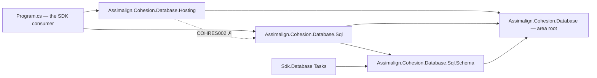
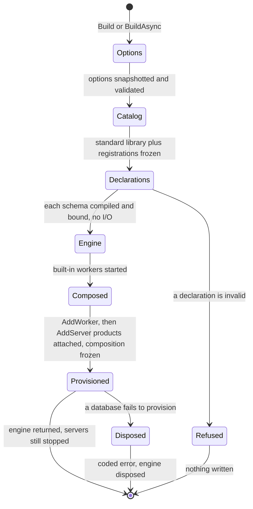
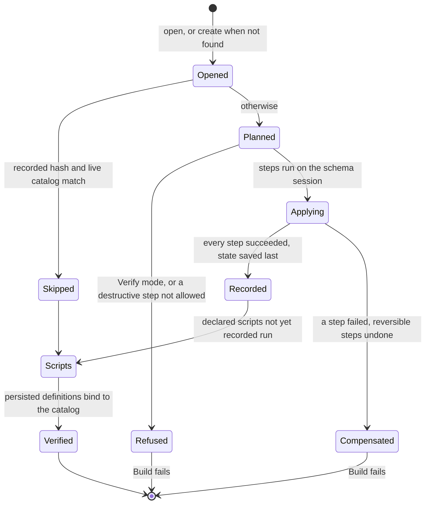
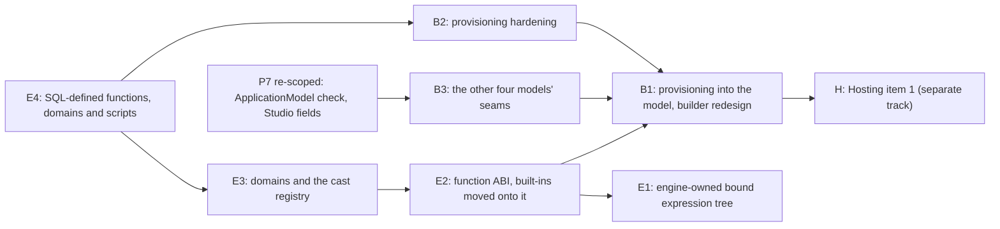

# Database engine extensibility, provisioning and composition: design

**Status:** approved; the owner accepted decisions 49 to 73 (§13) on 2026-10-09, answers inline,
with one follow-up proposed under 49 (49a, awaiting the owner; it lands in B2). Phases B1 and E1
start from here · **Created:** 2026-10-08 ·
**Owner:** Chase Crawford
**Answers:** the owner's request of 2026-10-08 (Database Hosting items 1 to 3, Provisioning, Event
Source Tracing) · **Rules:** `.claude/rules/database-area.md`, `.claude/rules/resource-areas.md`,
`.claude/rules/event-source.md` · **Plan of record:**
[DATABASE_CONCRETE_TYPES_PLAN.md](DATABASE_CONCRETE_TYPES_PLAN.md) (decisions 27 to 48; P7 on hold)
**Branch:** every phase branches from the integration branch
`claude/database-inventory-sql-expansion-aa27d1` (draft PR #1168) and merges back.

> **Why this file exists.** The owner asked for three things at once: a Hosting builder that
> exposes concrete infrastructure types and stops wiring databases, schema provisioning that
> belongs to the database model, and a typed extensibility surface on which the SQL engine's own
> built-in functions run. Three independent designs answered (§11 credits each). This file is the
> one recommendation built from them, checked against the code at `eec49a27`. When the phases
> land, the durable parts move into the DESIGN files of the projects they touch, and this file is
> deleted.

Confidence tags follow the plan of record. **[Certain]** means checked in this tree at `eec49a27`
or in a cited reference source. **[Likely]** means a strong inference. **[Guessing]** means a gap
filled by judgment. Paths shorten `resources/Database/Assimalign.Cohesion.Database.<X>/` to `<X>/`,
and the area root to `Database/`. Line numbers are at `eec49a27`.

---

## 1. Read this first

1. **[Certain] Nothing typed the owner wants exists yet.** The SQL engine's functions are an
   internal frozen table of ten entries (`Sql/src/Internal/SqlFunctionSignatures.cs:56-71`) plus
   24 `SqlBuiltinFunction` switch arms and 13 table lookups across 7 files. Types are a closed
   name switch (`Sql.Language/src/SqlTypeNames.cs:29-50`), casts a closed switch
   (`Sql/src/Internal/SqlCastConverter.cs:28`). `Sql.Schema`'s `Function<…>` and `Trigger<…>`
   compile C# lambdas to canonical C# text that nothing executes, and the provisioner refuses any
   schema that declares them (`Sql/src/Internal/SqlSchemaProvisioner.cs:397-401`).
2. **[Certain, from the code path; not executed] All five database templates fail on their first
   start.** Each declares `database.Principal(...)` (for example
   `tooling/templates/.../cohesion-database/Program.cs:26`), and the provisioner refuses principals
   (`SqlSchemaProvisioner.cs:400`). The template tests only build them
   (`tooling/templates/Assimalign.Cohesion.Templates/tests/TemplateTests.cs:418-419`).
3. **[Certain, measured] Moving the built-ins onto an abstraction is only free if calls are bound
   into an engine-owned tree.** The evaluator walks the language AST and resolves every function
   call *and every column reference* by name on every row (`Sql/src/Internal/SqlExpressionEvaluator.cs:128`,
   `:145-185`, `:636`). The obvious binding, an identity dictionary from AST node to function (the
   evaluator's existing `_valueOrdinals` pattern, `:23-32`), measured slower than today under
   NativeAOT (§10). So the first engine phase is an internal bound-expression tree with no API.
4. **[Certain] Rows stay `object?[]`.** The function ABI below is allocation-free inside a call,
   but every non-reference result still boxes once where it lands in a row slot, as it does today
   (23.6 B per call in every probe shape). Zero boxing needs a later row-representation change in
   P8's territory. The ABI hides the representation so that change touches no function.
5. **[Certain] "Let a developer create their own engine" is only partly delivered.** Iteration 1
   opens scalar functions, aggregate functions, domains and casts. Physical storage types,
   collations, operators, index methods and table functions stay closed, because each needs a
   storage-codec, key-encoding or grammar seam that does not exist yet (§4.11). That gap must be
   stated, not implied.
6. **[Certain] "Provision on build" moves database I/O into `builder.Build()`.** Today provisioning
   is a host service started inside `StartAsync`, under `StartupTimeout`
   (`Hosting/src/DatabaseApplicationBuilder.cs:165-202`). Provisioning inside the model's Build
   means open, recovery and migration run synchronously in application Build, outside that
   timeout, with no cancellation in the hosted path. This design accepts that, because it is what
   the owner asked for and it keeps the engine "operational from creation"
   (`Database/src/DatabaseEngine.cs:19-26`); decision 49 asks the owner to confirm it.
7. **Two designer citations were wrong.** [Certain] SQLite does *not* refuse non-deterministic
   functions in CHECK: its resolver refuses them only in index expressions and generated columns,
   and its own comment says CHECK allows them, as SQL Server, MySQL and PostgreSQL do
   (`sqlite3.c:111712-111718` in the local amalgamation). The CHECK rule in §4.4 is therefore
   *stricter* than every reference engine, deliberately (decision 64). [Certain] A server does not
   need an identity cast: `SqlDatabaseEngineBuilder.AddServer` already passes the typed
   `SqlDatabaseEngine` (`Sql/src/SqlDatabaseEngineBuilder.cs:222`); the templates' casts are
   leftovers P7 planned to remove.

## 2. The recommendation on one page

- **Three composition levels, each owning one concern.** The application builder (Hosting) owns
  host infrastructure. The engine builder (each model) owns everything the engine owns: storage
  options, its function and type catalog, its databases, servers and workers. The database
  builder owns one database: its collation, its typed schema, its raw-SQL scripts and its
  provisioning mode. Only the engine name and each database name cross a level, each written once.
- **Provisioning belongs to the model.** `sql.AddDatabase(...)` declares a database on the engine
  builder. The engine's `Build`/`BuildAsync` compiles and binds every declaration first (no I/O),
  then opens or creates and provisions each database before it returns. The root and Hosting lose
  every schema type and member. The root gains nothing.
- **One function abstraction for the engine and the developer.** `Database.Sql` gains a public
  family: `SqlFunction`, `SqlScalarFunction`, `SqlAggregateFunction`, `SqlAggregateAccumulator`,
  over an allocation-free value ABI (`SqlValue`, `SqlArguments`) and an open type descriptor
  (`SqlType`). The built-ins (UPPER, LOWER, LENGTH, ABS, COUNT, SUM, AVG, MIN, MAX) become internal
  sealed leaves registered through the same public `Functions.Add` an application calls.
- **Raw SQL stays.** `CREATE FUNCTION … RETURN expr` and `CREATE DOMAIN` persist in the database
  catalog and run through the same abstraction. A declared database can carry forward-only
  raw-SQL scripts.
- **The engine is made fast enough first.** An internal bound-expression tree (E1) lands before
  the evaluator moves onto the ABI (E2), gated by a NativeAOT benchmark.
- **Conformance.** No new public interface (exactly five survive). Every new abstract base meets
  rule 2 (variant set and inverted seam), has NVI members, field-backed metadata and no generic
  virtual method. COHRES001 to 004 are unchanged: Hosting still references only the root and its
  own family, and no model library references Hosting.

The reference graph after the change is below; an arrow reads "references". `Database.Hosting`
may not reference `Database.Sql` (COHRES002); it now has no reason to, because no schema type is
left in the root.



`Sql.Schema` keeps its root reference for `DatabaseException` and `DatabaseObjectOwner` only
(`CompiledSchemaTable.Owner`, `Sql.Schema/src/SqlCompiledSchema.cs:149`). The SDK task still
references only `Sql.Schema` (the COHLIB001 precedent).

## 3. Developer-facing API

### 3.1 Program.cs

```csharp
using Assimalign.Cohesion.Database.Hosting;
using Assimalign.Cohesion.Database.Sql;
using Assimalign.Cohesion.Database.Sql.Schema;
using Assimalign.Cohesion.Database.Types;
using Assimalign.Cohesion.Logging;

DatabaseApplicationBuilder builder = DatabaseApplication.CreateBuilder(args);

// Application level: host concerns only (item 1's concrete types).
builder.Logging.AddRule("Assimalign.Cohesion.Database", LogLevel.Information);

builder.AddSql("orders-sql", sql =>                 // the engine name is mandatory and written once
{
    // Engine settings: values only, snapshotted when the engine is built.
    sql.Options.RootPath = builder.Configuration["Orders:DataPath"] ?? "data";
    sql.Options.CheckpointInterval = TimeSpan.FromSeconds(30);

    // Engine extensions: the catalog the built-in functions are registered in.
    sql.Functions.Add(SqlScalarFunction.Create("slugify",
        static (string text) => Slug.From(text), SqlFunctionVolatility.Immutable));
    sql.Functions.Add(new MedianFunction());
    sql.Types.Add(EmailType.Domain);                // E3

    // Databases the engine owns: provisioned before Build returns.
    sql.AddDatabase("sales", database =>
    {
        database.DefaultCollation = Collation.CaseInsensitive;
        database.Schema(schema =>
        {
            schema.Table<Order>("orders", table =>
            {
                table.Key(order => order.Id);
                table.Column(order => order.Item);
                table.Index(order => order.Item);
                table.Check("ck_orders_item", "slugify(item) <> ''");   // E2
            });
        });
    });
    sql.AddDatabase(ReportingSchema.Declaration);   // a SqlSchema value; the database name comes from it

    // Endpoints and engine-owned background work.
    sql.AddServer(server => server.Listen(new Uri("cohesion-db://localhost:5740")));
    sql.AddWorker(engine => new OrderArchiveWorker(engine));
});

builder.AddHealthCheck("orders-ready", OrdersReadiness.Check);

await using DatabaseApplication application = builder.Build();  // engines built, declared databases provisioned
await application.RunAsync();                                    // services start, then servers accept

static class ReportingSchema
{
    public static readonly SqlSchema Declaration = SqlSchema.Create("reporting", schema =>
        schema.Table<DailyTotal>("daily_totals", table => table.Key(total => total.Day)));
}
```

The `AddSql` callback still runs at application Build, as it does today, so a closure over
`builder.Configuration` reads the final configuration. It no longer receives
`IDatabaseApplicationContext`: [Certain] the five templates and the SampleHost fixture all discard
it (`(_, options) =>`), and only the verbs' own tests read it.

### 3.2 Application level: `DatabaseApplicationBuilder` (Database.Hosting)

```csharp
public sealed class DatabaseApplicationBuilder : IDatabaseApplicationBuilder
{
    public HostEnvironment Environment { get; }            // item 1
    public ConfigurationManager Configuration { get; }     // item 1
    public LoggerFactoryBuilder Logging { get; }           // item 1 (the owner's "LoggingFactoryBuilder")
    public ServiceProviderBuilder Services { get; }        // item 1
    public DatabaseApplicationOptions Options { get; }     // host policy only: timeouts, reopen policy

    public DatabaseApplicationBuilder AddEngine(DatabaseEngine engine);                       // borrowed
    public DatabaseApplicationBuilder AddEngine(string name,
        Func<DatabaseApplicationBuildContext, DatabaseEngine> factory);                       // owned, sees DI
    public DatabaseApplicationBuilder AddService(IHostService service);
    public DatabaseApplicationBuilder AddService(Func<DatabaseApplicationContext, IHostService> factory);
    public DatabaseApplicationBuilder AddHealthCheck(string name, ResourceHealthCheck check);
    public DatabaseApplication Build();
}
```

The four infrastructure properties are exactly what `WebApplicationBuilder` exposes
(`resources/Web/Assimalign.Cohesion.Web.Hosting/src/WebApplicationBuilder.cs:126`, `:142`, `:147`,
`:152`). The build context and item 1's details are §7.

The root seam keeps its three members; only one signature changes, so Hosting reserves every
engine name at registration:

```csharp
public interface IDatabaseApplicationBuilder
{
    IDatabaseApplicationBuilder AddEngine(DatabaseEngine engine);
    IDatabaseApplicationBuilder AddEngine(string name, Func<IDatabaseApplicationContext, DatabaseEngine> factory);
    IDatabaseApplication Build();
}
```

A model verb is a shim over that seam:

```csharp
extension(IDatabaseApplicationBuilder builder)
{
    public IDatabaseApplicationBuilder AddSql(string name, Action<SqlDatabaseEngineBuilder> configure)
        => builder.AddEngine(name, _ =>
        {
            SqlDatabaseEngineBuilder sql = SqlDatabaseEngine.CreateBuilder(name);
            try
            {
                configure(sql);
                return sql.Build();                      // provisions the declared databases
            }
            catch (Exception failure) when (failure is not OutOfMemoryException)
            {
                sql.Abort(failure);
                throw;
            }
        });
}
```

### 3.3 Engine level: `SqlDatabaseEngineBuilder` (Database.Sql)

```csharp
// Deviates from the repo interface-first rule per design decision: Database engines are concrete-first — abstract bases with protected cores and sealed model leaves (owner, 2026-10-04; database-area.md).
public sealed class SqlDatabaseEngineBuilder
{
    public string Name { get; }
    public SqlDatabaseEngineOptions Options { get; }          // replaces the 14 mirrored properties
    public SqlFunctionCollection Functions { get; }           // E2: standard library pre-registered
    public SqlTypeCollection Types { get; }                   // E2 built-in types; E3 domains and casts

    public SqlDatabaseEngineBuilder AddDatabase(string name, Action<SqlDatabaseBuilder>? configure = null);
    public SqlDatabaseEngineBuilder AddDatabase(SqlSchema schema);
    public SqlDatabaseEngineBuilder AddServer(Action<SqlDatabaseServerOptions> configure);   // the model creates the server
    public SqlDatabaseEngineBuilder AddServer(Func<SqlDatabaseEngine, DatabaseServer> factory);
    public SqlDatabaseEngineBuilder AddWorker(Func<SqlDatabaseEngine, DatabaseEngineWorker> factory);

    public SqlDatabaseEngine Build();                         // bridges BuildAsync on the thread pool
    public ValueTask<SqlDatabaseEngine> BuildAsync(CancellationToken cancellationToken = default);
}
// SqlDatabaseEngine.CreateBuilder(string name)
```

- `Options` replaces `EngineName`, `RootPath`, `Durability`, `GroupCommitWindow`,
  `CheckpointInterval`, `CheckpointJournalSize`, `WorkerFailureWindow`, `WorkerFailureMinimumPasses`,
  `JournalSizeLimit`, `BufferPoolCapacity`, `PageWriteBackInterval`, `PageWriteBackBatchSize`,
  `MaintenanceInterval` and `ExpressionNestingLimit` (`SqlDatabaseEngineBuilder.cs:51-189`). Build
  copies it, so a later mutation cannot reach a running engine. `SqlDatabaseEngine.Create(options)`
  (`Create(name, options)` since B3) copies too, which fixes a live defect [Certain]: the engine keeps the caller's object
  (`Sql/src/SqlDatabaseEngine.cs:93`) and the write-back worker reads `PageWriteBackBatchSize` on
  every pass (`Sql/src/Internal/SqlPageWriteBackWorker.cs:37`).
- Until B3 removes `EngineName` from the options types, a builder whose `Options.EngineName`
  differs from `Name` fails Build. *Landed in B3:* `EngineName` left the five options types, and
  this check with it.
- The two `AddServer` overloads differ only by delegate type. [Certain, composition-first
  designer's probe] `server => server.Listen(...)` binds the `Action` overload and
  `engine => SqlDatabaseServer.Create(engine, ...)` binds the `Func` overload. `Listen` is
  `Sql.Tcp`'s existing extension (`Sql.Tcp/src/Extensions/SqlDatabaseServerOptionsExtensions.cs:30`).

### 3.4 Database level: `SqlDatabaseBuilder`, and the schema

```csharp
public sealed class SqlDatabaseBuilder                 // internal constructor; created by AddDatabase
{
    public DatabaseName Name { get; }
    public Collation? DefaultCollation { get; set; }     // Binary when unset; fixed once the database exists
    public SqlProvisioningMode Provisioning { get; set; } // Apply (default) or Verify

    public SqlDatabaseBuilder Schema(Action<SqlSchemaBuilder> declare);   // inline; an SDK anchor
    public SqlDatabaseBuilder Schema(SqlSchema schema);                   // reusable value; name must match
    public SqlDatabaseBuilder Script(string name, string sql);            // E4: raw SQL, forward-only, checksummed
}

public enum SqlProvisioningMode : byte { Apply, Verify }
```

- `AddDatabase(name)` with no callback only ensures the database exists.
- `AddDatabase(SqlSchema)` is the short form of
  `AddDatabase(schema.Name, database => database.Schema(schema))`.
- A second declaration of the same database name on one engine throws `InvalidOperationException`
  at the call.
- The schema builder keeps today's table surface (`Sql.Schema/src/SqlTableBuilder.cs:42-71`) and
  gains `table.Check(name, sql)` in E2 and `table.Column(selector, sqlType)` in E3. Both take
  constant strings, so the SDK extracts them without running the program.

### 3.5 A custom scalar function

A hand-written leaf derives from the base the built-in ABS derives from:

```csharp
public sealed class ClampFunction : SqlScalarFunction
{
    public ClampFunction()
        : base("clamp", [SqlType.BigInt, SqlType.BigInt, SqlType.BigInt], SqlType.BigInt,
               SqlFunctionVolatility.Immutable)
    {
    }

    protected override SqlValue InvokeCore(scoped in SqlArguments arguments)
        => SqlValue.FromInt64(Math.Clamp(arguments.GetInt64(0), arguments.GetInt64(1), arguments.GetInt64(2)));
}

sql.Functions.Add(new ClampFunction());
```

The typed shorthand covers most functions. It creates an internal sealed generic leaf; `T1` and
`TResult` map to `SqlType`s when `Create` is called, and an unsupported `T` fails there, not on the
first call:

```csharp
sql.Functions.Add(SqlScalarFunction.Create("slugify",
    static (string text) => Slug.From(text), SqlFunctionVolatility.Immutable));
```

`Math.Clamp` throws when `low > high`; the engine reports it as `COHSQLE007` naming `clamp`, and
the statement fails like any coded error (§4.5).

### 3.6 A custom aggregate

```csharp
public sealed class MedianFunction : SqlAggregateFunction
{
    public MedianFunction() : base("median", [SqlType.Double], SqlType.Double) { }

    protected override SqlAggregateAccumulator CreateAccumulatorCore(scoped in SqlFunctionContext context)
        => new Accumulator();

    private sealed class Accumulator : SqlAggregateAccumulator
    {
        private readonly List<double> _values = [];

        protected override void AddCore(scoped in SqlArguments arguments)
            => _values.Add(arguments.GetDouble(0));    // a strict aggregate never sees a NULL input

        protected override SqlValue FinishCore()
        {
            if (_values.Count == 0)
            {
                return SqlValue.Null;
            }

            _values.Sort();
            int middle = _values.Count / 2;
            return SqlValue.FromDouble(_values.Count % 2 == 1
                ? _values[middle]
                : (_values[middle - 1] + _values[middle]) / 2);
        }
    }
}

// Typed shorthand, the shape the built-in SUM and AVG leaves use. A group that saw no
// non-NULL input returns NULL without calling finish.
sql.Functions.Add(SqlAggregateFunction.Create<long, long, long>("product",
    seed: static () => 1L,
    step: static (long state, long value) => checked(state * value),
    finish: static (long state) => state));
```

```sql
SELECT category, median(price), product(quantity) FROM products GROUP BY category;
```

### 3.7 A custom type (a domain, E3)

```csharp
public static class EmailType
{
    public static readonly SqlType Domain = SqlType.CreateDomain("email", SqlType.VarChar(320),
        check: SqlScalarFunction.Create("is_email",
            static (string value) => value.Contains('@'), SqlFunctionVolatility.Immutable));
}

sql.Types.Add(EmailType.Domain);

// A typed schema column of the domain:
schema.Table<Customer>("customers", table =>
{
    table.Key(customer => customer.Id);
    table.Column(customer => customer.Email, "email");
});
```

```sql
-- Raw SQL binds the same engine domain by name.
CREATE TABLE contacts (id BIGINT PRIMARY KEY, email email NOT NULL);
```

A domain stores its base type, so the row codec, key encoding and on-disk format do not change.
Its check runs on every write that assigns the domain, like a column CHECK.

### 3.8 A packaged extension

An extension is a C# extension member on the engine builder, compiled into the application (the
NativeAOT analogue of `CREATE EXTENSION`; nothing loads at run time):

```csharp
public static class GeoSqlExtensions
{
    extension(SqlDatabaseEngineBuilder sql)
    {
        /// <summary>Registers the geo types and functions on this engine.</summary>
        public SqlDatabaseEngineBuilder AddGeo()
        {
            sql.Types.Add(GeoTypes.Point);                         // a domain over BINARY in iteration 1
            sql.Functions.Add(new StDistanceFunction());
            sql.Functions.Add(SqlScalarFunction.Create("st_x",
                static (byte[] point) => GeoCodec.X(point), SqlFunctionVolatility.Immutable));
            return sql;
        }
    }
}

builder.AddSql("geo-sql", sql => sql.AddGeo().AddDatabase("places"));
```

### 3.9 Raw SQL (E4)

```sql
-- A database-scoped function: persisted in the catalog, owned Adhoc, called through SqlScalarFunction.
CREATE FUNCTION with_tax(amount DECIMAL(18, 2)) RETURNS DECIMAL(18, 2) IMMUTABLE RETURN amount * 1.08;
-- A database-scoped domain.
CREATE DOMAIN sku AS VARCHAR(32) CHECK (VALUE LIKE 'SKU-%');
-- Both sit beside the engine's native functions and domains.
ALTER TABLE orders ADD CONSTRAINT ck_sku CHECK (slugify(item) <> '');
```

The same DDL can ship with the database, owned by its schema:

```csharp
sql.AddDatabase("sales", database =>
{
    database.Schema(SalesSchema.Declaration);
    database.Script("0001_with_tax",
        "CREATE FUNCTION with_tax(amount DECIMAL(18, 2)) RETURNS DECIMAL(18, 2) IMMUTABLE RETURN amount * 1.08");
});
```

### 3.10 Without Hosting (embedded code and tests)

```csharp
SqlDatabaseEngineBuilder sql = SqlDatabaseEngine.CreateBuilder("local");
sql.Options.RootPath = "data";
sql.Functions.Add(SqlScalarFunction.Create("slugify",
    static (string text) => Slug.From(text), SqlFunctionVolatility.Immutable));
sql.AddDatabase(SalesSchema.Declaration);

await using SqlDatabaseEngine engine = await sql.BuildAsync(cancellationToken);  // provisioned on return
SqlDatabase sales = await engine.OpenDatabaseAsync("sales", cancellationToken);  // returns the open database
```

Embedded engines get provisioning for the first time: today it exists only as a Hosting service.
`SqlDatabaseEngine.Create(options)` (`Create(name, options)` since B3) stays as the standard-library-only path, so the 286 test call
sites that use it need no rewrite beyond B3's name move.

### 3.11 The other four models (B3)

`AddKeyValue`, `AddGraph`, `AddDocuments` and `AddBlob` take `(string name, Action<XEngineBuilder>)`
in B1, because the root seam change touches every verb. In B3 each builder gains `Options`,
`AddDatabase(name)` (ensure-exists, through the shared `Database/shared/DatabaseEngineBuilderState.cs`)
and `AddServer(Action<XServerOptions>)` where the model has a server. `Functions` and `Types`
appear only where a model has an expression language that needs them: SQL now, Graph when GQL
gains functions (`Graph.Language/src/GqlLanguageProfile.cs:47` declares none).

*Landed in B3.* The KeyValue, Graph, Documents and Blob builders lost their mirrored properties
for `Options`, which `Build` copies and checks before anything is created; `Build()` bridges a new
`BuildAsync(CancellationToken)`. `AddDatabase(name)` goes through the shared builder state, which
hands the names to the engine after composition (each engine's internal `Declare`, the SQL
engine's shape) and then opens each, or creates it on `DatabaseNotFoundException`, disposing the
engine on any failure; the built engine refuses to drop a declared database with the SQL wording,
now one shared copy (`Database/shared/DatabaseDeclarations.cs`). `AddServer(Action<XServerOptions>)`
exists for KeyValue, Graph and Blob; Documents has no server, so it keeps only the factory overload.
The `AddServer(Func)` and `AddWorker` parameters are named `factory`. The three servers now keep a
copy of their options taken at creation, as `SqlDatabaseServer` does: each read its caller's
object live before (`KeyValueDatabaseServer` passed it to every session, which read
`AuthenticationTimeout` and `IdleTimeout` per connection, and the accept loop read `MaxSessions`;
Graph and Blob the same). `EngineName` left all five options types: `XDatabaseEngine.Create(name,
options)` (which copies its options on every model now) and `CreateBuilder(name)` name the engine,
and every option refusal names it (`DatabaseEngineOptionChecks`, shared: `Graph engine 'g':
CheckpointInterval must be positive.`). The SQL nesting-limit refusal's parameter is now the option
(`ExpressionNestingLimit`), as every other option's is, instead of `options`. Call sites that set no
name kept the model's former default (`sql-engine`, `keyvalue-engine`, `graph-engine`,
`document-engine`, `blob-engine`), so test-visible names did not change.

*B3 review.* Three differences between the models surfaced once the five builders took the same
inputs, and were closed in B3. (1) The name rule Graph, Documents and Blob always applied (a
database name is a single file-name component, because its files live in a directory named for
it) is now shared (`Database/shared/DatabaseFileNames.cs`) and applied by the SQL and key-value
engines too, in their create, open and drop cores: before, `AddDatabase("../x")` or
`CreateDatabaseAsync("../x")` on those two wrote files beside the root path, and a SQL
`DropDatabaseAsync("../x")` deleted that directory without checking it was a database. Every
builder's `AddDatabase` also checks the rule at the call, so a name the engine would refuse fails
before the engine exists. (2) SQL and key-value now refuse a `PageWriteBackInterval` or
`PageWriteBackBatchSize` that is not positive, as the other three did: a zero interval spun the
worker's wait, and a zero batch failed every write-back pass until the failure policy took the
databases offline. (3) The builder state's own refusals (frozen composition, the one build
attempt, a factory that returned null) start with the model as every other B3 message does
(`Graph engine 'g': composition is frozen after a build attempt.`). A declared database whose files
cannot be read fails the build with the storage layer's `StorageException`, which is not a
`DatabaseException`; the builders document it.

### 3.12 The separation rule

| Level | Type (assembly) | Owns | Never holds |
|---|---|---|---|
| Application | `DatabaseApplicationBuilder` (Hosting) | environment, configuration, logging, DI, host services, health, control plane, reopen policy, which engines exist | databases, schemas, functions, model types |
| Engine | `SqlDatabaseEngineBuilder` (Sql) | storage options, function and type catalog, declared databases, servers, workers | DI, configuration binding, `IServiceProvider` |
| Database | `SqlDatabaseBuilder` (Sql) | collation, typed schema, raw-SQL scripts, provisioning mode | engine settings |
| Schema | `SqlSchemaBuilder` (Sql.Schema) | tables, columns, keys, indexes, references, checks | anything at run time |

What made today's builder "all over the place" [Certain]: the engine name written in
`options.EngineName` and again in `builder.AddDatabase("sample-sql", …)`
(`Database.Testing/fixtures/Assimalign.Cohesion.Database.SampleHost/Program.cs:15`, `:23`), the
database name written twice and compared at run time (`Hosting/src/DatabaseApplicationBuilder.cs:552-560`),
provisioning registered as a Hosting service for a SQL-only capability, a builder whose 14
members mirror an options type, and five registration paths for engines, servers and services
reconciled by one 210-line method (`DatabaseApplicationBuilder.cs:272-483`).

## 4. The function and type abstraction (Database.Sql)

### 4.1 What exists today

| Concern | Today | Evidence |
|---|---|---|
| Function table | ten internal entries, frozen | `Sql/src/Internal/SqlFunctionSignatures.cs:56-71` |
| Per-function behavior | 24 `SqlBuiltinFunction` arms and 13 table lookups in 7 files | evaluator, grouping planner and executor, constraints, persisted expressions, planner |
| Call binding | by name, every row | `SqlExpressionEvaluator.cs:636` |
| Column binding | by name, every row | `SqlExpressionEvaluator.cs:128`, `:145-185` |
| Declared-name gate | the SQL profile's fixed list, so `slugify` is "Unknown function" | `SqlPlanner.Functions.cs:14-26`, `:158`; `Sql.Language/src/SqlLanguageProfile.cs:46-64` |
| Parser aggregate list | DISTINCT and ORDER BY allowed only inside five names | `Sql.Language/src/SqlQueryParser.Aggregates.cs:44-45` |
| Unknown identifiers | already parse as calls | `SqlQueryParser.Expressions.cs:732-742` |
| Types and casts | closed switches | `SqlTypeNames.cs:29-50`; `SqlCastConverter.cs:28` |
| Collations | four, ids persisted in encoded keys | `Types/src/Collation.cs:13-17`, `:59-66` |
| Public dead code | `SqlColumnType`, `SqlDataType`: no reference anywhere | `Sql/src/SqlColumnType.cs` |

### 4.2 Type shapes

All of these live in `Database.Sql`, namespace `Assimalign.Cohesion.Database.Sql`: public bases in
`src/Functions/`, internal leaves in `src/Internal/Functions/`. Each public abstract base carries
the deviation marker.

```csharp
// The variant set {scalar, aggregate}; window and table functions are later leaves.
public abstract class SqlFunction
{
    private protected SqlFunction(string name, SqlFunctionKind kind, ReadOnlySpan<SqlType> parameters,
        SqlType returnType, SqlFunctionVolatility volatility, SqlNullBehavior nullBehavior,
        SqlType? variadicParameter);

    public string Name { get; }                          // every member field-backed (rule 6)
    public SqlFunctionKind Kind { get; }
    public IReadOnlyList<SqlType> Parameters { get; }
    public SqlType? VariadicParameter { get; }
    public SqlType ReturnType { get; }
    public SqlFunctionVolatility Volatility { get; }
    public SqlNullBehavior NullBehavior { get; }
}

// Inverted seam: the engine drives it; the standard library and applications implement it.
public abstract class SqlScalarFunction : SqlFunction
{
    protected SqlScalarFunction(string name, ReadOnlySpan<SqlType> parameters, SqlType returnType,
        SqlFunctionVolatility volatility = SqlFunctionVolatility.Volatile,
        SqlNullBehavior nullBehavior = SqlNullBehavior.ReturnsNullOnNullInput,
        SqlType? variadicParameter = null);

    public SqlValue Invoke(scoped in SqlArguments arguments);         // NVI: count, strict short-circuit, COHSQLE007
    protected abstract SqlValue InvokeCore(scoped in SqlArguments arguments);

    public static SqlScalarFunction Create<T1, TResult>(string name, Func<T1, TResult> body,
        SqlFunctionVolatility volatility = SqlFunctionVolatility.Volatile);
    // also <T1, T2, TResult>, <T1, T2, T3, TResult> and <T1, T2, T3, T4, TResult>
}

public abstract class SqlAggregateFunction : SqlFunction
{
    protected SqlAggregateFunction(string name, ReadOnlySpan<SqlType> parameters, SqlType returnType,
        SqlNullBehavior nullBehavior = SqlNullBehavior.ReturnsNullOnNullInput);

    public SqlAggregateAccumulator CreateAccumulator(scoped in SqlFunctionContext context);   // NVI
    protected abstract SqlAggregateAccumulator CreateAccumulatorCore(scoped in SqlFunctionContext context);

    public static SqlAggregateFunction Create<TState, T1, TResult>(string name, Func<TState> seed,
        Func<TState, T1, TState> step, Func<TState, TResult> finish);
}

// One per group, per aggregate call, per statement. Never shared between threads.
public abstract class SqlAggregateAccumulator
{
    protected SqlAggregateAccumulator();
    public void Add(scoped in SqlArguments arguments);    // NVI: strict skip of NULL rows, COHSQLE007
    public SqlValue Finish();                              // NVI: once per group, an empty group included
    protected abstract void AddCore(scoped in SqlArguments arguments);
    protected abstract SqlValue FinishCore();
}

// The value ABI. Layout is internal: a reference (string, byte[]), a 16-byte inline payload and
// the DatabaseType, 32 bytes. decimal, Guid and DateTimeOffset fit inline. default is SQL NULL.
public readonly struct SqlValue : IEquatable<SqlValue>
{
    public static SqlValue Null { get; }
    public bool IsNull { get; }
    public DatabaseType Type { get; }                    // Database.Types' enum; no second vocabulary
    public static SqlValue FromInt64(long value);        // and one From… per storage CLR type
    public long AsInt64();                               // and one As… per type; InvalidCastException on a mismatch
}

public readonly ref struct SqlArguments
{
    public int Count { get; }
    public SqlValue this[int index] { get; }
    public bool IsNull(int index);
    public long GetInt64(int index);                     // also GetBoolean, GetInt32, GetDouble, GetDecimal,
                                                         // GetString, GetBinary, GetDateTime, GetGuid, …
    public SqlFunctionContext Context { get; }
}

public readonly ref struct SqlFunctionContext
{
    public DatabaseName Database { get; }
    public Collation Collation { get; }                  // the call's input collation, resolved at plan time
    public DateTimeOffset TransactionTimestamp { get; }  // the transaction-start clock ruling
    public CancellationToken CancellationToken { get; }
}

public sealed class SqlType : IEquatable<SqlType>
{
    public string Name { get; }
    public DatabaseTypeInfo Storage { get; }             // the physical type the codec stores
    public SqlType? BaseType { get; }                    // a domain's base type
    public SqlScalarFunction? Check { get; }             // a domain's check: Immutable, returns BOOLEAN
    public bool IsPseudo { get; }                        // Any, AnyElement
    public static SqlType Boolean { get; }               // SmallInt, Integer, BigInt, Real, Double, Numeric,
                                                         // Text, Binary, Date, Time, Timestamp, TimestampTz,
                                                         // Interval, Uuid, Json, Jsonb, Any, AnyElement
    public static SqlType Decimal(int precision, int scale);
    public static SqlType VarChar(int maxLength);
    public static SqlType CreateDomain(string name, SqlType baseType, SqlScalarFunction? check = null);  // E3
}

public sealed class SqlFunctionCollection : IReadOnlyCollection<SqlFunction>   // the builder's Functions
{
    public SqlFunctionCollection Add(SqlFunction function);
    public bool Contains(string name);
}

public sealed class SqlFunctionCatalog : IReadOnlyCollection<SqlFunction>      // SqlDatabaseEngine.Functions, frozen
{
    public IReadOnlyList<SqlFunction> GetOverloads(string name);
}

public enum SqlFunctionKind : byte { Scalar, Aggregate }
public enum SqlFunctionVolatility : byte { Immutable, Stable, Volatile }
public enum SqlNullBehavior : byte { ReturnsNullOnNullInput, CalledOnNullInput }

// E3
public sealed class SqlCast
{
    public static SqlCast Create<TSource, TTarget>(SqlType source, SqlType target,
        Func<TSource, TTarget> convert, SqlCastContext context);
    public SqlType Source { get; }
    public SqlType Target { get; }
    public SqlCastContext Context { get; }
}
public enum SqlCastContext : byte { Explicit, Assignment, Implicit }
// SqlTypeCollection: Add(SqlType), AddCast(SqlCast)
```

Deleted with E2: `SqlFunctionSignatures`, `SqlFunctionSignature`, the internal `SqlFunctionKind` and
`SqlBuiltinFunction` enums, the planner's static `_declaredFunctions`, and the dead public
`SqlColumnType` and `SqlDataType`.

### 4.3 How the shapes meet `database-area.md`

| Rule | How |
|---|---|
| No new public interface | Sealed classes, structs, ref structs and enums only. `IReadOnlyCollection<T>` and `IEquatable<T>` are BCL interfaces, outside the rule. |
| 1, sealed by default | `SqlType`, `SqlCast`, the collections and the catalog are sealed; leaves of the standard library are internal sealed. |
| 2, abstract only with reason | `SqlFunction` is a variant set (scalar and aggregate both ship). `SqlScalarFunction`, `SqlAggregateFunction` and `SqlAggregateAccumulator` are inverted seams (the engine drives them, the standard library and applications implement them) and variant sets (ten built-ins). |
| 3, constructor topology | `SqlFunction`'s direct leaves live in this assembly: `private protected`. The three seams are derived by applications: `protected`. |
| 4, NVI | Public `Invoke`, `CreateAccumulator`, `Add` and `Finish` own the count check, the strict short-circuit and exception coding; each calls a `protected abstract …Core` with no default body. |
| 5, no generic virtual methods | `Create<…>` are static. The internal generic leaves override non-generic virtuals. |
| 6, state as fields | Name, kind, parameters, return type, volatility and null behavior are field-backed and non-virtual. |
| 9, never-null collections | `Parameters` and `GetOverloads` return empty lists. |
| 11, folders | Public bases in `src/Functions/`, never `Abstractions/`; leaves in `src/Internal/Functions/`. |

### 4.4 Registration and resolution

- **Registration.** The builder constructor calls an internal `SqlStandardLibrary.Register`, which
  adds the built-ins through the public `Functions.Add`. Application registrations follow in call
  order. `Build` freezes everything into one `FrozenDictionary<string, SqlFunction[]>`
  (case-insensitive) exposed as `SqlDatabaseEngine.Functions`. There is no run-time registration;
  NativeAOT could not load one anyway.
- **`Add` refuses**, with `InvalidOperationException` or `ArgumentException`:
  - a name that is not an identifier, or that is a special form (COALESCE, NULLIF, CASE, CAST,
    EXTRACT) or a keyword;
  - a name and parameter-type list that already exists, a built-in's included (decision 62);
  - any call after Build.
  A new overload of an existing name with different parameter types is allowed.
- **Resolution happens once per execution, in the planner**, which already exists per request
  with bound parameter values (`Sql/src/Internal/SqlQueryExecutor.cs:52`). It follows PostgreSQL's
  `func_get_detail` (`src/backend/parser/parse_func.c:1577`): candidates by name and argument count
  (variadic included), domains reduced to their base types, an exact match first, otherwise the
  unique cheapest candidate over a deliberately narrow implicit lattice (Int8 → Int16 → Int32 →
  Int64 → Decimal → Float64; nothing to or from text), with `Any`/`AnyElement` unified across
  arguments. A NULL literal or an untyped parameter matches any candidate. No candidate keeps
  `COHSQLE006` (SQLSTATE 42883, as today). More than one is the new `COHSQLE008` (42725).
- **Where a function may appear.** A CHECK, and later an index expression or a generated column,
  admits only `Immutable` functions (decision 64). A DEFAULT admits any. An `Immutable` call with
  constant arguments is folded at plan time (`evaluate_function`,
  `src/backend/optimizer/util/clauses.c:5369`).
- **DISTINCT and ORDER BY inside a call** parse for any name in E2. The planner refuses them on a
  non-aggregate, as PostgreSQL does (`parse_func.c:324-329`), and the parser's five-name list goes.

### 4.5 Evaluation: the bound tree first

- **E1 (internal).** The planner compiles each expression once into an engine-owned
  `SqlBoundExpression` tree: Constant, Column (ordinal), Parameter, Call (function, arguments,
  coercions), Aggregate slot, Logical, Binary, Unary, Case, Coalesce, Cast, Like, In and Subquery
  slot. The evaluator walks that tree. Column references stop resolving by name per row, and
  calls stop resolving by name per row. This is PostgreSQL's `ExecInitFunc`
  (`src/backend/executor/execExpr.c:2696`): the function address is bound once per expression, not
  per row. The language AST is never rebuilt; `Database.Sql` may not reconstruct `Sql.Language`
  nodes.
- **E2 (the call).** Arguments are evaluated into an `[InlineArray(4)]` `SqlValue` buffer on the
  stack (a rented array past four), the strict short-circuit returns NULL without a call when an
  argument is NULL (`EEOP_FUNCEXPR_STRICT`, `src/backend/executor/execExprInterp.c:944`), then one
  abstract `InvokeCore` call. A typed leaf adds one delegate call; its `ValueConverter<T>` branches
  on `typeof(T) == typeof(long)`, which NativeAOT folds per instantiation, with no reflection and no
  boxing. The result boxes once into the `object?[]` row slot, as built-ins do today. A call of
  one argument, every built-in's shape, converts its one value without the buffer, in the frame
  that makes the coded call and checks the result, and a call of none, which only an
  application's function makes, uses no buffer either (`Database.Sql/docs/DESIGN.md`,
  "Functions (E2)"); the path is chosen by the number of arguments alone, every function, the
  standard library's and an application's, takes it, and no faster path is reserved for the
  built-ins, so the abstraction an application implements is the one the engine's own
  functions run on.
- **Exceptions.** Anything a function throws other than `OperationCanceledException`,
  `InsufficientExecutionStackException`, `OutOfMemoryException` or a `DatabaseException` becomes
  `COHSQLE007` naming the function, with the original as the inner exception. It fails the
  statement and an explicit transaction like any coded error (#1188). `SqlEvaluationException` stays
  internal; the code leads the message, as `COHSQLE001` to `006` do today.
- **Thread safety.** One function instance serves every session at once, so a leaf must be
  stateless or thread-safe. Accumulators are per group and owned by the engine.
- **Fallback if E1 slips.** E2 may bind through a per-row name lookup into the frozen engine
  catalog, which costs what today's lookup costs. It may never bind through a per-node identity
  dictionary, which measured slower (§10).

### 4.6 The built-ins move onto it

E2 is behavior-preserving (decision 67): every built-in keeps today's semantics, including the
permissive ones, so the Sql suites pass unchanged apart from tests that name the internal table.

| Built-in | Internal sealed leaf of | Kept behavior |
|---|---|---|
| UPPER, LOWER | `SqlScalarFunction` over `AnyElement` | non-strings pass through (`SqlExpressionEvaluator.cs:675-677`) |
| LENGTH | `SqlScalarFunction` over `Any`, returns BIGINT | length of the value's text form (`:679-680`) |
| ABS | `SqlScalarFunction` over numeric `AnyElement` | Int8/16/32 widen to BIGINT; the BIGINT minimum is `COHSQLE002` (`:688-701`) |
| COUNT | `SqlAggregateFunction`: `COUNT(*)` as a zero-argument overload, `COUNT(Any)` | an empty group returns 0; never NULL (replaces the `IsNullable` special case) |
| SUM, AVG | `SqlAggregateFunction` over numeric | checked overflow is `COHSQLE002` |
| MIN, MAX | `SqlAggregateFunction` over `AnyElement` | collation taken from `SqlFunctionContext` |

The `COHSQLE006` usage text (`ABS(numeric)`, …) moves onto the leaves, so diagnostics read the same.
Tightening UPPER, LOWER, LENGTH and ABS to PostgreSQL's typed overloads (`LENGTH(123)` would become a
plan-time 42883) is a separate, visible change after E2.

### 4.7 Special forms stay outside the catalog

COALESCE, NULLIF, CASE, CAST and EXTRACT (and later GREATEST and LEAST) stay evaluator nodes, as in
PostgreSQL, where COALESCE is grammar (`src/backend/parser/gram.y:16374`), not a `pg_proc` row.
COALESCE stops at the first non-NULL argument (`SqlExpressionEvaluator.cs:660-673`); a calling
convention that evaluates every argument first would change which errors surface. CHECK's Boolean
COALESCE rule (`Sql/src/Internal/SqlPlanExecutor.Constraints.cs:890`, `:931`) stays a special-form
rule. `sys.functions` lists the special forms with a `special_form` kind, so tools see one
vocabulary. The open-closed promise has this documented hole: a developer cannot write a lazily
evaluated function.

### 4.8 Types, domains and casts (E3)

- **Domains, engine-wide.** `sql.Types.Add(SqlType.CreateDomain(...))`. A column of a domain stores
  the base type; the column record keeps the domain name, so open re-binds it. That record
  extension is a table-record format bump in `Sql.Catalog`.
- **Type names.** DDL and CAST resolve built-in names through `SqlTypeNames` as today and fall back
  to the engine's type catalog for any other name. DDL resolves in the planner
  (`SqlPlanner.cs:949`). CAST resolves in the parser (`SqlQueryParser.Cast.cs:119`), which today
  reports `SQL0004` for an unknown name; E3 makes it keep the name and leave it to the planner.
- **Casts.** `SqlCastConverter`'s pairs are re-registered as built-in `SqlCast` entries, the
  `pg_cast` model (`castfunc` and `castcontext`, `src/include/catalog/pg_cast.h:45-48`); an
  application adds casts to or from its domains.
- **The typed schema.** `table.Column(selector, "email")` names a domain. Today's
  `schema.Type<T>(t => t.Decimal(p, s))` (`Sql.Schema/src/SqlSchemaBuilder.cs:48`), which the
  provisioner refuses, lowers to a domain over DECIMAL.

### 4.9 SQL-defined functions and domains (E4)

- **The form.** `CREATE FUNCTION f(p type, …) RETURNS type [IMMUTABLE | STABLE | VOLATILE]
  [STRICT | CALLED ON NULL INPUT] RETURN expr`, the ISO SQL single-expression body. No table
  reference or subquery in iteration 1. Defaults follow PostgreSQL's `CREATE FUNCTION`: volatile
  and not strict (`src/backend/commands/functioncmds.c:1095-1098`). A declared volatility weaker
  than the body's calls is refused, and so is recursion.
- **Storage.** `Sql.Language` gains `SqlCreateFunctionExpression` and `SqlDropFunctionExpression`.
  The body is stored as canonical SQL through `SqlPersistedExpression`, under the persisted-definition
  rule (`Sql/docs/DESIGN.md:1826-1882`), in a new catalog record kind 9 (`SqlCatalogFunction`).
  `CREATE DOMAIN` (`DefineDomain`, `src/backend/commands/typecmds.c:700`) gets kind 10. Kinds 1 to 8
  are taken (`Sql.Catalog/src/SqlCatalog.cs:56-69`), so this is a format bump from 6
  (`Sql/src/Internal/SqlRowCodec.cs:69`); nothing has shipped, and the format gate refuses older
  databases.
- **Execution.** An internal sealed `SqlExpressionFunction : SqlScalarFunction` evaluates the bound
  body with the arguments as a parameter frame, PostgreSQL's `fmgr_sql` path
  (`src/backend/utils/fmgr/fmgr.c:253`). Simple `Immutable` bodies may be inlined later
  (`inline_function`, `clauses.c:5495`).
- **Names.** Engine functions and the database's SQL functions share one namespace per database;
  `CREATE FUNCTION` refuses a name and signature the engine already has.
- **Dependencies.** `DROP FUNCTION` and `DROP DOMAIN` are refused while a persisted CHECK, DEFAULT,
  function body or column depends on the object (the `pg_depend` analogue). Engine functions are
  not catalog objects; `DROP FUNCTION` of one is refused with a coded error.
- **Ownership.** Session DDL creates `Adhoc` objects; declared scripts and schema apply create
  `Schema`-owned ones, which ad-hoc DDL may not alter (`DatabaseObjectLockedException`).
- **No native alias.** `LANGUAGE C`, or an alias exposing a registered function under another SQL
  name, is not in iteration 1; native code enters only through the engine builder (decision 69).

### 4.10 Persisted definitions that name native functions

A CHECK or DEFAULT stored in a database can name `slugify`, which lives in application code, not in
the catalog. An application release that drops or renames it would make today's open fail
(persisted definitions bind when the database opens, `Sql/src/SqlDatabase.cs:118`), which is the
"silent open failure" the persisted-definition rule forbids (`Sql/docs/DESIGN.md:1879-1882`).

The rule this design adopts (decision 65):

- **Open succeeds.** A definition that names an unregistered function binds as *unresolved*, with
  the missing name and signature. Reads of the table proceed. Every write that would evaluate the
  definition fails with `COHSQLE009`, naming the function, the table and the constraint.
  PostgreSQL likewise fails at use, not when it loads its catalog, when a function's
  implementation cannot be found ("internal function … is not in internal lookup table",
  `src/backend/utils/fmgr/fmgr.c:236-240`).
- **Engine Build fails for a declared database.** Provisioning verifies that every persisted
  definition in a database the engine declares binds; the application that declares the schema is
  the one that removed the function, so its deploy should fail before it accepts traffic.
- **The SQL DESIGN's rule is amended** in E2: removing an engine's ability to evaluate a stored
  construct is no longer a catalog-format change when the construct is an application-registered
  function, because the failure is coded and scoped to the table.

### 4.11 What stays closed, and why

| Extension point | State | Why |
|---|---|---|
| Physical base types | closed | `DatabaseValueCodec`, `KeyComponentEncoding` and `SqlValueComparer` switch on `DatabaseType`, a byte persisted in catalog columns and keys. An open base type needs a persisted codec id, a comparator, a key encoder and wire I/O (PostgreSQL's `typinput`, `typreceive` and btree opclass). |
| Collations | closed | Ids are persisted inside encoded keys and must never be renumbered (`Collation.cs:13-17`). An open collation needs an id registry and a per-collation version, the reason PostgreSQL records `collversion` (`src/include/catalog/pg_collation.h:49`). |
| Operators | closed | They are grammar nodes evaluated inline. PostgreSQL routes operators to functions (`pg_operator.oprcode`); that is the later direction once base types open. |
| Table functions | closed | A third `SqlFunction` leaf through the virtual-relation seam the system views use; the system views would become its first built-in leaves. |
| Window functions | closed | Not executed today at all. |

### 4.12 How the other models follow

Each model owns its function family over its own value vocabulary, in its own assembly, registered
on its own engine builder: `GraphFunction` over GQL values when GQL gains functions, a Documents
family for OQL (`Documents.Language/src/OqlLanguageProfile.cs:40` declares a vocabulary). The root
gets no function abstraction: the value systems differ, rule 2 forbids a base "for later", and
`resource-areas.md` forbids the root absorbing feature abstractions. `SqlFunctionVolatility` and
`SqlNullBehavior` move into the `Database.Execution` child root only when a second model adopts
them.

## 5. Provisioning

### 5.1 Where compiled schemas live

- **`Database.Sql.Schema`** owns the declaration (`SqlSchema`, `SqlSchemaBuilder` and its builders),
  compilation, the canonical document and its SHA-256, the migration planner and
  `SqlSchemaMigrationResult` (the root's `SchemaMigrationResult`, moved). `SqlCompiledSchema`
  becomes standalone: it stops deriving `CompiledSchema` (`Sql.Schema/src/SqlCompiledSchema.cs:11`),
  drops `Model`, and computes `CanonicalDocument` and `Hash` once. [Certain] Today both are
  recomputed on every access (`SqlCompiledSchema.cs:71`; `Database/src/Provisioning/CompiledSchema.cs:49`),
  and one apply reads each twice (`SqlSchemaProvisioner.cs:46-47`, `:113-114`).
- **`Database.Sql`** owns applying them: `SqlDatabaseBuilder`, the internal `SqlSchemaProvisioner`
  (its algorithm unchanged, `SqlSchemaProvisioner.cs:28-103`), `SqlMigrationScriptGenerator`, the
  schema session (`SqlDatabase.CreateSchemaSession`, `SqlDatabase.cs:513`), and a typed
  `SqlDatabase.ApplySchemaAsync(SqlCompiledSchema, CancellationToken)` for tools, Studio and tests
  (decision 53).
- **The root** holds no schema type. It keeps `DatabaseObjectOwner` (moved out of `Provisioning/`
  to the `src` root, namespace unchanged) and `DatabaseObjectLockedException`: [Certain] four model
  catalogs persist and enforce them (Blob, Documents, Graph and Sql catalogs), which is shared
  behavior that rule 8 puts in the root.

### 5.2 The engine Build phases

The engine builder's Build runs fixed phases; each sees only what earlier phases produced. The
diagram shows the transitions.



1. Snapshot and validate `Options` (the checks of `SqlDatabaseEngine.CreateUncomposed`,
   `SqlDatabaseEngine.cs:242-273`).
2. Freeze the function and type catalog.
3. Compile each declared schema and bind its CHECK and DEFAULT expressions and domain references to
   the frozen catalog. An invalid declaration, an unknown function or a non-`Immutable` function in
   a CHECK fails Build here with a coded error naming the engine, the database and the object.
   Unsupported declarations (principals and grants until their DDL exists) fail here too, before
   any file is touched.
4. Create the engine; its built-in workers attach and start, as today.
5. Attach the `AddWorker` products, then the `AddServer` products (servers are created stopped),
   and freeze composition through the existing `DatabaseEngineBuilderState.Complete`.
6. Provision each declared database in declaration order (§5.3).
7. Return the engine. A failure in phases 4 to 6 disposes the engine (servers, workers, open
   databases) through the existing builder rollback, then throws.

`BuildAsync` is the primary path and honors its token between and inside steps. `Build()` bridges
it on the thread pool, the precedent Hosting already uses (`DatabaseApplicationBuilder.cs:262`,
`:295`), so the bridge does not capture a synchronization context. In Hosting the whole phase runs
inside `builder.Build()`; servers start only in `RunAsync`, so **provisioning still precedes
accept** (area DESIGN R4, `docs/resources/Database/DESIGN.md:27`) with no schema knowledge in
Hosting.

### 5.3 One declared database

The diagram shows one declared database's states during phase 6.



1. **Open or create.** `TryGetDatabase`, then `OpenDatabaseAsync`; on `DatabaseNotFoundException`,
   `CreateDatabaseAsync(name, DefaultCollation ?? Collation.Binary)`. This is the flow of
   `Hosting/src/Internal/DefaultDatabaseProvisioner.cs:35-46`, moved into the model. An existing
   database whose collation differs from the declared one is refused with a coded error: a key's
   collation id cannot change.
2. **Skip.** The recorded hash, the recorded canonical document and the live catalog all match:
   no DDL (`SqlSchemaProvisioner.cs:48-54`). B2 replaces this O(objects) comparison with an O(1)
   one (§5.5).
3. **Plan and apply** (mode `Apply`). Plan from the recorded document, or from a snapshot of the
   schema-owned objects when the record is stale (`:105-128`); refuse destructive steps unless the
   schema allows them; run each step on the schema session, which stamps `Schema` ownership; save
   the state last (`:70-72`). A failed step runs the existing best-effort compensation (`:74-90`)
   and Build fails with `SqlSchemaMigrationException` naming the engine, the database and
   "step k of n".
4. **Verify** (mode `Verify`). No DDL: the recorded hash, the document and the live catalog must
   match the declaration and every declared script must be recorded with its checksum; otherwise
   Build fails with a coded drift error. This is for pipelines that migrate out of band.
5. **Scripts** (E4). Declared scripts not yet recorded run in declaration order on the schema
   session, after the typed schema.
6. **Verify persisted definitions** (E2). Every persisted CHECK and DEFAULT in the database binds to
   the engine catalog (§4.10).

### 5.4 Where typed declarations and raw SQL meet

The catalog is the single meeting point, and one DDL executor writes it.

- **Typed.** `SqlSchema` compiles to `SqlCompiledSchema`; the planner and
  `SqlMigrationScriptGenerator` turn the difference into DDL that runs on the schema session.
  Objects are `Schema`-owned, with the owning schema set to the database name
  (`Sql/src/Internal/SqlPlanExecutor.cs:998`).
- **Declared scripts.** They run on the same session after the typed schema, so their objects are
  `Schema`-owned too.
- **Ad hoc.** DDL over an ordinary session creates `Adhoc` objects. Ad-hoc DDL may not alter or drop
  a `Schema`-owned object (`DatabaseObjectLockedException`), and a schema refuses to adopt an
  `Adhoc` object of the same name (`ValidateCatalogOwnership`, `SqlSchemaProvisioner.cs:334`). Both rules exist today; E3 and
  E4 extend them to domains and functions.
- **Engine-registered functions and types** are code. They are not in the document, not persisted,
  and cannot be dropped through SQL.

### 5.5 Versioning, idempotency and crashes

- **Identity.** SHA-256 over the canonical UTF-8 document, as today.
- **A one-time hash change.** [Certain] The source-generated serializer writes every public
  property of `SqlCompiledSchema`, the inherited `Model` included
  (`Sql.Schema/src/Internal/SqlCompiledSchemaJsonContext.cs`), so dropping `Model` changes every
  hash once. The document format becomes `cohesion/database-schema/v2`. An old recorded document no
  longer deserializes (`UnmappedMemberHandling.Disallow`), so the provisioner plans from the catalog
  snapshot (`SqlSchemaProvisioner.cs:120-128`). [Likely] For every schema today's provisioner
  accepts, that plan has no steps, and the new state is recorded.
- **B2: an O(1) skip** (the runtime-first designer's proposal). The catalog's counter record, which
  DDL transactions already write (`PersistCounter`, `SqlCatalog.cs:310`, `:1399`), gains a DDL
  generation. The schema
  state records `{hash, generation}`. Equal hash and unchanged generation skip without the catalog
  walk and without three serializations and a SHA-256.
- **B2: crash convergence.** Steps are atomic one by one (reserve, build, publish), but the catalog
  has no transaction spanning DDL statements (`Sql/docs/DESIGN.md:95-99`). After a crash at step k,
  the generation has moved, so the recorded document is not trusted and the snapshot of owned
  objects is planned again: the plan holds steps k+1 to n. That requires the snapshot to represent
  every provisionable kind; today it throws on a column DEFAULT
  (`SqlSchemaProvisioner.cs:155-160`). B2 makes the snapshot complete, and every later kind
  (domains, functions) extends it in the same PR.
- **Scripts** (E4) are forward-only: each is applied once and its name and SHA-256 are recorded in a
  new catalog list. The same name with a different body is refused. Deleting a script from code
  undoes nothing.
- **No revision gate in iteration 1** (decision 73). A rolled-back application is protected by the
  destructive gate, not by an ordering check.

### 5.6 Declared-name rules

- `DropDatabaseAsync` of a declared database is refused with `DatabaseObjectLockedException`: the
  declaration owns it at the database level (decision 56).
- A control-plane `database.add-database` for a declared name already hits "cannot claim existing
  database" (`Hosting/src/Internal/DatabaseResourceCommandHandler.cs:61`). No change.
- A hosted reopen of an offline database (owner decision 22) only opens it. The schema is durable,
  so nothing is provisioned again.
- The wire protocol stays free of database-management verbs (area DESIGN, `:52`).

### 5.7 Sdk.Database extraction and hashing

- **Anchors.** `SqlSchema.Create` and `SqlSchema.Compile` stay
  (`sdks/Assimalign.Cohesion.Sdk.Database/Tasks/src/Internal/Tasks/Compilation/CSharpSchemaExtractor.cs:112`).
  One anchor is added by metadata name:
  `Assimalign.Cohesion.Database.Sql.SqlDatabaseBuilder.Schema(System.Action<SqlSchemaBuilder>)`.
  Its database name is the constant first argument of the enclosing
  `SqlDatabaseEngineBuilder.AddDatabase(string, …)`. The SDK still references only `Sql.Schema`.
- **One artifact per declared database.** The "exactly one declaration" error `COHDBSDK101`
  (`CSharpSchemaExtractor.cs:123`) becomes "one declaration per database name".
  `$(IntermediateOutputPath)cohesion/database.schema.json`
  (`Targets/Assimalign.Cohesion.Sdk.Database.Migration.targets:7`) becomes
  `cohesion/database/<database>.schema.json` and `.sha256`; `CreateMigration` selects one with
  `CohesionDatabaseName`.
- **Deletions.** Function, trigger and extension extraction (`CSharpSchemaExtractor.cs:172-180`,
  `:342-402`) and `CSharpExpressionCanonicalizer` (589 lines, whose only callers are function and
  trigger bodies through `:643`). `CompiledSchemaSourceWriter.cs:122` stops passing
  `EngineModel.Sql`.
- **Additions.** `table.Check(name, sql)` (E2) and `table.Column(selector, sqlType)` (E3) extract as
  constant strings.
- **Native functions are invisible to the SDK.** It accepts a CHECK that names one; the engine's
  Build validates it.
- **Gates.** `CompileDatabaseSchemaTaskTests` (SDK hash equals runtime hash, per database) and
  `DatabaseSampleHostEndToEndTests` (the SDK hash equals the hash the running host records).

## 6. What is removed

| Removed | Where (at `eec49a27`) | Replaced by | Phase |
|---|---|---|---|
| `CompiledSchema` | `Database/src/Provisioning/CompiledSchema.cs` | standalone `SqlCompiledSchema` | B1 |
| `SchemaMigrationResult` | `Database/src/ValueObjects/SchemaMigrationResult.cs` | `SqlSchemaMigrationResult` (Sql.Schema) | B1 |
| `DatabaseInstance` capability: constructor flag, `SupportsSchemaProvisioning`, `ApplySchemaAsync`, `ApplySchemaCoreAsync` | `Database/src/DatabaseInstance.cs:74`, `:100`, `:142-153`, `:228` | `SqlDatabase.ApplySchemaAsync(SqlCompiledSchema)` | B1 |
| `Provision` ×2 (item 2), `AddDatabase` ×2, `Schemas`, `ValidateSchema`, `ValidateDatabaseName` | `Hosting/src/DatabaseApplicationBuilder.cs:72`, `:165`, `:190`, `:216`, `:235`, `:543-560` | `sql.AddDatabase(...)` | B1 |
| `DefaultDatabaseProvisioner` | `Hosting/src/Internal/DefaultDatabaseProvisioner.cs` | engine Build, phase 6 | B1 |
| Public nameless `AddEngine(Func<IDatabaseApplicationContext, …>)` | `DatabaseApplicationBuilder.cs:109`; root seam | `AddEngine(name, …)` | B1 |
| `DatabaseApplicationOptions.Engines`, `.Servers`, `.Services` | `Hosting/src/DatabaseApplicationOptions.cs:23-30` | `AddEngine`, `AddService` | B1 |
| `DatabaseApplication(DatabaseApplicationOptions)`, `CreateBuilder(DatabaseApplicationOptions)` | `Hosting/src/DatabaseApplication.cs:24`, `:60` | `CreateBuilder(args)` | B1 |
| `IDatabaseApplicationContext` parameter of the five model verbs | `Sql/src/Extensions/SqlDatabaseApplicationExtensions.cs:14` and the four siblings | Program.cs closures; `AddEngine(name, context => …)` | B1 |
| 14 mirrored builder properties | `Sql/src/SqlDatabaseEngineBuilder.cs:51-189` | `Options` | B1 (SQL), B3 (others) |
| `Function<…>`, `Trigger<…>`, `Extension`, `SqlTriggerContext`, `SqlTriggerEvent`, `CompiledSchemaFunction`, `CompiledSchemaTrigger`, `CompiledSchemaExtension`, `CompiledSchemaParameter` | `Sql.Schema/src/` | engine functions; SQL functions through DDL or scripts | B1 |
| SDK canonicalizer and function/trigger extraction | `sdks/…/CSharpExpressionCanonicalizer.cs`, `CSharpSchemaExtractor.cs:172-180`, `:342-402` | nothing | B1 |
| `SqlSchemaValidationErrorCode.ModelMismatch` | `Sql.Schema/src/Exceptions/SqlSchemaValidationErrorCode.cs` | nothing (no model left to mismatch) | B1 |
| `SqlFunctionSignatures`, `SqlFunctionSignature`, `SqlBuiltinFunction`, internal `SqlFunctionKind`, `_declaredFunctions` | `Sql/src/Internal/`; `SqlPlanner.Functions.cs:14` | the public function family | E2 |
| `SqlColumnType`, `SqlDataType` (dead) | `Sql/src/SqlColumnType.cs` | `SqlType` | E2 |
| Parser aggregate-name list | `SqlQueryParser.Aggregates.cs:44-45` | planner check | E2 |
| `EngineName` on the five options types | e.g. `Sql/src/SqlDatabaseEngineOptions.cs:18` (103 files set it) | the verb or `Create(name, options)` argument | B3 |

## 7. Hosting item 1 and the build context (prerequisite track H)

Item 1 runs on its own track; this design depends on it and adds nothing to it.

- `DatabaseApplicationBuilder` exposes `Environment` (`HostEnvironment`), `Configuration`
  (`ConfigurationManager`), `Logging` (`LoggerFactoryBuilder`) and `Services`
  (`ServiceProviderBuilder`), the four concrete types `WebApplicationBuilder` exposes.
- The context the owner called `DatabaseApplicationBuilderContext` is `DatabaseApplicationBuildContext`
  (`Hosting/src/DatabaseApplicationBuildContext.cs`). Its factories run after the container is
  read-only (`resource-areas.md`, "Resolve once, at the composition boundary"), so it exposes the
  built counterparts: the environment, the loaded configuration, the built provider and the built
  logger factory, not mutable builders. Exact types are the item-1 track's call.
- `DatabaseApplicationOptions` loses `Environment` and `ContentRootPath`; `HostEnvironment` carries
  them.
- Item 2 (removing `Provision`) lands in B1, in the same PR as its replacement. Removed alone, it
  would leave the templates and the SampleHost fixture with no provisioning path.
- Model verbs never see the four properties. A Program.cs closure reads `builder.Configuration`;
  an engine that needs DI-built collaborators uses `builder.AddEngine(name, context => …)`, which
  `resource-areas.md` permits for hosting-layer factories.

## 8. Tracing (input to the EventSource track)

The EventSource track owns every source and its ids. These are the events the paths in this design
need, written to the Sql assembly's single source (`Assimalign.Cohesion.Database.Sql`, which does
not exist yet; whichever track lands first creates it, `event-source.md` rules 1 and 4). Payloads
carry names, hashes and counts, never SQL text, script bodies or values (rule 11). No event fires per
row.

| Event | Level | Payload | Phase |
|---|---|---|---|
| `DatabaseProvisioningStart` / `Stop` (one flow, rule 8) | Informational | engine, database, mode; stop adds fromHash, toHash, operations, elapsedMilliseconds | B1 |
| `SchemaAlreadyApplied` | Informational | engine, database, hash | B1 |
| `SchemaStepApplied` | Verbose | engine, database, ordinal, total, operation, objectName | B1 |
| `SchemaDriftDetected` | Error | engine, database, recordedHash, declaredHash | B1 |
| `DatabaseProvisioningFailed` | Error | engine, database, appliedSteps, totalSteps, exceptionType, message | B1 |
| `SchemaCompensationIncomplete` | Warning | engine, database, failedSteps | B1 |
| `ScriptApplied` | Informational | engine, database, script, hash | E4 |
| `FunctionCatalogFrozen` | Informational | engine, builtInCount, registeredCount, typeCount | E2 |
| `PersistedDefinitionUnresolved` | Warning | engine, database, table, constraint, function | E2 |
| `FunctionFailed` (once per failed statement) | Error | engine, function, exceptionType, message | E2 |

Hosting's existing source (`Hosting/src/Internal/EventSource/DatabaseHostingEventSource.cs`) gains an
`EngineBuildStart`/`EngineBuildStop` pair (engine, model, elapsedMilliseconds) and an
`EngineBuildFailed` error, so an operator can see the provisioning time inside application Build.
Each phase updates the library's DESIGN **Diagnostics** table and `docs/EVENT_SOURCES.md`, and the
`…EventSourceTests` class drives a real provisioning under an `EventListener`.

## 9. Phases and gates

Each arrow reads "depends on".



B1 follows track H. E1 is internal and runs beside B1. E2 needs both E1 and B1 (its `Functions`
property lives on B1's builder). E3 follows E2, and E4 follows E3 and B2 (new provisionable kinds
need the complete snapshot). B3 follows B1, and the re-scoped P7 follows B3.

**Every phase's gate:**

- In a fresh worktree, build `build/Tasks/Assimalign.Cohesion.Build.Tasks.csproj` in Debug and
  Release first; run every build and test with `MSBUILDDISABLENODEREUSE=1`.
- Every `resources/Database` project builds and tests; COHRES001 to 004 and COHAM001 pass.
- `rg "public interface" resources/Database --glob '**/src/**'` lists exactly the five kept
  interfaces.
- `pwsh build/scripts/Update-CohesionDependencyGraph.ps1 -Check` passes.
- Each touched project's DESIGN.md (and OVERVIEW.md where its surface changes) moves in the same
  commit; each new public abstract base carries the deviation marker; the PR summary carries
  `Deviates from interface-first (database-area.md)`.

**B1: provisioning into the model, and the builder redesign.** One consumer-facing break, so
consumers change once.

- *Projects.* Root: delete `CompiledSchema`, `SchemaMigrationResult` and the capability; move
  `DatabaseObjectOwner`; retype the seam to `AddEngine(name, factory)`; delete `ProvisioningTests`
  and `TestSchema`. Hosting: §6's B1 rows; delete the `ProvisioningEngine` double and its tests.
  Sql.Schema: standalone cached `SqlCompiledSchema`, `SqlSchemaMigrationResult`, format v2, §6's
  deletions. Sql: `AddSql(name, …)`, the builder shape, `SqlDatabaseBuilder`, `SqlProvisioningMode`,
  Build phases 1 and 3 to 7, `BuildAsync`, the typed `ApplySchemaAsync`, the options snapshot,
  drop protection. The four other models: verb signatures and builder `Name`. Sdk.Database: anchor,
  per-database artifacts, deletions. Consumers: the SampleHost fixture, the five templates (drop
  `Principal(...)` and the casts), cohesion-examples' seven `Program.cs` files in the same window
  (`workflow.md`). Docs: the root, Hosting, Sql, Sql.Schema and Sdk.Database DESIGN files; area
  DESIGN R4, R7, `:52`, `:99`; `DATABASE_HOSTING_DESIGN.md`; the `database-area.md` rule-4 sentence
  (decision 50) and O34a; this plan's decision rows.
- *Gates.* The root, Hosting, Sql, Sql.Schema, Sql.Catalog, Embedded and four model suites;
  Database.Testing including `DatabaseSampleHostEndToEndTests`; Sdk.Database Tasks against
  refreshed canonical packs; `TemplateTests`; a new test that starts the generated database
  template once (today only built); Studio built with `-p:OutDir=<a folder under %TEMP%>` and its
  `--smoke`; cohesion-examples smoke against fresh packs; pack
  `Assimalign.Cohesion.Database.Runtime`. New tests: create path; open path; already-applied skip;
  Verify drift refused; failed provisioning disposes the engine and leaves no worker thread;
  embedded provisioning without Hosting; an options mutation after Build has no effect; a declared
  database's drop refused; a collation mismatch refused.
- *Breaks.* Every `Program.cs` that calls `AddSql((_, options) => …)`, `builder.AddDatabase` or
  `Provision`; callers of `DatabaseInstance.ApplySchemaAsync`; code treating `SqlCompiledSchema` as a
  `CompiledSchema`; pipelines reading `obj/cohesion/database.schema.json`.

**B2: provisioning hardening.** The DDL generation, the O(1) skip, the complete snapshot. *Gates:*
fault injection through Sql's own storage-strategy test doubles (a crash after step k converges on
the next Build); the skip does not walk the catalog (an internal hook counter); the §10
provisioning case.

**B3: the other four models' seams.** `Options`, `AddDatabase(name)` through the shared builder
state, `AddServer(Action<XServerOptions>)` for KeyValue, Graph and Blob; `EngineName` leaves all five
options types (`Create(name, options)`, 286 SQL call sites and the other models', mechanical);
Studio's `StudioEngines.cs:62-84`. *Gates:* every model suite at its current count, the
KeyValuePair, Graph and Blob client suites, Studio `--smoke`, the templates.
*Landed in B3* (§3.11 has what changed): Studio composes all five engines through
`CreateBuilder(name)` and `Options.RootPath`; its typed fields stay P7's. Each of the four models
gained `XEngineDeclarationTests` (create and open paths, drop refused, duplicate refused, a build
canceled while it opens its databases disposes the engine, the options snapshot with the public
option count, and, for the three with a server, `AddServer(options => …)` and the server's own
copy of its options), and every composition suite's interim "options name another engine" test
became "an option refusal names the engine". Neither the templates nor the cohesion-examples
programs set `EngineName` or call the four verbs, so neither changed.

**E1: the engine-owned bound expression tree.** Internal; no API change. `SqlPlanner*`,
`SqlExpressionEvaluator`, `SqlPlanExecutor*`, `SqlBoundTableCache`, `SqlPersistedExpression`.
*Gates:* every Sql suite unchanged (depth, grouping, CHECK, persisted definitions, subqueries); the
NativeAOT statement benchmark at or above the `27db14c7` baseline with no added bytes per row (§10).

**E2: the function ABI, with the built-ins on it.** §4.2 to §4.7 and §4.10; `table.Check` in
Sql.Schema and the SDK; a `sys.functions` view. *Gates:* every Sql and Sql.Language suite, retargeting
only tests that name the internal table; new `SqlFunctionExtensibilityTests` showing a user scalar
and aggregate behave like built-ins in process and over the wire (Sql.Client): resolution, folding,
strictness, CHECK eligibility, a persisted CHECK reopening, `COHSQLE007`, `COHSQLE008`, `COHSQLE009`;
`rg "SqlBuiltinFunction|SqlFunctionSignatures" resources/Database` returns nothing; a NativeAOT guard
sample in `Database.Sql/samples/` that registers typed functions publishes for win-arm64 (locally,
from a short path with the Visual Studio installer directory on PATH) and linux-x64 (CI) with no
IL2xxx or IL3xxx warning; the §10 gates.

**E3: domains and the cast registry.** §4.8. *Gates:* the CAST and DDL suites, new domain tests,
the catalog format tests, SDK parity for `table.Column(selector, sqlType)`.

**E4: SQL-defined functions, domains and scripts.** §4.9 and the scripts of §5.5. *Gates:* reopening
a persisted function and domain; DROP refused while a definition depends on the object; ownership;
script checksum refusal; the catalog format tests.

**P7, re-scoped (decision 72).** The template, SampleHost and cohesion-examples casts leave in B1.
P7 keeps the ApplicationModel verification and Studio's typed fields, after B3.

## 10. Performance measurement plan

**Evidence so far.** The engine-first designer's probe (`%TEMP%\wf-hpt-design-engine-first\probe`,
NativeAOT, win-arm64, 1M rows × 4 calls, best of 7) was re-run three times by this synthesis on the
same binary. Nanoseconds per call:

| Shape | Designer's runs | Synthesis re-runs | Allocation |
|---|---|---|---|
| Today: name lookup, arity check, enum switch | 21.4 to 22.1 | 22.3, 32.6, 23.1 | 23.6 B |
| Identity-dictionary binding, hand-written leaf | 27.1 to 29.2 | 29.9, 29.0, 29.7 | 23.6 B |
| Identity-dictionary binding, `Create<T1,TResult>` leaf | 27.1 to 29.2 | 48.7, 27.9, 33.9 | 23.6 B |
| Bound call node, hand-written leaf | 16.2 to 16.3 | 18.3, 19.8, 18.2 | 23.6 B |
| Bound call node, `Create<T1,TResult>` leaf | 16.0 to 18.2 | 21.0, 20.0, 17.3 | 23.6 B |

[Certain] Only the bound-node shapes stayed at or below today in every run; the identity
dictionary never did. [Likely] Run-to-run variance is large (the plan of record's §9 saw about
±60%), so these are ranges, and the gain at statement level is smaller because column resolution
and storage dominate; E1 also removes per-row column resolution, which this probe does not measure.
Under JIT with tiered PGO every shape measured 11.8 to 13.8 ns (composition-first and engine-first
designers), which hides the difference, so **every gate is NativeAOT**.

**Harness.** A non-packable NativeAOT console beside the AOT guard in
`resources/Database/Assimalign.Cohesion.Database.Sql/samples/`, until `cohesion-benchmarks` has a
Database harness (its `benchmarks/Database` folders are placeholders). An in-memory SQL engine over
a 100k-row table for statements and a 50-table schema for provisioning.

| Case | Statement or operation |
|---|---|
| Q1 | `SELECT UPPER(name), ABS(id), LENGTH(name) FROM t` |
| Q2 | `SELECT id FROM t WHERE ABS(id) > 10` |
| Q3 | `SELECT g, COUNT(*), SUM(v), AVG(v), MIN(s), MAX(s) FROM t GROUP BY g`, 1k groups |
| Q4 | Q1 with a registered `Create<string, string>` function in place of UPPER |
| Q5 | a hand-written leaf against the same function as a typed `Create` leaf |
| Q6 | a call folded at plan time (`ABS(-5)` in the select list) |
| Q7 | 100k INSERTs into a table whose CHECK calls an `Immutable` registered function |
| Q8 | engine Build over an already-applied 50-table schema |

**Method.** Baseline `eec49a27` (E1: `27db14c7`) against the phase branch, same flags; best-of-5 medians at statement
level reported as ranges; bytes per row from `GC.GetAllocatedBytesForCurrentThread`. win-arm64
locally (short path, Visual Studio installer directory on PATH); linux-x64 in CI only, since this
machine has no Linux leg.

**E1 results** (2026-10-09, win-arm64 NativeAOT, four pinned alternating process pairs, median of
per-process medians, baseline `27db14c7` to E1): Q1 1,694 to 1,305 ns/row (-23%), Q2 1,574 to 1,094
(-31%), Q3 1,991 to 1,570 (-21%), Q7 13,445 to 12,018 ns/statement (-11%); bytes per row or statement
1,076.6 to 1,015.6, 1,252.6 to 927.6, 1,257.1 to 1,041.8 and 17,087 to 14,719. Q7 uses built-in
`LENGTH` and `ABS` until E2 registers functions. The table is in `Database.Sql/docs/DESIGN.md`,
"Bound expressions (E1)"; the harness is `Database.Sql/samples/Assimalign.Cohesion.Database.Sql.Benchmarks`.
E2's 5% budget is measured against these numbers.

**Gates.**

- E1: Q1 to Q3 and Q7 at or above the baseline; bytes per row not above it.
- E2: Q1 to Q3 at most 5% slower than E1's numbers; no added bytes per row; Q4 within 10% of Q1;
  Q6 costs nothing per row.
- B1: Q8 no slower than today's `ApplyAsync` no-op on the same schema. B2: Q8's provisioning phase
  under 1 ms.

  *B1 as measured (JIT, Release, win-arm64, best of 5 after a warm-up, two alternating rounds on a
  shared machine; E1's NativeAOT harness was not yet available).* Read literally the gate compares
  a whole engine Build (compile, create, open with recovery, skip) with an apply that is only the
  skip, so it can never hold; the owner decides which reading it means. Like for like, B1's engine
  Build took 11.7 to 19.0 ms against 18.7 to 33.6 ms for the startup path at `27db14c7` (compile,
  `Create`, `OpenDatabaseAsync`, `ApplySchemaAsync` no-op), and B1's no-op apply alone took
  0.56 to 0.82 ms against 0.92 to 1.86 ms, because the canonical document and hash are computed
  once. The NativeAOT run waits for E1's harness.
- Row representation (`SqlValue[]` rows) is considered only if a NativeAOT profile of Q1 and Q3
  shows the result box among the top three costs.

## 11. Alternatives considered

The three designs agreed on more than they disagreed: a mandatory engine name, an `Options` object
on the engine builder, provisioning owned by SQL, the root and Hosting cleared of schema types,
built-ins as leaves of the public abstraction, NativeAOT-safe typed registration, and domains first.

**Engine-first designer.** *Adopted:* the function ABI shape (`SqlFunction` → `SqlScalarFunction`
and `SqlAggregateFunction` with NVI cores, `Create<…>` shorthands, `SqlAggregateAccumulator`), the
`SqlValue`/`SqlArguments` split, `SqlType` and `SqlCast`, PostgreSQL-style resolution, special forms
outside the catalog, the NativeAOT probe, and the rule that the bound tree lands before the
evaluator moves. *Not adopted:* provisioning at a new root `DatabaseEngine.StartAsync` with a virtual
`StartCoreAsync`, called by a Hosting service before servers, plus a lazy provisioning task on
every open of a declared database. It keeps `StartupTimeout` and cancellation over migrations,
which is its real advantage (§12, risk 1). It lost because it adds a lifecycle transition to a base
documented as operational from creation (`DatabaseEngine.cs:19-26`), puts a provisioning-shaped step
back into the root and Hosting the owner asked to clear, and makes every open path wait on a shared
provisioning task, while the owner asked for provisioning "on build".

**Composition-first designer.** *Adopted:* the three levels and their seams, `SqlDatabaseBuilder`
with collation, schema, scripts and a provisioning mode, `AddServer(Action<options>)`,
provisioning inside the engine's Build with `BuildAsync`, the options-snapshot defect, Flyway-style
scripts, and the constructor-topology and overload probes. *Not adopted:*
- a public ABI over `object?` with typed generic bases (`SqlScalarFunction<T1, TResult>`,
  `SqlAggregateFunction<TState, TArgument, TResult>`): it freezes a boxed ABI into public surface and
  adds about ten public generic types, where static factories over `SqlValue` give the same typing
  with internal leaves;
- COALESCE as a lazy leaf: lazy arguments would make every call evaluate through the arguments
  object, and PostgreSQL keeps COALESCE a node;
- binding through an identity map: measured slower;
- a `SqlExtension` abstract bundle with a name and version: C# extension members already package a
  set of registrations, and rule 2 forbids a base before a second need; it returns if extension
  versions must be recorded against persisted definitions;
- `OpenOnly` as a third mode: a database with no schema already means "ensure it exists".

**Runtime-first designer.** *Adopted:* the 32-byte `SqlValue` layout, cached document and hash, the
DDL-generation O(1) skip and crash convergence through a complete snapshot (B2), engine-level scope
for functions, `Immutable`-only CHECK (with the corrected citation, §1), the source generator as a
later option, and the measurement cases. *Not adopted:* sealed `SqlRoutine` descriptors built only
from delegates, with `TState : struct` aggregate state in per-group arrays. They allocate less per
group, but they give no class-based authoring, a `struct` state is awkward for list-shaped state
such as a median, and "routine" departs from the SQL vocabulary (`CREATE FUNCTION`). Sub-builder
properties per concern (`sql.Databases.Add`, `sql.Servers.Listen`) lost to verbs: fewer public types,
and `AddServer`/`AddWorker` already exist.

**Rejected by every design or by this synthesis.**
- *The status quo, provisioning as a Hosting service:* against the owner's direction.
- *An async application build* (`DatabaseApplicationBuilder.BuildAsync` and an async root seam): it
  would remove the sync bridge, but it changes the O34 seam shared with 17 areas, and the bridge has
  a working precedent. It stays a risk, not a phase.
- *Applying schemas lazily on first open only:* the first request pays for a migration, and a
  failure surfaces in a client instead of at deploy.

## 12. Risks

1. **[Certain] Application Build does I/O.** Open, recovery and migration run inside `builder.Build()`,
   outside `StartupTimeout`, with no cancellation in the hosted path; the admin endpoint and
   readiness start later, as they did when provisioning was a host service. Mitigations:
   `BuildAsync` for embedded callers, the provisioning and engine-build events (§8), and decision 49.
2. **[Certain, measured] E1 is a real refactor** of the evaluator, planner and executor (942, 1183
   and 1453 lines). If it slips, E2 uses the per-row-lookup fallback (§4.5), never the identity
   dictionary.
3. **[Certain] Results still box** at the row boundary until a row-representation change (P8).
4. **[Likely] Persisted definitions now depend on application code.** §4.10 makes a missing function
   a coded, table-scoped write failure rather than an open failure, but a renamed function still
   stops writes to every table whose CHECK names it.
5. **[Likely] A developer can lie about volatility.** An `Immutable` function that is not breaks
   folding and CHECK guarantees, and a stateful function shared by every session races. Neither can
   be verified, only documented, as Neo4j's `threadSafe` flag shows.
6. **[Certain] Developer code runs inside statements, under locks.** A slow function holds them;
   a stack overflow kills the process, as a PostgreSQL C function would.
7. **[Likely] Flat names collide on upgrade.** A later engine release that adds a built-in overload
   an application already registered fails that application's Build (decision 62).
8. **[Likely] Overload resolution is where PostgreSQL's complexity lives.** The narrow lattice keeps
   it small; a wider lattice later can make existing statements ambiguous.
9. **[Certain] Churn.** B1 rewrites every `Program.cs` (five templates, SampleHost, seven
   cohesion-examples files); B3 touches 103 files that set `EngineName`. The SDK and template legs
   are red for the wrong reason unless canonical packs are refreshed first.
10. **[Certain] Sequencing.** Track H, the EventSource track and B1 all edit
    `DatabaseApplicationBuilder.cs` and the Hosting DESIGN. Merge H first.
11. **[Certain] The open-closed promise has holes:** special forms, physical types, collations,
    operators, table and window functions (§4.7, §4.11).
12. **[Likely] The one-time hash change** re-plans every existing local database from its catalog
    snapshot; a schema whose snapshot differs from its declaration would plan real steps. Nothing has
    shipped.

## 13. Owner decisions needed

Numbering continues the plan of record's table. Each line is the question, then the recommendation.

49. **Provisioning point.** Inside the model engine's `Build`/`BuildAsync`, so application Build
    performs I/O outside `StartupTimeout`; or at a root `StartAsync` hook Hosting calls before
    servers? *Recommend:* engine Build, as asked; no root lifecycle member.

    >My Decision: I'm fine with at `Build`/`BuildAsync`. However, this may be due to my ignorance, but I am concerned that when we start implementing the ability to run schema migrations. A database that could have a terabyte of data could take a while and I am wondering if the engine build could hang up the host at all.

    *Landed in B1 part 1:* the SQL engine's `Build`/`BuildAsync` provisions its declared databases;
    49a below is not implemented.

    **49a (proposed 2026-10-09, awaiting the owner; lands in B2).** The concern holds. [Certain]
    Four of the planner's operations cost time in proportion to the table: `AddIndex` and
    `AddConstraint` on a populated table scan every row (an index also builds its whole tree), and
    an `AlterColumn` that tightens a column checks or rewrites every row
    (`Sql.Schema/src/SqlSchemaMigrationPlanner.cs:117`, `:134-143`, `:177`, `:209`). Inside
    `builder.Build()` they run with no timeout and, in the hosted path, no cancellation, before the
    admin endpoint listens. [Likely] An orchestrator's liveness probe then fails, the process is
    killed mid-step and restarted, and the restart plans the same step again: a restart loop, not
    only a slow start. Proposal:
    - Build runs every step whose cost does not depend on the data: create a table, add a nullable
      column, every drop (catalog-only since #1241), and any step on an empty table.
    - A step whose cost grows with the data is recorded as pending in the catalog, and Build
      returns. Before the engine accepts work, an engine-owned provisioning worker takes that
      table's lock, so no write slips in ahead of it; it then runs the step as DDL does today.
      Only that table waits; the rest of the database serves.
    - Health reports the database Degraded with the step and its progress until the step
      finishes, and provisioning events report its start, progress and end. A failed deferred step
      takes that database offline with a coded error, as a failed Build step does today.
    - A per-database option keeps every step inline, for tests and small databases.
    - Build observes the host's shutdown token, so stopping during recovery or provisioning
      cancels cleanly instead of being killed.

    Precedents: Neo4j creates an index in the `POPULATING` state and fills it in the background
    (`community/kernel-api/src/main/java/org/neo4j/internal/kernel/api/InternalIndexState.java:29`);
    PostgreSQL has `CREATE INDEX CONCURRENTLY` (`src/backend/commands/indexcmds.c:429`) and
    `NOT VALID` constraints validated later (`src/backend/commands/tablecmds.c:3266`). An index build
    that lets writers continue on the same table, as `CONCURRENTLY` does, is a later work item.

50. **The `DatabaseInstance` capability.** Delete `SupportsSchemaProvisioning`, `ApplySchemaAsync`,
    `ApplySchemaCoreAsync` and the constructor flag, and change `database-area.md` rule 4's sentence
    to "`DatabaseInstance` has no capability member", recorded in O34a? *Recommend:* yes.
    > Agree with recommendation

    *Landed in B1 part 1:* the capability, `CompiledSchema` and `SchemaMigrationResult` are deleted;
    the rule-4 sentence and O34a wait for the main session.
51. **Ownership vocabulary.** Keep `DatabaseObjectOwner` and `DatabaseObjectLockedException` in the
    root (four catalogs persist them), moving the file out of `Provisioning/`? *Recommend:* keep.
    > Agree

    *Landed in B1 part 1:* `DatabaseObjectOwner` moved to `Database/src/`, namespace unchanged.
52. **Builder shape.** Three levels; the engine name a mandatory first argument of every model verb
    and of `CreateBuilder(name)`; the root seam's nameless `AddEngine` replaced by
    `AddEngine(name, factory)`; the model-verb callback loses `IDatabaseApplicationContext`?
    *Recommend:* yes.
    > Agree with recommendation, but can you expand on your reasoning a little more.

    **Reasoning (2026-10-09).**
    - *The name must be known before the factory runs.* [Certain] Today's nameless
      `AddEngine(Func<…>)` learns an engine's name only from the engine its factory returns, so
      Hosting finds a duplicate after construction (`Hosting/src/DatabaseApplicationBuilder.cs:466`).
      Once the factory provisions (decision 49), a duplicate would be found only after a second
      engine had opened, recovered and migrated databases, possibly under the same data path. A
      name-first registration refuses the duplicate at the `AddSql` call, before any I/O, as the
      named overload already does (`:755`).
    - *One source of truth.* [Certain] The name lives today in each options type's `EngineName`
      (103 files set it) and can disagree with the registration. It feeds the default data path,
      health check names, control-plane command targets, the resource manifest and every trace's
      `engineName`. Written once as the verb's first argument, it cannot disagree.
    - *The root seam must carry it.* `AddEngine(name, factory)` is the member every model verb
      calls, so the seam is where Hosting reserves the name; a model verb cannot reserve it any
      other way without referencing Hosting (COHRES001).
    - *The callback loses `IDatabaseApplicationContext`.* [Certain] It runs while the application
      is being built, when that context has no engines yet, and the five templates and the
      SampleHost all discard it. What a callback could want from it, configuration and
      environment, is already in scope as `builder.Configuration` and `builder.Environment`.
      Keeping it couples engine configuration to host infrastructure, against the separation the
      owner asked for. Code that needs the container uses the lower-level
      `builder.AddEngine(name, context => …)`, whose build context carries the built
      `ServiceProvider`.

    *Landed in B1 part 1:* the root seam is `AddEngine(name, factory)`, Hosting reserves the name at
    registration, the five verbs take `(string name, Action<XEngineBuilder>)`, and every
    `CreateBuilder` takes the name.

    *Landed in B3:* the "one source of truth" holds. `EngineName` left the five options types, so
    the interim Build check that `Options.EngineName` equals `Name` is gone; a standalone engine is
    `XDatabaseEngine.Create(name, options)`.
53. **Imperative apply.** Keep `SqlDatabase.ApplySchemaAsync(SqlCompiledSchema)` public for tools,
    Studio and tests? *Recommend:* keep, on the sealed leaf.
    > Agree

    *Landed in B1 part 1.*
54. **Legacy registration paths.** Delete `DatabaseApplicationOptions.Engines`, `.Servers` and
    `.Services`, the options constructor and `CreateBuilder(DatabaseApplicationOptions)`?
    *Recommend:* yes, one path per kind of thing.
    > Agree

    *Landed in B1 part 1* (the public `new DatabaseApplicationBuilder(options)` stays, for host
    settings only).
55. **Provisioning modes.** `Apply` (default) and `Verify` only? *Recommend:* yes; `Verify` is
    opt-in per database, not per environment.
    > Agree

    *Landed in B1 part 1* (`Verify` also refuses a missing database instead of creating it).
56. **Declared databases.** Refuse `DropDatabaseAsync` of a declared database, and refuse an
    existing database whose collation differs from the declared one? *Recommend:* refuse both.
    > Agree

    *Landed in B1 part 1* (`COHSQLP002` for the collation; an unset declaration means `Binary`).
    The B1 review extended the ownership to the imperative path: `SqlDatabase.ApplySchemaAsync`
    refuses another schema than the one a declared database is declared with
    (`DatabaseObjectLockedException`, operation `APPLY SCHEMA`), because the engine's next build would
    plan it away or refuse it as destructive; and the drop refusal names the engine and says to
    remove the declaration first.

    *Landed in B3:* the drop refusal covers the four other models' declared databases
    (`AddDatabase(name)`), with the same message, now one shared copy. The collation half has no
    counterpart there: their databases carry no collation.
57. **Schema lambdas.** Delete `SqlSchemaBuilder.Function<…>`, `Trigger<…>` and `Extension`, their
    compiled records, and the SDK canonicalizer? None has ever executed. *Recommend:* delete in B1.
    > Agree

    *Sql.Schema side landed in B1 part 1;* the SDK canonicalizer and the function, trigger and
    extension extraction are deleted in part 2.
58. **Principals.** Remove `Principal(...)` from the five templates in B1, and refuse schema
    principals at engine Build (before I/O) until principal and grant DDL is its own item?
    *Recommend:* yes.
    > Agree

    *Engine Build refusal landed in B1 part 1* (`COHSQLP001`, before any file is touched); part 2
    removed `Principal(...)` from the five templates and the seven cohesion-examples programs, and a
    template test now starts the generated `cohesion-database` once. The B1 review moved the
    refusal to the build for SDK projects: `Sdk.Database` reports `COHDBSDK108` at a
    `SqlSchemaBuilder.Principal` or `Type<T>` call, instead of writing an artifact the engine then
    refuses on the first start.
59. **SDK artifacts and format.** One schema artifact per declared database, the inline
    `database.Schema(...)` anchor, document format `v2`, and the one-time hash change?
    *Recommend:* yes.
    > Agree

    *Format `v2` and the hash change landed in B1 part 1;* the SDK artifacts and anchor landed in
    part 2: `cohesion/database/<database>.schema.json` and `.schema.sha256` per declared database,
    `COHDBSDK101` for a database declared twice, and `CohesionDatabaseName` selecting the database a
    migration is for, whose migrations live under `Migrations/<database>/` (that folder is part 2's
    choice: §5.7 does not say where a second database's migrations go). The B1 review made a
    `schemas.manifest` beside the artifacts the record of which files the SDK owns and the compile
    target's incremental output (a deleted or foreign artifact no longer goes unnoticed or gets
    deleted), and `CohesionDatabaseName` optional when a project declares exactly one database.
60. **Function abstraction shape.** Abstract NVI bases plus static typed factories over `SqlValue`
    (recommended), typed generic bases over `object?`, or sealed delegate descriptors?
    *Recommend:* the first.
    > Agree
61. **Function scope.** Engine-registered functions and types visible in every database of the
    engine, like SQLite and DuckDB, rather than opted into per database like PostgreSQL's
    `CREATE EXTENSION`? *Recommend:* engine-wide.
    > Agree. If the developer want sepparation they can instantiate a separate engine in the same process.
62. **Names.** One flat namespace; an exact duplicate (name and parameter types), a built-in's
    included, refused; new overloads allowed; no replacing or removing standard-library functions
    in iteration 1? *Recommend:* yes.
    > Agree
63. **Registration defaults.** Typed registration defaults to `Volatile` and
    `ReturnsNullOnNullInput`, so a developer must mark a function `Immutable` before a CHECK or
    folding uses it? *Recommend:* yes; it fails loudly instead of silently.
    > Agree
64. **CHECK admission.** `Immutable` functions only in CHECK (and later index expressions and
    generated columns), stricter than PostgreSQL and SQLite? *Recommend:* yes; relaxing later is
    free, tightening later breaks stored definitions.
    > Agree 
65. **A missing native function.** The database opens; writes that evaluate the definition fail
    with `COHSQLE009`; engine Build fails for a declared database? *Recommend:* yes, and amend the
    SQL DESIGN's persisted-definition rule.
    > Agree
66. **Special forms.** COALESCE, NULLIF, CASE, CAST and EXTRACT stay evaluator nodes, listed in
    `sys.functions`? *Recommend:* yes.
    > Agree
67. **Built-in parity.** E2 keeps today's permissive UPPER, LOWER, LENGTH and ABS behavior, and
    tightening to typed overloads is a separate change? *Recommend:* yes.
    > Agree
68. **Types in iteration 1.** Domains and a cast registry only; physical types, collations and
    operators deferred? *Recommend:* yes.
    > Agree
69. **Raw SQL.** `CREATE FUNCTION … RETURN expr` (SQL body only, no native alias), `CREATE DOMAIN`,
    and declared forward-only checksummed scripts? *Recommend:* yes, in E4.
    > Agree
70. **Sequencing.** The bound expression tree (E1) lands before the evaluator moves onto the ABI, with
    the per-row-lookup fallback if it slips? *Recommend:* yes.
    > Agree
71. **Error codes.** Allocate `COHSQLE007` (a function failed), `COHSQLE008` (ambiguous call,
    SQLSTATE 42725) and `COHSQLE009` (a persisted definition names an unregistered function)?
    *Recommend:* yes.
    > Agree
72. **P7.** Fold the template, SampleHost and cohesion-examples work into B1, leaving P7 the
    ApplicationModel verification and Studio's typed fields after B3? *Recommend:* yes.
    > Agree

    *Landed in B1 part 2:* the five templates, the SampleHost fixture and the seven
    cohesion-examples programs compose through `AddSql(name, sql => …)` with no cast and no
    principal.
73. **Revision gate.** An optional monotonic schema revision that refuses a downgrade?
    *Recommend:* not in iteration 1; the destructive gate covers the damaging cases.
    > Agree
