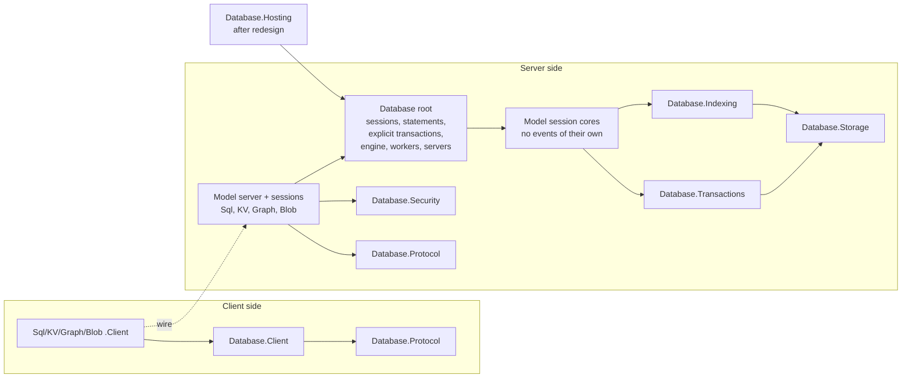

# Database event sources: plan of record

**Status:** batches B1-B5 and the integration pass implemented 2026-10-08, with the section 9 recommendations applied; Q1-Q4 still await owner confirmation, Q5 and `SessionFaulted`'s message were decided on 2026-10-09; section 5 (batch D, #1349) waits for the owner's redesign ·
**Created:** 2026-10-08 · **Owner:** Chase Crawford
**Request:** the owner's request of 2026-10-08, "Event Source Tracing: add extensive EventSource
tracing to all the Database projects … follow the EventSource pattern within the repository and
ensure we have the proper paths logging."
**Rules:** `.claude/rules/event-source.md` (authoring), `.claude/rules/database-area.md`
(concrete-first shape), `docs/EVENT_SOURCES.md` (the public list of source names)
**Branch:** every batch branches from the integration branch
`claude/database-inventory-sql-expansion-aa27d1` (draft PR #1168) and merges back.

> **Why this file exists.** It is the sequencing record for one program: giving every Database
> project that does run-time work its own internal `EventSource`, without colliding with the
> owner's concurrent rework of the Hosting builder, schema provisioning and engine extensibility.
> It holds the per-project decision, the event catalog with the code path that writes each event,
> and the batches. When the last batch lands, each project's `docs/DESIGN.md` **Diagnostics**
> section is the durable record and this file is deleted.

Confidence tags: **[Certain]** checked in this tree at `eec49a27` or in a cited reference source;
**[Likely]** a strong inference; **[Guessing]** judgment filling a gap. File references are
`path:line` at `eec49a27`; paths under `resources/Database/` drop the `Assimalign.Cohesion.`
prefix of the project folder (`Database.Storage/src/Storage.cs`).

---

## 1. What exists, and what is missing

- **[Certain]** Two Database sources exist and conform to `event-source.md`:
  `Assimalign.Cohesion.Database` (3 events: worker failed, worker recovered, database taken
  offline; `Database/src/Internal/EventSource/DatabaseEventSource.cs`) and
  `Assimalign.Cohesion.Database.Hosting` (6 reopen events;
  `Database.Hosting/src/Internal/EventSource/DatabaseHostingEventSource.cs`). Both have name,
  strict-manifest and listener tests and a DESIGN.md Diagnostics section.
- **[Certain]** Nothing else in the area reports. An operator today cannot see a database open,
  a recovery, a checkpoint, a deadlock, a lock wait, a server session, a handshake refusal, a
  client connection or a slow statement.
- **[Certain]** 163 catch blocks in `resources/Database/**/src` swallow an exception with no
  trace (a scripted scan; §10 lists the ones this plan instruments). The worst are the four
  servers' catch-all session handlers, which turn any unexpected server error into an error
  frame and nothing else (`Database.Sql/src/Internal/SqlDatabaseServerSession.cs:130-133`, and
  the same shape in Graph, KeyValuePair and Blob), the kernel's swallowed abort-record write
  (`Database.Transactions/src/TransactionManager.cs:733-740`), and the clients' swallowed
  observer failures (`Database.Sql.Client/src/SqlConnection.cs:235`, `:252`, `:269`).
- **[Certain]** The in-process forwarder enables every keyword of a source it forwards
  (`libraries/Logging/Assimalign.Cohesion.Logging.EventSource/src/Internal/EventSourceLogForwarder.cs:169`,
  `EventKeywords.All`). Keywords therefore scope out-of-process tools only; they never protect a
  payload, and the logger's level rule is what decides cost in process (§2, D5).

## 2. Decisions this plan makes

| # | Decision | Why |
|---|---|---|
| D1 | **One source per assembly, written where the behavior lives.** A behavior every model shares lives once in the root base (database-area.md, rule 8), so its events are written once, by the root source: database create/open/drop/close, engine lifecycle, worker passes, server start/stop, the server-session handshake setters, session and statement execution, and explicit transactions. Model sources carry only what the model owns: its server's accept loop and sessions, Blob's per-database refusal, Graph and Documents index recovery. | One statement event covers the four statement models, because their statements enter through `DatabaseSession.ExecuteAsync` (`Database/src/DatabaseSession.cs:196`, `:216`); the Sql and KeyValuePair servers call it (`SqlDatabaseServerSession.cs:344`, `KeyValueDatabaseServerSession.cs:332`), and Graph's server reaches it after parsing (`GraphDatabaseSession.cs:125-141`). Blob has no statements: its container operations are reported by the kernel's transaction events and, on the wire, by its server and client. The root already reports the workers of all five engines this way (`DatabaseEventSource.cs:16-18`). |
| D2 | **No shared, linked or forwarded source** (event-source.md rules 2 and 3). The four servers' sources are separate files with the **same ids, names and payloads** for the same events (§4.9). | Rule 3 forbids `shared/` linking; identical shapes give operators one provider list and one log query for all four. |
| D3 | **Levels follow rule 7 literally**, with this Database mapping: Error = an operation failed (a statement, a commit, an open, a session the server could not serve, a storage gone offline); Warning = degraded but recovered (a deadlock broken, an undo deferred, a refused handshake, a slow statement, a lost journal tail repaired); Informational = lifecycle (engine, database, storage, server, checkpoint, recovery, client connection); Verbose = per-operation detail (statement start/stop, transaction begin/end, lock waits, frames, page splits, pool rent/return). | PostgreSQL logs every failed statement at ERROR (`log_min_error_statement = ERROR`, `src/backend/utils/misc/guc_tables.c:568`), each checkpoint by default (`log_checkpoints` boot value `true`, `src/backend/utils/misc/guc_parameters.dat:1655-1659`) and long lock waits by default (`log_lock_waits` `true`, `:1752-1756`). Owner question Q1 offers the quieter alternative for caller-caused statement failures. |
| D4 | **`Start`/`Stop` only for same-flow work** (rule 8), stop id = start id + 1: statement execution, checkpoint, storage recovery, worker pass, lock wait, engine disposal, index recovery, client command. Lifetimes that cross flows use `Opened`/`Closed`/`Accepted`/`Begun`: engines, databases, sessions, server sessions, transactions, client connections. **Every `Start` has a `Stop` on every path** (integration pass), as `System.Net.Http`'s pairs: the `Stop` carries `status` (`Success`; `Error` after the pair's `Failed` event; `Cancelled` for a cancellation, a worker pass that saw the stop and returned, or abandoned work) and is written from a `finally`; `LockWaitStop` alone carries a domain `outcome` instead. As `RequestStop` does, a `Stop` is written only for a `Start` that was written, so a session that attaches mid-operation sees no `Stop` without its `Start`; the `Failed` and `Slow…` events are written either way. Work that spans its caller's calls (a Graph `QueryPaths` enumeration) writes its end in its start's captured execution context, so the `Stop` closes the `Start`'s activity. | A `…Start` on a lifetime opens an activity that never stops and nests later work under it; so does a `…Start` whose failure or cancellation path skips its `Stop`. |
| D5 | **Cost nothing when nobody listens** (rule 9), with four Database-specific rules: (a) an NVI member that must time its core keeps a synchronous fast path, `if (!Log.IsEnabled()) return XxxCoreAsync(...)`, and only the enabled path enters an `async` wrapper, which uses `[AsyncMethodBuilder(typeof(PoolingAsyncValueTaskMethodBuilder<>))]`; (b) `Stopwatch.GetTimestamp()` is taken only inside an `IsEnabled` check, except on paths that already wait (lock waits, group-commit waits); (c) `ToString()` of `TransactionId`, `LockResource`, `DatabaseName`, `EngineModel` and every enum runs inside the guard; (d) every high-volume Verbose event carries a keyword so a tool can take one family without the rest. | Statements, frames and lock acquisitions are the engine's hot paths. The forwarder enables a source at the logger's level, so an application that forwards at Information pays for every Warning-level timing check (the slow-statement threshold). |
| D6 | **Counters are exact or absent** (rule 10), and live only where the transition already does I/O or takes a lock: storage checkpoints, journal fsyncs, page reads and writes, foreground evictions, pre-image spills; kernel transactions, commits, rollbacks, deadlocks, lock waits; server sessions; client connections and rentals; root open sessions. **No process-global counter on a per-row or per-frame path** (Sql streams one frame per result row, `SqlDatabaseServerSession.cs:378-388`), and the kernel's transaction counters move once per kernel transaction, so once per autocommit statement; throughput is read from the kernel's `transactions-per-second`, since every autocommit statement is one kernel transaction. | A process-global `Interlocked` line shared by every session on every row is a contention point; a counter updated only while enabled would be inexact. |
| D7 | **Thresholds are EventSource arguments, not public API.** The root source reads `SlowStatementThresholdMs` and the Transactions source `SlowLockWaitThresholdMs` from `EventCommandEventArgs.Arguments` in `OnEventCommand`; default 1000 ms each; the last enabling session's value wins. (`dotnet-trace collect --providers "Assimalign.Cohesion.Database:0x4:4:SlowStatementThresholdMs=250"`.) | `database-area.md` forbids new public interfaces and the owner is redesigning the builders, so no options property is added now. The in-process forwarder passes no arguments, so it gets the defaults. Q2 asks about the default. |
| D8 | **Payload hygiene** (rule 11): never statement text, parameter values, keys, values, document or blob content, authentication evidence, connection strings or tokens. Identifiers are fine: engine, database, storage, container, index and principal names, session and transaction ids, protocol codes, diagnostic codes. **An operation's failure (a statement, commit, command, query or transfer) is written by its code and its exception's type only, never a message** (integration pass, Q3): the server's, a parser's and the engine's messages quote what the operation carried. A thrown engine failure's code is written only where the writer can read it (an offline refusal's `Code`, a client's wire code); a Sql evaluation or GQL parse code lives only in its message until the area root grows a structured code carrier, so it writes an empty code. Lifecycle, device and infrastructure failures are type full name + `Message`; the servers' `SessionFaulted` keeps its message as the debugging record of a server bug (owner review). A name or text a peer sent is cut to 256 or 1024 characters; a lock resource is its kind and object id, never a key's hash. | The last point of §1: no keyword can keep statement text out of forwarded logs. Q3 confirms. Redacting known user data out of a message (B4, B5) missed what a client did not know of, so no message of an operation's failure is written at all. |
| D9 | **A swallowed exception that hides a fault gets an event**; one that encodes an expected outcome (a cancellation at shutdown, a reclaimed MVCC version, a peer that hung up) does not. §10 lists both. A peer that hung up or reset its connection reaches a server pump as a `ConnectionException`, a raw `SocketException` or an `IOException` wrapping one, and closes the session with a transport reason; a bare `IOException`, which can be the storage device's, stays a fault. | "Proper paths" means the operator can see every failure the engine absorbs. A TCP reset during a server write reached the pumps as a raw `SocketException` and was a `SessionFaulted` (Error) before the integration pass. |
| D10 | **The tracing of code the redesign rewrites lands after it** (§5): Hosting, the root's provisioning surface, Sql.Schema, and the Sql model's provisioning, statement-planning and function paths. The batches in §6 touch none of those files. | Instrumenting code the owner is about to delete or move is churn, and the batches must not conflict with the redesign PRs. |

### Payload vocabulary

Every source uses these names, so a log query or a trace filter works across sources.

| Name | Type | Source of the value |
|---|---|---|
| `engineName` | string | `DatabaseEngine.Name` |
| `model` | string | `EngineModel.ToString()` |
| `database` | string | `DatabaseName.ToString()`, or `Storage.Name` in the kernel |
| `storageId` | string | `Storage.Id` |
| `sessionId` | Guid | `DatabaseServerSession.Id` (server sessions) |
| `sessionNumber` | long | a new internal, process-wide sequence in `DatabaseSession` (no public surface) |
| `transactionId` | string | `DatabaseTransaction.Id` (explicit transactions, root) |
| `transactionSequence` | long | `TransactionSequence` (kernel transactions) |
| `workerName`, `workerKind` | string | `DatabaseEngineWorker.Name`, `.Kind` |
| `code` | string | `ProtocolErrorCode.ToString()` or a diagnostic code (`COHDBL001`) |
| `exceptionType`, `exceptionMessage` | string | `GetType().FullName`, `Message` |
| `durationMilliseconds` | double | `Stopwatch.GetElapsedTime(start).TotalMilliseconds` |

The kernel types (`TransactionManager`, `LockManager`, `StorageBufferPool`,
`StorageGroupCommitGate`, `BTreeIndex`) do not know their database today. The owning type hands
them the name through an **internal** member: `TransactionCoordinator` passes `_storage.Name` to
the manager it builds (`TransactionCoordinator.cs:117-123`) and to
`LockManager.EnterEngineMode` (`LockManager.cs:121`); `Storage` sets its pool's and gate's name
when `InitializeNew`/`OpenExisting` learn it (`Storage.cs:969-971`, `:1072`); `BTreeIndexManager`
reads `BTreeIndexManagerOptions.Storage.Name` (`BTreeIndexManagerOptions.cs:17`). A standalone
`TransactionManager.Create`/`LockManager.Create` reports an empty `database`.

## 3. Inventory and decision per project

39 shipped projects: the 38 `resources/Database` entries of the release inventory
(`installer/scripts/modules/CohesionPackaging.psm1:195-232`) and `Sdk.Database.Tasks`. **17 get
a source** (2 exist, 15 are new). The 14 non-shipped folders (12 empty placeholders: the five
`Cache*`, `Memory`, `Documents.Client` and the five `<Model>.Security`; and the `Refs`/`Runtime`
framework producers) compile no code of their own and get none.

| Project | Source | Batch | Decision |
|---|---|---|---|
| `Database` (root) | `Assimalign.Cohesion.Database` (exists, 3 events) | B1, plus D for provisioning | Extend with 31 events (§4.1). Provisioning (`DatabaseInstance.ApplySchemaAsync`, `Provisioning/`) leaves the root in the redesign; nothing is instrumented there. |
| `Database.Storage` | `Assimalign.Cohesion.Database.Storage` (new) | B2 | Recovery, checkpoints, write-back, group commit, offline, pool pressure, checksum failures; 8 counters (§4.2). |
| `Database.Transactions` | `Assimalign.Cohesion.Database.Transactions` (new) | B3 | Kernel transactions, deadlocks, lock waits, deferred undo, recovery analysis, deferred checkpoints, version purge; 6 counters (§4.3). |
| `Database.Indexing` | `Assimalign.Cohesion.Database.Indexing` (new) | B3 | Index DDL, format and corruption failures, invariant violations, splits, writer purges (§4.4). |
| `Database.Protocol` | `Assimalign.Cohesion.Database.Protocol` (new) | B4 | Verbose frame trace under a `Frames` keyword, written by the stream reader and writer (§4.5). No counters (D6). |
| `Database.Security` | `Assimalign.Cohesion.Database.Security` (new) | B4 | Authenticator verdicts and failures, written by the NVI `AuthenticateAsync` (§4.6). |
| `Database.Client` | `Assimalign.Cohesion.Database.Client` (new) | B4 | Connections, dial and handshake failures, broken connections, pool rent/return; 4 counters (§4.7). |
| `Database.Sql.Client` | `Assimalign.Cohesion.Database.Sql.Client` (new) | B4 | Command start/stop/failed; observer failures (§4.8). |
| `Database.KeyValuePair.Client` | `…KeyValuePair.Client` (new) | B4 | Same shape as Sql.Client (§4.8). |
| `Database.Graph.Client` | `…Graph.Client` (new) | B4 | Query start/stop/failed (§4.8). |
| `Database.Blob.Client` | `…Blob.Client` (new) | B4 | Transfer start/stop/failed (§4.8). |
| `Database.Sql` | `Assimalign.Cohesion.Database.Sql` (new) | B5, plus D | B5: the server and its sessions only (§4.9). D: statement planning, DDL self-commit, too-complex statements, model-owned provisioning, the typed extension registry (§5). |
| `Database.KeyValuePair` | `…KeyValuePair` (new) | B5 | Server and sessions (§4.9). |
| `Database.Graph` | `…Graph` (new) | B5 | Server and sessions, index recovery on open, wire-path parse failures (§4.9, §4.10). |
| `Database.Blob` | `…Blob` (new) | B5 | Server and sessions, per-database and engine-wide refusal, transfers (§4.9, §4.10). |
| `Database.Documents` | `…Documents` (new) | B5 | Index recovery on open; it has no server (§4.10). |
| `Database.Hosting` | `Assimalign.Cohesion.Database.Hosting` (exists, 6 events) | D | Build, start, stop, commands, admin endpoint, health; lands on the redesigned builder (§5). |
| `Database.Types` | none | — | Value types and codecs: pure functions whose failures are exceptions to the caller. |
| `Database.Language` | none | — | Lexer/parser infrastructure; no I/O, no lifecycle. Parse errors are diagnostics returned to the session, which the root reports (`StatementFailed`, §4.1). |
| `Database.Execution` | none | — | Request and result contracts (232 lines). |
| `Database.Sql.Language`, `Graph.Language`, `Documents.Language` | none | — | As `Database.Language`. |
| `Database.Sql.Catalog`, `Graph.Catalog`, `Documents.Catalog`, `Blob.Catalog`, `KeyValuePair.Catalog` | none | — | Catalog reads and writes go through `Storage`, which reports I/O; DDL refusals are statement failures; the swallowed reads (`GraphCatalog.cs:425-439`, `DocumentCatalog.cs:404-409`, `BlobCatalog.cs:375-380`) skip reclaimed versions, an expected MVCC outcome (D9). Sql.Catalog is also in the extensibility rework. |
| `Database.Sql.Storage`, `Graph.Storage`, `Documents.Storage`, `Blob.Storage`, `KeyValuePair.Storage` | none | — | Record-format adapters over `Storage`, which reports for them; Graph index recovery is reported by the Graph model at its call site. |
| `Database.Sql.Tcp` | none | — | One extension method configuring a TCP listener; `Connections.Tcp` reports the listener. |
| `Database.Sql.Schema` | none expected | D | A schema compiler and validator with no run-time lifecycle. Its runtime provisioning moves into the model in the redesign; re-decide when that lands (§5). |
| `Database.Embedded` | none | — | Holds engines and disposes them; the root reports each engine's lifecycle. Revisit if it gains behavior. |
| `Database.Testing` | none | — | Test harness; failures surface to the test. Also rides the Hosting redesign. |
| `Database.ApplicationModel` | none | — | Declarative planner run while a gateway builds; no run-time work. |
| `Sdk.Database.Tasks` | none | — | MSBuild tasks log through `TaskLoggingHelper` into the build log and binlog; an `EventSource` would run inside an MSBuild node no application tool attaches to. |

## 4. Event catalog

`kw` names a keyword in the source's nested `Keywords` class (explicit bits below the reserved
top 16, rule 9); events without one check `EventKeywords.None`. Every event has a `[NonEvent]`
public overload that takes the domain types and a `private` `[Event]` method (rule 6). Ids are
final once a batch merges (rule 6).

### 4.1 `Assimalign.Cohesion.Database` (root) — `DatabaseEventSource`, batch B1

Keywords: `Workers = 0x1`, `Sessions = 0x2`, `Statements = 0x4`, `Transactions = 0x8`.
Counter: `current-sessions` (gauge; `DatabaseSession` constructor `DatabaseSession.cs:70`, and the
one transition of `_closed` at `:239`).

| Id | Event | Level | kw | Payload | Written at |
|---|---|---|---|---|---|
| 1 | WorkerFailed | Warning | — | workerName, workerKind, database, exceptionType, exceptionMessage, consecutiveFailures | exists: `DatabaseEngineWorker.cs:487`, `:734`, `:863`, `:898` |
| 2 | WorkerRecovered | Informational | — | workerName, workerKind, database, failures | exists: `DatabaseEngineWorker.cs:868`, `:875` |
| 3 | DatabaseTakenOffline | Error | — | engineName, database, cause, workerName, workerKind, exceptionType, exceptionMessage | exists: `DatabaseEngine.cs:1073` |
| 4 | EngineCreated | Informational | — | engineName, model, workerFailureWindowMilliseconds, workerFailureMinimumPasses | `DatabaseEngine.cs:182-193` (the constructor every leaf reaches through `:152-155`) |
| 5 | EngineComposed | Informational | — | engineName, model, workerCount, serverCount | `DatabaseEngine.cs:831-837` (`CompleteComposition`) |
| 6 | EngineDisposeStart | Informational | — | engineName, model | `DatabaseEngine.cs:606-611`, after the once-only exchange |
| 7 | EngineDisposeStop | Informational | — | engineName, model, status, failureCount, durationMilliseconds | `DatabaseEngine.cs:693-697`, on every path from a `finally`; `status` is `Error` when a component failed to close (after event 34) or the disposal escaped |
| 8 | WorkerLoopFaulted | Error | — | engineName, workerName, workerKind, exceptionType, exceptionMessage | `DatabaseEngine.cs:1120-1121` (`Run` returned early) and `:1127-1130` (`Run` threw); today only `State` shows it |
| 9 | DatabaseCreated | Informational | — | engineName, model, database, durationMilliseconds | `DatabaseEngine.cs:476-482`; not yet for `SqlDatabaseEngine.CreateDatabaseAsync(name, collation)`, which bypasses the base member (batch D, #1349; the same holds for event 13) |
| 10 | DatabaseOpened | Informational | — | engineName, model, database, waitedForClose, durationMilliseconds | `DatabaseEngine.cs:505-511`, `:1139-1158`; written only when `TryGetDatabaseCore` held no open instance before the call, so an open of an open database writes nothing |
| 11 | DatabaseDropped | Informational | — | engineName, model, database | `DatabaseEngine.cs:522-528` |
| 12 | DatabaseClosed | Informational | — | engineName, model, database | `DatabaseEngine.cs:907-917` (`ForgetClosedDatabase`, which every first close reaches from `DatabaseInstance.cs:259-269`; `DatabaseInstance.cs` itself is not edited) |
| 13 | DatabaseOperationFailed | Error | — | engineName, model, database, operation, exceptionType, exceptionMessage | the three members above; `operation` is `Create`, `Open` or `Drop`; not for `DatabaseNotFoundException` on open (a server's `ResolveDatabaseAsync` expects it, `SqlDatabaseServerSession.cs:435`) or `OperationCanceledException` |
| 14 | WorkerPassStart | Verbose | Workers | workerName, workerKind, pass | `DatabaseEngineWorker.cs:737` (`RunPass`) |
| 15 | WorkerPassStop | Verbose | Workers | workerName, workerKind, pass, status, durationMilliseconds | `DatabaseEngineWorker.cs:737-775`, from a `finally`: `Success`; `Error` for a pass that threw, reported a failure or escaped; `Cancelled` for a pass the engine's stop cancelled, whether it threw the cancellation or saw the stop and returned |
| 16 | WorkerDatabaseUnfinished | Verbose | Workers | workerName, workerKind, database | `DatabaseEngineWorker.cs:571` (`ReportUnfinished`, a busy pass; owner decision 45) |
| 17 | WorkerGiveUpFailed | Error | — | workerName, workerKind, database, exceptionType, exceptionMessage | `DatabaseEngineWorker.cs:724` (`RecordGiveUpFailure`, from `DatabaseEngine.cs:1063-1066`: the leaf's `TakeDatabaseOfflineCore` threw) |
| 18 | ServerStarted | Informational | — | engineName, model, serverType | `DatabaseServer.cs:86-112`, after `Volatile.Write(ref _lifecycle, running)` |
| 19 | ServerStartFailed | Error | — | engineName, model, serverType, exceptionType, exceptionMessage | `DatabaseServer.cs:103-107` (the terminal failed start; covers bind failures and Blob's engine-wide refusal, `BlobDatabaseServer.cs:125-133`) |
| 20 | ServerStopped | Informational | — | engineName, model, serverType, durationMilliseconds | `DatabaseServer.cs:127-147` |
| 21 | ServerSessionNegotiated | Verbose | Sessions | sessionId, protocolVersion | `DatabaseServerSession.cs:89` (`SetNegotiatedVersion`) |
| 22 | ServerSessionAuthenticated | Informational | — | sessionId, principal (cut to 256 characters: the peer sent it) | `DatabaseServerSession.cs:109` (`SetAuthenticatedPrincipal`) |
| 23 | SessionOpened | Verbose | Sessions | engineName, database, sessionNumber | `DatabaseSession.cs:70-74` |
| 24 | SessionClosed | Verbose | Sessions | database, sessionNumber, failed | `DatabaseSession.cs:230-279` |
| 25 | StatementStart | Verbose | Statements | database, sessionNumber, requestKind | `DatabaseSession.cs:196-202`, `:216-222`; `requestKind` is the request type's name, or `Text` for the string overload |
| 26 | StatementStop | Verbose | Statements | database, sessionNumber, status, affectedCount, durationMilliseconds | same |
| 27 | SlowStatement | Warning | — | engineName, model, database, sessionNumber, requestKind, status, durationMilliseconds, thresholdMilliseconds | same; `durationMilliseconds >= SlowStatementThresholdMs` (D7) |
| 28 | StatementFailed | Error | — | database, sessionNumber, requestKind, code, exceptionType, durationMilliseconds | same; a result with `Status == Error` writes its first error diagnostic's code (parse errors, `COHDBL001` plan rejections, `COHSQLT003`) and an empty type; a thrown exception writes its type and an offline refusal's model code (empty otherwise); never a message (D8); not for `OperationCanceledException` |
| 29 | TransactionBegun | Verbose | Transactions | database, sessionNumber, transactionId, isolationLevel | `DatabaseSession.cs:135-176`, once the transaction is the session's (`:164`) |
| 30 | TransactionCommitted | Verbose | Transactions | transactionId, durationMilliseconds | `DatabaseTransaction.cs:228-231`; the duration is the commit's own, since the transaction keeps no begin timestamp |
| 31 | TransactionRolledBack | Verbose | Transactions | transactionId, cause | `DatabaseTransaction.cs:257-283` (`Rollback`), `:295-321` (`Dispose`), `:363-385` (`SessionClosed`) |
| 32 | TransactionAborted | Verbose | Transactions | transactionId, exceptionType | `DatabaseTransaction.cs:332-352` (`AbortAsync`; the statement's own failure is event 28) |
| 33 | TransactionCommitFailed | Error | — | transactionId, exceptionType | `DatabaseTransaction.cs:188-243`: the offline refusal (`:194`), the aborted outcome (`:236-237`), a throwing `CommitCoreAsync` (`:230`); written after the commit released its lock and end gate |
| 34 | EngineDisposeFailed | Error | — | engineName, model, failureCount, exceptionType, exceptionMessage | `DatabaseEngine.cs:694-697`, the first collected failure |

**[Certain] Re-entry.** Graph and Documents parse a text statement inside
`ExecuteCoreAsync(string)` and then call the root `ExecuteAsync(QueryRequest)` again on the same
session (`GraphDatabaseSession.cs:306-307` → `:141`; `DocumentDatabaseSession.cs:407-408` →
`:243`). Events 25-28 are therefore written for the **outermost** call on a session only, through
an internal per-session depth field; a session runs one operation at a time
(`DatabaseSession.cs:56`, `AlreadyActiveMessage`), so the field needs no synchronization. Graph's
wire path enters at `ExecuteStatementAsync` (`GraphDatabaseServerSession.cs:340-344`), so a parse
failure there happens before the root sees the statement; Graph event 12 (§4.10) reports it.

Timing on the statement path follows D5 (a): `ExecuteAsync` returns the core directly while the
source is disabled; while a listener enables it at Error or any more verbose level, it calls the
core the same way and enters a pooled async wrapper only for a core that has not completed
successfully, which times the core and writes 26-28, so a synchronous core throws from the call
whether or not anyone listens. `SlowStatement` needs Warning, so an application that forwards at
Information pays two timestamps per statement and allocates nothing for a synchronous core; the B1
PR records a before/after allocation check (§7).

### 4.2 `Assimalign.Cohesion.Database.Storage` — `StorageEventSource`, batch B2

Keywords: `Checkpoints = 0x1`, `WriteBack = 0x2`, `GroupCommit = 0x4`, `BufferPool = 0x8`.

| Id | Event | Level | kw | Payload | Written at |
|---|---|---|---|---|---|
| 1 | StorageCreated | Informational | — | database, storageId, model | `Storage.cs:969-1017` (`InitializeNew`) |
| 2 | RecoveryStart | Informational | — | database, storageId | `Storage.cs:1089`, before `StorageRecovery.Run` |
| 3 | RecoveryStop | Informational | — | database, status, rebuiltPages, maxSequence, redoLsn, durationMilliseconds | `Storage.cs:1186-1205`, from a `finally`: a recovery that threw stops with `Error` and zeros |
| 4 | JournalTailLost | Warning | — | database, strayLsn, redoLsn | `Storage.cs:1173-1184`: a page outlived the journal records that stamped it (a lost journal tail or an older journal file); the open repairs the LSN floor |
| 5 | CheckpointStart | Informational | Checkpoints | database, activeTransactions, journalLength | `Storage.cs:1405-1424` |
| 6 | CheckpointStop | Informational | Checkpoints | database, status, checkpointLsn, durationMilliseconds | `Storage.cs:1455`, from a `finally`: a checkpoint that threw stops with `Error` and checkpoint LSN zero |
| 7 | PagesWrittenBack | Verbose | WriteBack | database, pages, durationMilliseconds | `Storage.cs:1506-1516`, when `pages > 0` |
| 8 | PendingCommitsFlushed | Verbose | GroupCommit | database, durableLsn | `Storage.cs:1467-1484` / `StorageGroupCommitGate.cs:98-115`, when a flush ran |
| 9 | GroupCommitWindowMissed | Verbose | GroupCommit | database, lsn, windowMilliseconds | `StorageGroupCommitGate.cs:86-90`: the flush worker missed the window and the committer flushed inline; not for a wait the storage going offline abandoned |
| 10 | StorageOffline | Error | — | database, cause, exceptionType, exceptionMessage | `Storage.cs:506-512` (`RaiseOffline`, reached from the journal through `:1028`); for an engine give-up the root writes event 3 too, with the worker |
| 11 | StorageCommitUnconfirmed | Error | — | database, transactionSequence, commitLsn, exceptionMessage | `Storage.cs:2015-2025` (a storage transaction's commit record is in the journal but its durability failed) |
| 12 | ShutdownFlushSkipped | Warning | — | database, reason | `Storage.cs:2285-2293` (closing an offline storage writes nothing; the reopen recovers) |
| 13 | BufferPoolExhausted | Error | — | database, capacity | `StorageBufferPool.cs:620` |
| 14 | DirtyPageEvicted | Verbose | BufferPool | database, pageId, pageLsn | `StorageBufferPool.cs:611-613` (a foreground write on the thread that needed the frame: a pin miss or a shrink); written under the pool lock, as 13 and 16 are |
| 15 | BufferPoolResized | Informational | — | database, oldCapacity, newCapacity | `StorageBufferPool.cs:114` |
| 16 | PageChecksumFailed | Error | — | database, pageId | `StorageBufferPool.cs:219` (`PageChecksum.Verify` throws `StorageCorruptionException`, `PageChecksum.cs:51`); not the other corruption checks of a load |
| 17 | StorageClosed | Informational | — | database, durationMilliseconds | `Storage.cs:2210-2231`, `:2234-2260` |

Counters (all on paths that already write or wait on the device): `current-storages` (gauge;
created or recovered +1, the first dispose −1 behind a new `Interlocked.Exchange` flag, because
`_disposed` is a plain `bool`), `checkpoints-per-second` (`:1455`), `journal-flushes-per-second`
(durable `FlushCore`, `StorageJournal.cs:1386`), `page-reads-per-second` (pool misses,
`StorageBufferPool.cs:214-219`), `page-writes-per-second` (`StorageBufferPool.cs:700-723`),
`foreground-page-writes-per-second` (`:611-613`), `group-commit-self-flushes-per-second`
(`StorageGroupCommitGate.cs:89`: only a flush that reached the device, a committer's own inline
flush after its window; a committer another flush covered first writes event 9 but is not counted),
`pre-images-spilled-per-second` (`Storage.cs:2585`).

### 4.3 `Assimalign.Cohesion.Database.Transactions` — `TransactionEventSource`, batch B3

Keywords: `Transactions = 0x1`, `Locks = 0x2`, `Checkpoints = 0x4`, `Purge = 0x8`.

| Id | Event | Level | kw | Payload | Written at |
|---|---|---|---|---|---|
| 1 | TransactionBegun | Verbose | Transactions | database, transactionSequence, isolationLevel | `TransactionCoordinator.cs:355-364` |
| 2 | TransactionCommitted | Verbose | Transactions | database, transactionSequence | `TransactionCoordinator.cs:382-388` |
| 3 | TransactionRolledBack | Verbose | Transactions | database, transactionSequence | `TransactionCoordinator.cs:418-427` |
| 4 | CommitRecordWriteFailed | Warning | — | database, transactionSequence, exceptionType, exceptionMessage | `TransactionManager.cs:403-407` (the commit record could not be written, so the kernel rolled the transaction back; the caller's failed commit is root event 28 or 33, at Error); renamed from `TransactionAborted`, which is the root's event 32 |
| 5 | CommitUnconfirmed | Error | — | database, transactionSequence, exceptionMessage | `TransactionCoordinator.cs:389-392` |
| 6 | DeadlockDetected | Warning | — | database, transactionSequence, resource (kind and object id only), mode | `LockManager.cs:209-213` (the victim), after the lock table's lock is released |
| 7 | LockWaitStart | Verbose | Locks | database, transactionSequence, resource (kind and object id only: an entry's id is a key's hash for a key lock), mode | `LockManager.cs:216-222` |
| 8 | LockWaitStop | Verbose | Locks | database, transactionSequence, outcome (`Granted`, `Cancelled`, `Ended`, `Abandoned`), durationMilliseconds | `LockManager.cs:222`, from the `finally` around the waiter's await, after the cancellation registration is disposed |
| 9 | SlowLockWait | Warning | — | database, transactionSequence, resource (kind and object id only), mode, durationMilliseconds, thresholdMilliseconds | with 8, when the wait reached `SlowLockWaitThresholdMs` (D7; any session's disable restores the default); PostgreSQL's `log_lock_waits` (`src/backend/storage/lmgr/proc.c:1700`) |
| 10 | LockWaitsAbandoned | Warning | — | database, cause | `LockManager.cs:141-151` (storage offline: every wait is refused); written from the storage's offline hook, which can run under its transaction lock |
| 11 | UndoDeferred | Warning | — | database, transactionSequence, exceptionType, exceptionMessage | `TransactionManager.cs:687-716` (an abort's undo failed; locks stay held until a retry) |
| 12 | DeferredUndoCompleted | Informational | — | database, transactionSequence, undone | `TransactionManager.cs:794-800` |
| 13 | AbortRecordWriteFailed | Warning | — | database, transactionSequence, exceptionType, exceptionMessage | `TransactionManager.cs:733-740` (swallowed today) |
| 14 | RecoveryAnalyzed | Informational | — | database, committed, aborted, maxSequence | `TransactionCoordinator.cs:590-603` (`AnalyzeAndScrub`; every model's open, e.g. `SqlDatabase.cs:184`) |
| 15 | CheckpointDeferred | Verbose | Checkpoints | database | `TransactionCoordinator.cs:722-727` (the apply gate was held; owner decision 23) |
| 16 | DeferredCheckpointSkipped | Verbose | Checkpoints | database, reason | `TransactionCoordinator.cs:754-764` |
| 17 | DeferredCheckpointFailed | Warning | — | database, exceptionType, exceptionMessage | `TransactionCoordinator.cs:765-768` (held and rethrown by the next `TryCheckpoint`, whose worker then writes root event 1) |
| 18 | VersionPurgePass | Verbose | Purge | database, versionsPurged, durationMilliseconds | `TransactionCoordinator.cs:807-844` |

Counters: `current-transactions` (gauge; `_openContexts` add `TransactionCoordinator.cs:361`, the
removing call in `UntrackEnded` `:948`, which `BeginAsync` also runs for a context the manager's
disposal already ended), `transactions-per-second`, `commits-per-second`, `rollbacks-per-second`
(rollbacks and aborts, and every model's snapshot pins of `ReadCommitted` statements, Sql and
KeyValuePair since #1363, which always end rolled back), `total-deadlocks`, `lock-waits-per-second`. The begin
and end paths already take the manager's lock and append a journal record, so the `Interlocked`
update is noise beside them; the transaction counters move once at a kernel transaction's begin
and once at its end, so once per autocommit statement, and never per row or per frame.

### 4.4 `Assimalign.Cohesion.Database.Indexing` — `IndexEventSource`, batch B3

Keyword: `Splits = 0x1`. No counters.

| Id | Event | Level | kw | Payload | Written at |
|---|---|---|---|---|---|
| 1 | IndexCreated | Verbose | — | database, objectId (written as `long`), index, kind | `BTreeIndexManager.cs:125-163` |
| 2 | IndexDropped | Verbose | — | database, objectId (`long`), index | `BTreeIndexManager.cs:165-188` |
| 3 | IndexFormatRefused | Error | — | database, objectId (`long`), index, rootPageId, foundFormat | `BTreeIndex.cs:150` |
| 4 | IndexCorruptionDetected | Error | — | database, index, pageId, formatVersion | `BTreeIndex.cs:1231` |
| 5 | IndexInvariantViolated | Error | — | database, index, pageId, detail | `BTreeIndex.cs:874`, `:1088`, `:1164`, `:1184`, `:1193` |
| 6 | PageSplit | Verbose | Splits | database, index, pageId, leaf, entries | `BTreeIndex.cs:859`, `:1072` |
| 7 | RootGrown | Verbose | Splits | database, index, rootPageId | `BTreeIndex.cs:1015` |
| 8 | WritersPurged | Informational | — | database, writers, entriesRemoved, durationMilliseconds | `BTreeIndexManager.cs:231-260` (recovery scrub, `SqlDatabase.cs:189`, `KeyValueDatabase.cs:150`, and purge); Informational, as Graph's and Documents' index recovery is: Sql's and KeyValuePair's only record of it |

### 4.5 `Assimalign.Cohesion.Database.Protocol` — `ProtocolEventSource`, batch B4

Keyword: `Frames = 0x1`. No counters: Sql writes one frame per result row, and a process-global
`Interlocked` per frame across every session is the contention D6 rules out.

| Id | Event | Level | kw | Payload | Written at |
|---|---|---|---|---|---|
| 1 | FrameRead | Verbose | Frames | messageType, payloadLength | `ProtocolStreamFrameReader.ReadFrameCoreAsync`, once a complete frame was read (the leaf that touches the transport; the public bases carry no tracing) |
| 2 | FrameWritten | Verbose | Frames | messageType, payloadLength | `ProtocolStreamFrameWriter.WriteFrameCoreAsync`, once the frame was written |

Frame failures (`ProtocolStreamFrameReader.cs:38`, `:44`, `:58`; `ProtocolChannel.cs:56`) are not
events here: the server session (event 6 of §4.9) or the client (`ConnectionBroken`) that catches
the `ProtocolException` reports it once, with its session or connection.

### 4.6 `Assimalign.Cohesion.Database.Security` — `DatabaseSecurityEventSource`, batch B4

| Id | Event | Level | kw | Payload | Written at |
|---|---|---|---|---|---|
| 1 | AuthenticationSucceeded | Verbose | — | authenticator, database, principal (each cut to 256 characters) | `DatabaseAuthenticator.cs:52-58` |
| 2 | AuthenticationRejected | Verbose | — | authenticator, database, principal (each cut to 256 characters) | same; the server's `HandshakeRefused` (Warning) is the operator-facing record |
| 3 | AuthenticationFailed | Error | — | authenticator, database, principal (each cut to 256 characters), exceptionType, exceptionMessage | same, when `AuthenticateCoreAsync` throws, written after the core unwound; not for a cancellation |

`AuthenticateAsync` keeps its direct return while the source is disabled (D5 a). `authenticator`
is the leaf's type name; the evidence is never written (D8). The database and principal are what an
unauthenticated peer sent, so they are cut to 256 characters, as the servers' `HandshakeRefused`
cuts them. A failure is captured by an exception filter and written from the `finally` once the
core unwound, never from the filter, which runs while a core that threw inside its own lock still
holds it. A cancellation is not a failure (a server's authentication timeout cancels the core).

### 4.7 `Assimalign.Cohesion.Database.Client` — `DatabaseClientEventSource`, batch B4

Keyword: `Pool = 0x1`. Counters: `current-connections` (open; `OpenAsync` success +1, the first
`CloseAsync` −1 behind a new `Interlocked.Exchange` flag, because `_isClosed` is checked and set
non-atomically at `DatabaseConnection.cs:393-398`), `current-rented-connections` (`MarkRented`
`:91-95` +1, `DisposeAsync` `:371` −1), `connections-opened-per-second`, `total-connection-failures`.

| Id | Event | Level | kw | Payload | Written at |
|---|---|---|---|---|---|
| 1 | ConnectionOpened | Informational | — | database, endPoint, serverVersion, durationMilliseconds | `DatabaseConnection.cs:108-160` |
| 2 | ConnectionOpenFailed | Error | — | database, endPoint, code, exceptionMessage, durationMilliseconds | the dial `:179-200` (owner decision 39's `ConnectionFailure`), the startup and authentication rejections `:129-133`, `:147-151`, the unexpected frames `:137`, `:155` |
| 3 | ConnectionClosed | Informational | — | database, endPoint | `DatabaseConnection.cs:391-431` |
| 4 | ConnectionBroken | Warning | — | database, code, exceptionMessage | `DatabaseConnection.cs:484` (`MarkBroken`) |
| 5 | ConnectionRented | Verbose | Pool | database, reused, waitedMilliseconds | `DatabaseClient.cs:101-142` |
| 6 | ConnectionReturned | Verbose | Pool | database, pooled | `DatabaseClient.cs:178-203` |
| 7 | ExchangeFailed | Verbose | — | database, code, exceptionType | `DatabaseConnection.cs:273-281`: every coded failure of an exchange, including one that leaves the response incomplete |
| 8 | DownloadReleaseFailed | Warning | — | database, exceptionType, exceptionMessage | `Internal/DatabaseDownloadStream.cs:226-229` (swallowed today) |

### 4.8 Model clients, batch B4

Each is its own source (rule 2). No counters (D6: per-command).

**`Assimalign.Cohesion.Database.Sql.Client` — `SqlClientEventSource`**; keyword `Commands = 0x1`.
**`Assimalign.Cohesion.Database.KeyValuePair.Client` — `KeyValueClientEventSource`**, same ids.

| Id | Event | Level | kw | Payload | Sql.Client | KeyValuePair.Client |
|---|---|---|---|---|---|---|
| 1 | CommandStart | Verbose | Commands | database, parameterCount | `SqlConnection.cs:200-207` | `KeyValueConnection.cs:329-340` |
| 2 | CommandStop | Verbose | Commands | database, status (`Success`, `Error`, `Cancelled`), rowCount, affectedCount, durationMilliseconds | `SqlConnection.cs:213`, from a `finally` on every path | `KeyValueConnection.cs:342`, the same |
| 3 | CommandFailed | Error | — | database, errorKind, code, exceptionType, durationMilliseconds | `SqlConnection.cs:216-220`, before the `Error` stop; coded and uncoded failures; never a message (D8) | `KeyValueConnection.cs:346-348`, the same |
| 4 | ObserverFailed | Warning | — | database, callback, exceptionType, exceptionMessage | `SqlConnection.cs:235`, `:252`, `:269` | `KeyValueConnection.cs:364`, `:381`, `:398` |

**`Assimalign.Cohesion.Database.Graph.Client` — `GraphClientEventSource`**; keyword `Queries = 0x1`.

| Id | Event | Level | kw | Payload | Written at |
|---|---|---|---|---|---|
| 1 | QueryStart | Verbose | Queries | database, operation | `GraphConnection.cs:43`, `:68`, `:84` |
| 2 | QueryStop | Verbose | Queries | database, operation, status, rowCount, durationMilliseconds | same, from a `finally`; a path query stops when its enumeration ends: `Success` at the terminal count, `Cancelled` when disposed early or cancelled, with the paths read, written in its start's captured execution context so it closes the start's activity |
| 3 | QueryFailed | Error | — | database, operation, code, exceptionType, durationMilliseconds | same, before the `Error` stop; never a message (D8) |

**`Assimalign.Cohesion.Database.Blob.Client` — `BlobClientEventSource`**; keyword `Transfers = 0x1`.

| Id | Event | Level | kw | Payload | Written at |
|---|---|---|---|---|---|
| 1 | TransferStart | Verbose | Transfers | database, operation, container | `BlobConnection.cs:53`, `:93`, `:117`, `:139`, `:171`, through `ExecuteCoreAsync` `:264` |
| 2 | TransferStop | Verbose | Transfers | database, operation, container, status, bytes, durationMilliseconds | same, from a `finally`; a download's from its copy's `finally` once its stream opened, `Cancelled` when its caller abandons the stream |
| 3 | TransferFailed | Error | — | database, operation, container, code, exceptionType, durationMilliseconds | same, before the `Error` stop; never a message: the server names the blob in its messages |
| 4 | ListCleanupFailed | Warning | — | database, container, code, exceptionType | `BlobConnection.cs:200`: a listing failure its consumer never saw (it stopped early); Warning, as the core's `DownloadReleaseFailed` |

Blob names are not written (D8: they may be user data); container names are identifiers.

### 4.9 Model servers: Sql, KeyValuePair, Graph, Blob — batch B5

Four sources with **identical ids 1-9**: `SqlDatabaseEventSource`
(`Assimalign.Cohesion.Database.Sql`), `KeyValueDatabaseEventSource`
(`…Database.KeyValuePair`), `GraphDatabaseEventSource` (`…Database.Graph`),
`BlobDatabaseEventSource` (`…Database.Blob`). Keyword `Sessions = 0x1`. Counters:
`current-server-sessions` (gauge; `_sessions.TryAdd` +1, a removing `TryRemove` in
`OnSessionCompleted` −1), `total-server-sessions`, `total-rejected-sessions`.

| Id | Event | Level | kw | Payload | Sql (Graph, KeyValuePair, Blob have the same branches) |
|---|---|---|---|---|---|
| 1 | SessionAccepted | Verbose | Sessions | engineName, sessionId, activeSessions | `SqlDatabaseServer.cs:225-228` (Graph `:216`, KeyValuePair `:228`, Blob `:274-276`) |
| 2 | SessionRejected | Warning | — | engineName, reason, activeSessions, maxSessions | `SqlDatabaseServer.cs:219-222` (Graph `:210`, KeyValuePair `:222`, Blob `:264-271`) |
| 3 | HandshakeRefused | Warning | — | sessionId, database, principal (each cut to 256 characters), code, detail (cut to 1024 characters) | every refusal branch of `HandshakeAsync`: `SqlDatabaseServerSession.cs:170-174` (protocol violation), `:178-182` (unsupported version), `:192-200` (storage format refused), `:202-206` (database not found), `:227-231` (protocol violation: no authenticate response), `:235-239` (authentication failed), `:245-251` (offline); a private `RefuseHandshakeAsync(code, detail)` writes the event and the error frame together |
| 4 | HandshakeTimedOut | Warning | — | sessionId, timeoutMilliseconds | `SqlDatabaseServerSession.cs:159-163`, `:217-220`: the timeout lapsed anywhere in the handshake, at a read or while the database opened, a frame was written, the authenticator ran or the session was created |
| 5 | SessionClosed | Verbose | Sessions | sessionId, reason, durationMilliseconds | `SqlDatabaseServerSession.cs:134-140` → `SqlDatabaseServer.cs:258-261`, from the cleanup's `finally`, once per session; `reason` from `:289-291` (peer), `:306-307` (terminate), `:281-285` (idle timeout), `:275-279` (shutdown), the catches `:114-133` (`Cancelled`; `TransportFailed` or `ConnectionAborted` for a peer that hung up or reset, D9) |
| 6 | SessionProtocolViolation | Warning | — | sessionId, exceptionMessage (cut to 1024 characters) | `SqlDatabaseServerSession.cs:114-118`, `:309-311` (Graph `:115-118`, KeyValuePair `:116-119`, Blob `:113-116`) |
| 7 | SessionFaulted | Error | — | sessionId, exceptionType, exceptionMessage | `SqlDatabaseServerSession.cs:130-133` (Graph `:131-133`, KeyValuePair `:132-134`, Blob `:129-131`); not for a transport failure from the peer's side (D9), which the four pumps classify alike; a bare `IOException` stays a fault |
| 8 | SessionCleanupFailed | Warning | — | sessionId, exceptionType, exceptionMessage | `SqlDatabaseServerSession.cs:474` (KeyValuePair `:459`; Graph and Blob at their cleanup catches, `:529` and `:564`) |
| 9 | SessionsAborted | Warning | — | engineName, sessions, drainTimeoutMilliseconds | `SqlDatabaseServer.cs:167-175` (Graph `:158-162`, KeyValuePair `:170-174`, Blob `:196-200`) |

Statement-level failures inside a session are the root's events 26-28; the server does not repeat
them. The Tcp driver's `ConnectionOpened` (Informational) already records each socket, which is
why `SessionAccepted` is Verbose.

**Blob adds** (ids 10-13):

| Id | Event | Level | kw | Payload | Written at |
|---|---|---|---|---|---|
| 10 | DatabaseRefused | Warning | — | sessionId, database (cut to 256 characters), phase, detail (cut to 1024 characters) | `BlobDatabaseServerSession.cs:238-241` (handshake, `COHDBB003`, owner decisions 42-43), `:406-410` (exchange, owner decision 44) |
| 11 | EngineRefused | Warning | — | engineName, phase, state | `BlobDatabaseServer.cs:264` (accept), `BlobDatabaseServerSession.cs:187-191` (handshake); the refused start is root event 19 |
| 12 | HostTransactionAbortFailed | Warning | — | sessionId, exceptionType, exceptionMessage | `BlobDatabaseServerSession.cs:421` (swallowed today) |
| 13 | TransferFailed | Error | — | sessionId, container (cut to 256 characters), code, exceptionType | `BlobDatabaseServerSession.cs:387-397` (code: the error frame's, `ExecutionFailure` or `Unavailable`; not for an exchange the transport ended, D9); `Internal/BlobGuardedStream.cs:192`, `:216` (no session, container or code); Error, as every record of a failed operation (D3); never a message |

### 4.10 Index recovery on open: Graph and Documents — batch B5

Graph ids 10-11 (after its server events); Documents ids 1-2 (`DocumentDatabaseEventSource`,
`Assimalign.Cohesion.Database.Documents`; Documents has no server).

| Id (Graph / Documents) | Event | Level | Payload | Written at |
|---|---|---|---|---|
| 10 / 1 | IndexRecoveryStart | Informational | database, abortedWriters | `GraphDatabase.cs:85-87`; `DocumentDatabase.cs:87-89` |
| 11 / 2 | IndexRecoveryStop | Informational | database, status (`Success`, or `Error` for a recovery that threw), durationMilliseconds | `GraphDatabase.cs:87-88`; `DocumentDatabase.cs:89-90`; from a `finally` |

Sql and KeyValuePair recover their indexes through `BTreeIndexManager.PurgeWritersAsync`, which
Indexing event 8 reports; Blob has no secondary index.

Graph adds one statement event for its wire path (§4.1, "Re-entry"):

| Id | Event | Level | Payload | Written at |
|---|---|---|---|---|
| 12 | StatementParseFailed | Error | sessionId, database, code (an offline refusal's model code; empty otherwise), exceptionType | inside the two parse delegates the server passes to `ExecuteStatementAsync` (`GraphDatabaseServerSession.cs:341-344`), which catch `DatabaseException` and `DatabaseTypeException` only, write and rethrow, and for an empty statement, which the root never sees either; the delegate runs at `GraphDatabaseSession.cs:133`, before the root call. Only the wire path passes these delegates, so the in-process text path, which root event 28 reports, is not doubled; never a message (D8) |

## 5. Deferred until the redesign lands

| Project | What waits | Why | Planned events |
|---|---|---|---|
| `Database.Hosting` | Everything new; the 6 reopen events stay, ids 1-6 unchanged | The owner is retyping `DatabaseApplicationBuilder` and its build context, removing `Provision(...)` and reshaping how a database is wired into an engine. `DatabaseApplicationBuilder.cs`, `DatabaseApplication.cs`, `DefaultDatabaseProvisioner.cs` and the registrations will move. | 7 ApplicationBuilt (Info: engines, servers, services); 8 ApplicationStarting (Info); 9 ApplicationStarted (Info: duration); 10 ApplicationStartFailed (Error); 11 ApplicationStopped (Info: duration); 12 ApplicationDisposeFailed (Error, today `DatabaseApplication.cs:101-108`); 13 ResourceCommandHandled (Info: kind, key, operation, today `DatabaseResourceCommandHandler.cs:25`, `:75`); 14 ResourceCommandRejected (Warning, today `:34-94`); 15 AdminEndpointFailed (Error, today `DatabaseAdminEndpointService.cs:99-116`); 16 HealthDegraded (Warning); 17 HealthRestored (Info). Server start/stop is root events 18-20, so the server host service writes nothing. |
| `Database` (root) provisioning | `DatabaseInstance.ApplySchemaAsync`, `SupportsSchemaProvisioning`, `Provisioning/CompiledSchema.cs` | The owner removes provisioning from the root. B1 does not edit `DatabaseInstance.cs` or `Provisioning/`. | None in the root: provisioning events go with the code into the model. |
| `Database.Sql` statement and provisioning paths | `SqlDatabaseSession.cs`, `SqlDatabase.cs` (`ApplySchemaCoreAsync` `:527`, `CreateSchemaSession` `:513`), `Internal/SqlSchemaProvisioner.cs`, `SqlQueryExecutor.cs`, the planner and evaluator function paths | Model-owned provisioning on build, and one typed abstraction for built-in and user scalar functions, aggregates and types, rewrite these files. | Ids 10-17 after the server's 1-9: 10 StatementPlanned (Verbose, `Statements`: database, accessPath, recordsExamined from `SqlStatementMetrics`); 11 StatementTooComplex (Warning: database, depth, today `SqlDatabaseSession.cs:216-228`, `:283-287`); 12 DdlSelfCommitted (Verbose: database, commandType, today `:239-260`); 13 ProvisioningStart / 14 ProvisioningStop (Info: database, schema, objects, duration); 15 ProvisioningFailed (Error); 16 ExtensionRegistered (Verbose: kind, name — the typed function/aggregate/type registry, built-ins included); 17 IndexRegistrationsSaved (Verbose: database, count, today `SqlDatabase.cs:308`). |
| `Database.Sql.Schema` | The decision itself | The compiler stays build-time; whether any run-time path remains in it after provisioning moves into the model is unknown. | None expected. |
| `Database.Testing` | — | Drives the Hosting runtime. | None. |

**[Likely]** Batch B1 edits `DatabaseEngine.cs`. The redesign may also touch it if engines take
over the provisioning lifecycle "on build". Whichever lands second rebases; B1 touches only the
public NVI bodies and the dispose and pump paths, not composition.

## 6. Rollout batches

Five batches touch disjoint files and can run in parallel. Each batch is one PR into the
integration branch, built and tested on its own. The only shared file is
`docs/EVENT_SOURCES.md`: each batch inserts its rows in sorted position, so a merge conflict there
is row-insert-only and is resolved by keeping both sides. B1 also owns the area-level text: the
"Deliberately not instrumented" paragraph of `docs/EVENT_SOURCES.md` (§3's "none" rows) and a
Diagnostics subsection in `docs/resources/Database/DESIGN.md` listing every Database source.

| Batch | Projects | New events | Files it may edit |
|---|---|---|---|
| **B1 — Root engine, sessions and statements** | `Database` | 31 | `Database/src/Internal/EventSource/DatabaseEventSource.cs`, `DatabaseEngine.cs`, `DatabaseEngineWorker.cs`, `DatabaseServer.cs`, `DatabaseServerSession.cs`, `DatabaseSession.cs`, `DatabaseTransaction.cs`; `Database/tests/DatabaseEventSourceTests.cs`; `Database/docs/DESIGN.md`; `docs/resources/Database/DESIGN.md`; `docs/EVENT_SOURCES.md`. Not `DatabaseInstance.cs`, not `Provisioning/`. |
| **B2 — Storage** | `Database.Storage` | 17 | `Database.Storage/src/Storage.cs`, `Journal/StorageJournal.cs`, `Internal/StorageBufferPool.cs`, `Internal/StorageGroupCommitGate.cs`, a new `Internal/EventSource/StorageEventSource.cs`; its tests and `docs/DESIGN.md`; `docs/EVENT_SOURCES.md`. |
| **B3 — Transactions and indexing** | `Database.Transactions`, `Database.Indexing` | 26 (18 + 8) | `TransactionCoordinator.cs`, `TransactionManager.cs`, `LockManager.cs`, new `Internal/EventSource/TransactionEventSource.cs`; `BTreeIndex.cs`, `BTreeIndexManager.cs`, new `Internal/EventSource/IndexEventSource.cs`; Indexing gets a test-only `InternalsVisibleTo` (it has none); both projects' tests and DESIGN.md; `docs/EVENT_SOURCES.md`. |
| **B4 — Wire and clients** | `Database.Protocol`, `Database.Security`, `Database.Client`, `Database.Sql.Client`, `Database.KeyValuePair.Client`, `Database.Graph.Client`, `Database.Blob.Client` | 28 (2 + 3 + 8 + 4 + 4 + 3 + 4) | `ProtocolFrameReader.cs`, `ProtocolFrameWriter.cs`; `DatabaseAuthenticator.cs`; `DatabaseConnection.cs`, `DatabaseClient.cs`, `Internal/DatabaseDownloadStream.cs`; `SqlConnection.cs`; `KeyValueConnection.cs`; `GraphConnection.cs`; `BlobConnection.cs`; a new event source and a test-only `InternalsVisibleTo` in each of the seven (none has one today); their tests and DESIGN.md; `docs/EVENT_SOURCES.md`. |
| **B5 — Model servers and recovery** | `Database.Sql` (server only), `Database.KeyValuePair`, `Database.Graph`, `Database.Blob`, `Database.Documents` | 45 (9 + 9 + 12 + 13 + 2) | `Server/*DatabaseServer.cs` and `Internal/*DatabaseServerSession.cs` of Sql, KeyValuePair, Graph and Blob; `Internal/BlobGuardedStream.cs`; `GraphDatabase.cs`; `DocumentDatabase.cs`; a new event source in each of the five; their tests and DESIGN.md; `docs/EVENT_SOURCES.md`. Not `SqlDatabaseSession.cs`, `SqlDatabase.cs` or any Sql planner, executor or provisioner file (§5). |
| **D — After the redesign** | `Database.Hosting`, `Database.Sql` (statement and provisioning), `Database.Sql.Schema` (decision) | 19 (11 + 8) | Whatever the redesign leaves; §5. |

Totals: **147** new events in B1-B5, **19** after the redesign, **166** new; 9 exist. 17 sources,
of which 15 are new.

Every batch:

1. Branches from the integration branch, builds `build/Tasks` once in Debug and Release in a fresh
   worktree, and sets `MSBUILDDISABLENODEREUSE=1` for every build and test.
2. Follows `event-source.md` exactly: `src/Internal/EventSource/<Subject>EventSource.cs`,
   namespace `{RootNamespace}.Internal`, `[EventSource(Name = "<AssemblyName>")]`, one `Log`
   singleton, `private` constructor, explicit ids from 1 (root continues from 4, Hosting from 7),
   `[Event]` methods `private` behind `[NonEvent]` overloads, counters created lazily in
   `OnEventCommand`.
3. Adds a test-only `InternalsVisibleTo` to the project's own test assembly where none exists
   (Indexing, Protocol, Security, Client and the four model clients); never to another shipped
   assembly (rule 3).
4. Builds with no trim or AOT analyzer warnings (rule 12) and runs the project's whole test suite,
   not only the new tests.
5. Adds the DESIGN.md **Diagnostics** section (source name, event table, counters) and the
   `docs/EVENT_SOURCES.md` row in the same change (`event-source.md`, "Documenting").
6. Records in the PR the hot-path checks of §7, item 5.

## 7. Tests

Per `event-source.md` ("Tests"), each instrumented project's test project carries a
`<Subject>EventSourceTests` class in a `[CollectionDefinition(..., DisableParallelization = true)]`
collection:

1. `EventSource.GetName(typeof(<Subject>EventSource))` equals the assembly name.
2. `EventSource.GenerateManifest(typeof(<Subject>EventSource), null, EventManifestOptions.Strict)`
   succeeds (IL2026/IL2111 suppressed with a test-only justification).
3. A real operation under an `EventListener` raises each lifecycle event exactly once with its
   declared payload names and no event 0. The operations per batch:
   - **B1:** create, open, drop and close a database on a real in-memory Sql engine; begin, commit
     and roll back an explicit transaction; one statement that succeeds, one that fails
     (`StatementFailed` with the diagnostic code), one slow statement under a 0 ms threshold
     argument; a worker pass; a fake worker whose `Run` returns early (`WorkerLoopFaulted`); start
     and stop a server; engine disposal.
   - **B2:** create, reopen with journal records (`RecoveryStart`/`Stop`), checkpoint, write back,
     a grouped commit that misses its window, a buffer pool sized to exhaustion with every page
     pinned, a page with a corrupted checksum, a storage taken offline by a failing journal device
     (the existing fault-injection doubles), a stray page above the redo point (the #1253 review
     fixture).
   - **B3:** two transactions that deadlock; a lock wait under a 0 ms threshold argument; a
     failing version store that defers an undo, then recovers; a failing journal on the abort
     record; `AnalyzeAndScrub` over a journal with committed and aborted transactions; an index
     page split and a root growth; a corrupted index page.
   - **B4:** a loopback client against a real server: open, rent, return, close; a dial to a dead
     endpoint; an authentication rejection; a protocol violation; an observer that throws;
     `FrameRead`/`FrameWritten` under the `Frames` keyword.
   - **B5:** per server: accept, a session limit of one with a second connection, each handshake
     refusal code, an authentication timeout, an idle timeout, a protocol violation, a fault
     injected into the exchange (`SessionFaulted`), a shutdown whose drain times out; Blob's
     per-database refusal with `COHDBB003`; Graph and Documents reopen with aborted writers; a
     GQL syntax error over the Graph wire (event 12 once, root event 28 not at all) and the same
     text in process (root event 28 once, event 12 not at all).
   - **B1 re-entry:** a Graph and a Documents text statement in process write exactly one
     `StatementStart`/`StatementStop` pair each.
   - **Integration pass:** every client's failing, cancelled and abandoned work (a Graph path query
     or a Blob download its caller stops reading) ends with one `Stop` and its status; each failure
     event carries no message; a principal of 300 characters is written at 259; a lock wait on a
     key's hash writes the object only; a slow-lock-wait threshold a session set is gone once that
     session disables the source; a peer that resets its TCP connection while its session idles or
     while the server writes closes the session with a transport reason, never `SessionFaulted`,
     in all four servers; a Sql and a KeyValuePair connection whose disposal throws still close
     their session once; and §8's nesting: one in-process Sql INSERT under `TplEventSource`
     activity tracking writes the kernel's `TransactionBegun`, `TransactionCommitted` and its
     commit's Storage event inside the root's `StatementStart`/`Stop`, under the statement's
     activity id (`DatabaseActivityNestingTests`, retried up to five INSERTs until a commit misses
     its window, since the flush worker can win that race).
   - **Integration review:** a worker pass that sees the stop and returns ends `Cancelled`; a
     `Stop` is written only after a written `Start` (root, Transactions and every client), while
     the `Failed` and `Slow…` events are written either way; a Graph path query's `QueryStop`
     carries its `QueryStart`'s activity id under activity tracking, read to the end or stopped
     early; a path query the server refuses writes `QueryFailed` (`ParseFailure`) and an `Error`
     stop; a failure the client raises itself (an overlapping exchange, Graph and Blob) writes an
     empty code and its type; the write-path TCP reset accepts only a transport close reason, after
     waiting until the server's pong writes stall.
4. Each declared counter publishes under `EventCounterIntervalSec`, and every gauge returns to its
   starting value once the operation ends (`current-sessions`, `current-storages`,
   `current-transactions`, `current-connections`, `current-rented-connections`,
   `current-server-sessions`).
5. **Hot-path checks (this plan's addition).** With no listener attached, each batch's hot path
   allocates nothing more than before the batch: the statement path (`DatabaseSession.ExecuteAsync`,
   B1), `StorageBufferPool.Pin` on a hit (B2), `LockManager.AcquireAsync` on an uncontended lock
   (B3), the frame reader and writer and `DatabaseAuthenticator.AuthenticateAsync` (B4). A
   `GC.GetAllocatedBytesForCurrentThread` delta test, in the same non-parallel collection.

## 8. Diagrams

Each box is one source; an arrow is "calls into", so one client statement can produce, top to
bottom, a model-client `CommandStart`, a `ConnectionRented`, `FrameWritten`, a server
`SessionAccepted` (first use), the root's `StatementStart`, the kernel's `TransactionBegun`,
`LockWaitStart`, storage events, and the matching stops. A background worker's events
(`PagesWrittenBack`, a flush worker's `PendingCommitsFlushed`) run on the worker's flow, not the
statement's. Under activity tracking, the kernel events a statement causes on its own flow carry
the statement's activity id; `DatabaseActivityNestingTests` checks it for an in-process Sql INSERT
(`TransactionBegun`, `TransactionCommitted` and the commit's `GroupCommitWindowMissed`).

## 9. Owner questions

| # | Question | Recommendation |
|---|---|---|
| Q1 | Rule 7 makes every failed statement an **Error** (root event 28; client `CommandFailed`), including caller-caused ones: a syntax error, a constraint violation, a deadlock victim. PostgreSQL does the same (`log_min_error_statement = ERROR`, `src/backend/utils/misc/guc_tables.c:568`; applied at `src/backend/utils/error/elog.c:3183`). The alternative is Verbose for caller-caused failures, which keeps forwarded logs quiet but hides them at default levels. | Error, as rule 7 and PostgreSQL. |
| Q2 | The slow-statement and slow-lock-wait thresholds are EventSource arguments with a **1000 ms** default (D7). PostgreSQL disables slow-statement logging by default (`log_min_duration_statement` boot `-1`, `guc_parameters.dat:1768-1775`) but logs lock waits past `deadlock_timeout` (1 s) by default. Keep 1000 ms for both, disable the statement one by default, or add a typed option on the redesigned builder instead? | 1000 ms for both: the source is opt-in already, unlike PostgreSQL's log. |
| Q3 | No statement text, parameter values, keys, values or blob names in any payload, even under an opt-in keyword, because the in-process forwarder enables all keywords (`EventSourceLogForwarder.cs:169`). PostgreSQL logs statement text with each slow or failed statement. Confirm. | Confirm; the request kind, status, diagnostic code and Sql's access path (deferred event 10) locate the statement without its text. |
| Q4 | Principal names appear in `ServerSessionAuthenticated`, `HandshakeRefused` and the Security events. Rule 11 allows identifiers; login names can be personal data in some deployments. Keep them? | Keep: an authentication trail without the principal is of little use, and evidence is never written. |
| Q5 | NativeAOT applications compile EventSource out unless `<EventSourceSupport>true</EventSourceSupport>` (`docs/EVENT_SOURCES.md`, NativeAOT). Should `Sdk.Database` default it to `true` for Database executables, so an operator can always attach `dotnet-trace`/`dotnet-counters`? | Yes, overridable; a database server without its own diagnostics is hard to operate. **Owner, 2026-10-09:** no; `Sdk.Database` keeps the .NET SDK default. The five Database project templates (`cohesion-database`, `cohesion-app`'s `Acme.Database`, the landing zone's three) set `<EventSourceSupport>true</EventSourceSupport>` in the generated csproj, so a new project opts in and can delete the line. |
| Q6 | **Defect found while planning** (not tracing): `Database.Sql/src/Internal/SqlPlanExecutor.cs:1165-1172` treats every `StorageException` raised while reading a row found through an index as "reclaimed beneath an invisible entry" and skips the row. `StorageCorruptionException` (a failed page checksum, `PageChecksum.cs:51`, raised on a pool miss at `StorageBufferPool.cs:219`) and `StorageIOException` derive from `StorageException` (`Database.Storage/src/Exceptions/`), so a corrupt or unreadable page silently drops rows from a query result. `GraphCatalog.cs:425-439` narrows the same catch to the reclamation cases (`IsAllocated`). File a separate fix ahead of B5? | File it now as its own work item; B2's `PageChecksumFailed` makes it visible meanwhile, but the result is still wrong. |

## 10. Swallowed exceptions (D9)

The scan found 163 catch blocks in `resources/Database/**/src` with no `throw` and no recording
call. Outside Hosting and Testing:

- **Instrumented by this plan** (a hidden fault): the four servers' session catch-alls, protocol
  violations, cleanup failures and handshake timeouts (§4.9); Blob's host-transaction abort and
  guarded-stream failures (§4.9); `TransactionManager.cs:733` (§4.3, 13);
  `TransactionCoordinator.cs:754-759` (§4.3, 16); `DatabaseEngine.cs:1127` (§4.1, 8); the client
  observer catches (§4.8, 4); `DatabaseDownloadStream.cs:226` (§4.7, 8); `BlobConnection.cs:200`
  (§4.8).
- **Left silent** (an expected outcome): cancellations at shutdown (the workers' and servers'
  `OperationCanceledException` catches); `ObjectDisposedException` when a database closed under
  a worker (for example `SqlPageWriteBackWorker.cs:65`, `SqlVersionPurgeWorker.cs:94`, `:162`,
  `SqlWriteAheadFlushWorker.cs:93`, and the same catches in the other four models);
  a transport failure from a peer that hung up or reset its connection (a `ConnectionException`,
  a raw `SocketException`, or an `IOException` wrapping one; `SessionClosed` carries the reason
  instead, while a bare `IOException` stays a `SessionFaulted`); MVCC reclamation skips in the catalogs and
  `GraphStore.cs:322-324`; `DatabaseNotFoundException` in a server's database resolution; the
  `{ data?.Dispose(); …; throw; }` cleanup-and-rethrow blocks; `StreamFileHandle.cs:112`
  (capability probe). `SqlPlanExecutor.cs:1165-1172` belongs here only after Q6's fix.
- **Hosting and Testing** (deferred, §5): re-scan after the redesign.

## 11. References

- PostgreSQL: checkpoint start/end logging `src/backend/access/transam/xlog.c:7450`, `:7468`;
  recovery start/end `src/backend/access/transam/xlogrecovery.c:1714`, `:1863`; deadlock report
  `src/backend/storage/lmgr/deadlock.c:1073`; lock-wait report
  `src/backend/storage/lmgr/proc.c:1700`; statement-duration check
  `src/backend/tcop/postgres.c:2478-2502`; defaults in
  `src/backend/utils/misc/guc_parameters.dat` (`log_checkpoints` `:1655`, `log_lock_waits`
  `:1752`, `log_min_duration_statement` `:1768`) and `guc_tables.c:568`.
- Neo4j: checkpoint started/completed at INFO,
  `community/kernel/src/main/java/org/neo4j/wal/checkpoint/CheckPointerImpl.java:303`, `:369`.
- Repository precedents: `libraries/Connections/Assimalign.Cohesion.Connections.Tcp/src/Internal/EventSource/TcpConnectionEventSource.cs`
  (gauges and lifecycle names), the two existing Database sources, and their tests
  (`Database/tests/DatabaseEventSourceTests.cs`, `Database.Hosting/tests/DatabaseHostingEventSourceTests.cs`).
