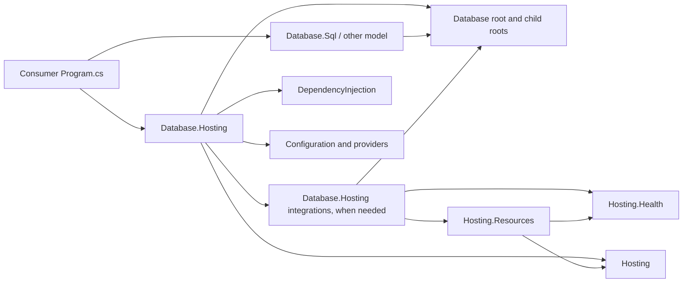

# Phase 29 — Database hosting composition

**Status: implemented with the owner-approved corrections below; acceptance evidence is recorded in §13.**
Branch `feature/L03.02-mvp-engines`, base `18918601`, 2026-09-19. The owner approved Shape A
and the implementation corrections captured in §13. Sections 1–12 preserve the Phase 28 review
record; their proposed signatures and examples are historical wherever §13 supersedes them.
ApplicationModel remains deferred. No commit is made by this implementation phase.

## 1. Decision to review

Recommend **dependency-free Add intent → one-shot Build → use the built engines / Run**.
Do **not** introduce a Database composition method named `Use`. Build creates the engines and
finalizes the services and servers; callers then use ordinary database APIs or run the host.
The useful post-build operation is accessing an engine, not adding a second composition language.
Section 3 presents a viable alternative with a real, optional `UseServer` stage.

Keep the root interfaces free of DI, Configuration, and Hosting. Model verbs capture option
values and factories. The concrete hosting builder additionally accepts a factory receiving
the **built** Cohesion configuration and service provider. That factory executes at Build,
so dependency-aware construction is possible without a feature verb ever touching a container.

The recommendation gives up Web-like spelling and immediate engine returns from model Add
verbs. It gains an unambiguous ownership boundary, a complete application at Build, and the same
simple path for an embedded Document engine and a SQL wire server. Direct
`SqlDatabaseEngine.Create(options)` and the other four standalone factories remain supported.

Approval would select this direction, the ownership changes, and the DI prerequisite in §6.4.
It would **not** authorize ApplicationModel work or make this document an implementation.

## 2. Evidence and architectural boundaries

The governing sources are [resource-areas.md](../../.claude/rules/resource-areas.md),
[general-rules.md](../../.claude/rules/general-rules.md),
[component-integration.md](../../.claude/rules/component-integration.md), and the signed
[developer experience §2 and §4.2](../DEVELOPER_EXPERIENCE_DESIGN.md).
The latter explicitly calls its Database engine/schema sample illustrative. Its commitments
are an ordinary `Program.cs`, concrete `CreateBuilder(args)`, a concrete `Host<TContext>`
application, and hosting-owned integration. O34 supersedes the older text putting `AddService`
on area roots. This proposal preserves those commitments.

### 2.1 What the current code actually does

| Observation | Finding in the working tree | Design consequence |
| --- | --- | --- |
| Database lacks Use | Correct. `IDatabaseApplication` has Context/Start/Stop. | First establish useful behavior; spelling alone is insufficient. |
| AddEngine is eager | Correct. All five model Add verbs create an operational engine, register it, and return it. | Capture factories; transfer ownership only when a factory returns a product. |
| Web AddAuthentication registers deferred intent | Incorrect today. It constructs `AuthenticationService` immediately; `AddFeature(factory)` also invokes its factory immediately. | Use Web as evidence for package placement, not deferred materialization. |
| Web has Add/Build/Use | Its concrete application implements a separate `IWebApplicationPipelineBuilder`. Use folds middleware around **each HTTP request**. Its pipeline Build is later than application Build. | Database has no common five-model request envelope warranting the same pipeline. |
| Builder Engines is observational | It exposes registration state backed by mutable options. Built Database context already snapshots its lists. | Remove builder enumeration; retain runtime observation. |
| Engines list means serverless | Its XML says so, but AddSqlDatabase followed by AddSqlServer leaves that engine in the list. A server-only composition instead reaches its engine through the server. | Make runtime Engines explicitly mean all distinct composed engines. |
| A database needs a listener | False. Documents, Graph and Blob have no server; all engines work directly. | Listenerless composition remains complete and supported. |
| Multi-model composition is new | False. The Database demo directly creates all five engines today. | Leave that path intact; no application required for standalone use. |

The five options types are `SqlDatabaseEngineOptions`, `KeyValueDatabaseEngineOptions`,
`DocumentDatabaseEngineOptions`, `GraphDatabaseEngineOptions`, and `BlobDatabaseEngineOptions`.
Each currently carries `EngineName`, `RootPath` (`FileSystemPath?` in the reviewed working tree),
`Durability`, `GroupCommitWindow`, `CheckpointInterval`, `PageWriteBackInterval`,
`PageWriteBackBatchSize`, and `MaintenanceInterval`. SQL and KeyValue additionally accept
model-specific storage strategies. All five `*DatabaseEngine.Create(options)` factories create
live engines with workers; no engine Start/Stop stage is missing. The SQL forwarding
`SqlDatabaseEngineFactory.Create` does not add deferred behavior.

### 2.2 Package ownership and rules

Arrows in this diagram mean **references**, including proposed hosting-to-infrastructure
references. They do not show execution order.



| Boundary | Required result |
| --- | --- |
| COHRES001 | Root/model packages reference neither exact Database.Hosting nor its integrations. Integrations never reference their exact runtime. No exemption is requested. |
| COHRES002 | Database.Hosting references its root and, if needed, its hosting family; it never references SQL, Documents, Graph, Blob, or KeyValue directly. Consumer-supplied/model-supplied delegates invoke those factories. |
| COHRES003 | No resource package acquires an ApplicationModel.Gateway dependency. |
| COHRES004 | No root/model acquires any Hosting reference, including through DI/config integration. AddService remains concrete-hosting-only. |
| Runtime versus integration family | The exact runtime constructs the application. Feature-aware adapters, if a future need warrants them, belong in the hosting family; this design does not require a new project. |
| Registration rule | “Registration stays dependency-free (values and options objects; no container, no configuration binding).” Model callbacks use model options only. Hosting-aware construction is a separate concrete-builder overload. |

The rule does **not** need relaxation. A parameterless factory captures intent without being a
container interface in disguise. A root factory taking `IServiceProvider`, an arbitrary service
resolver, `IConfiguration`, or a DI registration sink would violate the intent even if the
parameter type came from the BCL. Those variants are rejected.

Changing that rule instead would require the explicit architectural decision described in
[deviations.md](../../.claude/rules/deviations.md), not a local exemption or a quiet reinterpretation.
It would make features responsible for container/configuration integration across every area.
No such change is assumed here; future rule changes must follow the rule's coordinated update
requirements. The existing component-integration generator is also not repurposed: its eager
builder projection does not provide this deferred, ordered application lifecycle.

## 3. Two viable shapes

| Question | A — complete Build (recommended) | B — post-build server attachment |
| --- | --- | --- |
| Consumer shape | Add engines, services, servers; Build; use engines; Run | Add engines/services; Build; optionally UseServer; Start/Run |
| What Use means | No composition Use method | Attach a server to already constructed engines, before first Start |
| Root additions | Owned engine factory; runtime engine lookup; application disposal | Same plus an application activation interface with UseServer |
| Finalization | One composition freeze, at Build | Engine/provider freeze at Build; server/lifecycle freeze at first Start |
| Configuration and DI | Hosting factories run at Build | Hosting factories run at Build; server factories run during Use |
| Embedded models | Complete with no server | Complete without Use; Use cannot be mandatory |
| Failure boundary | Build compensates for construction failure | Build, each Use, and Start each need compensation and state rules |
| Developer benefit | One place to register; deterministic ownership | Server attachment can inspect real engine objects in ordinary post-build code |
| Cost | Callers retrieve engines after Build instead of receiving them from Add | Moves AddServer to a second surface; Build no longer produces a complete lifecycle graph |
| Other areas | Share intent/build/lifetime policy; specialize execution | Every area must justify its own activation surface; no universal database-style Use |

B is a viable choice if the owner values post-build endpoint decisions. Its minimum root shape
would be the following **alternative only**; it is not added by A:

```csharp
/// <summary>Attaches owned servers before the application's first start.</summary>
public interface IDatabaseApplicationActivationBuilder
{
    /// <summary>Constructs and attaches one server using the final engine registry.</summary>
    /// <param name="factory">A dependency-free factory; invoked once by this call.</param>
    /// <returns>This activation surface.</returns>
    /// <exception cref="ArgumentNullException">The factory is null.</exception>
    /// <exception cref="InvalidOperationException">Start has begun, or the product is invalid.</exception>
    IDatabaseApplicationActivationBuilder UseServer(
        Func<IDatabaseApplicationContext, IDatabaseServer> factory);
}
```

In B, concrete `DatabaseApplication` implements this interface and model extensions provide
`UseSqlServer(string engineName, Action<SqlDatabaseServerOptions> configure)` and the KeyValue
equivalent, returning the activation interface. Each invokes UseServer immediately; no listener
accepts before Start. Successful Use transfers server ownership to the application. Failure
disposes only the unaccepted product and leaves the prior plan intact; the caller remains
responsible for disposing the application. First Start freezes even on failure. AddServer is
removed from the builder in B, not duplicated there. Servers in Context are snapshots after each
successful attachment until first Start, then fixed. No generic UseStartup callback is included:
arbitrary data changes cannot be rolled back by composition.

```csharp
// Alternative B only: a meaningful but optional Use stage.
var builder = DatabaseApplication.CreateBuilder(args);
builder.AddSqlDatabase(o => o.EngineName = "orders");
await using var app = builder.Build();
app.UseSqlServer("orders", o => o.Listen(new Uri("tcp://127.0.0.1:5439")));
await app.RunAsync();
```

A is preferable because today's deferred AddServer factory can already consume the final engine
registry. Moving the same work after Build adds a mutable interval without enabling an otherwise
unavailable database operation. A therefore drops fluent Use explicitly. A wire middleware
pipeline would also miss embedded calls, while an engine-wide interceptor would redesign model
execution. Neither is justified by hosting composition.

## 4. Consumer story for A

These are **proposed** consumer examples, using existing model operations and transport helpers.
The change is when construction happens and who owns the result. Fluent model verbs return
`IDatabaseApplicationBuilder`; retain the concrete `builder` variable for hosting-only verbs and
the concrete Build result. Do not assign a feature-chain result to `var` and then expect RunAsync
on its interface-typed Build result.

### 4.1 SQL with an optional wire server

```csharp
using System;
using System.IO;
using Assimalign.Cohesion.Database;
using Assimalign.Cohesion.Database.Hosting;
using Assimalign.Cohesion.Database.Sql;
using Assimalign.Cohesion.Hosting;

var builder = DatabaseApplication.CreateBuilder(args);
builder.AddSqlDatabase(options =>
{
    options.EngineName = "orders";
    options.RootPath = FileSystemPath.Parse("./data/orders");
});
builder.AddSqlServer("orders", options =>
    options.Listen(new Uri("tcp://127.0.0.1:5439")));

await using var app = builder.Build();
// Use: ordinary engine operations are available now. No composition changes.
IDatabaseEngine orders = app.Context.GetEngine("orders");
Console.WriteLine(orders.Name);
await app.RunAsync();
```

The SQL transport helper is supplied by the existing Database.Sql.Tcp assembly in the
`Assimalign.Cohesion.Database.Sql` namespace. The AddSqlDatabase options callback runs at Add
and its values are copied. AddSqlServer captures
its callback; it runs at Build because Listen creates the listener object. Listening begins at
Start, after additional services. Engine workers begin at Build, in keeping with Create's current
contract. A long pause between Build and Run is therefore a pause with live engine workers.
Omit AddSqlServer for embedded SQL; no alternative engine implementation is necessary.

### 4.2 Documents, entirely in process

```csharp
using System.IO;
using Assimalign.Cohesion.Database;
using Assimalign.Cohesion.Database.Documents;
using Assimalign.Cohesion.Database.Hosting;

var builder = DatabaseApplication.CreateBuilder(args);
builder.AddDocumentDatabase(options =>
{
    options.EngineName = "catalog";
    options.RootPath = FileSystemPath.Parse("./data/catalog");
});

await using IDatabaseApplication app = builder.Build();
await app.StartAsync(); // Drives any hosting services; engines are already operational.
try
{
    IDatabaseEngine catalog = app.Context.GetEngine("catalog");
    // This example creates a fresh logical database on first use.
    // A persistent application chooses OpenDatabaseAsync for an existing database.
    IDatabase database = await catalog.CreateDatabaseAsync("products");
    await using IDatabaseSession session = await database.CreateSessionAsync();
    // Use the model's session/database API here; no server is needed.
}
finally
{
    await app.StopAsync();
}
```

With the shown RootPath the database is file-backed. `CreateDatabaseAsync("products")` is a first-run example, not a schema
or migration policy. An embedded application with no hosting services can use the engine after
Build without Start. A long-lived embedded executable can instead `await app.RunAsync()`;
Run waits for host shutdown even when there are no listeners. Borrowed engine/database references
must not outlive the application; sessions remain caller-owned and are closed before app disposal.

### 4.3 Two models, one application

```csharp
using System;
using Assimalign.Cohesion.Database.Documents;
using Assimalign.Cohesion.Database.Hosting;
using Assimalign.Cohesion.Database.Sql;
using Assimalign.Cohesion.Hosting;

var builder = DatabaseApplication.CreateBuilder(args);
builder.AddSqlDatabase(o => o.EngineName = "orders");
builder.AddDocumentDatabase(o => o.EngineName = "catalog");
builder.AddSqlServer("orders", o => o.Listen(new Uri("tcp://127.0.0.1:5439")));

await using var app = builder.Build();
var orders = app.Context.GetEngine("orders");
var catalog = app.Context.GetEngine("catalog");
await app.RunAsync();
```

There is one provider and one lifecycle host per application, with two independently named
engines. The document engine needs no server. Multiple engines of the **same** model are also
supported by distinct names and separate storage roots. There is no “default engine” chosen by
list position, no switch over EngineModel in hosting, and no cross-engine transaction promise.

An in-process consumer that composes engines directly — a console program holding five
`await using ...Engine.Create(...)` declarations — keeps working unchanged. Requiring a builder for
that case would make the current simple path harder and serves no hosting need.

### 4.4 Configuration and a service enter through hosting

```csharp
using System;
using System.IO;
using Assimalign.Cohesion.Database.Hosting;
using Assimalign.Cohesion.Database.Sql;
using Assimalign.Cohesion.DependencyInjection;
using Assimalign.Cohesion.Hosting;

var builder = DatabaseApplication.CreateBuilder(args);
// Paths is a consumer-owned immutable value, constructed by an explicit DI factory.
builder.Services.AddSingleton<Paths>(_ => new Paths("./data/orders"));

builder.AddEngine("orders", build =>
{
    string path = build.Configuration["Database:Orders:RootPath"]
        ?? build.Services.GetRequiredService<Paths>().Orders;
    return SqlDatabaseEngine.Create(new SqlDatabaseEngineOptions
    {
        EngineName = "orders",
        RootPath = FileSystemPath.Parse(path),
    });
});

await using var app = builder.Build();
await app.RunAsync();

internal sealed record Paths(string Orders);
```

This callback is on `DatabaseApplicationBuilder`, in Hosting. It is not a new overload on the
root interface or the model verb. A consumer can similarly pass an explicitly resolved SQL or
KeyValue storage strategy into that model's existing options, with one owner for that strategy.
Documents/Graph/Blob currently have no such injection parameter; this design does not pretend
their factories can accept services they do not support. Configuration is read by explicit key
assignment, not reflection-based binding. No `Microsoft.Extensions.*` is used.

## 5. Stage, identity, and ownership rules

| Stage | Owns | Must not do |
| --- | --- | --- |
| CreateBuilder | Capture args and hosting settings; prepare default configuration-provider registrations and service registration state | Start engines, start listeners, create a process-global provider |
| Add | Capture option snapshots, names, factories, borrowed instances; register hosting service/configuration intent | Resolve services, bind configuration inside a model verb, start an owned engine/listener |
| Build | Seal registration, load configuration, build provider, construct engines, construct servers and services, snapshot runtime registries, establish ownership | Start listeners or run provisioning; admit concurrent/reentrant Build or late Add |
| Use (ordinary APIs) | Query/update data through engine/database/session contracts; observe runtime composition | Change engine identity, RootPath, durability options, registrations, or host services |
| Start / Run | Start additional host services in order, then servers; Run also waits and stops through IHost | Reconstruct engines/providers, run an operation middleware pipeline |
| Stop | Drain servers first, stop additional services in reverse order | Explicitly dispose borrowed objects or imply that engines have stopped; a borrowed server's own Stop may nevertheless close it terminally |
| Dispose | Stop if needed; dispose owned roots, flush/close owned engines, release provider/configuration | Allow a second owner to dispose the same factory product |

### 5.1 Identity and registry rules

Names are nonempty, case-sensitive (`StringComparer.Ordinal`), stable for one application, and
unique across models. `AddEngine(name, factory)` reserves the name before construction; its
returned `engine.Name` must match exactly. Model verbs use the copied EngineName or the current
defaults: `sql-engine`, `keyvalue-engine`, `document-engine`, `graph-engine`, `blob-engine`.
Adding two default instances of one model fails; callers name them explicitly.

`Context.Engines` contains each distinct engine once: explicit registrations first, in order;
engines referenced only by **borrowed server instances** follow, in server registration order.
The latter are implicitly borrowed to preserve existing manual composition. Build pre-scans all
borrowed server registrations and options.Servers before invoking any server factory, so factories
see their engines even when the borrowed server was registered later. The same reference
may appear through multiple servers, but two distinct references may not share a name. A factory
may not return a reference already owned/borrowed under another registration. Duplicate names
known at Add fail there; discoveries from factory results fail Build.

The ownership ledger uses reference identity for all engines, servers, and disposable service
products. A factory returning an already registered owned or borrowed product is rejected before
enrollment: rollback must not newly dispose that reference or dispose it twice. Fresh products
with invalid names/models are enrolled for compensation before validation throws. Opaque aliases
to provider-owned instances cannot generally be detected by this ledger; returning one is a caller
contract violation, not a promised automatic DI ownership check. Duplicate server/service lifecycle
registrations of the same reference are also rejected; a shared engine behind distinct servers is valid.

Owned server factories must front an engine in the completed registry. They cannot introduce a
hidden, untracked engine. Factories receive a read-only build view containing the complete engine
registry; Servers contains already materialized earlier registrations. It becomes a fixed
snapshot before service factories run. `GetEngine(name)` returns a **borrowed** reference; it
throws `KeyNotFoundException` for an unknown name. Model server verbs also validate the concrete
engine model, without reflection. The root does not offer `GetSqlEngine` or typed registries.

### 5.2 One-shot construction and rollback

The first Build attempt consumes the builder **before** invoking any user code. Subsequent Build
calls, including after failure, throw `InvalidOperationException`; no retry, cached return, or
second owner is implied. All registration methods reject calls once Build begins. Recursive or
concurrent Build is rejected. Registration itself is single-threaded.

Construction order is configuration, provider, engines, servers, additional service factories,
then application publication. Runtime **start** order remains additional services, then servers;
creation order and start order are deliberately different. Existing telemetry, when enabled,
remains the first additional service so it stops last. Prevalidate names and option values
before constructing where possible. Build never silently deletes files created by a factory.

Until a successful Build returns, the builder owns each successfully returned factory product.
On failure it attempts cleanup in reverse dependency order: owned services, servers, engines,
provider, configuration, and the hosting-created configuration file system. A factory that throws before returning owns its partial allocations.
Feature factories must therefore clean up a listener if options configuration or server creation
fails before returning the server. Borrowed objects are never disposed by rollback.

Build remains synchronous. Engines offer synchronous Dispose, but servers may only offer async
disposal. The implementation must complete compensation before throwing, with an internal
async cleanup path bridged from a worker without capturing the caller's synchronization context.
This can block; no `BuildAsync` is added solely for symmetry. Preserve the original construction
exception; if cleanup also fails, report an `AggregateException` with the original first and
cleanup failures in attempt order. A successful Build transfers the ownership ledger exactly
once to the application. The synchronous build trade-off should be accepted explicitly.

### 5.3 Ownership ledger

| Registration | Construction | Disposal owner |
| --- | --- | --- |
| Root AddEngine(instance) / options.Engines | Before Add | Caller; application borrows |
| Root AddEngine(name, factory) | Build | Application after successful Build; builder during rollback |
| Hosting AddEngine(name, build-aware factory) | Build, after config/provider | Same application ownership |
| Model Add*Database | Build from copied options | Same application ownership |
| AddServer(instance) / options.Servers | Before Add | Caller; application starts/stops but does not dispose |
| AddServer(factory), model Add*Server | Build | Application; server owns its listener, never its engine |
| AddService(instance) / options.Services | Before Add | Caller; application drives lifecycle only |
| AddService(factory) | Build | Application disposes product if disposable, after stopping it |
| Service-provider factory registration | Per DI lifetime | Provider; not a second application ledger entry |
| Service-provider instance registration | Before provider Build | External owner; current DI does not capture its disposal |

A factory is an ownership transfer, not an alternate way to borrow an instance. Returning a
provider-owned singleton from an application factory would create two owners and is prohibited.
If an engine must also be visible through DI, use an explicit **borrowed instance** registration
when possible, or inject a consumer-owned access abstraction; do not auto-register owned engines
in DI or resolve engines while building the provider. No engine DI discovery is promised.

DisposeAsync is available through `IDatabaseApplication`, not just the concrete host. It is
idempotent, serializes concurrent disposal, and attempts every application-owned root even after
one fails: stop/drain; dispose owned services in reverse creation order; dispose owned servers in
reverse creation order; dispose owned engines in reverse creation order; dispose provider; dispose
configuration; dispose the hosting-created configuration file system. This destruction order differs
from Stop order: service factories receive the final context and can retain servers, so services
must be destroyed before those dependencies. Server factories cannot depend on later lifecycle-service
factory products. Provider and configuration outlive every application product that may use them. Engine disposal retains its
current durable-flush promise; caller-owned sessions must have ended first.

Borrowing a server promises no explicit application-owned Dispose call, not reuse after Stop:
SQL/KeyValue Stop terminally closes the server and its listener even when the server is borrowed.
Stop does not dispose engines. Current SQL/KeyValue server Stop is terminal, so a Database
application is specified as **one start lifecycle**, even though the generic host can restart.
A second Start after stopping or a failed start is rejected consistently for embedded and wire
applications. A repeated Start while already started retains the host's no-op behavior; a Stop
before the first Start does not consume the start attempt. Concurrent Start/Stop/Dispose calls
are unsupported: the owner must await startup/shutdown before disposing. Concurrent disposal
calls alone are serialized. Stop and Dispose are safe to repeat. Start failure stops services/servers already started;
the caller's `await using` still disposes the built application's owned roots. No automatic engine
recreation is attempted. An embedded consumer needing a fresh host makes a fresh builder.

The implementation uses the existing protected virtual `Host<TContext>.DisposeAsync(bool)` hook
and the protected `OnStartingAsync` hook for a Database start-attempt guard that applies through
both `IHost` and `IDatabaseApplication` (including RunAsync's internal start path); hiding a
concrete Start method is insufficient. Base disposal alone only stops the host. Best-effort cleanup
here is a guarantee across application-owned roots, not a claim that today's DI/config internals
continue after every one of their own child disposals fails (§10).

## 6. Where Configuration, DI, and Hosting enter

### 6.1 Configuration

The concrete builder owns a Cohesion `IConfigurationBuilder` registration surface. The proposed
default sources, loaded at Build, are optional `appsettings.json`, optional
`appsettings.{Environment}.json`, environment variables, then the captured command-line args;
later providers win. The environment-variable prefix is `COHESION_CONFIG__`, matching Web's
existing configuration convention. Explicit providers added through `builder.Configuration` follow the defaults
and override them. Relative configuration file paths resolve against the host content root,
falling back to `AppContext.BaseDirectory` when none is supplied. Environment
selection uses the hosting environment; Local uses `appsettings.Local.json`, with no alias to
Development. Preserve the existing host environment default when none is supplied; this is not
a new environment-selection algorithm. Args are copied at CreateBuilder, not retained as a mutable caller array.

This is a **new behavior**: current Database CreateBuilder(args) does not parse its args into
configuration. Use the repo's Configuration.Json, Configuration.EnvironmentVariables, and
Configuration.CommandLine providers, plus the existing file-system abstraction. No Microsoft
configuration stack is substituted. Hosts must register provider factories so abandoning a
builder does not leave owned file watchers running. Any already-created provider explicitly
supplied by a consumer retains the existing Configuration builder ownership semantics; such
advanced callers must account for abandonment themselves.

At Build, Hosting creates the file-system instance needed by the default JSON providers and owns
it separately: provider disposal does not transfer ownership of or dispose an injected IFileSystem.
Release that instance after configuration, including on failed Build. Consumer-supplied provider
dependencies remain under their own documented ownership. No public file-system composition
abstraction is added here.

The hosting configuration registration facade rejects standalone Build/BuildAsync and rejects
AddProvider after application Build begins. Only application Build materializes and owns this
configuration; otherwise the exposed infrastructure builder would permit a second, untracked
provider set. This is a hosting facade over the existing interfaces, not a changed global
IConfigurationBuilder contract.

Model options are mapped explicitly in the hosting callback. There is no implicit
`Database:<model>` binder or default storage path: an absent RootPath still selects in-memory
storage. Bad configured scalar values fail with the key/name identified. Configuration writes
or reloads after Build cannot rebind an engine. Existing IConfiguration is mutable; exposing it
does not make the application registration graph mutable. Default file reload is disabled.

### 6.2 Dependency injection

`builder.Services` is Cohesion `IServiceProviderBuilder`, not Microsoft's service collection.
Its existing `Add(ServiceDescriptor)`, factory AddSingleton/AddScoped/AddTransient extensions,
and `GetRequiredService<T>()` are the intended machinery. Build constructs one provider after
configuration. Hosting registers the built IConfiguration as a borrowed provider instance;
the application retains its disposal owner. Consumer registrations may use configuration from
that provider inside explicit factories. Reserved infrastructure registrations cannot be replaced
silently; duplicate IConfiguration registrations fail before provider construction.

Build-aware engine factories receive the provider. Runtime service factories receive the final
concrete application context, which gains Configuration and Services. The root context gains
neither. Scoped services cannot be captured by a root-owned engine; use a singleton dependency
or create/dispose scopes within actual work. Database enables scope validation. DI descriptors
are frozen for this application at Build; attempts to add through the retained hosting registration
facade, including its Container, are rejected. The facade's standalone Build is rejected: the
application Build owns provider creation. Raw mutable HostOptions are copied rather than exposed
as runtime state.

### 6.3 Host seam and process topology

The concrete application remains `Host<DatabaseApplicationContext>`. Its concrete context remains
`HostContext` and `IHealthContributor`; Engines/Servers provide the root's observational view.
`RunAsync`, `Run`, and `AsService` remain the existing `extension(IHost)` APIs in Hosting.
`IHostRunner` wraps a complete run; `IHostRun` supplies a one-shot start/wait/stop lifecycle.
Neither is a query interceptor or a reason to add Database.Use. Do not install a competing runner
or bypass `HostContext.Runner`.

Plain Hosting still references neither Hosting.Health nor Hosting.Resources. Health depends on
Core; Resources depends on plain Hosting, Health, Core and ProtectedData. Existing resource-aware
hosting integration remains an implementation boundary, not a newly designed surface here.
Preserve its existing runner installation when applicable. There is no new manifest, graph verb,
resource command, control plane, or ApplicationModel dependency in this proposal.

Each application owns its own config/provider/registrations; none are process-global. The same
Program can run as an OS process or be invoked in process, and an ordinary host can compose the
built Database application through `app.AsService()`. The outer host owns lifecycle; the owner
of the inner `app` still disposes it. A wire server is optional in either topology. Environment
variables are ordinary process configuration inputs, not a new per-application isolation mechanism;
callers needing different values in one process supply per-builder providers/options.

### 6.4 AOT and a prerequisite the current DI cannot satisfy yet

Keep `IsAotCompatible=true`. Use direct factories, closed generic service registrations, ordinary
type checks/casts, and handwritten option mapping. No reflection-based binding/constructor
activation, assembly scanning, dynamic loading, or runtime code generation is permitted for this
path. ConfigurationBinder.Get/Bind currently carries RequiresDynamicCode and
RequiresUnreferencedCode; it is unsuitable.

The existing DI provider chooses a dynamic resolver on JIT and may compile scoped/transient
resolution after repeated calls. NativeAOT selects its runtime resolver, but that alone does not
meet the stronger “no runtime code generation” requirement in this task. There is currently no
switch: ServiceProviderOptions has only ValidateScopes and ValidateOnBuild.

**Required prerequisite, proposed in the existing DI library; not implemented by Phase 28:**

```csharp
// Addition to Assimalign.Cohesion.DependencyInjection.ServiceProviderOptions
/// <summary>Allows resolver compilation when the runtime supports dynamic code.</summary>
/// <remarks>
/// Defaults to true for existing callers. False selects only the interpreted runtime resolver;
/// it must never schedule expression or IL compilation. It does not make constructor-activation
/// descriptors reflection-free. Database hosting always supplies false.
/// </remarks>
public bool EnableDynamicCode { get; set; } = true;
```

This is shared infrastructure policy used by every hosting area requiring that guarantee, not
a Database-specific resolver. Hosting also rejects implementation-type/open-generic activation
descriptors for this composition path, allowing explicit closed factories and instances only.
Do not ship the DI-aware recommendation while claiming these guarantees without that prerequisite
and a JIT as well as NativeAOT verification. No exception to the AOT rule is requested.

## 7. Exact recommended public surface

The contracts below specify the composition delta and all members of affected root interfaces.
Unchanged domain interfaces are inventoried member by member in §8.2; they acquire no new
members. Bodies are omitted intentionally. Null arguments throw ArgumentNullException;
blank names throw ArgumentException. Registration members throw InvalidOperationException once
Build begins. Factories returning null, mismatched names/models, or detectable ownership collisions
fail Build. Opaque provider ownership violations remain caller errors as explained in §5.1;
there is no reflection or container-ownership introspection.
These common rules apply to every registration signature below.

### 7.1 Database root

```csharp
/// <summary>Collects dependency-free intent for one database application.</summary>
public interface IDatabaseApplicationBuilder
{
    /// <summary>Registers an already constructed engine, borrowed for the application's lifetime.</summary>
    /// <param name="engine">The engine; its caller remains the disposal owner.</param>
    /// <returns>This builder.</returns>
    IDatabaseApplicationBuilder AddEngine(IDatabaseEngine engine);

    /// <summary>Reserves an engine name and defers owned construction until Build.</summary>
    /// <param name="name">The unique, ordinal engine name; must match the factory result's Name.</param>
    /// <param name="factory">Invoked once during the first Build attempt; must return a new engine.</param>
    /// <returns>This builder.</returns>
    IDatabaseApplicationBuilder AddEngine(string name, Func<IDatabaseEngine> factory);

    /// <summary>Registers a borrowed server whose lifecycle this application will drive.</summary>
    /// <param name="server">The caller-owned server; its engine is borrowed if not registered.</param>
    /// <returns>This builder.</returns>
    IDatabaseApplicationBuilder AddServer(IDatabaseServer server);

    /// <summary>Defers owned server construction until all engines have been constructed.</summary>
    /// <param name="factory">Receives the complete engine registry and preceding servers.</param>
    /// <returns>This builder.</returns>
    IDatabaseApplicationBuilder AddServer(Func<IDatabaseApplicationContext, IDatabaseServer> factory);

    /// <summary>Consumes this builder, constructs owned products, and freezes composition.</summary>
    /// <returns>An application with live engines and servers that have not started listening.</returns>
    /// <exception cref="InvalidOperationException">Build was already attempted or composition is invalid.</exception>
    /// <exception cref="AggregateException">Construction failed and compensation also failed.</exception>
    IDatabaseApplication Build();
}

/// <summary>A database composition with explicit lifecycle and ownership.</summary>
/// <remarks>DisposeAsync stops the application and releases owned products; borrowed products are not explicitly disposed. Stopping a borrowed server may still close it terminally.</remarks>
public interface IDatabaseApplication : IAsyncDisposable
{
    /// <summary>Gets the fixed runtime registry. Its objects retain their own operational state.</summary>
    IDatabaseApplicationContext Context { get; }

    /// <summary>Starts services, then servers, for this application's sole start lifecycle.</summary>
    /// <param name="cancellationToken">Bounds startup.</param>
    /// <returns>A task completing when the application has started.</returns>
    Task StartAsync(CancellationToken cancellationToken = default);

    /// <summary>Drains servers, then stops services; it does not dispose engines.</summary>
    /// <param name="cancellationToken">Bounds graceful shutdown.</param>
    /// <returns>A task completing when shutdown attempts finish.</returns>
    Task StopAsync(CancellationToken cancellationToken = default);
    // Inherited: ValueTask IAsyncDisposable.DisposeAsync(), with §5.3 semantics.
}

/// <summary>Observes a completed database composition without exposing its registration machinery.</summary>
public interface IDatabaseApplicationContext
{
    /// <summary>Gets all distinct engines in composition order, including server-fronted engines.</summary>
    IReadOnlyList<IDatabaseEngine> Engines { get; }

    /// <summary>Gets the servers in registration order; empty for an embedded application.</summary>
    IReadOnlyList<IDatabaseServer> Servers { get; }

    /// <summary>Retrieves a borrowed engine by its ordinal name.</summary>
    /// <param name="name">The registered engine name.</param>
    /// <returns>The same engine instance used by this application.</returns>
    /// <exception cref="KeyNotFoundException">No engine has that name.</exception>
    IDatabaseEngine GetEngine(string name);
}
```

| Member | Why it belongs on a shared seam |
| --- | --- |
| AddEngine(instance) | Embedded integrations, custom composition roots, and tests can retain external ownership. |
| AddEngine(name, factory) | All five model verbs and custom engines need deferred owned construction. |
| AddServer(instance) | Independently composed transports/custom hosts need a borrowing path. |
| AddServer(factory) | SQL and KeyValue both need final engines; third-party servers need the same boundary. |
| Build | Every consumer needs a single publication/ownership boundary. |
| Context | Embedded callers, servers, health, and services observe the same composition. |
| StartAsync / StopAsync | Embedded and custom hosts can drive lifecycle without referencing Hosting. |
| IAsyncDisposable | Every owner must close engines through the interface, even without a listener. |
| Context.Engines / Servers | Diagnostics and hosting integrations observe actual runtime products. |
| GetEngine | Server factories, embedded consumers, and named provisioning need stable identity without list scans or order coupling. |

No builder Engines, service locator, configuration property, middleware contract, registration
descriptor hierarchy, engine handle type, ownership enum, or area-owned host-service interface
is introduced on the root.

### 7.2 Hosting surface

The following are **all additions and affected concrete composition signatures**. Existing
inherited Host/HostContext APIs remain inherited; the root is not made an IHost.

```csharp
// In Assimalign.Cohesion.Database.Hosting; public getters, internal construction.
/// <summary>Final infrastructure available while constructing an owned engine.</summary>
/// <remarks>Contains no engine registry, preventing dependency on partly constructed engines.</remarks>
public sealed class DatabaseApplicationBuildContext
{
    /// <summary>Gets the configuration loaded for this application.</summary>
    public IConfiguration Configuration { get; }
    /// <summary>Gets this application's provider; resolving a service does not transfer its ownership.</summary>
    public IServiceProvider Services { get; }
}

// Members of existing DatabaseApplicationBuilder (sealed; implements the root builder).
/// <summary>Gets configuration provider registrations; application Build loads them once.</summary>
public IConfigurationBuilder Configuration { get; }
/// <summary>Gets service registrations; only application Build creates their provider.</summary>
public IServiceProviderBuilder Services { get; }
/// <summary>Registers an owned engine factory that can read final hosting infrastructure.</summary>
/// <param name="name">The reserved engine name.</param>
/// <param name="factory">Invoked once at Build, after configuration/provider creation.</param>
/// <returns>This concrete builder.</returns>
public DatabaseApplicationBuilder AddEngine(
    string name, Func<DatabaseApplicationBuildContext, IDatabaseEngine> factory);

/// <summary>Registers existing compiled-schema provisioning against a named engine.</summary>
/// <param name="engineName">The engine resolved at Build.</param>
/// <param name="schema">The existing immutable compiled schema.</param>
/// <returns>This concrete builder.</returns>
public DatabaseApplicationBuilder Provision(string engineName, CompiledSchema schema);
/// <summary>Registers the existing before-accept database provisioner by engine name.</summary>
/// <param name="engineName">The engine resolved at Build.</param>
/// <param name="name">Must equal schema.Name.</param>
/// <param name="schema">The existing model-compiled schema.</param>
/// <returns>The same compiled schema.</returns>
public CompiledSchema AddDatabase(string engineName, string name, CompiledSchema schema);

// Members of existing DatabaseApplicationContext : HostContext,
// IDatabaseApplicationContext, IHealthContributor.
/// <summary>Gets this application's loaded configuration; changes cannot recompose engines.</summary>
public IConfiguration Configuration { get; }
/// <summary>Gets this application's provider, borrowed until application disposal.</summary>
public IServiceProvider Services { get; }
/// <summary>Returns the registered engine without transferring ownership.</summary>
/// <param name="name">The ordinal registered name.</param>
/// <returns>The registered engine.</returns>
public IDatabaseEngine GetEngine(string name);
```

BuildContext is a sealed, immutable pair of existing infrastructure contracts, not a new service
abstraction. Both configuration-driven and service-driven engine construction need it. Concrete
context properties serve lifecycle-service factories and host consumers without contaminating the
root. Named Provision/AddDatabase only adapt an existing seam to deferred engines; they introduce
no schema or migration behavior.

For completeness, the concrete builder retains these exact existing members and adds the
parameterless root factory forwarding overload with concrete fluent returns:

```csharp
public DatabaseApplicationBuilder(DatabaseApplicationOptions options);
public DatabaseApplicationOptions Options { get; }
public IReadOnlyList<CompiledSchema> Schemas { get; }
public DatabaseApplicationBuilder AddEngine(IDatabaseEngine engine);
public DatabaseApplicationBuilder AddEngine(string name, Func<IDatabaseEngine> factory);
public DatabaseApplicationBuilder AddServer(IDatabaseServer server);
public DatabaseApplicationBuilder AddServer(Func<IDatabaseApplicationContext, IDatabaseServer> factory);
public DatabaseApplicationBuilder AddService(IHostService service);
public DatabaseApplicationBuilder AddService(Func<DatabaseApplicationContext, IHostService> factory);
public DatabaseApplicationBuilder AddHealthCheck(string name, ResourceHealthCheck check);
public DatabaseApplicationBuilder Provision(IDatabaseEngine engine, CompiledSchema schema);
public CompiledSchema AddDatabase(IDatabaseEngine engine, string name, CompiledSchema schema);
public DatabaseApplication Build();
```

Root members explicitly forward to these concrete returns. Options supplies host scalar settings
and legacy borrowed instance lists; Schemas reports the already registered immutable declarations.
AddService's instance/factory distinction follows §5.3. AddHealthCheck keeps its current purpose
and hosting placement; it creates no new health subsystem. The instance Provision/AddDatabase
overloads remain for borrowed engines; Build verifies membership and model. Their name overloads
resolve and validate at Build; provisioning still executes before accept at Start.

`DatabaseApplication` retains these exact public entry points:

```csharp
public DatabaseApplication(DatabaseApplicationOptions options);
public static DatabaseApplicationBuilder CreateBuilder();
public static DatabaseApplicationBuilder CreateBuilder(string[] args);
public static DatabaseApplicationBuilder CreateBuilder(DatabaseApplicationOptions options);
public override DatabaseApplicationContext Context { get; }
```

The parameterless entry uses empty args; the options entry preserves supplied host settings with
empty args. The legacy direct constructor remains a borrowed-instance composition path; it makes
an application-local default config/provider and applies the same registry and lifetime rules.
It does not accept deferred registrations. Existing public concrete builder construction behaves
the same as the options entry. Retaining these paths avoids unrelated source breaks.

`DatabaseApplicationOptions : HostOptions<DatabaseApplicationContext>` retains public
`IList<IDatabaseEngine> Engines`, `IList<IDatabaseServer> Servers`, and `IList<IHostService> Services`.
These are legacy **borrowed input lists**, copied once at Build/direct construction; changing them
later cannot change the built application. They are not re-exposed as a root registration list.
Inherited environment/timeouts remain; concurrent start/stop remains rejected for Database.
Keeping this advanced concrete compatibility path is a conscious compromise. Removing it can
be evaluated separately if its three mutable lists cease to have real callers.

### 7.3 Model extension surface

The five engine verbs keep their optional options callback parameter and change their return
to the builder. In each model's existing extension container, use C# 14 extension syntax:

```csharp
extension(IDatabaseApplicationBuilder builder)
{
    /// <summary>Captures SQL engine options and registers owned construction at Build.</summary>
    /// <param name="configure">Optional synchronous value configuration, invoked now; copied afterward.</param>
    /// <returns>The supplied builder; no engine has been constructed.</returns>
    public IDatabaseApplicationBuilder AddSqlDatabase(Action<SqlDatabaseEngineOptions>? configure = null);

    /// <summary>Defers SQL server construction for the named SQL engine until Build.</summary>
    /// <param name="engineName">The engine selected from the completed registry.</param>
    /// <param name="configure">Invoked once at Build; configures server options and creates its listener.</param>
    /// <returns>The supplied builder.</returns>
    public IDatabaseApplicationBuilder AddSqlServer(
        string engineName, Action<SqlDatabaseServerOptions> configure);
}
```

The exact corresponding signatures in their existing model packages are:

```csharp
public IDatabaseApplicationBuilder AddKeyValueDatabase(Action<KeyValueDatabaseEngineOptions>? configure = null);
public IDatabaseApplicationBuilder AddDocumentDatabase(Action<DocumentDatabaseEngineOptions>? configure = null);
public IDatabaseApplicationBuilder AddGraphDatabase(Action<GraphDatabaseEngineOptions>? configure = null);
public IDatabaseApplicationBuilder AddBlobDatabase(Action<BlobDatabaseEngineOptions>? configure = null);
public IDatabaseApplicationBuilder AddKeyValueServer(string engineName, Action<KeyValueDatabaseServerOptions> configure);
```

Their XML intent and parameter/return/exception behavior are identical to the respective SQL
engine/server entries. Each engine verb copies all model option values at Add, reserves the
effective name, and registers a parameterless factory; no runtime feature discovery occurs.
Each server verb uses root AddServer(factory), resolves the named engine, validates its model,
and invokes the model's Create. Wrong model/name fails Build before Start.

Copying means a new options object containing every scalar/value property, including path,
durability and cadence; the callback's captured options cannot mutate that copy after Add.
Referenced custom strategies/authenticators are dependencies, not magically deep-cloned objects;
their existing ownership contract applies. Build-aware consumer factories likewise supply a
fresh options object and must not retain it for later mutation. Direct Create semantics are
unchanged. Pre-created listener injection remains possible through manual borrowed-server
composition; the standard deferred server callback should allocate its listener inside the callback.

No engine-instance overload of a model server verb is retained: callers of deferred model
registration use a stable name, while advanced owners already have AddServer(instance/factory).
This avoids two competing model-level ownership conventions. No AddDocumentServer, AddGraphServer,
or AddBlobServer is invented.

## 8. Before/after inventory

### 8.1 Every current composition member

| Current member | Disposition in A | Reason |
| --- | --- | --- |
| IDatabaseApplicationBuilder.Engines | Removed | Live registration state is not a runtime contract. |
| AddEngine(IDatabaseEngine) | Kept; explicitly borrowed | Preserve manual ownership; add a distinct owned factory overload. |
| AddServer(IDatabaseServer) | Kept; explicitly borrowed | Manual transports/custom hosts. |
| AddServer(Func<IDatabaseApplicationContext, IDatabaseServer>) | Kept; explicitly owned | Already the right deferred server boundary. |
| IDatabaseApplicationBuilder.Build() | Kept; strengthened | One attempt; atomic publication and compensation. |
| IDatabaseApplication.Context | Kept | Runtime observation. |
| IDatabaseApplication.StartAsync(token) | Kept; one-lifecycle policy | No false promise of restartable terminal servers. |
| IDatabaseApplication.StopAsync(token) | Kept | Drain/lifecycle distinct from engine disposal. |
| IDatabaseApplicationContext.Engines | Kept; semantics clarified/expanded | All composed engines, not only serverless entries. |
| IDatabaseApplicationContext.Servers | Kept | Frozen runtime server list. |
| DatabaseApplicationBuilder(options) | Kept | Manual concrete configuration compatibility. |
| Builder.Options | Kept; input only | Host scalar options/legacy borrowed lists, never runtime registries. |
| Builder.Schemas | Kept | Existing immutable provisioning declarations. |
| Builder.Engines | Removed | Same reason as root property; use built Context. |
| Builder.AddEngine / both AddServer overloads / Build | Kept forwarding members | Preserve concrete fluent/build returns; new semantics above. |
| Builder.AddService(instance) | Kept; borrowed | O34 concrete hosting-only lifecycle seam. |
| Builder.AddService(factory) | Kept; owned if disposable | Final concrete context is available at Build. |
| Builder.AddHealthCheck(name,check) | Kept | Existing hosting health integration. |
| Builder.Provision(engine,schema) | Kept; name overload added | Existing behavior without forcing early engine construction. |
| Builder.AddDatabase(engine,name,schema) | Kept; name overload added | Six current deferred consumers migrate by name. |
| DatabaseApplication(options) | Kept | Legacy borrowed composition; no new deferred direct constructor. |
| CreateBuilder() / CreateBuilder(args) / CreateBuilder(options) | Kept | Canonical DX and manual callers; args now feed config. |
| Concrete application.Context | Kept | Covariant host context. |
| Concrete context.Environment / HostedServices | Kept | Existing HostContext contract; stable composition. |
| Concrete context.Engines / Servers | Kept; root semantics above | Observational lists. |
| Concrete context.Name / CheckAsync(token) | Kept | Existing health contribution; enumerate each engine once. |
| ApplicationOptions.Engines / Servers / Services | Kept as copied borrowed inputs | Avoid unrelated manual-construction migration. |
| AddSqlDatabase / AddKeyValueDatabase / AddDocumentDatabase / AddGraphDatabase / AddBlobDatabase | Return changed to IDatabaseApplicationBuilder; construction moved to Build | Intent cannot also return a live product. |
| AddSqlServer(engine,configure) / AddKeyValueServer(engine,configure) | Engine parameter changed to name; return changed to builder; construction moved to Build | Refer to deferred engines without model knowledge in hosting. |
| Five Engine.Create(options) and existing options members | Kept unchanged | Standalone composition remains first-class. |

New members are precisely the two factory AddEngine overloads (root/concrete hosting-aware),
context GetEngine, inherited root application IAsyncDisposable, Configuration/Services on the
concrete builder and context, BuildContext, and the two named provisioning overloads. The DI option in §6.4 is
an explicitly separate prerequisite. No old member is quietly moved to an ApplicationModel API.

### 8.2 Other root abstractions: every member retained unchanged

The review covered all files under Database `src/Abstractions`. These are engine/domain/server
execution contracts, not missing hosting composition seams. All listed members are **kept**, with
their existing parameter types, return types, and default cancellation tokens; no move or rename:

| Interface | Members retained | Why |
| --- | --- | --- |
| IDatabaseEngine | Name; Model; State; Workers; CreateDatabaseAsync(name,token); OpenDatabaseAsync(name,token); DropDatabaseAsync(name,token); GetDatabasesAsync(token); TryGetDatabase(name,out database); inherited IDisposable.Dispose and IAsyncDisposable.DisposeAsync | Already supports create/use/dispose, all models, and observation. |
| IDatabaseEngineWorker | Name; Kind; Interval | Scheduling belongs inside the engine, not the host. |
| IDatabaseServer | Context; StartAsync(token); StopAsync(token); inherited DisposeAsync | The existing per-model transport lifecycle is sufficient. |
| IDatabaseServerContext | Engine; Sessions | Server-to-engine relationship remains explicit. |
| IDatabaseServerSession | Id; ProtocolVersion; Principal; DatabaseSession; inherited DisposeAsync | Authentication/session semantics are outside composition. |
| IDatabase | Name; Engine; CreateSessionAsync(token); inherited Dispose and DisposeAsync | Logical database operations are unchanged. |
| IDatabaseSession | Database; State; CurrentTransaction; BeginTransactionAsync(token); BeginTransactionAsync(isolationLevel,token); ExecuteAsync(QueryRequest,token); ExecuteAsync(statement,parameters,token); inherited DisposeAsync | No five-model middleware or execution redesign. |
| IDatabaseTransaction | Id; State; IsolationLevel; CommitAsync(token); RollbackAsync(token); inherited DisposeAsync | Transaction semantics are not hosting lifecycle. |

## 9. Migration inventory and acceptance plan

Counts below are literal live C# invocation sites in this repository's working tree, excluding
bin/obj, `_out`, `_hold`, and this proposal. Definitions/forwarders, assertions, and markdown are
counted separately. Re-run the inventory when implementation starts; concurrent branch work may
change it. “No forced edit” means the source still expresses the same ownership, not that tests
can be skipped.

### 9.1 Consumer calls that change

Paths in the first seven rows are relative to `resources/Database/`.

| File | Engine Add calls | Server Add calls | AddDatabase calls |
| --- | ---: | ---: | ---: |
| Assimalign.Cohesion.Database.Sql/tests/SqlDatabaseApplicationBuilderTests.cs | 3 | 1 | 0 |
| Assimalign.Cohesion.Database.KeyValuePair/tests/KeyValueApplicationBuilderTests.cs | 3 | 1 | 0 |
| Assimalign.Cohesion.Database.Documents/tests/DocumentApplicationBuilderTests.cs | 1 | 0 | 0 |
| Assimalign.Cohesion.Database.Graph/tests/GraphApplicationBuilderTests.cs | 2 | 0 | 0 |
| Assimalign.Cohesion.Database.Blob/tests/BlobApplicationBuilderTests.cs | 1 | 0 | 0 |
| Assimalign.Cohesion.Database.KeyValuePair.Client/tests/KeyValueApplicationEndToEndTests.cs | 1 | 1 | 0 |
| Assimalign.Cohesion.Database.Testing/fixtures/Assimalign.Cohesion.Database.SampleHost/Program.cs | 1 | 1 | 1 |
| tooling/templates/Assimalign.Cohesion.Templates/src/content/cohesion-database/Program.cs | 1 | 1 | 1 |
| tooling/templates/Assimalign.Cohesion.Templates/src/content/cohesion-app/Acme.Database/Program.cs | 1 | 1 | 1 |
| tooling/templates/Assimalign.Cohesion.Templates/src/content/cohesion-landing-zone/Zones/AppA/Example.AppA.Database/Program.cs | 1 | 1 | 1 |
| tooling/templates/Assimalign.Cohesion.Templates/src/content/cohesion-landing-zone/Zones/AppB/Example.AppB.Database/Program.cs | 1 | 1 | 1 |
| tooling/templates/Assimalign.Cohesion.Templates/src/content/cohesion-landing-zone/Zones/AppC/Example.AppC.Database/Program.cs | 1 | 1 | 1 |
| **Total: 12 files** | **17** | **9** | **6** |

Thus **26 model-verb calls plus 6 named-provisioning argument changes = 32 existing consumer
invocations changed in 12 files**. Four additional test arrangements in two other files change
under the identity/membership rules (§9.2). Sixteen engine calls currently consume the returned engine; the seventeenth
is Graph's expected-failure expression and needs a semantic rewrite. Replace engine `await using`
declarations in owned-builder paths with application ownership; retrieve engines after Build only
where work needs them. Use names in server and provisioning registration.

### 9.2 Implementers and semantic assertions

| Change set | Count / exact location |
| --- | --- |
| Root builder implementers | 6: production Database.Hosting builder and 5 model-test recording builders. SQL/KeyValue have `tests/TestObjects/RecordingApplicationBuilder.cs`; Documents/Graph/Blob have nested RecordingBuilder in the test files above. Each implements owned deferred registration; root Engines disappears. |
| Feature forwarding call sites | 7, separate from consumers: 5 AddEngine calls and 2 AddServer calls across the five model `*DatabaseApplicationExtensions.cs` files. SQL/KeyValue files are under `src/Extensions/`; Documents/Graph/Blob files are directly under `src/`. |
| Public model declarations | 7 changed signatures in those same five files (5 return changes; 2 return/parameter changes). |
| Builder enumeration assertions | 1 root-interface read in Database.Hosting/tests/DatabaseApplicationBuilderTests.cs; 8 fake-specific builder.Engines reads in the already counted model tests. Test fakes may retain private recording state but must assert deferred factories, not live engine allocation. |
| Context semantics assertion | 1 in Database.Hosting/tests/DatabaseApplicationTests.cs: server-only context currently expects Engines empty. It now contains the borrowed fronted engine. |
| Additional identity/membership test arrangements | 4 in 2 files under Database.Hosting/tests. In DatabaseApplicationBuilderTests: `AddServer_WithDeferredFactory_ShouldResolveAgainstFinalContext` must front the registered engine; `AddServer_MultipleRegistrations_ShouldComposeAllInOrder` must have the factory server share the known engine or explicitly register its engine; `Provision_WhenOpenFailsForAnotherReason_ShouldPropagate` must register its engine. In DatabaseApplicationTests: `Lifecycle_ServicesAndServers_ShouldStartServersLastAndStopThemFirst` must share one engine or use unique names instead of two distinct default-named engines. These are semantic fixture changes beyond the 32 invocation migrations. |
| Root application/context implementers | Existing concrete DatabaseApplication and DatabaseApplicationContext; no additional in-repo test fakes found. Disposal/lookup are implemented there. |
| Retained low-level calls | 6 AddEngine(instance) calls: 4 BuilderTests, 2 ResourceCommandHostingTests. 9 AddServer calls: 8 BuilderTests (including 3 factories), 1 ResourceControlPlaneHostingTests. Syntax stays; ownership/failure assertions must reflect the table in §5.3. |
| Direct Create consumers | No forced signature changes, including the five-engine demo and model/AOT tests. |

Existing schema/provisioning implementations keep their behavior. Only the way an already
compiled declaration finds its engine changes. No schema migration design is smuggled into this
API migration.

### 9.3 Documentation and CI reach

Eight literal model/server calls in four markdown examples need updating: two each in
`docs/DEVELOPER_EXPERIENCE_DESIGN.md`, Database.Testing/README.md, Database.Sql/docs/OVERVIEW.md,
and Database.Hosting/docs/OVERVIEW.md. Updating the signed design's illustrative example must
record this later approved decision, not rewrite its review history.

Fourteen current markdown files need wording review: the four above; root Database DESIGN and
OVERVIEW; `docs/resources/Database/DESIGN.md`; Blob OVERVIEW; Documents OVERVIEW; Graph DESIGN,
OVERVIEW and its namespace Assembly OVERVIEW; Hosting DESIGN; SQL DESIGN. The historical
DATABASE_PROGRAM_PLAN is a ledger: append a supersession note rather than changing past claims.

**CI gap:** [.github/workflows/tooling-templates.yml](../../.github/workflows/tooling-templates.yml)
has no `resources/**` push or pull-request trigger. A Database-only signature break can stay green
until a later Templates change. The implementation acceptance must explicitly run Templates'
package/instantiate/build tests, including the standalone Database, application, and all three
landing-zone Database programs. Do not rely on automatic path triggers. A later workflow edit
should add the relevant Database paths (or a dependency-aware trigger); this design changes no CI.

After approval, acceptance must cover: all five model registration tests and recording builders;
Database.Hosting construction/lifecycle/health tests; KeyValue client end-to-end; the real Testing
fixture; the template acceptance suite; two distinct models and two engines of one model in one
application; borrowed versus owned disposal; successful and failed second Build; null/throwing
factories, rollback failure and disposal failure; late Add/retained options mutation; listenerless
Run; named server mismatch; startup failure and terminal restart; scope validation; and JIT plus
NativeAOT execution of the strict factory DI path. Re-run COHRES001–004 and framework delivery
checks if implementation adds infrastructure references. This document itself requires link,
inventory, and scope checks, not an implementation build.

## 10. Existing defects and limits not used as design premises

These findings are also recorded in [_out/phase28-NOTES.md](../../_out/phase28-NOTES.md).

- Current Build marks `_isBuilt` late and mutates options while factories run. A factory failure
  leaves partial products and permits a retry; an application-constructor failure can instead
  happen after the flag is set. The proposal replaces that inconsistent behavior.
- Current Add methods allow post-Build mutation that no longer affects frozen runtime registries.
  The proposed guard applies to all registration entry points, not just AddEngine.
- The base Host disposal only stops; the Database server adapter does not call arbitrary server
  DisposeAsync. Real SQL/KeyValue Stop disposes their listener, but that does not satisfy the
  generic ownership contract. The explicit ledger is necessary.
- Options are mutable and engines retain them. Feature registration snapshots protect the hosted
  path; direct Create remains the caller's responsibility, not a reason to redesign all factories.
- SQL/KeyValue server Stop is terminal while the general Host can restart. The proposal states
  one Database lifecycle rather than relying on an incompatible restart assumption.
- Configuration exposes public Dispose/DisposeAsync on its concrete class without implementing
  those interfaces through IConfiguration. Hosting retains the concrete Configuration for cleanup;
  an `as IAsyncDisposable` cast on IConfiguration is not a solution.
- Configuration and DI disposal can stop at the first failing child. This proposal attempts each
  independent application-owned root; it does not promise to fix their internal disposal loops.
  Infrastructure robustness beyond that is separate work.
- Web's eager AddFeature/AddAuthentication, lazy second pipeline Build, and unguarded late Use
  are not a precedent to copy. Its useful request pipeline remains legitimate.

## 11. Adoption beyond Database

The task describes 19 areas. The current `resources/` tree contains **18**: Database, Web and
16 others. The invariant applies to all of them and to a nineteenth/future area; this design does
not invent an area to reconcile that count.

Every area can share: dependency-free intent in root/feature verbs; DI/config only in its
hosting family; one explicit construction/ownership boundary; a concrete host for running;
and post-build composition only when the area has a real execution structure. There is no new
universal `IResourceApplicationBuilder`, descriptor registry, or mandatory Use interface.

| Other area(s) | Adoption |
| --- | --- |
| Web | Keep its meaningful request Use pipeline and separate pipeline interface. Independently align deferred feature construction, ownership, and late-mutation guards; do not remove HTTP middleware to match Database. |
| ConfigurationStore | AddNamespace already captures domain configuration. Materialize it through the same hosting-only final configuration/provider boundary. |
| IdentityHub | AddAudience/AddClient remain value registration. No synthetic Use step. |
| SecretStore | AddSecret's byte snapshot and AddCertificateAuthority options fit intent capture; preserve domain persistence semantics. |
| Scheduler | AddJob/AddScheduleProvider instance seams can distinguish borrowed instances and owned factories, while AddService remains concrete-hosting-only. Scheduler execution is its own domain. |
| ApiManager, EmailHub, EventHub, IoTHub, LoadBalancer, LogSpace, MediaHub, MessageHub, NatGateway, NotificationHub, Rezolvr, VpnGateway | These twelve root builders currently expose Build alone. Adopt lifetime/finalization policy as real features arrive; do not add empty Add or Use surfaces preemptively. |
| Nineteenth/future area | Apply the same dependency and ownership tests; justify its execution-stage API from real behavior. |

This is a policy for future adoption, not a claim that all existing builders are already one-shot.
For example EventHub documents service factories per Build call today. Cross-area implementation
must be separately reviewed and counted. Database is special only in having operational engines
at construction and optional per-model wire servers; its dependency boundaries are ordinary.

## 12. Non-goals and owner decision record

Explicit non-goals: ApplicationModel, orchestration, manifests, resource/control-plane design,
`Add<Area>(...)` graph verbs, deployment/replicas/mount planning, schema migrations, query
interception, cross-engine transactions, new servers for Documents/Graph/Blob, hot replacement
or engine option reload, new projects, and a framework-wide API rollout in this phase.
Existing provisioning is only adapted to named deferred engines; no migration algorithm or
schema policy is specified.

The owner can sign off on the following concrete choices together or request revisions:

1. Select A (no composition Use) or B (optional post-build UseServer); the rest of this document
   specifies A in full.
2. Preserve the dependency-free rule, with build-aware factories confined to the concrete host.
3. Accept model Add return/signature changes and the counted template/fixture migration.
4. Accept factory-owned versus instance-borrowed lifetimes, one Build attempt, one start lifecycle,
   and synchronous Build compensation.
5. Approve the strict DI resolver prerequisite rather than relaxing no-runtime-code-generation.

Until that review is complete, this document and the reading notes are the entire deliverable.

## 13. Phase 29 implementation and approved corrections

The owner selected Shape A: Add intent → one-shot Build → ordinary engine access / Run. No
composition Use method is implemented. The owner's working-tree abstraction changes were retained
and completed rather than reverted. This section supersedes earlier draft signatures, examples,
name-reservation assumptions, and ownership statements where they conflict with the corrections.

### 13.1 Final root and model surface

`IDatabaseApplicationBuilder` exposes exactly `AddEngine(IDatabaseEngine)`,
`AddEngine(Func<IDatabaseApplicationContext, IDatabaseEngine>)`, and `Build()`. The root and concrete
builder no longer expose Engines or AddServer. `IDatabaseApplication` inherits IAsyncDisposable;
its context exposes all engines, flattened servers and ordinal `GetEngine(string)` lookup.
All five concrete engines implement Create/Open/Drop/TryGetDatabase with `DatabaseName`, matching
the approved root change. Existing value-object implicit conversions preserve literal/string callers.

`IDatabaseEngineBuilder` exposes deferred `AddWorker(Func<IDatabaseEngine, IDatabaseEngineWorker>)`,
deferred `AddServer(Func<IDatabaseEngine, IDatabaseServer>)`, and one-shot Build. Model Build creates
the engine, invokes attachment factories against it, and attaches their products. Failed attachment
construction compensates all accepted products. `IDatabaseEngineWorker.Run(CancellationToken)` puts
the existing pump on the interface so an arbitrary factory-produced worker can be scheduled by its
engine; the host does not become a worker scheduler. `IDatabaseEngine.Servers` supplies the necessary
observational seam for hosting to discover nested servers.

Each model supplies an options-bearing interface extending IDatabaseEngineBuilder:
`ISqlDatabaseEngineBuilder`, `IKeyValueDatabaseEngineBuilder`, `IDocumentDatabaseEngineBuilder`,
`IGraphDatabaseEngineBuilder`, and `IBlobDatabaseEngineBuilder`. Each carries EngineName, RootPath
(`FileSystemPath?`), Durability, StorageStrategy, MaintenanceInterval and the existing group-commit,
checkpoint and page-write-back options. No strongly typed worker/server factory overloads were
added: the common engine factory works, and an explicit SQL/KeyValue cast avoids duplicate overload
vocabulary. No production algorithm consumes model options generically; the base earns its place
because worker registration is genuinely model-agnostic. Internal one-shot attachment/compensation
source lives in Database/shared and is compiled through CohesionSharedSource, with no shipped IVT.

The model-package `extension(IDatabaseApplicationBuilder)` members are AddSql, AddDocuments,
AddGraph, AddKeyValue, and AddBlob. Documents uses the existing package's plural noun; KeyValue
uses its existing readable model name despite the historical KeyValuePair assembly name. Each takes
`Action<IDatabaseApplicationContext, I<Model>DatabaseEngineBuilder>` and returns the supplied
application builder. The callback executes at application Build because it receives the construction
context. It may observe earlier engines, never later registrations; private model options freeze at
engine Build. This replaces the draft's Add-time options callbacks/snapshots and eager Add*Database
returns. Arbitrary model factory names are necessarily validated when products return rather than
reserved at Add. The concrete hosting named factory still reserves and validates its declared name.

Each model engine also exposes a public static `CreateBuilder()` returning its model builder interface.
This lets a concrete hosting build-aware factory read final configuration/services, set model options,
attach server factories, and return the built engine without introducing DI into a model package.
It also provides standalone deferred engine composition. No option or strongly typed factory overloads
are added to that entry point.

SQL/KeyValue Add*Server extension members were removed. Their server factories now register on the
model engine builder. Direct Engine.Create(options) and Server.Create(engine, options) remain
supported. There are no synthetic Document/Graph/Blob server classes. To honor the explicit required
StorageStrategy property for every model, Documents/Graph/Blob gain model-local strategy contracts
for create/open/drop/existence/enumeration and matching options properties; their existing default
file/in-memory behavior remains. This completes the approved correction beyond the earlier §4.4
observation that those three models lacked injection seams.

```csharp
var builder = DatabaseApplication.CreateBuilder(args);
builder.AddSql((_, engine) =>
{
    engine.EngineName = "orders";
    engine.RootPath = FileSystemPath.Parse("./data/orders");
    engine.AddServer(value => SqlDatabaseServer.Create(
        (SqlDatabaseEngine)value,
        new SqlDatabaseServerOptions().Listen(new Uri("tcp://127.0.0.1:5439"))));
});
builder.AddDocuments((_, engine) => engine.EngineName = "catalog");
await using var application = builder.Build();
IDatabaseEngine orders = application.Context.GetEngine("orders");
await application.RunAsync();
```

### 13.2 Final construction, ownership and runtime

Hosting builds configuration and one provider before engines, then flattens each engine's Servers
in engine/attachment order before service factories run. The application snapshots servers for
Start/Stop, while each engine owns their disposal. Thus factory-produced engines and their nested
servers belong to the application, and instance-registered engines and their nested servers remain
caller-owned. The application never double-enrolls a server owned by an engine. Legacy Options.Servers
remains a borrowed input path, with its engines implicitly borrowed; it is not an AddServer builder
method. Factory services are application-owned; instance services are borrowed; provider products
remain provider-owned. Cross-role lifecycle aliases and detectable factory/borrowed aliases fail.

Build is consumed before callbacks, including recursive/concurrent/retry attempts. The retained
Configuration and Services/Container facades reject mutation and independent materialization.
Raw options are copied. Owned products are compensated on any failed Build; synchronous cleanup
bridges async disposal on a worker without capturing the caller's synchronization context. Original
construction exceptions remain first when cleanup failures require aggregation. No factory-created
files are silently deleted.

The default provider precedence and environment rules are §6.1 as approved. Public
`DatabaseApplicationOptions.ContentRootPath` enables ordinary hosts to select their configuration
root. Hosting explicitly handles Configuration's concrete DisposeAsync member, because IConfiguration
does not inherit a disposal interface. The provider, configuration and physical file system outlive
owned services and engines. Concurrent application disposal shares one cleanup task and attempts all
independent owned roots. The nested engine design changes the original flat destruction order to
services, then engines in reverse order (each closes its servers before workers/storage), then provider,
configuration and file system. Sessions remain caller-owned.

Database retains Host<DatabaseApplicationContext>, HostContext, IHealthContributor, and the existing
IHostRunner/IHostRun Run seam. Start is guarded through the protected host hook, including interface
and Run paths, so the application supports one start lifecycle. A small general Hosting correction
prevents rollback from stopping services when OnStartingAsync rejected before service startup began;
normal failure compensation after entering service startup remains intact. Existing resource runner,
health, telemetry and admin integration is preserved. No ApplicationModel, manifest, resource command,
control-plane feature, or orchestration verb is added.

### 13.3 DI prerequisite and evidence

ServiceProviderOptions.EnableDynamicCode defaults to true. False chooses RuntimeServiceProviderEngine
before any compiled engine is constructed and cannot queue expression/IL compilation. Database hosting
always passes false with scope and build validation, and rejects implementation-type/open-generic
activation descriptors. This is shared DI policy, with no Database-specific resolver. Explicit closed
factories and instances are the supported hosting path; model registration remains container-free.

JIT tests exercise a real enabled-provider compilation-event positive control, zero compilation events
under false, repeated runtime-resolver execution, scope validation, and ownership. The win-arm64
NativeAOT smoke published and ran 1,024 strict factory resolutions with singleton/scoped lifetime and
disposal checks. The machine's existing VS Installer PATH defect was handled in the publish subprocess;
no repository workaround or architecture exemption was needed. Evidence is retained under `_out/phase29-*`.

The final acceptance commands, results, demo output, complete public API inventory, and exact existing
test-file insertions/deletions are recorded in `_out/PHASE29-REPORT.md`, `_out/PHASE29-PUBLIC-API.md`,
and `_out/PHASE29-TEST-DELTAS.md`. `_out/phase29-ESCALATIONS.md` records whether any escalation remained.
The original CI gap is handled by explicitly running Templates and the package-backed Database.Testing
fixture against freshly packed framework/SDK content rather than trusting the resources path trigger.