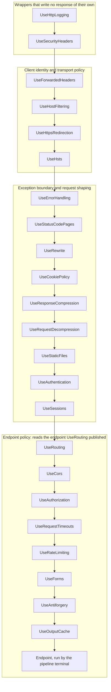

# Web middleware order

Middleware runs in registration order. Each Web package documents its own position, but read one
at a time, five of them claim the front of the pipeline. This page merges those constraints into
one order and says why each middleware goes where it does. The Web NativeAOT guard
([`Program.cs`](../../../resources/Web/Assimalign.Cohesion.Web.Hosting/samples/Assimalign.Cohesion.Web.AotGuard/Program.cs))
registers its middleware in this order.

When a package's ordering constraint changes, update this page in the same commit.

## The order

An application registers the middleware it uses in this order and leaves out the rest. In the
diagram an arrow reads "runs before"; the table gives the reason for each position.

| # | Verb | Package | Why it goes here |
| --- | --- | --- | --- |
| 1 | `UseHttpLogging` | Web.Diagnostics | First, so the exchanges every later middleware rejects are logged too. It writes its entry after the pipeline unwinds, when `UseForwardedHeaders` has already attached the forwarded identity, so running ahead of that middleware loses nothing. |
| 2 | `UseSecurityHeaders` | Web.SecurityHeaders | Ahead of every middleware that writes a response, so rejections, redirects and the boundary's error page all carry the fields. It reads no client identity, so it may run ahead of `UseForwardedHeaders`. |
| 3 | `UseForwardedHeaders` | Web.ForwardedHeaders | Ahead of every middleware that reads the effective scheme, host or client address on the way in. Leave it out when no proxy sits in front of the application. |
| 4 | `UseHostFiltering` | Web.HostFiltering | Validates the effective host, so it follows `UseForwardedHeaders`. It runs ahead of everything that uses the host: the redirect `Location`, absolute URLs, cache keys. |
| 5 | `UseHttpsRedirection` | Web.HttpsPolicy | Redirects a plaintext request before anything does work for it, building the `Location` from the validated host. |
| 6 | `UseHsts` | Web.HttpsPolicy | Ahead of the exception boundary, so the header survives a reset error response. |
| 7 | `UseErrorHandling` | Web.ErrorHandling | The exception boundary: a fault anywhere after it becomes a problem-details response. See "The CORS trade-off" below. |
| 8 | `UseStatusCodePages` | Web.ErrorHandling | Inside the boundary and ahead of the middleware whose bodyless `4xx`/`5xx` responses it fills in, including the `404` and `405` from routing. |
| 9 | `UseRewrite` | Web.Rewrite | Ahead of everything that reads the path (static files, routing, the endpoint), so they all see the rewritten URL; middleware ahead of it, and the server's request telemetry, keep the client's. Inside the boundary and after status-code pages, so a fault in a rule becomes a problem-details response and its `400` gets a body. After `UseForwardedHeaders` and `UseHostFiltering`, so its canonicalization redirects read the client's scheme and a validated host. Inside it, register redirects ahead of internal rewrites. |
| 10 | `UseCookiePolicy` | Web.CookiePolicy | Ahead of every middleware that writes a cookie: sessions, the authentication cookie, antiforgery. Its `Secure` decision reads the effective scheme. |
| 11 | `UseResponseCompression` | Web.Compression | Here when the application does not use output caching. With `UseOutputCache` it moves after the cache (row 23). |
| 12 | `UseRequestDecompression` | Web.Compression | Ahead of every middleware that reads the request body. |
| 13 | `UseStaticFiles` | Web.StaticFiles | Ahead of `UseRouting`, so an existing file is served without routing or authentication. |
| 14 | `UseAuthentication` | Web.Authentication | Anywhere ahead of `UseAuthorization`. In this position, branches and middleware ahead of routing also see `context.User`. |
| 15 | `UseSessions` | Web.Sessions | After `UseCookiePolicy`, which applies the policy to the session cookie. The session loads on first use, so a request that never touches it costs nothing. |
| 16 | `UseRouting` | Web.Routing | Publishes the matched endpoint and calls `next`; the pipeline terminal runs the endpoint. Every middleware after it can read the endpoint. |
| 17 | `UseCors` | Web.Cors | Ahead of every middleware that can reject a preflight. A preflight carries no credentials, so authorization would answer it `401`, a rate limit `429` and antiforgery `400`. |
| 18 | `UseAuthorization` | Web.Authorization | After authentication, and ahead of output caching so an unauthorized request is never served from the cache. |
| 19 | `UseRequestTimeouts` | Web.RequestTimeouts | Ahead of the work it bounds. The rate limiter waits for a permit on the request's cancellation token, so a timeout here also cuts off a request still queued for a permit. |
| 20 | `UseRateLimiting` | Web.RateLimiting | Ahead of the expensive middleware, so excess requests are rejected before any body is read or token decrypted. |
| 21 | `UseForms` | Web.Forms | Optional, because it parses every request. It goes after the limits, so rejected requests are never parsed, and ahead of `UseAntiforgery`, which reuses the parsed form. |
| 22 | `UseAntiforgery` | Web.Antiforgery | After the limits, and inside the timeout so its form read is bounded. |
| 23 | `UseOutputCache` | Web.Caching | After authorization. `UseResponseCompression` comes right after it, so the cache stores and replays the compressed bytes. |

## What fails closed, and what does not

Endpoint metadata that needs a middleware to enforce it fails the endpoint at dispatch when that
middleware is missing or registered ahead of `UseRouting`; the exception names the middleware. This
covers CORS, authorization, request timeouts, rate limiting and antiforgery (Web.Routing DESIGN,
"Endpoint metadata consumers and ordering"). Nothing checks the order of any other two middleware.
A `UseCookiePolicy` registered after `UseSessions`, or a `UseHostFiltering` registered ahead of
`UseForwardedHeaders`, runs without error and quietly weakens what it protects. Enforced ordering
is the open #26/#145 work.

## The CORS trade-off

A fault that propagates through `UseCors` to a boundary registered earlier (row 7) becomes an error
page without CORS headers. A browser then hides the response from a cross-origin caller. An API
whose cross-origin callers must read error responses registers `UseErrorHandling` directly after
`UseCors` instead, which keeps the CORS headers on the error page
(`CorsEndToEndTests.UseCors_ExceptionBoundaryBehindCors_ShouldKeepCorsHeadersOnFault`). The cost:
middleware registered ahead of `UseCors` is then outside the boundary. A response-start hook in the
Web root would remove the trade-off (Web.Cors DESIGN, "Known limit").

## Outside this order

- **The runtime's control plane.** For a resource with orchestration enabled, `Web.Hosting` runs
  the resource control-plane middleware ahead of the application's pipeline and passes every
  other request into it. It is not part of this order.
- **Branches.** `Map`, `MapWhen` and `UseWhen` run after whatever is registered ahead of them. A
  branch registered ahead of `UseRouting` sees no endpoint, and its own pipeline registers any of
  these middleware it needs.
- **Application middleware**, including Web.Query's `UseQueryValidation` and
  `UseQueryConditionals`, goes after the endpoint policy middleware, closest to the endpoint, unless
  it has to answer before one of them.
