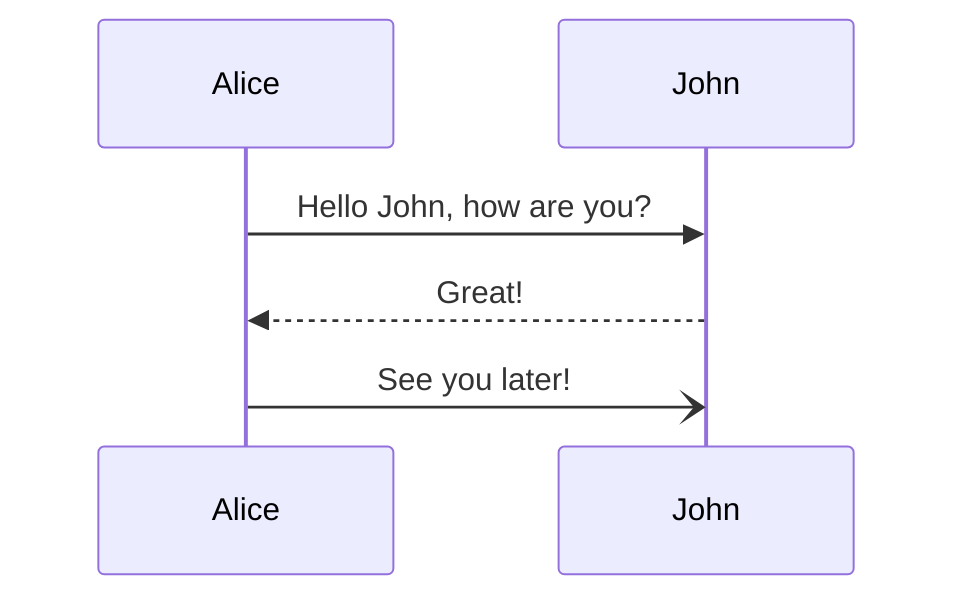

# Overview 

This document outlines the data model for a custom identity provider supporting **B2C** (Business-to-Consumer), **B2B** (Business-to-Business), and **Internal Authentication** scenarios. The design is inspired by Microsoft Entra ID (Azure AD).

## Key Concepts

| Concept | Description |
|---------|-------------|
| **Tenant** | A dedicated instance of the identity service representing an organization |
| **Directory Object** | Base abstraction for all identity objects (users, groups, apps, service principals) |
| **User** | An identity representing a person (internal, B2B guest, or B2C consumer) |
| **Group** | A collection of directory objects for access management |
| **Application** | An app registration defining the identity configuration |
| **Service Principal** | An instance of an application within a tenant (enterprise app) |
| **Identity Provider** | External IdP for federation (e.g., Google, Facebook, SAML/OIDC) |
| **User Flow** | Predefined authentication journeys for B2C scenarios |

## User Types

| Type | Description | Use Case |
|------|-------------|----------|
| `Member` | Internal organizational user | Internal Auth |
| `Guest` | External user invited via B2B | B2B |
| `Consumer` | Self-service registered user | B2C |

---

## Data Model

```mermaid
---
title: "Identity Provider"
config:
  layout: elk
id: affacdf8-9aa3-4121-a6f1-751895a8640d
---
erDiagram 
    Tenants {
        Ulid Id PK "Unique tenant identifier"
        String DisplayName "Tenant name slug"
        Enum Kind "Workforce | Consumer | Both"
        Bool IsEnabled "Whether tenant is active"
        DateTimeOffset CreatedOn
        DateTimeOffset UpdatedOn
    }
    Tenants ||--o{ TenantsObjects : "contains"
    Tenants ||--o{ TenantsIdentityProviders : "configures"
    Tenants ||--o{ TenantsUserFlows : "defines"
    %% Tenants ||--o{ TenantsAuditLogs : "records"
    %% Tenants ||--o{ TenantsSignInLogs : "records"
    %% Tenants ||--o{ TenantsInvitations : "sends"
    %% Tenants ||--o{ TenantsRoles : "has"
    %% Tenants ||--o{ TenantsAuthenticationPolicies : "enforces"
    %% Tenants ||--o{ UsersAttributeDefinitions : "defines"
    
    
    TenantsDomains {
        Ulid Id PK
        Ulid TenantId FK
        String DomainName "e.g., contoso.com"
        Bool IsVerified "Domain ownership verified"
        Bool IsDefault "Primary domain for tenant"
        Enum AuthenticationType "Managed | Federated"
        DateTimeOffset CreatedOn
    }

    TenantsObjects {
        Ulid Id PK "Universal object ID"
        Ulid TenantId FK
        Enum Kind "User | Group | Application | ServicePrincipal"
        DateTimeOffset CreatedOn
        Ulid CreatedBy FK
        DateTimeOffset UpdatedOn
        Ulid UpdatedBy FK
        DateTimeOffset DeletedOn "Soft delete timestamp"
    }
    TenantsObjects ||--o| Users : "represents"
    TenantsObjects ||--o| Groups : "represents"
    TenantsObjects ||--o| Applications : "represents"
    TenantsObjects ||--o| ServicePrincipals : "represents"

    %% TenantsRoles {
    %%     Ulid Id PK
    %%     Ulid TenantId FK
    %%     String Name "A friendly name "
    %%     String Value "Built-in role template ID"
    %%     String Description
    %%     Bool IsBuiltIn
    %%     Bool IsEnabled
    %% }
    %% TenantsRoles ||--o{ TenantsRolesAssignments : "assigned via"
    
    %% TenantsRolesAssignments {
    %%     Ulid Id PK
    %%     Ulid RoleId FK
    %%     Ulid ObjectId FK "User, Group, or ServicePrincipal"
    %%     Enum PrincipalType "User | Group | ServicePrincipal"
    %%     Ulid ScopeId "Resource scope (tenant, app, etc.)"
    %%     Enum ScopeType "Tenant | Application | AdministrativeUnit"
    %%     DateTimeOffset CreatedOn
    %%     DateTimeOffset ExpiresOn "For PIM-style eligible assignments"
    %% }
    %% TenantsRolesAssignments }o--|| TenantsObjects : "to principal"

    TenantsIdentityProviders {
        Ulid Id PK
        Ulid TenantId FK
        String Name UK
        String DisplayName
        Enum ProviderType "OIDC | SAML | Google | Facebook | Apple | Microsoft | GitHub | Custom"
        String ClientId
        String ClientSecretEncrypted
        String Authority "Issuer URL"
        String MetadataUrl "OIDC/SAML metadata endpoint"
        JsonDocument ClaimMappings "Map external claims to internal"
        Bool IsEnabled
        DateTimeOffset CreatedOn
    }

    TenantsUserFlows {
        Ulid Id PK
        Ulid TenantId FK
        String Name UK
        Enum FlowType "SignUpSignIn | SignUp | SignIn | PasswordReset | ProfileEdit"
        String DisplayName
        Bool IsEnabled
        JsonDocument EnabledIdentityProviders "List of IdP IDs"
        JsonDocument UserAttributesToCollect "Attributes collected during signup"
        JsonDocument UserAttributesToReturn "Claims returned in token"
        JsonDocument PageCustomizations "UI customization settings"
        DateTimeOffset CreatedOn
        DateTimeOffset UpdatedOn
    }
    
    %% TenantsAuthenticationPolicies {
    %%     Ulid Id PK
    %%     Ulid TenantId FK
    %%     String Name UK
    %%     String DisplayName
    %%     Bool IsEnabled
    %%     Int Priority "Evaluation order"
    %%     JsonDocument Conditions "Users, Groups, Apps, Locations, Risk"
    %%     JsonDocument GrantControls "MFA, Compliant Device, etc."
    %%     JsonDocument SessionControls "Sign-in frequency, persistence"
    %%     DateTimeOffset CreatedOn
    %%     DateTimeOffset UpdatedOn
    %% }
    
    %% TenantsAuditLogs {
    %%     Ulid Id PK
    %%     Ulid TenantId FK
    %%     Ulid ActorObjectId FK "Who performed action"
    %%     Enum ActorType "User | ServicePrincipal | System"
    %%     String Category "UserManagement | GroupManagement | etc."
    %%     String ActivityType "Add user | Update group | etc."
    %%     Enum Result "Success | Failure"
    %%     String TargetResourceType
    %%     Ulid TargetResourceId
    %%     JsonDocument ModifiedProperties "Before/after values"
    %%     String IpAddress
    %%     String UserAgent
    %%     String CorrelationId
    %%     DateTimeOffset Timestamp
    %% }
    
    %% TenantsSignInLogs {
    %%     Ulid Id PK
    %%     Ulid TenantId FK
    %%     Ulid UserId FK
    %%     Ulid ApplicationId FK
    %%     String UserPrincipalName
    %%     String AppDisplayName
    %%     String IpAddress
    %%     String Location "Geo location"
    %%     String UserAgent
    %%     Enum Status "Success | Failure | Interrupted"
    %%     Int ErrorCode
    %%     String FailureReason
    %%     Bool MfaSatisfied
    %%     String MfaMethod
    %%     Enum RiskLevel "None | Low | Medium | High"
    %%     String CorrelationId
    %%     DateTimeOffset Timestamp
    %% }

    %% TenantsInvitations {
    %%     Ulid Id PK
    %%     Ulid TenantId FK
    %%     String InviteeEmail
    %%     String InviteRedirectUrl
    %%     Ulid InvitedUserId FK "Created user after redemption"
    %%     Enum Status "Pending | Accepted | Expired | Revoked"
    %%     Ulid InvitedBy FK
    %%     DateTimeOffset CreatedOn
    %%     DateTimeOffset ExpiresOn
    %%     DateTimeOffset RedeemedOn
    %% }
    %% TenantsInvitations }o--o| Users : "creates"

    Users {
        Ulid Id PK "The unique user Id"
        Ulid ObjectId FK "Links to TenantsObjects"
        Enum Type "Member | Guest | Consumer"
        String Username UK "user@domain.com"
        String DisplayName
        Bool IsEnabled "Account enabled/disabled"
        %% Bool IsMfaEnabled "MFA requirement"
        Ulid HomeTenantId FK "Original tenant for B2B guests"
        DateTimeOffset LastSignInOn
        DateTimeOffset PasswordLastChangedOn
    }

    Users ||--o{ UsersCredentials : "authenticates with"
    Users ||--o{ UsersSessions : "has"
    Users ||--o{ UsersAttributes : "has"
    %% Users }o--o| Tenants : "home tenant (B2B)"
    
    UsersCredentials {
        Ulid Id PK
        Ulid UserId FK
        Enum CredentialType "Password | PasswordHash | Passkey | ExternalIdp"
        String SecretHash "Hashed password or key"
        String Salt
        Ulid ExternalIdentityProviderId FK "For federated auth"
        String ExternalSubject "External IdP subject claim"
        DateTimeOffset ExpiresOn
        DateTimeOffset CreatedOn
        DateTimeOffset UpdatedOn
    }
    UsersCredentials }o--o| IdentityProviders : "federated via"
    
    UsersSessions {
        Ulid Id PK
        Ulid UserId FK
        String RefreshTokenHash
        String IpAddress
        String UserAgent
        DateTimeOffset CreatedOn
        DateTimeOffset ExpiresOn
        DateTimeOffset RevokedOn
    }
    
    
    UsersAttributes {
        Ulid Id PK
        Ulid UserId FK
        Ulid AttributeDefinitionId FK
        String Value "Stored attribute value"
    }
    UsersAttributes }o--|| UsersAttributeDefinitions : "defined by"
    
    
    UsersAttributeDefinitions {
        Ulid Id PK
        Ulid TenantId FK
        String Name UK "Attribute key name"
        String DisplayName
        Enum DataType "String | Int | Bool | DateTime | StringCollection"
        Bool IsBuiltIn "System vs custom attribute"
        Bool IsRequired
        String DefaultValue
    }    

    Groups {
        Ulid Id PK
        Ulid ObjectId FK "Links to DirectoryObjects"
        String DisplayName
        String Description
        String DynamicMembershipRule "OData filter for dynamic groups"
        Bool IsAssignableToRole "Can be assigned directory roles"
    }
    Groups ||--o{ GroupsMembers : "has"
    Groups ||--o{ GroupsOwners : "owned by"
    

    GroupsMembers {
        Ulid Id PK
        Ulid GroupId FK
        Ulid MemberObjectId FK "DirectoryObject ID (User, Group, ServicePrincipal)"
        Enum MembershipType "Direct | Dynamic"
        DateTimeOffset AddedOn
    }
    %% GroupsMembers }o--|| TenantsObjects : "references"
    
    GroupsOwners {
        Ulid Id PK
        Ulid GroupId FK
        Ulid OwnerObjectId FK
    }
    %% GroupsOwners }o--|| TenantsObjects : "references"

    Applications {
        Ulid Id PK
        Ulid ObjectId FK "Links to DirectoryObjects (UK)"
        Guid AppId UK "Client ID for OAuth"
        String DisplayName
        Enum SignInAudience "SingleTenant | MultiTenant | Consumers | Both"
        String IdentifierUri "App ID URI"
        Bool IsPublicClient "Native/SPA vs confidential"
        JsonDocument WebRedirectUris "Allowed redirect URIs"
        JsonDocument SpaRedirectUris
        String LogoutUrl
    }
    Applications ||--o{ ApplicationsSecrets : "has"
    Applications ||--o{ ApplicationsCertificates : "has"
    Applications ||--o{ ApplicationsApiScopes : "exposes"
    Applications ||--o{ ApplicationsAppRoles : "defines"
    Applications ||--o{ ServicePrincipals : "instantiated as"
    
    ApplicationsSecrets {
        Ulid Id PK
        Ulid ApplicationId FK
        String DisplayName "Secret description"
        String SecretHash "Hashed client secret"
        DateTimeOffset CreatedOn
        DateTimeOffset ExpiresOn
    }
    
    ApplicationsCertificates {
        Ulid Id PK
        Ulid ApplicationId FK
        String Thumbprint UK
        String DisplayName
        Byte PublicKey
        DateTimeOffset NotBefore
        DateTimeOffset NotAfter
    }
    
    ServicePrincipals {
        Ulid Id PK
        Ulid ObjectId FK "Links to DirectoryObjects (UK)"
        Ulid ApplicationId FK "Source app registration"
        Guid AppId FK "Matches Application.AppId"
        String DisplayName
        Bool IsEnabled
        Enum ServicePrincipalType "Application | ManagedIdentity | Legacy"
        String HomepageUrl
        String LoginUrl
        String LogoutUrl
    }
    

    ApplicationsApiScopes {
        Ulid Id PK
        Ulid ApplicationId FK
        Guid ScopeId UK "Unique scope identifier"
        String Value "e.g., User.Read"
        String DisplayName
        String Description
        Enum ConsentType "Admin | User"
        Bool IsEnabled
    }
    
    ApplicationsAppRoles {
        Ulid Id PK
        Ulid ApplicationId FK
        Guid RoleId UK
        String Value "e.g., Admin"
        String DisplayName
        String Description
        JsonDocument AllowedMemberTypes "User | Application | Both"
        Bool IsEnabled
    }
    
    ServicePrincipalsPermissionGrants {
        Ulid Id PK "Delegated permission consent"
        Ulid ServicePrincipalId FK "Client app"
        Ulid ResourceServicePrincipalId FK "API app"
        Ulid ConsentedBy FK "User who consented (null for admin)"
        Enum ConsentType "Principal | AllPrincipals"
        String Scopes "Space-delimited scopes"
        DateTimeOffset CreatedOn
    }
    
    ServicePrincipalsAppRoleAssignments {
        Ulid Id PK
        Ulid ServicePrincipalId FK "Resource service principal"
        Ulid PrincipalId FK "User, Group, or ServicePrincipal"
        Enum PrincipalType "User | Group | ServicePrincipal"
        Guid AppRoleId FK "The assigned role"
        DateTimeOffset CreatedOn
    }
    
    


    %% Tenants ||--o{ TenantsDomains : "has"
    
    
    %% Directory object relationships
    
    
    %% User relationships
    
    
    
    %% Invitation relationships
    
    
    %% Group relationships
    
    
    
    %% Application & Service Principal relationships
    
    
    ServicePrincipals ||--o{ ServicePrincipalsPermissionGrants : "granted to"
    ServicePrincipals ||--o{ ServicePrincipalsAppRoleAssignments : "assigned"
    
    %% Role relationships
    
    
    %% App role assignments reference app roles
    ServicePrincipalsAppRoleAssignments }o--|| ApplicationsAppRoles : "assigns"
```

<!-- Reference: https://mermaid.js.org/syntax/entityRelationshipDiagram.html -->


---



## Entity Descriptions

### Core Entities

| Entity | Purpose |
|--------|---------|
| `Tenants` | Root container representing an organization/directory |
| `TenantsDomains` | Custom or verified domains associated with a tenant |
| `DirectoryObjects` | Base table for polymorphic identity objects |

### Identity Entities (Users)

| Entity | Purpose |
|--------|---------|
| `Users` | User accounts (Member/Guest/Consumer types) |
| `UsersCredentials` | Authentication credentials (passwords, external IdP links) |
| `UsersSessions` | Active refresh token sessions |
| `UsersAttributes` | Custom user attributes (extension properties) |
| `AttributeDefinitions` | Schema definitions for custom attributes |
| `Invitations` | B2B guest invitation records |

### Groups

| Entity | Purpose |
|--------|---------|
| `Groups` | Security and dynamic groups |
| `GroupsMembers` | Group membership (direct or dynamic) |
| `GroupsOwners` | Group ownership assignments |

### Applications

| Entity | Purpose |
|--------|---------|
| `Applications` | App registrations (OAuth client configuration) |
| `ApplicationsSecrets` | Client secrets |
| `ApplicationsCertificates` | Certificate credentials |
| `ApplicationsApiScopes` | OAuth2 delegated permission scopes |
| `ApplicationsAppRoles` | Application roles for authorization |
| `ServicePrincipals` | Enterprise app instances within a tenant |
| `ServicePrincipalsPermissionGrants` | Delegated permission consents |
| `ServicePrincipalsAppRoleAssignments` | App role assignments |

### Authorization

| Entity | Purpose |
|--------|---------|
| `DirectoryRoles` | Built-in and custom directory roles |
| `DirectoryRolesAssignments` | Role assignments with scope support |

### B2C / Federation

| Entity | Purpose |
|--------|---------|
| `IdentityProviders` | External IdP configurations (OIDC, SAML, Social) |
| `UserFlows` | B2C user journeys (sign-up, sign-in, password reset) |

### Security

| Entity | Purpose |
|--------|---------|
| `AuthenticationPolicies` | Conditional access / authentication requirements |
| `AuditLogs` | Administrative activity audit trail |
| `SignInLogs` | User sign-in history and analytics |

---

## Scenario Mappings

### Internal Authentication (Workforce)
- Users with `UserType = Member`
- Direct credential authentication via `UsersCredentials`
- Group-based access control via `Groups` and `GroupsMembers`
- Role-based access via `DirectoryRoles` and `ServicePrincipalsAppRoleAssignments`

### B2B (Guest Users)
- Users with `UserType = Guest`
- Created via `Invitations` workflow
- `HomeTenantId` references their original tenant
- Can federate via `IdentityProviders` (e.g., partner's SAML IdP)
- Same RBAC model as internal users

### B2C (Consumer Users)
- Users with `UserType = Consumer`
- Self-service registration via `UserFlows` (SignUp flow)
- Social login via `IdentityProviders` (Google, Facebook, etc.)
- Custom attributes collected via `UsersAttributes`
- Typically scoped to specific `Applications`

---

## Enums Reference

```csharp
public enum TenantType { Workforce, Consumer, Both }
public enum UserType { Member, Guest, Consumer }
public enum ObjectType { User, Group, Application, ServicePrincipal }
public enum GroupType { Security, Microsoft365, Dynamic }
public enum MembershipType { Direct, Dynamic }
public enum CredentialType { Password, PasswordHash, Passkey, ExternalIdp }
public enum SignInAudience { SingleTenant, MultiTenant, Consumers, Both }
public enum ServicePrincipalType { Application, ManagedIdentity, Legacy }
public enum ConsentType { Admin, User }
public enum PrincipalType { User, Group, ServicePrincipal }
public enum ScopeType { Tenant, Application, AdministrativeUnit }
public enum IdentityProviderType { OIDC, SAML, Google, Facebook, Apple, Microsoft, GitHub, Custom }
public enum UserFlowType { SignUpSignIn, SignUp, SignIn, PasswordReset, ProfileEdit }
public enum AuthenticationType { Managed, Federated }
public enum RiskLevel { None, Low, Medium, High }
public enum SignInStatus { Success, Failure, Interrupted }
public enum AuditResult { Success, Failure }
public enum InvitationStatus { Pending, Accepted, Expired, Revoked }
```
