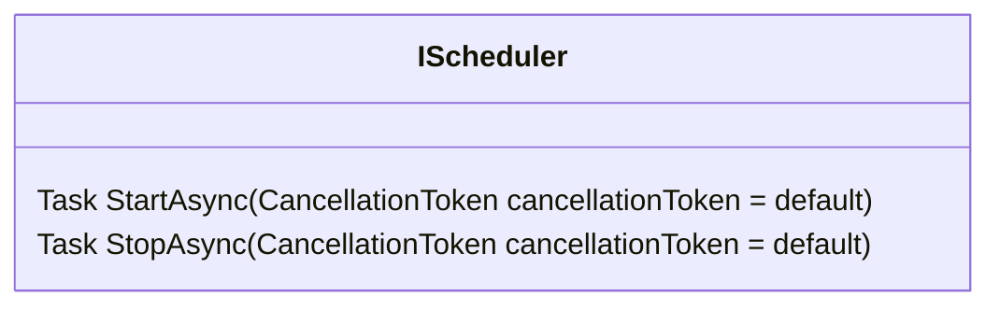

# Design Flow

```mermaid
classDiagram
    class IScheduler{
        Task StartAsync(CancellationToken cancellationToken = default)
        Task StopAsync(CancellationToken cancellationToken = default)
    }
```