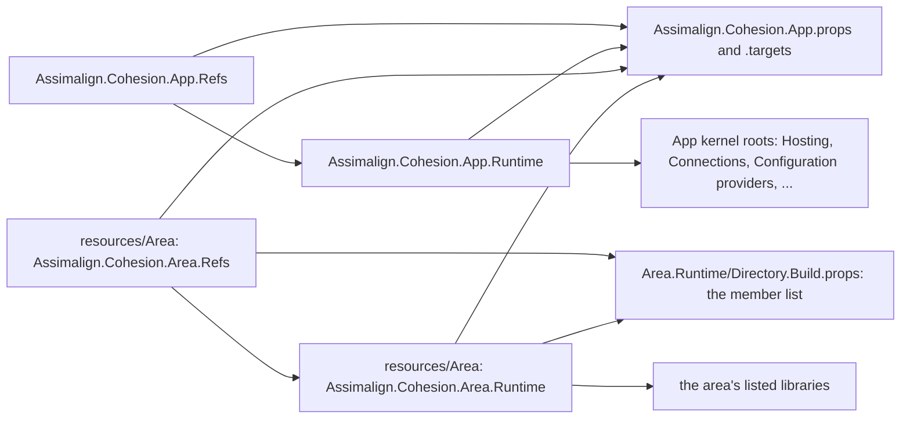

# App

`libraries/App/` is the home of the Cohesion shared-framework family. It holds the root
`Assimalign.Cohesion.App` framework (the hosting kernel every resource-area SDK references), the
shared props every framework producer imports, and the build logic that turns a framework's
member list into targeting and runtime packs. Each area framework, `Assimalign.Cohesion.App.<Area>`,
is produced inside its own area under `resources/<Area>/`, and its members are listed by hand in
`resources/<Area>/Assimalign.Cohesion.<Area>.Runtime/Directory.Build.props`.

| Path | Role |
| --- | --- |
| `Assimalign.Cohesion.App.props` | App's own inputs (the kernel roots, the umbrella assembly, the ComponentModel analyzer) and the defaults every producer shares (TFM, version prefix/suffix, package description). It lists no area framework |
| `Assimalign.Cohesion.App.targets` | Producer build logic: the App kernel closure, the `FrameworkList.xml`/`RuntimeList.xml` writer, and pack collection |
| `Assimalign.Cohesion.App.Refs` | Produces the `Assimalign.Cohesion.App.Ref` targeting pack |
| `Assimalign.Cohesion.App.Runtime` | Produces the `Assimalign.Cohesion.App.Runtime.<rid>` runtime packs. Its `tests/` check App's derived closure and each area list's coverage of its project-graph closure |

## Project map

How the producers depend on each other and on the files they import. Every producer imports
`App.props` and `App.targets`. An area's Runtime producer reads the area's member list from its own
`Directory.Build.props`, and the sibling Refs producer's `Directory.Build.props` imports that same
file. The App runtime producer references only the kernel roots; an area runtime producer
references every listed member.



## Naming convention

A framework producer project is named for the area that owns it. Its assembly, package, and
framework names keep the `App` segment and never change when the project moves:

| Framework | Producer projects | Assemblies | Packages |
| --- | --- | --- | --- |
| `Assimalign.Cohesion.App` | `libraries/App/Assimalign.Cohesion.App.Refs`, `.Runtime` | `Assimalign.Cohesion.App.Refs`, `Assimalign.Cohesion.App` | `Assimalign.Cohesion.App.Ref`, `Assimalign.Cohesion.App.Runtime.<rid>` |
| `Assimalign.Cohesion.App.<Area>` | `resources/<Area>/Assimalign.Cohesion.<Area>.Refs`, `.Runtime` | `Assimalign.Cohesion.App.<Area>.Refs`, `Assimalign.Cohesion.App.<Area>` | `Assimalign.Cohesion.App.<Area>.Ref`, `Assimalign.Cohesion.App.<Area>.Runtime.<rid>` |

The full rule, covering what each producer declares, how the resource guards treat producers, and
how to add a framework, is in
[`.claude/rules/build-system.md`](../../.claude/rules/build-system.md#framework-producer-projects).

## Validate

```bash
dotnet test libraries/App/Assimalign.Cohesion.App.Runtime/tests/Assimalign.Cohesion.App.Runtime.Tests.csproj
dotnet pack libraries/App/Assimalign.Cohesion.App.Refs/src/Assimalign.Cohesion.App.Refs.csproj
```
