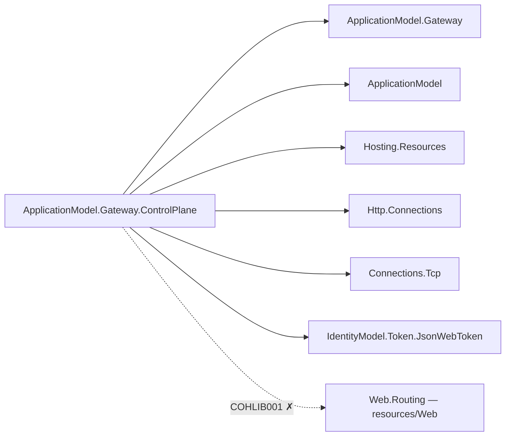
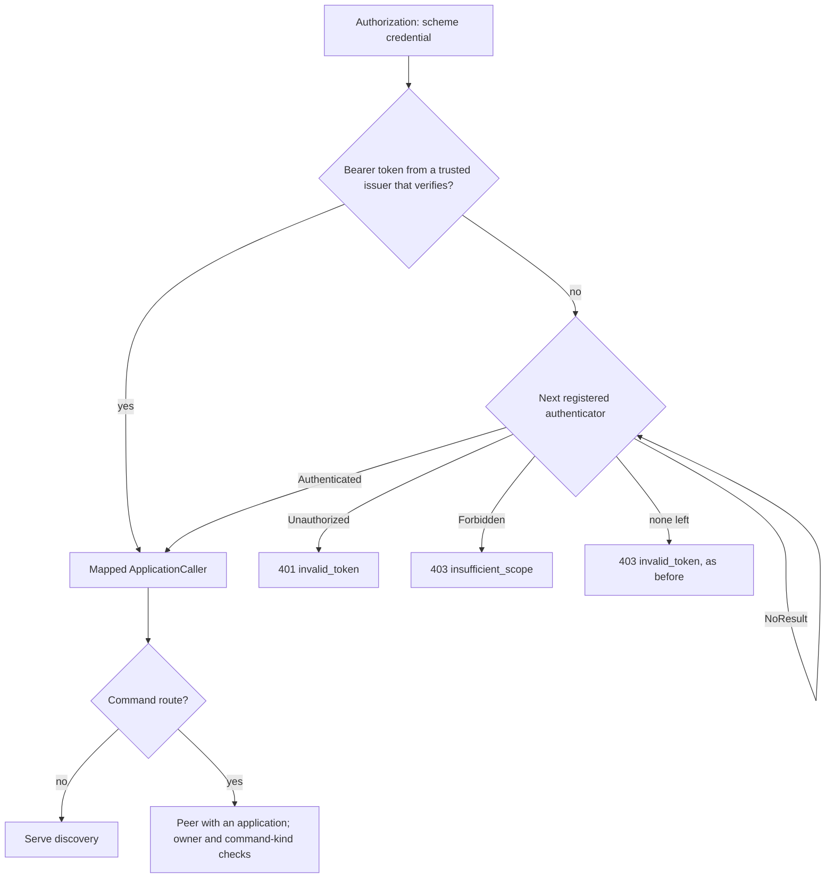

# Assimalign.Cohesion.ApplicationModel.Gateway.ControlPlane — DESIGN

## Authority

This package implements design item 23a in `docs/DEVELOPER_EXPERIENCE_DESIGN.md`. That signed-off
document wins over older ApplicationModel notes that describe HTTP control-plane hosting as
future work.

## Boundaries

The assembly is NativeAOT-compatible and uses source-generated JSON. It composes
`Http.Connections` and `Connections.Tcp` directly, routes its five fixed templates with an
internal matcher, and references nothing under `resources/**`: no Web package and no platform
`*.Hosting` package. The reference to `Hosting.Resources` is limited to the owner-approved
`ResourceCommand` envelope and `ResourceCommandRejectedException`, both used at the dispatcher
boundary, and the `ResourceCredentialProfile` constants the caller verifier reads.

Every project reference is a `libraries/**` package: `ApplicationModel`,
`ApplicationModel.Gateway`, `Hosting.Resources`, `Http`, `Http.Connections`, `Connections.Tcp`,
`IdentityModel`, `IdentityModel.Token.JsonWebToken`, and `Core`. The graph below shows the
package-specific ones. The dotted edge is the former `Web.Routing` reference: it points into
`resources/Web`, and the COHLIB001 guard rejects that edge for any library (see *Protocol and
trust*).

The dispatcher also receives a BCL `RemoteCertificateValidationCallback?` through its required
`serverCertificateValidator` parameter; it does not discover transport trust itself.

## Lifecycle and publication

`ApplicationGatewayOptions.ControlPlane` is an additive factory seam. The guided gateway base
creates one server per active application after a successful reconcile has produced an export,
publishes that exact document, and stops every server during stop, uninstall, or rollback.
Reconcile replaces the in-memory export without replacing the listener.

The Local gateway asks its persisted port store for a stable loopback port. The server advertises
the actual bound `System.Uri` only after the initial export exists. Metadata is written atomically
as `<state-root>/<application>/control-plane.json` with `{ url, trustKey }`; `url` uses
`UriExtensions.ToEndpointString()`. Process exit performs a final best-effort withdrawal for
one-shot Apply invocations.

## Protocol and trust

The five `/cohesion/v1` routes are matched by the internal `ControlPlaneRouter`. They were
first routed with `Web.Routing`. That reference was removed on 2026-09-25 because a library may
not reference a `resources/**` package: libraries sit below the resource areas, and the COHLIB001
guard now rejects such an edge. Five fixed templates never needed a general router, so the
matcher keeps only the part of `Web.Routing` those templates used, with the same observable
behaviour:

- The request path is trimmed of `/` and split with empty segments dropped, so `//a//b/` and
  `/a/b` match the same way.
- A template segment is a literal, compared ordinal case-insensitively, or a whole `{name}`
  parameter that captures the raw segment text. The request must have exactly as many segments
  as the template. Optional, default, catch-all, constrained, and complex segments are not
  supported, and a template that uses them fails at construction.
- Routes are tried in table order. The table lists the templates in the order `Web.Routing`'s
  inbound-precedence sort gave them. Each template has a different segment count, so only PUT
  and DELETE share a path, and PUT comes first.
- The first route whose path matches and that accepts the method wins. A `GET` route also
  serves `HEAD`.
- A path that matched with other methods returns `405` with `Allow` listing those methods in
  route order, plus `HEAD` when `GET` is listed (`GET, HEAD` or `PUT, DELETE`). Any other request
  returns `404`. Neither response has a body, and both are sent before authentication runs.
- A handler receives the captured values directly (case-insensitive keys) instead of reading a
  route feature from the context. A blank value still counts as missing.

Export serialization delegates to
`ApplicationExportDocument.SaveAsync`. Resource reads query the application-scoped state manager
on every request and emit current lifecycle plus observed endpoint `System.Uri` values encoded
with `UriExtensions.ToEndpointString()`.

### Caller authentication

The built-in authenticator parses a compact JWT, selects an exact issuer from the application's
current `ITrustedIssuerProvider`, verifies the ES256 signature and key identifier, then separately
checks issuer, `cohesion-export` audience, typed identity/temporal claims, future issue time, and
the eight-hour profile ceiling. The verifier (`ControlPlaneTokenVerifier`) is a thin configuration
of the shared ES256 `JsonWebTokenValidator` (IdentityModel.Token.JsonWebToken): its profile
resolves the issuer's `JsonWebKeySet` from the trusted issuer's public JWK, and the audience,
token-use claim, and ceiling come from `Assimalign.Cohesion.Hosting.Resources.ResourceCredentialProfile`
(`cohesion-export`, `cohesion_token_use=gateway`, `DeveloperMaximumLifetime`) instead of local
literals — the same helpers and constants every resource verifier uses.

That authenticator is the first stage of a pipeline (`ControlPlaneCallerAuthentication`). The server
parses `Authorization: <scheme> <credential>`, runs the built-in authenticator for a `Bearer`
credential, and — when it does not verify, or the scheme is not `Bearer` — asks each
`IApplicationCallerAuthenticator` the served application registered in `Providers.Callers` (a
snapshot taken when the server starts), in order, with an `ApplicationCallerRequest` and the current
trusted issuers. `NoResult` falls through; the first `Authenticated`, `Unauthorized`, or `Forbidden`
wins. An invalid application-key token also falls through rather than failing outright, so an
identity provider's JWT can reach its authenticator; the authenticators are the application's own
code, so handing them an unverifiable credential grants nothing. An undefined status, or an
`Authenticated` result that carries no `ApplicationCaller` (a `with` expression can build one), is a
defect and fails the request with `500`; it never admits the call.

| Outcome | Response |
| --- | --- |
| No `Authorization` header | `401`, `WWW-Authenticate: Bearer` |
| Unparseable header, or every authenticator returns `NoResult` | `403`, `Bearer error="invalid_token"` |
| An authenticator returns `Unauthorized` | `401`, `<scheme> error="invalid_token"`, its `Failure` as the error body |
| An authenticator returns `Forbidden` | `403`, `<scheme> error="insufficient_scope"`, its `Failure` as the error body |
| Authenticated, but a command route and not a peer with an application | `403`, `Bearer error="insufficient_scope"` |

Authorization applies to the mapped `ApplicationCaller`, never to the raw credential. The built-in
authenticator maps a token to `Application` = its issuer, `Subject` = its subject,
`Kind` = `Peer` when it carries `cohesion_token_use=gateway` and `Developer` otherwise, and the
matched trusted issuer's `AllowedCommandKinds`. Discovery routes admit any authenticated caller.
Command routes require a `Peer` caller with an `Application`: command reads return only that
application's observations, writes require the command owner to equal it, and a non-empty
`AllowedCommandKinds` limits the kinds it may apply or delete. With nothing registered in
`Providers.Callers`, every status code, challenge, and detail is what the server returned before the
pipeline existed; the existing control-plane tests run unchanged.

**Why the built-in authenticator runs first and cannot be replaced.** Peer trust grants
(`cohesion trust add`) and developer tokens are the product's default identity, and an application
that adds an identity provider still has to talk to peers that use application keys. Running it
first keeps that path independent of registered code; an authenticator that wants to refuse an
application-key caller can refuse its identity at the command level instead (owner, kinds).

Trust grants now carry an optional allowed-command-kinds list. The serving gateway enforces it
on apply and delete alongside the existing authenticated gateway-token and manifest validation.
An absent or empty list preserves unrestricted access; see the O25 contract below.

The HTTP resolver client implements `IAuthenticatedControlPlaneClient`. During gateway external
resolution, the base supplies the calling application's `PeerControlPlane` credential (from its
credential issuer, or the default ES256 gateway token) and the caller's trusted issuer snapshot;
command delivery through a peer carries the `RemoteCommand` credential. A peer that must accept an
identity provider's credentials for those purposes registers an `IApplicationCallerAuthenticator`
(see *Caller authentication*). A direct resolver instead uses the fixed-token factory. In either case, the client
validates the returned export and matches its public key to the trusted peer before the landed
manifest-hash/drift policy consumes it.

## Commands

PUT parses the `Hosting.Resources.ResourceCommand` wire envelope, checks that the resource
manifest declares the command kind, and resolves an `IResourceCommandDispatcher`. It uses the
dispatcher whose kind equals the manifest kind, and otherwise the first dispatcher whose kind is
`IGatewayResourceCommandClient.AnyKind` (`"*"`). The gateway selects its own command clients
(`ApplicationGateway.Commands.cs`) the same way, so an area-specific dispatcher always overrides
the generic one. The factory still rejects two dispatchers with the same kind, and that includes
two catch-alls. Dispatch uses the resource's live default control-plane endpoint: the first observed
endpoint named by the manifest's `controlPlane.endpoint` that forms a Cohesion endpoint with
`controlPlane.path` through `Uri.TryCreateEndpoint` — the construction the gateway's local delivery
uses too, so one command client sees the same URL on both paths (a test pins it for an IPv6 target
and a `cohesion/v1/` path). Each accepted
command remains visible to its owner through GET with `Applied` or `Rejected` status and detail.
The serving gateway supplies the target resource's `ResourceAccess` credential for the pass
(`IResourceCommandCredentialProvider.GetResourceCommandCredentialAsync`, minted through the
application's credential issuer or the default ES256 issuer) to the dispatcher. Identical
PUT retries return the recorded result without redispatch, while id reuse for different content
and an already-applied key owned by another issuer are rejected. A missing dispatcher, unavailable
endpoint, undeclared command, or dispatcher exception is recorded as `Rejected`. DELETE applies
through the same dispatcher and removes the observation only after the area confirms deletion.
An observation whose apply never reserved ownership is removed with `204` without dispatching
an area deletion; a rejected deletion of an applied command retains its reservation.

Item 23b supplies the claiming client's PUT/DELETE operations and adapts the gateway's
`IGatewayResourceCommandClient` registrations into `IResourceCommandDispatcher` in
`GatewayControlPlane.Configure`. Local and peer-serving delivery therefore share one client
implementation: by default the generic `ResourceControlPlaneCommandClient`, registered as
`AnyKind`, plus any exact-kind clients the gateway adds. `Configure` adapts only the first
client of each kind. The gateway never selects a later duplicate, and adapting it would fail the
factory's uniqueness check. The existing five routes remain unchanged. Provider refusals preserve their
detail through the adapter and remote client. Ownership reservations are separate from the
last-operation observations, so a rejected deletion retains the applied key until the dispatcher
confirms removal.

The server obtains `IResourceTransportTrustProvider` from its serving gateway alongside the
credential provider. For each HTTPS apply or delete it requests the served application's current
outbound validator and passes it through `IResourceCommandDispatcher` to the area client. These
are the same certificate-authority anchors used by the gateway's probes and store reads. HTTP
targets, a missing provider, and applications without anchors pass `null` for platform default
trust. Adding the required `serverCertificateValidator` parameter before cancellation is a
public breaking change to both dispatcher members; it changes no route, mount, or wire contract.

The serving gateway continues forwarding its own resource-access credential for the target. ConfigurationStore's
landed owner-equals-issuer policy consequently refuses foreign-owned envelopes with that provider
credential. An owner-preserving delegation contract is required before claiming remote
ConfigurationStore mutation works against a real authenticated host; the boundary is not weakened
by the adapter. IdentityHub and SecretStore desired commands use the same issuer policy; an owner-preserving remote delegation contract remains separate work. Rezolvr uses the existing generic middleware owner policy.

## Command trust grants (O25 / item 31c)

TrustedIssuer.AllowedCommandKinds is an immutable normalized ordinal list. The original
constructor remains unrestricted. Absent or empty means every kind is allowed; a nonempty list
permits exactly those case-sensitive wire kinds. `--mode trust-add --peer peer --from peer.json
--allow rezolvr.add-a-record,identityhub.add-audience` accepts repeated --allow arguments and
comma-separated values. --allow is rejected for trust-issue and other modes. The CLI forwards
--allow but still rejects --against, whose endpoint-selection contract remains item #982.

Local trusted-issuers.json and a registered trust store both persist optional
allowedCommandKinds arrays; the gateway hands the store a `TrustedIssuer` that carries the list.
Old documents remain unrestricted. The SecretStore orchestration store writes restricted grants as
{trustKey,allowedCommandKinds}; unrestricted grants retain the bare JWK protocol. Its export returns
the array to the gateway. AddTrustedIssuerAsync accepts the new collection while preserving the
existing overload and its unrestricted behavior.

The serving gateway carries the matched issuer's list onto the authenticated principal and checks
both apply and delete. A forbidden kind returns the existing 409 Rejected observation with a detail
naming the issuer and kind. It does not dispatch the command or release existing ownership.
Manifest advertisement, command-token scope and owner-equals-issuer checks remain in force.
