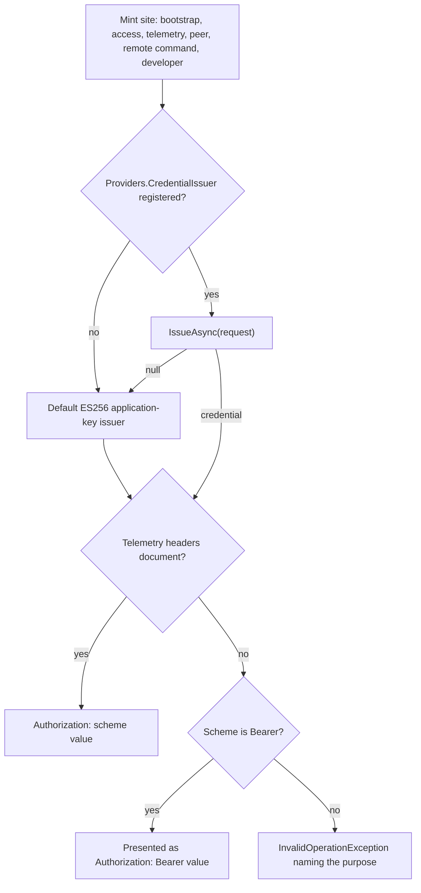
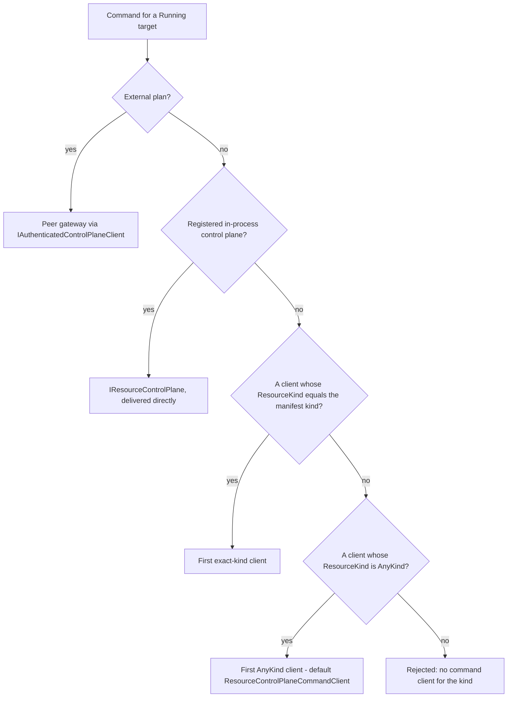
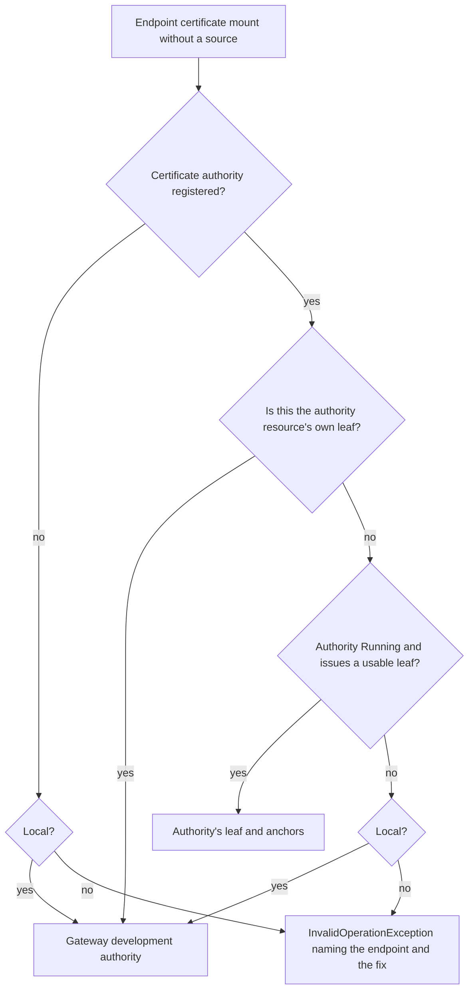

# Assimalign.Cohesion.ApplicationModel.Gateway — DESIGN

> Layer-2a of the ApplicationModel stack: the **control-plane base** plus the default
> **LocalGateway**. The [ApplicationModel area design v3](../../../../docs/libraries/ApplicationModel/DESIGN.md) connects the
> declarative contracts, SDK image pipeline and platform-owned compilers; the
> [portable contract package design](../../Assimalign.Cohesion.ApplicationModel/docs/DESIGN.md)
> owns the shared model. The signed developer-experience design remains the direction of record.

## What this library is

This package implements the control-plane contracts defined in
`Assimalign.Cohesion.ApplicationModel`. It contains:

- **`ApplicationGateway`** — the public *guided base* that implements the generic realization
  algorithm once.
- **`ApplicationGatewayOptions.Controllers`** — the registered-first domain override seam;
  framework options ship with an empty collection.
- **`InMemoryResourceStateManager`** — the public, race-free reference implementation of
  `IApplicationResourceStateManager` for gateway authors.
- **`LocalGateway`** (+ `LocalGatewayOptions`) — the default gateway for local development,
  which realizes each resource as a supervised child process.
- **`IApplicationTrustGateway`**, **`ITrustedIssuerProvider`**, and
  **`IResourceCommandCredentialProvider`** — the Hosting-free seams for per-application trust and
  resource-scoped command dispatch credentials. Every credential behind them is minted through the
  application's registered `IApplicationCredentialIssuer` first (see *Identity seams*).
- The **provider cutover**: mount sources, source-free endpoint certificates, trusted issuers,
  command inputs, and telemetry are resolved only through the registrations the application
  makes in `IApplicationBuilder.Providers` and freezes into `IApplicationModel.Providers` (see
  *Provider registrations* below). This package holds no store client and no area kind, route,
  command kind, or document format.
- **`IGatewayResourceCommandClient`** and its generic default,
  **`ResourceControlPlaneCommandClient`** — out-of-process delivery of declarative resource
  commands over the standard control-plane `commands` route, for every resource kind.
- **`IImageRealizer`** — the platform seam that turns a digest-pinned image reference into an
  `IContainerImageArtifact` without putting registry or platform I/O in the base algorithm.
- Internal pieces: `ResourceControlContext`, `LocalResourceResolver`, port and mount
  materializers, the probe runner, `LocalGatewayProcessSupervisor`, `LocalProcessStateStore`,
  `LocalProcessSignal`, `LocalPlanController`, `ExecutableArtifact`.
- **`UseLocalGateway()`**, **`AddExecutable(...)`**, and **`AddContainer(...)`** builder
  extensions.

It references the Core-only `Assimalign.Cohesion.ApplicationModel`,
`Assimalign.Cohesion.Hosting.Resources`, IdentityModel's `JsonWebToken` package, and the
DataProtection/ProtectedData primitives — no project under `resources/**`. The former
`SecretStore.Client` and `ConfigurationStore.Client` references (the signed O13 exception) were
removed with the provider cutover: libraries never depend on resources, so every area's wire
knowledge now lives in that area's opt-in `Assimalign.Cohesion.<Area>.ApplicationModel.Orchestration`
package, which a gateway's `Program.cs` references and registers. The package is
`IsAotCompatible` / AOT-gated — no reflection, no `Microsoft.Extensions.*`. Publishing the
concrete reference state manager is a signed-off, narrowly scoped exception to the repository's
interface-first default; the interface remains the control-plane contract. The public
`ResourceControlPlaneCommandClient` is the second such exception (owner-approved 2026-09-25; see
*Command delivery*), with `IGatewayResourceCommandClient` as its contract.

`Local` alone enables developer-machine trust fallback, declared DevPort discovery, and
loopback HTTP credential transport. `Development` is a strict deployed environment alongside
Staging and Production. The persisted O32 development certificate issuer remains independent
of this environment distinction.

## The generic algorithm (why the base owns it)

`ApplicationGateway` implements `IApplicationGateway` **explicitly** and forwards to
strongly-typed `protected` hooks (`GatherAsync`, `ResolveInputsAsync`, `Controllers`, `State`,
`StartObserverAsync`),
per the repo's interface-first-with-guided-base convention. Every gateway — local, Docker,
Kubernetes — is the *same* algorithm with different hooks, so it is written once:

1. **Validate** every `descriptor.Plan` during `Build()` by asking registered controllers first,
   then the platform controller, whether `CanRealize(plan, out reason)`. Failure names the resource
   and gateway before any gather or target contact.
2. **Order** `model.Descriptors` topologically (depth-first post-order; the model is already
   validated acyclic at build time, so no cycle guard is needed here).
3. **Gather** each resource's artifact via `GatherAsync` (local → an executable path; container
   gateways → a pre-built image). Gathering locates/validates; it never builds.
4. **Start the single observer** (`StartObserverAsync`) — the only writer of observed status
   into `State`. Controllers only *apply* desired state; they never own steady-state.
5. **Reconcile in dependency order**: after dependencies have satisfied their initial gate,
   resolve `ResourceInputs { Mounts, BootstrapCredential, ApplicationTrustKey }` for this pass,
   compile the immutable plan plus artifact, inputs, and observed dependencies, and call
   `ReconcileAsync`. A controller may set `Skipped`; its dependents become `Skipped` while
   independent resources continue.
6. **Gate once from the plan**: call `WaitForStateAsync` with
   `plan.Workload.Gate.Terminals` and a per-resource budget, then admit the resource exactly when
   `Gate.Satisfying` contains the reached state. Long-running kinds satisfy on `Running`; a Job
   satisfies on `Stopped`. `Degraded` is observational and never re-gates an admitted dependent.
7. **Stop or uninstall in reverse order**: `StopAsync` calls each controller's non-destructive
   runtime stop hook and retains persistent objects; `UninstallAsync(model)` calls `DeleteAsync`.
   Caller cancellation during Run startup follows the same non-destructive stop path and the Run
   lifetime completes normally; a non-cancellation failure during initial realization still
   deletes whatever was partially applied.

This is why a `Failed`, cleanly `Stopped`, or never-ready dependency can never deadlock the
graph: readiness is a **plan-owned terminal-set** membership wait with a budget, not an ordinal
state comparison. Deployment, StatefulSet, and DaemonSet plans terminate on
`{Running, Failed, Stopped}` and satisfy only on `Running`; Job plans terminate on
`{Stopped, Failed}` and satisfy only on `Stopped`. This is the cohesion-side contract referenced
by the `cohesion-platforms` rule 2 amendment; that sibling repository is not edited here.

`LocalPlanController` keeps compilation pure:
`Compile(plan, artifact, inputs, observedDependencies, options)` only produces the local desired
process/environment description. Port allocation, claim-directory creation, mount-file writes,
and process launch happen afterward in the apply path. Platform compilers must preserve the same
boundary: no target reads, file writes, or process/network operations during compilation.

## InMemoryResourceStateManager — the race-free contract

The public reference `IApplicationResourceStateManager` implementation is the load-bearing
correctness piece. Reads, writes, and *waiter registration* all happen under one lock, so the
classic lost-wakeup —
`SetState` firing between a reader observing the current state and subscribing — cannot occur:
`WaitForStateAsync` checks the current state and, if not yet terminal, registers its waiter
**before** releasing the lock. Waiters are completed and the `StateChanged` event is raised
*outside* the lock to avoid re-entrancy. Budget expiry returns the last observed state so callers
learn where a resource got stuck. Caller cancellation instead throws `OperationCanceledException`
and removes the abandoned waiter; terminal completion, timeout, and cancellation all clean up
the registration under the same lock.

## LocalGateway — process realization

- **Resolution**: manifest-backed resources launch the exact `artifact.apphost`; the local
  gateway never falls back to the managed assembly DLL. A plain or orchestration-disabled
  executable can launch only through `AddExecutable(name, path, options)`, with an explicit
  readiness probe or per-resource stdout marker.
- **Render**: `--mode render` compiles the declaration-ordered models into
  `cohesion/local-plan-set/v1` process units. The document resolves artifact paths syntactically,
  folds plan services, exposures, and volumes into deferred loopback endpoint and mount requests,
  and carries workload, restart, gate, probe, environment, and control-plane facts. Port zero means
  runtime allocation. Rendering never gathers an artifact, allocates a port, materializes a mount,
  resolves an input, starts a child, or creates Local gateway state.
- **Endpoints**: each endpoint gets a loopback port persisted in
  `.cohesion/<application>/.state/ports.json`. The gateway injects the frozen `AppEnvironment.Variables`
  endpoint contract (caller values win), publishes the allocated endpoints atomically with the
  first `Running` transition. Once a manifest-referenced dependency reaches `Running`, the
  dependent receives `COHESION_DEPENDENCY_<RES>_<EP>_{URL,HOST,PORT,SCHEME}` exclusively from
  that dependency's observed endpoints. Optional references never gate startup: they inject only
  when the target is already `Running`, and otherwise inject nothing. An explicit C# `DependsOn`
  edge remains ordering-only.
- **Probes**: HTTP (exactly 200 succeeds; 404/405 fail startup immediately), TCP, and exec are
  gateway-side and AOT-safe. Missing manifest probe roles use the resource's default control-plane
  endpoint and role route (`<path>/readyz` for startup/readiness, `<path>/livez` for liveness);
  explicit `none` disables a role. The canonical
  `cohesion-resource: ready` stdout line starts manifest probing but is not readiness proof.
  `AddExecutable` may instead use its configured marker as the whole readiness signal.
- **Supervision**: stdout and stderr are piped with a `[resource-name]` prefix. A failed liveness
  attempt moves `Running` to `Degraded` with the probe detail. Three consecutive failures restart
  under `OnFailure` (default), `Always`, or `Never`, with 1-second exponential backoff capped at
  30 seconds and five restart attempts. A restart observes
  `Degraded → Stopping → Starting → Running`; dependents are never re-gated.
- **Mounts**: resources receive `COHESION_MOUNT_<M>_PATH` rooted at
  `.cohesion/<application>/<resource>/<mount>`. POSIX directories/files use exact 0700/0600
  modes. A Composite plan's flattened `<member>-<mount>` claim instead receives the outer carrier
  `COHESION_MOUNT_<COMPOSITE>_<MEMBER>_<M>_PATH`, pointing to the same resource-rooted claim;
  inward remapping belongs to `ProcessHost`.
  Windows files are CurrentUser DPAPI ciphertext; this makes no ACL claim. The
  `ResourceMount` reader in `Assimalign.Cohesion.Hosting.Resources` decrypts that file for the child while
  retaining the raw path for tools that require one.
- **Bootstrap credential**: every local reconcile receives a fresh bearer credential (the
  `ResourceBootstrap` credential; see *Identity seams*), written as UTF-8 — byte-identical to the
  former ASCII encoding for the default ES256 token.
  The apply path writes it with the same private file discipline at
  `.cohesion/<application>/<resource>/.state/bootstrap.token` and injects only
  `COHESION_BOOTSTRAP_TOKEN_PATH`; the credential is never placed directly in the environment.
  A later reconcile rotates the file atomically.
- **Shutdown**: Windows launches use `CreateNewProcessGroup`; POSIX launches use `setsid` when
  the host provides it, with a best-effort `setpgid` fallback. On Windows, a fresh manual-reset
  event named by `COHESION_STOP_EVENT` is primary and targeted `CTRL_BREAK` is the console
  fallback; POSIX sends `SIGTERM` to the process group when isolation succeeded. The gateway
  waits the manifest's `lifecycle.stopGraceSeconds` (30 seconds by default;
  `LocalGatewayOptions.StopGrace` is the
  fallback for opaque executables), then force-kills the whole group/tree. A process that exits
  during grace becomes `Stopped`; one that requires escalation becomes `Failed(forced)`.
- **Known POSIX limitation**: process grouping depends on the host-provided `setsid` command with
  a best-effort `setpgid` fallback; no RID-native launch helper is shipped.
- **Recovery and exclusive supervision**: `.cohesion/<application>/.state/owner` records the
  gateway identity, while a stable `gateway.lock` sidecar is held for the complete observer
  session. Application leases are acquired in ordinal path order, so only one local gateway may
  supervise or uninstall an application at a time, including across processes. The sidecar is
  retained after release; process exit releases the operating-system lock. Each
  `.cohesion/<application>/.state/<resource>/pid` records a registration generation, PID, process
  start time, executable path, process-group ownership, and the Windows stop-event name. A new
  gateway independently verifies PID + start time + executable before adopting a live child and
  rebuilds readiness from probes. PID reads, replacements, and conditional deletes use a stable
  per-resource lock sidecar, and cleanup removes only the exact registration generation it
  observed, so stale recovery cannot delete a newer child registration.
  A foreign owner is refused before process realization unless this invocation carries
  `--adopt`. Observed state is rebuilt on every gateway start; the PID file is verified recovery
  metadata, never persisted lifecycle truth. `UninstallAsync` also verifies an orphan before
  stopping it and removes the resource's persisted mounts and port allocation.
  `--restart-orphans` (or `LocalGatewayOptions.RestartOrphans`) instead gracefully stops each
  verified child and launches a fresh attempt. Concurrent stop and uninstall callers await one
  shared teardown task; persisted ports and mounts are not removed until process exit and PID
  cleanup complete.

## Item #968 — late-bound inputs, application trust, and opaque workloads

### Gateway-owned mount-source resolution (O13, through registered providers)

`ApplicationGateway.ResolveInputsAsync` is the sole default resolver. It runs after a
resource's dependencies pass their initial gate and runs again on every reconcile; resources
consume already-resolved inputs and never pull orchestration data themselves. Each
`MountBinding.Source` is handled as follows:

- an omitted source resolves to empty content (or an empty gateway-created Volume claim);
- `literal:<value>` is UTF-8 content and is valid only for a Configuration mount;
- `parameter:<name>` resolves from the application parameter document, then from
  `ApplicationGatewayOptions.Parameters`; generated gateway startup applies repeatable
  `--parameter name=value` values last. The default document is
  `.cohesion/<application>/parameters.json` unless `ParameterFile` is explicit. Windows reads
  CurrentUser-DPAPI ciphertext; on POSIX the gateway enforces mode 0600 before reading.
  A Volume cannot declare a parameter or any other source;
- `<source>:<key>` is resolved by the provider the model registered for `<source>` in
  `ApplicationProviders.Sources` (see *Provider registrations* below). When the provider declares a
  `ResourceKind`, or `<source>` names a resource of the model, the source must be an unambiguous
  declared dependency of the same application that is `Running`, has the provider's kind, and has
  an observed control-plane endpoint that may carry a bearer credential. A Secret mount receives
  the provider's bytes (or, for an endpoint certificate mount, its certificate); a Configuration
  mount receives the provider's entries, which the gateway itself encodes as a JSON object with
  ordinally sorted keys and `null` values kept. A Volume mount cannot declare a source.

Missing parameters, malformed references, missing registrations, unavailable endpoints, provider
failures, and kind mismatches produce a typed unresolved `ResourceMountInput` with the
source-specific reason. `LocalPlanController` refuses that input before applying the process; every
platform controller must preserve the same no-partial-realization rule.

For a resource-backed source, the gateway hands the provider a `ResourceProviderConnection`:
caller = the application, resource and kind from the bound manifest, control-plane address =
observed endpoint + manifest `controlPlane.path`, bearer = the source resource's one audience-bound
credential for the current reconcile pass, and the transport validator for that resource. A source
outside the model gets no connection and authenticates itself. The validator is keyed on the store
owner's application anchors (HTTPS only); since cross-application sources are rejected, that is the
consuming application. A provider failure — `HttpRequestException`, `InvalidDataException`,
`JsonException`, `NotSupportedException`, or `ArgumentException` — becomes an unresolved input
naming the mount, the source, and the provider's message; anything else is a defect and propagates.

A manifest endpoint can designate a Secret mount through its `Certificate` field. An explicit
source then uses `IResourceSourceProvider.ReadCertificateAsync`; the gateway validates the PEM bundle
and, only for a usable bundle, adds the returned trust anchors to the application's transport
trust. An unavailable explicit source remains a named unresolved input. Source-free certificate
mounts follow *HTTPS transport identities* below.

### Per-application trust and rotating credentials

The gateway owns one ECDSA P-256 signing key per application and gateway identity. The private
PKCS#8 value stays under `.cohesion/<application>/trust/<gateway>/` and is encrypted at rest with
`Assimalign.Cohesion.Security.DataProtection`, scoped by application and gateway; the protecting
key ring is DPAPI-backed on Windows and uses 0700 directories/0600 files on POSIX. DataProtection
is only the at-rest primitive — ECDSA is the signer — and the private key never enters a
resource, export, or trusted-issuer document. `IGatewayTrustKeyRepository` is the platform
override for a durable native Secret; the protected local repository is the default.

The public-only JWK carries `kty=EC`, `crv=P-256`, `alg=ES256`, `use=sig`, and an RFC 7638
thumbprint `kid`. The same JWK is supplied through `ResourceInputs.ApplicationTrustKey`, emitted
as `COHESION_APPLICATION_TRUST_KEY` for a local child, and published as
`ApplicationExportDocument.TrustKey`; platform compilers receive it through the same immutable
inputs. The application's own public key is always retained in its trusted-issuer snapshot.

Every reconcile creates one fresh bootstrap credential per resource. By default it is an ES256 JWT
with issuer = application, subject = gateway, audience = target resource, a new `jti`, and bounded
`iat`/`nbf`/`exp` (24 hours maximum); an application that registers an `IApplicationCredentialIssuer`
may mint it instead (*Identity seams* below). Every gateway-side call to that resource during the
pass reuses one access credential — with the default issuer, the same token. Rotation means
replacing the credential on every reconcile, not exposing the signer or placing the token value
directly in an environment variable. The carrier contract is:

| Realization | Bootstrap credential carrier |
|---|---|
| Local out-of-process | Private `.state/bootstrap.token` file named by `COHESION_BOOTSTRAP_TOKEN_PATH`; 0600 on POSIX, DataProtection ciphertext on Windows; atomically replaced. |
| In-process | Value on the per-invocation ambient `ResourceContext`. |
| Docker | tmpfs file, implemented by the Docker platform compiler. |
| Kubernetes | Secret volume, implemented by the Kubernetes platform compiler. |

Peer verification keys are `TrustedIssuer` records exposed through
`ITrustedIssuerProvider`. `TrustedIssuer` is defined in `Assimalign.Cohesion.ApplicationModel`
(it moved there so the provider seams can name it); code in this family's child namespaces
resolves it without a new `using`. The gateway reads the persisted peers through **that application's**
registered trust store, `ApplicationProviders.TrustStore` (for example the SecretStore orchestration
package's `SecretStoreTrustedIssuerStore`, registered by `UseSecretStore(store).AsTrustStore()`). A
store bound to a resource of the application is reached at its observed running endpoint, the
platform seam, or — only in Local — its declared local port, with an audience-bound credential; a
store outside the model receives no connection. The gateway refreshes that snapshot before a
reconciliation pass when the store is already observed and immediately after the store's resource
first reaches `Running`, so later remote resources in the same pass can use newly loaded peer grants.
The topological walk prefers the certificate authority's resource and then the trust store's resource
among otherwise independent roots while preserving their declared dependencies, preventing declaration
order from placing first-pass remote resolution ahead of trust. The authority goes first because a
separate trust-store resource with an HTTPS endpoint needs a leaf from it, which outside Local is a
hard failure while the authority is not Running; when one store fills both roles the order is simply
that store first. Loading or storing a peer grant may fall
back to the application-local `.cohesion/<application>/trust/trusted-issuers.json` document only in
Local. A store that answers "nothing persisted" (`null`) means that no peer grants exist yet outside
Local; Local keeps its local fallback until the store contains a replacement document. Every other
malformed or unavailable store read outside Local is fatal. Without a registered trust store, Local
uses the local document alone and every other environment keeps only the application's own key.
Platform gateways resolve a stable native endpoint for one-shot trust commands through the protected
`TryResolveTrustStoreEndpoint` (formerly `TryResolveOwnSecretStoreEndpoint`); the gateway appends the
manifest control-plane path. `trust-add` outside Local requires a registered trust store. Refreshing
peers never removes the application's self key.

The one-shot gateway command modes are the low-level surface used by later CLI wrappers:

- `--mode trust-issue --developer <name>` prints a short-lived ES256 developer token with
  audience `cohesion-export`, a new `jti`, and an eight-hour maximum lifetime. Rotating the
  application key invalidates credentials signed by the old key.
- `--mode trust-add --peer <peer> --from <file-or-https-uri>` validates that the peer name exactly
  matches the exported application and that the export contains its public JWK, then writes the
  grant (owner = the model's `Owner`, command-kind restriction carried on the `TrustedIssuer`) to
  the **verifying application's** registered trust store. A remote source requires an
  authorization-configured `IControlPlaneClient`; plaintext HTTP is limited to Local
  loopback. Only Local may use the local fallback document; elsewhere a missing trust store is an
  `InvalidOperationException` that names the registration to add.

### Opaque executable and container entry points

Source-built manifests deliberately have no `artifact.image`. Base validation checks plans and
controller support before `GatherAsync`, without requiring an image. The gather hook receives the
resource, whose existing `IManifestResource` supplies the manifest and resource name; container
gateways resolve `ArtifactRef.Self` from `application.images.json` there and give the resulting
digest-pinned reference to `IImageRealizer`. Only package manifests shipping a published image
may carry that identity themselves; the SDK currently ships it in the package's image index.
No generated manifest is rebound from the gathered index (O37).

- `AddExecutable(...)` is the explicit LocalGateway-only escape hatch for a plain apphost or
  native executable with no manifest/control plane. It requires either an enabled readiness
  probe or a stdout ready marker and can configure endpoints, probes, environment, restart
  policy.
- `AddContainer(...)` turns an opaque OCI image into a generic deployment plan. The image must
  end in an immutable `@sha256:<64-hex-digits>` digest, and the caller must declare at least one
  endpoint and an enabled readiness probe; the options also carry startup/liveness probes,
  environment, and restart policy.
- `IImageRealizer.RealizeAsync(resource, imageReference, cancellationToken)` is the platform
  boundary that converts that digest-pinned reference to an `IContainerImageArtifact`. This
  package defines the seam but does not pull, build, load, or publish images; Docker and
  Kubernetes gateways own those operations and their corresponding plan controllers.

## Provider registrations

The gateway resolves every area-backed input from `IApplicationModel.Providers` — the frozen snapshot
of what the application registered in its `ApplicationProviders` (`IApplicationBuilder.Providers`, or,
for an application-set member, the `Providers` of the `IApplicationProviderBuilder` its
`AddApplication(..., configure)` callback receives) — and from nothing else. It
holds no store client and no area resource kind, route, command kind, reserved name, or document
format. `IGatewayStoreClient`, the internal `GatewayStoreClient`, and
`ApplicationGatewayOptions.StoreClient` were removed together with the `SecretStore.Client` and
`ConfigurationStore.Client` references. The shipped implementations live in opt-in
`Assimalign.Cohesion.<Area>.ApplicationModel.Orchestration` packages that a gateway's `Program.cs`
references and registers explicitly; nothing is registered by convention.

| Role | Registration | When nothing is registered |
| --- | --- | --- |
| `<source>:<key>` mount source | `Providers.Sources["<source>"]` | `Build()` (or the application set, for a member) rejects the mount, naming the package and verb; a model handed to the gateway directly gets an unresolved input |
| Source-free endpoint certificate | `Providers.CertificateAuthority` | Local: development authority; elsewhere: `InvalidOperationException` |
| Trusted issuers | `Providers.TrustStore` | Local: `.cohesion/<application>/trust/trusted-issuers.json`; elsewhere: the self key only, and `trust add` throws |
| Command payload rewrite | `Providers.CommandInputs`, by command kind | A kind the target's manifest marks `RequiresInputResolver` fails `Build()` (or the application set, for a member), naming the package and verb; any other kind is delivered as declared |
| Telemetry sink | `Providers.Telemetry` | No `COHESION_TELEMETRY_*` values |
| Credential minting | `Providers.CredentialIssuer` | The default ES256 application-key issuer, for every purpose |
| Control-plane callers | `Providers.Callers` | Only the built-in ES256 trusted-issuer authenticator admits callers |

`parameter:` and `literal:` stay built in. The gateway keeps what is its own contract rather than an
area's: `<source>:<key>` parsing, the dependency and `Running` checks, `CanSendCredential`, the
ordinal-sorted JSON bytes of a Configuration mount, anchor aggregation into the application's
transport trust, and the catch filter that turns a documented provider failure into an unresolved
input. A Local application that registers `UseSecretStore(store).AsCertificateAuthority().AsTrustStore()`
and `UseConfigurationStore(store)` gets exactly the behaviour the built-in store client gave. Each
role is opt-in, so an application that registers only a store's source role keeps the Local-only
defaults for the other roles and fails loudly outside Local.

Provider connections carry the bound resource's `ResourceAccess` credential for the pass, whose
audience is that resource. With no credential issuer registered it is the same ES256 token the
built-in store client used (the resource's bootstrap credential for the pass); see *Identity seams*.

### Imported models and provider registrations

Providers are code and never serialized, so a model imported from an application-model document —
an application-set member resolved from a gateway executable's `--mode describe` or from an export —
carries `ApplicationProviders.Empty`. The member's own gateway registered its stores in its own
`Program.cs`, but those registrations do not survive its describe output.

**Decision: an application set registers each member's providers explicitly, for that member alone;
nothing is inherited by name.** The set gateway's `Program.cs` registers a member's providers where it
adds the member, through `IApplicationSet.AddApplication(declaration, configure)`. The callback
receives an `IApplicationProviderBuilder` over the member's resolved model — a separate interface from
`IApplicationBuilder`, which the default builder also implements — and the orchestration verbs take a
resource name on it because a member has no descriptors (a builder's verbs take the descriptors it
created; both write the same `ApplicationProviders`):

```csharp
IApplicationSet set = Application.CreateSet(new LocalGateway(options), args)
    .AddApplication(Applications.Platform, platform => platform
        .UseSecretStore("platform-secrets")
        .AsCertificateAuthority()
        .AsTrustStore())
    .AddApplication(Applications.AppA, appa =>
    {
        appa.UseConfigurationStore("appa-configuration");
        appa.Providers.Telemetry = ResourceTelemetrySink.FromResource("appa-logs");
    })
    .AddApplication(Applications.AppB);

await set.RunAsync();
```

The set invokes the callback after the member resolves, freezes what it registered, and attaches it
to that member's model; the gateway receives that model and resolves the member's mount sources,
certificate authority, trust store, command inputs, telemetry, credentials, and control-plane callers
from its `Providers` exactly as for a builder-built model — there is no set-specific path in the
gateway. Before any gateway call the set validates every member, registered or not, with the rules
`Build()` applies (every own `<source>:<key>` mount has a provider, bound resources exist with the
provider's kind, nothing reaches another application, and every command whose target manifest
requires an input resolver has one registered for its kind), in every run mode — as `Build()` validates a
builder whatever mode it runs in. A failure names the member: `Application-set member 'appb' has
invalid provider registrations. ...`, followed by the rule's message and a hint naming the package and
the `set.AddApplication(Applications.<Member>, application => application.Use<Area>("<store>"))`
registration to add.

Registrations are never inherited by name. A member gets exactly what its own callback registered —
not another member's, not the set's, and not by matching a source or resource name — so two members
that each declare a store called `secrets` each bind their own store, and a member without a
registration fails even when another member registered a provider under the same name. Inheriting by
name would bind one application's registration to another application's resource that happens to
share the name, which is the cross-application binding decision 4 rejects.

The same rule covers a Local `--realize` closure. The closure's resources belong to the realized
application, validation checks only the composing application's own manifests, and the composing
application may not bind another application's stores (below) — a member's callback that binds a
closure resource is rejected like a builder's. The gateway therefore applies a model's registrations
only to resources of that model's own application: every `<source>:<key>` mount of a closure
resource — store-backed or a source outside the model alike, even when the composing application
registers a provider under the same source name — fails with a reason that names the realized
application and the cross-application limit. `parameter:` and `literal:` sources are unaffected.

The gateway itself still does not reject a model at `Validate()` for a missing registration; validation
belongs to `Build()` and to the set. A model handed to the gateway without the registration a mount
needs — for example an imported model passed to it directly — resolves that mount to an unresolved
input whose reason names the source, states that an imported model carries no registrations, and names
both the set callback and the `builder.Providers.Sources["<source>"]` registration; the controller
refuses the input. A command in such a model whose kind the target requires resolved is delivered as
declared, and the target refuses the unresolved payload (SecretStore keeps that rejection of an
unresolved `secretstore.add-secret` as defense in depth). A member registered without a certificate authority, trust store, or telemetry sink
gets the defaults in the table above: the development authority in Local only, the local
trusted-issuers file in Local only, and no telemetry.

### Cross-application store sources — follow-up

A mount `<source>:<key>` whose source is a resource of another application — a manifest reference into
another application, a remote reference, or an external — is rejected at `Build()` ("Cross-application
store sources are not supported yet"; owner decision 4), and the gateway refuses the same shape at
resolution for models `Build()` never validated. Before the cutover the gateway resolved such a source
by calling the other application's store with a credential its own application minted, validating the
store's certificate against the store owner's anchors.

That path is dropped for now because it cannot work end to end: SecretStore authenticates a caller by
the trusted issuer of its credential and rejects foreign issuers, so a credential minted by the
consuming application is refused unless the store's application trusts that issuer and grants it a
scope — and no contract defines that grant. The follow-up, once the store resources mature, is a
peer-credential design: the consuming gateway obtains a credential the store's application issues or
trusts under a named, restricted grant (through the peer control plane, the
`ApplicationCredentialPurpose.PeerControlPlane` purpose), the provider connection carries it, and
validation admits a cross-application source only for a store whose application has granted it.
Until then, a value another application owns reaches a consumer through a `parameter:` source or
through the consumer's own store.

## Identity seams

Owner decision 2 lets an identity provider issue the credentials an application's gateway hands
out, while the runtime contract stays at v1. The gateway therefore mints **every** credential
through one internal pipeline (`ApplicationGateway.Credentials.cs`): it builds an
`ApplicationCredentialRequest`, asks `Providers.CredentialIssuer` first, and falls back to the
default issuer when none is registered or the issuer returns `null` for that request. The default
issuer is the application's `ApplicationTrustState`: an ES256 JWT signed by the application trust
key, with its claim names and values taken from
`Assimalign.Cohesion.Hosting.Resources.ResourceCredentialProfile` rather than local copies.

| Purpose | Minted for | Audience / subject / lifetime | Default extra claim |
| --- | --- | --- | --- |
| `ResourceBootstrap` | `ResourceInputs.BootstrapCredential` — the `COHESION_BOOTSTRAP_TOKEN_PATH` file (Local), the ambient context (in-process), the platform carriers | resource / gateway / `BootstrapCredentialLifetime` | none |
| `ResourceAccess` | local command delivery, the served control plane's dispatch (`IResourceCommandCredentialProvider`), and every `ResourceProviderConnection` (sources, certificate authority, trust store) | resource / gateway / `BootstrapCredentialLifetime` | none |
| `Telemetry` | the headers document of a resource telemetry sink | sink / emitter / `BootstrapCredentialLifetime` | `scope=telemetry` |
| `RemoteCommand` | command PUT/DELETE through a peer gateway | `cohesion-export` / gateway / `DeveloperTokenLifetime` | `cohesion_token_use=gateway` |
| `PeerControlPlane` | the authenticated `IControlPlaneClient` of an external resolution | `cohesion-export` / gateway / `DeveloperTokenLifetime` | `cohesion_token_use=gateway` |
| `Developer` | `IApplicationTrustGateway.IssueDeveloperTokenAsync` (`--mode trust-issue`) | `cohesion-export` / developer / `DeveloperTokenLifetime` | none |

**The default issuer is byte-compatible.** For every purpose it signs exactly the JOSE header and
claim set the gateway signed before issuers existed, in the same order; only the random `jti` and
the ES256 signature differ between two tokens. `GatewayCredentialIssuerTests` pins this per purpose
against the former recipe written with literal claim names, with no issuer and with an issuer that
defers everything.

**Caching.** Resource-audience credentials are cached per `(application, resource, purpose)` for the
reconcile pass. The default issuer's credential is shared by `ResourceBootstrap` and `ResourceAccess`
(its claims are the same for both), which preserves the former rule that a resource's bootstrap token
and every gateway call to it in the pass are one token; a registered issuer may answer the two
purposes differently. Telemetry credentials keep their `(application, sink, emitter)` cache. Peer,
remote-command, and developer credentials are minted per use (a peer client mints once, on first
call, and reuses it for that resolution). The issuer runs outside the cache lock; a concurrent
caller that cached first wins, so the pass still sees one credential per key. A pass start, a
session reset, and a trust-key rotation clear the cache. A cached credential whose
`ApplicationCredential.ExpiresAt` has passed is reissued rather than presented: the served control
plane dispatches peer commands with the `ResourceAccess` entry long after the pass that filled it,
and an identity provider may return a credential far shorter-lived than the requested lifetime.
A default-issuer credential lives `BootstrapCredentialLifetime` (24 hours by default), far longer
than a pass, so for it the one-credential-per-key rule within a pass is unchanged.

**Schemes.** `ApplicationCredential.Scheme` travels where the carrier has a place for it. The
telemetry headers document writes `Authorization: <scheme> <value>` (and refuses a scheme with
whitespace or a value with a line break, which would forge header lines). Every other carrier — the
bootstrap file and the probes that present it, command clients, provider connections, the peer
client, and the developer token — is a bearer carrier, so a non-`Bearer` scheme (case-insensitive)
or a value with a line break is refused with an `InvalidOperationException` naming the purpose.
Issuer exceptions are not caught: they fail the reconcile pass, except inside command delivery,
which already records `InvalidOperationException` and `HttpRequestException` as a Rejected
observation.



**Why the issuer is consulted per request, not once per application.** An identity provider usually
takes over one audience at a time — resource bootstrap first, peers later — so a per-request `null`
deferral lets it do exactly that without the gateway knowing which purposes it supports. A
capability flag on the issuer was rejected: it would need its own versioning as purposes are added.

**`IResourceCommandCredentialProvider` is asynchronous.** It was a synchronous getter over the
trust state; a registered issuer is asynchronous, so the member became
`GetResourceCommandCredentialAsync(application, resource, cancellationToken)`. Its only consumers
are this package and `ApplicationModel.Gateway.ControlPlane`.

**Resources verify what the issuer mints.** An application that registers an issuer for
`ResourceBootstrap`, `ResourceAccess`, or `Telemetry` must register a matching
`IResourceCredentialVerifier` on its resources with `ResourceRuntime.RegisterCredentialVerifier`; the
area hosting modules consult it before the default application-key verification (see
[Hosting.Resources DESIGN.md](../../../Hosting/Assimalign.Cohesion.Hosting.Resources/docs/DESIGN.md#resource-credential-verification)
and [RUNTIME_CONTRACT.md, Resource credentials](../../../../docs/RUNTIME_CONTRACT.md#resource-credentials)).
A peer gateway that receives the application's `RemoteCommand` or `PeerControlPlane` credential
admits it through an `IApplicationCallerAuthenticator` in its own `Providers.Callers`; the served
control plane runs those after its built-in trusted-issuer authenticator (see the ControlPlane
design, *Caller authentication*). `COHESION_APPLICATION_TRUST_KEY` is still delivered either way.

## Items #964 and #965 — external resolution, composition, and control-plane serving

This package implements the gateway-side lifecycle seams for items 23 and 23a. The hosting-free
HTTP server and client live in `Assimalign.Cohesion.ApplicationModel.Gateway.ControlPlane`;
platform Kubernetes importer/exposure remains item 37.

### Resolver controller and lifecycle

`ApplicationGateway` owns one internal `ExternalResourceController`. Controller selection remains
deterministic: application-registered overrides first, then the external controller, then the
gateway's platform controllers. A plan with the `cohesion.external=true` hint is accepted by the
external controller and receives an artifact-free `ExternalResourceArtifact`; `GatherAsync` is
not called while it stays external. A Local `--realize` removes that hint, so the selected
platform gathers and reconciles the resource like any other planned workload.

On every reconcile pass the controller invokes the resource's `IExternalResourceResolver` with
its immutable `ExternalResourceDeclaration` and the optional
`ApplicationGatewayOptions.ControlPlaneClient`:

- a resolved result containing all referenced endpoint names becomes `Running` and publishes the
  observed endpoints;
- an optional unresolved result becomes `Skipped`, allowing independent branches to continue;
- a required unresolved result becomes `Starting`; the common plan gate waits the resource's
  readiness budget (60 seconds by default), then records `Failed`, aborts startup, and marks its
  dependents `Blocked` if the resolver has not produced a terminal/satisfying state;
- a result missing any referenced endpoint becomes `Failed`. Its detail names the missing
  endpoint and the expected/observed manifest hashes and export schema versions;
- differing non-null manifest hashes or reported export schema versions with compatible endpoints
  remain `Running` and append the stable `ManifestDrift` warning to the state detail. A changed
  detail is observable even when the lifecycle remains `Running`.

Resolver calls are one-shot within a reconcile pass; a resolver that needs polling owns that work.
The readiness budget is the gateway gate after resolution, not an implicit resolver retry loop.
`StopAsync` and `DeleteAsync` only set the local external observation to `Stopped`; they never ask
the peer application to stop or delete its resource.

The built-in `Gateway(...)` resolver remains transport-neutral. It returns an actionable
unresolved result when no `IControlPlaneClient` was configured, and otherwise asks that client for
an `ApplicationExportDocument`. The ControlPlane package supplies the authenticated HTTP client,
while static and file clients remain usable for tests and offline workflows.

### One gateway session for several models

`ApplicationGateway` implements `IMultiModelApplicationGateway`; its existing single-model
`IApplicationGateway` methods delegate to singleton batches. A batch is validated before target
contact, preserves application declaration order and each model's topological resource order, and
starts exactly one observer for the complete collection. Reconcile follows that combined order;
stop and uninstall reverse both resource and application order.

The active-session key is `(ApplicationName, ResourceId)`. When a batch contains more than one
model, `ApplicationScopedResourceStateManager` projects every member through an
application-scoped state view so identical resource names/identifiers in two applications cannot
share lifecycle or endpoint observations. Multi-model observers obtain the correct view through
`GetApplicationState(model)`. A gateway cannot begin supervising a different model collection
until the active collection has stopped.

`IApplicationSet` itself lives in the Core-only contract package. It resolves each
`ApplicationDeclaration` at run start (local `--mode describe`, file export, or a supplied
control-plane client), then invokes this batch seam for `Run`, `Apply`, or `Teardown`; Describe
composes the member documents and Render uses the gateway renderer capability. `ApplicationGateway`
also implements `IApplicationSetExternalResourceResolver`: when an external names a sibling model,
the resolver reads that sibling's application-scoped observed endpoints directly and only falls
back to the external's configured resolver if no direct observation is available. No
`Gateway.CreateModel` reflection or runtime assembly scan is involved. SDK-generated
`Applications.<Name>` declarations and ControlPlane composition are supplied by the Gateway SDK;
Kubernetes ConfigMap import/export remains outside this package's implementation.

After each successful start or reconcile pass, the base gateway creates one validated,
source-generated `ApplicationExportDocument` per active model from its observed endpoint state.
Its default publication hook atomically replaces
`.cohesion/<application>/export.json`; `LocalGatewayOptions.StateDirectory` supplies the local
root unless `ApplicationGatewayOptions.ExportDirectory` is set explicitly. Platform gateways can
override `PublishApplicationExportAsync` to publish the identical document through their native
control plane without changing the model or wire contract. Successful stop and teardown withdraw
the document through `RemoveApplicationExportAsync`, preventing a resolver from advertising
endpoints after their resources are no longer running.

When `ApplicationGatewayOptions.ControlPlane` is configured, the base gateway also owns one
control-plane instance per active application. Each instance receives that exact export document,
the application-scoped observed-state view, and the application's own trusted-issuer provider.
`LocalGateway` binds it to a stable port from the persisted local port store; the ControlPlane
package publishes `.cohesion/<application>/control-plane.json` only after the listener and model
are ready, and removes that metadata when the listener stops. The server obtains a target
resource's current `ResourceAccess` credential through
`IResourceCommandCredentialProvider.GetResourceCommandCredentialAsync`; developer callers cannot
mutate the command surface.

## Testing posture

The generic algorithm and the state manager are unit-tested deterministically (a `TestGateway`
with recording controllers asserts validation-before-gather, controller precedence, topological
reconcile/input ordering, `Skipped` continuation, plan-derived gates, stop versus uninstall,
failure→`Blocked`+throw, and readiness-timeout; the state manager asserts terminal-set returns
for `Running`/`Failed`/`Stopped`/timeout, cancellation propagation and cleanup, non-gating
`Degraded`, race-free set-before-subscribe, observed endpoints, and the event). The generic
algorithm also verifies that post-`Running` degradation does not re-gate dependents. Real
child-process spawning is exercised by a co-located, BCL-only test apphost. `LocalGateway` tests
cover persisted ports and contract environment, default and explicit HTTP readiness (including
404 fail-fast), TCP and exec probes, liveness degradation/restart/backoff, observed dependency
injection and startup gating, optional absence, Composite re-export names, mount materialization,
prefixed stdout/stderr, `AddExecutable` marker readiness, the full exponential-backoff sequence,
graceful and forced stop classification, PID-file re-attachment, and explicit orphan restart.
Item #968 tests additionally cover literal/parameter/store resolution, typed certificate
unavailability, fresh audience-bound ES256 credentials, per-application persisted trust keys,
bounded developer tokens, digest enforcement for `AddContainer`, and parameter CLI precedence.
Store, certificate-authority, trust-store, and telemetry resolution are tested against recording
test-double providers with neutral manifest kinds (the gateway knows no area kind): the exact
`ResourceSourceRequest` and `ResourceProviderConnection` a provider receives, sources outside the
model, provider failures as named unresolved inputs, imported models naming the missing
registration, the Local-only development authority and the loud failure outside Local, the
authority resource's own leaf from the gateway authority in every environment, the authority's
resource ordered ahead of a separate trust-store resource that needs its leaf, trust reads and
restricted grants through a registered store, telemetry only for a registered sink reachable over
HTTPS, command-input resolvers (a delivery-only rewrite through the `Sources` registrations, a
refusal as the rejection detail, other kinds untouched), and a Local `--realize` closure that never
inherits the composing application's registration. `ApplicationSetProviderGatewayTests` runs an
application set of two imported members with equal resource names through a `TestGateway`: each
member's callback-registered provider receives only its own member's request (application, caller,
connection address, audience-bound credential), and a store-backed member without a registration
fails, named, before any resource is reconciled. The orchestration packages' `*SetMemberTests` run
the same shape with the real `UseSecretStore(name)` / `UseConfigurationStore(name)` providers against
a loopback store double.
`ResourceControlPlaneCommandClient` is tested against a loopback HTTP/1.1 endpoint, plain and TLS,
covering the method, the `commands` URL for each path shape, the headers, the exact body bytes,
success and JSON-override mapping, refusal details and argument validation. Command dispatch tests
cover exact-kind before `AnyKind` and rejection when no client matches. `AreaCommandLocalTests`
drives real IdentityHub, Rezolvr and SecretStore hosts through the default generic client, with the
SecretStore source and `secretstore.add-secret` input resolver supplied as test-double providers
over the SecretStore client (a test-project reference; the library references no client).
`GatewayCredentialIssuerTests` drives one pass through every mint site (a telemetry sink and emitter,
a peer-discovered remote reference with a command, a resource-access credential, a developer token)
and pins the default issuer's header and claims per purpose, an issuer that handles only some
purposes (with a non-Bearer telemetry scheme) and defers the rest, and the refusal of an unpresentable
bearer credential; a LocalGateway test proves a registered issuer's bootstrap credential is what the
child reads through `COHESION_BOOTSTRAP_TOKEN_PATH`.

## Resource commands (T7a, item 23b)

`IApplicationModel.Commands` is applied by the generic algorithm after target Running and before
admitting its dependents. Pending commands on an already-admitted resource still require Running;
readiness admission does not authorize commands while the target is restarting. Each delivery is
bounded by that target's readiness budget. Required rejection blocks dependents with the provider
detail; optional rejection remains an observation. Successful identical declarations are cached
within the active session, while the target's own command ledger enforces idempotence and ownership.

`IGatewayResourceCommandClient` is keyed by manifest kind, with `IGatewayResourceCommandClient.AnyKind`
(`*`) marking a catch-all client. The default registration is a single
`ResourceControlPlaneCommandClient`, which serves every kind through the exact manifest
control-plane endpoint/path (see *Command delivery* below). Command delivery therefore references
no area client package: the former `Database.Client` reference and the IdentityHub and Rezolvr
client references were removed with the per-area adapters, and those two client packages are
retired. No area ApplicationModel or Client references a gateway, and no area Hosting package is
referenced.

Remote gateway bindings use `IAuthenticatedControlPlaneClient` PUT/DELETE; static/file-only
bindings cannot authorize mutation. In-set references resolve to the realized sibling and use
direct registration when available, otherwise the command client selected for its manifest kind.
`TryGetResourceControlPlane` lets InProcess obtain the exact adopted host's registered plane
through the weak ResourceRuntime lookup. There is no process-wide resource-name registry.

`InMemoryResourceStateManager` stores payload-free observations under application-scoped resource
ids and `(owner, command id)`. The same outcomes appear in `ApplicationExportDocument.Commands`.
Confirmed teardown removes the declaration before deleting its target. A commands-only model
replacement removes withdrawn declarations before applying additions; every other graph or plan
change retains the existing stop-before-replace requirement.

Limitations are explicit: command ledgers are in-memory; a restarted Database host refuses to
adopt an existing database without a surviving ownership record. Remote ConfigurationStore
mutation is currently refused when the peer forwards its own resource credential with a foreign
command owner. Preserving the landed owner/issuer check requires a future delegated credential
contract. The source-generated desired-state document includes command payloads for set import;
only nonsecret Database metadata and configuration values are introduced here.

## Non-goals

- Building container images — the SDK owns production; platform gateways consume them.
- Talking to Kubernetes or Docker — those compilers live in cohesion-platforms.
- Owning DI/Config/Logging — composition stays in `{Resource}.Hosting`, called by the
  customer's real `Program.cs` executable.
- A full drift-reconcile loop with server-side apply and informer resync — that is specified for
  the Kubernetes gateway; the local gateway's supervisor is the equivalent for processes.
- Knowing any resource area's wire protocol — stores, certificate authorities, trust stores, and
  command-payload rewriting are registered providers (*Provider registrations*).
- Cross-application store sources — rejected until the peer-credential follow-up above.

## Command trust grants (O25 / item 31c)

TrustedIssuer.AllowedCommandKinds is an immutable normalized ordinal list. The original
constructor remains unrestricted. Absent or empty means every kind is allowed; a nonempty list
permits exactly those case-sensitive wire kinds. `--mode trust-add --peer peer --from peer.json
--allow rezolvr.add-a-record,identityhub.add-audience` accepts repeated --allow arguments and
comma-separated values. --allow is rejected for trust-issue and other modes. The CLI forwards
--allow but still rejects --against, whose endpoint-selection contract remains item #982.

Local trusted-issuers.json and a registered trust store both persist optional
allowedCommandKinds arrays; the gateway hands the store a `TrustedIssuer` that carries the list.
Old documents remain unrestricted. The SecretStore orchestration store writes restricted grants as
{trustKey,allowedCommandKinds}; unrestricted grants retain the bare JWK protocol. Its export returns
the array to the gateway. AddTrustedIssuerAsync accepts the new collection while preserving the
existing overload and its unrestricted behavior.

The serving gateway carries the matched issuer's list onto the authenticated principal and checks
both apply and delete. A forbidden kind returns the existing 409 Rejected observation with a detail
naming the issuer and kind. It does not dispatch the command or release existing ownership.
Manifest advertisement, command-token scope and owner-equals-issuer checks remain in force.

## Command delivery

Out-of-process command delivery has one default implementation: the public, sealed, stateless
`ResourceControlPlaneCommandClient`, whose `ResourceKind` is `IGatewayResourceCommandClient.AnyKind`.
It replaced five internal per-area adapters (Database, ConfigurationStore, IdentityHub, Rezolvr and
SecretStore), each of which wrapped the same wire exchange in its area's client package.

**Why one generic client, not per-area adapters.** The five adapters already sent the same method,
URL and body bytes and mapped responses identically; only the area named in the refusal text and
the `Accept` header differed. Keeping
them made this library depend on five resource-area packages to speak one protocol, which
contradicts the rule that libraries never depend on resources. The generic client speaks the
exchange directly. An area that later needs a different exchange registers its own exact-kind
client beside the default instead of adding a reference here. Publishing the concrete class
deviates from the interface-first default (owner-approved 2026-09-25, marked in code): a gateway
can re-register it after clearing `CommandClients`, while `IGatewayResourceCommandClient` remains
the contract.

The wire contract. Method, URL and body are what each retired adapter sent for the same address:

- `POST` (apply) or `DELETE` (teardown or withdrawal) to
  `<observed endpoint><manifest controlPlane.path>/commands`. A trailing slash on the path is
  ignored, so `/cohesion/v1` and `/cohesion/v1/` both yield `/cohesion/v1/commands`.
- `Authorization: Bearer <resource-scoped credential>` and `Content-Type: application/json`, and
  no `Accept` header, because the client reads any response type. That matches the Database,
  IdentityHub and Rezolvr clients; ConfigurationStore sent `application/json` and SecretStore
  `application/octet-stream`, and no resource host reads `Accept` on this route.
- A body of `{"id","kind","owner","key","payload"}`, in that order, written with `Utf8JsonWriter`.
  `payload` is base64. The store clients' source-generated serializer produced the same bytes.

Response mapping is also unchanged. A success status is Applied, with the detail `Applied` for
apply or `Deleted` for delete, so SecretStore's empty successful trust response still maps to
Applied. An `application/json` body may override `status` and `detail`, and any status other than
Applied or Deleted is Rejected. A non-success status is always Rejected. Its detail is the body's
`detail` when present, otherwise the neutral `Command '<kind>' was refused: HTTP <code> <reason>.`;
the adapters used the same text with their area's name in front. Invalid arguments (a non-HTTP(S)
or non-endpoint address, a blank credential or command identity) throw `ArgumentException` before
any request, as the area clients did. Transport failures and malformed JSON propagate and become
Rejected observations in the gateway.

The gateway picks a delivery path the same way for every command. External plans go to the peer gateway, and a
registered in-process control plane is used directly. Otherwise the gateway takes the first
client whose `ResourceKind` equals the target's manifest kind (ordinal), then the first
`AnyKind` client. With neither, the command is rejected and the detail names the kind:



**One address on both paths.** The target address is the first observed endpoint named by the
manifest's `controlPlane.endpoint` that forms a Cohesion endpoint with the manifest's
`controlPlane.path` through `Uri.TryCreateEndpoint`. Local delivery previously built it with
`UriBuilder` from the first name match; it now uses the same helper as provider connections and
the served control plane's dispatcher, so the one `ResourceControlPlaneCommandClient` receives an
identical URL for local and peer-served delivery: IPv6 hosts are bracketed the same way, a path
without a leading slash is normalized the same way, and an unusable observation (no host, port 0) is
skipped rather than turned into a malformed URI. `GatewayControlPlaneTests` pins it with an IPv6
target whose manifest path is `cohesion/v1/`.

Because the default client serves every kind, a kind that had no adapter before (Web, for
example) now has its commands delivered to `<control plane>/commands` instead of being rejected
with "No command client is registered for resource kind". A target that does not accept commands
on that route answers with a refusal status (404 or 405), so the command is Rejected with the
neutral detail and a required command still blocks its dependents. The "no command client" rejection now needs a
gateway that removed the default client and registered nothing for that kind.

The client receives the target application's outbound TLS validator through the required
`serverCertificateValidator` parameter on `IGatewayResourceCommandClient.ApplyAsync` and
`DeleteAsync`. The gateway derives it per delivery from that application's certificate-authority
anchors, using the same shared validator as probes and store reads. HTTP targets and applications
without anchors pass `null`, preserving platform default trust. Each call builds its own transport
with `GatewayHttpTransport.Create(validator)`, which disables redirects and cookies, and disposes it
when the call completes.
`IResourceTransportTrustProvider` exposes the same validator to hosted control planes for
inbound peer command dispatch. Both public command interfaces require the parameter.

Before an apply, the gateway hands the declared command to the `IResourceCommandInputResolver` the
declaring application registered for its kind in `ApplicationProviders.CommandInputs` (for example
the SecretStore orchestration package's `secretstore.add-secret` resolver, registered by
`UseSecretStore`). The resolver comes from the declaring application's registrations whether the
target is its own resource or another application's. When the target's manifest marks the kind
`ResourceManifestCommand.RequiresInputResolver` (SecretStore marks `secretstore.add-secret`), a
missing resolver never reaches delivery: `Build()`, or the application set for a member, has already
failed, naming the command, its target, and the registration to add — the orchestration package
and `Use<Kind>(...)` verb for an own target, an `IResourceCommandInputResolver` in
`Providers.CommandInputs` for another application's (owner decision, 2026-09-28). Any other kind
with no resolver is delivered exactly as declared. A flagged kind in a model handed to the gateway
without that validation is also delivered as declared, and its target refuses the unresolved
payload; SecretStore keeps that rejection as defense in depth. A teardown always sends the
declaration. The resolver receives an `IResourceSourceResolver` over the
same `Sources` registrations: `parameter:` resolves from the application's parameters, and a
`<source>:<key>` expression resolves as a mount of the command's target would — it needs an explicit
target dependency and comes back as a named unresolved input on failure. A resolver refuses with an
`InvalidOperationException`, which becomes the Rejected detail. Resolved bytes exist only in the
transient delivery envelope; model declarations, ids and the applied-declaration ledger retain the
original source reference. Literal secret sources are prohibited in the descriptor verb.

## HTTPS transport identities (31t)

Certificate mounts remain ordinary single-file Secret inputs. Explicit `parameter:` or `<source>:<key>` sources are authoritative and unusable bundles return a named Unresolved result.

A source-free certificate mount follows owner decision 3, with no silent downgrade anywhere:

- **Registered authority.** With `ApplicationProviders.CertificateAuthority` set, the gateway sends a `ResourceCertificateRequest` for the leaf `<resource>-<endpoint>` (with the endpoint's observed and planned host names) once the authority's bound resource is Running, over a `ResourceProviderConnection` to it (an authority outside the model gets none). It validates the returned bundle and adds the returned anchors to the application's transport trust.
- **The authority's own leaf** always comes from the gateway development authority, in every environment, because the authority resource cannot issue its first certificate itself.
- **Unregistered.** Only Local issues from the development authority. Every other environment throws an `InvalidOperationException` that names the endpoint, the resource, and the registration to add (a store's orchestration package: `builder.Use<Area>(store).AsCertificateAuthority()`).
- **Registered but unavailable** (not Running, no endpoint, a provider failure, or an unusable bundle). Local falls back to the development authority — a transport may precede the authority's readiness or enrollment. Every other environment throws, naming the endpoint, the authority, and the reason.

The development authority issues P-256 transport identities from `<state>/<application>/.state/certs/`. Root certificate and protected PKCS#8 key persist; leaf bundles cache by resource/endpoint with loopback and observed/declared host SANs. New bundles use leaf, intermediates if any, and one PKCS#8 key; readers preserve both existing producer orders and tolerate a supplied root. The topological walk prefers the authority's resource among independent roots, ahead of the trust store's resource, so it is Running before the independent resources that need a leaf from it — including a separate trust-store resource.



Certificates-only transport anchors are carried in ResourceInputs, materialized beside bootstrap.token as a protected `.state/trust.pem`, and exposed through AppEnvironment.Variables.TrustBundlePath. Local and in-process probes use the shared CustomRootTrust validator while preserving hostname checks. Providers receive the same trust policy as `ResourceProviderConnection.ServerCertificateValidator` and install it on their own transport. This transport root is distinct from the ES256 application trust-signing key.

## Telemetry injection (31b)

After resolving inputs, the gateway resolves telemetry from the sink the application registered in `ApplicationProviders.Telemetry`; it never discovers a sink by resource kind, and with no registration it injects no `COHESION_TELEMETRY_*` variables. A resource sink (`ResourceTelemetrySink.FromResource(sink, endpoint)`, for example a LogSpace resource) is used once it is Running, at its observed named endpoint (or a Local DevPort once Running), and only over HTTPS: the emitter credential never travels in plaintext, not even to a Local loopback sink, which is the transport rule the former kind-discovered sink had. It excludes the sink itself and external plans. An external sink (`ResourceTelemetrySink.External(address, headersParameter)`) injects the address and, when a headers parameter is named, that gateway parameter's value as the headers document; an unbound parameter, or a named parameter with a plaintext non-loopback address, fails loudly rather than exporting without its headers. The internal ResourceControlContext carries the resulting ResourceTelemetryInjection; controllers pass it explicitly into their compilation objects without changing ResourceInputs or the plan schema. Endpoint/protocol values use GatewayEnvironmentVariables and the canonical endpoint writer. Absence removes the variables and calls the generalized protected-file writer with empty content to delete `.state/telemetry.headers`.

Resource-sink emitter credentials are the `Telemetry` purpose (audience=sink, subject=emitter): by default ES256 tokens that add scope=telemetry (the profile is unchanged), or whatever the application's registered credential issuer returns. A separate `(application, sink, emitter)` cache prevents reuse of the sink's bootstrap credential. LogSpace requires that scope on ingest and rejects it on query and management routes. The headers document contains exactly one `Authorization: <scheme> <value>` line — `Bearer` for the default issuer, the issued credential's own scheme otherwise — and uses the bootstrap protected-file carrier in both topologies. No inferred dependency is added: an earlier producer starts without telemetry, and a running process needs restart to consume newly prepared environment/header values. Bootstrap reads headers once; live credential-file reload remains outside this delivery. RemoteReference telemetry awaits a trusted named-OTLP endpoint and credential contract on IControlPlaneExternalResourceResolver.

## Platform composition seams (Phase 19)

The in-process gateway composes this package through public contracts and a protected rendering
operation. It has no shipped-to-shipped internals grant.

`ILocalResourceState`, created by `LocalResourceState.Create(stateDirectory)`, owns persistent
local endpoint allocations and protected runtime files. `ResolveEndpointsAsync` resolves
loopback bindings and fills runtime environment values; `DeleteEndpointAllocationAsync`
withdraws just those bindings; `MaterializeRuntimeFilesAsync` prepares the trust bundle and
telemetry header carrier using the same protection and empty-content deletion rules as the
local process gateway. The internal `LocalPortStore`, `LocalMountMaterializer`, serialization,
and Windows protection implementation remain owned here. This is a local-hosting capability,
so independently shipped platform controllers can reuse the persistence rules without accessing
their data structures. Calls on one service share its allocation gate; separate processes still
require separate active ownership of an application, as before.

`IResourceTelemetry` exposes only the resolved endpoint and sensitive headers document.
`ResourceTelemetryExtensions.GetTelemetry` reads the default control context on the owner's
side of the boundary and returns null for an external context. `ApplyEnvironment` writes the
endpoint/protocol and clears a stale headers path, or removes telemetry values when no injection
exists. `ResourceControlContext` and the concrete injection remain internal; the base application
model and plan schema gain no gateway capability.

Derived gateways use `ApplicationGateway.RenderLocalPlanSetAsync` with an artifact resolver
returning an identity/content-root tuple. Document serialization and `LocalRenderArtifact`
remain internal. The seam belongs on the existing guided gateway base because each local
topology knows its artifact identity while this package owns the plan-set format. Rendering
retains the existing no-realization behavior.

The only interface-first deviation is the stateless `LocalResourceState.Create` construction
entry point; it returns `ILocalResourceState` backed by an internal implementation. All
capabilities are named for the operation or state they represent, rather than a specific consumer.

`ApplicationGatewayOptions.ValidateCommon()` is `protected internal`: a platform-specific
options subclass can validate the inherited settings before its own settings, while the base
gateway can continue validating the same invariants at run entry. It remains nonvirtual so
platform extensions cannot weaken common credential, readiness, path, or controller checks.
This inherited validation requirement was exposed by the final direct InProcess rebuild after
the initial helper-type errors had been resolved.
