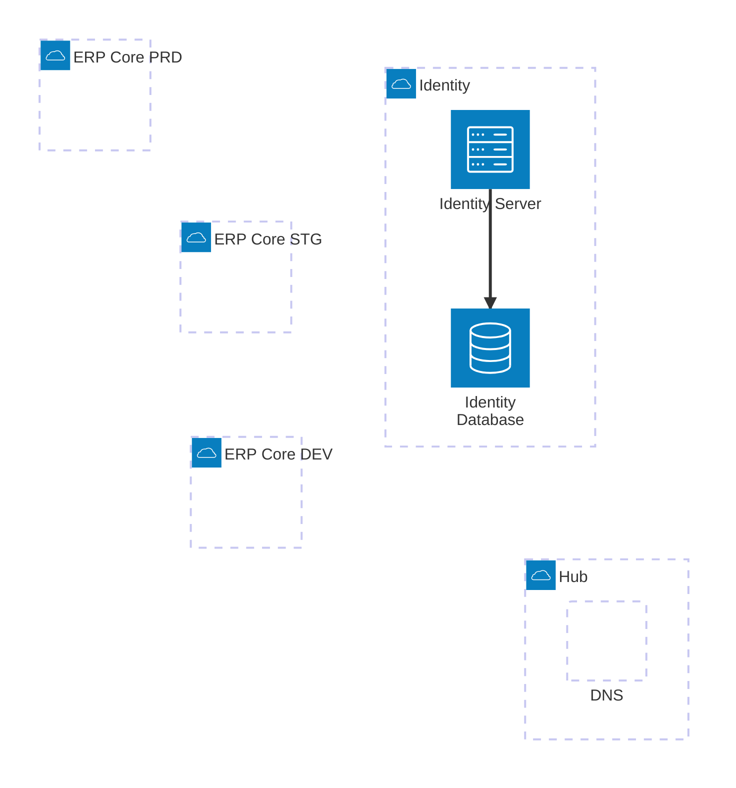

This is a rough design  implementation I'm looking at


## Dependency Graph 
```text
┌ Assimalign.Cohesion.{Libraries}
├ Assimalign.Cohesion.ApplicationModel
├───── Assimalign.Cohesion.ApplicationModel.Gateway
├───── Assimalign.Cohesion.ApplicationModel.Gateway.{Platform}
└────┬ Assimalign.Cohesion.{Resource}
     ├ Assimalign.Cohesion.{Resource}.{Feature}
     ├ Assimalign.Cohesion.{Resource}.Application
     └ Assimalign.Cohesion.{Resource}.ApplicationModel
```

`Assimalign.Cohesion.{Libraries}`
> - Represents the base libraries for building resources.

---

`Assimalign.Cohesion.ApplicationModel`
> - The base abstraction for the application model

---

`Assimalign.Cohesion.ApplicationModel.Gateway`
> - Represents a deployable application which is an orchestrator for handling container deployments
> - Default implementation will be for local development

---

`Assimalign.Cohesion.ApplicationModel.Gateway.{Platform}`
> - Represents a target orchestrator for specific platform such as: local (built in), kubernetes, docker, etc.

---

`Assimalign.Cohesion.{Resource}`
> - Represents the base abstraction for the resource implementation
> - No hard dependencies on either the `ApplicationModel` or `Libraries`

---

`Assimalign.Cohesion.{Resource}.{Feature}`
> - Feature extending the functionality on the base abstraction

! Issue - How to add features without relying on the `Assimalign.Cohesion.{Resource}.Application`

---

`Assimalign.Cohesion.{Resource}.Application`
> - Pulls together all the resources into a single executable
> - Can be used as a standalone application and does not have dependency on the application model


**Notes**
1. Migrate any project such as `Assimalign.Cohesion.{Resource}.Hosting` to a `Assimalign.Cohesion.{Resource}.Application` project

---

`Assimalign.Cohesion.{Resource}.ApplicationModel`
> - Generates a Metadata/manifest for Application Model Gateway to orchestrate the deployment
> - Tells the Gateway where to pull the application code and push to
> - The manifest generation should be generic so that any platform gateway can handle the deployment orchestration
> - Should have a custom code generation task within the Cohesion MSBuild SDK Targets that generates an object that can be used in gateway orchestration via extension method. Look at the code example below.

---

## Scenario
Real world scenario startup

External Dependencies
- Container Registry
- Source Control
- Platform (Hardware, Public IP, Networking)

Internal Dependencies
1. DNS Server
2. Identity Server
3. Database
4. Web App
5. EventHub
6. MessageHub
7. ..etc

```csharp
IApplicationBuilder builder = Application.CreateBuilder();

IApplicationResourceDescriptor dns = builder.AddDns("");

IApplicationResourceDescriptor identityHub = builder.AddIdentityHub("IdentityHub")
     .DependsOn(dns);

IApplicationResourceDescriptor adminWebApp = builder.AddWebApp("Administration")
     .DependsOn(identity);

IApplicationResourceDescriptor usersWebApp = builder.AddWebApp("Users")
     .DependsOn(identity);

IApplicationResourceDescriptor admin = builder.AddWebApp("Employees")
     .DependsOn(identity);

IApplication app = builder.Build();

app.UseK8s()

await app.RunAsync();
```

Unlike .NET Aspire, Cohesion will utilize the gateway to orchestrate the project publishing. The idea is similar to Kubernetes for managing container deployments. In essence the gateway get's packaged with the manifests of all the services


One of the main benefits code-first place where you declare your application’s services and their relationships. Instead of managing scattered configuration files, you describe the architecture in code 

I'm liking the plan but let's walk through some architecture scenarios, and see if our design holds up. The main 

## Scenario 1

