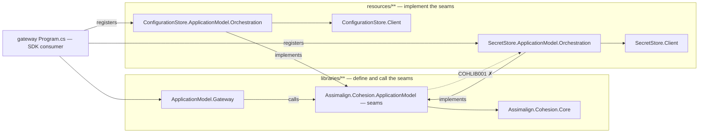

# Assimalign.Cohesion.ApplicationModel — DESIGN

> This is the per-library design record for the **Layer 1** ApplicationModel
> contract package. The current cross-package direction of record is
> [`DEVELOPER_EXPERIENCE_DESIGN.md`](../../../../docs/DEVELOPER_EXPERIENCE_DESIGN.md);
> the [ApplicationModel area design v3](../../../../docs/libraries/ApplicationModel/DESIGN.md) summarises the family. Read this file
> for the contracts that are implemented in this package and why they have this shape.

## What this library is

`Assimalign.Cohesion.ApplicationModel` is the **declarative + control-plane
contract package**: a `Core`-only set of interfaces and value objects that let an
author *declare a graph of resources* (the desired state) and hand it to a
*gateway* that *realizes* it. It contains **no hosting, DI, configuration, logging,
or platform code**, and depends only on `Assimalign.Cohesion.Core`.

Two planes share one vocabulary here:

- **Declarative plane** — `IApplication`, `IApplicationModel`, `IApplicationBuilder`,
  `IApplicationResource`, `ResourceManifest`, `IManifestResource`,
  `IPlannedResource`, the platform-neutral `ResourcePlan` records,
  `IApplicationResourceDescriptor`, and
  `IApplicationEnvironment`; plus the application-boundary contracts
  `ExternalResourceDeclaration`, `IExternalResource`, `IExternalResourceResolver`,
  and `RemoteReferenceOptions`. The older `IExecutableResource` /
  `IEndpointResource` / `IMountResource` capability interfaces remain as a
  compatibility surface for gateways and hand-written resources while resource
  areas move to generated manifests and plans.
- **Control plane** (contracts only; implementations live in the `…Gateway.*`
  packages) — `IApplicationGateway`, `IApplicationResourceController`,
  `IResourceControlContext`, `IApplicationResourceStateManager`,
  `IApplicationResourcePackager`, `IControlPlaneClient`,
  `IMultiModelApplicationGateway`, and the `IResourceArtifact` family.
- **Provider seams** (contracts only; the gateway calls them, opt-in resource-area packages
  implement them) — `ApplicationProviders` plus the store, certificate, trust, command-input,
  telemetry, credential, and caller seams described in
  [Provider seams](#provider-seams-explicit-registration).

The guided implementation surface is `PlannedResource`; resource-area types derive
from it and override `CreatePlan(PlanContext)` only when the generic trait mapping
is insufficient. The package also ships manifest records, immutable plan records,
typed deployer options, their source-generated JSON contexts, and the generated
identity wrappers `ResourceName`/`ResourceId` and `ApplicationName`/`EnvironmentName`.
The mutable authoring builder, descriptors, and collection remain internal; `Build()`
copies descriptor edges and manifest collections into the immutable model snapshot.

The internal application-environment implementation delegates explicit process values to Core's
`AppEnvironment`. With neither process variable nor `--environment` set, the apphost defaults to
`Local` before gateway selection (O36). Core's resource-runtime unset default stays `Production`.

`Local` identifies developer-machine execution; `Development` is a named deployed environment
with the same strict behavior as Staging and Production. `IsLocal` alone selects relaxed
realization, naming, and executable model-resolution paths; `IsDevelopment` identifies the
deployed name. `Application.CreateSet` and `ApplicationBuilder.UseGateway` retain the apphost's
Local default for every gateway, including Docker and Kubernetes. Gateway reselection resolves
explicit values again. Host resolution preserves Core's raw explicit value, including whitespace;
Local and InProcess additionally retain their existing blank-process-value fallback to Local.

`CohesionApplicationAttribute` records the SDK-selected application name in gateway assembly
metadata for build and tooling inspection. It is not a runtime discovery mechanism: generated
gateway code supplies the same identity directly to `Application.CreateBuilder(ApplicationName,
args)`, preserving the package's no-reflection boundary.

## Design intent and why-this-not-that

- **`IApplication` does not extend a host abstraction.** A host runs inside one
  process; an application is *described* then *realized* by a gateway across many
  processes/containers/pods it does not own. Conflating them forces single-process
  assumptions. `RunAsync` dispatches the requested mode: Run delegates realization
  and supervision to the gateway, while Describe writes the model with no platform
  contact. It hosts nothing itself.
- **The graph type is `IApplicationModel`, not `IApplicationContext`.** The name
  already existed in the code and `IApplication.Model` returns it; reintroducing a
  second "context" type was rejected as drift.
- **`Descriptors` is authoritative; `Resources` is a projection.** Dependency edges
  live on the descriptors (the gateway topologically sorts them); the model exposes
  `Resources` as a read-only one-to-one projection for convenience, and the mutable
  working collection lives only on the builder. At `Build()`, required same-application
  manifest references infer edges by exact application/resource identity; explicit C#
  `DependsOn` edges remain ordering-only and additive. Optional references never infer a
  gating edge, and cross-application references remain external. Surfacing a mutable `IList`
  on an "immutable desired state" was a contradiction that an early review caught. A built
  descriptor also carries its immutable `Plan`; an authoring descriptor has no plan until
  `Build()` completes planning.
- **Facts in manifests; realization in plans.** `ResourceManifest` mirrors the
  `cohesion/resource/v1` build artifact and contains resource facts only. At
  `Build()`, every resource produces a `cohesion/plan/v1` `ResourcePlan` from its
  manifest, deployer options, environment, and references. `GenericPlanner` is the
  inherited default: workload kind is explicit, volume mounts produce per-replica
  claims and a governing headless service, endpoints produce services, public
  endpoints produce exposures, and probes map one-for-one. Platform gateways compile
  this IR; they do not branch on resource kind or CLR type.
- **The planning path is visible at `Build()`.** `IPlannedResource.PlannerName`
  defaults to `GenericPlanner`; an area-owned planner overrides it with the full
  stable label (for example, `Database planner`). After each plan validates,
  `Build()` writes exactly one informational line to standard error in declaration
  order, preserving standard output for describe/render documents. A named area
  planner is paired with the selected gateway's stable platform identity
  (`appa-database: Database planner → kubernetes compiler`); the inherited or
  legacy fallback is always explicit (`worker: GenericPlanner`). No CLR-type
  inspection or platform-package reference is needed.
- **Typed escape hatches stop at deployer-owned facts.** `ResourceOptions` permits
  replica and storage-size overrides. `Build()` validates replicas against the
  manifest's `maxReplicas`, then runs `ResourcePlanValidator`; platform-specific
  knobs belong to the selected gateway's compiler and never enter a resource-area
  package.
- **`UseGateway` is mandatory — no reflection.** An earlier design reflected a
  default gateway when none was set; that would have propagated a
  `RequiresUnreferencedCode` marker onto `Build()` (the one API every consumer
  calls) and fought the repo's AOT mandate. `Build()` now throws a plain
  `InvalidOperationException` when no gateway is selected. Any future zero-config
  default must be a compile-time, source-generated registration, never a runtime
  probe.
- **Readiness is a level-triggered, plan-gate wait.**
  `IApplicationResourceStateManager.WaitForStateAsync` completes on **any** state in
  `descriptor.Plan.Workload.Gate.Terminals` with a per-resource budget and succeeds
  exactly when `Gate.Satisfying` contains the reached state. Long-running workloads
  satisfy on `Running`; a Job satisfies on `Stopped`, while `Stopped` remains a fast
  failure for every non-Job kind. `Degraded` is observed but is
  non-gating: it does not admit dependents initially and never re-gates them
  after initial readiness admitted them. A timeout returns the last observed state;
  caller cancellation throws `OperationCanceledException` and removes the waiter.
  The lifecycle enum is treated as a membership set, never an ordered lattice.
- **Controllers are plan-selected, level-triggered reconcilers.** `Build()` calls gateway
  `Validate(model)`, which asks registered overrides and then the platform controller
  `CanRealize(plan, out reason)` before any artifact gather. `ReconcileAsync` computes
  desired objects and applies them, idempotently, and returns; it does not own
  steady-state observation (that is a gateway's single informer) and does not block
  on readiness (the gateway gates on the state manager).
- **Typed artifacts, no discriminator downcasts.** `IResourceArtifact` is refined by
  `IExecutableArtifact` / `IContainerImageArtifact`; consumers request the concrete
  shape by type rather than switching on a kind enum and casting.

## External references and exported models

An application-boundary reference is represented by an ordinary resource node, not by a side
table. `ExternalResourceDeclaration` snapshots the target application, consumed endpoint names,
optionality, embedded manifest, and available same-application closure. Its `ManifestHash` and
`ClosureHash` are computed from the portable canonical manifest contract, excluding local paths
and other machine-specific artifact facts.

Generated gateway code may register a declaration through the infrastructure-only
`IApplicationBuilder.AddExternal` seam. Application code binds it with
`RemoteReference(ExternalResourceDeclaration, ...)`; the string overload creates a manifest-less
declaration. Both return the same `IApplicationResourceDescriptor` used by `DependsOn`, so the
external participates in topological ordering, readiness, and observed-endpoint injection like
any locally realized resource.

A manifest-less declaration has no build-time application identity to authenticate. Its selected
file or gateway binding is therefore the authority; resolution still requires the named resource
to be present in the export and in that export's embedded model. Manifest-backed declarations
add the stronger owner and canonical-hash checks.

The base bindings are static endpoints, an `export.json` file, a peer gateway address, or an
arbitrary `IExternalResourceResolver`. The effective resolver is selected in this order:

1. matching `--external` command-line binding;
2. matching `Cohesion__External__...` process-environment binding (colon aliases are accepted);
3. the resolver supplied by `RemoteReference`;
4. the unresolved resolver.

This makes deployment/environment input authoritative over source while leaving the C# binding
as a useful local default. A peer-gateway binding uses the transport-neutral
`IControlPlaneClient`; this package deliberately does not take an HTTP dependency. A
platform-specific importer can be supplied through `RemoteReferenceOptions.Bind` without adding
platform types to the contract package.

`IExternalResourceResolver.ResolveAsync` returns endpoints plus the provider manifest hash and
export schema version when known. The gateway controller owns policy: compatible resolutions are
`Running`; optional unresolved declarations are `Skipped`; required unresolved declarations stay
nonterminal until the per-resource readiness budget fails the startup gate; and a missing
referenced endpoint is `Failed`. A changed manifest hash with all referenced endpoints still
present is reported as `ManifestDrift` while remaining `Running`. Stop and delete detach only the
consumer's observed external state; they do not operate on the provider application.

There are two portable documents with different jobs:

- `ApplicationModelDocument` (`cohesion/model/v1`) is the immutable graph: invocation intent,
  dependencies, manifests, platform-neutral plans, and external declaration/closure/realization/
  binding metadata. Describe mode writes this document without contacting a platform, and an
  import retains static, file, and gateway `RemoteReference` bindings. An arbitrary resolver
  supplied through `Bind(...)` is deliberately emitted as unbound because executable code is not
  portable; the importing platform must contribute its binding again.
- `ApplicationExportDocument` (`schemaVersion: 1`) is public discovery: application/environment
  version, optional public JWK, resource manifest hashes, observed internal/public endpoints, and
  the complete model document. It has source-generated `Create`/`Parse`/`Load`/`Save`/`ToModel`
  paths and validates cross-document identity, hashes, kinds, and endpoint names.

`export.json` remains a storage convention rather than a side effect of this Layer-1 package.
`Assimalign.Cohesion.ApplicationModel.Gateway.ControlPlane` implements item 23a's authenticated
HTTP publication and fetch endpoints over this exact document. Kubernetes export/import remains
a platform integration and is not implemented here.

## Application-set composition

`Application.CreateSet(gateway, args)` requires an `IMultiModelApplicationGateway` and creates an
`IApplicationSet`. Each generated or hand-written `ApplicationDeclaration` pairs an application
identity with an `IApplicationModelResolver`. The supplied resolvers cover:

- `Executable(path)` — invoke the member gateway with `--mode describe`;
- `File(path)` — reconstruct the model embedded in an application export;
- `Gateway(address, client)` — obtain that export through `IControlPlaneClient`;
- `ControlPlane(executablePath, exportPath)` — use executable describe in Local and the
  exported model otherwise.

Member models are resolved at `RunAsync` start in declaration order. The set rejects duplicate
declarations and a resolver returning the wrong application identity, applies invocation-level
external overrides to each imported model, and binds an external targeting a sibling member through
`IApplicationSetExternalResourceResolver`. That direct observed-state lookup runs before the
external's configured control-plane/file/static resolver and falls back only when the sibling is
not observable. The set dispatches `Run`, `Apply`, or `Teardown` through the shared gateway;
`Describe` writes a JSON array of every member model without gateway contact; `Render` validates
the ordered collection and dispatches it through `IApplicationGatewayRenderer`; and `Bootstrap`
does the same through `IApplicationGatewayBootstrapper`. A single application dispatches those
optional capabilities with a one-model collection. An unsupported capability names the selected
gateway before any application-set gateway validation. The base
multi-model contract preserves model
order and requires state to be scoped by `(application, resource)`; equal resource identifiers in
different applications must not collide. SDK generation of `Applications.<Name>` is a consumer
convenience over this seam and is not required by the contract itself.

In Local, executable resolution applies `--realize` only after the first description shows
that the member declares the requested external. An imported export must already record a matching
external as realized, and the set rejects any requested name that no member realized.

A member's describe output carries no provider registrations. `AddApplication(declaration,
configure)` registers them for that member alone; the set invokes the callback after the member
resolves, attaches the frozen registrations to its model, and validates every member — registered or
not — before any gateway call. See *Provider seams*, "Two registration surfaces, one registration
container".

## Provider seams (explicit registration)

Libraries never depend on resources. Everything a gateway needs from a resource area at run time
— reading a `<source>:<key>` mount source, issuing a TLS leaf, persisting a trusted issuer,
rewriting a command payload, exporting telemetry, minting a credential, authenticating a
control-plane caller — is a seam defined here and implemented elsewhere. This package defines the
seams; `…ApplicationModel.Gateway` calls them; the shipped implementations live in opt-in
`Assimalign.Cohesion.<Area>.ApplicationModel.Orchestration` packages under `resources/<Area>/`,
which reference this package and their area's `<Area>.Client` and nothing in the Hosting or
Gateway families.

The diagram shows reference direction between the seams (defined in `libraries/**`) and their
implementers (in `resources/**`): the gateway references the seams to call them, every
orchestration package references the seams to implement them (and its area's client to reach
the resource), the SDK consumer's gateway `Program.cs` references the packages it registers, and
the seams reference only Core. The dotted edge is the one `COHLIB001` rejects — no project under
`libraries/**` may reference `resources/**`, so a seam never knows its implementers.



| Seam | Registered through | Called by the gateway to |
| --- | --- | --- |
| `IResourceSourceProvider` | `Providers.Sources["<source>"]` | read a Secret, certificate, or Configuration mount whose source is `<source>:<key>` |
| `IResourceCertificateAuthority` | `Providers.CertificateAuthority` | issue the TLS leaf of an endpoint whose certificate mount has no source |
| `ITrustedIssuerStore` | `Providers.TrustStore` | read and add the application's trusted peer issuers |
| `IResourceCommandInputResolver` | `Providers.CommandInputs` | rewrite a declared command payload (by command kind) before delivery |
| `ResourceTelemetrySink` | `Providers.Telemetry` | point every resource's OTLP export at a sink resource or an external address |
| `IApplicationCredentialIssuer` | `Providers.CredentialIssuer` | mint credentials before falling back to the default ES256 application key |
| `IApplicationCallerAuthenticator` | `Providers.Callers` | authenticate control-plane callers after the built-in trusted-issuer check |

`IResourceSourceResolver` runs the other way: the gateway implements it over the same `Sources`
registrations and hands it to each command-input resolver, so a resolver can turn a declared
`parameter:`/`<source>:<key>` expression into bytes without knowing how sources are resolved.

**Explicit registration only.** Nothing is injected by convention. A gateway `Program.cs`
references an orchestration package and calls its verb, which fills `builder.Providers`:

```csharp
IApplicationResourceDescriptor secrets = builder.AddResource(Manifests.Secrets);
IApplicationResourceDescriptor logs = builder.AddResource(Manifests.Logs);
builder.UseSecretStore(secrets).AsCertificateAuthority().AsTrustStore();
builder.Providers.Telemetry = ResourceTelemetrySink.FromResource(logs);
```

Anything the shipped packages do not cover is a hand-written provider assigned to the same
members. `parameter:` and `literal:` stay built into the gateway and can never be registered.

**Why an open provider bag and not a gateway option or a convention.** The previous design gave
the gateway a single store client and discovered stores by manifest kind, which put area wire
knowledge (paths, command kinds, file names) in a library and made every area a hidden dependency
of the gateway. Registrations on the model keep the library area-neutral, keep the dependency on
the consumer's side of the line, and let a developer bring an implementation without forking the
gateway. The cost is that an unregistered provider is now an error the developer must fix rather
than something that silently works; `Build()`-time validation makes that error immediate and
names the package to reference.

**Why `ApplicationProviders` is a class and not an interface.** It is a registration container,
not a behaviour: consumers never substitute it, and a frozen snapshot has to be copied by this
package. The behaviours are the seams, and those are interfaces.

**Resource-backed or outside the model.** A provider that declares a non-null `ResourceKind`
must be bound to a resource of the declaring application with that manifest kind; the gateway
waits for that resource to be Running and hands the provider a `ResourceProviderConnection` —
the observed control-plane address, the resource's audience-bound `ResourceAccess` bearer
credential for the reconcile pass (minted through the credential issuer; see *Identity*), and the
application's transport validator. A provider with a null
`ResourceKind` does not require a model resource: registered under a name that is no model
resource (for example `vault`), it lives outside the model, authenticates itself, and receives a
`null` connection. `ResourceProviderBinding<T>` carries the same choice for the certificate
authority and trust store (`Resource = null` means outside the model).

**Defaults when nothing is registered.** Unbound certificate authority: the gateway's
development CA in Local only, a loud failure elsewhere — never a silent downgrade. The authority
resource's own leaf always comes from the gateway CA, because it cannot issue its first leaf.
Unbound trust store: the Local-only `trusted-issuers.json` file under the application's state
directory; trust grants fail elsewhere. No telemetry sink: no telemetry variables are injected. No
credential issuer (or an issuer returning `null`): the default ES256 application-key issuer. No
command-input resolver for a kind: the payload is delivered as declared — unless the target's
manifest marks that kind `RequiresInputResolver`, in which case `Build()` (or the set, for a member)
fails first (rule 5 below).

**Freeze semantics.** `IApplicationBuilder.Providers` is mutable while authoring. `Build()` copies
it into the model as a frozen snapshot (`IApplicationModel.Providers`): `Sources`,
`CommandInputs`, and `Callers` become read-only collections (`NotSupportedException` on
mutation) and every setter throws `InvalidOperationException`. Later builder registrations never
reach an already-built model. `ApplicationProviders.Empty` is frozen and is the default-interface
value of `IApplicationModel.Providers`. Providers are code, so `ApplicationModelDocument` never
carries them: an imported model — every application-set member resolved from a describe output
and every export — has `Empty`.

**Two registration surfaces, one registration container.** An application built in code registers
on `IApplicationBuilder.Providers`. `IApplicationProviderBuilder` is the provider-registration
surface of one application-set member: `Application` (its name), `Providers` (the mutable
registrations), and `TryGetResourceManifest(name, out manifest)` (a lookup of the application's
resources so a verb can check a store's kind before binding it). They are separate interfaces
(owner decision O45, 2026-09-27): `IApplicationBuilder` does not extend `IApplicationProviderBuilder`
and has no `Application` or `TryGetResourceManifest`, because a builder's verbs bind the resource
descriptors it created, while a member has no descriptors and binds stores by `ResourceName`. The
internal default builder implements both (its `Application` is `null` until it is named), so code
holding it can still cast it to `IApplicationProviderBuilder`. An application set hands a member its
surface through `IApplicationSet.AddApplication(declaration, configure)`:

```csharp
IApplicationSet set = Application.CreateSet(new LocalGateway(options), args)
    .AddApplication(Applications.Platform, platform => platform
        .UseSecretStore("platform-secrets")
        .AsCertificateAuthority()
        .AsTrustStore())
    .AddApplication(Applications.AppA, appa =>
    {
        appa.UseConfigurationStore("appa-configuration");
        appa.Providers.Telemetry = ResourceTelemetrySink.FromResource("appa-logs");
    })
    .AddApplication(Applications.AppB);
```

`RunAsync` resolves each member in declaration order and, right after the member's model resolves,
invokes that member's callback with a fresh surface over the resolved model, so `TryGetResourceManifest`
sees the member's resources. When the callback returns, the set freezes the registrations (a
registration made later through a kept reference throws), attaches them to that member's model
alone (an internal wrapper that forwards every other member of `IApplicationModel`, so descriptors,
resources, manifests, and plans keep their identity), and runs the same
`ApplicationProviderValidation` `Build()` runs. Orchestration verbs take a resource name for this
surface (`UseSecretStore("secrets")`, `UseConfigurationStore("settings")`), and
`ResourceTelemetrySink.FromResource(ResourceName, endpoint)` names a sink the same way, because a
member has no descriptors. An application built in code uses the descriptor forms instead
(`builder.UseSecretStore(secrets)`, `builder.UseConfigurationStore(settings)`,
`ResourceTelemetrySink.FromResource(descriptor, endpoint)`). Both forms write the same
`ApplicationProviders`, and the handle `UseSecretStore` returns, `SecretStoreProviderBuilder`,
exposes that instance as `Providers`, so `.AsCertificateAuthority()` and `.AsTrustStore()` chain the
same way on either surface.

**Never inherited by name.** A member gets exactly what its own callback registered — never the
registrations of another member, of the set, or of the member's own gateway (lost with its describe
output) — even when two members declare a store of the same name. The set validates every member
at start, in every run mode, whether or not it registers anything, as `Build()` validates a builder
whatever mode it runs in: a store-backed member without a registration fails before the gateway is
contacted, with a message that starts `Application-set member '<name>' has invalid provider
registrations.` and names the package and the `set.AddApplication(Applications.<Member>, application
=> application.Use<Area>("<store>"))` registration. A callback failure is wrapped the same way
(`Application-set member '<name>' could not register its providers: ...`). A member whose resolver
returns a model that already carries registrations (a custom in-memory resolver over a built model)
keeps them when added without a callback; adding it with a callback as well is rejected, so
registrations for one application live in one place. The cross-application rule is unchanged: a
member may not bind another application's resource — including a Local `--realize` closure's — and
the gateway still refuses a closure resource's `<source>:<key>` mounts at resolution (see the
gateway design, *Imported models and provider registrations*).

**Build-time validation.** `ApplicationProviderValidation.Validate(model)` (internal) enforces:

1. every `<source>:<key>` mount source of the application's own manifests (manifest
   `Application` equals the model name) has a `Sources` registration; `parameter:` and `literal:`
   are exempt, and a mount with no source needs no provider (an endpoint certificate mount
   without a source is issued by the certificate authority or the Local dev CA). A missing
   registration names the source and, when the source is a model resource of kind `K`, says to
   reference `Assimalign.Cohesion.K.ApplicationModel.Orchestration` and call `builder.UseK(...)`;
2. a provider with a non-null `ResourceKind` names an existing resource of the application whose
   manifest kind matches (ordinal, case-insensitive — the gateway's existing kind comparison);
3. no mount source or binding names a resource of another application — a manifest reference
   into another application, a remote reference, or an external. Cross-application store sources
   are rejected for now (owner decision 4) and return as a follow-up once the store resources
   support cross-application callers;
4. a resource telemetry sink belongs to the application and declares the named endpoint;
5. every declared command whose **target's** manifest marks its kind
   `ResourceManifestCommand.RequiresInputResolver` has an `IResourceCommandInputResolver` for that
   kind in the **declaring** application's `CommandInputs` — the resolvers the gateway uses at
   delivery whether the target is the application's own resource or another application's. For an
   own target of kind `K` the error names the command, its key, and the target, and says to reference
   `Assimalign.Cohesion.K.ApplicationModel.Orchestration` and call `builder.UseK(...)`; for another
   application's target, where `UseK` would be a cross-application binding (rule 3), it asks for an
   `IResourceCommandInputResolver` in `Providers.CommandInputs` instead. A kind the target does not
   flag needs no resolver and is still delivered as declared (see *Declarative resource commands*).

Every failure is an `InvalidOperationException`. `Build()` runs the validation after the graph,
manifests, commands, and plans validate and before it asks the selected gateway to validate the
model, so a gateway never receives a model whose registrations are inconsistent, and the error names
the package and verb to reference. An application set runs the same validation for each member at
`RunAsync` start, after it attaches that member's registrations, with the same rules; the message is
prefixed with the member name and its hint names the member's `AddApplication(..., configure)`
callback instead of `builder.Use<Area>(...)`. The resources of a Local `--realize` closure belong to
another application, whose manifests rule 1 does not check; the gateway fails their
`<source>:<key>` mounts at resolution, naming the realized application and the cross-application
limit, and fails the mounts of any model that reaches it without the needed registration (one handed
to it directly rather than through `Build()` or a set), naming the missing registration. A flagged
command in such a model is delivered as declared and the target refuses the unresolved payload;
SecretStore keeps that rejection of an unresolved `secretstore.add-secret` as defense in depth. A
model's registrations apply only to resources of its own application.

**Identity.** `IApplicationCredentialIssuer` covers every credential the gateway mints, tagged by
`ApplicationCredentialPurpose` (`ResourceBootstrap`, `ResourceAccess`, `Telemetry`,
`RemoteCommand`, `PeerControlPlane`, `Developer`). An issuer that returns `null` defers that
request to the default ES256 application-key issuer, so an IdP can take over one purpose at a
time. Resources verify what it issues, so an application that registers an issuer must register a
matching credential verifier on its resources (`Hosting.Resources`, resource side). Callers of the
gateway control plane go through the built-in trusted-issuer authenticator first and then each
`IApplicationCallerAuthenticator` in order; `ApplicationCallerStatus.NoResult` falls through,
the other statuses are final, and area/command checks apply to the mapped `ApplicationCaller`.
The shipped gateway consults both: every credential it mints goes through
`Providers.CredentialIssuer` (gateway design, *Identity seams*), and its served control plane runs
`Providers.Callers` after the built-in authenticator (ControlPlane design, *Caller
authentication*). With neither registered, every credential and every control-plane response is
what it was before the seams existed.

Using them from a gateway `Program.cs` — an identity provider that takes over the credentials the
application's resources receive (bootstrap and access), and whose tokens peers and developers may
present to this gateway's control plane:

```csharp
builder.Providers.CredentialIssuer = new IdpCredentialIssuer(idp);   // null for purposes it leaves to the default
builder.Providers.Callers.Add(new IdpCallerAuthenticator(idp));     // NoResult for tokens it does not recognize
```

```csharp
sealed class IdpCredentialIssuer : IApplicationCredentialIssuer
{
    private readonly IdentityProviderClient _idp;

    public IdpCredentialIssuer(IdentityProviderClient idp)
    {
        _idp = idp;
    }

    public async ValueTask<ApplicationCredential?> IssueAsync(
        ApplicationCredentialRequest request,
        CancellationToken cancellationToken = default) =>
        request.Purpose is ApplicationCredentialPurpose.ResourceBootstrap or ApplicationCredentialPurpose.ResourceAccess
            ? await _idp.IssueBearerAsync(request.Audience, request.Subject, request.Lifetime, cancellationToken)
            : null;
}
```

The request carries the audience, subject, and lifetime the default issuer would use for that
purpose (the table on `IApplicationCredentialIssuer`). Every carrier except the telemetry headers
document presents the credential as `Authorization: Bearer`, so the gateway refuses another scheme
for those purposes. An authenticator maps a credential it recognizes to an `ApplicationCaller`
(`Peer` with an `Application` to use command routes, `Developer` for read-only discovery) and
returns `NoResult` for anything else. **Resources verify what the issuer mints:** a resource that
receives an IdP-issued bootstrap, access, or telemetry credential registers a matching
`IResourceCredentialVerifier` with `ResourceRuntime.RegisterCredentialVerifier(Assembly, factory)`
before building its area application
([Hosting.Resources DESIGN.md](../../../Hosting/Assimalign.Cohesion.Hosting.Resources/docs/DESIGN.md#resource-credential-verification);
[RUNTIME_CONTRACT.md, Resource credentials](../../../../docs/RUNTIME_CONTRACT.md#resource-credentials)).
The area hosting modules consult it first and fall back to application-key verification on
`NoResult`, so both kinds of credential can coexist while an identity provider takes over.
An `Authenticated` `ApplicationCallerResult` cannot be constructed without its caller (it throws
`ArgumentException`); a `with` expression can still produce one, and the gateway control plane
treats that as a defect (`500`), so no authenticator can pass the gateway an authenticated result
with no identity to check. `ApplicationCaller.AllowedCommandKinds` follows `TrustedIssuer`: an empty list
permits every command kind, so an authenticator that means "no commands" must forbid the caller
rather than return an empty list.

`TrustedIssuer` lives here (moved from `…ApplicationModel.Gateway`) because `ITrustedIssuerStore`
and `IApplicationCallerAuthenticator` name it; it is BCL-only (ES256 JWK validation over
`System.Text.Json` and `System.Security.Cryptography`), so the Core-only boundary is unchanged.

**Secrets in values.** `ResourceProviderConnection`, `ApplicationCredential`,
`ApplicationCallerRequest`, and `ResourceCertificate` (whose bundle carries a private key) redact
those members from their record `ToString()`, so logging a request never logs the credential.

## Lifecycle and error model

- `Application.CreateBuilder(ApplicationName, args)` → fluent
  `AddResource(...).DependsOn(...)` + `UseGateway(...)` → `Build()`. `UseName`
  remains available for callers that start from the parameterless overload. Invocation intent
  carried by the immutable model includes `--adopt` ownership consent and
  `--restart-orphans` local-process recovery policy; platform gateways decide how to realize it.
- `--realize <external>` is validated during `Build()`. It is accepted only in Local for
  gateway identities `local`, `inprocess`, and `docker`, requires an embedded target manifest,
  and replaces the requested external plus its reachable same-application closure with ordinary
  planned resources. Cross-application references discovered within that closure remain external,
  and realized members retain their original application identity for runtime naming.
- After run cancellation, `CohesionApplication` lets the selected gateway apply its own
  per-resource stop budgets. It does not impose one 30-second outer timeout across a
  reverse-ordered resource set, which would truncate later resources' declared grace periods.
  Cancellation that arrives while gateway startup is still blocked is handled identically: the
  partially started session is stopped without uninstalling persistent resources, and Run
  completes after that stop rather than surfacing lifetime cancellation as startup failure.
- `Build()` validates: unique resource names (enforced eagerly on `AddResource`),
  at least one realized resource, all explicit dependencies and required manifest references
  present, no dependency cycles
  (DFS), a selected gateway, an RFC 1123 application name, each typed override,
  every computed plan, and the provider registrations (above), then asks the selected gateway to
  validate realizability. Planning
  deliberately happens here rather than in MSBuild or
  when the resource is added.
  Every failure is an `InvalidOperationException` with an actionable message; there
  are no custom exception types in this library (an area-scoped root can be added
  later if the surface grows).
- In Run mode, `IApplication.RunAsync` mirrors `Host<TContext>.RunAsync`: a linked
  `CancellationTokenSource` plus a `TaskCompletionSource` completed on cancellation.
  It `StartAsync`es the gateway, awaits cancellation, then `StopAsync`es supervision
  using the gateway's own resource-aware stop bounds. Stop retains persistent platform objects;
  Apply performs a reconcile pass and Teardown dispatches `UninstallAsync(model)`. Describe emits the model document
  (or the declaration-ordered document array for an application set) and never contacts the selected
  gateway. Render and Bootstrap use optional gateway capabilities, receive the original cancellation
  token, write to standard output, and remain platform-contact-free.

## AOT posture

This package is `Core`-only and AOT-clean: capability matching is `is`-based and
there is **no reflection-based serialization**. Manifest, plan, and describe-mode
model documents use explicit `JsonSerializerContext` contracts. Entry-assembly name
fallback is used only in Local and is slugged before validation; assembly
attributes are never read at run time. The generated value types use
`System.Text.Json` converters that are source-emitted, not reflection-based.

**Note on the family:** the sibling `…Gateway` base is also AOT-gated. Platform packages own
their own AOT posture; this package neither references nor asserts an implementation status for
Docker or Kubernetes integrations.

## Family relationships

- `…ApplicationModel.Gateway` (Layer 2a) — the guided `ApplicationGateway` base +
  `LocalGateway`; implements the control-plane contracts defined here.
- `…ApplicationModel.Gateway.ControlPlane` — the hosting-free authenticated HTTP server/client
  behind `Gateway(...)`, plus the resource command dispatch seam.
- `…ApplicationModel.Gateway.{Platform}` (Layer 2b) — platform compilers and controllers supplied
  outside this contract package.
- `{Resource}.ApplicationModel` — guarded, NuGet-only declarative packages referencing
  `ApplicationModel` and `Hosting.Resources` directly; they
  provide a typed `PlannedResource`, `Add{Resource}(manifest, options)`, the area's
  planner when it differs from `GenericPlanner`, and the resource-side default
  control-plane contract served by `{Resource}.Hosting`.
- `{Resource}.ApplicationModel.Orchestration` — opt-in, NuGet-only packages that implement the
  [provider seams](#provider-seams-explicit-registration) over their area's `{Resource}.Client`
  and register them through an explicit `Use{Resource}(...)` verb. They reference this package
  and the client only — never Hosting, the gateway family, or `{Resource}.ApplicationModel`.

## Non-goals

- Hosting a process (DI/Config/Logging composition stays in `{Resource}.Hosting`).
- Building container images (delegated to the SDK container tooling, upstream, per
  resource).
- Referencing or rebuilding any `{Resource}.Hosting` runtime — an out-of-process orchestrator
  only needs contracts, manifests/plans, and deployable artifacts.
- Platform object formats, Kubernetes types, and process supervision — those live
  in gateway/compiler packages. The platform-neutral resource manifest, realization
  plan, and describe-mode model document are contracts of this package.
- Area wire knowledge — store paths, command kinds, trust file formats, or any resource kind
  name. Those belong to the orchestration package that implements a provider seam.
- Cross-application store sources and providers, for now. A mount source or provider binding
  that names another application's resource is rejected; supporting it waits on the store
  resources accepting cross-application callers.

## Declarative resource commands (T7a)

`IResourceCommand` records desired state owned by the declaring application. Its target is
an exact resource instance in that application's graph, including external nodes.
`ResourceCommands.Create` requires source-generated `JsonTypeInfo<T>` metadata, snapshots
UTF-8 JSON, sorts object properties ordinally at every nesting level, and derives a lowercase
SHA-256 id from length-prefixed command kind, target application/resource identity, and canonical
payload bytes. Changing a payload changes the id; `Owner`, the nonblank provider conflict `Key`,
and `Optional` remain separate ownership and gating facts. The typed area verbs include their
logical key fields in the payload. Payloads are copied when created and again when the model is built.

`IResourceCommandDescriptor` is an additive authoring seam. Area-owned descriptor interfaces
extend it and internal wrappers delegate command accumulation to the original descriptor.
`IApplicationBuilder.AddCommand` also accepts an explicit declaration. `Build()` checks the
owner against the declaring model, exact target graph membership, accepted manifest command
kinds, nonblank keys, duplicate ids, and conflicting declarations for the same target/key,
regardless of command kind. One desired graph declares one operation per provider ownership
key; a subsequent model can replace or withdraw that operation. The model and each built command descriptor expose
read-only command snapshots; built descriptors reject subsequent mutation.

**Commands resolved before delivery (owner decision, 2026-09-28).** A resource that accepts a
command only in its resolved form says so in its own manifest:
`ResourceManifestCommand.RequiresInputResolver`. In `resource.json` a command is still a string
holding its kind; only a flagged command is the object `{ "kind": "...", "requiresInputResolver": true }`,
so a manifest without the flag serializes byte-identically to before. The reader accepts both forms
and rejects unknown properties, a missing, empty, or non-string `kind`, and a non-boolean flag;
`assets/schemas/cohesion.resource.schema.json` declares the same two forms as a `oneOf`. The SDK
writes the flag from `RequiresInputResolver` metadata on a `CohesionCommand` item:
`Assimalign.Cohesion.Sdk.SecretStore` sets it on `secretstore.add-secret`, whose payload names a
`parameter:<name>` or `<store>:<key>` source, and leaves `secretstore.issue-certificate` unflagged.
Provider validation rule 5 (*Provider seams*) turns a flagged command whose declaring application
registered no resolver for its kind into a `Build()` or set-start error that names the package and
verb, where it used to surface only as a Rejected observation at delivery. The requirement is the
accepting resource's fact, so the check reads only the target's manifest and this package names no
area command kind. An unflagged kind with no resolver is still delivered as declared, and a
resource's own rejection of an unresolved payload stays as defense in depth.

Dependency normalization accepts an older wrapper that exposes the exact registered `Resource`
instance. This preserves unchanged SecretStore-style wrappers without requiring them to implement
a new interface. Matching names or value equality never establish graph membership. New typed
wrappers preserve the same invariant, including when a remote reference is rebound.

`ApplicationModelDocument.Commands` retains declarations through describe/export/application-set
roundtrips, validates canonical bytes and deterministic ids on import, and maps each imported
target back to that imported model's resource instance. Old documents without commands import an
empty list. These portable payloads are desired state and must never contain secret material;
this slice supplies database names/principal names and nonsecret configuration values only.
Observed command status is a separate resource state-manager contract.

Command execution belongs to the gateway after Running and before dependent reconciliation.
Area default-control-plane handlers retain ownership and reject unsupported mutation capabilities.
The contract package adds no client, hosting, DI, platform, or runtime serialization dependency.
`IControlPlaneExternalResourceResolver` exposes a peer gateway address without exposing the
internal resolver implementation. In application sets the direct sibling resolver preserves its
fallback's peer address, so generic command delivery can select a peer only when no sibling target
is available. Static and file bindings expose no control-plane address. Exports validate observed
command target membership, required identity fields, defined statuses and duplicate target/owner/id
tuples. A rejected unsupported command kind is valid audit data even without a desired declaration.

## Trust grant command options

GatewayCommand carries an immutable AllowedCommandKinds list. Repeatable, comma-separated
--allow options are valid only in trust-add mode. Absent or empty grants mean unrestricted kinds;
trust-issue rejects the option. ApplicationModel parses and carries policy; the serving gateway
enforces it on apply and delete. The CLI's --against option remains deferred.

## HTTPS certificate plan fact (31t)

PortBinding carries optional `Certificate` after `Scheme`, retaining the original three-argument constructor and deconstruction. GenericPlanner copies the manifest value or an empty string. Validation is per endpoint: values must match, and nonempty values other than reserved `public` must identify a Secret MountBinding. ResourceManifest's existing Secret-only rule is unchanged. An HTTPS Secret mount adds no VolumeSpec and does not turn a Deployment into a StatefulSet. ResourceInputs additionally carries certificates-only transport trust bytes beside the bootstrap credential, outside the hashed plan.
