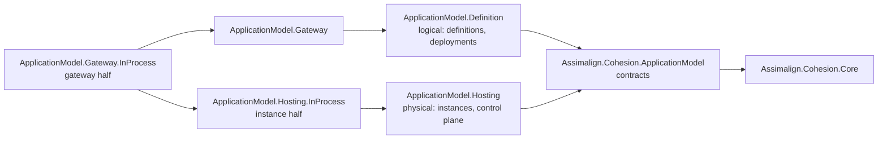

# Assimalign.Cohesion.ApplicationModel — Design

> **Status (2026-10-29):** created when the application model was split into contracts,
> definitions, and hosting (ApplicationModel.Definition D20). Its types came from
> Hosting.Resources, which the split removed; their history is in
> [ApplicationModel.Hosting](../../Assimalign.Cohesion.ApplicationModel.Hosting/docs/DESIGN.md)'s
> decisions. Until the split this project held the logical model, now in
> [ApplicationModel.Definition](../../Assimalign.Cohesion.ApplicationModel.Definition/docs/DESIGN.md).

## Purpose

A resource takes three forms: its definition, which a model declares; its deployment, a gateway's
view of it across its instances; and each instance, one running copy. This library holds what the
three share and what a gateway and an instance exchange, and nothing either side does on its own.
It references Core only.

The arrow below means "references". The logical side and the physical side both reference the
contracts, and neither references the other. A platform is a pair of packages, one on each side:
the in-process platform's instance half references Hosting, and its gateway half references both
the Gateway and that instance half (C5).

```mermaid
flowchart LR
    Gateway["ApplicationModel.Gateway"] --> Definition["ApplicationModel.Definition<br/>logical: definitions, deployments"]
    Definition --> Contracts["Assimalign.Cohesion.ApplicationModel<br/>contracts"]
    Hosting["ApplicationModel.Hosting<br/>physical: instances, control plane"] --> Contracts
    Contracts --> Core["Assimalign.Cohesion.Core"]
    HostingInProcess["ApplicationModel.Hosting.InProcess<br/>instance half"] --> Hosting
    GatewayInProcess["ApplicationModel.Gateway.InProcess<br/>gateway half"] --> Gateway
    GatewayInProcess --> HostingInProcess
```

## The types

| Type | Role |
| --- | --- |
| `IApplicationResource` | The base of the three forms: `Provider`, `Name`, and the `Id` derived from them. |
| `ProviderName`, `ProviderId`, `ResourceName`, `ResourceId`, `InstanceKey`, `ActionName`, `DeploymentId` | Identity value objects. Ids are version 5 UUIDs of the names; an instance key is a ULID per process start; a deployment id is a version 5 UUID of what a gateway deployed (ApplicationModel.Gateway G34). |
| `PlatformName` | Names a platform, such as `inprocess` or `kubernetes`: what a gateway deploys onto, when an extension applies, and which client an instance reaches its gateway through (C5). It moved here from Definition so both halves of a platform share it. |
| `ApplicationInstanceManifest`, `ApplicationActionDescriptor`, `ApplicationActionKind` | What an instance publishes about itself: its identity, key, the deployment that started it, where its gateway reaches its control plane (C5), and its actions. |
| `ApplicationActionContext`, `ApplicationActionResult`, `ApplicationActionStatus` | One invocation of an action, on an instance or a gateway's infrastructure action, and its outcome. |
| `ApplicationActionSnapshot` | One action's state after a write, as a gateway records and replays it. |
| `IApplicationContentSerializer`, `ApplicationContentException` | The format of action content, and the refusal of content that does not bind. |
| `JsonApplicationContentSerializer` | The default serializer: UTF-8 JSON through source-generated contexts, this library's own first. An instance's control plane writes with it, and a platform that carries content between processes can too. |
| `IApplicationInstancePublisher`, `ApplicationInstancePublication` | Instance to gateway: the seam an instance publishes through, which a gateway implements, and its answer: the snapshots to restore and a lease. |
| `IApplicationInstanceClient` | Gateway to instance: how a gateway runs an action on an instance and restores a write there. A platform's gateway half implements it. |

## Decisions

**C1 — Only what both sides exchange.** A type belongs here when the logical and the physical side
both use it, or when it crosses between them. `IApplicationResourceInstance`, the control plane, and
health contributors stay with the instance (ApplicationModel.Hosting) because no gateway uses them;
the definition and the model stay with ApplicationModel.Definition, and the deployment with
ApplicationModel.Gateway, because no instance uses them. A contract that only one side needs is a dependency the other side carries
for nothing.

**C2 — One copy of each type.** Both sides reference this assembly instead of compiling shared
source, so a manifest an in-process instance publishes is the same type the gateway registers, and
code that sees both sides has no two types of one name. *Rejected:* linking the files into both
sides, which would compile a public copy of each type into each assembly.

**C3 — The namespace is the model's.** The types declare `Assimalign.Cohesion.ApplicationModel`, the
namespace ApplicationModel.Definition shares, so a gateway program composes with one `using`.

**C4 — One prefix, then the concept (2026-10-29).** Every type of the model starts with `Application`,
followed by the concept it is: `ApplicationActionResult`, `IApplicationContentSerializer`. `Instance`,
`Resource`, or `Gateway` follows `Application` only where the bare concept would collide or mislead:
- the instance's manifest, publisher, and publication (`ApplicationManifest` is the application's);
- its actions (the gateway's infrastructure action is `IApplicationResourceAction`);
- its host service;
- its control plane (the gateway is the application's control plane).

Value objects carry no prefix, only the noun they identify and `Name`, `Id`, or `Key`: `ResourceName`,
`InstanceKey`, `ActionName`, `Permission`. The same rule names the definition's and the gateway's
types (`ApplicationGatewayRole`, `ApplicationGatewayRecord`, `IApplicationGatewayStore`). Until
this decision the contracts and the instance side were `Resource`-prefixed (`ResourceManifest`,
`IResourceControlPlane`), beside the `IApplicationResource` family.

*Rejected:*
- `ApplicationResource` before every resource-level name: it collides with `ApplicationResourceManifest`
  and `IApplicationResourceAction`, and adds eleven characters to each name.
- `Resource` as the only prefix: it would undo the `IApplicationResource` family.

**C5 — A platform owns the transport between an instance and its gateway, both ways (2026-10-30,
owner).** The core packages carry no transport. This library holds the two client seams a platform
implements, one per direction: `IApplicationInstancePublisher` (an instance publishes and renews) and
`IApplicationInstanceClient` (a gateway runs an action and restores a write, ApplicationModel.Gateway
G38). Each platform is a pair of packages, because one package cannot serve both sides without a
resource carrying the gateway:
- **The instance half**, which a resource opts into in its area builder (`resource =>
  resource.UseInProcess()`), is a gateway client (`IApplicationGatewayClient`, ApplicationModel.Hosting
  D19). It publishes the instance's manifest and carries the gateway's calls in.
- **The gateway half**, which the gateway opts into in its builder, is the gateway's infrastructure,
  its transport, and its instance client.
- **Selection.** A resource that runs on several platforms opts into each; an instance uses the
  client of the platform its gateway names (`AppEnvironment.Variables.Gateway`, a `PlatformName`).
  None named runs it unmanaged; a name it has no client for fails its build.
- **Address.** The manifest's `ControlPlaneEndpoint` is where the gateway reaches the control plane
  in the platform's own terms; the instance's client names it, and only the platform's instance
  client reads it. In process it is the gateway's in-process endpoint. An instance whose manifest
  names none cannot be called; it receives a write when it next publishes.
- **Content.** An invocation's content crosses as bytes, which the instance's control plane reads
  with its own serializer, whether or not a process boundary lies between them.

So an area does no transport: Web exposes its settings as actions and nothing else. The in-process
platform runs on direct calls in both directions (ApplicationModel.Hosting.InProcess,
ApplicationModel.Gateway.InProcess). No platform runs a resource out of process yet, so no HTTP
binding exists; the first one defines its transport, push or pull, and its authentication.
*Superseded:* the earlier C5 of the same day, an HTTP control-plane binding (`GET /manifest`,
`GET|POST /actions/{name}`, `PUT /state/{name}`) that every area served on its own listener and the
gateway's default client called, and the plan to give that client a private Web reference (owner,
2026-10-30). *Rejected:* one package per platform for both halves; a resource that references it
carries the gateway and the logical model.

## AOT

No reflection or runtime code generation. The value objects carry their own JSON converters, and
`ApplicationActionSnapshot` and `ApplicationActionResult` carry hand-written ones for their wire form.

## Diagnostics

None. The library raises no events.

## Open questions

None of its own yet; the model's questions are in ApplicationModel.Definition and
ApplicationModel.Hosting.
