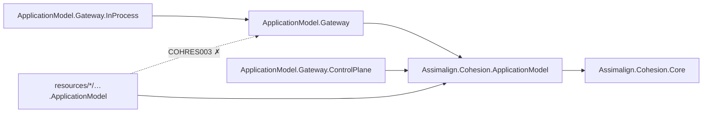

# ApplicationModel Library Area

The L2 application-composition and orchestration plane: the declarative application model every
resource area's `<Area>.ApplicationModel` package builds on, plus the gateway family that
describes and realizes resource manifests without loading their runtimes.

The area's architecture record lives in
[docs/libraries/ApplicationModel/DESIGN.md](../../docs/libraries/ApplicationModel/DESIGN.md);
this README is the project map. The signed
[developer-experience design](../../docs/DEVELOPER_EXPERIENCE_DESIGN.md) is the direction of
record and wins on every conflict. The full reference graph for every Cohesion assembly is in
[docs/DEPENDENCIES.md](../../docs/DEPENDENCIES.md).

## Layering

In the repo's L1/L2/L3 model (see [docs/programs/DELIVERY_ROADMAP.md](../../docs/programs/DELIVERY_ROADMAP.md)),
this area is **L2 — application runtime and composition**: it sits above the L1 foundation
libraries (`Core`, `Hosting`) and below every L3 service platform under `resources/`.

## Project map

The arrow means "references": `Gateway.InProcess --> Gateway` reads "`Gateway.InProcess`
references `Gateway`". The gateway packages layer onto the base model; nothing in the base model
references a gateway.

Solid edges are the references the layering permits. The dotted edge is the one `COHRES003`
rejects: no shipped project under `resources/**` may resolve an
`Assimalign.Cohesion.ApplicationModel.Gateway*` assembly, because gateway orchestration belongs
outside resource-area packages. That prohibition has no opt-out and no exemption property.

| Project | Role |
| --- | --- |
| `Assimalign.Cohesion.ApplicationModel` | The declarative application model: resources, descriptors, manifests, the plan IR, and the planner contracts every area's `<Area>.ApplicationModel` composes against |
| `Assimalign.Cohesion.ApplicationModel.Gateway` | The out-of-process gateway base: describe and realize resource manifests without loading their runtimes |
| `Assimalign.Cohesion.ApplicationModel.Gateway.InProcess` | The in-process Composite plan controller — compiles the supported in-process subset of a Composite plan |
| `Assimalign.Cohesion.ApplicationModel.Gateway.ControlPlane` | The gateway-side control-plane contract that a resource's default control plane is reached through |

## Further reading

- [docs/libraries/ApplicationModel/DESIGN.md](../../docs/libraries/ApplicationModel/DESIGN.md) — the area architecture record
- [docs/programs/REALIZATION_PLAN.md](../../docs/programs/REALIZATION_PLAN.md) — the platform-neutral realization plan contract
- [docs/RUNTIME_CONTRACT.md](../../docs/RUNTIME_CONTRACT.md) — the language-neutral `COHESION_*` runtime contract
- Per-project `docs/OVERVIEW.md` and `docs/DESIGN.md` beside each project's `src/`
