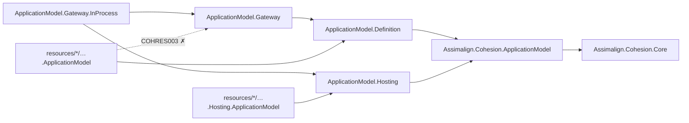

# ApplicationModel Library Area

> **Being rebuilt (2026-10-27).** Since 2026-10-29 the model is three projects: the shared
> [contracts](Assimalign.Cohesion.ApplicationModel/docs/DESIGN.md), the logical side in
> [Definition](Assimalign.Cohesion.ApplicationModel.Definition/docs/DESIGN.md), and the physical
> side in [Hosting](Assimalign.Cohesion.ApplicationModel.Hosting/docs/DESIGN.md), formerly
> `Assimalign.Cohesion.Hosting.Resources`. The [gateway](Assimalign.Cohesion.ApplicationModel.Gateway/docs/DESIGN.md)
> builds on the definitions. Each gateway runs a model of its own, deployed by its own pipeline, and
> a child gateway joins its parent. [Gateway.InProcess](Assimalign.Cohesion.ApplicationModel.Gateway.InProcess/docs/DESIGN.md)
> runs a gateway's resources in its own process (rebuilt 2026-10-29). `Gateway.ControlPlane`, the
> retired gateway's HTTP front end, was removed on 2026-10-29; the gateway's HTTP surface returns as
> a transport. The linked area records describe the retired design.

The L2 application-composition and orchestration plane: the shared contracts, the definitions a
gateway program declares, and the instance side every area's `<Area>.Hosting.ApplicationModel`
package builds on, plus the gateway family that deploys and manages resources without loading their
runtimes.

The area's architecture record lives in
[docs/libraries/ApplicationModel/DESIGN.md](../../docs/libraries/ApplicationModel/DESIGN.md);
this README is the project map. The signed
[developer-experience design](../../docs/DEVELOPER_EXPERIENCE_DESIGN.md) is the direction of
record and wins on every conflict. The full reference graph for every Cohesion assembly is in
[docs/DEPENDENCIES.md](../../docs/DEPENDENCIES.md).

## Layering

In the repo's L1/L2/L3 model (see [docs/programs/DELIVERY_ROADMAP.md](../../docs/programs/DELIVERY_ROADMAP.md)),
this area is **L2 — application runtime and composition**: it sits above the L1 foundation
libraries (`Core`, `Hosting`) and below every L3 service platform under `resources/`.

## Project map

The arrow means "references": `Gateway.InProcess --> Gateway` reads "`Gateway.InProcess`
references `Gateway`". The logical side (Definition) and the physical side (Hosting) both reference
the shared contracts and never each other; the gateway packages layer onto the definitions.
`Gateway.InProcess` is the one package that references both sides, because it runs instances inside
the gateway's process.

```mermaid
flowchart LR
    Definition["ApplicationModel.Definition"] --> Contracts["Assimalign.Cohesion.ApplicationModel"]
    Hosting["ApplicationModel.Hosting"] --> Contracts
    Contracts --> Core["Assimalign.Cohesion.Core"]
    Gateway["ApplicationModel.Gateway"] --> Definition
    InProcess["ApplicationModel.Gateway.InProcess"] --> Gateway
    InProcess --> Hosting
    AreaModel["resources/*/…​.ApplicationModel"] --> Definition
    AreaHosting["resources/*/…​.Hosting.ApplicationModel"] --> Hosting
    AreaModel -.->|"COHRES003 ✗"| Gateway
```

Solid edges are the references the layering permits. The dotted edge is the one `COHRES003`
rejects: no shipped project under `resources/**` may resolve an
`Assimalign.Cohesion.ApplicationModel.Gateway*` assembly, because gateway orchestration belongs
outside resource-area packages. That prohibition has no opt-out and no exemption property.

| Project | Role |
| --- | --- |
| `Assimalign.Cohesion.ApplicationModel` | The shared contracts: the `IApplicationResource` base, resource identity, the instance manifest, action invocation and results, state snapshots, and the publication seam |
| `Assimalign.Cohesion.ApplicationModel.Definition` | The logical side: what one gateway runs, declared as a model: its resources with their dependencies, settings, and platform extensions, and the parent it joins |
| `Assimalign.Cohesion.ApplicationModel.Hosting` | The physical side: a running resource instance, its health contributors, the in-process control plane, the host service that publishes and restores, and the HTTP manifest publisher |
| `Assimalign.Cohesion.ApplicationModel.Gateway` | The gateway: deploys its model's resources through an infrastructure provider, keeps each resource's deployment across its instances, receives instance publications and child gateways' joins, and exposes infrastructure actions; `ApplicationBuilder` declares the model and builds the gateway |
| `Assimalign.Cohesion.ApplicationModel.Gateway.InProcess` | The `inprocess` infrastructure: runs each resource's program on a thread of its own in the gateway's process, in an environment scope of its own, and is the in-process channel the programs publish through |

## Further reading

- [docs/libraries/ApplicationModel/DESIGN.md](../../docs/libraries/ApplicationModel/DESIGN.md) — the area architecture record
- [docs/APPLICATION_MODEL_BUILD_AND_DEPLOY.md](../../docs/APPLICATION_MODEL_BUILD_AND_DEPLOY.md) — the build and deploy flow drawn: SDK generation, gateway selection, and the in-process, Local, and Kubernetes realizations side by side
- [docs/programs/REALIZATION_PLAN.md](../../docs/programs/REALIZATION_PLAN.md) — the platform-neutral realization plan contract
- [docs/RUNTIME_CONTRACT.md](../../docs/RUNTIME_CONTRACT.md) — the language-neutral `COHESION_*` runtime contract
- Per-project `docs/OVERVIEW.md` and `docs/DESIGN.md` beside each project's `src/`
