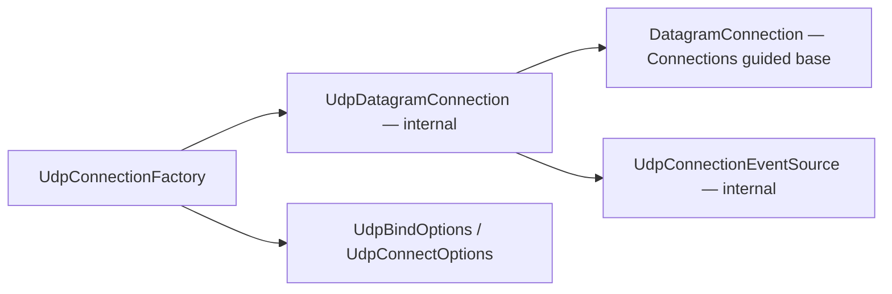

# Assimalign.Cohesion.Connections.Udp Design

## Design Intent

UDP delivers discrete, unreliable, unordered messages, and this driver keeps it that way. It
implements the datagram shape of the Connections contracts, `IDatagramConnection`, rather than forcing
datagrams through a byte pipe that would erase the one property UDP guarantees: message boundaries.
The contracts library's DESIGN.md explains why datagrams are a separate shape; this driver is its
socket-backed implementation.

The driver's pieces reference each other and the contracts library as follows (an arrow means
"references"):

`UdpConnectionFactory` builds sockets from the two options types and wraps each in an internal
`UdpDatagramConnection`, which derives from the contracts library's `DatagramConnection` base and
reports its lifecycle through the driver's internal event source.

## One factory, two roles

UDP is connectionless, so there is no listener and no accept loop. The factory has two verbs:

| Role | Verb | Socket | `RemoteEndPoint` |
|---|---|---|---|
| Server | `Bind` / `BindAsync` | bound to a local endpoint; receives from any peer | `null` |
| Client | `Connect` | connected to one peer; the kernel filters other senders | the peer |

The async overloads exist for call-site symmetry with the stream drivers; binding a UDP socket is
synchronous, so they complete synchronously (or return a canceled task for an already-canceled token).

## Data path

`ReceiveAsync` receives one datagram into the caller's buffer and returns its length and sender.
`SendAsync` sends one datagram. A **connected** socket must use `send()`, not `sendto()`: passing a
destination to `sendto()` on a connected socket fails with `EISCONN` on macOS/BSD even though Linux and
Windows tolerate it, so the connected (client) path ignores the destination argument and sends to its
peer.

## Lifecycle and error model

- A datagram connection is live when returned; `DisposeAsync` closes the socket and is idempotent.
- Socket errors surface as `SocketException` from the operation that hit them. A datagram transport has
  no reset or abort condition to translate into the `ConnectionException` family.
- The factory disposes a socket it created if binding or connecting fails.

## Diagnostics

The driver reports through its own internal event source, named for the assembly:
`Assimalign.Cohesion.Connections.Udp` (`Internal/EventSource/UdpConnectionEventSource.cs`), per the
repository EventSource convention (`.claude/rules/event-source.md`). Tools enable it by name; an
application forwards it into its logging with `Assimalign.Cohesion.Logging.EventSource`, where the source
name becomes the log category.

| Id | Event | Level | Payload |
|---|---|---|---|
| 1 | `ConnectionOpened` | Informational | `connectionId`, `mode` (`bind` or `connect`), `localEndPoint`, `remoteEndPoint` (empty when bound) |
| 2 | `ConnectionClosed` | Informational | `connectionId` |

Counters: `current-connections` and `total-connections`.

- `IDatagramConnection` has no identity of its own, so each connection carries a `ConnectionId` used only
  to correlate its two events.
- Individual datagrams are not events. Per-message tracing on a message-oriented transport would cost
  more than it tells; the runtime's own `System.Net.Sockets` source covers socket-level detail.
- This source replaced `UdpTraceCode`, a public enum of trace codes that nothing used. Diagnostics are
  never public API in this repository.

## AOT posture

No reflection, no runtime code generation, no serialization: `System.Net.Sockets` calls and the
internal event source. Fully NativeAOT/trim compatible (`IsAotCompatible=true`).

## Non-goals

- **No stream semantics.** Reliability, ordering, and framing belong to a protocol layered on top (QUIC
  is the fused example; a userspace reliable-UDP protocol would be an `IDatagramConnection →
  IConnection` layer).
- **No multicast or broadcast surface** until a consumer needs one; add it to the options first.
- **No Unix domain datagram sockets.** Only IPv4 and IPv6 endpoints are accepted.
