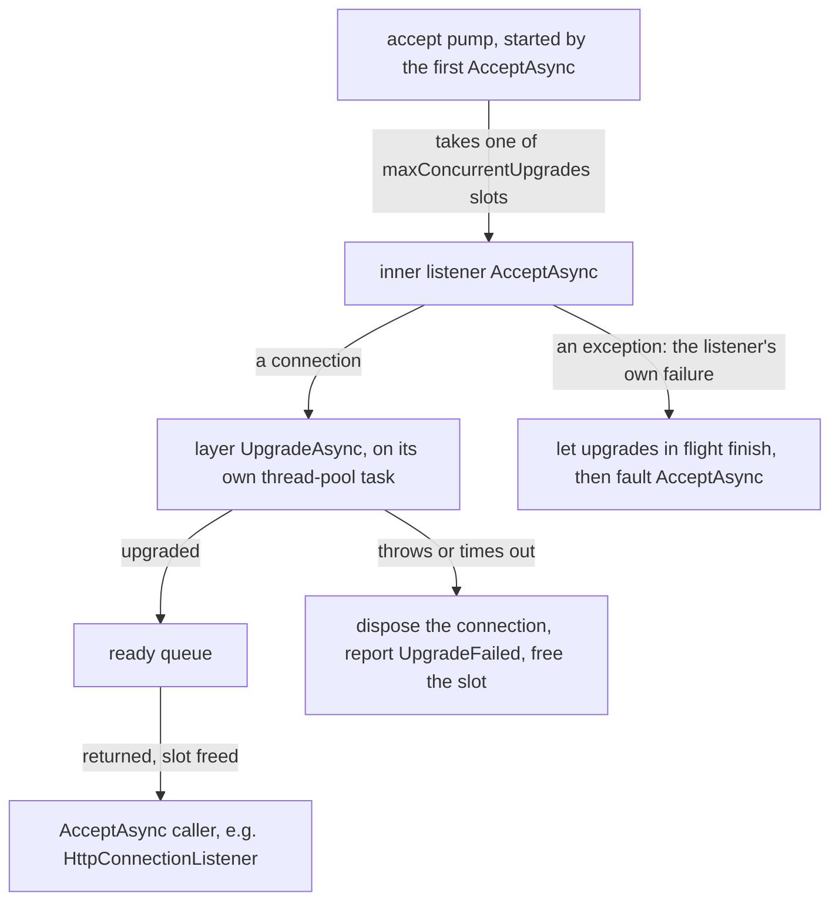

# Assimalign.Cohesion.Connections Design

## Design Intent

This library defines the connection contract for the Cohesion networking stack: the small set of
interfaces that describe how to accept, establish, layer, and use a network connection,
independent of any concrete protocol (TCP, UDP, QUIC) or any application protocol (HTTP, AMQP)
built on top. It is the lowest layer in the stack and depends only on `Assimalign.Cohesion.Core`.
Concrete transports implement these contracts; application protocols consume them; security and
other connection transformations compose over them. Neither direction inherits the other's
concerns.

## The Contract at a Glance

Three channel shapes, each honest about its delivery model:

| Shape | Contract | Data plane |
|---|---|---|
| Single stream | `IConnection` (+ `IConnectionListener` / `IConnectionFactory`) | **is** a duplex pipe (`IConnection : IDuplexPipe`) |
| Multiplexed | `IMultiplexedConnection` (+ listener/factory) | **yields** streams, each an `IConnection` |
| Datagram | `IDatagramConnection` | **speaks** discrete messages; no pipe |

One generic composition unit:

- `IConnectionLayer` — a connection-to-connection arrow (`UpgradeAsync(IConnection) → IConnection`),
  applied once per connection at establishment via `listener.Use(layer)` / `factory.Use(layer)`.
  TLS (in `Assimalign.Cohesion.Security`) is the first implementation; proxy-protocol handling,
  traffic accounting, throttling, and connection-level compression are the same shape. A layer
  whose upgrade fails leaves the connection to its caller, which disposes it. The layered listener
  does so for a connection it accepted (see "Layered Listeners", below), and the layered factory
  for a connection it dialed. A TLS layer that fails releases only its own stream, so before #1309
  a failed client handshake left the dialed connection open.

Selection is by **capability**, not protocol identity: `ConnectionCapabilities` (delivery mode,
reliability, ordering, multiplexing, security) is what consumers gate on; `ConnectionProtocol` is
diagnostics-only.

---

## Design Rationale

This section consolidates the reasoning that produced this design, recorded so future changes are
made with the original constraints in view. It replaced an earlier model
(`ITransport` / `ITransportConnection` / `ITransportConnectionContext` plus a connection
middleware pipeline) after a full design review.

### Why the old transport abstraction dissolved

The old `ITransport` had one meaningful member: `InitializeAsync() → ITransportConnection`. Every
consumer call site followed the same pattern — call it, then immediately **downcast** the result
(`is ISingleStreamTransportConnection` / `is IMultiplexTransportConnection`) to find out what it
really had, throwing at runtime on mismatch. An abstraction whose every use is a factory call
followed by a type test is not an abstraction; the downcast targets were the real contract. This
design promotes them into the type system:

- **Direction is structural.** Servers are `IConnectionListener` (accept); clients are
  `IConnectionFactory` (connect). The old `TransportKind` flag is gone — handing a client where a
  server is required is now a compile error, not a runtime check. Note that direction is a
  property of *establishment only*: once produced, inbound and outbound connections are
  indistinguishable `IConnection`s (a BitTorrent node, which simultaneously listens and dials and
  runs one wire protocol over both, is the canonical demonstration).
- **Stream multiplicity is structural.** HTTP/1.1 and HTTP/2 take an `IConnectionListener`;
  HTTP/3 takes an `IMultiplexedConnectionListener`. The old runtime switch became parameter types.
- **Datagrams are a separate shape.** The old model forced UDP datagrams through a byte
  `Pipe`, erasing message boundaries — the one property UDP guarantees. `IDatagramConnection`
  speaks messages (`ReceiveAsync` into a caller buffer, `SendAsync` to an endpoint) and never
  pretends to be a stream.

The old connection middleware pipeline (`ITransportPipeline`) was removed outright: it ran once
per connection *after* the connection's pipe was already constructed and wired, so it could
observe a connection but could never substitute the byte stream the consumer read. Its one
motivating use case — TLS — was therefore unimplementable through it. The capability it was
reaching for exists correctly as `IConnectionLayer` (below).

"Transport" survives in this stack only as a *concept* — the underlying medium a driver speaks —
never as a type. The medium is described by data (`ConnectionCapabilities` and the
diagnostics-only `ConnectionProtocol`), implemented by the **driver packages**
(`Assimalign.Cohesion.Connections.Tcp/Udp/Quic`), and supported by this library's internal
composition **primitives** — pipe-pair wiring and pool-owning options as `shared/` source the
drivers compile in — while each driver reports its own diagnostics through an internal event
source. Transports are
configuration; connections are runtime. The naming rule
follows: every type and package is named for the connection domain — the unit you consume
(`IConnection`), its producers (`IConnectionListener`/`IConnectionFactory`), its description
(`ConnectionCapabilities`/`ConnectionProtocol`/`ConnectionDelivery`/`ConnectionSecurity`), and its
diagnostics correlation (`ListenerId`, stamped only on listener-produced connections —
factory-dialed connections carry none). No type or assembly carries the word "transport", because
there is no transport abstraction.

### Layering: abstract the lifecycle, not the datapath

The obvious generic model — a uniform `ILayer` interface with L1–L7 instances, modules stacked
OSI-style — has a forty-year experimental record and lost on performance every time it was tried
at the data plane (AT&T STREAMS, the x-kernel). A uniform per-layer interface must reduce every
boundary to a least-common-denominator message and pay a virtual hop, and often a buffer handoff,
*per layer per IO operation*; it also dissolves type safety, since L3 packets and L4 streams do
not share a service vocabulary. The frameworks that survived (netty's channel pipeline, Kestrel's
connection middleware) all made the same retreat: the recurring unit is the **connection**, and
layers are transformations attached to one.

Hence the rule this library is built on: **abstract the lifecycle, not the datapath.**

- **Control plane (per-connection, at establishment): generic.** `IConnectionLayer` composes via
  `Use(...)`; each layer costs one interface dispatch and at most one wrapper allocation, once per
  connection. A pass-through layer (metrics, a proxy-protocol preamble reader) may return the
  inner connection unchanged — zero steady-state cost.
- **Data plane (per byte): concrete.** One best-in-class primitive, `System.IO.Pipelines`, with
  no framework frames between the consumer and the transport's buffers. A transforming layer
  (TLS) inserts only its intrinsic cost; the composition mechanism adds nothing per byte.

The OSI model maps onto this as an *algebra of arrows between the three shapes*, not as seven
nominal layers:

| OSI | Here | Arrow shape |
|---|---|---|
| L4 | TCP/UDP drivers | origin → `IConnection` / `IDatagramConnection` |
| L5 (sessions/mux) | QUIC streams; any future stream-mux layer | `IConnection` ⇄ `IMultiplexedConnection`; streams are `IConnection` again (the recursion) |
| L6 (TLS, compression) | `IConnectionLayer` | `IConnection → IConnection` |
| L7 | HTTP, AMQP | consume `IConnection`, produce protocol sessions |
| L1–L3 | the operating system | below the framework boundary |

Two properties of the algebra matter:

1. **Fusion is permitted.** QUIC is L4+L5+L6 in one protocol — an origin arrow landing directly on
   `IMultiplexedConnection`. A rigid layer stack cannot express that; arrows can. (Modern
   performance work — QUIC itself, kTLS — comes from fusing layers, so the model must allow it.)
2. **The recursion is real.** L4 itself is an arrow: TCP is, literally, a layer that turns
   unreliable IP datagrams into a reliable ordered stream, and QUIC turns UDP datagrams into a
   multiplexed secure stream bundle. A userspace protocol of the same kind (µTP, reliable-UDP
   variants) would be implemented as `IDatagramConnection → IConnection` and every consumer above
   it — TLS layer, HTTP, AMQP — would compose unchanged, because they bind to shapes, not
   protocols. Likewise DTLS is `IDatagramConnection → IDatagramConnection`, and tunnels are
   `IConnection → IDatagramConnection`. This is the recursive-layer insight (cf. RINA): layers
   differ in scope and policy, not in kind, and the recurring unit is the connection.

### Why `IConnection : IDuplexPipe` (the flattened data plane)

Earlier drafts gave the connection a `Transport` property carrying an `IDuplexPipe` (and the
pre-redesign code wrapped the pipe in a bespoke `ITransportConnectionPipe`). Both were removed
for the same reasons:

- **`IDuplexPipe` already is the abstraction.** It is two members over `PipeReader`/`PipeWriter`,
  which are abstract classes that exist precisely so implementations vary. A wrapper interface
  adds a seam with nothing varying behind it — and the bespoke wrapper's one addition (`Stream`)
  forced an eager stream allocation per connection and `Stream.Null` fakes where no stream
  existed. The BCL ships the lazy equivalents (`AsStream()`).
- **`Input`/`Output` are holder-relative**, and nesting (`connection.Transport.Input`) multiplies
  the perspectives a reader must track. Every duplex connection is internally *two* mirrored pipe
  views (the consumer's end and the wire pump's end), and surfacing a pairing object invites that
  mirror into consumer code. Flattening makes the connection itself the only pipe-bearing object:
  `connection.Input` is what the peer sent you, `connection.Output` is what you send — anchored,
  documented, and identical at every level of the recursion (a TCP connection and a QUIC stream
  read the same). The mirrored pump end lives in the drivers' compiled-in shared source
  (`DuplexPipePair`), separate from the consumer-facing connection contract.
- **Polarity.** Pipe → stream is a cheap lazy adapter (`DuplexPipeStream`, `AsStream()`);
  stream → pipe re-buffers. Making the pipe canonical lets hot consumers (HTTP/AMQP frame
  parsers) read zero-copy sequences while stream-based APIs (`SslStream`) adapt at their own
  boundary.
- **Interop is free.** Anything accepting `IDuplexPipe` accepts the connection itself.

The shapes stay honest because the flattening is scoped: only the single-stream shape *is* a
pipe. A multiplexed connection has no pipe (it yields streams); a datagram connection has no pipe
(a pipe erases message boundaries — making it carry one would force inventing a framing protocol
just to satisfy the interface). Nothing in the stack ever holds two duplex pipes.

### Directionality

Multiplexed transports produce unidirectional streams (QUIC; HTTP/3's control and QPACK streams
are unidirectional in practice), so "duplex" cannot be an unconditional promise.
`ConnectionDirection` makes it explicit per channel instance — `Bidirectional`, `ReadOnly`
(inbound unidirectional: output throws), `WriteOnly` (outbound unidirectional: input is
pre-completed) — and `IMultiplexedConnection.OpenStreamAsync(direction)` chooses the stream type
per call (an HTTP/3 endpoint needs bidirectional request streams *and* unidirectional control
streams on one connection, so a per-connection setting cannot work). Direction lives on the
connection, not on `ConnectionCapabilities`, because it varies per instance, not per transport
class.

### Capability selection, not protocol identity

Consumers state *requirements*, not protocol names: HTTP/1.1 needs a reliable, ordered,
single-stream listener — satisfied by TCP today, by a Unix domain socket, an in-memory transport,
or a userspace reliable-UDP protocol tomorrow, with no consumer change. Branching on
`ConnectionProtocol` would close that set and re-create the old hardcoded
protocol-to-transport mapping this design deleted. `ConnectionProtocol` exists for diagnostics
and logging only.

### Handshake facts: `ITlsConnectionInfo`

`ConnectionSecurity.Tls` says a connection is secured; it cannot say what the handshake agreed,
because capabilities describe a transport class and the handshake is per connection. An
application protocol needs that agreement: HTTP chooses between HTTP/2 and HTTP/1.1 from the
application protocol ALPN selected (RFC 7301), and shows its handlers the client certificate,
TLS version, and cipher suite. `ITlsConnectionInfo` is the typed facet that carries it. A connection that terminates TLS implements it beside its connection contract, and a
consumer finds it with a type test on the connection it holds:

- the secured `IConnection` the TLS layer returns (`Assimalign.Cohesion.Connections.Security`),
  which captures the values once its handshake completes;
- a multiplexed connection whose transport is TLS itself (QUIC, RFC 9001).

The facet reports four values, all fixed once the handshake completes:

| Member | Meaning |
|---|---|
| `ApplicationProtocol` | the protocol ALPN selected (RFC 7301), or none when the client offered none |
| `TlsProtocol` | the negotiated TLS version |
| `CipherSuite` | the negotiated cipher suite |
| `RemoteCertificate` | the certificate the peer presented, or `null`: the client's on a server-side connection (present only when the server requested one, RFC 8446 §4.3.2), the server's on a client-side one |

The connection owns `RemoteCertificate` and disposes it with itself. Both platform stacks hand
ownership of the peer certificate to whoever reads it (`SslStream.RemoteCertificate`,
`QuicConnection.RemoteCertificate`), so an implementation that reads it to report it must
release it; a consumer that keeps the certificate past the connection copies it.

Why this shape:

- **It lives in the contracts library** so the TLS layer and the QUIC driver can each implement it
  without a new reference, and a consumer reads it while depending on the contracts alone. HTTP
  never references the TLS layer. The HTTP server transport carries the facet one hop further: it
  republishes the values on each exchange's connection info, where `Assimalign.Cohesion.Http.Tls`
  reads them, so neither HTTP package references the other.
- **Not an `Items` bag** (see Non-Goals): the facts are few, typed, and fixed at handshake time,
  which is exactly what a typed contract is for.
- **Not a member of `IConnection` or `IMultiplexedConnection`**: every driver and test double
  would have to answer a question only TLS-terminating connections can, and a QUIC stream would
  answer for its whole connection.
- **A facet, not a base type**: `IConnection` and `IMultiplexedConnection` are different shapes,
  and both have TLS-terminating implementations, so the facet extends neither.

The cost is the usual one for decorators. A layer composed above TLS that returns a new
connection hides the facet unless it implements the facet too and forwards it. A pass-through
layer, which returns the connection it was given, keeps it visible.

### Application error codes: `IMultiplexedStreamAbort` and `IMultiplexedConnectionAbort` (#1080)

`Abort(Exception?)` ends a whole stream or connection and says nothing on the wire about why. A
multiplexed transport can: QUIC's `RESET_STREAM`, `STOP_SENDING`, and `CONNECTION_CLOSE` frames each
carry an application error code (RFC 9000 §19.4, §19.5, §19.19). Until #1080 the QUIC driver sent its
configured defaults in all three, so an HTTP/3 server could not send what RFC 9114 §8.1 asks of it:

- After a complete response, the server stops an unread request with `H3_NO_ERROR`. The default,
  `H3_REQUEST_CANCELLED`, made .NET's `HttpClient` fail a request whose response had arrived, and the
  HTTP/3 transport drained up to 64 KiB of upload for up to 5 seconds to avoid sending it.
- A rejected or malformed request is reset with `H3_REQUEST_REJECTED` or `H3_MESSAGE_ERROR`, so a client
  can tell a request it may retry from one it must not.
- A connection error closes with its own code, such as `H3_FRAME_UNEXPECTED`, not `H3_NO_ERROR`.

Two facets carry the code. A consumer finds each with a type test and falls back to `Abort` without it:

| Facet | Member | QUIC frame | Implemented by |
|---|---|---|---|
| `IMultiplexedStreamAbort` | `AbortRead(errorCode)` | `STOP_SENDING` | the QUIC driver's streams, the in-memory driver's stream ends |
| `IMultiplexedStreamAbort` | `AbortWrite(errorCode)` | `RESET_STREAM` | the same |
| `IMultiplexedConnectionAbort` | `Abort(errorCode, reason)` | `CONNECTION_CLOSE` | `QuicMultiplexedConnection` |

The rules:

- **One direction at a time.** A stream's directions end separately, so a server stops the request
  direction and still ends its response with a FIN.
- **The first signal for a direction wins.** A later `Abort` or `DisposeAsync` does not signal a
  direction again. A reset with a code is therefore both `AbortWrite` and `AbortRead`, then `Abort(reason)`,
  which keeps the lifecycle (`State`, `ConnectionClosed`) on the member that already owns it. The same holds
  for the connection: the first `Abort` or disposal decides the close code.
- **A half abort leaves the holder's lifecycle alone.** It changes no `State` and does not signal the
  holder's `ConnectionClosed`. The peer's stream reports an abandoned stream, as for any reset (#1329).
- **Codes range from 0 to 2^62 - 1**, the values a QUIC variable-length integer carries (RFC 9000 §16).
  Anything else throws `ArgumentOutOfRangeException`. The in-memory driver enforces the same range, so a
  test over it fails where QUIC would.
- **The peer sees the code** as `QuicException.ApplicationErrorCode` on QUIC, and as
  `ConnectionResetException.ApplicationErrorCode` on the in-memory driver.

Why this shape:

- **Facets, not members of `IConnection` or `IMultiplexedConnection`.** A new member breaks every
  implementation outside this repository (the contracts shipped in 10.0.0-preview.1), and only a
  transport with codes can honor it: a TCP connection has none to send. `ITlsConnectionInfo` is a facet for
  the same reason.
- **Not a code carried on the reason exception.** The reason types belong to the protocol (HTTP/3's are
  internal to it), so a driver would have to recognize them, or the protocol would have to throw this
  area's exceptions at its own application. The code is wire data, so it is an argument.
- **Two named members, not a direction enum.** Each direction has its own frame and fails something
  different on the peer, its reads or its writes. `ConnectionDirection` says which halves a stream has, not
  which to abort.
- **The half-close of #1330 builds on it.** The QUIC driver's stream pipes are created with
  `leaveOpen: false`, so completing either `Input` or `Output` disposes the QUIC stream: ending one direction
  ends both, and the disposal stops an unread direction with the default code. #1330 maps `Output`
  completion to the FIN alone and `Input` completion to a read-direction abort with the default code. A
  consumer that needs another code calls `AbortRead` first, and the first signal wins. Until then a consumer
  that ends its sending direction while the peer is still sending calls `AbortRead` before completing
  `Output`, as the HTTP/3 transport does after a complete response.

### Precedents

The shape matches the systems that survived production: Kestrel
(`Microsoft.AspNetCore.Connections.Abstractions`: `IConnectionListener`/`IConnectionFactory`/
`ConnectionContext` over `IDuplexPipe`; its "Transport.*" packages contain drivers, not
abstractions), netty (`Channel` + pipeline of per-connection handlers), and ADO.NET (consumers
hold `DbConnection`; the driver is a package choice, not an interface applications touch).
Validation cases worked during the design review: HTTP/1.1–HTTP/3 and AMQP (the in-repo
consumers), and BitTorrent as an adversarial external case — peer wire over TCP or µTP, MSE
encryption as a non-TLS `IConnectionLayer`, DHT/KRPC over datagrams, simultaneous
listener+factory in one node — mapped onto the algebra with no new shapes.

---

## Guided Abstract Bases

Per the repository's interface-first-with-a-guided-abstract-base rule, each contract ships a
public abstract base (`Connection`, `ConnectionListener`, `ConnectionFactory`,
`MultiplexedConnection` and its listener/factory, `DatagramConnection`). Where the base exposes a
concrete-typed member — a listener's `AcceptAsync` returning `Connection` rather than
`IConnection` — the typed member is declared `public` (so holders of the concrete type get the
richer signature without casting) and the interface member is implemented explicitly, forwarding
to it. The interface remains the canonical surface consumers depend on.

## Lifecycle and Error Model

- A listener is configured when constructed and acquires its endpoint through `BindAsync`. Binding is
  idempotent while active. `DisposeAsync` releases the endpoint and is terminal for that listener
  instance; restart constructs and binds a new listener. Guided bases provide a completed logical-bind
  default for custom listeners that are pre-bound or own no external endpoint, while resource-owning
  drivers override it. `AcceptAsync` remains the connection-production operation, not the endpoint-
  acquisition signal.
- A connection is **live when produced** — there is no separate open step and no
  connection-versus-context duality. Read and write immediately.
- **A listener contains each connection's failure.** `AcceptAsync` (on both listener shapes)
  returns a connection that is ready to use, with any handshake already complete. A failure that
  belongs to one inbound connection, such as a handshake that fails or times out, is the listener's
  to handle: it releases that connection and accepts the next. An exception from `AcceptAsync`
  therefore means the listener itself can produce no more connections (it was disposed, or its
  endpoint failed), or the caller canceled, and a consumer may treat it as fatal. The layered
  listener below and the QUIC driver honor this (#1304). So does the TCP driver: it skips a
  connection whose client reset it before the accept, which Windows reports by failing the
  accept (#1308).
- Three teardown paths: complete `Output` for a graceful half-close; `DisposeAsync()` to close;
  `Abort(Exception?)` to tear down immediately, discarding in-flight data. A multiplexed transport's
  streams and connections can also abort with an application error code, one stream direction at a time
  (see "Application error codes", above). `ConnectionClosed` is
  signaled on closure. A stream of a multiplexed connection also signals it when its peer abandons
  the stream (a QUIC `RESET_STREAM` or `STOP_SENDING`, or the in-memory equivalents), so a consumer
  such as an HTTP/3 request learns of it without reading or writing (#1329). `ConnectionState` tracks
  `Idle → Opening → Open → Closing → Closed`, or `Aborted`.
- `ConnectionException` is the area-scoped exception root (inheriting directly from
  `Exception`; no framework-wide ancestry, per repository rules), with
  `ConnectionAbortedException` and `ConnectionResetException` for the common failures. Transports
  surface reset/abort conditions through this family so consumers catch one hierarchy.
  `ConnectionResetException.ApplicationErrorCode` carries the code a peer reset or stopped a stream with,
  when the driver reports the reset through this family (the in-memory driver does; the QUIC driver
  surfaces `System.Net.Quic`'s `QuicException`).

## Layered Listeners: Where an Upgrade Runs and How a Failure Is Contained

`listener.Use(layer)` returns an internal `LayeredConnectionListener`. Its upgrade is usually a
handshake (TLS through `UseTls`), and a handshake takes as long as the peer chooses: a client can
send garbage, stall, or be refused by a certificate policy. Until #1304 the layered listener ran
the upgrade inside `AcceptAsync`, which made all three a denial of service. Handshakes ran one at
a time on the accept loop, so one silent client held every other client's handshake until the
timeout. A failed handshake's exception left `AcceptAsync`, so a consumer that treats that as the
listener's failure (the HTTP listener does) stopped serving. And the failed connection was never
disposed.

### Where the upgrade runs

The first `AcceptAsync` starts an accept pump. The pump takes a slot, accepts a connection from
the inner listener, hands it to the thread pool to upgrade, and goes straight back to accepting.
`AcceptAsync` reads from a queue of upgraded connections, so it returns connections in the order
their upgrades complete, not the order they arrived.



- **Each upgrade runs on its own task.** Even the synchronous part of an upgrade stays off the
  accept loop: a TLS handshake that finds the client's first flight already buffered signs its
  reply before it first yields, and that work must not serialize every handshake.
- **The pump does not capture the caller's execution context.** It outlives the `AcceptAsync`
  call that starts it, and an ambient activity would otherwise parent every later upgrade.

### How a failure is contained

- **An upgrade that throws fails only its connection.** That covers a handshake that fails, one its
  layer cancels because the handshake timeout elapsed (TLS reports `OperationCanceledException`),
  and a peer that disconnects mid-handshake. The layered listener disposes the connection (a layer
  leaves it to its caller on failure, see `IConnectionLayer.UpgradeAsync`), reports `UpgradeFailed`
  through the event source below with the exception's type and message (never the peer's bytes, a
  certificate, or key material), frees the slot, and keeps accepting.
- **The inner listener's failure is the listener's own.** Any exception from the inner
  `AcceptAsync` means it can produce no more connections. The pump stops, lets the upgrades already
  in flight finish and queue, and then completes the queue with the exception, so a consumer receives
  every connection accepted before the fault and then the fault itself. After disposal,
  `AcceptAsync` throws `ObjectDisposedException`.
- **Canceling `AcceptAsync` abandons that wait and nothing else.** The upgrades keep running and a
  later call returns their connections. Before #1304 the caller's token also canceled the upgrade
  of the connection being accepted, and that connection leaked.
- **Disposal releases everything the listener holds.** It cancels the token every upgrade received
  (a layer must honor it), disposes the inner listener, waits for every upgrade to finish, and
  disposes every upgraded connection `AcceptAsync` has not returned. A cancellation caused by
  disposal is not reported as a failure.

### The bound

At most `maxConcurrentUpgrades` connections are held at once. A connection counts from the moment
the pump accepts it until `AcceptAsync` returns it or its upgrade fails. With every slot taken, the
pump stops accepting, and further peers wait in the inner listener's own backlog (for TCP, the
operating system's listen queue, `TcpConnectionListenerOptions.Backlog`). A flood of stalled
handshakes therefore holds at most that many connections' handshake state instead of growing
memory without bound.

- `listener.Use(layer)` uses 512 and `listener.Use(layer, maxConcurrentUpgrades)` sets it; TLS sets
  it from `TlsServerOptions.MaxConcurrentHandshakes`, which also defaults to 512. 512 matches the TCP
  listener's default backlog and the QUIC listener's default backlog, which bounds the same thing for
  QUIC (handshakes in progress plus connections not yet accepted).
- The bound trades memory for availability. While it is reached, a new client waits until a slot
  frees, which a stalled client does at the latest when its handshake times out. An endpoint that
  expects many slow handshakes at once raises the bound or shortens the timeout. Neither knob can
  make one peer stop the listener.
- Counting connections that are upgraded but not yet returned is deliberate: a consumer that stops
  accepting stops new handshakes too, instead of letting finished ones pile up.

### Alternatives rejected

- **Upgrading inside `AcceptAsync` (the shape before #1304).** It serializes handshakes on the
  accept loop and turns one peer's failure into the listener's.
- **Returning the raw connection and deferring the upgrade to a step the consumer awaits.** The
  handshake would leave the accept loop, but the contract that `AcceptAsync` returns a ready
  connection would break for every consumer, and each consumer would have to rebuild the
  concurrency, the bound, the timeout handling, and the disposal of failed connections. The layered
  listener is the one place that knows which failures belong to a connection.
- **Containing the failure in the consumer.** A consumer such as `HttpConnectionListener` cannot
  tell a connection's failure from its listener's by exception type: a handshake that times out
  throws `OperationCanceledException`, the type the in-memory listener throws once it is disposed,
  and bytes that are not a handshake throw `IOException`, the family of transport I/O failures. A
  wrong guess either stops the server or spins on a dead listener. Only the component that ran the
  upgrade knows which it was.
- **No bound.** Every stalled handshake costs a socket, its buffers, and the TLS state, so an
  unbounded listener is a memory-exhaustion target.
- **Separate bounds for handshakes and for upgraded connections waiting to be accepted.** Two knobs
  for one resource, and the second queue would still need a bound of its own.

## AOT Posture

Contracts, small value types, two allocation-light utilities (`DuplexPipeStream` and the layered
factory decorator), and the layered listener, whose pump uses only `System.Threading.Channels`, a
`SemaphoreSlim`, and the thread pool. No reflection, no runtime code generation, no serialization.
`ConnectionId` and `ConnectionProtocol` are produced by the repository's `CohesionValueType`
source generator. The layered listener's event source writes only string payloads. Fully NativeAOT
compatible.

## Non-Goals

- No request/application middleware pipeline, and no per-byte layer interfaces — layers compose
  per connection at establishment only.
- No general-purpose `Items` property bag on the connection; cross-cutting state belongs to the
  layers or protocols that own it.
- No `ILayer<TLower, TUpper>`-style nominal OSI hierarchy, and no datagram/multiplexed layer
  interfaces until a second real implementation exists (DTLS would justify
  `IDatagramConnection → IDatagramConnection`).
- `ConnectionProtocol` is not a behavior switch.

## Relationships

- **`Assimalign.Cohesion.Connections.Tcp` / `.Udp` / `.Quic` / `.NamedPipes`** — the drivers
  implementing these contracts. Driver-support infrastructure is split by what it is:
  `DuplexPipePair` and the pool-owning pipe options live in this library's `shared/` folder and
  are **compiled into** each driver, `ListenerId` is public API, and diagnostics are each
  driver's own internal event source. There is no separate toolbox assembly and no
  `InternalsVisibleTo` between shipped assemblies.
- **`Assimalign.Cohesion.Security`** — TLS as `TlsConnectionLayer` / `UpgradeToTlsAsync`.
- **`Assimalign.Cohesion.Http.Connections` / `Assimalign.Cohesion.Amqp.Transports`** — application
  protocols consuming these contracts by capability.

## Driver composition seams

Drivers get their plumbing from this library in exactly one way — **shared source** for types that
are implementation details — and they get nothing for diagnostics: a process-global resource such as
an event source stays inside the one assembly that owns it, so every driver owns its own.

### Shared source — `shared/`, compiled into each driver

`DuplexPipePair`, `PipeOptionsContext`, `StreamPipeOptionsContext`, and `PipeOptionsFactory` live
in this project's `shared/` folder and are **not** part of the `Assimalign.Cohesion.Connections`
assembly at all. A driver names this project in a `CohesionSharedSource` item and compiles its own
internal copy (`.claude/rules/general-rules.md`, *Shared source*):

```xml
<CohesionSharedSource Include="Assimalign.Cohesion.Connections" />
```

- `DuplexPipePair.Create` constructs the fixed mirrored topology; `Input`/`Output` are
  consumer-facing and `TransportOutput`/`TransportInput` belong to the driver's pumps.
- `PipeOptionsFactory.CreatePipeOptions` takes explicit application/driver schedulers and
  receive/send thresholds. Its `PipeOptionsContext` owns one pool and exposes `InputOptions`,
  `OutputOptions`, and `BlockSize`. `CreateStreamOptions` returns
  `StreamPipeOptionsContext` with `ReaderOptions` and `WriterOptions`. The driver completes
  all dependent pipes before calling the context's idempotent `Dispose`.

Linking is safe here precisely because nothing crosses an assembly boundary: `PipeOptionsFactory`
holds only constants, and every context and pipe pair it creates is constructed, used, and
disposed inside the one driver assembly that asked for it. `Assimalign.Cohesion.Connections`
itself neither produces nor consumes one, which is why it does not compile them in either — the
only assemblies that carry these types are the drivers and this project's own test suite.

This replaces what used to be `InternalsVisibleTo` to `Tcp`, `Quic`, and `NamedPipes`, and it
replaces a briefly-public version of the same four types: they were never a contract anyone
outside a driver should implement against, and publishing them would have frozen the pipe
topology and the pool-ownership shape as public API.

### Diagnostics — one internal event source per driver

Each driver owns an internal event source named for its assembly — `Assimalign.Cohesion.Connections.Tcp`,
`.Quic`, `.NamedPipes`, `.Udp` — and reports its listener, connection, and (QUIC) stream lifecycle
through it, with its own counters. This library performs no network operations of its own and has no
diagnostics API; its one internal event source reports the one decision it makes at run time, a layered
listener closing a connection whose upgrade failed (see "The layered listener's event source", below).
The repository-wide rule is `.claude/rules/event-source.md`; the event tables live in each driver's
`docs/DESIGN.md`; applications observe the drivers with `dotnet-trace`/`dotnet-counters` by name, or
forward them into their logging with `Assimalign.Cohesion.Logging.EventSource`.

This replaced a single `ConnectionEventSource` (`Assimalign.Cohesion.Connections`) that every driver
reached through a public, stateless `ConnectionDiagnostics` forwarder. Why the shape changed:

- **The forwarder was public diagnostics API.** Any caller could write fabricated events into a
  process-global provider, and every event's shape was frozen as public surface. The owner's direction
  (2026-09) is that event-source implementations are internal and never exposed to developers.
- **Sharing the source could not be done internally.** It cannot be `shared/` source — linked copies
  would be four providers claiming one process-global name, each under-reporting — and an
  `InternalsVisibleTo` grant between shipped assemblies is not allowed. Per-driver ownership is the
  only internal shape, and it is also how the runtime instruments its own networking
  (`System.Net.Sockets`, `System.Net.Quic`, `System.Net.Security`).
- **The shared source was broken in ways its shape invited.** Its counters were declared but never
  written (issue #1027), `ListenerInitialized` wrote one argument where its method declared two, the
  event methods declared domain value types (`ConnectionProtocol`, `ListenerId`, `ConnectionId`) as
  payload, only QUIC reported a close, and QUIC streams were reported as connections. A per-driver source is small enough to test against its manifest and its real lifecycle,
  which the convention now requires.

`ListenerId` stays public: it is the correlation id every stream driver stamps on the connections its
listeners produce, and a connection's `listenerId` payload is how a forwarded log line ties back to its
listener.

### The layered listener's event source

`Assimalign.Cohesion.Connections` (`Internal/EventSource/ConnectionLayerEventSource.cs`) is internal,
follows the same convention, and reports only what a layered listener decides (see "Layered Listeners",
above); the connection itself is still reported by the driver that carries it, under the same
`connectionId`. It reuses the name of the retired shared source because the name is the assembly's, but
nothing about it is public and no driver writes to it.

| Id | Event | Level | Payload |
|---|---|---|---|
| 1 | `UpgradeFailed` | Warning | `connectionId`, `remoteEndPoint`, `exceptionType`, `exceptionMessage` |

Counters: `current-upgrades` (upgrades in flight) and `failed-upgrades` (upgrades that failed since the
process started).

- `UpgradeFailed` is a warning: the connection is lost but the listener recovered, and a refused or
  broken client is routine on a public endpoint. Its payload is the exception's type and message, never
  the bytes the peer sent, a certificate, or key material. A handshake timeout reports
  `System.OperationCanceledException` (or `System.Threading.Tasks.TaskCanceledException`). The TLS
  details of a failed handshake are the runtime's `System.Net.Security` source's to report.
- An upgrade canceled because its listener is being disposed is not a failure and is not reported.
- Every upgrade the pump starts reports its start and its end exactly once, which keeps
  `current-upgrades` exact.
