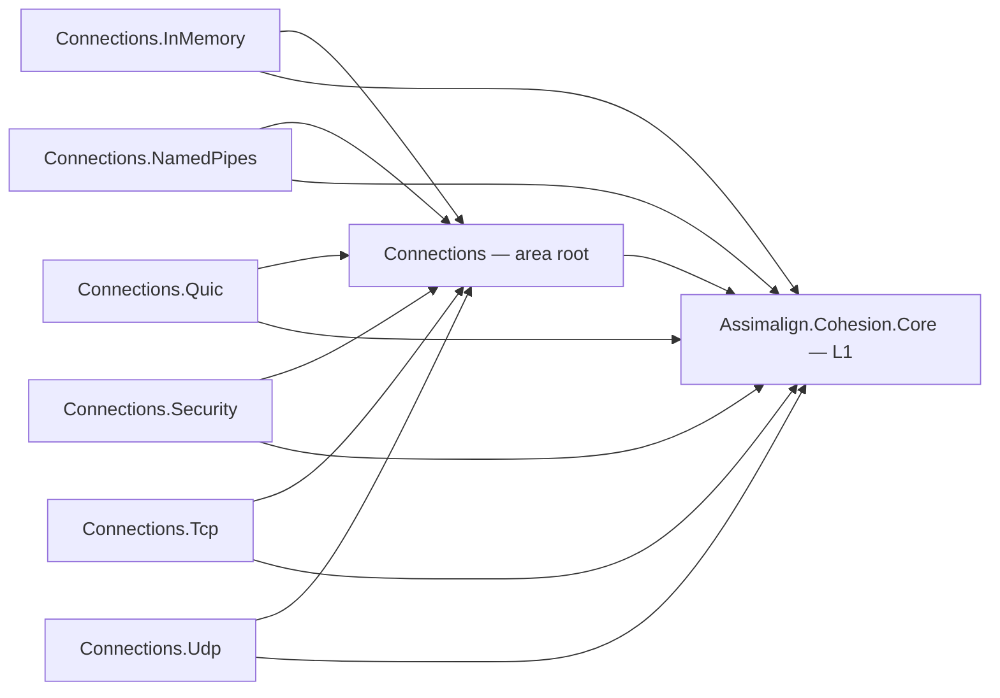

# Connections

The connection layer of the Cohesion networking stack: the contracts for accepting,
establishing, layering, and using network connections, plus the concrete drivers that implement
them.

## Project map

An arrow means "references": `Connections.Tcp --> Connections` reads
`Assimalign.Cohesion.Connections.Tcp` references `Assimalign.Cohesion.Connections`.

Solid edges are the references this area permits; the dependency arrow always points from the
consumer to what it consumes.

The full reference graph for every Cohesion assembly, including the exact external dependencies
collapsed above, is in [docs/DEPENDENCIES.md](../../docs/DEPENDENCIES.md).

## Purpose

Everything that produces or consumes a network byte channel goes through this area. The
contracts live in one library; protocol drivers implement them; application protocols (HTTP,
AMQP) and connection transformations (TLS in `libraries/Security`) consume them. There is
deliberately no transport abstraction — see the naming rule and full design rationale in
[Assimalign.Cohesion.Connections/docs/DESIGN.md](Assimalign.Cohesion.Connections/docs/DESIGN.md).

## Projects

| Project | Role |
|---|---|
| `Assimalign.Cohesion.Connections` | The contracts: `IConnection` (a live duplex pipe), `IConnectionListener` / `IConnectionFactory`, `IMultiplexedConnection` (+ listener/factory), `IDatagramConnection`, the `IConnectionLayer` composition arrow, `ConnectionCapabilities`, and the guided abstract bases. Also carries `ListenerId` and the `shared/` driver source (pipe-pair wiring, pooled pipe options) that the drivers compile in. |
| `Assimalign.Cohesion.Connections.Tcp` | Reliable, ordered, single-stream socket driver (`TcpConnectionListener` / `TcpConnectionFactory`). Serves both TCP over IP and Unix domain sockets (with socket-file lifecycle and honest protocol stamping), plus socket-activation descriptor hand-off. |
| `Assimalign.Cohesion.Connections.NamedPipes` | Reliable, ordered, single-stream named-pipe driver (`NamedPipeConnectionListener` / `NamedPipeConnectionFactory`) for Windows-native local IPC with ACL/filesystem access control; the peer of the `Tcp` driver's Unix domain socket path. |
| `Assimalign.Cohesion.Connections.Udp` | Message-oriented UDP datagram driver (`UdpConnectionFactory` → `IDatagramConnection`). |
| `Assimalign.Cohesion.Connections.Quic` | Reliable, ordered, multiplexed QUIC driver (`QuicConnectionListener` / `QuicConnectionFactory`); each stream is itself an `IConnection` with a `ConnectionDirection`. |
| `Assimalign.Cohesion.Connections.InMemory` | Socketless in-memory driver: cross-wired duplex-pipe connection pairs (`InMemoryConnectionListener` / `InMemoryConnectionFactory`, plus a multiplexed variant) for deterministic, live transport testing. |

## Layering

This area is the lowest networking layer (L1 in the repo's layering model): it depends only on
`Assimalign.Cohesion.Core`. Consumers select transports by **capability**
(`ConnectionCapabilities`: delivery mode, reliability, ordering, multiplexing, security), never
by protocol identity. Direction is structural — servers hold listeners, clients hold factories —
and connection transformations compose at establishment via `listener.Use(layer)` /
`factory.Use(layer)`.

Listeners acquire their configured endpoints explicitly through `BindAsync`. Binding is idempotent
while a listener is active; `DisposeAsync` releases the endpoint and terminally ends that listener
instance. A later host start creates and binds a new listener rather than reusing a disposed one.

## Dependencies

- `Assimalign.Cohesion.Core` (all projects)
- Drivers additionally depend on `Assimalign.Cohesion.Connections` (the contracts) and compile its
  `shared/` pipe-plumbing source through `CohesionSharedSource`.

## Diagnostics

Each driver reports its own lifecycle through an internal event source named for its assembly —
`Assimalign.Cohesion.Connections.Tcp`, `.Quic`, `.NamedPipes`, and `.Udp` — with its own counters
(`current-connections` and friends). None of it is public API. Enable a driver by name in
`dotnet-trace` or `dotnet-counters`, or forward every driver into an application's logging with
`Assimalign.Cohesion.Logging.EventSource`, under the category prefix `Assimalign.Cohesion.Connections`.
The contracts library, `Security`, and `InMemory` raise no events of their own. The convention is
`.claude/rules/event-source.md`; the consumer reference is [docs/EVENT_SOURCES.md](../../docs/EVENT_SOURCES.md).

## Further Reading

- [Assimalign.Cohesion.Connections/docs/OVERVIEW.md](Assimalign.Cohesion.Connections/docs/OVERVIEW.md)
- [Assimalign.Cohesion.Connections/docs/DESIGN.md](Assimalign.Cohesion.Connections/docs/DESIGN.md) —
  includes the consolidated design rationale (why the old transport abstraction dissolved, the
  layer algebra, the flattened `IConnection : IDuplexPipe` data plane, capability gating).
