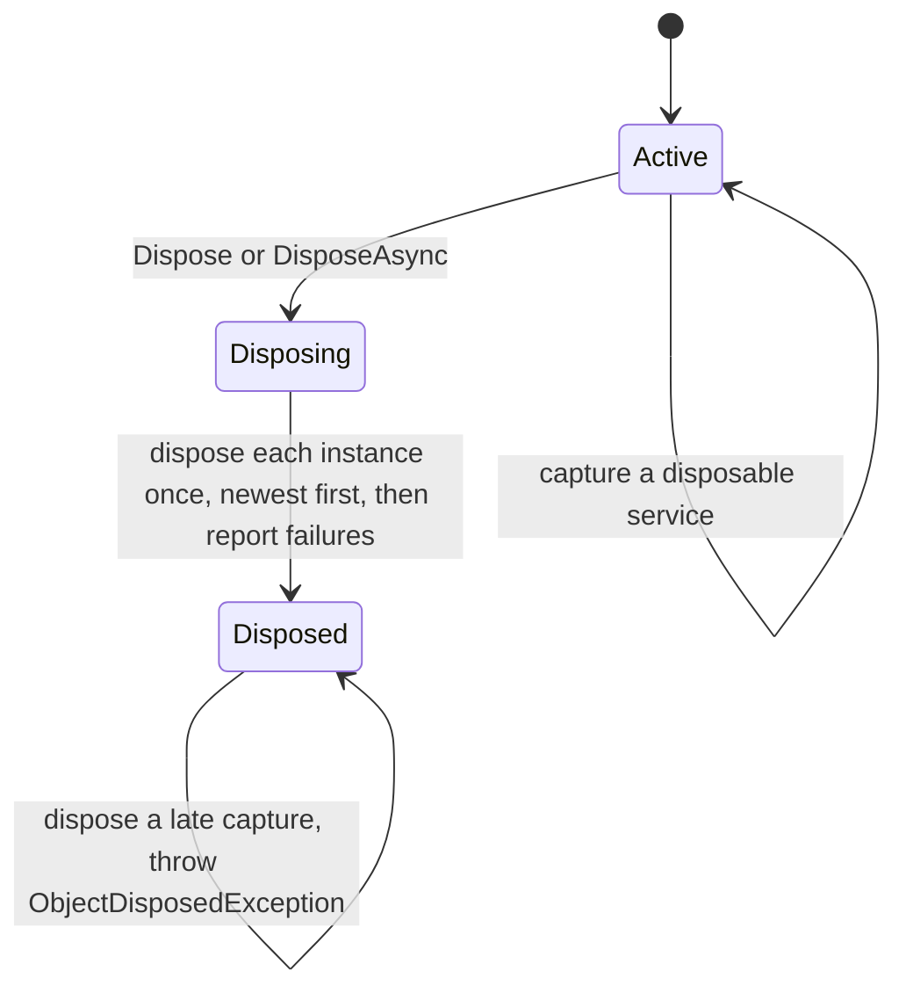

# Assimalign.Cohesion.DependencyInjection Design

## Design Intent

The package mirrors the familiar shape of a modern DI container while remaining self-hosted inside the Cohesion ecosystem. Registration, provider construction, and resolution are intentionally separated into explicit types.

## Architecture

- ServiceDescriptor and IServiceCollection capture registration intent independently of runtime resolution.
- ServiceProviderBuilder composes a provider from descriptors and exposes extension points for registration helpers.
- Resolution internals, call sites, scopes, and activator utilities sit behind the public contracts so the outer API remains compact.

## Resolver compilation policy

`ServiceProviderOptions.EnableDynamicCode` defaults to `true`, preserving the existing resolver
choice: JIT runtimes may compile frequently resolved call sites, while NativeAOT uses the
interpreted runtime resolver. Setting it to `false` selects the runtime resolver before any
compiled engine is constructed. That resolver never schedules background expression or IL
compilation, including after repeated scoped, transient, or enumerable resolutions. The choice
is captured when each provider is built; later options mutation does not change that provider.

This is a general provider policy for consumers requiring no runtime code generation. Database
hosting always disables it. The option does not change registration semantics or remove
reflection from implementation-type constructor activation; consumers requiring reflection-free
construction register explicit closed factories or instances. Scope validation, singleton and
scope caching, and disposal retain their existing behavior.

`ServiceProviderDynamicCodeTests` exercises factory lifetimes and scope validation under the
strict policy. Its JIT test observes the actual resolver compilation diagnostics, confirms an
enabled control provider emits code after repeated resolution, and verifies that the disabled
provider emits neither IL nor expression diagnostics and retains the runtime engine with no
background compilation path. Phase 29 verification on 2026-09-19 also published and ran a
`net10.0` / `win-arm64` NativeAOT smoke using explicit singleton/scoped/transient factories and
an instance registration with dynamic code disabled. It verified 1,024 resolutions, scope
validation, and owned versus borrowed disposal. Existing constructor/open-generic trim/AOT
diagnostics remain outside this resolver-policy change; the strict factory path ran successfully.

## Scope disposal

A scope records every disposable service it creates and disposes them in reverse order of
capture, so a service is disposed before the services it was built from.

- **Every service is disposed.** A service whose disposal throws does not stop the rest. Once all
  are done, a single failure is rethrown as itself and several are thrown together as an
  `AggregateException`. `DisposeAsync` reports them through the task it returns.
- **Each instance is disposed once.** One instance can be captured more than once, typically a
  singleton exposed as several services through forwarding factories
  (`AddSingleton<IFoo>(provider => provider.GetRequiredService<Foo>())`). When disposal begins,
  every capture after the first is removed, so the instance is disposed once and still after the
  services that depend on it.
- **A scope captures nothing after disposal.** A service created after that point is disposed at
  once and the resolution throws `ObjectDisposedException`.

The lifecycle of a scope:



## Circular dependencies

A cycle through constructor parameters is rejected while the call site is built, with the chain
that closes it. A cycle through a factory cannot be seen then, because a factory is opaque, so it
is caught when it happens and throws `InvalidOperationException` ("A circular dependency was
detected for the service of type ...") instead of deadlocking:

- **Singletons, and scoped services resolved from the root provider.** While the runtime resolver
  creates the value it marks the call site. The mark is read and written only under the call site's
  lock, so only the creating thread can see it; another thread asking for the same singleton waits
  for it, as before.
- **Scoped services in a child scope.** While a scope creates a scoped service it holds a
  reservation for it in its own cache, and finding that reservation means the creation asked for
  itself again. A mark on the call site would not work here, because two scopes can create the same
  service at the same time. Every resolver follows one protocol on the scope: reserve the entry,
  store the service in it, or release it when creation fails so a later request tries again. That
  covers the IL and expression-tree resolvers as well as the interpreted one, because a factory can
  close a cycle after its service was compiled. The cache is private to the scope, so no resolver
  can read a reservation as a service.

Before, the locks' re-entrancy let the recursion run until the interpreted resolver's stack guard
moved it to another thread, which then waited on the lock forever. Compiled resolvers have no stack
guard, so the same cycle overflowed the stack. A cycle made only of transient services is still not
detected: nothing caches a transient, so there is no entry to reserve.

## Scope validation

With `ValidateScopes`, the provider records the first scoped service in each call site's tree and
rejects a scoped service resolved from the root provider or captured by a singleton.

- **Per registration, not per service type.** Records are keyed by the call site's cache key,
  which is the service type and slot. A scoped registration that is not the default therefore no
  longer makes the default registration fail from the root provider.
- **Each call site is walked once.** The record doubles as a memo. Walking every path instead of
  every call site made validation exponential in the depth of a graph that shares dependencies:
  2.5 s for 54 registrations 26 layers deep, against 0.13 ms memoized.
- **The singleton check runs on every visit, memoized ones included**, because a memo records what
  a tree contains, not which singleton reached it.
- **Every call site has a key of its own.** A constant call site carries its registration's slot,
  and an uncached enumerable its own key. Upstream keys an instance registration at slot 0 whatever
  its position, so its memoized walk lets an earlier instance registration answer for a scoped
  default and misses a singleton that captures it; this port does not.

## Enumerable resolution and slots

A registration's slot counts back from the last registration of its service; slot 0 is the one
`GetService` returns. Single and enumerable resolution share call sites through the (service
type, slot) key, so both must assign the same slots.

When a closed service type matches exact and open generic registrations, `GetService` prefers the
exact one. Enumeration therefore hands slots to every exact registration before any open generic
one, while still listing the registrations in declaration order. An open generic whose constraints
the type argument does not satisfy is left out of the enumeration. When it is the last
registration it still owns slot 0, so `GetService` reports the constraint violation rather than
returning an earlier registration, whichever of the two resolves first.

## Upstream lineage

This library is a fork of `Microsoft.Extensions.DependencyInjection` from the .NET 7 era, without
keyed services, and the base commit was not recorded. It was last compared with `dotnet/runtime`
main at `03d8bb9` (2026-09-29). Fixes ported since the fork:

| Upstream change | Fixes |
| --- | --- |
| [dotnet/runtime#80410](https://github.com/dotnet/runtime/pull/80410) | Slots for closed and open generic registrations of one service |
| [dotnet/runtime#86683](https://github.com/dotnet/runtime/pull/86683) | An allocation in every `CaptureDisposable` call |
| [dotnet/runtime#87354](https://github.com/dotnet/runtime/pull/87354) | Scope validation keyed by service type |
| [dotnet/runtime#96254](https://github.com/dotnet/runtime/pull/96254), [dotnet/runtime#98661](https://github.com/dotnet/runtime/pull/98661) | The exponential validation walk |
| [dotnet/runtime#115974](https://github.com/dotnet/runtime/pull/115974) | The event source's provider list growing without bound |
| [dotnet/runtime#123255](https://github.com/dotnet/runtime/pull/123255) | "Last wins" when the last open generic cannot close |
| [dotnet/runtime#123342](https://github.com/dotnet/runtime/pull/123342) | Scope disposal stopping at the first exception |
| [dotnet/runtime#124331](https://github.com/dotnet/runtime/pull/124331) | Deadlock on a circular dependency through a factory |
| [dotnet/runtime#128768](https://github.com/dotnet/runtime/pull/128768) | Disposal of an instance once per capture |

Where this port differs from upstream on purpose:

- Constant call sites are keyed by slot, as described under *Scope validation*.
- Re-entry is detected with a flag on the call site rather than a thread-static set. Because only
  the lock holder can see the flag, it gives the same answer without a per-thread allocation.
- A cycle between scoped factories in a child scope is detected. Upstream detects cycles only for
  services cached at the root.
- The scoped-in-singleton error names the scoped service it found, not the dependency the
  singleton reached it through.
- `DisposeAsync` reports disposal failures through the returned task rather than throwing
  synchronously.

## Diagnostics

The container reports through one internal event source, `Assimalign.Cohesion.DependencyInjection`,
following `.claude/rules/event-source.md`. The provider-built summary is its only `Informational`
event, so an application that forwards Cohesion sources into its logs at `Information` gets one
entry per provider. Everything else is `Verbose`, except the error a failed background compilation
raises. Events 7 and 8 carry the `ServiceProviderInitialized` keyword (`0x1`).

| Id | Event | Level | Payload |
| --- | --- | --- | --- |
| 1 | `CallSiteBuilt` | Verbose | `serviceType`, `callSite` (JSON in 10 KB chunks), `chunkIndex`, `chunkCount`, `serviceProviderHashCode` |
| 2 | `ServiceResolved` | Verbose | `serviceType`, `serviceProviderHashCode` |
| 3 | `ExpressionTreeGenerated` | Verbose | `serviceType`, `nodeCount`, `serviceProviderHashCode` |
| 4 | `DynamicMethodBuilt` | Verbose | `serviceType`, `methodSize`, `serviceProviderHashCode` |
| 5 | `ScopeDisposed` | Verbose | `serviceProviderHashCode`, `scopedServicesResolved`, `disposableServices` |
| 6 | `ServiceRealizationFailed` | Error | `exceptionType`, `exceptionMessage`, `serviceProviderHashCode` |
| 7 | `ServiceProviderBuilt` | Informational | `serviceProviderHashCode`, `singletonServices`, `scopedServices`, `transientServices`, `closedGenericsServices`, `openGenericsServices` |
| 8 | `ServiceProviderDescriptors` | Verbose | `serviceProviderHashCode`, `descriptors` (JSON in 10 KB chunks), `chunkIndex`, `chunkCount` |

- **No counters.**
- **The resolver compilation events, 3 and 4, are kept although NativeAOT never raises them.** They
  are how the dynamic-code tests prove that a provider generated no code. Event 3 is written only by
  the expression-tree resolver, which is compiled but not selected while the IL resolver is built in.
- **Late listeners.** Building a provider records it, and a listener that attaches later receives
  events 7 and 8 for every provider still alive. The record holds weak references and is pruned
  whenever it has doubled since the last pruning, so providers that are never disposed no longer
  accumulate in it.
- The source was named `Assimalign-Cohesion-DependencyInjection` until it was brought into line with
  the convention (issue #1037). The descriptor dump moved from `Informational` to `Verbose` at the
  same time, so forwarding at `Information` does not log every registration.

## Layout Example

```text
Assimalign.Cohesion.DependencyInjection/
  src/
    Assimalign.Cohesion.DependencyInjection.csproj
    Abstractions/
    Extensions/
    Internal/
    Properties/
    Scopes/
    Utilities/
  tests/
  docs/
    OVERVIEW.md
    DESIGN.md
```

## Example 1: Register and resolve a singleton

```csharp
var builder = new ServiceProviderBuilder();

builder.Add(ServiceDescriptor.Singleton(typeof(IMyService), typeof(MyService)));

IServiceProvider provider = builder.Build();
object service = provider.GetRequiredService(typeof(IMyService));
```

## Example 2: Compose registrations with lifetime helpers

```csharp
var builder = new ServiceProviderBuilder();

builder.AddTransient(typeof(IMyHandler), typeof(MyHandler));
builder.AddScoped(typeof(IMyRepository), typeof(MyRepository));
builder.AddSingleton(typeof(IMyClock), typeof(SystemClock));

IServiceProvider provider = builder.Build();
IServiceScope scope = provider.CreateScope();
```
