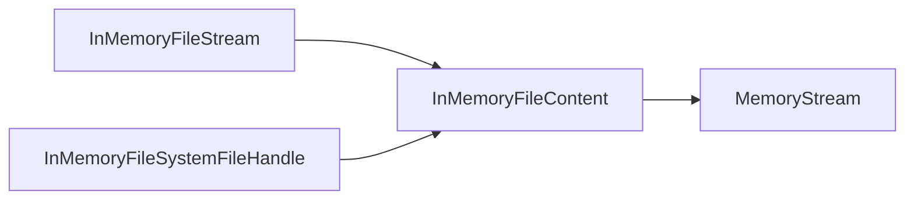

# Assimalign.Cohesion.FileSystem.InMemory — Design

## Design intent

A test-grade `IFileSystem` whose backing store lives entirely in process
memory. It implements the same file-system contracts as `PhysicalFileSystem`,
with the explicit limitation that in-memory data cannot survive process exit.

## Storage model

- The provider holds a single root `InMemoryFileSystemDirectory`. Every
  directory keeps a `Dictionary<FileSystemPath, InMemoryFileSystemInfo>`
  of children plus a synthetic `Lookup` view used by enumeration / traversal.
- Each file owns an `InMemoryFileContent` backed by a `MemoryStream`.
  Streams (`Open`) and positional handles (`OpenHandle`) share that buffer;
  `Size` and handle `Length` reflect its current length.
- Total space used is tracked at the file-system level. Writes that would
  push past `InMemoryFileSystemOptions.Size` throw
  `FileSystemException(NotEnoughSpace)`.

Both access paths depend on the same locked content buffer:



## Positional handles and durability

`IFileSystemFile.OpenHandle(FileMode, FileAccess, FileShare)` returns a
caller-owned `IFileSystemFileHandle` for page-oriented storage engines.
Each read or write supplies its offset, so independent operations never
share a cursor. The existing `Open` overloads retain their stream behavior.
`Stream` has neither concurrent positional operations nor a durability-aware
flush contract; a storage engine needs both explicitly in its file abstraction.

The handle reads and writes spans directly through the existing content
buffer's lock. A handle lock coordinates operations with disposal, while the
content lock also protects operations from other handles and streams. Writes
may extend the file, and `SetLength` truncates or zero-fills an extension.
Quota is reserved before a handle write changes the buffer, so rejected writes
leave both content and space accounting unchanged.

`SupportsDurableFlush` is always `false`: this provider has no durable medium.
`Flush(durable: false)` succeeds without further work because writes already
reach the shared memory buffer. Both `Flush(durable: true)` and
`FlushAsync(durable: true)` throw `NotSupportedException`. Failing loudly is
deliberate: a storage engine that asks for durability and silently does not
get it is worse than one that cannot start. Engines must explicitly choose
relaxed durability before using this provider.

Handles use the same access and sharing registrations as streams, including
delete-sharing checks. `Dispose` and `DisposeAsync` release a registration
exactly once; subsequent I/O, flush, property queries, and length changes throw
`ObjectDisposedException`. Async operations complete synchronously in memory
and honor cancellation before touching data. Like `File.OpenHandle`, an
append-mode handle still writes at the supplied offset; append-only cursor
behavior remains a property of `Open(FileMode.Append)` streams.

## Locking

Modeled on the Linux kernel's directory-locking rules
(https://www.kernel.org/doc/Documentation/filesystems/directory-locking).
Every mutation acquires explicit locks on the file system + parent
directories + target entry before touching state, then releases them via
`InMemoryFileSystemLockManager.Dispose()`. Read-only operations
(`Exists`, `GetInfo`) take a weaker `Delete` lock so they coexist with
concurrent reads but block in-flight deletions.

## Path handling

- `InMemoryFileSystemOptions.RootPath` defaults to `/` and rejects
  `..`-prefixed relative paths in the setter.
- The provider stores `IgnoreCase` (default true) and `CultureInfo`
  (default invariant) and uses them through `FileSystemPath.Equals` so
  lookups behave the same on Linux and Windows.
- Incoming paths are normalized via `RootDirectory.Path.Merge(path, culture, ignoreCase)`
  before any tree-walking — relative paths are rooted at the file system's
  root, absolute paths are checked for scope.

## Watch dispatcher

`InMemoryFileSystemDispatcher` exposes `Created`/`Deleted`/`Changed`/`Renamed`
events. Each mutation raises the appropriate event after the state change
completes; `InMemoryFileSystemEventToken` subscribes to the dispatcher and
filters by `Glob` and registration type.

Tokens implement `IDisposable` without changing `IFileSystemEventToken`.
Disposal detaches their named dispatcher handlers, clears registrations, and
removes the token from the file system's ownership registry. Tokens created
through file-system, directory, and file `Watch` entry points all enter that
registry, so owner disposal also cleans up tokens callers leave undisposed.
Both disposal orders are idempotent. InMemory has no polling timer or operating
system watcher; its lifetime resource is the dispatcher subscription.

Child dispatchers forward to their live parent instead of copying the parent's
delegates. This is necessary for unsubscription to release a token throughout
the tree; it also lets existing children observe later parent registrations.
Callbacks run synchronously outside the subscription gate over a snapshot.
They can unregister or dispose the token without invalidating enumeration.
An already selected callback may finish; each subsequent dispatch checks
disposal before invoking a subscriber, and future registrations are inert.

## Layout

```
src/
  InMemoryFileSystem.cs              public provider
  InMemoryFileSystemOptions.cs       public options bag
  InMemoryFileSystemLockHandle.cs    public lock-bearer base class
  Extensions/                        FileSystemFactoryBuilder extensions
  Internal/
    InMemoryFileSystemDirectory.cs
    InMemoryFileSystemFile.cs
    InMemoryFileSystemInfo.cs
    InMemoryFileSystemDispatcher.cs
    InMemoryFileSystemEventToken.cs
    InMemoryFileSystemLockManager.cs
    IO/
      InMemoryFileContent.cs
      InMemoryFileSystemFileHandle.cs
      InMemoryFileStream.cs
tests/
  FileSystemTests.cs            provider-specific behavior
  InMemoryFileHandleTests.cs    positional I/O and durability contract
  Shared/FileSystemStandardTests.cs (linked from root package)
```

## Examples

```csharp
// Default: 32 MB quota, ignore-case, root at "/".
using var fs = new InMemoryFileSystem(new InMemoryFileSystemOptions());

// Read-only fixture seeded ahead of time.
using var readonlyFs = new InMemoryFileSystem(new InMemoryFileSystemOptions
{
    IsReadOnly = true,
});

// Via the factory builder.
using var factory = new FileSystemFactoryBuilder()
    .AddInMemoryFileSystem(options =>
    {
        options.Name = "scratch";
        options.Size = Size.FromMegabytes(8);
    })
    .Build();
IFileSystem scratch = factory.Create("scratch");
```
