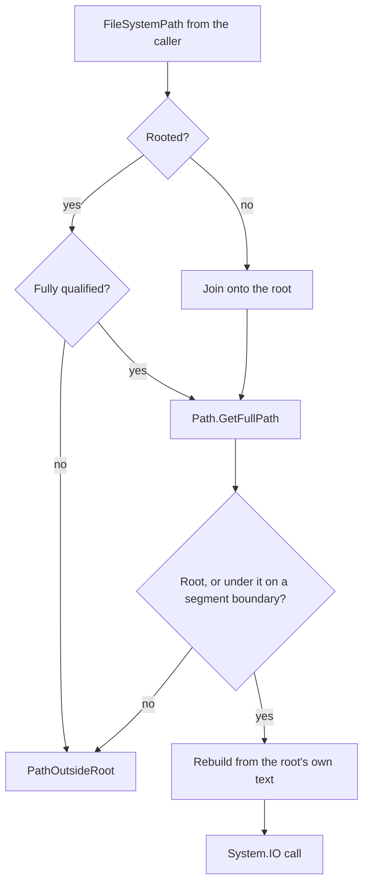
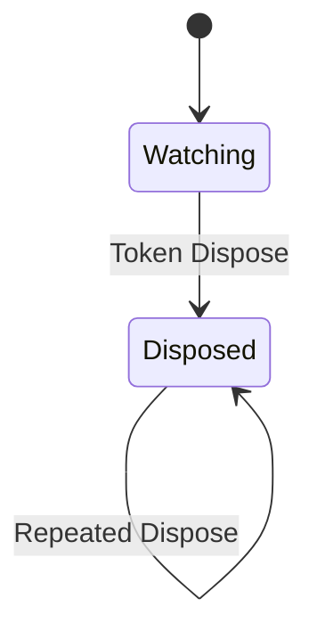

# Assimalign.Cohesion.FileSystem.Physical — Design

## Design intent

A thin adapter that lets callers use `IFileSystem` on top of the real disk.
The provider is intentionally a single root: pass an absolute path, get a
file system rooted there. No virtual mounts, no glob filters at the
provider level — for those, use the Aggregate provider.

## Positional file handles and durability

`IFileSystemFile.OpenHandle(FileMode, FileAccess, FileShare)` returns an owned
`IFileSystemFileHandle` for page-oriented storage. It opens a `SafeFileHandle`
with `File.OpenHandle` and performs reads, writes, length queries, and resizing
through `System.IO.RandomAccess`. Independent offsets can be used concurrently
without moving a shared cursor. The existing `Open` overloads still return
streams unchanged: `Stream` alone supplies neither concurrent positional I/O
nor a durability-aware flush, which a storage engine needs for commit recovery.

`SupportsDurableFlush` is `true`. `Flush(durable: true)` calls
`RandomAccess.FlushToDisk`, and returns only when that operation completes.
There is no managed write buffer, so `Flush(durable: false)` has no work to do.
`FlushAsync` checks cancellation before starting; a durable flush uses the same
synchronous runtime primitive because .NET has no asynchronous durable flush.
An I/O error propagates to the caller rather than being downgraded to success.

The family contract requires `NotSupportedException` for durable flush whenever
`SupportsDurableFlush` is `false`. This physical provider can honor the request;
non-durable providers must fail loudly because acknowledging a commit without
durable data prevents the storage engine from recovering that commit.

The caller disposes each handle, synchronously or asynchronously. Disposal
releases the native handle and later operations throw `ObjectDisposedException`.
Mode, access, sharing, and read-only-provider checks still apply. As with
`File.OpenHandle`, `FileMode.Append` opens or creates a write-only handle; writes
use the explicitly supplied offsets rather than a stream's append cursor.
All implementation paths use .NET 10 public APIs without reflection and retain
NativeAOT compatibility.

## Root containment

Every member that takes a path — `Exists`, `GetInfo`, `GetFile`, `GetDirectory`, `CreateFile`,
`CreateDirectory`, `DeleteFile`, `DeleteDirectory`, `CopyFile`, `Move`, and the directory-level
members that forward to them — passes it through one private resolver before any `System.IO`
call. The resolver turns the path into the full host path that will be opened and refuses it
with `FileSystemException` (`FileSystemErrorCode.PathOutsideRoot`) unless it is the root or lies
under the root on a segment boundary. Copy and move resolve both ends first.

The resolver runs in this order, and only its last step touches the disk:



- **Relative paths** are joined onto the root. **Rooted paths** name a host location and must be
  fully qualified: on Windows `C:file` and `/file` resolve against the process's current
  directory or drive, so they cannot be shown to lie under the root and are refused outright.
- **`Path.GetFullPath`** applies the host's own normalization, so the check runs on exactly the
  string that is opened. `.` and `..` collapse here and never reach the operating system. On
  Windows it also applies Win32's trimming of trailing dots and spaces, and a final `NUL` segment
  becomes the `\\.\NUL` device — which then fails the check instead of opening the device.
- **The boundary check** compares ordinal ignore-case on Windows and the Apple platforms and
  ordinal elsewhere, the split the BCL uses for its own path comparisons. A volume root
  (`C:\`, `/`) contains everything on its volume.
- **The checked path is rebuilt from the root's own text**, so a case-insensitive match can never
  hand the disk a differently cased root, which on a case-sensitive volume (a case-sensitive APFS
  volume, a Windows directory with case sensitivity enabled) would be another directory.
- **Nothing is decoded.** `%2e%2e`, `..%2f`, and look-alike full stops are literal characters of
  an in-root name.
- **`RootDirectory.Parent` is `null`**, as it is for every other provider. The host parent lies
  outside the root, and entries enumerated or opened through it bypassed every path check.

```csharp
var fs = new PhysicalFileSystem(new PhysicalFileSystemOptions { Root = "/srv/public" });

fs.CreateFile("css/site.css");             // -> /srv/public/css/site.css
fs.GetFile("../public/css/site.css");      // -> /srv/public/css/site.css (back inside)
fs.GetFile("/srv/public/css/site.css");    // -> /srv/public/css/site.css
fs.GetFile("../secret.txt");               // FileSystemException: PathOutsideRoot
fs.GetFile("/srv/public2/secret.txt");     // FileSystemException: PathOutsideRoot (sibling prefix)
fs.GetFile("css/../secret.txt");           // ArgumentException: FileSystemPath.Parse refuses interior ".."
```

Until #1180 the provider merged incoming paths onto its root with `FileSystemPath.Merge` and
relied on it for containment, which it never provided: a leading `..` climbed out of the root and
a prefix test without a segment boundary accepted sibling directories such as `public2/`. Shipped
in 10.0.0-preview.1.

### Symbolic links and junctions

**Containment is lexical.** It is decided on the normalized path text — the same text the disk
APIs receive — and the operating system then follows any symbolic link, junction, or mount point
on that path. A link inside the root that points outside it is therefore followed, and
`PhysicalFileSystemContainmentTests` pins that.

Rejected alternative: resolving links (`FileSystemInfo.ResolveLinkTarget`, segment by segment)
and checking the final target.

- **It is a time-of-check/time-of-use race.** Whoever can create a link inside the root can swap
  it between the check and the open, so the check would promise what it cannot keep. The only
  race-free mechanisms are kernel-side (`openat2` with `RESOLVE_BENEATH` on Linux; nothing
  equivalent on Windows), and .NET exposes neither.
- **It costs a system call per segment** on every operation.
- **It breaks legitimate layouts** that link shared content into a root, such as a web root whose
  `assets` directory is a link to a shared location.

The threat this provider defends against is an untrusted *path string* (CWE-22). Someone who can
create links inside the root already controls the root's content; the defense against that is the
operating system's: do not mount a root that untrusted parties can write to, and run under an
account that cannot read what it must not serve. No `..` ever reaches the operating system, so a
link cannot turn `link/..` into a different parent.

## Size reporting

`Size`, `SpaceAvailable`, `SpaceUsed` are sourced from the partition's
`DriveInfo`, not the root directory's recursive footprint. That's
intentional — the provider can't efficiently maintain a recursive size
without walking the tree on every query, and callers that care about
directory-scoped usage can compute it through enumeration.

## Auto-parent creation

`System.IO.FileInfo.Create` throws `DirectoryNotFoundException` if any
intermediate directory is missing. The provider explicitly calls
`info.Directory.Create()` before delegating to `Create()` so the public
contract (auto-create on `CreateFile("a/b/c/leaf.txt")`) holds.

`CopyFile` and `Move` apply the same fix-up on the destination side. The
source-side existence check happens first so a missing source still
throws `NotFound` rather than silently failing.

## Watch

`PhysicalFileSystemChangeToken` directly owns a `FileSystemWatcher`, so its
lifetime is already independent of provider disposal. Physical watch tokens
are caller-owned: `PhysicalFileSystem.Dispose()` does not own or stop them.
Callers end a watch scope with `(token as IDisposable)?.Dispose()`; the
`IFileSystemEventToken` interface remains unchanged. Native notifications do
not open watched files, so the IsolatedStorage polling share-mode collision
does not apply. Reported paths are checked against the token's glob.

Token disposal retires all registrations before disposing the watcher and is
idempotent, including disposal from within a callback. Subscription changes
and notification snapshots share a gate, so a callback can unregister itself
without invalidating iteration. Each dispatch rechecks whether its token or
registration was retired. User callbacks run outside that gate: an already
dispatched callback may finish after disposal, while queued notifications
cannot revive the watcher or access its disposed resources. Registration on
a disposed token throws `ObjectDisposedException`.

The token owns its watcher through this lifecycle:



## Exception mapping

Every `System.IO` exception is caught in the provider and re-thrown as
`FileSystemException` with the appropriate `FileSystemErrorCode` (see
`docs/OVERVIEW.md` for the matrix). The original exception is preserved
through `InnerException` for callers that need it.

A path outside the root raises `PathOutsideRoot` from the resolver, before any
`System.IO` call, so there is no inner exception. Its message names only the
caller's path, never the root or the resolved host path.

## Layout

```
src/
  PhysicalFileSystem.cs           public provider
  PhysicalFileSystemOptions.cs    public options bag
  Extensions/
    PhysicalFileSystemExtensions.cs
  Internal/
    PhysicalFileSystemDirectory.cs
    PhysicalFileSystemFile.cs
    PhysicalFileSystemFileHandle.cs
    PhysicalFileSystemInfo.cs
    PhysicalFileSystemChangeToken.cs
    FileSystemInfoHelper.cs
tests/
  PhysicalFileSystemTests.cs         provider-specific behavior
  PhysicalFileSystemContainmentTests.cs root containment, encodings, case, devices, links
  PhysicalFileSystemFileHandleTests.cs positional I/O, durability, and disposal
  PhysicalFileSystemStandardTests.cs inherits the shared contract suite
  Shared/FileSystemStandardTests.cs  (linked from root package)
```

## Cross-platform behavior

- Path separators: incoming `/` is honored by `System.IO` on every OS.
  Windows reports `\` separators in some return paths (e.g. enumeration);
  the provider returns the raw `System.IO` strings via `FileSystemPath`
  conversion which keeps the `/` convention for callers.
- Case sensitivity follows the host file system for lookups. The root
  containment check alone assumes the platform default (see *Root
  containment*) and rebuilds the checked path from the root's own text.
- File attributes (`Hidden`, `System`) can be excluded from enumeration via
  `PhysicalFileSystemOptions.IgnoreAttributes`.
