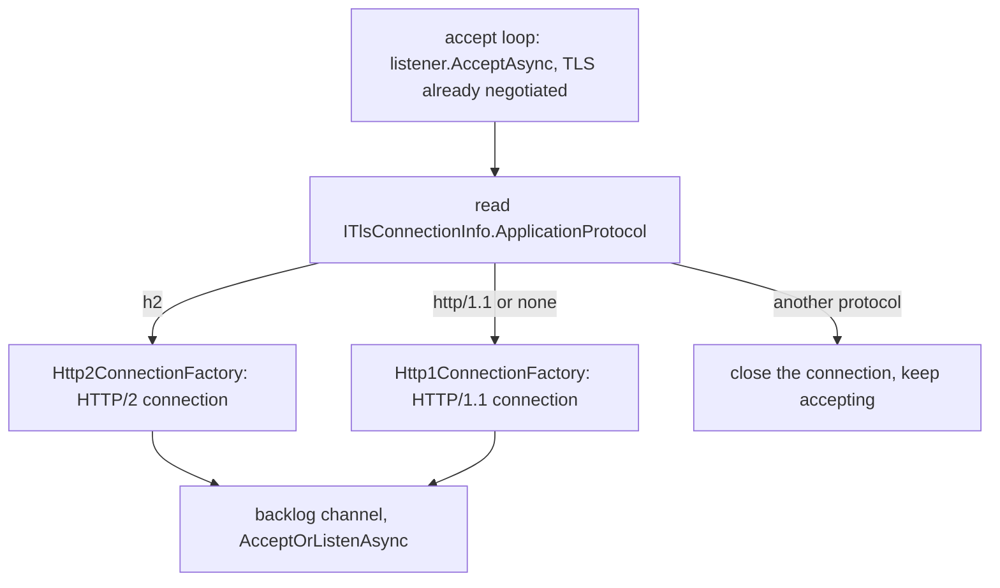
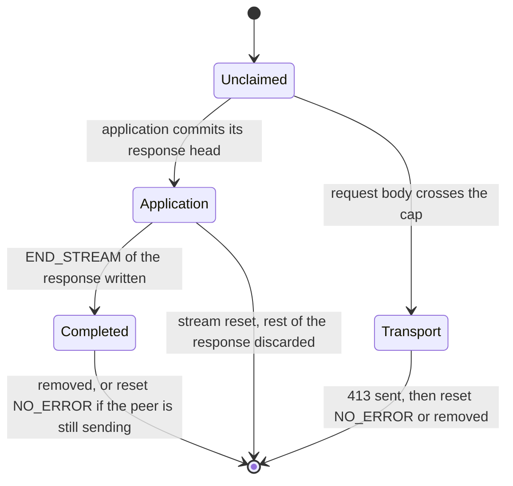
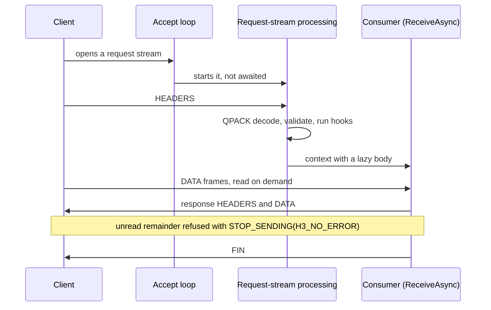
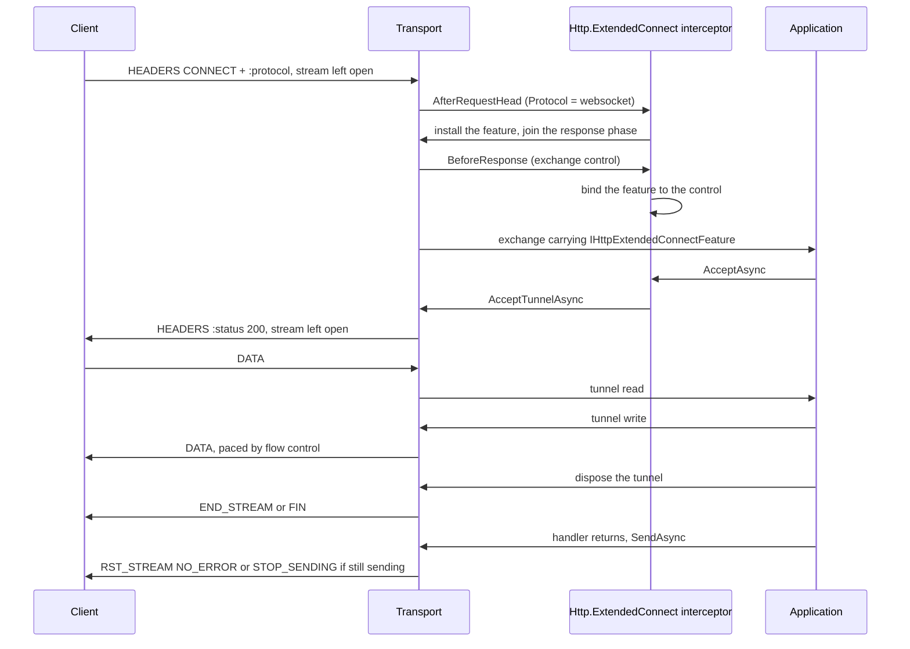

# Assimalign.Cohesion.Http.Connections — Design

This document captures the design intent behind the shipped HTTP transport
surface. It is intentionally focused on the design decisions a future
reader (or future Claude session) would otherwise have to re-derive from
diffs. It describes the surface as it ships today. (It used to point at a
forward-looking `DESIGN_SUGGESTION.md` for a multiplex-aware refactor; that file
was never committed, and the multiplexed dispatch it anticipated now lives in the
Web server, #1049.)

## Transport seam: consuming `Assimalign.Cohesion.Connections`

### What it is

This package no longer carries (or inherits) any transport machinery of
its own. The deleted `Assimalign.Cohesion.Transports` stack
(`ITransport`, `ITransportConnection`, `ITransportConnectionContext`,
`TransportConnectionPipe`, `ServerTransport<T>`, the `Items`/`IsSecure`
extensions) has been replaced by consumption of the
`Assimalign.Cohesion.Connections` contracts:

- `IConnectionListener` produces live `IConnection`s — the connection
  **is** the duplex pipe (`Input`/`Output` directly on it; there is no
  separate "context" and no `OpenAsync` step on the transport).
- `IMultiplexedConnectionListener` produces `IMultiplexedConnection`s
  whose accepted/opened streams are themselves `IConnection`s with a
  per-stream `Direction`.

HTTP **consumes** these contracts; it never extends them. The HTTP-side
contracts (`IHttpConnectionListener`, `IHttpConnection`,
`IHttpConnectionContext`) are standalone interfaces that wrap a
connection and project HTTP semantics over it.

### Structural listener registration

`HttpConnectionListenerOptions` binds concrete listeners to protocols
with shape safety enforced at the seam:

```csharp
HttpConnectionListener listener = HttpConnectionListener.Create(options =>
{
    options.UseHttp1(tcpListener);                 // IConnectionListener
    options.UseHttp2(tlsTcpListener, http2 =>      // IConnectionListener (TLS pre-composed)
    {
        http2.Limits.MaxStreamsPerConnection = 256;
    });
    options.UseHttp3(quicListener, http3 =>        // IMultiplexedConnectionListener
    {
        http3.QPack.MaxTableCapacity = 4096;
    });
});
```

- `UseHttp1` / `UseHttp2` accept an `IConnectionListener` (or a
  `Func<IConnectionListener>` materialized when the
  `HttpConnectionListener` is constructed) and **gate on capabilities,
  never on protocol identity**: the listener's `ConnectionCapabilities`
  must report `Delivery == Stream`, `IsReliable`, and `IsOrdered`, else
  an `ArgumentException` describes the capability mismatch.
  `ConnectionProtocol` is diagnostics-only and is never branched on.
- `UseHttp3` accepts an `IMultiplexedConnectionListener` — the parameter
  type itself is the shape gate, so no runtime capability check is
  needed for stream multiplexing.
- `UseHttp1AndHttp2` registers one listener for both stream protocols and
  chooses between them per connection from the protocol ALPN selected (see
  "Serving HTTP/1.1 and HTTP/2 on one TLS listener"). Its gate adds one
  capability: ALPN is a TLS extension, so the listener must report
  `Security == Tls`, else an `ArgumentException` names the mismatch.

### Per-version options, captured per registration

Every `Use*` method has an overload taking a configure callback for that
version's options type — `Http1ConnectionListenerOptions`,
`Http2ConnectionListenerOptions`, `Http3ConnectionListenerOptions` (all under
`Options/`) — so each protocol version owns its own configuration surface
instead of sharing one listener-wide bag. The options are captured **per
registration** at `Use*` time and closed over by that registration's
connection-factory builder; two registrations of the same version can carry
different limits. Cross-version concerns stay listener-wide on
`HttpConnectionListenerOptions`: the request/response interceptors (snapshotted
when the `HttpConnectionListener` is constructed) and `BacklogCapacity`.

Limits follow the same split. `HttpConnectionListenerLimits` is the abstract
base holding only the limits meaningful to all three versions
(`MaxRequestBodySize`, `KeepAliveTimeout`, `RequestHeadersTimeout` — each
documents where it is enforced today); the version-specific types nest inside
their options class (`Http1ConnectionListenerOptions.Http1Limits` adds the
HTTP/1.1 wire-format bounds, `Http2ConnectionListenerOptions.Http2Limits` adds
the HTTP/2 abuse caps). `Http3ConnectionListenerOptions.Http3Limits` adds only
`MaxRequestHeadersFrameSize` — the bound on the one request-stream frame the
server buffers whole — because HTTP/3's stream and flow-control limits live in
the QUIC transport (see the HTTP/3 non-goals). What that frame decodes to is
bounded by `Http3QPackOptions.MaxFieldSectionSize`, beside the other settings the
QPACK decoder advertises and enforces (see "QPACK field-section compression →
Decoded field-section size").

`BacklogCapacity` retains its bounded-channel semantics: it caps how
many accepted HTTP connections may buffer before the per-listener accept
loops wait for `AcceptOrListenAsync` to drain them.

### Bind lifecycle, accept loops, and the live-connection model

`HttpConnectionListener.BindAsync` is the explicit resource-acquisition boundary. It awaits
`BindAsync` on every registered stream and multiplexed transport before it completes, and it does
not start any accept loop. Binding is idempotent. If a later transport fails to bind, the aggregate
releases every materialized listener and rethrows the original failure, so host startup cannot
leave a partially bound endpoint set behind. `DisposeAsync` is the symmetric release boundary and
is terminal for that listener instance; an in-process restart constructs a fresh host and listener.

`AcceptOrListenAsync` retains a compatibility fallback that invokes `BindAsync` before starting the
accept loops. Hosted servers still call `BindAsync` explicitly from their awaited `StartAsync`, so a
resource is never reported started while its endpoint remains unbound. Alt-Svc is computed only
after all transports bind, allowing an HTTP/3 listener configured with port zero to advertise its
actual assigned port.

`HttpConnectionListener` runs one accept loop per registered listener.
The HTTP/1.1 and HTTP/2 loops do `IConnection connection = await
listener.AcceptAsync(token)` and wrap the result in
`Http1Connection`/`Http2Connection`; the HTTP/3 loop accepts an
`IMultiplexedConnection` (with the QUIC platform guard) and wraps it in
`Http3Connection`. Because connections are already live when produced,
`IHttpConnection.Open()`/`OpenAsync` is a synchronous projection — it
constructs the protocol's connection context over the wrapped
connection; there is no transport open step to await.

The connection-is-the-pipe model shows up at three points:

- Stream parsing (HTTP/1.1, HTTP/2) adapts the duplex pipe once via
  `connection.AsStream()`.
- Graceful teardown completes `connection.Output` directly (HTTP/2
  GOAWAY + bounded stream drain, HTTP/1.1 response drain) before disposal
  (see "HTTP/2 graceful close"). A host that drains for longer begins the
  close earlier through `IHttpConnectionContext.BeginGracefulClose` (see "The
  host contract").
- HTTP/3 reads every accepted stream's `Input` (`PipeReader`) directly —
  unidirectional streams and request streams alike (see "Request streams:
  dispatch at HEADERS, lazy body") — and writes responses through
  `AsStream()`.

### Audited context surface

`IHttpConnectionContext` declares only what the HTTP internals and their host
actually consume: the endpoints, `ReceiveAsync`/`SendAsync`, and the host's
`BeginGracefulClose` (see "The host contract"). The inherited
members of the old transport context (`Pipe`, `Items`,
`ConnectionClosed`, `Close…`) were plumbing and are gone. Contexts that
have no connection-level byte stream — the HTTP/3 connection context
(whose bytes live on per-request streams) and
`NotSupportedHttpConnectionContext` — no longer fabricate a fake pipe
over `Stream.Null`; the member simply does not exist.

### Exchange construction: the context builds its request and response

Every version decodes a request head off the wire — host, path, method, scheme,
query, headers, body stream and trailers, carried as the internal
`TransportHttpRequestHead` — and runs the request-parse interceptors over it
before any exchange exists. The interceptor pipeline returns the effective
body (the outermost hook wrapper) alongside the hook-populated features. Only
then does the transport construct its version's context (`Http1Context`,
`Http2Context`, `Http3Context`), passing the head. The shared
`TransportHttpContext` constructor builds one `TransportHttpRequest` and one
`TransportHttpResponse` and passes itself to each, so `request.HttpContext`
and `response.HttpContext` are read-only and assigned at construction. They
are never observed unset, and nothing can re-parent them (#699).

The method is parsed the same way on every version: the request-line token, or
the `:method` field, goes through `HttpMethod.GetCanonicalizedValue`, which keeps
it as sent and matches the standard methods byte for byte (RFC 9110 §9.1, #1301).
`get`, `head` and `connect` are unknown extension methods, so HTTP/1.1 sends a
body for `head`, and HTTP/2 and HTTP/3 treat a `connect` that carries `:scheme`
and `:path` as the ordinary request their pseudo-header checks, which already
compared `CONNECT` ordinally, took it for. On HTTP/1.1, `connect host:port`
used to become a `CONNECT` tunnel and is now rejected as a malformed
request-target (authority-form on a method that is not `CONNECT`), and
`options *` is rejected the same way, because asterisk-form belongs to
`OPTIONS` alone. Before #1301 the token was upper-cased here, and the transport
applied semantics an intermediary in front of it did not.

The request and response are the same sealed types on every version. The
former per-version subclasses (`Http1Request` … `Http3Response`) added no
members, so they were removed. Version-specific state lives on the contexts:
the HTTP/1.1 keep-alive decision, the HTTP/2 stream, and the HTTP/3 stream
connection and lazy body.

Alternatives considered and rejected:

- **The previous wire-up.** The transports built request, then response, then
  context, and the context constructor called an internal `AttachContext` on
  the request and response. That kept a mutating method on both types whose
  only purpose was construction order, and a getter guard that threw for a
  state that existed only mid-construction.
- **A `Func<HttpContext>` handed to the request.** It removes the mutation but
  costs an indirection and a captured closure per exchange for a reference
  that never changes.
- **A `protected init` accessor on the public `HttpRequest.HttpContext`.**
  That changes the public abstract surface, and every implementation, to solve
  an ordering problem internal to this package.

The same rule is documented on `HttpRequest.HttpContext`: a context
constructs its request and response and passes itself to each. A
non-transport implementation, such as a test double, follows it too.

### The host contract: dispatch and fault finalization

A host drives each connection context in a loop — receive an exchange, run its
application, finalize it with `SendAsync` — and two properties of that loop are part
of this package's contract, not implementation detail:

- **HTTP/1.1 exchanges are consumed one at a time.** The HTTP/1.1 receive enumerator
  does the connection-level work for the next request inside `MoveNextAsync` — it reads
  the finished exchange's keep-alive decision, drains the request body the application
  left unread, and only then parses the next head — so a host must not ask for the next
  exchange until the previous one has been sent. HTTP/2 and HTTP/3 exchanges may be
  served concurrently: neither needs an exchange to finish before it can yield the next
  (the HTTP/2 frame pump and the HTTP/3 accept loop both run independently of the
  consumer, and an HTTP/3 exchange keeps reading its request body after the receive
  enumeration ends), and `SendAsync` is safe for different exchanges
  at once (the HTTP/2 write scheduler serializes frames; HTTP/3 writes each response to
  its own QUIC stream). The number of exchanges in flight is bounded by stream admission —
  `SETTINGS_MAX_CONCURRENT_STREAMS` and the QUIC stream credit — not by the host.
  `Web.Hosting`'s `WebApplicationServer` is the reference host (#1049).
- **Every exchange is finalized exactly once through `SendAsync`.** A reset is
  requested with `IHttpContext.Cancel` before the send, which the transport maps to the
  version's wire rejection (see "The `SendAsync` inversion"). A host that finalizes an
  exchange whose application faulted has to choose between a replacement response and a
  reset, and only the transport knows which is still possible. It reads
  `HttpContextTransportExtensions.HasResponseStarted` (an extension property on
  `IHttpContext`) — the same state `IHttpExchangeControl.HasResponseStarted` reports to
  response interceptors, true once the final head is committed by a streamed write or
  flush through the raw body sink or by the buffered send. Before the start a
  replacement (for example a bare `500`) can still be sent; after it, sending would
  finalize the started response as if its truncated body were whole, so the host resets
  instead. The probe is a type test over the transport's own exchange types and reports
  `false` for any other `IHttpContext`, whose response the transport cannot observe.
- **A host stops a connection in two steps (#146).** `IHttpConnectionContext.BeginGracefulClose`
  starts a lame-duck close: the connection takes no new exchange and announces the close
  the way its version requires, while every exchange already yielded keeps its request body
  and its `SendAsync`. `ReceiveAsync` then ends on its own once nothing more can arrive, so a
  host's receive loop completes without being cancelled. When the host stops waiting, it
  cancels the token it enumerates `ReceiveAsync` with: every exchange the connection yielded
  observes `RequestCancelled`, on all three versions. The call returns at once; a frame it
  needs is written in the background, and the connection's disposal waits for it.

  | Version | Announcement | New work after the call | `ReceiveAsync` ends |
  | --- | --- | --- | --- |
  | HTTP/1.1 (RFC 9112 §9.6) | `Connection: close` on the response to the exchange in flight | not read; an idle keep-alive wait ends at once without a response, but a request whose head started to arrive is read and answered with `Connection: close` | after the exchange in flight, or at once when idle |
  | HTTP/2 (RFC 9113 §6.8) | `GOAWAY(NO_ERROR)` carrying the highest stream accepted | a new stream, or one whose header block was still arriving, is refused with `RST_STREAM(REFUSED_STREAM)` | once the contexts already queued are read |
  | HTTP/3 (RFC 9114 §5.2) | `GOAWAY` carrying the first stream not accepted, once the accept loop has stopped | not accepted; a request whose head was still arriving is reset with `H3_REQUEST_REJECTED` | after the requests already published |

  The seam is a member of the context contract rather than a capability interface a host
  type-tests for: every context this package produces implements it, and a host that drains
  should not have to discover whether it can. Alternatives considered and rejected:
  - **A second token on `ReceiveAsync`** ("stop receiving" beside "cancel"). On HTTP/1.1 and
    HTTP/3 the enumeration token already *is* each exchange's abort token, and a token can
    only say "now" — it cannot carry the announcement a version needs.
  - **Draining inside disposal only**, as the HTTP/2 teardown did before. Disposal must be
    bounded, so it cannot hold a connection open for the host's whole drain budget, and a
    host disposes a connection only after its own exchanges are done.

### TLS is a pre-composed layer, not an HTTP concern

TLS never happens inside this package. The composition root layers it
onto the listener before registration (`listener.UseTls(options)` /
`listener.Use(layer)` from the security/connections libraries), and the
layered listener's `Capabilities.Security` reports `ConnectionSecurity.Tls`.
HTTP derives its per-connection `isSecure` flag from exactly that:
`listener.Capabilities.Security == ConnectionSecurity.Tls`, captured once
per accept loop. There is no registration-time `isSecure` parameter, no
`Items`-backed handshake probe, and no OR-promotion rule — the
capability is the single source of truth, and the scheme
(`http`/`https`) flows from it. The handshake itself runs per connection
inside the layered listener, never in an accept loop here, and a failed
one never reaches this package (see "Accept-side isolation: where the
handshake runs").

What the handshake *negotiated* is a per-connection fact the capability
cannot carry. HTTP reads it through the contracts library's
`ITlsConnectionInfo`, which the connection that ran the handshake implements
(the TLS layer's secured connection, a QUIC connection), for two purposes:
choosing the protocol of a dual listener (next section) and republishing
the facts on each exchange's connection info (see "The TLS session on every
exchange"). The package still depends only on `Assimalign.Cohesion.Connections`
and core Http; it references neither the TLS layer nor the HTTP TLS feature
package (`Assimalign.Cohesion.Http.Tls`).

### Serving HTTP/1.1 and HTTP/2 on one TLS listener (ALPN)

#### What it is

An `https` origin is expected to answer HTTP/2 and HTTP/1.1 on one port:
the client offers the protocols it speaks in the TLS handshake through ALPN
(RFC 7301), the server selects one, and the connection speaks it (RFC 9113
§3.2 identifies HTTP/2 over TLS as `h2`). `UseHttp1AndHttp2(listener,
configureHttp1, configureHttp2)` registers such a listener. Each protocol
keeps its own options, captured at registration like those of
`UseHttp1`/`UseHttp2`, and both share the listener-wide interceptors.

Each accepted connection is dispatched by the protocol its handshake
negotiated, read through `ITlsConnectionInfo`:

| Negotiated | Served |
|---|---|
| `h2` | HTTP/2 |
| `http/1.1` | HTTP/1.1 |
| none: the client sent no ALPN extension, or the connection does not implement `ITlsConnectionInfo` | HTTP/1.1, what a client that does not negotiate expects of an `https` origin |
| anything else, which the server offered through an application-supplied list (`acme-tls/1`, say) | the connection is closed; the accept loop keeps accepting |

The flow for one accepted connection:



#### Where the choice is made

The registration carries an internal `HttpAlpnConnectionFactory` in place of
a single protocol's factory. It holds the HTTP/1.1 and the HTTP/2 factory and
picks one per connection, so the accept loop is unchanged: it still asks the
registration's factory for the connection. A factory that cannot serve a
connection now returns `null`, and the loop disposes that one connection and
keeps accepting instead of treating it as a listener fault. The `Alt-Svc`
value is pushed into both inner factories, so an HTTP/1.1 and an HTTP/2
response from the endpoint advertise the same h3 alternative.

The listener reports both protocols in `HttpConnectionListener.Protocols`.

#### Why here, and the alternatives rejected

- **The transport owns the choice.** Picking the connection parser is
  transport work: this package owns the factories and the accept loop, and
  the host only exposes the surface (`Web.Hosting`'s `UseHttps`).
- **Not two registrations on one listener.** Coalescing `UseHttp1` and
  `UseHttp2` calls that name the same listener would be implicit, and would
  need two accept loops to agree on one listener's connections.
- **Not preface sniffing.** Detecting the HTTP/2 connection preface is how
  prior knowledge works on cleartext (RFC 9113 §3.3). On a TLS connection the
  handshake has already decided, and RFC 9113 §3.2 makes ALPN the way HTTP/2
  starts for `https`.
- **Unknown protocols close rather than fall back to HTTP/1.1.** RFC 7301
  §3.2 binds the connection to the protocol the handshake selected; speaking
  HTTP/1.1 on it would answer a client that agreed to something else.

#### Scope

- **TLS only.** A cleartext listener has no ALPN, so the registration rejects
  it. HTTP/2 prior knowledge and the deprecated `h2c` upgrade on a shared
  cleartext port are not supported; register `UseHttp1` and `UseHttp2` on
  separate listeners.
- **The single-protocol registrations ignore ALPN.** `UseHttp1` and
  `UseHttp2` on a TLS listener serve their one protocol whatever was
  negotiated, so their TLS options should offer only that protocol (the
  `Web.Hosting` verbs default the list accordingly).
- **The HTTP/2-over-TLS profile of RFC 9113 §9.2** (TLS 1.2 or later, the
  TLS 1.2 cipher-suite blocklist) is left to the TLS options; the transport
  does not inspect the negotiated version or suite before serving `h2`.

## Per-request feature injection — request-parse interceptors

### What it is

`HttpConnectionListenerOptions.Interceptors` is the **single** injection seam the
transport exposes for code outside this package to participate in an exchange's
lifecycle — one list, one registration order, spanning the request-parse hooks
and the response hooks. The contract — `IHttpExchangeInterceptor` (implemented by
deriving from the guided `HttpExchangeInterceptor` base), the phase contexts, and
the typed rejection `HttpRequestRejectedException` — lives in core
`Assimalign.Cohesion.Http` (a generic seam, like `IHttpFeature`), so feature
packages implement hooks without referencing this transport package and this
transport never references them. The `HttpConnectionListener` snapshots the list
once at construction and partitions it by each interceptor's declared
`HttpInterceptorScopes` — request-scoped hooks and response-scoped machinery are
invoked only for interceptors that declared that phase, which keeps the zero-cost
fast paths scope-exact (a request-only default like `Http.RequestLimits` never
causes a response sink or exchange control to be constructed). A request-parse hook
can also add an interceptor to its own exchange's response phase
(`HttpExchangeInterceptorRequestContext.AddResponseInterceptor`): each transport
resolves the exchange's response interceptors at setup
(`TransportHttpContext.ResolveResponseInterceptors`: the listener's, then the added
ones, each once) and builds the sink and control only when that list is non-empty,
so the default protocol-upgrade interceptor costs an ordinary exchange nothing on
any version:

```csharp
HttpConnectionListenerOptions options = new();
options.Interceptors.Add(HttpRequestLimits.CreateMaxRequestBodySizeInterceptor());
options.Interceptors.Add(new RequestDigestInterceptor(/* parse-time hashing */));
```

Per request each transport (using the HTTP/1.1 parser as the reference; HTTP/2
and HTTP/3 run the same steps 2–5 through the shared
`HttpRequestInterceptorPipeline` — see "Protocol coverage" below) walks the
request's lifecycle hooks in order:

1. Parses the head (request line + headers) under the configured limits, then
   derives host/scheme.
2. Builds one `HttpExchangeInterceptorRequestContext` — head data, a **read-only**
   header view (`HttpHeaderCollection.AsReadOnly()`), a fresh feature
   collection, and the body-size knob seeded from the registration's
   `Http1Limits.MaxRequestBodySize` — and runs every `AfterRequestHead` hook in
   registration order.
3. Runs every `BeforeRequestBody` hook in registration order — the body is about
   to be surfaced (HTTP/1.1 and HTTP/3: as the lazy streamed body, no octet
   consumed yet) or exposed (HTTP/2). On HTTP/1.1 this precedes any
   `Expect: 100-continue` solicitation (itself lazy, at the first body read), so a
   hook that rejects here does so before the body is solicited. On HTTP/1.1 and
   HTTP/3 the knob is **not yet frozen** there — it freezes at the first body
   read, which is what opens the pre-read override window to middleware (see
   "Per-request body-size override"); the shared pipeline hands HTTP/3's lazy body
   the parse context (`IHttpLazyRequestBody`) instead of freezing. On HTTP/2 the
   pipeline freezes the knob first, so its hooks observe the frozen value. CONNECT
   tunnels skip it.
4. Materializes the body stream — on HTTP/1.1 the lazy `Http1RequestBodyStream`,
   on HTTP/3 the lazy `Http3RequestBodyStream` (both enforce the cap at read time,
   413 on violation); on HTTP/2 the flow-controlled streaming body (the frozen cap
   enforced on receipt, 413 on violation — see "HTTP/2 response flow control,
   HEAD, and the request-body cap") — and runs every `AfterRequestBody` hook in
   registration order, each receiving the previous result — the last registered
   interceptor produces the outermost wrapper. CONNECT tunnels skip body hooks;
   empty bodies still run them.
5. Constructs the exchange, flowing the hook-populated feature collection and
   the effective body in through the context constructors (the request head
   carries the body; the `features` parameters on
   `Http1Context`/`Http2Context`/`Http3Context` and `TransportHttpContext`
   forward the collection). See "Exchange construction: the context builds
   its request and response".

**Zero registered interceptors is a true fast path**: no context, no feature
collection, no read-only header view, no hook dispatch — the parser enforces
the listener-wide limits exactly as it did before the seam existed.

> Historical note: an earlier revision of this document described a
> `HttpConnectionListenerOptions.CreateFeatures` factory. That factory was
> never implemented — the doc ran ahead of the code — and the interceptor seam
> supersedes it: `AfterRequestHead` + `Features.Set` covers feature seeding and
> adds cap adjustment, stream wrapping, and typed rejection that a
> feature-collection factory could never express.

### Why per-request, not per-connection

Unchanged from the original design reasoning: `IHttpContext` is
`IAsyncDisposable` and tears down at the end of every request, so per-request
scoping gives features deterministic cleanup; HTTP/2 and HTTP/3 multiplex many
requests over one connection, so connection-scoped mutable state is a data race
by construction; and application code reasons in requests, not connections.
Interceptor *instances* are the inverse: registered once on the options,
snapshotted into an array when the `HttpConnectionListener` is constructed
(later registrations are inert — no racing the accept loops), and shared across
every connection and request. Implementations must therefore be stateless and
thread-safe; all per-request state belongs in the context's feature collection.

### Exception classification on the parse path

- **`HttpRequestRejectedException`** (4xx/5xx-constrained) is the sanctioned way
  for a hook to refuse a request; each transport answers it with the wire
  behavior appropriate to its framing, ahead of the wire-level classifier:
  - **HTTP/1.1** — caught in `Http1ConnectionContext.TryReadRequestAsync`,
    answered with a minimal bodyless status response, and the connection is
    closed (never reused: remaining wire state is indeterminate).
  - **HTTP/2** — `Http2ConnectionContext.TryDispatchStreamAsync` translates it
    into an `Http2StreamException` carrying `CANCEL`, so the frame pump emits
    `RST_STREAM(CANCEL)` (RFC 9113 §5.4.2), removes the stream (reclaiming its
    receive-window debt), and keeps serving the connection's other streams.
    HTTP/2 has no `REQUEST_REJECTED` code; `CANCEL` is the neutral per-stream
    termination already used by the transport's application-cancel path
    (`IHttpContext.Cancel`), and deliberately avoids `REFUSED_STREAM`'s "safe to
    retry" promise, which could amplify load against the very DoS-mitigation
    interceptors this seam hosts.
  - **HTTP/3** — `Http3ConnectionContext.CreateContextAsync` resets the request
    stream (RFC 9114 §4.1) with an `Http3StreamException` carrying
    `H3_REQUEST_REJECTED` — the request was refused before any application
    processing, so the peer may retry it (RFC 9114 §4.1.1) — leaving the QUIC
    connection and its other streams intact. The code reaches the wire through
    the stream's code-carrying abort (`IMultiplexedStreamAbort`, #1080), on the
    QUIC driver as on the in-memory one.

  In every case the request-parse interceptor pipeline has already torn down the
  partially-built body-wrapper chain and every hook-attached feature before the
  rejection surfaces, so the transport's rejection handler only performs the wire
  action, never the cleanup.
- **`IOException`-family exceptions** thrown by a hook are indistinguishable
  from wire failures and get silently classified as such (connection dropped,
  no response). This is a documented hazard, not a feature: hooks must use the
  typed rejection for control flow.
- **Anything else** propagates — programmer errors are not masked, matching the
  receive-loop failure-isolation philosophy.

Hooks run inline on the parse path at a point where the request-headers
deadline has been disarmed (on HTTP/2 that path is the connection's single
frame pump), so they must be CPU-only; a blocking hook stalls the whole
connection — every multiplexed stream on it — and pins a thread-pool thread.

### Disposal contract

When `IHttpContext.DisposeAsync` runs, the transport walks the effective
feature collection and disposes every feature implementing `IAsyncDisposable`
or `IDisposable` (async preferred; one throwing feature does not abort the
walk; the list is snapshotted before disposal so a mutating `DisposeAsync`
cannot break iteration). Features attached by request-parse hooks and by middleware are
treated identically. A body-stream wrapper owns the stream it wraps: disposing
the outermost stream (which the exchange's disposal triggers via
`Request.Body.Dispose()`) must dispose the whole chain.

The contract also covers requests that never become an exchange. If the parse
fails **after** the head hooks (`AfterRequestHead`) ran — a limit rejection (413/431), a hook rejection,
a malformed body, a wire failure, or a timeout — no `IHttpContext` exists to
own the disposal walk, so the invocation site itself tears down the
partially-built wrapper chain and disposes every hook-attached feature (same
walk semantics) before the failure surfaces. On HTTP/1.1 that is the parser; on
HTTP/2 and HTTP/3 it is the shared `HttpRequestInterceptorPipeline`, which
disposes the chain and features in its own `catch` before rethrowing to the
transport's rejection handler. HTTP/2's one rejection *after* the pipeline
succeeds — a declared `content-length` over the frozen cap — builds the exchange
and disposes it at once, so the exchange's own disposal walk tears down the same
chain and features. Hook-attached disposables therefore never leak on
the rejection paths an attacker can drive for free (e.g. an oversized
`Content-Length` declaration, rejected before any body byte is read).

### Feature-collection plumbing

The parser hands its `HttpFeatureCollection` to the context constructor, which
uses it **directly** — no defaults-wrapper layer, which would add a second
dictionary probe to every `Get` on the hot path. A `null` collection (the
fast path) gets a fresh empty one; a foreign `IHttpFeatureCollection`
implementation is wrapped as a read-through defaults source for safety.

### Protocol coverage

The hooks are wired into **all three** request paths — HTTP/1.1, HTTP/2, and
HTTP/3 — so a registered interceptor (the default `Http.RequestLimits` feature,
a parse-time digest, request decompression, …) participates uniformly no matter
which protocol served the request. A single shared helper,
`HttpRequestInterceptorPipeline`, drives the h2/h3 invocation with the same
ordering, CONNECT-skip, empty-body, freeze, rejection, and failure-path
disposal semantics as the h1 parser; each transport calls it at the point its
request head is assembled into a context (`Http2Stream.CreateContextAsync` from
the frame pump's END_HEADERS dispatch, `Http3ConnectionContext.CreateContextAsync`
once a request stream's HEADERS frame decodes)
and flows the hook-populated feature collection into the exchange through the
(previously dormant) `features` parameter on `Http2Context` / `Http3Context`.
The knob each context is seeded from is the registration's shared
`HttpConnectionListenerLimits.MaxRequestBodySize` (`Http1Limits` / `Http2Limits`
/ `Http3Limits`), so the same interceptor observes the same knob everywhere.

The **per-protocol timing is documented on the seam contract**: h1 runs the head
hook before any body octet is consumed from the wire, so a lowered cap precedes
enforcement. HTTP/2 dispatches a request as soon as its header block completes
and streams the body incrementally under flow-control backpressure (see "HTTP/2
request-body flow control and backpressure"), so head hooks run before the
application observes any body octet — DATA already in flight sits buffered in
the stream's flow-control-bounded pipe — and a body hook wraps the live
streaming body stream (forward-only, exactly what the hook contract requires
wrappers to tolerate). HTTP/3 dispatches at the request's HEADERS frame and
reads the body lazily, exactly like h1: no body octet is read before the hooks
run, and a body hook wraps the lazy `Http3RequestBodyStream`. HTTP/3 runs the
hooks off its accept loop (on a thread-pool thread), so a hook that blocks
despite the contract stalls only its own stream.

The **cap is enforced on all three**, and its freeze follows the body. HTTP/1.1
and HTTP/3 enforce it in their lazy body streams: the pipeline hands an
`IHttpLazyRequestBody` the parse context instead of freezing the knob, the knob
freezes at the first body read, and a body over the frozen value is answered
`413` (HTTP/3: see "Request streams: dispatch at HEADERS, lazy body"). HTTP/2
reads the parse context's frozen post-hook value back from the pipeline
(`HttpRequestInterceptorPipeline.InterceptAsync` returns it beside the feature
collection) and enforces it on the stream: a declared `content-length` over the
cap is answered `413` before the request is dispatched, and a body that grows
past it is answered on receipt (see "HTTP/2 response flow control, HEAD, and the
request-body cap"). Because the h2 pipeline freezes the knob at dispatch, the cap
is final before the application runs — the middleware-visible override window
that h1 and h3 keep open until the first body read does not exist on h2.

### AOT posture

No reflection, no runtime code generation. Hook dispatch is interface calls
over a snapshotted array; the context is one small allocation per request,
only when at least one interceptor is registered.

## Request-target percent-decoding (h1/h2/h3 parity)

`IHttpRequest.Path` is the **percent-decoded** path on every transport, produced by the same
`HttpPath.FromUriComponent` decode (RFC 3986 §2.4). HTTP/2 and HTTP/3 run it over the `:path`
pseudo-header (`Http2Stream.ParseQuery` / `Http3HeaderCodec.ParseQuery`); HTTP/1.1's
`Http1MessageReader` runs it over the **origin-form** request-target path after
`HttpRequestTarget` has split path from query (issue #895). Identical wire bytes therefore yield
an identical `Path` on all three: `%2e%2e` decodes to `..` (so the encoded-traversal form a
static-file or routing layer must reject reads the same everywhere), an ordinary octet like
`%24` decodes to `$`, and an invalid or overlong escape (`%zz`, `%C0%AE`) is left intact per
`UrlDecoder`.

Two invariants are load-bearing:

- **`%2F` is never decoded to a separator** — `UrlDecoder` skips it, so a catch-all route's
  `{**}` identity form and a static mount's segment boundaries survive an encoded slash. The
  query, by contrast, is decoded fully (including `%2F` → `/`) because it is split off before
  the path decode and parsed through `HttpQuery.Parse`, not `FromUriComponent` — the same split
  and the same query decode on all three transports. A parameter with an empty name (`?=1`) is
  skipped there, so it never fails the request as its head is read (#1323).
- **A decoded octet that is not a legal path character** (a space from `%20`, a control from
  `%09`, `?`/`#`, or a NUL from `%00`) makes the request-target malformed. On h1 the reader
  surfaces this as its existing malformed-request-target failure (an `InvalidDataException`
  classified as a wire-level fault — the connection is dropped, never mistaken for a literal
  reachable path), reaching the same reject outcome the shared decode produces on h2/h3.
- **On HTTP/2 the rejection is scoped to the stream (#937).** A `:path` that does not decode to a
  legal path — the illegal decoded octets above, an illegal character sent literally, or a value
  without a leading `/` — is a malformed request, and RFC 9113 §8.1.1 / §8.3.1 make that a stream
  error of type `PROTOCOL_ERROR`. `Http2Stream.CreateContextAsync` translates the decode failure
  into an `Http2StreamException`, so the frame pump resets that one stream and keeps serving the
  connection's others; no GOAWAY is sent. The header block was fully decoded first, so the
  connection-wide HPACK state is intact, which is what makes a stream-level answer safe. The
  decode semantics are unchanged; only the failure's scope is.
- **On HTTP/3 the rejection is scoped to the stream too (#937).** The same malformed `:path`
  is a malformed request under RFC 9114 §4.1.2, a stream error of type `H3_MESSAGE_ERROR`.
  `Http3HeaderCodec` reports the decode failure as the `InvalidDataException` it raises for
  every other message rule, so `Http3ConnectionContext` resets that request stream alone and
  keeps accepting and serving the connection's others. The field section was fully decoded
  first (and acknowledged, if it referenced the dynamic table), so the connection's QPACK state
  is intact.

Why decode in the transport rather than in `HttpRequestTarget`: the value object is a purely
syntactic RFC 9112 §3.2 parse whose `Path`/`RawValue` stay wire-faithful (its tests pin
`/with%20space` as a literal), and h2/h3 already decode in their transport layer — so h1 matches
them by decoding in `Http1MessageReader`, not by changing the shared parser. The other three
request-target forms keep their existing handling (absolute-form's path is already normalized by
`System.Uri`, authority-form/CONNECT carries none, asterisk-form is the literal `*`).

## IsSecure: capability-derived, single-source

### What it is

`HttpContext.ConnectionInfo` reports the request scheme
(`http`/`https`) from a single per-connection `isSecure` flag derived
at the transport seam:

```csharp
bool isSecure = listener.Capabilities.Security == ConnectionSecurity.Tls;
```

captured once per accept loop in `HttpConnectionListener` and passed
down to the protocol connection (`Http1Connection`, `Http2Connection`,
`Http3Connection`) as a constructor argument.

### Why a capability, not a hint + probe

A previous iteration combined a registration-time `isSecure` boolean
with a runtime probe of an `Items`-backed
`ITransportConnectionContext.IsSecure` extension
(`effective = registrationHint || transportReports`). Both signals are
gone, replaced by the listener's declared `ConnectionCapabilities`:

- TLS is composed onto the listener **before** it is handed to HTTP
  (`listener.UseTls(...)` / `listener.Use(layer)`), and the layering
  machinery rewrites `Capabilities.Security` to `ConnectionSecurity.Tls`
  for both the listener and the connections it produces. The capability
  *is* the handshake's outcome at the only point HTTP can observe it.
- An operator hint can contradict reality (declared secure, plaintext
  transport); a capability cannot — it is asserted by the layer that
  actually performs the handshake. Removing the OR rule removes the
  possibility of the two signals disagreeing.
- QUIC's always-on TLS needs no special case: a QUIC listener simply
  reports `Security = Tls` like any other secured listener, and HTTP/3
  derives the same way HTTP/1.1 and HTTP/2 do.

### Non-goals

- **Mid-connection upgrade (STARTTLS / `Upgrade: TLS/1.0`).** The flag
  is captured per accept loop and fixed for the connection's lifetime.
  RFC 2817 in-band TLS upgrade over HTTP/1.1 would require explicit
  re-construction of the connection and is intentionally out of scope.
- **Mid-connection TLS changes.** The session reported to handlers (see
  "The TLS session on every exchange") is fixed at the handshake; there
  is no renegotiation or post-handshake client authentication, which
  HTTP/2 forbids anyway (RFC 9113 §9.2.1, §9.2.3).

## The TLS session on every exchange (`ITlsConnectionInfo` facet)

### What it is

Every exchange that arrived over TLS has a connection info that also implements the contracts
library's `ITlsConnectionInfo`: the client certificate, the TLS protocol version, the cipher suite,
and the application protocol ALPN selected. The transport does not run TLS, so it copies these from
the connection that did, through that same interface:

| Version | Source of the handshake facts |
|---|---|
| HTTP/1.1, HTTP/2 | the accepted `IConnection`, which the TLS layer secured |
| HTTP/3 | the accepted `IMultiplexedConnection`: QUIC's own TLS 1.3 handshake (RFC 9001) |

A connection that does not implement `ITlsConnectionInfo` (cleartext, or secured by a layer that
does not report its handshake) gives its exchanges a plain `HttpConnectionInfo`.

The transport installs no HTTP TLS feature and references no package that declares one.
Applications read the session as `context.TlsConnection` from `Assimalign.Cohesion.Http.Tls`, which
builds its `IHttpTlsConnectionFeature` from this facet on first read (that package's DESIGN). Code
that needs only the raw facts reads `context.ConnectionInfo is ITlsConnectionInfo`.

### Where it is published

The internal `HttpTlsConnectionInfo` derives from `HttpConnectionInfo` and implements
`ITlsConnectionInfo`. `HttpTlsConnectionInfo.Create` returns it when the accepted connection reports
a handshake and a plain `HttpConnectionInfo` otherwise, and it is called wherever the transport
builds a connection info:

- **HTTP/1.1 and HTTP/2** build one when the connection context opens
  (`HttpStreamConnectionContext`). Every exchange on the connection shares it.
- **HTTP/3** builds one per request stream, because each carries the stream's endpoints. The
  facet's values come from the multiplexed connection, captured once when `Http3ConnectionContext`
  opens.

The same instance goes to the request-parse interceptors' context, the exchange, and the response
interceptors' context. Request-parse hooks therefore see the session from `AfterRequestHead`
onward, through their context's `ConnectionInfo`. When the transport attached a feature instead,
those hooks could not see it, because they run before the exchange exists.

### Why a facet and not a feature

Core Http holds base contracts only, and a concern-specific feature lives in its own package (owner
decision 20, 2026-10-09). The transport could install a feature only by referencing the package that
declares it. `Http.Connections` is a member of every area's framework, so that reference would add
the package to 18 framework lists, and it would make the transport reference a feature package. A
facet needs neither: the contracts library already declares `ITlsConnectionInfo`, and the transport
already references it. The per-exchange `Features.Set` the transport used to make is gone too, so an
exchange that never reads the session pays nothing for it.

### Sharing and ownership

The snapshot is immutable, which is safe for concurrent HTTP/2 and HTTP/3 streams. It copies the
four values and never references the connection that ran the handshake: `QuicMultiplexedConnection`
is public, and a handler that could cast the connection info back to it could open streams. The
certificate is the connection's own instance, which the connection disposes when it is disposed, so
code that keeps it beyond the exchange copies it. A context wrapper that returns a new connection
info object hides the facet. The shipped wrappers forward the inner context's object.

## Response streaming: raw body sink behind the response-interceptor seam

### What it is

The baseline response path buffers a whole response and serializes it once
(`SendAsync` reads `Response.Body` and writes it in a single HEADERS+DATA
sequence). That cannot express Server-Sent Events, long-lived progress feeds, or
memory-efficient large responses, because the peer sees nothing until the handler
returns. The streaming write path adds the ability to start a response and write it
incrementally — but **it is deliberately not wired into the transport as a
streaming feature.** Instead the transport exposes a generic seam and a raw body
sink; the streaming/SSE capability is a feature package that plugs in.

This keeps the transport free of any streaming or SSE dependency: the streaming
API, its state machine, and the SSE wire format all live in feature packages
(`Assimalign.Cohesion.Http.Streaming`, `Assimalign.Cohesion.Http.ServerSentEvents`)
that this library never references.

### The two moving parts

- **`HttpResponseBodyStream`** — the transport's raw response body sink, a write-only
  `System.IO.Stream`. Its abstract base owns the response-lifecycle state machine
  (commit-the-head-once on the first write/flush, idempotent completion) and forwards
  the framing to per-protocol subclasses: `Http1ResponseBodyStream` (chunked transfer
  coding), `Http2ResponseBodyStream` / `Http3ResponseBodyStream` (`DATA` frames). This
  is where the header-commit timing and the wire framing live.
- **`IHttpExchangeInterceptor`** (core Http) + `HttpConnectionListenerOptions.Interceptors`
  — the symmetric counterpart to the request-interceptor seam, now a **lifecycle-hook
  set** rather than a single invocation point. At context setup, when any response
  interceptor is registered, the transport creates the per-protocol sink and exchange
  control, builds a `HttpExchangeInterceptorResponseContext` exposing them as `ResponseBody` /
  `Control`, retains that context for the exchange's lifetime, and runs the
  `BeforeResponse` hooks. The same context is re-presented to the later hooks:
  `BeforeResponseHeadAsync` fires exactly once immediately before the final head is
  committed (buffered send or streaming first-commit, whichever happens first —
  the last point at which status/headers can be mutated or an interim response
  emitted; the transport re-reads the exchange's state after the hooks run), and
  `AfterResponseAsync` fires exactly
  once after the final response is fully written (never for an aborted or taken-over
  exchange). A feature package's interceptor wraps the sink or the control in a typed
  feature and installs it on `context.Features`; the transport neither knows nor cares
  what feature. `BeforeResponse` runs inline on the parse/dispatch path (on HTTP/2 the
  frame pump) and must be CPU-only; the two async hooks run on the exchange's send
  path where awaiting is safe.

The response-scoped partition of the single interceptor list is threaded to all
three protocol connections. **Zero response-scoped interceptors is a true fast
path**: no sink or control is created, no interception context is retained, the
later hook invokers are no-ops, and the buffered response path runs exactly as
before — even when request-scoped interceptors are registered.

### The `SendAsync` inversion

The connection loop still calls `connectionContext.SendAsync(context)` after the
handler returns. Each transport's `SendAsync` branches at the top on the exchange's
internal directive: a taken-over exchange (HTTP/1.1 only) or an
application-cancelled one (`IHttpContext.Cancel` — abort is authored on the
application surface, never the seam) never writes a response — takeover
suppresses the send entirely, a cancel maps to the version's wire rejection (h1
ends the connection after the exchange, h2 `RST_STREAM(CANCEL)`, h3 stream
abort). Otherwise,
if a response feature wrote to the raw sink (`ResponseBodySink is { HasStarted: true }`),
`SendAsync` **finalizes** the sink — emitting the terminating zero-length chunk
(HTTP/1.1), the empty `END_STREAM` DATA frame or the staged trailer section (HTTP/2),
or the staged trailer section and the FIN (HTTP/3) — instead of writing a second
buffered response. If the sink was never written (or none exists), the
buffered path fires the `BeforeResponseHead` hooks, re-reads the directive (a hook
may have aborted or taken over), and only then writes. The wire terminator is thus
emitted by the transport when it finalizes the exchange, not by the feature, and the
`AfterResponse` hooks close out every successfully-written exchange.

### Per-protocol framing

- **HTTP/1.1 — chunked transfer coding (RFC 9112 §7.1).** When the handler left
  `Content-Length` unset (the streaming case), `Http1ResponseBodyStream` adds
  `Transfer-Encoding: chunked` and wraps every write in a chunk; the finalize emits
  the terminating zero-length chunk. Chunked framing is self-delimiting, so the
  connection stays keep-alive. A HEAD response commits the head but writes no body.
  `Http1MessageWriter.WriteHeadAsync` is shared by the buffered and streaming paths.
- **HTTP/2 — incremental DATA frames (RFC 9113).** The HEADERS block is written
  **without** a synthesized `Content-Length` (the body is delimited by
  `END_STREAM`); each write emits one or more DATA frames split on the peer's
  `MAX_FRAME_SIZE`, each flushed through the transport; finalize emits an empty DATA
  frame carrying `END_STREAM`, or the trailer section's HEADERS frame when the
  application staged trailers (see "Response trailers"). A response to HEAD commits a
  HEADERS frame that carries `END_STREAM` itself; every body write and any staged
  trailer is discarded, and finalize only performs the stream cleanup (RFC 9110
  §9.3.2), matching the HTTP/1.1 sink.
- **HTTP/3 — incremental DATA frames (RFC 9114).** Same shape over the QUIC request
  stream (a HEADERS frame with no `Content-Length`, then DATA frames). The body is
  delimited by the QUIC stream **end** (RFC 9114 §4.1), so when the response completes
  the transport ends the request stream's write side — a graceful QUIC FIN via the
  `IConnection` half-close contract (`Output.Complete()`). This happens for both the
  buffered `SendAsync` path (after the HEADERS + optional DATA frame and any trailer
  section's HEADERS frame) and the streaming sink's finalize (which writes the trailer
  section first); see "Ending the request stream at response completion" below for why
  a missing FIN manifests as `H3_CLOSED_CRITICAL_STREAM` at the client. A HEAD response
  (RFC 9110 §9.3.2) commits its HEADERS frame and writes no DATA frame on either path;
  as on HTTP/2, the buffered path keeps a `Content-Length` the application set and
  synthesizes one only from a staged body, never `0` for an empty one (RFC 9110 §8.6).

### Backpressure (flow control)

- **HTTP/2** multiplexes over one TCP stream and tracks flow-control windows in
  software, so send-side backpressure is enforced here. `WriteStreamingDataAsync`
  calls `AcquireSendWindowAsync`, which consumes credit from **both** the
  connection-level and stream-level send windows (RFC 9113 §5.2) and, when either is
  exhausted, parks on a `TaskCompletionSource` signal until credit is replenished by
  an inbound `WINDOW_UPDATE` (or a `SETTINGS_INITIAL_WINDOW_SIZE` increase). Those
  frames are processed by the **background frame pump** (see the HTTP/2 flow-control
  section below), which runs concurrently with the application handler — so a parked
  writer is always unblocked by the pump, regardless of how the host dispatches
  requests. Send-window consume/replenish shares the connection's `_syncRoot` with
  the stream table (never held across an `await`); signal completions run
  asynchronously so a parked writer never resumes inline under the lock. If the pump
  exits (wire failure, connection error, teardown) send credit is marked permanently
  closed and a parked writer fails with a wire-level `IOException` instead of
  hanging on a signal nothing will ever complete. A stream reset wakes a parked
  writer too, which then discards the rest of its write (RFC 9113 §5.4.2), and credit
  reserved for a frame that never reached the wire is returned. The buffered
  `SendAsync` path uses the same mechanism — see "HTTP/2 response flow control, HEAD,
  and the request-body cap".
- **HTTP/3** rides QUIC, whose per-stream flow control is applied by the transport on
  the underlying `Stream.WriteAsync`, so no software window accounting is needed here.

A completed streamed response performs the same cleanup as the buffered path: the
fully-closed stream is removed from the stream table (reclaiming any undrained
receive-window debt via `RemoveStreamAsync`), and a stream whose peer half is still
open is reset with `NO_ERROR` to stop the remaining request body and reclaim the
concurrency slot.

### AOT posture

No reflection, no runtime code generation. Chunk framing is byte arithmetic; the
HTTP/2 flow controller is lock + `TaskCompletionSource` signaling.

### Non-goals

- **Data-rate (minimum-throughput) limits** on the *HTTP/2 / HTTP/3* streamed body — still
  deferred (h2 paces via flow control, h3 via QUIC). The **HTTP/1.1** streaming write path *does*
  now enforce `MinResponseDataRate` (a slow reader that fails to drain the response is abandoned) —
  see "HTTP/1.1 request-body streaming and data rates" below.
- **A streaming/SSE dependency in this library.** By design — the feature packages
  own it; this transport only exposes the sink and the interceptor seam.

## Interim (1xx) responses and `Expect: 100-continue`

### What it is

RFC 9110 §15.2 lets a server emit one or more **interim** (`1xx`) responses ahead
of the single final response — most usefully `100 Continue` (RFC 9110 §10.1.1,
the `Expect: 100-continue` handshake large-upload clients rely on) and
`103 Early Hints` (RFC 8297, `Link` fields that let a client start fetching
sub-resources before the final response is ready). Before this, the response
write paths on all three versions assumed exactly one response per exchange, so
neither an application nor the transport itself could put a `1xx` on the wire.

Two capabilities are added, and they are independent:

1. **Automatic `Expect: 100-continue`** on HTTP/1.1 — a transport behavior, no
   application involvement (below).
2. **Application-emitted interim responses** through the response-interceptor seam,
   on all three versions (below).

### The seam: interim writes on `IHttpExchangeControl`

Application-emitted interim responses follow the repository's feature-package
convention (the same as `Http.Streaming` and `Http.ProtocolUpgrade`): the transport
exposes only the **generic exchange control**, and the typed feature lives in a
separate package. The transport does **not** define or install an interim
*feature* — that would couple the protocol core and the transport to the
capability.

- The **core** (`Assimalign.Cohesion.Http`) defines `IHttpExchangeControl` — the
  single per-exchange control surface on
  `HttpExchangeInterceptorResponseContext.Control` — whose interim-write members
  (`CanWriteInterimResponse` / `WriteInterimResponseAsync`) carry this capability.
  Unlike the control's takeover members (HTTP/1.1-only), interim writes are
  offered on **all three** versions.
- The **transport** ships a per-protocol internal control
  (`Http1ExchangeControl` / `Http2ExchangeControl` / `Http3ExchangeControl`) and
  passes it into `RunResponseInterceptors` alongside the response-body sink —
  created only when at least one response interceptor is registered (the same gate
  as the sink), so the zero-interceptor path allocates nothing extra and
  `context.Features` stays empty on that path.
- The **feature package** (`Assimalign.Cohesion.Http.InterimResponses`) owns the
  application-facing `IHttpInterimResponseFeature`, the interceptor that wraps the
  control and installs the feature, and the `context.InterimResponse` /
  `SendEarlyHintsAsync` / `SendContinueAsync` ergonomics. The transport never
  references it.

The interim-write members of the control are deliberately small:

- `bool CanWriteInterimResponse` — `true` while an interim can still precede the
  final response. It flips to `false` once the final response head is committed (a
  streamed body started, or on HTTP/1.1 the connection was taken over by a protocol
  upgrade). The feature's `IsInterimResponseSupported` forwards to it — the
  **report-don't-throw** discoverability path.
- `ValueTask WriteInterimResponseAsync(HttpStatusCode statusCode, IHttpHeaderCollection? headers = null, …)`
  — emits one interim response. The status MUST be `1xx` and MUST NOT be `101`
  (an `ArgumentOutOfRangeException` otherwise); `101 Switching Protocols` is a
  connection transition owned by `Assimalign.Cohesion.Http.ProtocolUpgrade`, not
  an interim response. Emitting **after** the final response has started is an
  ordering error and throws `InvalidOperationException`. `headers` is `null` for a
  bodyless `100`; a `103` typically carries only `Link`.

The shared status-code rules live in `HttpInterimResponseRules`
(`ValidateInterimStatusCode` for the control impls, `EnsureFinalStatusCode` for the
final-response guard below), so all three engines classify `1xx` identically.

### Per-transport wire emission

- **HTTP/1.1** — `Http1ExchangeControl` writes the interim status line and
  fields straight onto the connection stream via
  `Http1MessageWriter.WriteInterimResponseAsync`
  (`HTTP/1.1 <code> <reason>` CRLF, one field line per value — so a multi-valued
  `Link` is expressed without comma-folding — then the blank line, then a flush).
  No `Content-Length` is written (an interim carries no body). An HTTP/1.1 exchange
  owns its whole connection and the handler is the sole writer for its duration,
  so the interim bytes simply precede the final response bytes; no interleaving
  discipline is needed.
- **HTTP/2** — `Http2ExchangeControl` delegates to
  `Http2ConnectionContext.WriteInterimResponseAsync`, which encodes the field
  section with `HPackEncoder.EncodeInterimResponseHeaders` (the `1xx` `:status`
  with **no** synthesized `Content-Length`, and none of the connection-specific
  fields, see "Connection-specific fields in HTTP/2 and HTTP/3 response heads")
  and writes it as an additional HEADERS
  block **without** `END_STREAM` (RFC 9113 §8.1), holding the connection write gate
  (`Http2WriteScheduler`) at the stream's effective priority for the whole
  HEADERS [+ CONTINUATION…] sequence so it never interleaves with the pump's
  control frames or another stream's response (RFC 9113 §4.1). The stream's local
  half is left open — the final HEADERS(+DATA) with `END_STREAM` follows on the
  same stream.
- **HTTP/3** — `Http3ExchangeControl` delegates to
  `Http3ConnectionContext.WriteInterimResponseAsync`, which encodes the field
  section with `Http3HeaderCodec.EncodeInterimResponseHeaders` (QPACK, `1xx`
  `:status`, no `Content-Length`, no connection-specific field) and writes an
  additional HEADERS frame on the
  request stream ahead of the final HEADERS frame (RFC 9114 §4.1). The request
  stream is single-writer for the response direction and QUIC applies its own
  per-stream flow control, so the interim frame simply precedes the final frames.

H2/H3 peers may receive several interim HEADERS, all before the final one — the
capability can be called repeatedly.

### The `1xx`-as-final-status guard

A `1xx` is never a valid *final* response status. Every final-response write path
funnels through `HttpInterimResponseRules.EnsureFinalStatusCode`, which throws a
descriptive `InvalidOperationException`: HTTP/1.1 in the shared
`Http1MessageWriter.WriteHeadAsync` (buffered + streaming), HTTP/2 in `SendAsync`
and `WriteStreamingHeadersAsync`, HTTP/3 in `SendAsync` and the streaming sink's
`CommitHeadersAsync`. The sole `1xx` that legitimately ends an exchange —
`101 Switching Protocols` — is finalized out-of-band by the HTTP/1.1
protocol-upgrade path (its `SendAsync` is suppressed via `ResponseFinalized`), so
it never reaches the guard; HTTP/2 and HTTP/3 removed the `Upgrade` mechanism
entirely, so their rejection is unconditional. Setting `1xx` as the final
`Response.StatusCode` therefore fails fast, and an interim write after the final
response has started is rejected by the capability — the two boundary criteria.

### Automatic `Expect: 100-continue` on HTTP/1.1 — lazy, at the first body read

A client that sends `Expect: 100-continue` withholds the body until it sees
`100 Continue`. With the request dispatched at head and the body streamed (see
"HTTP/1.1 request-body streaming and data rates"), the transport solicits the
body **lazily**: the parser computes the solicitation decision at head-parse time
(`ShouldSolicitContinue` — the expectation is declared and the framing indicates a
body; a `Content-Length: 0` or a CONNECT tunnel is not solicited), and
`Http1RequestBodyStream` emits `100 Continue` at the **first body read**, before
touching the wire, reusing the same `Http1MessageWriter.WriteInterimResponseAsync`
the interim-writer capability uses. The automatic handshake needs no feature
package registered — it is a wire-level interop concern the transport owns
unconditionally. A request without the expectation observes no interim response.

This is the lazy, application-driven model the buffered reader explicitly
de-scoped to the streaming-body rework (#810), and it is strictly stronger: a
handler can inspect the head and decline (`401` / `417`) **without the body ever
being solicited**. Three boundary rules keep the handshake legal:

- A Content-Length declaration over the effective body-size cap is rejected (413)
  **before** soliciting — an over-cap body is never invited onto the wire.
- Solicitation is suppressed once the final response has started (the body stream
  consults its owning exchange): an interim response must precede the final
  response (RFC 9110 §15.2). The read then proceeds unsolicited — a peer that
  transmits anyway (§10.1.1 permits it) is read normally; one that keeps waiting
  is reclaimed by the data-rate gate.
- A declared-but-never-solicited body cannot be **drained** for keep-alive: at
  drain time the final response is already on the wire, so `100 Continue` can no
  longer be sent, and whether the peer will transmit the body regardless is
  indeterminate. The connection closes instead of being reused
  (`Http1RequestBodyStream.DrainAsync` returns `false`).

### AOT posture

No reflection or runtime codegen. The interim-writer capabilities are small
per-exchange objects; the interim encoders are the existing HPACK/QPACK
field-section writers with a `1xx` `:status` and no `Content-Length`; the status
guards are integer range checks.

## HTTP/1.1 connection takeover (protocol upgrade / CONNECT)

### What it is

The takeover members of the exchange control
(`IHttpExchangeControl.CanTakeOver` / `TakeOver()`, implemented by
`Http1ExchangeControl` and surfaced on
`HttpExchangeInterceptorResponseContext.Control`). Exercising `TakeOver()` hands the
caller the **raw duplex connection stream** with no HTTP framing — the escape
hatch that RFC 9110 §7.8 protocol upgrades (`101 Switching Protocols`) and
§9.3.6 `CONNECT` tunnels need, since both transitions take the connection out
of the HTTP request/response loop entirely — from that instant the transport
has given up control of the exchange (its internal directive reads `TakeOver`).

### The layering (#751): all upgrade semantics live in `Http.ProtocolUpgrade`

This transport deliberately dropped its dependency on
`Assimalign.Cohesion.Http.ProtocolUpgrade` (commit `4c21d75`) and the bridge
was restored **without upgrade knowledge re-entering the transport**. The
transport does not detect upgrade signalling, does not know the
`context.Upgrade` surface, and installs no upgrade feature. It contributes
exactly three generic things:

- **The takeover members of the exchange control** (`Http1ExchangeControl`,
  offered per exchange alongside the framed sink whenever response-scoped
  interceptors are registered). `TakeOver()` is one-shot: it flips the exchange's
  `ResponseFinalized` flag (the internal directive reads `TakeOver`), clears `KeepAlive`, and
  returns the connection stream.
- **Response suppression**: `Http1ConnectionContext.SendAsync` no-ops when
  `ResponseFinalized` is set — checked *before* the streamed-sink branch so a
  misused streaming feature can never finalize chunked framing into a tunnel,
  and re-checked after the `BeforeResponseHead` hooks so a hook-driven takeover
  is honored before the head is written.
- **Keep-alive exit**: the receive loop already stops when `KeepAlive` is
  false, so no post-transition octet is ever parsed as a next request.

The `Http.ProtocolUpgrade` package owns everything else — detection over the
parsed head (via `IHttpExchangeInterceptor.AfterRequestHead`), the
`context.Upgrade` feature surface, the 101/200 accept path, and the
RFC-mandated framing-header scrub — wired by registering its single exchange
interceptor on the listener options (`HttpProtocolUpgrade.CreateInterceptor()`),
exactly how `Http.RequestLimits` and
`Http.Streaming` plug in. HTTP/2 / HTTP/3 controls report
`CanTakeOver == false` (their `TakeOver()` throws): their exchanges are
multiplexed streams over a shared connection, and those protocols removed the
`Upgrade` mechanism (their bootstrap is extended CONNECT, below).

### The no-over-read invariant

Handing over the raw stream is only safe because the HTTP/1.1 parser never
buffers past the request it parsed: the request line and headers are read
byte-by-byte, a CONNECT skips body framing entirely (RFC 9110 §9.3.6 — the
post-header octets belong to the tunnel), and a bodyless upgrade `GET` reads no
body. Octets a client pipelines behind the handshake therefore stay in the
connection stream and are readable from the surrendered stream. Preserving this
byte-exact read boundary is a hard constraint on any future read-path
optimization (read-ahead buffering would have to hand the remainder over with
the takeover).

### Unaccepted transitions

If no handler accepts, the exchange follows the normal path: the transport
writes the buffered response. For an unaccepted upgrade request that is exactly
right (RFC 9110 §7.8 — a server that does not switch protocols just answers the
request). For an unaccepted `CONNECT`, any pipelined tunnel octets will fail to
parse as a next request and the wire-failure classifier drops the connection —
unchanged from the pre-takeover behavior, and safe (the connection dies rather
than desynchronizing).

### AOT posture

No reflection or runtime codegen: the takeover is a two-flag flip plus a field
read, resolved through the existing interceptor seam.

## Receive-loop failure isolation

Each protocol's inbound processor (`Http1ConnectionContext.ReceiveAsync`, the
HTTP/2 background frame pump behind `Http2ConnectionContext.ReceiveAsync`, and
`Http3ConnectionContext.ReceiveAsync`) classifies failures into two scopes:

- **Per-connection wire-level failures** — truncated frames, malformed
  request lines, peer reset, socket I/O errors. The processor stops
  producing values and exits cleanly (the HTTP/2 pump completes the
  ready-context channel so the enumerable ends); the surrounding
  `await using` disposes the connection; the listener keeps accepting.
  Protocol-required wire frames (`GOAWAY` on HTTP/2 connection errors,
  `RST_STREAM` on HTTP/2 stream errors) are emitted before exit.
- **Per-stream failures** (HTTP/2, HTTP/3) — malformed headers on one
  stream, a malformed static-table QPACK encoding on one HTTP/3 stream. The
  processor emits `RST_STREAM` (HTTP/2) or resets the offending request stream
  with its RFC 9114 §8.1 code (HTTP/3: `H3_MESSAGE_ERROR`, `H3_FRAME_ERROR`,
  `H3_REQUEST_INCOMPLETE`) and continues processing subsequent streams on the
  same connection. HTTP/3 connection errors — a truncated frame, an invalid
  frame sequence, a control-stream violation, a QPACK decompression failure —
  abort the QUIC connection instead (see "Request streams: dispatch at HEADERS,
  lazy body").

The design intent is *failure isolation*: a single malformed peer must
never bring down the listener. Cancellation propagates normally so
cooperative shutdown is unaffected.

### Accept-side isolation: where the handshake runs (#1304)

The same rule holds before a connection reaches this package, and the
transport listener is what enforces it. A TLS handshake never runs in an
accept loop here: the TLS-layered listener (`UseTls`, the contracts
library's layered listener) runs each connection's handshake on its own
task, at most `TlsServerOptions.MaxConcurrentHandshakes` at a time, and
`AcceptAsync` returns only connections whose handshake completed. A
handshake that fails or times out (garbage bytes, a client the
certificate policy refuses, a silent client) closes that connection,
is reported by the `Assimalign.Cohesion.Connections` event source, and
never reaches the accept loop. The QUIC driver does the same for the
handshakes `System.Net.Quic` runs, reporting them from its own event
source. Below TLS, the TCP driver skips a connection whose client reset
it while it waited in the accept queue (Windows fails that accept with
`ConnectionReset`), so a reset never reaches the accept loop either
(#1308). So a slow client never delays another client's accept, and one
client never stops an endpoint.

That is the contract of `AcceptAsync` on both listener shapes: a
listener contains each connection's failure, so whatever escapes it is
the listener's own. The accept loops rely on it:

- **An exception from `AcceptAsync` is fatal to the `HttpConnectionListener`.**
  The accept loop completes the backlog channel with the listener's
  exception *before* cancelling the internal dispose token (the ordering
  is load-bearing: a pending `AcceptOrListenAsync` must observe the
  faulted channel, not the cancellation) and records the exception so
  accepts that begin after cancellation rethrow it too. The host
  therefore sees the transport's root-cause exception from
  `AcceptOrListenAsync`, never a bare `ObjectDisposedException`. (The
  accept that observes the fault directly can see the channel's own
  cancellation instead when the root cause is itself a cancellation; the
  accepts after it see the recorded exception.)
- **Only this listener's own cancellation ends a loop quietly.** Before
  #1304 any `OperationCanceledException` did, so a TLS handshake that
  timed out inside the transport's `AcceptAsync` silently ended that
  endpoint's accepts while the host kept running. A cancellation this
  listener did not request is now the transport's failure, handled as
  above.

Rejected: classifying exceptions in the accept loop and continuing on
the ones that look like a connection's. The loop cannot tell them
apart: a handshake timeout throws `OperationCanceledException`, the
type the in-memory listener throws once it is disposed, and garbage
bytes throw `IOException`, the family of transport I/O failures.
Guessing wrong either stops the server or spins on a dead listener. The
component that ran the handshake knows which it was, so it decides.

## Diagnostics

This package raises no events and has no event source. Until #1039 it carried an empty
placeholder, `HttpTransportEventSource`: the right name, but no singleton and no events. It was
deleted rather than filled, because what an HTTP-level source could report is either reported
elsewhere already or needs a design of its own:

| What an operator wants | Where it comes from |
| --- | --- |
| Per-request latency, status, route, errors and trace context | The Web server's `ActivitySource` and `Meter`, `Assimalign.Cohesion.Web.Hosting` (#1064). The host sees the whole exchange and how its pipeline ended; the transport sees neither. |
| Connection lifetimes and counts | Each connection driver's event source (`Assimalign.Cohesion.Connections.Tcp`, `.Quic`, `.NamedPipes`). An HTTP/1.1 or HTTP/2 connection is one driver connection and an HTTP/3 connection is one QUIC connection, so an HTTP-level `Opened`/`Closed` pair and a second `current-connections` counter would count the same connections twice under two names. |
| TLS handshakes | The runtime's `System.Net.Security` source. A handshake that failed or timed out, and the connection closed for it: `Assimalign.Cohesion.Connections` (`UpgradeFailed`) for TCP endpoints, `Assimalign.Cohesion.Connections.Quic` (`HandshakeFailed`) for HTTP/3. |
| Requests this package answers itself before dispatch (400, 408, 413, 414, 431), and protocol errors (HTTP/2 `GOAWAY` and `RST_STREAM` codes, the flood guards' `ENHANCE_YOUR_CALM`, HTTP/3 error codes) | Not reported yet. |

The last row is the remaining gap, and filling a placeholder would not close it. It needs an
error vocabulary per protocol, a choice between events and metric instruments (Kestrel reports the
same conditions as an `error.type` on its connection-duration metric), and hooks in all three
transports. If that work lands as events, it adds a source that follows
`.claude/rules/event-source.md`, named `Assimalign.Cohesion.Http.Connections`. Until then the rule
applies as written: an assembly that raises nothing has no event source, so no empty provider
advertises a name that tools can enable and that never reports anything.

## HTTP/1.1 server limits and timeouts

### Why this lives in the transport

An HTTP server that reads request bytes off a socket without bounding them is
trivially DoS-able. Two vectors are specific to the HTTP/1.1 read path and must
be closed *inside the transport*, before a request ever reaches the application:

- **Unbounded buffering (memory exhaustion).** `Http1MessageReader` reads the
  request line and each header line via a byte-at-a-time `ReadLineAsync` that
  accumulates into a `MemoryStream`. With no cap, a peer that opens a connection
  and streams an endless request line — or an endless run of header bytes with
  no terminating CRLF — grows that buffer without bound and exhausts the heap.
  This is a *live* memory-exhaustion vector, not a theoretical one. A chunked
  body has the same shape after dispatch: its chunk-size lines (chunk extensions
  included) and its trailer section are read line by line too, by the application
  or by the keep-alive drain (#1375).
- **Idle / slow peers (Slowloris).** The receive loop was previously bounded
  only by the ambient connection token. A peer that connects and then dribbles
  (or never sends) request bytes ties up a connection indefinitely; enough of
  them starve the server of connection slots.

Both are wire-level concerns the application layer cannot see (by the time a
context is dispatched the head is already parsed), so enforcement belongs here,
alongside the existing framing / smuggling defences.

### The limits surface

`Http1ConnectionListenerOptions.Limits` (`Http1Limits`, extending the shared
`HttpConnectionListenerLimits` base with the HTTP/1.1 wire-format bounds) is
the tuning surface, configured per registration through
`UseHttp1(listener, http1 => http1.Limits...)`, with conservative
Kestrel-`KestrelServerLimits`-parity defaults so a listener is protected out
of the box:

| Limit | Default | Enforced by | Rejection |
|---|---|---|---|
| `MaxRequestLineSize` | 8 KB | `Http1MessageReader` request-line read | `414` URI Too Long (RFC 9110 §15.5.15) |
| `MaxRequestHeaderCount` | 100 | header loop | `431` Request Header Fields Too Large (§15.5.22) |
| `MaxRequestHeadersTotalSize` | 32 KB | per-line cap = remaining budget | `431` |
| `MaxChunkFramingLineSize` | 8 KB | `Http1RequestBodyStream` chunk framing-line read; twice it bounds the body's unpaid chunk framing | `400` for a chunk-size line (extensions included) or a body over its framing budget, `431` for a trailer field line, after dispatch (#1375) |
| `MaxRequestBodySize` | ~28.6 MB (`null` = unbounded) | `Http1RequestBodyStream` (frozen at first read) | `413` Content Too Large (§15.5.14), after dispatch (#1339) |
| `MinRequestBodyDataRate` | 240 B/s, 5 s grace (`null` = off) | `Http1RequestBodyStream` | `408` Request Timeout (§15.5.9), after dispatch (#1339) |
| `MinResponseDataRate` | 240 B/s, 5 s grace (`null` = off) | `Http1ResponseBodyStream` (streaming sink) | exchange aborted (`IOException`) |
| `KeepAliveTimeout` | 130 s | `Http1ConnectionContext` | connection reclaimed |
| `RequestHeadersTimeout` | 30 s | `Http1ConnectionContext` | `408` Request Timeout (§15.5.9) |

A chunked body's trailer section is held to `MaxRequestHeaderCount` and
`MaxRequestHeadersTotalSize` as well, with a budget of its own: every trailer field
line counts, repeated names included, and each line's cap is the smaller of
`MaxChunkFramingLineSize` and what is left of the section's size. A breach is
answered `431` (#1375).

The limits flow `UseHttp1` → `Http1ConnectionFactory` → `Http1Connection` →
`Http1ConnectionContext` → reader as a plain object reference, captured per
registration at `UseHttp1` time; there is no DI, config, or logging dependency
in this package (Lane A guardrail — config binding of these limits is a
Web.Hosting builder-time concern). The two data-rate limits carry an
`HttpMinDataRate` (octets/second + grace period); their enforcement is described
in "HTTP/1.1 request-body streaming and data rates" below.

**Head vs. body split.** The head limits (`414` / `431`) and the head-arrival
timeout are detected *before* the request is dispatched, so the transport emits a
clean bodyless status response and closes. The body-size (`413`) and
request-body data-rate (`408`) violations are detected *after* dispatch, on the
streamed body read (the request is dispatched at head — see below). The read fails
with an `Http1LimitExceededException` and the body stream latches its status, so
`SendAsync` answers that status itself, with `Connection: close`, when the response
has not started, and the connection closes either way (#1339; see "A body over a
limit is rejected by the transport" below). A host's exception boundary no longer
turns the failed read into a `500`.

### 414 / 431 / 413 semantics, not a silent drop

The pre-existing behaviour for a malformed request is to classify it as a
wire-level failure and drop the connection silently (the receive enumerable
yields nothing). For a *limit* violation that is user-hostile: a conformant
client gets no signal about why its connection died. So limit violations throw a
dedicated `Http1LimitExceededException` carrying the HTTP status to emit;
`Http1ConnectionContext.TryReadRequestAsync` catches it *before* the generic
wire-level catch, writes a minimal bodyless status response
(`Http1MessageWriter.WriteErrorResponseAsync` — status line + `Content-Length: 0`
+ `Connection: close`), and then ends the connection. The write is best-effort:
if the peer is already gone the I/O error is swallowed and the connection is
dropped anyway.

`Http1LimitExceededException` derives from `IOException` (not the sealed
`InvalidDataException`) precisely so that if it ever escapes the dedicated catch
it still degrades to the existing wire-level-drop path rather than faulting the
host — belt-and-suspenders on top of the explicit catch.

A field line whose name is not a token gets the same treatment with `400`
(#1333): `Http1FieldLine` rejects whitespace before the colon, an empty name, a
line that starts with whitespace (obsolete line folding, RFC 9112 §5.2), and a
line with no colon, and the reader throws `Http1BadRequestException`, an
`IOException` caught beside the limit rejection. RFC 9112 §5.1 makes the `400` a
MUST for whitespace before the colon: a field name that one parser trims and
another keeps is how requests are smuggled. The name is no longer trimmed, and an
empty one used to throw `ArgumentException` out of `HttpHeaderKey`, past every
catch here. A trailer section uses the same parser (see `Http1RequestBodyStream`).

### Request-line octets and field values (#1341)

`ReadLineAsync` ends a line only at CRLF, so a bare CR or a bare LF stays inside
the line it arrived in. An intermediary that ends the line at a bare LF (RFC 9112
§2.2 lets it) reads `X-Trace: a<LF>Transfer-Encoding: chunked` as two fields
where this server would read one. So each kind of line is checked once read,
before any part of it is interpreted. A violation in the head is a `400` through
`Http1BadRequestException`. One in the body, a chunk-size line or a trailer,
fails the body read with an `InvalidDataException`, which the transport also
answers with `400`. Either way the connection closes:

- **The request line** is `method SP request-target SP HTTP-version`, so every
  octet is a VCHAR or SP (RFC 9112 §3). Any other octet is rejected before the
  line is split: a tab, a bare CR or LF, NUL, DEL, or anything above `0x7F`.
  Before this check, the line was decoded as ASCII, which turned each octet
  above `0x7F` into `?`. `HttpRequestTarget` then split at that `?`, so
  `GET /admin\xFFx` was routed as the path `/admin` with the query `x`. An
  intermediary forwarding the raw octets saw another path. Other malformed
  request lines (a wrong part count, an unsupported version, a bad target)
  still drop the connection as a wire-level failure.
- **A field value** loses SP and HTAB at either end and nothing else (RFC 9112
  §5.1, RFC 9110 §5.6.3). `string.Trim()` used to strip every Unicode
  whitespace character as well: a vertical tab, a form feed, a bare CR, a
  no-break space. Another parser keeps those as part of the value. What remains
  may hold no control character but HTAB, so NUL, a bare CR, a bare LF, and DEL
  are rejected (RFC 9110 §5.5). `Http1FieldLine` applies the core field rule,
  `HttpFieldNormalization.IsValidFieldName` and
  `IndexOfInvalidControlCharacter`, which the response writers (#1183) and the
  HTTP/2 and HTTP/3 decoders (#1376) share. A trailer line goes through the
  same parser and fails the body read with an `InvalidDataException`. The
  transport then answers it with `400`, like any other malformed chunked body.
- **A chunk-size line** is `chunk-size [chunk-ext]`, and a chunk extension is
  BWS, tokens, and quoted strings (RFC 9112 §7.1.1), so it holds no control
  character but HTAB either. Each part of the line is checked once, before the
  extension is dropped: the framing line reader refuses a bare CR or LF anywhere
  in it (see "A framing line ends only at CRLF" under `Http1RequestBodyStream`),
  the size must be HEXDIG only, and `Http1ChunkExtensions` applies the core
  token rule to each name and token value and `IndexOfInvalidControlCharacter`
  to each quoted string. Without these, `2;<LF>xx` was read here as the size 2
  with an ignored extension, while a hop that ends the line at the bare LF reads
  the size line `2;` and then the data `xx`; `5<CR>` passed as 5 because
  `TrimEnd()` stripped the bare CR. The BWS before `;` is trimmed as SP and HTAB
  only, so `5\xA0;x` is not the size 5.
- **Lines are decoded as Latin-1**, one character per octet, so obs-text
  (`%x80-FF`, RFC 9110 §5.5) reaches a field value intact: a no-break space is
  `U+00A0`, not `?`. The trailer reader already decoded this way.
- **Every reader of a value trims SP and HTAB only**, not just `Http1FieldLine`.
  The Latin-1 decode makes this load-bearing: `string.Trim()` and
  `StringSplitOptions.TrimEntries` strip `U+0085` and `U+00A0` too, which the
  ASCII decode used to turn into `?`. Each list parser splits at commas and
  trims `Http1FieldLine.OptionalWhitespace` from each element: `Transfer-Encoding`
  and `Content-Length` in `Http1MessageBodyReader`, and the `Connection` and
  `Expect` options and the `100-continue` length check in `Http1MessageReader`.
  So `Transfer-Encoding: chunked\xA0` names an unknown coding and
  `Content-Length: \x855` is not a decimal, and both are rejected before
  dispatch. A Unicode trim framed them as chunked and as 5, while a hop that
  compares the value exactly saw an unknown coding and an invalid length.
  `Http.ProtocolUpgrade` and `Http.WebSockets` parse their tokens the same way.
- **A `Host` value holds VCHARs only.** It is `uri-host [":" port]` (RFC 9110
  §7.2), and RFC 9112 §3.2 requires a `400` for a `Host` field with an invalid
  value. So any other octet is answered with `400` through
  `Http1BadRequestException`: an interior SP or HTAB, or obs-text.
  `Host: api.test\xA0` would otherwise reach `HttpHost`, and a host allowlist
  could read it as `api.test` while a front end that routes on the raw value
  saw another host. `HttpHost` itself also trims SP and HTAB only, for the
  HTTP/2 and HTTP/3 `:authority`.

A rejection message never quotes text that can still hold a control character.
A request-line, field-line, chunk-size, or `Host` rejection gives the offending
octet in hex, and a field-line one names the field, which is a token: the raw
text can hold CR, LF, or NUL, and a log that copied it would be open to
injection. A chunk-size line, a chunk terminator, and malformed chunk extensions
are rejected without quoting any of the line. A message that does quote a
value, such as a bad transfer coding or length, quotes one these checks have
already passed.

### The two-phase read timeout

`Http1ReadTimeout` reclaims idle and slow peers with a single
`CancellationTokenSource` (linked to the ambient connection token) whose deadline
moves through the request lifecycle:

1. **Keep-alive idle wait.** Armed with `KeepAliveTimeout` while the transport
   waits for the *first byte* of the next request. A connection that goes idle
   between requests (or never sends its first request) is reclaimed here — with
   no response, because there is no request to answer.
2. **Request-headers deadline.** The reader signals `OnRequestLineStarted` on the
   first request byte, which re-arms the CTS with `RequestHeadersTimeout`. This
   single deadline covers the entire head (request line + all header fields), so
   a Slowloris peer that dribbles headers is reclaimed — with a `408` because it
   is mid-request.
3. **Disarmed for the body.** After the blank line terminating the header
   section, the reader signals `OnHeadReceived`, which disables the timer so the
   body read is bounded only by the ambient connection token — and, when
   configured, by the `MinRequestBodyDataRate` gate the streamed body owns (see
   "HTTP/1.1 request-body streaming and data rates" below). The head timeout is a
   coarse deadline for a *bounded* head; the body is unbounded in size, so it
   needs an average-rate gate rather than a fixed deadline.

Every read on the connection stream uses `Http1ReadTimeout.Token`. When the
timer fires, `PipeReader.ReadAsync` throws `OperationCanceledException`; the
context distinguishes a *timeout* cancel from a *shutdown* cancel via
`TimedOut` (`this CTS fired && the connection token did not`) so cooperative
shutdown still propagates normally and is never mistaken for a Slowloris.

The read-timeout controller's token must **not** become the request's abort
token — the controller is disposed when the read completes, but the dispatched
context outlives it. The reader therefore threads the *connection* token
through to `Http1Context` as `requestAborted` and uses the controller's token
only for the reads it bounds.

### Per-request body-size override

The transport no longer seeds any feature itself. The per-request override
flows through the request-parse interceptor seam (see "Per-request feature
injection" above): the parser seeds `HttpExchangeInterceptorRequestContext
.MaxRequestBodySize` from `Limits.MaxRequestBodySize`, `AfterRequestHead` (and
`BeforeRequestBody`) hooks may adjust it, and the value is enforced against
whatever it holds when the body read begins (413 on violation). The typed
`IHttpMaxRequestBodySizeFeature` lives in the
`Assimalign.Cohesion.Http.RequestLimits` package, whose interceptor attaches a
write-through view over the context knob; this transport knows nothing about
it. Because the request is dispatched at head and the body streamed,
`Http1RequestBodyStream` freezes the knob at its **first read** — so the writable
window spans the parse-time hooks *and* every middleware / endpoint that runs
before the body is read. That is the point of the override: an endpoint that
legitimately accepts large uploads (or must not) can raise or lower its own cap
before consuming the body. See the next section for the freeze mechanics.

### Scope boundary

These limits cover the HTTP/1.1 read path only. HTTP/2 abuse limits
(rapid-reset, CONTINUATION flood, header-list size, SETTINGS/PING floods) are
governed by the frame machinery and live under
`Http2ConnectionListenerOptions.Limits` (`Http2Limits`) — see "HTTP/2 abuse
limits" below. HTTP/2 request-body buffering is bounded by flow-control
backpressure, documented in "HTTP/2 request-body flow control and
backpressure" below, and its size by the shared `MaxRequestBodySize`
(`413`), documented in "HTTP/2 response flow control, HEAD, and the
request-body cap". `MaxConcurrentConnections` is an accept-loop concern
owned by the Web-runtime rewrite, not this surface.

### AOT posture

No reflection, no codegen. The limits are plain properties with guard-clause
validation; enforcement is byte counting and `CancellationTokenSource.CancelAfter`
timer arithmetic.

## HTTP/1.1 request-body streaming and data rates

### Why the request body streams now (dispatch-at-head)

The HTTP/1.1 read path historically read the **whole** request body into a
`byte[]` and wrapped it in a seekable `MemoryStream` *before* constructing the
context. That had three consequences the deferred half of #791 (this work, #810)
set out to fix:

- a client could force the server to buffer a full (cap-bounded) body in memory
  before the application saw a single byte;
- there was no place to enforce a **minimum body data rate** — the read was
  already complete by dispatch, so a slow-trickle sender was only bounded by the
  ambient connection token (an unbounded hang);
- the per-request body-size cap could only be adjusted by **head-hook
  interceptors**, never by **middleware / an endpoint**, because those run after
  dispatch and the cap was already frozen (and enforced) by then.

The read path now **dispatches the request at head** (like HTTP/2): the request
line and headers are parsed under the head limits, the framing is decided from
the headers, and the context is yielded with a **lazy** `Http1RequestBodyStream`
as `Request.Body`. No body octet is read until the application reads the stream.

### `Http1RequestBodyStream`

A forward-only, non-seekable `Stream` (the same shape as `Http2RequestBodyStream`)
that reads the body incrementally from the shared connection stream, applying the
framing decided up front (`Http1RequestBodyFraming`: none / Content-Length /
chunked). Load-bearing invariants:

- **Byte-exact, no read-ahead.** A Content-Length body reads at most the octets
  remaining; a chunked body reads its size lines, terminators, and trailer
  section one byte at a time. It never reads past the request's framing boundary,
  so octets a client pipelines behind this request (or behind an accepted upgrade
  / CONNECT handshake) stay in the connection stream for the next reader. This is
  the same no-over-read invariant the connection-takeover path already depends on.
- **Bounded framing lines (#1375).** Every framing line is read into one reused
  buffer under a cap, and the first octet past it fails the read, so a line that
  never ends costs at most the cap. A chunk-size line, chunk extensions included,
  is capped by `MaxChunkFramingLineSize` and rejected as malformed (`400`, below);
  a chunk terminator may hold nothing but its CRLF; a trailer field line is capped
  as described under "Trailers on completion". Before the cap, a chunk extension or
  trailer line was appended to a `StringBuilder` for as long as the peer sent it, on
  any route, since the keep-alive drain reads a body the application never touched.
- **A framing budget for the whole body (#1375).** RFC 9112 §7.1.1 asks a server to
  limit the *total* length of a request's chunk extensions, and a per-line cap does
  not: a line just under the cap before every one-octet chunk is about 8 KB of
  framing per data octet, so the body-size cap, which counts data only, let a client
  make the server read about 240 GB of framing at the default 28.6 MB, one octet at a
  time, on any route. The stream keeps Go's chunked-reader budget: each chunk-size
  line is charged its octets plus four (its CRLF and the CRLF that ends its chunk's
  data), each chunk pays back 16 octets plus twice its size, the unpaid excess never
  goes below zero, and a body whose excess passes twice `MaxChunkFramingLineSize`
  (16 KB by default, Go's figure) is malformed (`400`, below). Leading zeros in a
  chunk-size are charged the same way. Ordinary framing never accumulates: a line of
  up to 14 octets is paid for by a one-octet chunk, and a long extension is paid for
  by a chunk about half its length. The budget derives from the line cap rather than
  adding a limit, so a listener that raises the cap for long extensions raises the
  total with it.
- **A framing line ends only at CRLF, and chunk extensions keep to their grammar.**
  A bare CR or a bare LF anywhere in a chunk-size line, a chunk terminator or a
  trailer field line fails the body as malformed (`400`, below). RFC 9112 §2.2 lets
  a recipient take a bare LF for a line's end and requires a bare CR to be treated as
  invalid or as a space; the reader used to keep both inside the line, which is
  neither. That was a smuggling vector: in `2;\nxx\r\n45\r\n0\r\n\r\nGET /smuggled ...`
  the reader took `2;\nxx` for one line, a 2-octet chunk `45`, then a last chunk, and
  left the smuggled request on the connection, while an intermediary that ends the
  line at the LF reads a 2-octet chunk `xx` and a 0x45-octet chunk that holds the
  smuggled request. A trailer line `X-A: 1\n` followed by CRLF split the same way,
  ending the trailer section early for such an intermediary. Chunk extensions are
  still ignored, but `Http1ChunkExtensions` checks them against RFC 9112 §7.1.1:
  `*( BWS ";" BWS token [ BWS "=" BWS ( token / quoted-string ) ] )`, where BWS is
  spaces and tabs only. Any other octet, every control character but a tab in BWS or
  a quoted-string, an empty name or value, an unclosed quoted-string, or whitespace
  that ends the line, fails the body the same way. The octet classes are the core
  field rule (#1341): a name or token value is `HttpFieldNormalization.IsValidFieldName`,
  and a quoted string's content, its quoted pairs included, passes
  `IndexOfInvalidControlCharacter`. Only spaces and tabs may stand
  between the chunk-size and its first `;`; a vertical tab or a no-break space there
  was trimmed as whitespace before. This reader is the one place a bare CR or LF in
  a framing line is refused; control characters other than CR and LF inside a
  trailer field *value* are left to the field-value rule the header section gets
  (#1341), and nothing else rechecks the chunk-size line.
- **Cap frozen at first read.** `EnsureStarted` (first read) freezes the parse
  context's body-size knob and resolves the cap. Up to that point head hooks
  *and* middleware may raise or lower it via `IHttpMaxRequestBodySizeFeature`. A
  Content-Length over the frozen cap is rejected before a byte is read; a chunked
  body is checked as it accumulates (413, as `Http1LimitExceededException`).
- **Trailers on completion.** For a chunked request the reader hands the stream a
  supported-but-empty `HttpTrailerCollection`; the stream fills that same
  collection from the trailer section when it reaches the terminating chunk. So
  `Request.Trailers` is populated only *after* the body is fully read — there is
  no "trailers ready" signal before then. Each trailer field line has the header
  section's syntax (`Http1FieldLine`: a token name, nothing between it and the colon,
  and a value with no control character but HTAB)
  and is held to the trailer rule set HTTP/2 and HTTP/3 share (see "One trailer rule
  set for every version"); a line that breaks either fails the body read with an
  `InvalidDataException`. The section is held to the header section's bounds
  (#1375): each field line counts against `MaxRequestHeaderCount` and, with its
  CRLF, against `MaxRequestHeadersTotalSize`, repeated names included, and no line
  may exceed `MaxChunkFramingLineSize` or what is left of the section's size. A
  breach fails the read with `Http1LimitExceededException(431)`, latched like the
  other limits (below). Repeated fields are gathered per name and published once
  the section ends, one entry per name with its values in arrival order, so a
  section of repeats costs time linear in its size (combining on each repeat
  copied the values so far every time), and a section that fails is never
  published in part.
- **A malformed body is rejected by the transport (#1333).** The first
  `InvalidDataException` from the chunked decoder — a broken chunk framing or a
  malformed trailer section — latches `IsMalformed`. The body is never read again,
  so it is never drained (below), and `Http1ConnectionContext.SendAsync` answers
  `400` with `Connection: close` in place of whatever the application staged, if
  the response has not started; one already on the wire is finished, and the
  connection still closes after it. That is HTTP/1.1's counterpart of the stream
  reset HTTP/2 and HTTP/3 send for a malformed request, and RFC 9112 §5.1 requires
  the `400` for whitespace before a colon. A body the application never read to
  its end is found malformed by the drain instead, after its response, which then
  closes the connection.
- **A body over a limit is rejected by the transport (#1339).** Each
  `Http1LimitExceededException` the stream throws latches its status in
  `RejectedStatusCode`: `413` for a declared `Content-Length` or an accumulated
  chunked body over the frozen cap, `408` for a read that fell below the minimum
  data rate, `431` for a trailer section over its bounds (#1375).
  `Http1Context.RequestBodyRejectedStatusCode` reports it beside the
  `400` of a malformed body, and `SendAsync` takes one branch for both: the status
  replaces a response that has not started, `Connection: close` included, and sets
  the exchange's `StatusCode` so a host reports what went on the wire; an
  application that staged that same status itself keeps its representation. A
  response already on the wire is finished as it is, and the connection still
  closes after it. A host whose fault boundary *resets* an exchange that faulted
  after its response started (Web.Hosting does) still truncates it: that is the
  HTTP/1.1 form of the stream reset HTTP/2 and HTTP/3 send, and completing the
  chunked framing would pass a cut-off response off as whole. Before this, the read
  only threw, so a host answered `500` (HTTP/2 and HTTP/3 already answered `413`).
  A rejected body stays rejected: a later read fails with the same status without
  touching the wire.
- **Disposal never touches the connection.** The stream does not own the
  connection stream, so `Dispose` only bars further public reads; it does not
  close or drain the connection.

### Keep-alive realignment (draining)

Because the application may leave the body unread (or partially read) — an early
`401`, a handler that ignores the body — a keep-alive connection would
desynchronize on the next request's framing. So after each exchange
`Http1ConnectionContext.ReceiveAsync` calls `context.DrainRequestBodyAsync`
before reading the next request: it consumes and discards any unread body under
the same cap and data-rate enforcement. A drain that cannot complete cleanly
(slow trickle, over-cap, malformed body, wire failure) returns `false` and the
connection is closed instead of reused. Draining works after the body stream has
been disposed (it operates on the connection stream, not the disposed wrapper).

A body an application read into a framing error is never drained at all (#1333).
The drain used to resume decoding where the read had failed, so the octets after a
bad chunk-size line — `0`, an empty line, then `GET /next ...` — read like a last
chunk and a fresh request, and the connection served a request the original framing
never delimited. The `IsMalformed` latch makes the drain return `false` at once.

A body rejected over a limit is never drained either (#1339). A chunked body breaks
its cap at a chunk-size line, before that chunk's data, so a drain that resumed there
read the data as framing: `40`, then `0`, an empty line and `GET /smuggled ...`
served a request smuggled inside the rejected chunk. A `Content-Length` body over the
cap was drained in full, past the cap it had just been rejected for. The
`RejectedStatusCode` latch makes the drain return `false` at once, as `IsMalformed`
does.

Nor is a body whose read stopped inside its framing. A read that fails while a chunk
terminator, a chunk-size line or the trailer section is in progress, an application's
cancelled read among them, has consumed part of a line, and the decoder keeps no
partial line. A drain that resumed there would read the rest of the line as a line of
its own: the rest of `40` is `0`, a last chunk, and the chunk's data, from its leading
CRLF, then reads as the end of a trailer section and a new request. The stream latches
the interruption, the drain returns `false`, and a later read fails with an
`IOException` instead of resuming mid-line. The response status is left alone, since
the client did nothing wrong. A read cancelled inside a chunk's data consumed nothing
of it, so the drain still resumes that one.

The drain reads framing lines under the same caps as the application (#1375). A
drain that meets an over-long chunk extension or trailer line, a trailer section
over its bounds, or a body over its framing budget stops at the breach, returns
`false`, and the connection closes; it never reads on to find where the line ends.
The response the application sent before the drain is not changed.

### Graceful close (`BeginGracefulClose`)

RFC 9112 §9.6: a server that intends to close a connection says so with
`Connection: close` on the response, and then processes no further request on it.
`Http1ConnectionContext.BeginGracefulClose` clears the keep-alive of the exchange in
flight, so whichever path commits its head — the buffered writer or the streaming sink —
writes `Connection: close`, and `ReceiveAsync` ends after the exchange. With no exchange in
flight the connection is idle, and the read waiting for the next request is ended at once
through `Http1ReadTimeout.CancelIdleWait`; the cancelled read is classified like a
keep-alive timeout, so no `408` is written.

The read-timeout phase is an interlocked latch (idle → headers, or idle → idle-cancelled),
so the close and the first octet of a racing request cannot both win: either the wait is
reclaimed as idle, or the request that started to arrive is read under its
request-headers deadline and answered with `Connection: close`. That mirrors Kestrel, which
ends a shutting-down connection only while no request is pending. The close and the receive
loop register the exchange in flight and the pending read under one lock, so a close that
lands between two exchanges is never lost: the loop reads no next request once it began. A
response head committed before the close began goes out without `Connection: close`; the
connection still ends after it, which RFC 9112 §9.5 permits at any time.

### The data-rate gate (`MinDataRateGate`)

`MinRequestBodyDataRate` and `MinResponseDataRate` (both `HttpMinDataRate` =
octets/second + grace period, Kestrel-parity 240 B/s over 5 s) are enforced by a
shared `MinDataRateGate`. The gate is **pure accounting**: it owns no timer and
does no I/O. The invariant is *cumulative wait ≤ grace + bytes / rate* — the
allowance grows with every octet the peer delivers, so a peer that bursts earns
proportional slack while one that stalls exhausts it. Two design choices matter:

- **Only peer-wait time counts.** The gate records only the duration of the
  blocking transport operation (the socket read / write), never the time the
  application spends between operations. A slow application consuming a healthy
  body — or a slow handler producing a response — never trips the rate; only a
  slow *peer* does.
- **`TimeProvider`, not `DateTime`.** All timing is `TimeProvider.GetTimestamp`
  ticks, so measurement and the caller's cancellation deadline
  (`new CancellationTokenSource(delay, timeProvider)`) share one monotonic clock,
  and the gate's arithmetic is unit-testable with a fixed-frequency fake clock.
  `TimeProvider.System` is used in production (threaded from
  `Http1ConnectionContext`); AOT-safe, no reflection.

On the request side, a read that would exceed the allowance is failed with an
`Http1LimitExceededException(408)`, whose status the body stream latches so the
transport answers `408` itself (#1339); on the response side (the streaming sink,
`Http1ResponseBodyStream`), a write / flush that blocks too long on a slow reader
is failed with an `IOException` (the response has already started, so its status
cannot change — the exchange is aborted as a wire failure). Both are `IOException`
subtypes, so an unhandled data-rate failure degrades to the wire-level-drop path
rather than faulting the host.

### AOT posture

No reflection, no runtime codegen. The body stream is a plain async framing
decoder; the gate is integer/`double` arithmetic over `TimeProvider` ticks; the
per-operation deadline is a linked `CancellationTokenSource` constructed with the
injected `TimeProvider`.

## HTTP/2 request heads (RFC 9113 §8.3)

`HPackDecoder.DecodeRequestHeaders` decodes the whole field block first, then folds the
field lines into `HPackDecodedHeaders` (#1322). Two kinds of failure come out of it, and
they are reported differently:

- **The block cannot be decompressed** — an index of zero or past the dynamic table, a
  Huffman string with an EOS symbol or with padding that is longer than seven bits or not
  all 1 bits, an integer over 31 bits, a string length past the end of the block, or a
  dynamic table size update that follows a field line or exceeds the
  `SETTINGS_HEADER_TABLE_SIZE` the server advertised (RFC 7541 §4.2, §5, §6.3). The decoder
  throws `HPackDecodingException`, and the connection ends with `GOAWAY(COMPRESSION_ERROR)`
  (RFC 9113 §4.3). Its decoder state can no longer be trusted. A decoded list over
  `SETTINGS_MAX_HEADER_LIST_SIZE` is the one exception: `ENHANCE_YOUR_CALM` (see "The two
  header-list caps"). The same mapping (`CreateFieldBlockDecodingError`) covers a trailer
  section and the block of a refused or reset stream.
- **A decoded field breaks a field rule** — an empty or uppercase name, a connection-specific
  field, `TE` other than `trailers` (RFC 9113 §8.2), a pseudo-header field after a regular
  field, or one not defined for requests (§8.3). `HPackDecodedHeaders` throws
  `InvalidDataException`. The request is malformed, so `Http2Stream.CreateContextAsync` resets
  its stream with `RST_STREAM(PROTOCOL_ERROR)` (RFC 9113 §8.1.1, #1332): the request never
  reaches the application, and the connection keeps serving its other streams, which is safe
  because the block was decoded to its end. Until #1332 this closed the connection, so one
  client's malformed request took down every request multiplexed with it — a proxy's
  connection, for one. Decoding first also means a block that breaks a rule and then fails to
  decode is reported as the decoding failure.

A repeated field folds as on HTTP/3: a list field appends through
`HttpFieldNormalization.CombineFieldValue`, and the crumbs of a split `Cookie` (§8.2.3) collect
in `HttpCookieCrumbs` and are joined with `"; "` once, when `DecodeRequestHeaders` completes the
section. Joining crumb by crumb copied the growing cookie per crumb, quadratic in the crumb count
under a raised `MaxRequestHeaderListSize` (#1082; see "Decoded field-section size" under QPACK).

Whether the pseudo-header fields make a complete request is judged afterwards, by
`Http2Stream.CreateContextAsync`, with the whole block decoded (#1321). In order:

| Rule | Applies to | Failure |
| --- | --- | --- |
| No pseudo-header field repeats (§8.3) | every request | stream `PROTOCOL_ERROR` |
| `:protocol` is not empty, appears only on CONNECT, and that CONNECT then carries `:scheme`, `:path` and `:authority` (RFC 8441 §4, RFC 9110 §5.6.2) | a request with `:protocol` | stream `PROTOCOL_ERROR` |
| A `:path` that is present is not empty (§8.3.1) | every request | stream `PROTOCOL_ERROR` |
| `:method` is present (§8.3.1) | every request | stream `PROTOCOL_ERROR` |
| `:scheme` and `:path` are present (§8.3.1) | every request but a classic CONNECT (§8.5) | stream `PROTOCOL_ERROR` |
| `:path` decodes to a legal path (#937) | every request | stream `PROTOCOL_ERROR` |

Nothing is defaulted. Before #1321 a missing `:method` became `GET` and a missing `:path`
became `/`, so a head without its pseudo-header fields — the phantom request of #1314 —
reached the application as `GET /`. A stream error is answered with
`RST_STREAM(PROTOCOL_ERROR)` before the request reaches the application. Because a repeat
is recorded (`HPackDecodedHeaders.RepeatedPseudoHeader`) rather than thrown mid-block, the
block is always decoded to its end, the HPACK state stays in step, and the connection keeps
serving its other streams (RFC 9113 §8.1.1). `OPTIONS` for the server as a whole carries
`:path: *` and is dispatched with the path `*`, as asterisk-form is on HTTP/1.1. A classic
CONNECT carries only `:method` and `:authority`; its path is the root, as for HTTP/1.1's
authority-form. HTTP/3 applies the equivalent rules in `Http3HeaderCodec` (see
"Field-section rules" under QPACK).

## HTTP/2 abuse limits

### Why the frame machinery isn't enough

The HTTP/2 transport already enforces the RFC 9113 structural caps —
`SETTINGS_MAX_CONCURRENT_STREAMS`, `MAX_FRAME_SIZE`, the connection/stream
flow-control windows, and the HPACK dynamic-table bound. None of those defend
against the *known HTTP/2 abuse classes*, where a client sends a trivially cheap
message that forces the server into unbounded (or amplified) work:

- **Rapid reset (CVE-2023-44487).** A client opens a stream and immediately
  `RST_STREAM`s it. Each cycle costs the client one HEADERS + one RST_STREAM but
  makes the server allocate, dispatch, and tear down a stream — and because the
  stream is closed, it never counts against `MAX_CONCURRENT_STREAMS`. Unbounded,
  this is a CPU/allocation DoS. Its server-reset variant, **MadeYouReset
  (CVE-2025-8671)**, gets the same effect without sending `RST_STREAM`: the client
  sends a frame that breaks a stream rule (a zero-increment `WINDOW_UPDATE`, an
  overrun window, a malformed trailer section), and the server resets the stream
  itself.
- **CONTINUATION flood.** A HEADERS frame without `END_HEADERS` followed by an
  endless run of `CONTINUATION` frames grew an *unbounded* `MemoryStream` — the
  header block was accumulated with no cap at all. (The request *body* is bounded
  by flow control — see the flow-control section below — but header blocks sit
  outside flow control per RFC 9113 §6.9, so they need their own bound.)
- **Oversized decoded header list.** HPACK amplifies: a few indexed references
  can expand into a huge decoded field list. The decode path had no
  `MAX_HEADER_LIST_SIZE` enforcement (it was advertised but never checked on the
  way in), so a small encoded block could materialise a large list.
- **SETTINGS / PING floods.** Each inbound SETTINGS frame forces a re-parse and
  an ACK; each inbound PING forces a PING ACK (an amplification vector). Neither
  was rate-limited.

### The limits surface

`Http2ConnectionListenerOptions.Limits` (`Http2Limits`, extending the shared
`HttpConnectionListenerLimits` base) is the operator-tunable surface,
configured per registration through `UseHttp2(listener, http2 =>
http2.Limits...)`, with conservative Kestrel-`Http2Limits`-parity defaults so
a listener is protected out of the box:

| Limit | Default | Enforced by | Vector |
|---|---|---|---|
| `MaxStreamsPerConnection` | 100 | advertised `SETTINGS_MAX_CONCURRENT_STREAMS`; `OpenInboundStream` refuses excess with `RST_STREAM(REFUSED_STREAM)`, once the refused stream's header block is decoded (see "Refused streams"). A reset stream keeps its slot until its exchange ends (see "A reset stream keeps its slot until its exchange ends") | concurrency exhaustion |
| `MaxRequestHeaderListSize` | 16 KB | advertised `SETTINGS_MAX_HEADER_LIST_SIZE`; raw-byte cap in `Http2Stream.AppendHeaderBytes`; decoded-size cap in `HPackDecoder` | CONTINUATION flood + header-list amplification |
| `MaxResetStreamsPerWindow` | 200 | `ProcessRstStreamFrameAsync` (the peer's resets) and `TryProcessFrameAsync` (the server's resets for the peer's stream errors) via `Http2FloodGuard` | rapid reset (CVE-2023-44487), MadeYouReset (CVE-2025-8671) |
| `MaxSettingsFramesPerWindow` | 100 | `ProcessSettingsFrameAsync` via `Http2FloodGuard` | SETTINGS flood |
| `MaxPingFramesPerWindow` | 100 | `ProcessPingFrameAsync` via `Http2FloodGuard` | PING flood |
| `FloodDetectionWindow` | 5 s | the trailing window shared by the three flood counters | — |

The limits flow `UseHttp2` → `Http2ConnectionFactory` → `Http2Connection` →
`Http2ConnectionContext` as a plain object reference, captured per
registration at `UseHttp2` time; there is no DI, config, or logging dependency
in this package (Lane A guardrail — config binding is a Web.Hosting
builder-time concern), exactly as with the HTTP/1.1 `Http1Limits`.

### Escalation: GOAWAY(ENHANCE_YOUR_CALM), mirroring Kestrel

Every abuse trip escalates the same way Kestrel does: a connection-level
`Http2ConnectionException(ENHANCE_YOUR_CALM)` (RFC 9113 §7, error code `0x0b`),
which the frame pump's existing failure-isolation path turns into a `GOAWAY`
carrying that code before the connection tears down. `ENHANCE_YOUR_CALM` is the
RFC's "your peer is generating excessive load" signal, so a well-behaved client
learns to back off and can retry its in-flight streams on a fresh connection.
The **frame-size** violation (PING length ≠ 8) is the one exception — it is a
structural fault, so it escalates as `FRAME_SIZE_ERROR` per RFC 9113 §6.7.

### The two header-list caps are complementary, not redundant

`MaxRequestHeaderListSize` bounds *two different things* because encoded and
decoded sizes diverge:

- **Raw accumulation** (`Http2Stream.AppendHeaderBytes`) bounds the on-the-wire
  header-block bytes across a HEADERS frame and all its CONTINUATION frames. It
  trips *before* HPACK decode, so a CONTINUATION flood can never pin memory in
  the `MemoryStream` — the buffer is capped, replacing the previously-unbounded
  growth. This is the CONTINUATION-flood defence. Only the field block fragment
  counts: the frame reader strips a HEADERS frame's Pad Length octet and PRIORITY
  fields, and `ProcessHeadersFrameAsync` strips the trailing padding before the
  fragment reaches the stream, so the HPACK decoder never sees framing octets
  (#1320). Padding longer than the octets left after the fixed fields is a
  connection `PROTOCOL_ERROR` (RFC 9113 §6.2).
- **Decoded size** (`HPackDecoder.DecodeRequestHeaders`) bounds the RFC 9113
  §10.5.1 header-list size — the running sum of `name-length + value-length + 32`
  across the fields. This catches HPACK *amplification*: a small encoded block of
  indexed references whose decoded list is large. The decode aborts the moment
  the running total exceeds the cap, so the oversized list is never fully
  materialised.

Because the decode aborts early, the HPACK dynamic-table state is left
indeterminate, so the overflow is a **connection** error (GOAWAY), not a
recoverable stream reset — the decoder is connection-global and cannot be
trusted for subsequent streams once a decode was abandoned mid-block. The
distinct `HPackHeaderListSizeExceededException` (a subclass of
`HPackDecodingException`) lets `CreateFieldBlockDecodingError` map the size overflow
to `ENHANCE_YOUR_CALM`, while a block that cannot be decompressed maps to
`COMPRESSION_ERROR` and a decoded field that breaks a field rule to `PROTOCOL_ERROR`
(see "HTTP/2 request heads").

A request's trailer section is a block of its own: both caps apply to it apart
from the head, and its size overflow is the same `ENHANCE_YOUR_CALM` connection
error (see "Trailers on HTTP/2 and HTTP/3").

### Refused streams

A stream is refused when it would exceed `SETTINGS_MAX_CONCURRENT_STREAMS`, or when
it arrives after a graceful close began. Refusal does not skip the stream's header
block. HPACK is stateful, and a refused request's head can add entries to the dynamic
table that later requests reference, so the block, CONTINUATION frames included, is
decoded first (RFC 9113 §4.3). `RST_STREAM(REFUSED_STREAM)` goes out once that decode
is done (#1317). Before #1317 a refused head was never decoded, so every later request
on the connection could decode against a stale table.

The refused id also counts as seen (RFC 9113 §5.1.1). The client may already have sent
DATA or a trailer section on the stream, and those frames now land on a closed stream
rather than an idle one, which was a connection `PROTOCOL_ERROR`. A refused stream is
remembered with the streams the server reset, so those frames are handled like any
frame on such a stream (see "Trailers that arrive after the server reset the
stream"). Until #1074 only a refused stream whose head did not end the stream was
remembered. GOAWAY still announces the highest *accepted*
stream (RFC 9113 §6.8), so the peer may retry every refused stream.

### The flood detectors are sliding windows

`Http2FloodGuard` owns three `Http2SlidingWindowCounter`s (reset / SETTINGS /
PING), one per rate-limited frame class, all sharing `FloodDetectionWindow`.
Each counter records event timestamps (`Environment.TickCount64`, monotonic and
allocation-free) and, on every event, evicts timestamps older than
`now - window` before comparing the in-window count to the maximum. The window
is a genuine *sliding* window rather than a tumbling one, so a burst straddling a
fixed bucket boundary cannot slip past the limit; the backing `Queue<long>` only
ever holds the events currently inside the window (at most `max + 1` before the
trip), so memory tracks live traffic, not the configured maximum. The guard is
driven solely from the frame pump — the connection's single inbound frame
processor — so it needs no synchronization.

The reset counter counts the resets the peer causes, in two ways (#1072):

- **The peer's own `RST_STREAM`** on a stream the server has actually opened (or
  recently retired), in `ProcessRstStreamFrameAsync` — rapid reset.
- **A `RST_STREAM` the server sends because of the peer's frame** — every stream
  error the frame pump raises and answers with a reset, in `TryProcessFrameAsync`:
  a zero-increment `WINDOW_UPDATE`, an overrun flow-control window, a malformed
  request head or trailer section. This is MadeYouReset (CVE-2025-8671). Before
  #1072 these resets were free, so a client could churn streams at any rate without
  sending a single `RST_STREAM`.

Four deliberate exclusions keep the accounting honest:

- A `RST_STREAM` on a never-opened (idle) stream is a *different* violation —
  the RFC 9113 §6.4 `PROTOCOL_ERROR` handled just below — and is excluded so
  the two failure modes stay distinct.
- A **refusal** (`REFUSED_STREAM`, over the concurrency cap or during a graceful
  close) does not count. The refused stream started no work, and the peer may
  retry it, so a compliant client that races a slot still held by a reset
  exchange (see below) is not pushed toward `ENHANCE_YOUR_CALM`. The option's
  documentation said refusals counted; the code never counted them, and the
  documentation now says so.
- A request a **request-parse interceptor rejects** (Http.DigestFields' `400` for a
  malformed `Content-Digest`, say) does not count either, although the pump raises
  it as a stream error. The rejection is the server's policy, taken before the
  request is dispatched, so it starts no work and orphans no handler: it costs what
  a refusal costs. Its reset carries `CANCEL` so as not to blame the peer (see
  "Per-request feature injection — request-parse interceptors"), and no other
  stream error the pump raises carries `CANCEL`, so the exclusion is by code. A
  client whose requests a policy keeps rejecting would otherwise draw
  `GOAWAY(ENHANCE_YOUR_CALM)` after 200 of them in five seconds, which kills its
  healthy streams too. #1072 counted them at first; its review took them out.
- The server's resets on its **own** account — the `RST_STREAM(NO_ERROR)` that
  stops an undrained body after a complete response (RFC 9113 §8.1), the `CANCEL`
  the application requests, the reset after the transport's `413` — are not raised
  as stream errors, so ordinary server operation cannot trip the peer-abuse
  detector.

### A reset stream keeps its slot until its exchange ends

`SETTINGS_MAX_CONCURRENT_STREAMS` is meant to bound the work in flight on a
connection. A reset — the peer's, or one the server sends — removes the stream
from the stream table at once, but the exchange it carried keeps running when its
handler ignores `RequestCancelled`. Before #1072 admission counted the stream
table alone, so a client could reset streams whose handlers ignore cancellation
and open new ones, and the running handlers grew without limit, only as fast as
the reset budget allowed (CVE-2023-44487, and CVE-2025-8671 through server
resets).

Admission now counts the stream table plus `_retiredExchangeSlots`: the streams
that left the table while their exchange was still running. Each stream carries
one exchange state (`none`, `running`, `finishing`, `retired`), changed with
`Interlocked`:

- **When an exchange starts running.** The frame pump sets the stream `running`
  (`BeginExchange`) as it hands the exchange to the host, and attaches the
  exchange to the connection. It takes no lock: until the host has the exchange,
  only the pump can remove its stream.
- **Removal.** `RemoveStreamAsync` turns a `running` exchange `retired` and counts
  its slot in `_retiredExchangeSlots`, under `_syncRoot`, the lock admission reads.
  That covers a peer reset, a reset the server sends, the transport's own `413`, and
  any other removal while the handler may still run.
- **A response the send path completes.** Once `SendAsync` has put the response's
  `END_STREAM` out, it sets the exchange `finishing` before it removes the stream
  (or resets it with `NO_ERROR`), so the removal gives the slot back at once. The
  peer has `END_STREAM`, so under RFC 9113 §5.1.2 the stream no longer counts for
  it, and the handler has returned. A client that keeps exactly
  `MAX_CONCURRENT_STREAMS` requests in flight (a gRPC channel, `h2load -m N`, a
  browser draining its queue) opens its next stream at once, while the
  after-response hooks may still run; holding the slot through those hooks
  refused that stream.
- **When it ends.** `SendAsync` ends the exchange when it returns or throws,
  whatever it wrote — for a reset stream that is the call that observes the
  reset. Disposing the exchange ends it too, so a host that never calls
  `SendAsync` for a reset exchange still gives the slot back. `EndExchange` is
  idempotent, and takes the lock only to give back a `retired` slot.
- **Never dispatched.** A stream reset or refused before the pump handed its
  exchange over holds no slot after its removal: nothing runs for it.

`finishing` is set by the send path, not derived from the response having ended.
A `HEAD` response streamed through the raw sink ends the stream with its HEADERS
frame while the handler that wrote it keeps running, and an extended CONNECT
tunnel can end the server's side the same way. A peer that resets such a stream
would otherwise free a slot the handler still uses.

The host's side of the bargain is in `IHttpConnectionContext.ReceiveAsync`'s
contract: every exchange it yields is finalized with `SendAsync` or disposed. A
host that drops a reset exchange without either never gets its slot back.

The cost is that a client cancelling requests whose handlers are slow to stop
sees `REFUSED_STREAM` until they stop. That is the RFC's own signal that the
request was not processed and may be retried (RFC 9113 §8.7); the refusal does
not count toward the reset budget (above), so it never escalates to `GOAWAY`. A
client whose streams end with a complete response never pays it.

### PING validation

`ProcessPingFrameAsync` now also enforces the two RFC 9113 §6.7 structural rules
that were previously unchecked: a PING payload length other than 8 octets is a
`FRAME_SIZE_ERROR` (checked ahead of the ACK short-circuit so a malformed ACK is
rejected too), and a PING on any stream other than 0 is a `PROTOCOL_ERROR`.

### Scope boundary — HTTP/2 only, not HTTP/3

These are HTTP/2 frame-machinery limits. HTTP/3's equivalent stream-churn and
flow-control limits live in the QUIC transport (`MAX_STREAMS`, QUIC flow
control), not here — deliberately, per the guardrail that h3 stream limits are a
QUIC-transport concern. HTTP/2 request-body buffering is bounded by the
flow-control backpressure documented in the next section, and the body's total
size by the `413` cap after it; the surfaces are complementary (frame-rate abuse
here, byte-volume abuse there).

### AOT posture

No reflection, no runtime codegen. The limits are plain properties with
guard-clause validation; the flood detectors are queue arithmetic over
`Environment.TickCount64`; the header-list caps are byte counting and a running
integer sum during decode.

## HTTP/2 request-body flow control and backpressure

### The vulnerability this closes

HTTP/2 (RFC 9113 §5.2) makes flow control **receiver-driven**: each receiver
advertises a per-stream window (`SETTINGS_INITIAL_WINDOW_SIZE`, 65535 octets by
default) and a fixed connection window (also 65535), and the sender may only
transmit that many DATA octets before the receiver credits more capacity with a
`WINDOW_UPDATE`. The receiver paces the sender by choosing *when* to credit.

The previous implementation defeated that mechanism twice over. It credited the
window **immediately on receipt** — the receive loop emitted `WINDOW_UPDATE` for
every DATA frame as soon as it was parsed — and it **buffered the whole body**
before the request was dispatched (`Http2Stream.CreateContext` ran only once the
stream was complete, materializing a `MemoryStream` over the accumulated bytes).
Together those meant a client could stream a body of any size as fast as it
liked and the server would buffer all of it in memory before the application saw
a single byte. HTTP/1.1 has a body cap (`Http1MessageBodyReader`); HTTP/2 had
none. This is the memory-exhaustion DoS #750 closes.

### The shape: a decoupled frame pump feeding per-stream body pipes

Real end-to-end backpressure is impossible while frame reading is driven by the
request-consumption loop: the server dispatches contexts sequentially (a handler
runs to completion before the next context is pulled), so nothing would drain
the wire while a slow handler read its body — the sender could not be paced and,
worse, a body larger than the window could never complete, deadlocking the
handler. So inbound processing is now owned by a **single background frame pump**
(`Http2ConnectionContext.PumpAsync`), started once when `ReceiveAsync` is first
enumerated and decoupled from how fast the consumer handles requests:

- The pump reads and processes **every** inbound frame for the connection's
  lifetime. It dispatches a request head to a ready-context channel as soon as
  the header block is complete (RFC 9113 lets the server respond before the body
  arrives), then keeps pumping that stream's DATA into a per-stream body pipe
  (`Http2Stream`'s unbounded `Channel<Http2DataChunk>`) while the handler runs.
- `ReceiveAsync` simply yields ready contexts off that channel. `SendAsync` and
  the request-body reads run concurrently with the pump.
- The application reads the body through `Http2RequestBodyStream`, which drains
  the channel and — this is the whole point — credits each fully-consumed chunk's
  flow-control cost back to the peer via `OnRequestBodyConsumedAsync`. **Credit is
  driven by consumption, not receipt.**

### Why this bounds buffering and preserves FLOW_CONTROL_ERROR enforcement

Because the pump consumes the receive window as DATA arrives but only credits it
back as the application reads, the unconsumed, buffered bytes for a stream can
never exceed the advertised window: a conformant sender that fills the window
stalls until the reader drains the pipe. A misbehaving sender that transmits more
than the window without waiting is still caught — the pump consumes the receive
window eagerly on receipt (`ProcessDataFrameAsync`), so an overshoot fails
`TryConsume` and raises `FLOW_CONTROL_ERROR` exactly as before (connection-level
on the shared window, stream-level on the per-stream window, RFC 9113 §6.9.1).
Eager consumption is *load-bearing* for that check: a lazy, read-only-when-asked
design would pace the window in lockstep with the reader and never detect the
overshoot at all.

Flow control accounts for the **entire DATA frame payload including padding and
the pad-length octet** (RFC 9113 §6.9.1), while only the de-padded data reaches
the application. The two lengths differ for padded frames, so each
`Http2DataChunk` carries its `FlowControlLength` (the full payload length)
independently of its data, and the credit emitted on consumption is the flow-
control length, not the byte count the reader saw. A padded frame whose pad
length meets or exceeds the payload is a `PROTOCOL_ERROR` (RFC 9113 §6.1),
rejected before it is queued.

Two window-conservation paths keep the shared connection receive window from
leaking under consumption-driven credit — critical, because unlike the old
credit-on-receipt model an un-drained body would otherwise never return its
octets to the peer:

- **Recently-closed discard.** DATA that arrives for a stream we have already
  retired is discarded, but its connection-window cost is credited back
  (RFC 9113 §6.9), so a benign close race does not shrink the window. What
  follows depends on how the stream ended. A stream the server reset or
  refused ignores the frame with no reply, since the peer sent it before the
  reset reached it (RFC 9113 §5.1, #1318) — whether or not the peer was still
  sending when the stream was reset (#1074). Any other retired stream answers
  `RST_STREAM(STREAM_CLOSED)`. A `WINDOW_UPDATE` on any retired stream, reset
  or ended by both sides, is ignored whatever its increment: the stream lookup
  comes before the zero-increment check, because a zero increment is a stream
  error only on a stream that is still open (#1074). Before #1074 a zero
  increment on a stream the server reset after the request had ended, a `GET`
  the application cancelled say, drew a second `RST_STREAM(PROTOCOL_ERROR)`.
- **Removal reclaim.** When a stream is removed while buffered body sits
  unconsumed (an ignored body, a reset, an abandoned upload), its outstanding
  receive debt — exactly `InitialReceiveWindow - ReceiveWindow.Available` — is
  credited back to the connection window and a connection-level `WINDOW_UPDATE`
  is emitted. Without this, every request whose handler skips the body (an
  auth-rejected `POST`, an early 4xx) would permanently shrink the connection
  window until inbound DATA stalled on every stream. A per-stream
  `ReceiveReclaimed` flag makes reclaim and the reader's consumption-credit
  mutually exclusive so an octet is never credited twice.

### Concurrency model

The pump is the single inbound processor, so pump-only state (remote settings,
send windows, the continuation-tracking id) needs no synchronization. Two locks
guard the state the pump and the application threads genuinely share, and neither
is ever held across an await or a wire read:

- A connection-level `_syncRoot` guards the stream table and the **receive**-
  direction windows (the pump consumes them; the body reads credit them).
- A per-`Http2Stream` `_stateLock` guards lifecycle transitions, because the pump
  drives the remote half (`Receive*`) while the handler drives the local half
  (`SendEndStream` / a local reset) concurrently. Modeling `State` as a single
  enum keeps the two halves from racing to a lost update.

All outbound frames — response HEADERS/DATA, SETTINGS/PING ACKs, GOAWAY, and both
receipt-side and consumption-side `WINDOW_UPDATE`s — serialize through the
connection write gate (`Http2WriteScheduler`), so nothing tears a frame sequence
(RFC 9113 §4.1). The gate additionally grants contending writers in RFC 9218 §10
priority order — see the extensible-priorities section below.

### Lifecycle: dispatch-at-headers, abandoned bodies, teardown

The request head is dispatched once, when the header block completes; the body
streams in afterward. A handler that responds **without draining the request
body** would otherwise leave the stream in `HalfClosedLocal` forever, eventually
exhausting `SETTINGS_MAX_CONCURRENT_STREAMS`, so after `SendAsync` writes the
response the server emits `RST_STREAM(NO_ERROR)` to tell the peer to stop and to
reclaim the stream slot (RFC 9113 §8.1). On connection teardown, wire failure, or
a connection error, the pump's `finally` aborts every live stream and then
completes the ready-context channel: a stream whose body was **still incoming**
fires its `RequestAborted` so a handler parked reading it observes cancellation
rather than a clean end-of-stream (which would let it treat a truncated upload as
complete), while a **fully-received** body stays readable to completion. Aborting
before completing the channel makes the abort observable to a consumer that is
about to see the enumerable end.

The same rule governs the body pipe itself: only END_STREAM completes it cleanly
(RFC 9113 §8.1). A body cut off by a peer `RST_STREAM`, by the server's own reset,
or by the loss of the connection fires the stream's abort **first** and then fails
the pipe with an `IOException` instead of completing it (`CutOffBody`). Completing
it first used to wake a parked reader with a clean end of the body, which it
returned as a 0-octet read before the abort arrived — a truncated upload, with or
without a `content-length`, read as complete (#1327). Now a reader sees the abort as
an `OperationCanceledException`, or the pipe's `IOException`, never a clean end, and
the request's trailer section is published only at a clean end. HTTP/3 needed no
change: its body reads the request stream directly, and a reset or a closed
connection fails that read. Graceful close emits the shutdown GOAWAY while
the pump is still running — the write scheduler serializes it against the pump's
writes — then drains in-flight exchanges (bounded) and only then cancels and
awaits the pump (see "HTTP/2 graceful close").

### AOT posture

No reflection, no runtime code generation. The pump is a plain async loop, the
body pipe is a `System.Threading.Channels` channel, and the flow-control windows
are value-type octet counters guarded by monitors.

### Non-goals

- **A configurable initial window.** The advertised
  `SETTINGS_INITIAL_WINDOW_SIZE` is the fixed RFC default (65535). Exposing a
  tunable stream/connection window (Kestrel-style) is a later refinement.

## HTTP/2 response flow control, HEAD, and the request-body cap

### The defects this closes (#1048)

The buffered `SendAsync` path is the one every Web response takes, because
Web.Hosting registers no streaming interceptor. It had three gaps:

- **No send-side flow control.** It wrote DATA frames in `MAX_FRAME_SIZE` chunks
  without acquiring send-window credit, which RFC 9113 §6.9 forbids, and it never
  debited the connection or stream send windows. The peer's `WINDOW_UPDATE`s
  therefore kept growing the server's copy of the window; after about 2 GiB of
  responses on one connection it passed 2^31-1 and the server answered a
  *compliant* client with `GOAWAY(FLOW_CONTROL_ERROR)` (RFC 9113 §6.9.1).
- **HEAD responses carried a body.**
- **No request-body cap.** `MaxRequestBodySize` was enforced on HTTP/1.1 only.

### Buffered sends acquire credit before every DATA frame

`WriteBufferedResponseAsync` holds the connection write gate across the HEADERS
[+ CONTINUATION…] block and every DATA frame the send windows can cover, reserving
credit from **both** windows before each frame (`TryReserveSendWindow`, the
non-waiting half of the mechanism `AcquireSendWindowAsync` shares with the
streaming path). While credit lasts, a buffered response is still one contiguous
sequence, and the RFC 9218 scheduler still orders whole responses under contention
(see "The write scheduler"). When a frame finds a window exhausted, the writer
flushes, releases the gate, waits in `AcquireSendWindowAsync` for a
`WINDOW_UPDATE`, then re-acquires the gate at its priority for the rest.
`END_STREAM` rides the trailer section's HEADERS frame when the response has
trailers, else the last DATA frame, else the HEADERS frame when there is no
content (see "Response trailers").

The writer never parks while holding the gate: the frame pump needs the gate to
write the SETTINGS and PING acknowledgements that precede the credit it is waiting
for, and every other stream would stall behind it. The alternative — re-acquiring
the gate per DATA frame, as the streaming path does — was rejected because it would
interleave non-incremental buffered responses frame by frame, where RFC 9218 §10
asks for them one after another; releasing only when flow control blocks is the
smallest change that makes the path compliant. The trade-off accepted is the one
the buffered path already had: a large, well-credited response holds the gate for
its whole credited burst.

The accounting invariant: every DATA octet the server writes was reserved from both
windows first, so the server's windows equal the peer's view of them, and a
compliant peer's `WINDOW_UPDATE` can never push them past 2^31-1. Credit reserved
for a frame that never reaches the wire — the wait for the gate was cancelled, or
the stream was reset while the writer queued — is returned (`ReturnSendWindow`),
because the peer never received those octets and will never credit them back.

### Reset and cancellation release a waiting writer

- **A stream reset** — the peer's `RST_STREAM`, or one the server emits — marks the
  stream reset and wakes every writer parked on credit. RFC 9113 §5.4.2: no further
  frame may be sent for the stream, so the writer reserves no more credit, discards
  the rest of the response, and `SendAsync` returns normally. The application
  observed the reset through `RequestCancelled`, and an aborted exchange fires no
  `AfterResponse` hooks. A reset is not a failure of the send: a host that treats a
  throwing `SendAsync` as fatal to the connection keeps the connection's other
  streams. The streaming sink behaves the same way.
- **Cancellation** of the `SendAsync` token cancels the wait with
  `OperationCanceledException`, and once the application's final response is
  claimed it also resets the stream with `RST_STREAM(CANCEL)` before the
  exception propagates (#1075) — on the buffered path, when the streaming sink's
  completion is cancelled, and when the wait for an extended CONNECT tunnel's end
  is cancelled (`FinishTunnelAsync`; that end is written in the background, and
  nothing else would remove the stream). The stream can carry no other response, so
  before #1075 it stayed open with no response: it held its concurrency slot for
  the life of the connection, the graceful-close drain waited its whole five-second
  window for it, and the peer was left with a half-open stream. The reset removes
  the stream, which releases the drain and returns its receive-window debt, and the
  exchange gives its slot back when `SendAsync` ends (see "A reset stream keeps its
  slot until its exchange ends"). Send credit reserved for a frame that never
  reached the wire was already returned by the writer. Nothing is sent for a stream
  already reset, or one the transport answered itself with its `413`.
- **No reset after `END_STREAM`.** A cancellation can land after the frame that
  carries `END_STREAM` was handed to the transport: in that frame's own write, since
  only a write's wait is cut short (see "A frame is written in one piece"), or in the
  flush after it. The response is then complete, and a `RST_STREAM(CANCEL)` after it
  would be a frame on a closed stream, which RFC 9113 §5.1 forbids sending (a peer
  MAY treat it as a connection error `STREAM_CLOSED`, killing its sibling streams).
  So the writers record the end (`Http2Stream.CompleteResponse`) as they hand that
  frame over, under the write gate, and a cancelled send whose response completed
  ends the stream like any completed response: it is removed, or reset with
  `NO_ERROR` when the peer is still sending (RFC 9113 §8.1), and only the
  `OperationCanceledException` reports the cancellation. A tunnel's end can get out
  while the reset waits for the write gate, so `EmitRstStreamAsync` repeats the
  check under the gate for an abandoned response. Until this review fix the reset
  followed the complete response, and this section claimed a peer ignores that.
- **A reset with a cancelled token is still written.** The caller of the reset is
  often the one that gave up: the cancelled send above, or a host that resets an
  exchange with its own, already cancelled, stop token (Web.Hosting does, once its
  stop budget runs out). The write gate refuses a cancelled token at once, so the
  reset used to be dropped while the stream was removed, and the peer never learned
  the stream had ended. `EmitRstStreamAsync` now writes the frame, and the
  connection `WINDOW_UPDATE` that returns the stream's receive debt, on a token
  bounded by a fixed two-second window when the caller's token was already
  cancelled, so a transport that takes nothing cannot hold the caller. The removal
  after a complete response (`FinishCompletedResponseAsync`) writes its
  `WINDOW_UPDATE` on the same terms: the removal credits the debt to the
  connection window at once, so a dropped frame would leave the peer's connection
  send window short by it for the rest of the connection.
- **The pump exiting** still fails a waiting writer with `IOException`, because no
  credit can ever arrive.

### A frame is written in one piece (#1326)

`Http2FrameWriter` hands each frame to the connection's stream in a single write —
its 9-octet header, its fixed fields, and its payload together — and writes a
HEADERS frame and all of its CONTINUATION frames as one write as well. The reason is
how a cancellation lands. The connection's pipe takes a write's octets before it
waits for room, and a cancelled token cuts the wait short, not the copy. A frame
written as a header write followed by a payload write could therefore be cut between
the two: the header would reach the peer claiming a payload that never follows, and
the peer would misread every later frame on the connection, tearing down all of its
streams. A header block cut after its HEADERS frame breaks RFC 9113 §6.10 the same
way, since no other frame may come between a HEADERS frame and its CONTINUATION
frames. With one write per frame and per block, a caller's token — the streaming
writer's, the buffered send's, the frame pump's — is observed only before a frame or
block starts or after its last octet is handed over. The cost is one pooled buffer
and one copy per frame.

### Each stream has one final-response owner

RFC 9113 §8.1: a stream carries exactly one final response. `Http2Stream` records
who owns it. The application claims it when its buffered send or its streaming head
commit starts the final response; the transport claims it only to answer a request
it rejects itself (`413`). The frame pump and the application race for the claim,
so it is taken with `Interlocked`, and the loser writes nothing: an application
whose claim fails discards its response, and a pump that finds the application's
response under way resets the stream instead of sending a `413`.
`CanWriteResponse` — the application owns the response, has not completed it, and
the stream is not reset — gates every DATA frame and the streaming terminator. An
interim (`1xx`) response is discarded once the final response is claimed or the
stream is reset.

The ownership states, as the paragraph above describes them:



### HEAD

RFC 9110 §9.3.2: a HEAD response carries the header section a GET would, and no
content. The buffered path sends HEADERS only, with `END_STREAM` on the HEADERS
frame. A `content-length` the application set is preserved. One is synthesized only
from a body the handler actually produced, which is the GET representation's length.
An empty HEAD body gets none, because RFC 9110 §8.6 forbids a `content-length` that
differs from what GET would send, and the transport cannot know that value. (The
HTTP/1.1 writer still synthesizes `Content-Length: 0` in that case; aligning it is
outside this change.) The streaming sink ends the stream on its HEADERS frame and
discards body writes. Neither path sends staged trailers for HEAD (see "Response
trailers").

### The request-body cap (413)

The cap is the parse context's `MaxRequestBodySize` as frozen at dispatch:
`HttpRequestInterceptorPipeline.InterceptAsync` returns it, and without
interceptors it is `Http2Limits.MaxRequestBodySize`. `CreateContextAsync` arms it
on the stream, and it is enforced in two places:

- **A declared `content-length` over the cap** is refused before a single body octet
  is read. The exchange is built (the hooks ran) and disposed at once — its disposal
  walk tears down the hook-attached features and the body-wrapper chain — so it
  never reaches the application, and the pump answers `413`.
- **The running total on receipt.** `Http2Stream.ReceiveData` counts the de-padded
  DATA octets, since padding is framing, not content. The frame that crosses the cap
  is not delivered. The body pipe is completed with an `IOException` instead, so a
  reader drains what arrived below the cap and then fails. Enforcing on receipt,
  rather than at the reader's pace, bounds what the peer can push even when the
  handler never reads the body. The frame's flow-control cost stays consumed, and
  the stream's removal, which every rejection path ends in, reclaims it to the
  connection window.

The wire answer depends on the state of the response:

| Response state when the cap is crossed | Wire answer | Why |
|---|---|---|
| Not started | `413` (HEADERS with `END_STREAM`, `content-length: 0`), then `RST_STREAM(NO_ERROR)`, or plain removal when the peer already ended the stream | RFC 9113 §8.1: after a complete response, a server may ask the client to stop sending with `RST_STREAM(NO_ERROR)`, and the client must not discard the response because of it. |
| Under way (owned by the application) | `RST_STREAM(CANCEL)` | A `413` can no longer be sent, and the response cannot complete without content the server refuses. §8.1 reserves `NO_ERROR` for after a complete response. `PROTOCOL_ERROR` or `ENHANCE_YOUR_CALM` would blame the peer for a well-formed body that merely exceeds this server's policy. `CANCEL` (RFC 9113 §7: the stream is no longer needed) matches the interceptor-rejection reset. |
| Complete | Nothing further | The send path's own §8.1 `RST_STREAM(NO_ERROR)` stops the rest of the body. |

The transport's `413` bypasses the response hooks, like HTTP/1.1's minimal limit
responses. A handler already running observes the rejection: `RequestCancelled`
fires (through the reset, or directly when the `413` closed both halves of the
stream), its body read fails, and any response it still sends is discarded because
the transport owns the stream's final response.

CONNECT is exempt. RFC 9110 §9.3.6: its post-head octets are tunnel traffic, not
content, and an extended-CONNECT WebSocket is long-lived.

### AOT posture

No reflection and no runtime code generation. The ownership claim is an
`Interlocked` compare-exchange on an `int`, the reset and completion markers are
volatile flags, and the cap is a running `long` counter maintained by the pump.

### Non-goals

- **A middleware-visible override window on HTTP/2.** The h2 pipeline freezes the
  knob at dispatch, so `IHttpMaxRequestBodySizeFeature` is read-only from the first
  middleware onward. Freezing at the first body read, as HTTP/1.1 does, is a later
  change.
- **`content-length` versus DATA-total validation.** RFC 9113 §8.1.1 makes a
  mismatch a malformed request. The declaration is used here only for the early
  rejection; the cap bounds the rest.

## Connection-specific fields in HTTP/2 and HTTP/3 response heads

RFC 9113 §8.2.2 and RFC 9114 §4.2 make a message carrying `Connection`,
`Keep-Alive`, `Proxy-Connection`, `Transfer-Encoding`, or `Upgrade` malformed, and
allow `TE` only with the value `trailers`; a client may reset a stream that carries
one. An application, middleware written for HTTP/1.1, or a proxy can set these
fields, so the HTTP/2 and HTTP/3 encoders skip them while they encode a response
head (#1328):

- **One rule, every head.** `HttpResponseFieldRules.IsSendable` is consulted by
  `HPackEncoder.EncodeResponseHeaders` / `EncodeInterimResponseHeaders` and by
  `Http3HeaderCodec.EncodeResponseHeaders` / `EncodeInterimResponseHeaders`. The
  buffered head, the streamed head, early hints and every other interim response,
  and an extended CONNECT tunnel's `200` all pass through it. `TE: trailers` is the
  one value kept; any other `TE`, an empty one included, is dropped.
- **The wire, not the collection.** The encoders skip the field without removing it
  from `Response.Headers` or from the collection passed for an interim response, so
  a component that set it and reads it back still sees it, and a collection reused
  for several responses is not changed underneath its owner.
- **Dropped, not refused.** A head that carries such a field is still sent: the field
  means nothing on these versions, and a response built without knowing the version
  should not fail on one of them. Trailers differ: the trailer collection exists only
  where HTTP/2 or HTTP/3 sends it, so `HttpTrailerFieldRules` refuses such a field
  when it is staged.
- **Transport-built heads** (the HTTP/2 `413`, the HTTP/3 status-only response) carry
  only fields the transport chose, and HTTP/1.1, where these fields have meaning,
  does not use the rule.

## Trailers on HTTP/2 and HTTP/3

Trailers (RFC 9110 §6.5) are HTTP semantics, decided apart from gRPC (decision 18,
[ADR 2](../../../../docs/libraries/Http/DECISIONS.md#adr-2-trailers-decided-apart-from-grpc)).
Every version surfaces a request's trailer section on `Request.Trailers`, a supported
collection that stays empty until the body has been read to its end: HTTP/1.1 for a
chunked request (see "HTTP/1.1 request-body streaming and data rates"), HTTP/3 from a
trailing HEADERS frame (see "Request streams: dispatch at HEADERS, lazy body"), and
HTTP/2 as described here. HTTP/2 and HTTP/3 also send response trailers (see "Response
trailers" below); HTTP/1.1 does not.

### HTTP/2 request trailers: every field block is decoded

HPACK is stateful (RFC 7541): a field block can add entries to the connection's
dynamic table, and later blocks reference them by index. RFC 9113 §4.3 therefore
requires every field block to be decoded. Until #1314 a trailing HEADERS frame was
appended to the stream's header buffer after the head had been decoded, and was never
decoded itself. A trailer field the client indexed left the server's decoder out of
step for every later request on the connection: wrong header values, or a decoding
error that closed the connection.

The frame pump now handles the trailer section as a field block of its own:

- **Accumulation.** The head's decode empties the stream's header buffer, so a HEADERS
  frame that arrives once the head is in (it must carry `END_STREAM`, RFC 9113 §8.1)
  starts a fresh block under the same raw-size bound as the head, the
  CONTINUATION-flood defence. CONTINUATION frames extend it.
- **Decode in frame order, as soon as `END_HEADERS` completes it,** whether or not the
  application ever reads the body or the trailers. `HPackDecoder.DecodeFieldLines`
  decodes the whole block before any field is judged, so a malformed section still
  leaves the decoder in step.
- **Validation.** `HttpTrailerFieldRules`, shared with HTTP/3, rejects a pseudo-header
  field (RFC 9113 §8.1), an uppercase field name (§8.2.1), a connection-specific field
  (§8.2.2), and the fields RFC 9110 §6.5.1 excludes from trailers
  (`HttpFieldRules.IsProhibitedInTrailers`). A CONNECT stream carries only DATA after
  its head (§8.5), so any trailer section on it is malformed. A violation is a stream
  error of type `PROTOCOL_ERROR` (§8.1.1). The body pipe fails with an `IOException`
  first, so the reader never mistakes the request for a complete one; the stream is
  reset, and the connection keeps serving.
- **Exposure.** The pump parks the validated fields on the stream before it completes
  the body pipe. The request body copies them into `Request.Trailers` when its reader
  reaches the clean end of the body, on the reader's own thread.
- **Limits.** The decoded section counts against `SETTINGS_MAX_HEADER_LIST_SIZE`
  (`MaxRequestHeaderListSize`) on its own, like any field section. Going over aborts
  the decode and leaves the dynamic table indeterminate, so it is a connection error,
  `ENHANCE_YOUR_CALM`, as for a request head (see "The two header-list caps are
  complementary, not redundant"). A block that is not valid HPACK is
  `COMPRESSION_ERROR` (§4.3).

The shape follows from HPACK, and the alternatives fail on it:

- **Decoding at the body read, as HTTP/3 does.** QPACK inserts into its dynamic table
  on the encoder stream, and a field section only references it, so an unread trailer
  section can be skipped. HPACK inserts inside the field blocks themselves, so the pump
  has to decode every block where it falls in the frame sequence.
- **Validating while decoding, as the request-head path did before #1322.** Rejecting a
  field mid-block abandons the rest of the block, so every violation would have to be a
  connection error. Decoding first lets one malformed request cost only its stream; the
  request head now works the same way (see "HTTP/2 request heads").
- **Filling `Request.Trailers` from the pump.** The pump would write the collection
  while the application might read it on another thread. Publishing at the end of the
  body keeps a single writer and matches the HTTP/1.1 and HTTP/3 lifecycle.

### One trailer rule set for every version

`HttpTrailerFieldRules` is the single rule set for a received trailer section, on all
three versions, so a trailer section that one version accepts no version refuses:

- **Every version** rejects a connection-specific field (RFC 9113 §8.2.2, RFC 9114 §4.2)
  and the fields RFC 9110 §6.5.1 excludes from trailers
  (`HttpFieldRules.IsProhibitedInTrailers`: framing, routing, request modifiers,
  authentication, response controls, content processing, `Trailer` itself, and the
  cookie fields) — `HttpTrailerFieldRules.EnsureReceivable`.
- **HTTP/2 and HTTP/3** also reject a pseudo-header field and an uppercase name, two rules
  of their field-section syntax (`HttpTrailerFieldRules.AddReceivedFields`). HTTP/1.1 has
  no counterpart to apply: its field names are case-insensitive, and a line whose name
  starts with `:` is not a field line, so its chunked reader rejects it as malformed. Its
  own syntax rule — a token name with nothing before the colon — is the header section's
  (`Http1FieldLine`, #1333).

Each version reports a violation through its own malformed-message path: a stream error
of type `PROTOCOL_ERROR` on HTTP/2 (above), `H3_MESSAGE_ERROR` on HTTP/3, and on HTTP/1.1
an `InvalidDataException` from the body read, the path every other chunked-framing
violation takes, after which the transport answers `400` and closes the connection
(#1333, see `Http1RequestBodyStream`). Before #1314, HTTP/3 rejected only connection-specific fields,
`Content-Length`, and `Host`; before #1319, HTTP/1.1 rejected only `Content-Length`,
`Transfer-Encoding`, and `Host` (RFC 9112 §7.1.2), so a trailer section carrying, say,
`Authorization` or `Keep-Alive` was accepted over HTTP/1.1 and refused over HTTP/2 and
HTTP/3. The same set governs response trailers in the other direction
(`HttpTrailerFieldRules.EnsureSendable`, see "Response trailers").

### Trailers that arrive after the server reset the stream

A handler that answers without reading the whole body makes the server reset the
stream with `NO_ERROR` once the response is out (RFC 9113 §8.1), and the client may
already have sent its trailer section. RFC 9113 §5.1 has the server ignore frames that
arrive after it sent `RST_STREAM`, but a HEADERS frame still carries a field block the
decoder must process. So the connection remembers the streams it reset or refused, the
most recent 128, recorded with the stream's removal under the stream-table lock. Since
#1074 that is every such stream, not only one whose peer was still sending: the RFC's
rule has no such condition. A HEADERS frame for one of them, and its CONTINUATION
frames, is decoded and then dropped without a reply.

The response can also go out while a trailer section is still arriving in CONTINUATION
frames. The pump therefore holds the stream whose block is open, rather than looking it
up in the stream table, and finishes and decodes the block even after the application
closed or reset that stream. A section on a reset stream is decoded and then ignored.

Other HEADERS frames for a retired stream keep their connection error, the ordering
`PROTOCOL_ERROR` of RFC 9113 §5.1.1: a stream both sides ended, one the peer reset, or
one dropped from the bounded record. That now includes the highest stream id seen so
far. Before #1314, a late trailer section on that stream re-opened it and was
dispatched as a new request. DATA frames on a stream the server reset are ignored the
same way, and still credited back to the connection window (#1318), and a WINDOW_UPDATE
on any retired stream is ignored (#1074, see "Recently-closed discard").

### Response trailers

`Response.Trailers` is supported on HTTP/2 and HTTP/3 (#1315). The fields an
application stages before the response completes go out after the body, on the
buffered and the streaming path alike:

| Path | HTTP/2 (RFC 9113 §8.1) | HTTP/3 (RFC 9114 §4.1) |
|---|---|---|
| Buffered `SendAsync` | HEADERS, DATA frames without `END_STREAM`, then the trailer HEADERS [+ CONTINUATION] block carrying `END_STREAM`. With no content: HEADERS, then the trailer block. | HEADERS, DATA, then a HEADERS frame, then the FIN. |
| Streaming sink | The trailer HEADERS block carries `END_STREAM` in place of the empty DATA frame. | A HEADERS frame after the last DATA frame, then the FIN. |

- **No trailers, no change.** `TransportHttpResponse` creates the collection on first
  access, and the send path writes a trailer section only when the collection holds a
  field (`StagedTrailers`). A response that never staged one, or staged one and removed
  it, goes out byte for byte as before.
- **Refused when added.** The collection's store, `TransportHttpTrailerFields`, applies
  `HttpTrailerFieldRules.EnsureSendable`. A pseudo-header, a connection-specific field,
  or a field RFC 9110 §6.5.1 prohibits in trailers throws `ArgumentException` from `Add`
  or the indexer, where the mistake is made, instead of producing a malformed section on
  the wire.
- **Encoding.** The section is encoded like a response head without `:status`: HPACK
  literals on HTTP/2 (`HPackEncoder.EncodeTrailers`) and the static-only QPACK encoder on
  HTTP/3 (`Http3HeaderCodec.EncodeTrailers`), with lowercased names. HEADERS frames are
  not flow-controlled, so on HTTP/2 the trailer section needs no send-window credit; it
  follows the last DATA frame, which did.
- **When the trailers are read.** The buffered path reads them at `SendAsync`, the
  streaming path when the sink completes, so a field added after that is not sent. The
  transport adds no `Trailer` header: RFC 9110 §6.6.2 makes declaring trailers a SHOULD
  for the sender, and on the streaming path the head is usually on the wire before the
  trailers are known. An application that wants the declaration sets the header itself.
- **HEAD.** A response to HEAD sends no trailer section. On HTTP/2 its HEADERS frame keeps
  carrying `END_STREAM`, and on HTTP/3 the HEADERS frame stays the only frame. Trailers
  describe content, which a HEAD response never carries, and RFC 9110 §9.3.2 lets a
  server omit the fields it determines while generating the content. The collection stays
  supported, so a handler shared with GET stages trailers without branching on the method.
- **Replaced responses.** When HTTP/3 replaces the application's staged response with a
  bodyless `413` (the request body crossed its cap), the staged trailers are dropped with
  it. The HTTP/2 transport's own `413` never carries them.
- **CONNECT.** A CONNECT exchange reports the collection unsupported: once the tunnel is
  up, the stream carries only DATA (RFC 9113 §8.5, RFC 9114 §4.4), so a trailer section
  could never be sent, and adding one fails loudly instead.
- **HTTP/1.1 keeps `IsSupported = false`** (decision 18). A buffered HTTP/1.1 response
  carries `Content-Length`, so it has no chunked trailer section to fill, and HTTP/1.1
  clients rarely consume chunked trailers. Kestrel makes the same call. To be revisited if
  a consumer appears.

## HTTP/2 graceful close (GOAWAY + stream drain)

RFC 9113 §6.8 makes an orderly HTTP/2 shutdown a two-part gesture: announce
the close with `GOAWAY(NO_ERROR)`, then let the streams already accepted
finish before the wire goes away. A host starts it with `BeginGracefulClose`
(lame-duck, #146) and later disposes the connection; disposal runs
`Http2ConnectionContext.GracefulCloseAsync`, which begins the close itself when
no host did, and then performs the rest, in order:

1. **Refuse new streams.** Setting `_gracefulCloseStarted` (an interlocked
   one-shot, set by `BeginGracefulClose`) makes `OpenInboundStream` answer any
   HEADERS opening a *new* stream with `RST_STREAM(REFUSED_STREAM)`, after its
   header block is decoded (see "Refused streams"). The
   connection stays alive and keeps draining; the client may retry the refused
   request on a fresh connection (RFC 9113 §8.1.4). Refused streams never raise
   the last *accepted* stream id, which is what makes the GOAWAY snapshot below
   exact. The same call completes the ready-context channel, so the receive
   enumeration ends once its queued contexts are read; a stream whose header
   block was still arriving is refused (`REFUSED_STREAM`) when the pump finds it
   can no longer queue it, rather than left unanswered.
2. **Emit `GOAWAY(NO_ERROR)`** carrying the highest stream ID accepted
   (snapshotted under the stream-table lock — the pump is still
   processing frames concurrently), so the peer learns exactly which streams
   will still be processed. It is written once, in the background
   (`_gracefulGoAwayClaimed`), and only after the connection preface was
   exchanged; the teardown waits for that write before it goes on. A close
   begun before the preface announces nothing then, and the teardown sends the
   GOAWAY if the preface has arrived by the time it runs.
3. **Drain, bounded.** `DrainActiveExchangesAsync` waits for every request
   already dispatched to the application to finish — its response sent, its
   stream reset, or its truncated request shutdown-aborted — before teardown
   proceeds. Without this wait the previous behavior completed
   `connection.Output` immediately, cutting off a response a handler was
   still writing. The wait is capped by `GracefulDrainWindow` (a fixed
   internal ceiling, not host-configurable): a stuck or slow response cannot
   delay teardown indefinitely, and when the window elapses the remaining
   exchanges are abandoned.
4. **Stop the pump, then complete the output** so the transport's send loop
   flushes its backlog and closes the socket (the #686 ordering).

The pump deliberately keeps running through the drain window — this is what
distinguishes the drain from a passive sleep. A live pump is what refuses
newly opened streams *on the wire*, keeps feeding in-flight request bodies,
replenishes send-window credit so a streaming response writer parked on flow
control can finish, and observes peer `RST_STREAM`s that release the drain
early. GOAWAY-vs-pump write interleaving is prevented by the connection
write scheduler (control frames use `ControlUrgency`), not by stopping the
reader. If the pump exits on its own during the drain (peer end-of-stream or
wire failure), its shutdown abort releases the accounting of **truncated**
requests only — a fully-received request stays counted because its handler
can still respond through the pump-independent write path, and the drain
exists precisely to give it that chance.

A pump stopped by **cancellation** is different (#146): the host cancelled the
receive enumeration because it stopped waiting, or the teardown stopped the pump
after its bounded window. Nothing waits for any exchange then, so
`AbortPendingRequests` aborts every live stream (`Http2Stream.AbortOnCancellation`),
a fully received request included, and releases its accounting. That gives HTTP/2
the contract HTTP/1.1 and HTTP/3 already had, whose exchanges link their
`RequestCancelled` to the enumeration token directly. HTTP/2 passes no connection
token into each exchange, because a linked source per stream registered on a
connection-lifetime token would accumulate until the connection closes; acting
once, when the pump stops, needs no per-stream registration. Since #1307
`Http2Stream.CreateContextAsync` takes no connection token at all (it used to accept
one, always `None`, and would have leaked the linked source it built from it), so
the abort token an exchange observes is its stream's own. `Http2ExchangeTokenTests`
pins the bound: after many sequential exchanges on one connection, cancelling the
connection's token reaches none of the completed ones.

The drain tracks an interlocked `_activeExchangeCount` rather than reading
the `_streams` table from the close thread. A stream is counted by the pump
(`MarkExchangeCounted`, immediately before its context is handed to the
consumer) and released exactly once through the stream's tri-state
accounting latch (`TryClaimExchangeAccounting`) — every exchange-terminating
path funnels through `RemoveStreamAsync` (response sent on the buffered or
streaming path, local reset, peer reset), with the pump's shutdown abort
covering truncated requests. When the count reaches zero a draining close is
woken through a published `TaskCompletionSource` (no polling); a re-check
after publishing the signal closes the lost-wakeup window. When nothing is
in flight the whole step is skipped.

> The **host-facing** "drain now, close later" trigger is `BeginGracefulClose`
> (see "The host contract"); the host owns the drain budget, and disposal's
> bounded window only covers what the teardown itself waits for. The optional
> RFC 9113 §6.8 dual-`GOAWAY` pattern (a first `GOAWAY` at max stream ID, a
> second at the true last-stream-ID after draining) is not implemented: the
> single `GOAWAY` carrying the real last-stream-ID is sufficient and simpler,
> and a request racing it is refused with `REFUSED_STREAM`, which the client
> may retry.

## HTTP/3 stream model and SETTINGS engine

### What it is

HTTP/3 (RFC 9114) runs over QUIC, which surfaces two kinds of
peer-initiated streams: **bidirectional** streams carry requests, and
**unidirectional** streams carry control data, QPACK table
synchronisation, and (from a server) pushes. RFC 9114 §6.2.1 also requires
each peer to open **its own** unidirectional control stream and send
SETTINGS first, so `Http3ConnectionContext` opens its outbound control
stream (type `0x00` + SETTINGS, left open as a critical stream) when the
receive enumeration starts, then runs a background accept loop that hands
every inbound stream to processing of its own:

| Inbound stream | Handling |
|---|---|
| bidirectional | request stream: read up to its HEADERS frame, decode, yield the context; the body is read lazily (see "Request streams: dispatch at HEADERS, lazy body") |
| unidirectional `0x00` control | read and apply the opening SETTINGS frame, then drain later frames in the background |
| unidirectional `0x02` QPACK encoder | accept; with the dynamic table enabled, drain its instructions in the background |
| unidirectional `0x03` QPACK decoder | accept (the server encodes responses statically, so there is nothing to act on) |
| unidirectional `0x01` push | connection error `H3_STREAM_CREATION_ERROR` — a client must not push |
| unidirectional, any other type | abandon: stop reading with `STOP_SENDING(H3_STREAM_CREATION_ERROR)` and release the stream — unknown and reserved stream types are not a connection error, but their recipient must abort reading or discard the data (RFC 9114 §6.2). A stream that ends before its type, or whose type cannot be read, is released the same way |

The stream direction is reported by the transport via
`IConnection.Direction` on each accepted stream (see below); the HTTP
layer never inspects QUIC stream IDs directly. A second control, QPACK
encoder, or QPACK decoder stream is `H3_STREAM_CREATION_ERROR`; because
unidirectional streams are typed concurrently, the at-most-one rule is an
atomic latch per stream type.

### The server control stream and SETTINGS emission

RFC 9114 §6.2.1 requires **each** peer — including the server — to open a
unidirectional control stream and send SETTINGS as its first frame. At the
start of the receive loop the engine opens one outbound stream via
`IMultiplexedConnection.OpenStreamAsync(ConnectionDirection.WriteOnly)`,
writes the stream-type varint `0x00` (control) followed by a SETTINGS frame,
and then **leaves the stream open** for the connection lifetime. The frame
is written straight to the stream's `Output` `PipeWriter` (whose `WriteAsync`
flushes), the symmetric counterpart to reading inbound control frames off
`Input`; the outbound `Output` is never completed while the connection
serves requests.

`Http3LocalSettings.EncodePayload` serialises the advertised payload — the
same posture as the HTTP/2 transport's initial SETTINGS:

- **`SETTINGS_ENABLE_CONNECT_PROTOCOL` (0x08) = 1** (RFC 9220 §3) tells peers
  they may initiate extended CONNECT (`CONNECT` + `:protocol`) over HTTP/3,
  matching the HTTP/2 transport's RFC 8441/9220 stance. This is what
  unblocks WebSocket-over-HTTP/3 clients, which will not send an extended
  CONNECT until the server advertises the capability.
- **`QPACK_MAX_TABLE_CAPACITY` (0x01)** (RFC 9204 §5) is the server's decoder
  capacity. It defaults to `0` — stating explicitly that the QPACK dynamic
  table is disabled (see the QPACK section) — and is raised to the configured
  `Http3QPackOptions.MaxTableCapacity` when the dynamic table is opted in, in
  which case **`QPACK_BLOCKED_STREAMS` (0x07)** is advertised alongside it.
- **`SETTINGS_MAX_FIELD_SECTION_SIZE` (0x06)** (RFC 9114 §7.2.4.1) is
  `Http3QPackOptions.MaxFieldSectionSize`, 16 KB by default: the decoded size
  above which the server refuses a request head or trailer section (see "QPACK
  field-section compression → Decoded field-section size"). Without it a peer
  may assume the size is unlimited.

Emission is best-effort: opening an outbound stream requires a live QUIC
connection, so if the connection is already gone the setup failure is
swallowed and the accept loop terminates on the same underlying failure —
the exception never surfaces into the consumer's enumeration.

Setting **identifiers** are defined once in `Http3SettingId` (the shared
wire registry) and referenced by both `Http3LocalSettings` (what the server
sends) and `Http3PeerSettings` (what the peer sent), so the two directions
never duplicate the identifier literals.

> Beyond the extended-CONNECT enabler, emitting SETTINGS closes an RFC 9114
> §6.2.1 conformance gap: a server that sent no SETTINGS at all could be
> failed by a strict client with `H3_MISSING_SETTINGS`.

### The peer control stream and SETTINGS

RFC 9114 §6.2.1 / §7.2.4 impose two hard rules the engine enforces on the
**peer's** control stream as connection errors (the connection is aborted
with the error as the reason, and the receive enumeration ends):

- **At most one control stream per peer.** A second control stream is
  `H3_STREAM_CREATION_ERROR`.
- **The first frame on the control stream MUST be SETTINGS.** A missing
  or non-SETTINGS first frame is `H3_MISSING_SETTINGS`; a truncated or
  malformed one — or one declaring more than a 16 KiB payload, which the
  server refuses to buffer — is `H3_FRAME_ERROR`.

The SETTINGS payload is parsed into `Http3PeerSettings`, a small
identifier→value store keyed by the `Http3SettingId` registry. Unknown
identifiers are retained-but-ignored per RFC 9114 §7.2.4.1. The opening
SETTINGS frame is read and applied by the control stream's own processing
(so a missing/non-SETTINGS first frame terminates the connection before the
stream is drained); the stream is then handed to
a **background drain** (`DrainPeerControlStreamAsync`) that parses and
discards subsequent control frames for the connection lifetime. Draining on
a background task is load-bearing: the control stream is long-lived, so
draining it inline would tie up its processing for the connection's life. Post-SETTINGS frames are read but inert in this subset — a peer
`GOAWAY` (§7.2.6) is discarded rather than acted on (the server does not
implement the *client* role of graceful shutdown — reacting to a peer's
`GOAWAY` — only the server role of *emitting* one, see "Graceful GOAWAY on
the control stream"), and `MAX_PUSH_ID` (§7.2.7) is discarded because the
server never pushes. The drain exists so those frames cannot accumulate
unread in the pipe; it stops on end-of-stream, connection teardown, or a
per-stream parse failure and never throws into the receive loop.

### QPACK encoder/decoder streams

Each of the QPACK encoder (0x02) and decoder (0x03) streams may appear
at most once (RFC 9204 §4.2); a duplicate is a connection error. With
the QPACK dynamic table disabled (`QPACK_MAX_TABLE_CAPACITY = 0`, the
default posture) these streams carry no instructions the server must act
on, so accepting the stream and recording that it was seen is sufficient.

When the dynamic table is **enabled** (opt-in, see "Dynamic table" below),
the peer's encoder stream is drained on a background task
(`DrainQPackEncoderStreamAsync`) that applies each Set Capacity / Insert /
Duplicate instruction to the shared decoder table and emits an Insert Count
Increment on the server's own decoder stream (which the server opens at
receive start, symmetric to its control stream). Both server-opened streams
are critical streams — left open for the connection lifetime and released by
the connection-first teardown, never completed early.

The server's decoder stream now carries the full RFC 9204 §4.4 instruction
set: the encoder drain writes **Insert Count Increment** (§4.4.3), and each
request stream's processing — its head read, and its trailer read on the body
path — writes **Section Acknowledgment** (§4.4.1) and **Stream
Cancellation** (§4.4.2), both keyed on the request stream ID (see "Live
decoder-stream feedback" below). Because several producers — the background
encoder drain and every request stream — share the single decoder-stream
`PipeWriter`, every decoder instruction is written under a `SemaphoreSlim`
gate (`_decoderWriteGate`); a `PipeWriter` tolerates no concurrent writers.

### Push streams

A client opening a push stream (type 0x01) is `H3_STREAM_CREATION_ERROR`
— only a server may push, and Cohesion does not push (see "server push
(de-scoped)" below). The engine treats it as a connection error.

### Request streams: dispatch at HEADERS, lazy body

Until #1066 the accept loop read each request stream **to its FIN** into a
`MemoryStream` before it parsed a single frame, before it yielded the request,
and before it accepted the next stream. That had four consequences (defect D6):
no request-body cap, so one client could exhaust server memory; every stream on
a connection waited behind the current request's body; request bodies could not
stream; and an extended-CONNECT tunnel could never be dispatched, because its
stream does not end. #365 had been closed as done, but that path still buffered.

A request stream is now processed like an HTTP/1.1 request since #810: the
request is dispatched at its head and its body is read lazily.



**Acceptance is concurrent.** The accept loop (`RunAcceptLoopAsync`) accepts a
stream, derives its wire ID (the GOAWAY boundary and the QPACK stream key, see
"Graceful GOAWAY"), and starts its processing **without awaiting it**; the
processing runs synchronously only until it needs octets that have not arrived,
then continues on its own. Finished request heads are published to a
ready-context channel, which `ReceiveAsync` yields from, in the order heads
become ready. A request whose HEADERS (or whose QPACK insertions) are still in
flight, or whose body is still arriving, holds back no other stream. Request
interceptor hooks are application code, so when any are registered the
processing hops to the thread pool before running them: a hook that blocks
despite the seam contract (one that reads the whole body before dispatch, say)
stalls only its own stream. The channel is unbounded because QUIC's
concurrent-stream limit already bounds it, and it holds request heads, never
bodies. When acceptance stops, the loop waits for every started stream to finish
its head processing before completing the channel, so no context is published
after the enumeration ends. When the consumer stops enumerating early, requests
that were assembled but never handed over are reset with `H3_REQUEST_REJECTED`
(never processed, so the peer may retry them), as is any head still being read.

**Exchanges outlive the enumeration.** A server may dispatch each exchange on
its own task, so an exchange can still be reading its body — or decoding its
trailer section — after `ReceiveAsync` has returned. Two lifetimes are therefore
kept apart. The enumeration's teardown (cancelled when it ends, or on a
connection error) stops only the work that feeds it: the accept loop and the
head reads of requests not yet dispatched. Everything a dispatched exchange
still needs lives until the QUIC connection itself closes
(`IMultiplexedConnection.ConnectionClosed`): request-body reads, trailer
decodes (a blocked dynamic-table wait included), the decoder-stream gate, and
the control-stream and QPACK encoder drains that apply the insertions such a
wait depends on. Nothing in that set is disposed when the enumeration ends. A
body read the connection closes underneath fails with a clean `IOException`,
not an unrequested cancellation, and `SendAsync` for a reset or cancelled
exchange returns at once, without draining or finalizing anything.

**The head read** (`Http3RequestStreamReader`) reads frame headers off the
stream's `PipeReader`, skips frames of unknown or reserved type (RFC 9114 §9),
and stops at the HEADERS frame, whose payload is the only thing the server
buffers whole — bounded by `Http3Limits.MaxRequestHeadersFrameSize` (32 KB by
default), checked before any of it is buffered. The field section is QPACK
decoded exactly as before — static-only, or against the opt-in dynamic table
with its blocked-stream wait, Section Acknowledgment, and Stream Cancellation
keyed on the request stream ID — then validated by `Http3HeaderCodec`, which
also parses `Content-Length`. The decode stops at
`Http3QPackOptions.MaxFieldSectionSize` (16 KB by default); a head that crosses
it is never dispatched, and the transport answers it `431` itself (see "QPACK
field-section compression → Decoded field-section size"). The request then gets
its lazy body, the request interceptors run, and the context is published.

**The body** (`Http3RequestBodyStream`) continues from the same reader position
when the application reads. It delivers DATA payloads straight into the
caller's buffer, skips unknown frames, and surfaces a trailing HEADERS frame as
`Request.Trailers` (a supported collection, filled when the body is read to its
end; decoded and acknowledged like the head, and rejected as malformed under the
rules HTTP/2 shares, see "Trailers on HTTP/2 and HTTP/3"). Octets the
application has not asked for stay in the QUIC stream's receive buffer, so QUIC
flow control (RFC 9000 §4) paces the peer; beyond what
the application consumed, the server holds at most one read buffer of the
stream's input pipe. Frame progress is kept in fields, so a read cancelled
mid-frame resumes where it stopped; a read in flight is cancelled with the
exchange (`RequestCancelled`). A declared `Content-Length` must equal the DATA
octets the stream carries (RFC 9114 §4.1.2).

**The body-size cap** follows the HTTP/1.1 contract. The shared interceptor
pipeline hands the lazy body the request's parse context (`IHttpLazyRequestBody`)
instead of freezing the knob after the head hooks, so `BeforeRequestBody` hooks,
middleware, and endpoints can still raise or lower
`IHttpMaxRequestBodySizeFeature.MaxRequestBodySize` until the body is first
read; the first read freezes it and resolves the cap (the registration's
`MaxRequestBodySize` when no interceptor is registered). A `Content-Length` over
the cap is rejected before any DATA is read; otherwise each DATA frame is
checked when its header arrives, before any of its octets are delivered. The
rejection is recorded and thrown to the reader as an `IOException`
(`Http3LimitExceededException`). When `SendAsync` runs and the final head has
not been committed, the exchange is answered `413 Content Too Large` with no
content — replacing whatever the application staged (an exception boundary's
500, say), unless the application itself answered 413, whose representation is
kept. If a request hook read the body before dispatch and hit the cap, no
exchange exists, so the transport writes the bodyless 413 itself. A trailer
section that decodes past `MaxFieldSectionSize` is rejected the same way and
answered `431`, provided the response head is still uncommitted.

**Ending the exchange.** The response ends with the stream's FIN (see "Ending
the request stream at response completion"). If the request was not read to its
end by then, the transport refuses the rest with `STOP_SENDING(H3_NO_ERROR)`
after the response body is flushed (on the streamed path, before its trailers
and final flush) and before the FIN, and reads nothing more
(`Http3RequestBodyStream.RefuseRemainder`); RFC 9114 §4.1 permits stopping the
request before the response completes. A body read still in flight — a handler
that left one running past its response — fails instead of waiting for octets
the client will no longer send.

A request the handler never read may still have ended. A GET's FIN usually
arrives with its HEADERS frame, and nothing reads past HEADERS for a bodiless
request. So when no read is in flight and the stream sits on a frame boundary,
`RefuseRemainder` first reads one frame header without waiting. If the FIN is
already buffered, the read completes at once with no frame and the request has
ended cleanly. Nothing is refused then: no `STOP_SENDING`, and with the QPACK
dynamic table enabled no Stream Cancellation (RFC 9204 §4.4.2), which would
otherwise cost every GET a write on the connection-wide decoder stream. A probe
that would have to wait is failed by the stop itself. On a stream without the
code-carrying facet it is cancelled instead, so it never waits for the peer.
The signals and their RFC 9114 §8.1 codes:

| Situation | Signal | Code | Why |
|---|---|---|---|
| Complete response sent; request not read to its end, and its FIN not yet arrived | `STOP_SENDING` | `H3_NO_ERROR` | RFC 9114 §4.1: the server does not need the rest of a request it fully answered |
| Unknown or reserved unidirectional stream type | `STOP_SENDING` | `H3_STREAM_CREATION_ERROR` | RFC 9114 §6.2: abort reading, with the code the RFC recommends; the connection is unaffected |
| Application cancelled the exchange (`IHttpContext.Cancel`) | reset (both directions) | `H3_REQUEST_CANCELLED` | §4.1.1: processing began, so never `H3_REQUEST_REJECTED`, which promises the request was not processed |
| Refused before dispatch — an interceptor rejection, teardown before dispatch, or assembled but never handed over | reset | `H3_REQUEST_REJECTED` | §4.1.1: no application processing, so the peer may retry |
| Malformed request (field section, `:path`, Content-Length, trailers) | reset | `H3_MESSAGE_ERROR` | §4.1.2 |
| HEADERS frame longer than `MaxRequestHeadersFrameSize` | reset | `H3_FRAME_ERROR` | §7.1 names invalid frame sizes; a local limit leaves connection state intact, so the error is scoped to the stream (§8) |
| Request head decoded past `MaxFieldSectionSize` | `431` response, then drained or `STOP_SENDING` | `H3_NO_ERROR` | §4.2.2 lets the server answer 431; the request was never dispatched |
| Trailer section decoded past `MaxFieldSectionSize` after the response head was committed | reset | `H3_MESSAGE_ERROR` | §10.5.1 lets an oversized section be treated as malformed (§4.1.2); no status can follow a committed head |
| Stream ended before its HEADERS frame | reset | `H3_REQUEST_INCOMPLETE` | §8.1 |
| A frame truncated by the stream's end | connection close | `H3_FRAME_ERROR` | §7.1 requires a connection error |
| DATA before HEADERS; DATA or HEADERS after the trailer section; HEADERS after a CONNECT head; a control, push, reserved HTTP/2, or PRIORITY_UPDATE frame on a request stream | connection close | `H3_FRAME_UNEXPECTED` | §4.1, §4.4, §7.2.x, §7.2.8, RFC 9218 §7.2 |
| QPACK decompression failure | connection close | `QPACK_DECOMPRESSION_FAILED` | RFC 9204 §2.2 |

**The codes reach the wire through the connection contracts' code-carrying
aborts (#1080).** The QUIC and in-memory drivers implement both facets, and the
transport finds them with a type test:

- **`STOP_SENDING`** is `IMultiplexedStreamAbort.AbortRead(code)` on the
  request stream.
- **A reset** is `AbortWrite(code)` and `AbortRead(code)`, then
  `IConnection.Abort(Http3StreamException)`. The abort keeps its job of ending
  the stream's lifecycle and firing the exchange's `RequestCancelled`, and the
  directions already carry the code, so the driver's default never reaches the
  wire (`Http3ConnectionContext.ResetStream`).
- **A connection error** is `IMultiplexedConnectionAbort.Abort(code,
  Http3ConnectionException)`, so the QUIC `CONNECTION_CLOSE` carries the error's
  code (`AbortConnection`).

On a stream or connection without the facets, such as a test double, the code
travels only as the reason, and the driver sends its own default. The in-memory
driver reports a code to the peer as `ConnectionResetException.ApplicationErrorCode`,
which is how the in-memory tests assert codes. A real QUIC peer sees
`QuicException.ApplicationErrorCode`, which `Http3ErrorCodeRoundTripTests`
asserts.

Before #1080 the contract could not carry a code, so the QUIC driver sent its
configured defaults: `H3_REQUEST_CANCELLED` on every reset and `STOP_SENDING`,
and `H3_NO_ERROR` on every connection close. .NET's `HttpClient` fails a request
whose upload is stopped with anything but `H3_NO_ERROR`, even after the complete
response arrived, so the transport drained up to 64 KiB of an unread upload for
up to five seconds before ending each response, and a larger upload still failed
at the client. The drain is gone: `STOP_SENDING(H3_NO_ERROR)` is what the client
expects, at any upload size, with no wait.

**Order on the QUIC driver.** Completing a QUIC stream's `Output` or `Input`
disposes the whole QUIC stream (its pipes are created with `leaveOpen: false`,
see #1330), and the disposal stops a read direction still open with the default
code. So the refusal goes out after the response body is flushed (on the
streamed path, before its trailers and final flush) and before the FIN, and the
input pipe is released after the FIN (`StopReading`). RFC 9114 §4.1 permits
stopping the request before the response completes: abort reading, finish the
response, then end the sending direction cleanly.

A **HEAD** response carries its HEADERS frame and no DATA frame or trailer
section, on the buffered and the streaming path alike (RFC 9110 §9.3.2). The buffered path synthesizes a
`Content-Length` only from a staged body, never `0` for an empty one — the rule
the HTTP/2 path follows (see "HTTP/2 response flow control, HEAD, and the
request-body cap"). A **CONNECT** request is
dispatched at its HEADERS frame like any other, and its tunnel octets are read
through the request body as they arrive; neither the body-size cap nor the
Content-Length rule applies to them (see "Extended CONNECT (`:protocol`)",
"The tunnel").

Why this shape, and not the obvious alternatives:

- **Inline until the first await, not a task per stream.** Starting each
  stream's processing on the thread pool would add a hop to every request and
  make the order of already-arrived requests nondeterministic. Running inline
  until octets are missing keeps the common path hop-free and ordered, while a
  stalled stream still stalls nothing else; only application hooks force the
  hop.
- **Freeze at the first read, not in the pipeline.** Freezing after the head
  hooks (the HTTP/2 behavior) would make the typed feature read-only for every
  middleware. The first-read freeze gives HTTP/3 the same override window as
  HTTP/1.1 — the window the `Http.RequestLimits` design promised once HTTP/3
  gained enforcement.
- **413 at send time, replacing the staged response.** A Kestrel-style "413
  only when the body exception goes unhandled" needs the server to see the
  application's exception, which this transport never does (the Web server
  owns that boundary). Answering at `SendAsync`, with the application's own 413
  kept, gives the client the right status whether the fault was swallowed,
  rendered as a 500, or rethrown.
- **Stop at once, with `H3_NO_ERROR`.** It is what RFC 9114 §4.1 describes,
  and now that the code reaches the wire it is what clients accept. The
  bounded drain it replaced held every response with an unread upload for up
  to five seconds, and a client could still hold a stream for that long each
  time; draining without a bound would bring back the unbounded read #1066
  removed.

### Ending the request stream at response completion

An HTTP/3 response body is delimited by the **request stream's end** (RFC 9114
§4.1), not by `Content-Length`: a real client (`System.Net.Http.Http3RequestStream`)
stays in its response-content read until it observes the stream FIN, even for a
zero-length body. So when a response completes, the engine ends the request stream's
write side — the graceful QUIC FIN, signalled through the `IConnection` half-close
contract by completing the stream's `Output` (`PipeWriter`). Both response paths do
this: the buffered `SendAsync` after it flushes the HEADERS (+ optional DATA) frame
and any trailer section, and the streaming sink's `CompleteFramedAsync` after it
writes any trailer section and flushes. Completion is
best-effort — the response bytes are already flushed, so a teardown race that disposed
the stream underneath the completion is swallowed (a `QuicException` is an
`IOException`).

This was the fix for issue #928. Before it, `SendAsync` wrote HEADERS/DATA, flushed,
and returned **without ending the stream**; the request stream's write side was then
only completed at *connection* teardown (when the multiplexed connection disposes its
bidirectional streams). A client therefore never saw the response terminate on a live
connection and stayed reading until the connection was torn down, at which point the
control/QPACK critical streams closing surfaced at the client as
`H3_CLOSED_CRITICAL_STREAM` (0x104) — during `ReadResponseContentAsync`, never during
header read. Ending the request stream at response completion means the exchange
finishes cleanly on the wire well before any GOAWAY/`CONNECTION_CLOSE`. The two send
observations tracked with #928 both resolve here: a bodyless 200 (no DATA frame) now
completes the client's zero-length drain via the FIN, and the buffered-body content
length always matches the DATA written because `ReadBodyAsync` reads the whole buffer
(`MemoryStream.ToArray()`, position-independent), not from the stream's current position.

The connection-first teardown below still completes any bidirectional stream that is
still open at close — the request-stream FIN at response completion is the normal path,
and the teardown completion remains the fallback for an exchange that never produced a
response.

With request bodies read lazily, the FIN is also where the request direction is settled.
If the request was not read to its end and its FIN has not already arrived, the send path
refuses the remainder with `STOP_SENDING(H3_NO_ERROR)` through the stream's code-carrying
abort, then ends the response, then releases the request stream's input (see "Request
streams: dispatch at HEADERS, lazy body"). The order matters on the QUIC driver: completing the stream's
`Output` releases the whole QUIC stream, so nothing can be read after the FIN, and a
request direction still open when the stream is released is stopped with the driver's
default code instead of `H3_NO_ERROR`. A buffered response, a streamed response
(`CompleteFramedAsync`), a transport-written rejection, and the end of an extended
CONNECT tunnel all refuse before their FIN.

### A client's cancellation fires `RequestCancelled` (#1329)

RFC 9114 §4.1.1 — a client cancels a request by resetting the request stream
(`RESET_STREAM`) and stopping the response (`STOP_SENDING`), usually with
`H3_REQUEST_CANCELLED`. HTTP/3 has no frame pump that would see either signal: the request
body is read only when the application reads it, and the response direction only learns
of a `STOP_SENDING` when it writes. Before #1329 the exchange's `RequestCancelled` was
only the receive token, so an application that was neither reading nor writing kept
working on a request whose client had gone, where HTTP/2's `RST_STREAM` fires it at once.

The signal comes from the drivers instead: a stream connection's `ConnectionClosed` fires
when its peer abandons the stream. The QUIC driver watches the QUIC stream's
`ReadsClosed` and `WritesClosed` and signals on a peer abort (`RESET_STREAM`,
`STOP_SENDING`) or the loss of the connection, but not on the server's own operations. The
in-memory driver's two stream ends signal each other when one aborts or completes either
half with an error. `Http3Context` passes the request stream's `ConnectionClosed` to
`TransportHttpContext`, which links it with the receive token into the one source behind
`RequestCancelled`:

- **Either direction cancels.** A `RESET_STREAM` alone, a `STOP_SENDING` alone, and both
  fire the token, while the application waits on something else entirely. A body read in
  flight then ends with the cancellation or the stream's failure, and a later write fails.
  A pipeline that honors the token unwinds, and the host resets the exchange
  (`H3_REQUEST_CANCELLED`) instead of answering it.
- **The server's own reset fires it too.** A transport reset (a malformed body, an
  application `Cancel`) aborts the stream connection, as HTTP/2's `SendReset` fires its
  abort.
- **A completed exchange is left alone.** A clean FIN in either direction is a half-close,
  not an abort, and the server stopping or releasing the stream after the response is a
  local operation, so neither fires the token. The linked source is disposed with the
  exchange, so a stream closed after that reaches no one.
- **Connection loss.** On the QUIC driver a stream's halves also fault when the connection
  is lost, so an exchange in flight is cancelled with its connection.

### Connection teardown — critical streams and close ordering

Three long-lived unidirectional streams stay open for the connection's
lifetime: the server's **own outbound control stream**, and the accepted
**peer control and QPACK** streams. RFC 9114 §6.2.1 and RFC 9204 §4.2 make
them all *critical* streams — a peer that observes one of them terminate
(FIN, RESET, or a STOP_SENDING request) before the connection close MUST
fail the whole connection with `H3_CLOSED_CRITICAL_STREAM`. Teardown is
therefore connection-first: `Http3Connection.DisposeAsync` first emits the
graceful-shutdown `GOAWAY` on the outbound control stream (see "Graceful
GOAWAY on the control stream" below), then delegates to the multiplexed
connection, whose dispose completes bidirectional (request) streams —
delivering any in-flight response data — then closes the QUIC connection
(`CONNECTION_CLOSE` with the transport's configured close code,
`H3_NO_ERROR` by default on the QUIC driver's options), and only then
releases the unidirectional streams locally, after the close means no
stream-level frames can reach the peer. The `CONNECTION_CLOSE` ordering and
critical-stream close discipline live in the QUIC driver
(`QuicMultiplexedConnection`), not here: any multiplexed protocol with
long-lived unidirectional control channels needs the same discipline. Only
the `GOAWAY` emission — an HTTP/3 concern — is added ahead of it in this
layer.

The context's own teardown (`ShutdownAsync`, run from the receive loop's
`finally`) is deliberately minimal: it stops the accept loop and any head read
still in flight, and rejects requests that were assembled but never handed
out. It leaves the inbound control-stream and QPACK encoder drains running —
they are connection-lived, ending when the QUIC connection closes, because an
exchange dispatched before the enumeration ended may still depend on them
(see "Exchanges outlive the enumeration") — and it **never completes, aborts,
or FINs the outbound control stream**. Completing it early — before the
connection close — is exactly the `H3_CLOSED_CRITICAL_STREAM` violation the
connection-first ordering exists to avoid, so the context leaves the outbound
critical stream for the multiplexed connection's dispose to release alongside
the close. The `GOAWAY` written during dispose rides on that still-open
critical stream and does not complete it.

### Graceful GOAWAY on the control stream

RFC 9114 §5.2 shuts a connection down by sending `GOAWAY` on the control
stream ahead of the `CONNECTION_CLOSE`. Its payload is a single QUIC
variable-length integer (RFC 9114 §5.2 / §7.2.6) — for a server, the
client-initiated bidirectional stream ID that marks the processing
boundary: requests on streams **below** the announced value may have been
processed and are allowed to finish; requests at or above it are not
processed and the client may safely retry them elsewhere.

`Http3GoAwayFrame.Encode` serializes that frame (type `0x07`, a length
prefix, then the varint stream ID) as pure buffer arithmetic. The boundary
value is derived from `_processedRequestStreamCount` — the number of
bidirectional request streams the accept loop has accepted — using QUIC's
client-bidi numbering (ID = `4 × n`), so after *k* accepted streams the
announced ID is `4 × k`: the *k* accepted streams (IDs `0 … 4(k-1)`) fall
below the boundary and may complete, while `4k` and above are rejected. The
count advances at *accept*, not at dispatch, so a malformed stream the
server touched and dropped still falls inside "may have been processed" and
the client will not retry a request whose side effects may have run. The
connection abstraction surfaces only an opaque `ConnectionId`, not the
numeric QUIC stream ID, so this count-based derivation is how the HTTP/3
layer reconstructs wire stream identity — both this boundary and, since the
QPACK dynamic-table work, each accepted request stream's own wire ID
(`4 × (k−1)` for the k-th accepted stream, captured off the same
`Interlocked.Increment`), which keys the decoder-stream Section
Acknowledgment / Stream Cancellation instructions (see "Live decoder-stream
feedback").

`SendGoAwayAsync` writes the frame to the retained outbound control stream
and is best-effort and one-shot, so the announced boundary never grows
(RFC 9114 §5.2): if the receive loop has not run (no control stream, no
advertised SETTINGS) there is nothing to announce yet, and the call returns
without taking the one-shot; a wire/QUIC failure while writing is swallowed
because the `CONNECTION_CLOSE` that follows conveys the shutdown regardless.

**Lame-duck (#146).** A host announces the close earlier with
`BeginGracefulClose`. It signals teardown, which stops the accept loop (and
the head reads still in flight, whose requests are reset with
`H3_REQUEST_REJECTED` — they were never processed), and the receive enumeration
ends after the requests already published. The GOAWAY is written in the
background once the accept loop has stopped (`_acceptStopped`), so its
boundary counts every request stream the connection accepted and no stream at
or above it can still be dispatched. `Http3Connection.DisposeAsync` waits for
that write before it closes the QUIC connection. The exchanges already
published keep their request bodies and response streams, which live until
the connection closes ("Exchanges outlive the enumeration").

One RFC 9114 §5.2 recommendation is not met: a server SHOULD explicitly cancel
requests that arrive after its GOAWAY. The accept loop has stopped by then, so
such a stream is never accepted, and it ends with the QUIC connection; the
GOAWAY has already told the peer it was not processed. Cancelling them would
need an accept loop that keeps running after the enumeration ends.

### Incremental reads off the PipeReader

Every inbound stream — the unidirectional-stream handlers and, since #1066,
the request-stream reader (`Http3RequestStreamReader`) — is read directly off
the accepted stream connection's `PipeReader` (`IConnection.Input`) using a
buffered `ReadOnlySequence<byte>` model, **not** the `AsStream()` adapter
(which the response side still writes through). Two reasons:

1. **Correct incremental framing.** Control data arrives as a varint
   stream-type prefix followed by length-delimited frames. A varint's
   width is encoded in its first two bits, so the reader must be able to
   buffer "not enough bytes yet, ask for more" without losing the bytes
   it already saw. `PipeReader.AdvanceTo(consumed, examined)` expresses
   exactly that; layering a `Stream` over the pipe and reading
   byte-by-byte does not, and in practice the adapter reported spurious
   end-of-stream when a multi-byte read followed a run of single-byte
   varint reads on the same pipe.
2. **No double-buffering.** Reading the sequence in place and slicing the
   SETTINGS (or HEADERS) payload out of the buffered segment avoids copying
   the whole stream into a `MemoryStream` first — the request path's old
   `CopyToAsync(MemoryStream)` was exactly the defect #1066 removed.

`QuicVariableLengthInteger.TryDecode(ReadOnlySequence<byte>, …)` is the
incremental counterpart to the existing span-based `Decode`; it reports
how many bytes it consumed so the loop can advance the reader precisely.

> **Latent decoder bug fixed in passing.** The QUIC varint length
> selector was written `first >> 6 switch { … }`. The C# `switch`
> expression binds tighter than `>>`, so this parsed as
> `first >> (6 switch { … })` = `first >> 8` — always `0` for a single
> byte, meaning *every* varint was decoded as one byte. Single-byte
> values (< 64) decode correctly that way, which is why no prior test
> caught it; the first multi-byte varint on the decode path (a SETTINGS
> value of 8192) exposed it. Fixed to `(first >> 6) switch { … }` in
> `Decode`, `ReadAsync`, and `TryDecode`.

### Why stream direction lives on the connection abstraction

Demultiplexing request streams from control/QPACK/push streams requires
knowing a stream's direction, and only the transport knows it. The
signal is `IConnection.Direction` in `Assimalign.Cohesion.Connections`:
stream transports always report `Bidirectional`, while a multiplexed
transport's unidirectional streams report `ReadOnly` (inbound; the
output throws) or `WriteOnly` (outbound; the input is pre-completed).
The HTTP/3 engine checks
`streamConnection.Direction == ConnectionDirection.Bidirectional` to
route request streams and treats everything else as a typed
unidirectional stream. Keeping the signal on the connection contract —
rather than inferring direction in the HTTP layer — preserves the
dependency direction and lets any future protocol over QUIC reuse it.

### AOT posture

No reflection, no runtime code generation. Stream-type dispatch is a
`switch` over varint constants; SETTINGS and frame-header parsing are buffer
arithmetic; the peer-settings store is a plain dictionary; the ready-context
queue is a `System.Threading.Channels` channel.

### Non-goals

- **Acting on a peer's post-SETTINGS control frames.** A peer `GOAWAY`
  and `MAX_PUSH_ID` are *drained* (parsed and discarded by the background
  control-stream drain, so they cannot accumulate unread) but not *acted
  on*: the server never pushes, so `MAX_PUSH_ID` is inert, and reacting to
  a peer's `GOAWAY` (the client role of graceful shutdown) is future work.
  Note this is distinct from *emitting* the server's own `GOAWAY`, which
  now ships — see "Graceful GOAWAY on the control stream".
- **Emitting server `MAX_PUSH_ID`.** The server control stream carries its
  opening SETTINGS frame and, at teardown, a graceful-shutdown `GOAWAY`
  (RFC 9114 §5.2). `MAX_PUSH_ID` is never emitted because the server never
  pushes.
- **QPACK dynamic table (when disabled).** With the default
  `QPACK_MAX_TABLE_CAPACITY = 0`, the encoder/decoder streams are accepted but
  not processed and field sections resolve against the static table only. The
  opt-in dynamic table (encoder-stream drain, decoder stream, blocked-stream
  bookkeeping) is described under "QPACK field-section compression → Dynamic
  table (opt-in)".
- **Flow control / stream limits.** QUIC-level flow control and
  `MAX_STREAMS` accounting live in the QUIC transport, not here. The request
  path relies on them rather than duplicating them: it reads a request body
  only as the application asks for it, so QUIC's per-stream window is the
  backpressure, and the concurrent-stream limit bounds how many request heads
  can be waiting at once.
- **Request-body data rates, request timeouts, and `Expect: 100-continue` on
  HTTP/3.** `MinRequestBodyDataRate`, `RequestHeadersTimeout`, and the
  automatic `100 Continue` are enforced on HTTP/1.1 only. With the body now
  read lazily, HTTP/3 can adopt the same first-read solicitation and data-rate
  gate; both are follow-up work.
- **Error codes on a driver without the code-carrying facets.** The transport
  decides every RFC 9114 §8.1 code (see the table under "Request streams") and
  puts it on the wire through `IMultiplexedStreamAbort` and
  `IMultiplexedConnectionAbort` (#1080). A multiplexed driver that implements
  neither, such as a third-party transport or a test double, sends its own
  defaults, and the code travels only as the abort reason.

## QPACK field-section compression

### What it is

HTTP/3 carries header and trailer fields as QPACK-compressed *field
sections* (RFC 9204). `Http3HeaderCodec` decodes inbound request field
sections and encodes outbound response field sections; the QPACK
primitives live under `Internal/Http3/QPack`:

- `QPackStaticTable` — the 99-entry static table (RFC 9204 Appendix A),
  with forward (index → field) and reverse (name → index, name+value →
  index) lookups.
- `QPackPrefixedInteger` — the N-bit prefixed integer (RFC 9204 §4.1.1),
  shared by every representation.
- `QPackStringCodec` — string literals (RFC 9204 §4.1.2), Huffman flag +
  prefixed length + octets. Huffman decoding reuses the HPACK
  `HPackHuffmanDecoder` because QPACK and HPACK share the RFC 7541
  Appendix B Huffman code.
- `QPackFieldSectionDecoder` / `QPackFieldSectionEncoder` — the field
  section prefix plus the per-line representations.

### The dynamic table is disabled by default — and why that is RFC-compliant

By default the transport runs with the **QPACK dynamic table disabled**:
the server's `QPACK_MAX_TABLE_CAPACITY` is `0`. RFC 9204 §3.2.3 / §5
explicitly permit this — a decoder that advertises capacity `0` simply
forbids the encoder from ever inserting dynamic entries. It is the
standards-blessed "static-only" QPACK profile, not a partial
implementation, and it stays the default because it collapses several
otherwise-hard problems:

- **No blocked streams.** A stream blocks only when a field section
  references dynamic entries not yet received (RFC 9204 §2.1.2). With the
  table disabled, the Required Insert Count is always 0, so a field
  section can never reference a not-yet-inserted entry — there is nothing
  to block on. `QPACK_BLOCKED_STREAMS` is effectively 0. The decoder
  enforces this by **rejecting any field section whose Required Insert
  Count is non-zero** as a decompression failure (RFC 9204 §2.2).
- **No encoder/decoder instruction processing.** The QPACK encoder and
  decoder unidirectional streams carry only dynamic-table instructions, so
  with the table disabled they carry nothing the server must act on.

### Dynamic table (opt-in)

Opting in is a per-listener, public configuration choice:
`options.UseHttp3(listener, o => o.QPack.MaxTableCapacity = 4096)`. The public
`Http3ConnectionListenerOptions.QPack` (an `Http3QPackOptions`) carries the advertised
capacity and blocked-stream limit; the HTTP/3 registration captures it in an
`Http3ConnectionFactory` and threads it to the connection context. Setting
`MaxTableCapacity` above 0 opts in to the full dynamic table on the **decoder**
side (inbound request field sections). The switch is entirely gated on that
option: when it is 0 (the default) none of the machinery below is constructed
and the static-only path above is taken verbatim. When it is enabled:

- **Dynamic table** (`QPackDynamicTable`). A capacity-bounded, absolutely
  indexed entry store (RFC 9204 §3.2) fed by the peer's encoder-stream
  instructions: Set Dynamic Table Capacity (§4.3.1), Insert with Name
  Reference — static or dynamic (§4.3.2), Insert with Literal Name (§4.3.3),
  and Duplicate (§4.3.4). Entry size is `name + value + 32` octets; inserts
  evict from the draining end to fit, and an insert that cannot fit even an
  empty table, or a capacity above the advertised maximum, is
  `QPACK_ENCODER_STREAM_ERROR`.
- **Instruction codecs.** `QPackEncoderInstructionParser` applies inbound
  encoder instructions incrementally (partial instructions are left buffered
  for the next read); `QPackDecoderInstructionEncoder` emits the decoder
  instructions — Section Acknowledgment (§4.4.1), Stream Cancellation
  (§4.4.2), and Insert Count Increment (§4.4.3).
- **Field-section resolution.** `QPackFieldSectionPrefix` reconstructs the
  Required Insert Count (§4.5.1.1) and Base (§4.5.1.2), and
  `QPackFieldSectionDecoder` resolves dynamic indexed, dynamic name-reference,
  and post-base references (§4.5.2–§4.5.5) against the table. The prefix is
  parsed once (before any blocking) so the Base does not drift as more
  insertions arrive during the wait.
- **Blocked-stream bookkeeping** (`QPackDecoderState`). A field section whose
  Required Insert Count exceeds the current insert count blocks until the
  encoder stream delivers the referenced insertions. The number of
  concurrently blocked streams is capped at the advertised
  `QPACK_BLOCKED_STREAMS`; exceeding it, or an otherwise-unsatisfiable
  Required Insert Count, is a `QPACK_DECOMPRESSION_FAILED` connection error
  (§2.2). Because dynamic-table state is shared across streams, these failures
  abort the connection rather than resetting a single stream — unlike the
  per-stream failures the static-only path isolates. With request streams
  processed concurrently, a blocked stream waits on its own; it never holds up
  the acceptance of other streams (or of the encoder stream whose insertions it
  is waiting for). The wait ends when the insertions arrive or the connection
  closes — for a request head, also when the receive enumeration ends.

The **response encoder stays static-only by design** (see "Encoder" below):
an encoder is never required to use the dynamic table, so responses reference
the static table or literals and never insert. This keeps response encoding
stateless and sidesteps having to track the client decoder's acknowledgments.

### Live decoder-stream feedback (Section Acknowledgment / Stream Cancellation)

Section Acknowledgment (§4.4.1) and Stream Cancellation (§4.4.2) are keyed on
the QUIC **request stream ID**, which the general `IConnection` abstraction
deliberately does not carry — its `ConnectionId` is a synthetic per-process
value, and a byte-stream transport has no wire stream number to report. Rather
than widening the transport contract to surface it (a one-off capability
interface was reviewed and rejected as unwanted coupling), the HTTP/3 engine
**derives** each request stream's wire ID from the same client-bidi numbering
law the teardown `GOAWAY` boundary already depends on: client-initiated
bidirectional streams are numbered `0, 4, 8, …` in creation order (RFC 9000
§2.1), and a frame for a higher-numbered stream implicitly opens the
lower-numbered ones of the same type first (§3.2), so a multiplexed transport
surfaces them in ascending order and the k-th accepted request stream is
stream `4(k−1)`. The accept loop captures the ID off the same
`Interlocked.Increment` that advances the `GOAWAY` boundary — at accept, before
the stream's processing starts concurrently with others — so the two
derivations cannot drift apart, and wire stream identity stays a
protocol-layer reconstruction — nothing QUIC-specific is added to the
connection abstraction. (This makes "inbound streams of a type arrive in wire
order" an explicit dependency of this layer on the multiplexed transport; the
`GOAWAY` derivation already relied on it.)

With that ID in hand each request stream emits both instructions on the
server's decoder stream, for its header section and for its trailer section
alike (`DecodeFieldSectionAsync` serves both):

- **Section Acknowledgment** is written as soon as a field section that
  referenced the dynamic table decodes — *before* the HTTP/3 field-section
  validation and the request-interceptor phase. The acknowledgment attests only
  that the QPACK **decode** succeeded, so a request later reset as malformed
  (RFC 9114 §4.2/§4.3) or refused by an interceptor has still had its section
  acknowledged, and the peer encoder's Known Received Count (§2.1.1) advances so
  it can evict the acknowledged entries.
- **Stream Cancellation** covers the converse: the section referenced the
  dynamic table but the decode was abandoned before it could be acknowledged (a
  `QPACK_DECOMPRESSION_FAILED` failure, or teardown cancelling a blocked wait).
  To know a section "referenced the dynamic table" even when the
  decode throws, the field section prefix is parsed up front
  (`QPackDecoderState.ReadPrefix`, a single insert-count snapshot reused by the
  decode) so the Required Insert Count is known before the blocking wait; a
  `finally` then emits the Stream Cancellation best-effort (a detached token,
  swallowing an already-gone decoder stream) so the peer encoder can reclaim the
  outstanding references (§2.2.2.2). Because a request body is now read lazily,
  a stream can also be reset or stopped with a section the server never read —
  an unread trailer section, or a HEADERS frame refused for its size — so any
  reset or stop that abandons a request stream before its FIN emits a Stream
  Cancellation too (§4.4.2: "when a stream is reset or reading is abandoned").

Emission is guarded on `_decoderStream` existing (with the dynamic table
disabled none of this machinery runs). Per-stream failure isolation is
preserved — the instructions ride the connection-lifetime decoder stream and
never fault the accept loop.

### Decoder representations

`QPackFieldSectionDecoder` reads the Field Section Prefix (§4.5.1),
requires Required Insert Count = 0, then walks the field lines:

| First-byte pattern | Representation | Handling |
|---|---|---|
| `1Txxxxxx` | Indexed Field Line (§4.5.2) | `T=1` → resolve static index; `T=0` (dynamic) → reject |
| `01NTxxxx` | Literal w/ Name Reference (§4.5.4) | `T=1` → static name + literal value; `T=0` → reject |
| `001NHxxx` | Literal w/ Literal Name (§4.5.6) | literal name + literal value |
| `0001xxxx` | Indexed w/ Post-Base (§4.5.3) | dynamic → reject |
| `0000Nxxx` | Literal w/ Post-Base Name Ref (§4.5.5) | dynamic → reject |

The never-indexed (`N`) bit is accepted and ignored — with no dynamic
table there is no indexing decision to make. Every rejection throws a
parse failure that request-stream processing isolates per stream: the
offending request stream is reset with `H3_MESSAGE_ERROR` and the connection
survives (with the dynamic table disabled no state is shared, so a strict
`QPACK_DECOMPRESSION_FAILED` connection error would buy nothing).

### Decoded field-section size (RFC 9114 §4.2.2)

`MaxRequestHeadersFrameSize` bounds the encoded HEADERS frame, but QPACK
expands: a one-octet static reference such as `accept: */*` decodes to a field,
and the references to one large dynamic-table entry cost an octet each. Before
#1082 nothing bounded the decoded section. One 32 KB frame of one-octet
references decoded to about 32,000 fields. Combining them as one repeated field
cost about 0.85 s of CPU and 4 GB of allocation per request, on any HTTP/3
listener, from an unauthenticated client.

`Http3QPackOptions.MaxFieldSectionSize` (16 KB by default, the HTTP/2
`MaxRequestHeaderListSize` default) is the bound:

- **Counting.** Each field costs its name length plus its value length plus 32
  octets (RFC 9114 §4.2.2). Strings decode as Latin-1, so the lengths are the
  octet counts. The overhead bounds the field count too: 16 KB admits at most
  512 fields, so no separate count cap is needed.
- **Advertised.** The value goes out as `SETTINGS_MAX_FIELD_SECTION_SIZE` (0x06)
  in the server's opening SETTINGS (see "The server control stream and SETTINGS
  emission").
- **Enforced inside the decoder.** `QPackFieldSectionDecoder` adds each field's
  size as the field resolves and throws before the field joins the decoded list.
  The decode stops at the field that crosses the limit and never reads the rest.
  Request heads and trailer sections share one check on both profiles. A decode
  only reads the dynamic table, so stopping one is stream-scoped. A section that
  referenced the table gets the Stream Cancellation any abandoned decode gets, and
  no Section Acknowledgment: acknowledging a section the decoder did not finish
  would let a peer that tracks its references close the connection with
  `QPACK_DECODER_STREAM_ERROR`.
- **One value per connection.** `Http3ConnectionContext` copies its
  `Http3QPackOptions` when the connection opens
  (`Http3QPackOptions.Snapshot`). The SETTINGS written when the receive loop
  starts, the static-only decode, and `QPackDecoderState` all read that copy, so a
  connection enforces exactly what it advertised. A host that changes the
  listener's options affects only connections opened afterwards.
- **The response.** The decoder throws `Http3LimitExceededException` carrying
  `431 Request Header Fields Too Large`, which RFC 9114 §4.2.2 lets a server send
  and which HTTP/1.1 sends for the same condition. A request head over the limit
  is never dispatched: the transport writes a bodyless `431`, then drains or stops
  the rest of the stream as for any refused request. A trailer section over the
  limit fails the body read and is recorded like an over-cap body. `SendAsync`
  then answers `431` if the response head is uncommitted. If the head is already
  on the wire, no status can follow it, so the stream is reset with
  `H3_MESSAGE_ERROR`: RFC 9114 §10.5.1 lets a peer treat a section over the
  advertised size as malformed. The connection and its other streams are
  unaffected in every case.

The option lives on `Http3QPackOptions`, not `Http3Limits`, because it is a
decoder setting advertised in the same SETTINGS frame as `QPACK_MAX_TABLE_CAPACITY`
and enforced by the same decoder.

The limit is distinct from `MaxRequestHeadersFrameSize`, the encoded HEADERS
payload cap. Inside the transport the encoded cap travels as
`maxHeadersFrameSize` (`Http3RequestStreamReader`, `Http3RequestBodyStream`) and
the decoded one as `maxFieldSectionSize` (`QPackFieldSectionDecoder`), so neither
is wired where the other belongs.

**Repeated fields combine in linear time.** The limit makes the quadratic
combine cheap at 16 KB, but a host may raise it, as it may raise HTTP/2's
`MaxRequestHeaderListSize`. Two changes keep the combine linear at any limit, on
both versions. `HttpHeaderValue.Concat` (core Http) now appends in amortized
constant time. `HttpFieldNormalization.CombineFieldValue` still joins a cookie
crumb onto the whole value so far, so `Http3HeaderCodec` and HTTP/2's
`HPackDecodedHeaders` both collect a section's crumbs in `HttpCookieCrumbs` and
join them with `"; "` once, at the end of the section. The joined cookie keeps
the position of its first crumb. Trailer sections need neither: `Cookie` is
prohibited there (RFC 9110 §6.5.1).

### Field-section rules (RFC 9114 §4.2 / §4.3)

After QPACK decoding, `Http3HeaderCodec` enforces the HTTP/3 message
rules:

- **Pseudo-header set.** Only `:method`, `:scheme`, `:authority`,
  `:path`, and `:protocol` (RFC 9220, recognized here, acted on by #339)
  are valid request pseudo-headers; any other is malformed.
- **Ordering.** All pseudo-headers MUST precede regular fields.
- **Uniqueness.** A pseudo-header MUST NOT repeat.
- **Required fields.** A non-CONNECT request MUST carry `:method`,
  `:scheme`, and a non-empty `:path`.
- **Extended CONNECT.** A `:protocol` that is present is not empty, appears
  only on a CONNECT, and that CONNECT carries `:scheme`, `:path`, and
  `:authority` (the shared `HttpFieldNormalization.ValidateExtendedConnect`;
  see "Extended CONNECT (`:protocol`)").
- **Path.** The `:path` must percent-decode to a legal path (see
  "Request-target percent-decoding (h1/h2/h3 parity)"): a decoded space,
  control character, `?`, `#`, or NUL, an illegal literal character, or a
  missing leading `/` is malformed (#937).
- **Lowercase names.** A regular field name with an uppercase character is
  malformed.
- **Connection-specific fields** are rejected, and `:authority`
  supersedes `Host`, both via the shared `HttpFieldNormalization` (see
  #336) so HTTP/2 and HTTP/3 stay byte-for-byte consistent.
- **Content-Length** must be one or more identical non-negative decimal
  values (RFC 9110 §8.6); the body path then holds the DATA frames to it
  (RFC 9114 §4.1.2).
- **Trailer sections** (`Http3HeaderCodec.AddTrailers`, which delegates to
  the `HttpTrailerFieldRules` HTTP/2 uses) carry no pseudo-headers
  (RFC 9114 §4.3), follow the same field-name rules, and carry none of the
  fields RFC 9110 §6.5.1 excludes from trailers, `Content-Length` and `Host`
  among them (see "Trailers on HTTP/2 and HTTP/3").

Every violation is a malformed message (RFC 9114 §4.1.2): the request stream
is reset with `H3_MESSAGE_ERROR`, and the connection keeps serving.

### Encoder

`QPackFieldSectionEncoder` emits a zero Field Section Prefix and prefers,
per field: an Indexed Field Line for an exact static name+value match
(e.g. `:status: 200`), then a Literal with static Name Reference for a
known name, then a Literal with Literal Name. Field names are lowercased
on the wire. The encoder is **static-only**: it never inserts into or
references the dynamic table, so response encoding stays stateless and
needs no acknowledgment tracking (RFC 9204 §2.1.1).

Literal names and values are **Huffman-coded** (RFC 9204 §4.1.2, RFC 7541
Appendix B) when the Huffman form is strictly shorter than the raw octets,
via the shared `HPackHuffmanEncoder`. The encoder lives in the HPACK folder
because HTTP/2 HPACK and HTTP/3 QPACK share the same Appendix B code, so the
HTTP/2 response encoder (`HPackEncoder`) gets the same shorter-of-the-two
literal encoding. `HPackHuffmanEncoder.GetEncodedLength` measures the Huffman
size without allocating, so the choice costs a single pass over the octets.

### AOT posture

No reflection, no runtime code generation, no dynamic dispatch. The
static table is a constant array with dictionaries built at type init;
encoding and decoding are span/stream arithmetic over the prefixed-integer
and string primitives.

### Non-goals

- **Response-side dynamic table.** The response encoder is static-only by
  design (above): it never inserts into a dynamic table of its own, so the
  server never opens a QPACK *encoder* stream and never has to track the
  client decoder's Section Acknowledgments to encode safely. The dynamic
  table implemented here is decoder-side only (inbound requests).
- **Acting on the peer's `QPACK_MAX_TABLE_CAPACITY`.** The server reads the
  peer's SETTINGS but, being a static-only encoder, does not use the peer's
  advertised decoder capacity to size a response-side table.
- **Acting on the peer's `SETTINGS_MAX_FIELD_SECTION_SIZE`.** RFC 9114 §4.2.2
  says an endpoint SHOULD NOT send a field section over the size its peer
  advertised. The server records the peer's value but does not check its
  response heads or trailers against it.

## Extended CONNECT (`:protocol`)

### What it is

Extended CONNECT (RFC 8441 for HTTP/2, RFC 9220 for HTTP/3) lets a client
bootstrap another protocol — most commonly WebSocket — over a single
HTTP/2 or HTTP/3 stream by sending a `CONNECT` request that additionally
carries the `:protocol` pseudo-header. Cohesion recognizes and validates it,
and lets the application accept the stream as a duplex tunnel: WebSockets on
HTTP/2 and HTTP/3 run over that tunnel (`docs/libraries/Http/DECISIONS.md`,
ADR 1).

### The model: a mechanism on the exchange control, a feature in a package

The transport installs no extended CONNECT feature and references no feature
package. It offers two generic seam members from the core (core Http DESIGN,
"The extended CONNECT seam"; owner decision 20, #1368):

- **The validated `:protocol`.** Once a head passes validation, the decoded
  `:protocol` rides the request head (`TransportHttpRequestHead.Protocol`:
  `decodedHeaders.Protocol` on HTTP/2, `Http3HeaderCodec.BuildRequestHead` on
  HTTP/3), and `HttpRequestInterceptorPipeline` hands it to the request-parse
  hooks as `HttpExchangeInterceptorRequestContext.Protocol`. It is `null` on
  every other request, HTTP/1.1 included. `Http2Context` and `Http3Context`
  keep it as `ExtendedConnectProtocol`.
- **The tunnel accept.** `Http2ExchangeControl` and `Http3ExchangeControl`
  implement `IHttpExchangeControl.CanAcceptTunnel` and `AcceptTunnelAsync`
  for an exchange that carries a `:protocol`. `Http1ExchangeControl` reports
  `false` and refuses: an HTTP/1.1 `CONNECT` takes the connection over
  through `TakeOver` instead.

`Assimalign.Cohesion.Http.ExtendedConnect` turns them into
`IHttpExtendedConnectFeature`: its interceptor installs the feature when a
head hook sees `Protocol`, adds itself to that exchange's response phase, and
binds the feature to the control in `BeforeResponse`, before the application
observes the exchange. The `context.ExtendedConnect` /
`context.IsExtendedConnect` accessors read it. Without that interceptor on the
listener, an extended CONNECT reaches the application as an ordinary
`CONNECT`, although the transport still advertises the setting (below).

Joining the response phase means an extended CONNECT exchange gets the raw
response body sink and the exchange control the transport builds only for
exchanges whose response phase is not empty. That is the price of one
WebSocket handshake; an ordinary exchange keeps the fast path, which
`HttpExchangeResponseInterceptorTests` pins under the Web host's three default
interceptors.

Recognition (`:protocol`), validation, and the `IsExtendedConnect` /
`ValidateExtendedConnect` rules are shared between HTTP/2 and HTTP/3 via
`HttpFieldNormalization` so both versions behave identically. A classic
`CONNECT` (no `:protocol`) has no `Protocol` and cannot accept a tunnel.

### Deterministic validation (RFC 8441 §4 / RFC 9220)

- A **present but empty** `:protocol` is malformed on every method. A
  protocol name is a token, `1*tchar` (RFC 9110 §5.6.2), so `""` names no
  protocol (#1369). Only an absent field means "not an extended CONNECT";
  before #1369 an empty value passed as absent, and on a `GET` the exchange
  controls then reported `CanAcceptTunnel`.
- `:protocol` on a **non-CONNECT** request is malformed.
- An extended CONNECT (CONNECT + `:protocol`) MUST also carry `:scheme`,
  `:path`, and `:authority`; a missing one is malformed.
- `:protocol` MUST NOT appear more than once.

A violation fails deterministically — never a silent downgrade. It is a
malformed request, so both versions reset only the offending stream and keep
serving the connection: HTTP/2 with `RST_STREAM(PROTOCOL_ERROR)` (RFC 9113
§8.1.1, as for the other pseudo-header rules; until #1369 it closed the
connection with `GOAWAY(PROTOCOL_ERROR)`), HTTP/3 with `H3_MESSAGE_ERROR`
(RFC 9114 §4.1.2).

As defense in depth the exchange controls do not trust the head alone:
`Http2ExchangeControl` and `Http3ExchangeControl` decide at dispatch, through
`HttpFieldNormalization.IsExtendedConnect`, that the exchange is a `CONNECT`
with a non-empty `:protocol`. `CanAcceptTunnel` is `false` and
`AcceptTunnelAsync` refuses as not an extended CONNECT for anything else.

### Advertising `SETTINGS_ENABLE_CONNECT_PROTOCOL`

- **HTTP/2** advertises `SETTINGS_ENABLE_CONNECT_PROTOCOL = 1` (id `0x8`)
  in its initial SETTINGS (RFC 8441 §3), telling peers they may use
  extended CONNECT.
- **HTTP/3** advertises the same. The server opens its own *unidirectional*
  control stream via
  `IMultiplexedConnection.OpenStreamAsync(ConnectionDirection.WriteOnly)`
  and sends a SETTINGS frame carrying `SETTINGS_ENABLE_CONNECT_PROTOCOL`
  (0x08) = 1 as its first frame — see "The server control stream and
  SETTINGS emission" above. This matches the HTTP/2 posture, so a client
  may initiate extended CONNECT (`CONNECT` + `:protocol`) over HTTP/3, and
  the request is then recognized, validated, and modeled identically to
  HTTP/2 — there is no silent downgrade in either direction.

Both advertisements are unconditional: they do not depend on whether the
listener registered the extended CONNECT interceptor. A listener without it
still receives extended CONNECT requests, validates them, and surfaces them as
ordinary `CONNECT` requests with no `context.ExtendedConnect`, so a WebSocket
over HTTP/2 or HTTP/3 cannot be accepted there. The Web host registers the
interceptor by default (Web.Hosting DESIGN).

### The tunnel

`AcceptTunnelAsync` turns the exchange's stream into a duplex tunnel (RFC 8441
§5, RFC 9220 §3). The accept rules both versions share live in
`HttpExtendedConnectRules` (the refusals and the `200` head) and
`HttpExtendedConnectStream`; `Http2ExchangeControl` and `Http3ExchangeControl`
run the accept, and the `Http2ConnectionContext` / `Http3ConnectionContext`
partials (`*.ExtendedConnect.cs`) and the per-version tunnel streams do the
wire work.



- **Accepting.** The guards run in a fixed order before anything is
  written: at most once (the attempt latches even when a later guard refuses
  it); never on a cancelled exchange; never after the final response started
  (a streamed head, the buffered commit, or on HTTP/2 the transport's own
  claim of the stream) — each an `InvalidOperationException` — and never on a
  stream that is already gone (HTTP/2 reset; HTTP/3 reset or connection
  closed), an `IOException`. Then the head is prepared, the HTTP/2 stream's
  final response is claimed, the final response is marked started, the
  tunnel is registered, the head is written, and the head is marked
  committed. An exchange that is not an extended CONNECT is refused first,
  without latching. The head is a `200` carrying the headers the application
  set, minus `Content-Length` (RFC 9110 §9.3.6), which accepting removes, and
  the connection-specific fields, `Transfer-Encoding` among them, which every
  HTTP/2 and HTTP/3 head drops (see "Connection-specific fields in HTTP/2 and
  HTTP/3 response heads"): on HTTP/2 a
  HEADERS block without `END_STREAM` written under the connection write
  gate, on HTTP/3 a HEADERS frame and no FIN. Like an HTTP/1.1 upgrade's
  head it gets no `Alt-Svc` advertisement: it opens a tunnel, not a
  resource the client could fetch elsewhere.
- **Takeover.** Accepting registers the tunnel on the exchange before the
  head is written, the way an HTTP/1.1 takeover claims the connection first.
  The exchange then reports `HttpExchangeDirective.TakeOver` (`Http2Context`
  and `Http3Context` override it), so the raw response body sink refuses to
  commit a head and `SendAsync` finalizes the tunnel instead of writing the
  application's response — even when the head write itself failed. The
  interceptors' `BeforeResponseHeadAsync` / `AfterResponseAsync` hooks do not
  run for a tunnel, matching their documented carve-out for a taken-over
  exchange and the HTTP/1.1 upgrade, so a WebSocket behaves the same on
  every version. `HasResponseStarted` reads `true` from the accept on, so a
  host whose handler faults after accepting resets the stream rather than
  writing a `500`.
- **Reads** drain the transport's own request body — the HTTP/2 body pipe,
  whose consumption credits `WINDOW_UPDATE` on the stream and the connection,
  and the HTTP/3 lazy body — outside the body-size cap and the
  Content-Length rule (RFC 9110 §9.3.6). A read returns 0 only at the peer's
  `END_STREAM` or FIN: a reset or a torn-down connection fails the body instead
  (see "Lifecycle: dispatch-at-headers, abandoned bodies, teardown"), which the
  tunnel reports as an `IOException`.
- **Writes** are unbuffered. HTTP/2 splits a write into `DATA` frames of at
  most the peer's `MAX_FRAME_SIZE`, each covered by credit from both send
  windows (RFC 9113 §5.2) — the accounting a streamed response uses — and
  flushed at once; a writer waits for credit without holding the write gate.
  Unlike a streamed response, whose write is discarded once its stream is
  reset (RFC 9113 §5.4.2), a tunnel write faults. HTTP/3 frames `DATA`
  straight into the request stream's output pipe and flushes it, so QUIC's
  per-stream flow control paces it; writing the pipe rather than a stream
  adapter is what lets a flush that finds the peer stopped reading fault the
  write. Cancellation is honored only while a write waits — for credit, the
  write gate, or a flush — so a frame, once begun, is never cut short.
- **Closing.** Disposing ends the server's side: an empty `DATA` frame with
  `END_STREAM`, recorded under the write gate so no `DATA` can follow it, or
  the HTTP/3 FIN by completing the output pipe. `Dispose` starts the close
  and returns without waiting, because the BCL WebSocket disposes its stream
  synchronously under its own lock; the close first wakes any read or write
  still waiting. `DisposeAsync` and `SendAsync` wait for the close. The
  client may keep sending until it ends its own side.
- **Ending the exchange.** When the handler returns, `SendAsync` ends a tunnel
  the application left open, then removes the stream once both sides have
  ended or stops a client still sending — `RST_STREAM(NO_ERROR)` on HTTP/2
  (RFC 9113 §8.1), `STOP_SENDING(H3_NO_ERROR)` on HTTP/3 (RFC 9114 §4.1) — as
  after any response that completes before its request. On HTTP/3 the stop
  goes out before the FIN, because on the QUIC driver the FIN releases the
  stream (see "Known limitation", below). A cancelled
  exchange, or a tunnel whose head never reached the wire, is reset instead:
  `RST_STREAM(CANCEL)`, RFC 8441 §5's abortive close, or
  `H3_REQUEST_CANCELLED`. No second head is ever written.
- **Failures.** A peer reset or a lost connection faults pending and later
  reads and writes with an `IOException`, translated from the transport's
  internal cancellation where needed; an `OperationCanceledException`
  surfaces only for the caller's own token.
- **Lifetime.** An open tunnel is an in-flight exchange. It holds its stream
  against `SETTINGS_MAX_CONCURRENT_STREAMS` (or QUIC's stream limit), and a
  graceful close waits for it only within the drain window before teardown
  aborts it.

### Known limitation: half-close on the QUIC driver

The QUIC connection driver backs a stream's output with a pipe writer that
does not leave the `QuicStream` open, so completing it — the FIN — disposes
the stream, which also stops its read side with the driver's default error
code. On real QUIC, ending the server's side therefore ends the tunnel in
both directions: a server that closes first cannot read what the client
still sends. A WebSocket closes after its close handshake, when nothing more
is expected, so it is unaffected. A write-only half-close needs the QUIC driver
to complete only the write direction when the output completes (#1330). It
builds on the per-direction, code-carrying abort that #1080 added to the
connection contracts, which already puts `H3_NO_ERROR` on the wire (see
"Request streams: dispatch at HEADERS, lazy body"). The in-memory driver
half-closes exactly.

### AOT posture

No reflection or runtime codegen. Recognition is pseudo-header dispatch;
validation is string comparison; the accept is a method on the exchange
control and the tunnel a plain class, and the tunnel waits on the write gate,
the send-window signal, and a cancellation source.

### Non-goals

- **WebSocket framing.** The tunnel carries raw octets: RFC 6455 framing
  comes from the BCL (`WebSocket.CreateFromStream` over the tunnel) and the
  handshake and policy from `Http.WebSockets` / `Web.WebSockets` (ADR 1).
- **Classic CONNECT tunneling.** A `CONNECT` without `:protocol` is surfaced
  as an ordinary CONNECT request; opaque TCP tunneling to its authority is
  not implemented, and its control cannot accept a tunnel. The accept itself
  is protocol-neutral, so supporting it later (RFC 9113 §8.5) would widen
  `CanAcceptTunnel` here and ship the feature in a package.

## RFC 9218 extensible priorities

### What it is

The server implements the RFC 9218 Extensible Prioritization Scheme and
**replaces** — does not extend — the deprecated RFC 7540 tree-priority handling
(RFC 9113 §5.3.2 permits ignoring it). Three moving parts:

- **Signals in, priority out.** The `Priority` request header and the
  `PRIORITY_UPDATE` frame both carry the same `u`/`i` Priority Field Value. Both
  are parsed through the core-Http structured-field toolkit into an
  `HttpPriority` (urgency 0–7, incremental flag) — no field-value parsing is
  reimplemented in the transport (Lane B owns parsing, Lane A owns scheduling).
  The shared `HttpPriorityFieldValue` helper bridges the ASCII frame octets to
  the `char` span the toolkit consumes.
- **Per-stream effective priority.** Each stream carries an effective priority:
  the `Priority` header initialises it, and a `PRIORITY_UPDATE` overrides it and
  pins it so a later header parse cannot clobber it (RFC 9218 §8), regardless of
  arrival order.
- **Urgency-ordered write scheduling** on the contended HTTP/2 write path.

### Replacing the legacy PRIORITY frame

The RFC 7540 `PRIORITY` frame (type `0x2`) and its stream-dependency/weight/
exclusive model are gone from the engine: the frame model, its reader fields, and
its writer case were deleted, and `0x2` is now simply ignored (RFC 9113 §5.3.2).
The HEADERS frame's optional priority fields are still *skipped* during parsing —
they must be, to locate the header block — but they are no longer read as a
scheduling signal. HTTP/2 advertises `SETTINGS_NO_RFC7540_PRIORITIES = 1`
(RFC 9218 §2.1) in its initial SETTINGS so peers know to use the header +
`PRIORITY_UPDATE` scheme; an inbound value other than 0/1 is a `PROTOCOL_ERROR`.

### HTTP/2 PRIORITY_UPDATE (frame type 0x10)

Dispatched like any other connection-control frame. A `PRIORITY_UPDATE` on a
non-zero stream is a connection error (`PROTOCOL_ERROR`, RFC 9218 §7.1), as is a
Prioritized Stream ID that is zero or even (a client cannot open those). The
4-octet Prioritized Stream ID is parsed as a fixed frame-prefix field (the same
mechanism GOAWAY uses), leaving the ASCII Priority Field Value as the frame
payload. A field value that cannot be parsed leaves the frame **without effect**
(not an error). A frame referencing a stream that has not opened yet is retained
in a small bounded buffer and applied when the stream is created; a frame
referencing an already-closed stream is dropped.

### The write scheduler

`Http2WriteScheduler` replaces the plain FIFO write semaphore. It preserves the
non-interleaving invariant (RFC 9113 §4.1 — exactly one writer holds the gate at a
time) and, when writers contend, grants the gate in RFC 9218 §10 order instead of
first-come-first-served:

1. connection-control frames first (a sentinel urgency below 0, so ACKs / window
   updates / GOAWAY are never starved behind response data);
2. then response writes by ascending urgency;
3. non-incremental before incremental at the same urgency;
4. round-robin by stream id among same-urgency incremental streams.

The ordering policy is a pure, synchronous function (`SelectNextWaiterIndex`) so
it is unit-tested in isolation, separate from the async gate. Both response write
paths go through it:

- The **buffered** path (`SendAsync`) holds the gate for the contiguous
  HEADERS [+ CONTINUATION…] [+ DATA…] sequence for as long as the peer's
  flow-control windows cover it, so the scheduler orders **which stream's queued
  response proceeds next** under contention. When credit runs out the writer
  releases the gate before it waits for `WINDOW_UPDATE` and re-queues at its
  priority for the rest (see "HTTP/2 response flow control, HEAD, and the
  request-body cap").
- The **streaming** path acquires the gate **per DATA frame** — and only after
  the send-window credit for that frame has been granted, so a writer parked on
  flow control never holds the gate. This is what delivers real frame-level
  interleaving: same-urgency incremental streams round-robin DATA frame by DATA
  frame, and a newly-arrived lower-urgency (more urgent) response preempts
  between frames of a less urgent one.

### HTTP/3 posture

HTTP/3 multiplexes streams at the QUIC layer, so there is no shared connection
write gate to schedule — response ordering across streams is delegated to the QUIC
transport. What the HTTP/3 engine owns is the **priority signal as observable
state**:

- The peer's control-stream drain now parses post-SETTINGS `PRIORITY_UPDATE`
  frames instead of discarding them: a request-stream update (`0xF0700`) records
  the referenced stream's effective priority in the connection's priority map;
  the request `Priority` header sets the per-request effective priority on the
  context. Both are observable to the engine.
- A push `PRIORITY_UPDATE` (`0xF0701`) references a push id that cannot exist (the
  server issues no pushes — see the server-push scope decision below). It is
  rejected and draining stops. Consistent with this drain's existing
  parse-and-discard posture, the rejection is recorded and connection teardown
  closes the QUIC connection; strict HTTP/3 would signal `H3_ID_ERROR`.

### AOT posture

No reflection or dynamic dispatch. Frame parsing is span-based; the priority
field-value bridge stack-allocates for the small values that occur in practice and
falls back to a pooled buffer otherwise. The scheduler is a plain lock + list with
a pure selection function. Builds clean under the trim/AOT analyzers
(`IsAotCompatible=true`).

## Alt-Svc advertisement (RFC 7838)

### What it is

A server that speaks HTTP/3 over QUIC alongside HTTP/1.1 / HTTP/2 over TCP has a
discovery problem: a client that connects on a TCP-based protocol has no way to
learn the h3 endpoint exists unless the server tells it. RFC 7838 solves this with
the `Alt-Svc` response header — `Alt-Svc: h3=":443"; ma=86400` advertises "the same
origin is also reachable via HTTP/3 on port 443, cache that for 86400 seconds"
(RFC 9114 §3.1 makes this the standard h3 discovery path). Without it the h3
listener this package can already stand up is dark to every client that didn't
already know to try it.

Two pieces cooperate: the **typed value** `HttpAltService` in the core
`Assimalign.Cohesion.Http` library (RFC 7838 §3 alt-value: `protocol-id`, quoted
alt-authority with optional host + required port, `ma`, `persist`, and the special
`clear` token — with round-trip `Format`/`TryParse`), and the **emission** here,
where the listener is the only component that knows whether an HTTP/3
`IMultiplexedConnectionListener` is registered alongside the stream listeners.

### Where the advertisement is decided and injected

Advertisement is opt-in via `HttpConnectionListenerOptions.AltServiceAdvertisement`
(or the `AdvertiseAltService(...)` fluent form): an `Enabled` flag, a `MaxAge`
(emitted as `ma`, default 24h), and an optional explicit `Authority`. Parameters
beyond `ma` (such as `persist=1`) are deliberately not server knobs — an application
that needs them sets the header itself via the typed `HttpAltService`, and the
server's guarded injection yields to it. `HttpConnectionListener` computes the
header value **once, at construction**,
after every listener has been materialized so the h3 endpoint is known. The value is
produced only when advertisement is enabled **and** at least one HTTP/3 listener is
registered **and** at least one stream listener exists to carry it; otherwise it is
`null` and nothing is injected. The h3 port is derived as `:"<port>"` from the first
multiplexed listener's `EndPoint` (advertising the alternative on the request's own
host), unless `Authority` overrides it — needed when the QUIC bind port is not the
port clients reach (port-mapping load balancer) or the alternative lives on another
host. If advertisement is enabled but the port cannot be determined (endpoint exposes
no port and no explicit `Authority`), construction fails loud rather than silently
not advertising.

The precomputed value is pushed onto the stream connection factories
(`HttpConnectionFactory.AltSvcHeaderValue`) before the first connection is accepted
— the accept loops start lazily on the first `AcceptOrListenAsync`, so no factory
observes a half-set value — and flows factory → connection → connection context.
A `UseHttp1AndHttp2` registration forwards it to both of its protocol factories, so
the endpoint advertises the same alternative whichever protocol a connection speaks.

### Why injection is at head-commit, guarded — not an exchange interceptor

The header is injected at the point each transport serializes the response head, via
the shared `HttpAltServiceInjector.Inject`, which adds `Alt-Svc` **only when the
header is absent**. The injection runs after the application handler *and* after the
`BeforeResponseHead` lifecycle hooks have fired, so any `Alt-Svc` set by the
application or by a hook always wins (an explicit acceptance requirement, and the
natural RFC 7838 posture — the server fills a gap, it does not override policy).

Riding the exchange-interceptor seam (`IHttpExchangeInterceptor`, whose
`BeforeResponseHeadAsync` hook does fire at exactly this commit point) was
deliberately rejected, for two reasons. First, a server-registered interceptor is
listener-wide: it would run on HTTP/3 exchanges too, which must never be decorated —
you do not advertise h3 to a client already on h3 — turning a constant header add
into a per-exchange version check inside a hook. Second, and more structurally, the
interceptor list's zero-registration fast path is scope-exact: when no interceptor
declares the response scope, no response sink or exchange control is ever
constructed. Registering an internal interceptor just to add one precomputed header
would push **every** exchange onto the interceptor slow path whenever advertisement
is enabled. Direct injection is one `ContainsKey` + assignment at each head-commit
site and leaves the fast path intact.

The four commit sites are the h1 buffered path (`Http1ConnectionContext.SendAsync` →
`Http1MessageWriter`), the h1 streaming sink
(`Http1ResponseBodyStream.CommitHeadersAsync`), the h2 buffered path
(`Http2ConnectionContext.SendAsync`), and the h2 streaming head
(`WriteStreamingHeadersAsync`). On every one of them the injection sits after the
lifecycle hooks and the abort/takeover directive re-checks, immediately before the
head is serialized. Interim (1xx) responses are not decorated — only the final
response head carries the advertisement.

This is, by design, the **first server-injected response header** in this package
(there is no automatic `Date`/`Server` injection); the guard-on-absence pattern and
the shared injector are the seam a future auto-header would reuse.

### AOT posture

No reflection or dynamic dispatch. `HttpAltService` is a span-based value type; the
per-listener header value is a single string computed at construction and read on the
response path. `IsAotCompatible=true` holds.

### Non-goals

- **The HTTP/2 `ALTSVC` frame (type `0x0a`, RFC 7838 §4).** Not implemented. The
  `Alt-Svc` **response header** is valid on HTTP/2 responses and is what mainstream
  servers (e.g. Kestrel) emit for h3 discovery, so it fully satisfies the discovery
  need. The frame is an alternative delivery mechanism (notably it can advertise for
  an origin the current request is not for), which this package has no requirement
  for; adding it would be wire machinery with no consumer. Recorded here so its
  absence is understood as intentional.
- **Client-side `Alt-Svc` cache / alt-authority selection.** `HttpAltService` parses
  the header and models `ma`/`persist` caching semantics as data, but this package is
  the server side; honoring a received `Alt-Svc` (maintaining the client's alternative
  cache, racing connections) is a client concern and out of scope.
- **`clear` emission on the live server path.** `HttpAltService.ClearToken` and parse
  support exist for completeness and round-tripping, but the server emitter only
  advertises the configured h3 alternative; it never emits `Alt-Svc: clear`.

## Scope decision: server push (de-scoped)

Cohesion **does not implement HTTP/2 or HTTP/3 server push.** This is a
deliberate, recorded decision, not an implementation gap:

- Server push has effectively failed in the field. Chromium disabled and
  then removed HTTP/2 push (2022), and HTTP/3 push sees negligible
  real-world client support. The complexity (push streams, `PUSH_PROMISE`,
  `MAX_PUSH_ID` / `CANCEL_PUSH` bookkeeping, cache-state assumptions) buys
  almost nothing for interoperability today, and `103 Early Hints` covers
  the practical "warm the client early" use case without it — and `103` now
  ships as an interim response on all three versions (see "Interim (1xx)
  responses and `Expect: 100-continue`" above), so the substitute is real,
  not aspirational.
- The mechanism is optional for a compliant server: RFC 9113 §8.4 and
  RFC 9114 §4.6 permit a server to simply never push.

**Enforcement** (so the decision is real, not just documentation):

- **HTTP/2** advertises `SETTINGS_ENABLE_PUSH = 0` in its initial SETTINGS
  (a server's own ENABLE_PUSH is informational, but we state intent), never
  emits `PUSH_PROMISE`, and **rejects an inbound `PUSH_PROMISE` as a
  connection error of type `PROTOCOL_ERROR`** — which is also exactly what
  RFC 9113 §8.4 requires of a server, since only servers may push and a
  client therefore must never send one. Without the explicit rejection the
  frame would fall through the dispatch and be silently ignored.
- **HTTP/3** never opens a push stream and never sends `PUSH_PROMISE`. The
  HTTP/3 stream engine rejects server-only frames (including `PUSH_PROMISE`)
  arriving on a client-initiated request stream as an `H3_FRAME_UNEXPECTED`
  connection error (`Http3RequestStreamReader.IsProhibitedOnRequestStream`,
  checked before the HEADERS frame and in the request body alike). A client's
  `MAX_PUSH_ID` on its control stream is harmless and ignored because the
  server never pushes.

**Reversibility.** If a concrete consumer ever needs push, the frame types
are already defined (`Http2FrameType.PushPromise`, `Http3FrameType.PushPromise`,
`MaxPushId`); re-scoping would add a push-stream send path and flip the
rejection into acceptance behind a configuration opt-in. The decision is
documented here so a future reader does not mistake the absence for an
oversight.

## Open questions / future work

- A full design write-up covering the protocol context hierarchy
  (`HttpConnection` / `HttpConnectionContext` / per-protocol
  implementations) is still owed.
- Async feature initialization (see "Non-goals" above) is worth
  revisiting once a concrete consumer appears that genuinely needs it.

## Scope decision: HTTP datagrams and capsules (de-scoped)

Cohesion **does not implement HTTP datagrams or the capsule protocol**
(RFC 9297). This is a deliberate, recorded decision:

- The capsule protocol and HTTP datagrams exist to carry non-HTTP payloads
  inside an HTTP exchange — primarily for `CONNECT-UDP` (MASQUE,
  RFC 9298), `CONNECT-IP` (RFC 9484), and WebTransport. All of those are
  built **on top of** extended `CONNECT` (RFC 9220 / `:protocol`), so
  datagrams are only meaningful once an extended-CONNECT consumer exists.
- There is no concrete consumer in the Cohesion tree today. The issue's
  own framing makes this explicitly later-wave, optional, extension-shaped
  work ("only after the core HTTP/3 stack is stable and the project has a
  concrete use case"). Shipping a datagram/capsule surface now would be
  speculative API with no caller to validate it.
- HTTP datagrams over HTTP/3 also depend on the QUIC `DATAGRAM` extension
  (RFC 9221) being negotiated at the transport, which the QUIC transport
  does not currently expose.

**Extension seam for the future.** When a concrete consumer arrives (most
likely WebTransport or a MASQUE proxy), the capsule protocol is a framing
layer over the request/response body stream and the HTTP-datagram flow
rides the extended-CONNECT stream established by #339. Neither requires
changes to the baseline request/response model — they attach as an
opt-in capability on an already-upgraded exchange — so de-scoping now does
not paint the design into a corner. The decision is recorded here so the
absence is understood as intentional rather than an oversight.
