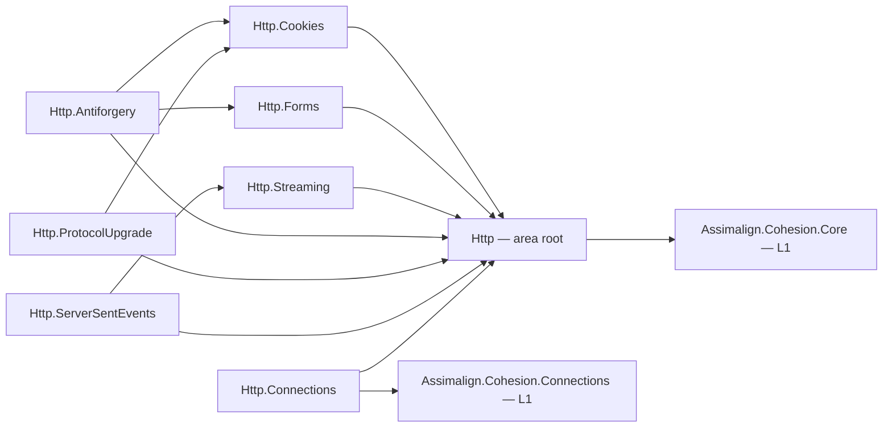

# Http

The HTTP area is Cohesion's L1 protocol foundation: the request/response abstractions, the feature
collection every server and client composes against, and one package per HTTP concern. It is
transport-agnostic and hosting-free — `resources/Web` builds the web application platform on top of
it, and nothing here knows that platform exists.

## Project map

An arrow means "references": `Http.Cookies --> Http` reads "`Assimalign.Cohesion.Http.Cookies`
references `Assimalign.Cohesion.Http`". The area is a hub with per-concern spokes; only the
packages whose dependencies go beyond the root are drawn.

The seven packages not drawn — `Http.ClientFactory`, `Http.DigestFields`, `Http.ExtendedConnect`,
`Http.Forwarded`, `Http.InterimResponses`, `Http.RequestLimits`, and `Http.Sessions` — each
reference the root `Assimalign.Cohesion.Http` and nothing else, so they would add seven nodes and
seven identical arrows without adding information. The full reference graph for every Cohesion
assembly is in [docs/DEPENDENCIES.md](../../docs/DEPENDENCIES.md).

## The per-concern packaging rule

Every HTTP concern gets its **own** `Assimalign.Cohesion.Http.<Concern>` package rather than
growing the root. The root carries the abstractions a concern is expressed in — `IHttpContext`,
the request and response types, the feature collection — and a concern package carries its
contracts, its features, and its parsing. A concern that would otherwise widen the root's public
surface is the signal that a new package is due.

This is why `Http.Forwarded` exists separately from the trust middleware in
`resources/Web/Assimalign.Cohesion.Web.ForwardedHeaders`: the primitives and the feature contract
are protocol-level and belong here; the policy that decides which proxies to trust is a web-server
concern and belongs there.

## Layering

In the repo's L1/L2/L3 model (see [docs/programs/DELIVERY_ROADMAP.md](../../docs/programs/DELIVERY_ROADMAP.md)),
this area is **L1 — foundation**. It sits on `Assimalign.Cohesion.Core` and, for
`Http.Connections`, on `Assimalign.Cohesion.Connections`. It references no `Assimalign.Cohesion.Hosting*`
library and no resource area, and it never will: hosting composition, dependency injection, and
configuration binding are `*.Hosting` concerns one layer up.

## Project documentation

Per-project `docs/OVERVIEW.md`, `docs/DESIGN.md`, and `docs/Assembly/` live beside each project's
`src/`. Start at [Assimalign.Cohesion.Http/docs/DESIGN.md](Assimalign.Cohesion.Http/docs/DESIGN.md)
for the root abstractions and the feature-collection model.
