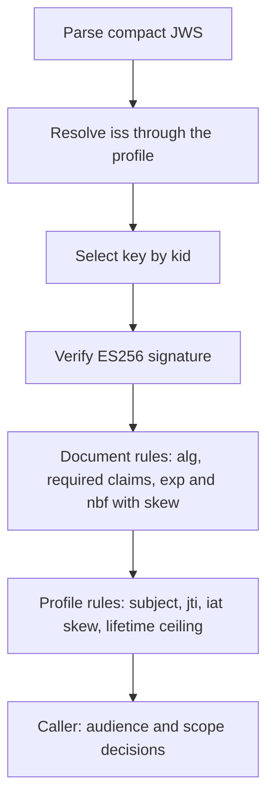

# Assimalign.Cohesion.IdentityModel.Token.JsonWebToken — Design

## Design intent

The concrete JOSE/JWT layer: it takes the neutral token base to the fidelity OpenID Connect
identity-token and Cohesion bootstrap-credential work needs — typed JOSE headers, compact JWS
parsing and ES256 writing, registered/OIDC claims, document validation, and reusable asymmetric
signature verification — without becoming an OpenID Connect flow engine or a key-management
system. It derives from `IdentityToken` and pins its document format.

The load-bearing rationale — the JWT/OIDC validation split, claim-name mirror,
`Claims`-as-authoritative materialized model, and fail-closed parsing rules — is recorded in the
family keystone,
[`Assimalign.Cohesion.IdentityModel/docs/DESIGN.md`](../../Assimalign.Cohesion.IdentityModel/docs/DESIGN.md).
This document records the project-boundary specifics.

## The cryptographic boundary is format execution versus key management

Design item 25b (`#970`) places the compact-JWS primitives here so headless resources can mint
or verify Cohesion bootstrap credentials without depending on the Web area. This supersedes the
older plan in `#830` that assigned all keyed token cryptography to a future Security package.
The boundary is now:

- **This package executes format-specific BCL primitives.** `JsonWebTokenWriter.CreateEs256`
  returns an `IJsonWebTokenWriter` backed by an internal implementation that writes compact JWS
  and calls `ECDsa.SignData` with SHA-256 and the IEEE P1363 fixed-field `r||s` format.
  `JsonWebTokenSignatureVerifier.CreateEcdsa/CreateRsa` return
  `IJsonWebTokenSignatureVerifier` instances backed by internal ECDSA/RSA implementations.
- **Callers own keys and trust policy.** Writers and verifiers borrow key instances; they never
  generate, persist, rotate, dispose, or publish keys. Public JWK parsing, RFC 7638 thumbprints,
  and the ES256 validator (below) are format execution and live here; JWKS retrieval,
  trusted-issuer storage, and revocation remain outside this package. The validator resolves an
  issuer's keys through a caller-supplied delegate, so the trust store stays with the caller.
- **`JsonWebToken.Validate` remains document-only.** It composes issuer, audience, temporal,
  algorithm, critical-header, and hash rules, but never invokes a signature verifier. A caller
  verifies the exact received `header.payload` and decoded signature before trusting claims.
  A successful `Validate` still means “data and hash rules passed,” not “signature verified.”

HMAC verification remains in `Web.Authentication.Bearer`; item 25b moved only the reusable
asymmetric implementations. The broader Security work in `#830` can still own JWE, SAML
XML-DSig/XML encryption, and key-resolution suites, but not these moved RSA/ECDSA primitives.

## Compact writing

The writer is interface-first: the public `IJsonWebTokenWriter` contract and static
`JsonWebTokenWriter` factory expose an internal ES256 implementation. The factory requires a
NIST P-256 ECDSA key and a non-empty `kid`; the writer owns both `alg=ES256` and `kid`, rejects those
parameters if the descriptor also supplies them, and never mutates the descriptor.

Payloads use the existing `JsonWebTokenDescriptor` model rather than an object-valued or
serializer-specific claim bag:

- `Issuer`, `Subject`, `Audiences`, `ExpiresAt`, `NotBefore`, `IssuedAt`, and `Id` project to
  `iss`, `sub`, `aud`, `exp`, `nbf`, `iat`, and `jti`.
- NumericDate helpers are emitted as integer Unix seconds; one audience is a string and multiple
  audiences are an array, matching RFC 7519.
- Remaining `IIdentityClaim` values are written through the closed `IdentityClaimValue` kind
  switch. Repeated non-singleton claim types become one JSON array, because duplicate JSON object
  members are forbidden. A registered claim supplied through both a typed helper and `Claims` is
  rejected instead of silently choosing precedence.
- Header and payload JSON are written directly with `Utf8JsonWriter`; there is no runtime type
  discovery or reflection-based serialization. The unencoded-payload (`b64:false`) variant is
  rejected.

JSON property order is deterministic for the typed registered members and preserves input order
for remaining descriptor members, but it is not a canonicalization contract. Verification always
uses the exact compact segments received; claim `Canonicalize` is name normalization and is
unrelated to JWS signing.

## Signature verification

`IJsonWebTokenSignatureVerifier` preserves the existing raw-byte seam:
`CanVerify(alg, kid)` plus `Verify(alg, signingInput, decodedSignature)`. Built-ins use:

- **RSA** — `RSA.VerifyData`, supporting `RS256/384/512` with PKCS#1 v1.5 and
  `PS256/384/512` with PSS.
- **ECDSA** — `ECDsa.VerifyData` with
  `DSASignatureFormat.IeeeP1363FixedFieldConcatenation`, because JWS carries raw `r||s`, never
  DER. Algorithm and named-curve OID are bound (`ES256`↔P-256, `ES384`↔P-384,
  `ES512`↔P-521), and P1363 lengths are enforced (64/96/132 octets), so a token cannot relabel a
  P-256 signature as `ES384` or substitute a same-size non-JOSE curve.

An optional configured `kid` compares ordinally; a null configured value is a wildcard. Unknown
algorithms, wrong key families, mismatched key sizes, invalid signatures, and BCL cryptographic
verification failures return `false`. `Web.Authentication.Bearer` retains its public
`IJwtSignatureVerifier` API and adapts its RSA/ECDSA factories to this lower seam.

## Public keys and the ES256 validator

Seven Cohesion call sites — the resource bootstrap verifiers in the Web, IdentityHub, and Scheduler
hosting modules, the LogSpace sink verifier, the SecretStore and ConfigurationStore trusted-issuer
verifiers, and the gateway control plane — once carried their own copy of the same JWK parsing,
thumbprint, ECDSA import, and claim rules. Those copies now configure three shared types:

- **`JsonWebKey`** — a structural parse of one public JWK (`TryParse` from UTF-8 JSON or a
  `JsonElement`). It captures the string-valued `kty`, `crv`, `x`, `y`, `n`, `e`, `kid`, `alg`, and
  `use` members and never captures private members. `ComputeThumbprint` implements RFC 7638 for EC
  (`crv`, `kty`, `x`, `y`) and RSA (`e`, `kty`, `n`) keys; `CreateECDsa` returns a caller-owned
  public ECDSA key for P-256/384/521. Policy is a separate call with two strengths:
  `TryValidateEcdsaVerificationKey(curve)` is the lenient rule the application-trust-key readers
  apply (`kty=EC`, the named `crv`, a string `kid`, and a usable public point; other members,
  `alg`, `use`, and the `kid`/thumbprint relation are not examined), and `TryValidateEs256SigningKey`
  applies the strict profile Cohesion trusted issuers publish (exactly `kty=EC`, `crv=P-256`,
  `alg=ES256`, `use=sig`, `x`, `y`, `kid`; 32-byte coordinates on the curve; `kid` equal to the
  thumbprint). Keeping parse and policy apart is what lets the lenient application-trust-key
  readers and the strict trusted-issuer stores share one type without either changing which keys
  it accepts.
- **`JsonWebKeySet`** — an issuer's keys; `Find(kid)` selects by exact `kid` and never matches a
  missing `kid`, so every accepted token names its key.
- **`IJsonWebTokenValidator`** from `JsonWebTokenValidator.CreateEs256(profile)` — verifies and
  validates in one call. `JsonWebTokenValidationProfile` supplies the issuer-to-key-set resolver,
  the lifetime ceiling, the clock skew (default five minutes), and the subject rule (an exact
  expected `sub`, a non-empty `sub`, or none when the caller applies a scope-dependent rule).

The diagram shows the order: parse, issuer resolution, `kid` selection, signature, document rules,
and profile rules all yield a single `false`, so a caller cannot probe which rule failed. Every
profile requires `iss`, `sub`, `aud`, `exp`, `nbf`, `iat`, and `jti`, a non-blank `jti`, `iat` no
later than now plus the skew, `exp` after both `iat` and `nbf`, and `exp - iat` within the ceiling.
Audience is deliberately **not** part of the profile: resources distinguish an unauthenticated token
(401) from an authentic token for another audience (403), so they call
`JsonWebTokenValidator.HasAudience` after validation, and LogSpace applies its `scope=telemetry`
rules between the two. The ECDSA key is created per validation and disposed before the call
returns, so `JsonWebKey` and the validator hold no disposable state; an unusable trusted key
rejects the token instead of throwing.

The Cohesion claim names and ceilings (`cohesion_token_use`, `scope=telemetry`, `cohesion-export`,
24 hours, 8 hours) are not here: they belong to the resource credential seam, so they live in
`Assimalign.Cohesion.Hosting.Resources.ResourceCredentialProfile`, which this package does not
reference, and each call site passes them into its profile.

## The JWT / OpenID Connect validation split

The JWT package cannot reference the OpenID Connect protocol branch (branch independence,
enforced by architecture tests), and the two are complementary:

| Concern | Owner |
|---|---|
| JOSE `alg` presence / `none` / allowed-set; `b64`; `crit` | JWT package |
| `at_hash`/`c_hash` presence-plus-value (keyless hash) | JWT package |
| Required-claim presence (a caller-supplied set) | JWT package |
| Issuer / audience / temporal (neutral) | Token base (composed by both) |
| RSA/ECDSA compact-JWS signing and verification primitives | JWT package |
| Public JWK parsing, RFC 7638 thumbprints, ES256 verify-and-validate profiles | JWT package |
| Key generation, persistence, trust stores, revocation, JWKS retrieval | Calling service / future key-management packages |
| `nonce` match, `azp`-equals-client, `max_age`, additional-audience trust | OpenID Connect branch |

When one physical JWT is also materialized as an `OpenIdConnectIdToken`, issuer/audience/temporal
checks run in both validators by design — document substrate versus protocol profile.

## Fidelity and fail-closed parsing

- Duplicate JSON members are rejected (RFC 8725 §2.3), never last-wins-resolved.
- NumericDate values stay wire-shaped in `Claims`; bounded typed projections degrade an
  out-of-range value to null rather than throwing.
- `aud` accepts one string or an array of strings and folds both into the audience list and
  canonical claims.
- Numbers map integral→`Integer`, otherwise→`Double`; objects/arrays are recursive and bounded by
  `IdentityClaimValue.MaxDepth`.
- Typed header and claim accessors project from their authoritative materialized records.

## Compatibility matrix

| Capability | Status |
|---|---|
| Compact JWS parsing (header/payload/signature) | Implemented |
| Compact ES256 writing (`alg`/`kid`, descriptor claims) | Implemented |
| RSA (`RS*`/`PS*`) and ECDSA (`ES*`) signature verification | Implemented |
| Public JWK parsing and RFC 7638 thumbprints (EC, RSA) | Implemented |
| ES256 verify-and-validate with issuer-resolved key sets | Implemented |
| JWKS documents and retrieval | Out of scope |
| JOSE header params and registered/OIDC claims | Implemented |
| Algorithm / required-claim / `at_hash` / `c_hash` validation | Implemented |
| Duplicate-member / malformed / over-deep rejection | Implemented |
| HMAC writing or lower-layer HMAC verification | Out of scope for item 25b |
| Unencoded payload (`b64:false`, RFC 7797) | Rejected (unsupported) |
| JWE (encrypted tokens, RFC 7516) | Deferred |
| OIDC protocol rules (nonce/azp/`max_age`) | OpenID Connect branch |

## AOT posture

`<IsAotCompatible>true</IsAotCompatible>`. Parsing and writing use reflection-free
`JsonDocument`/`Utf8JsonWriter`; hashing and signatures use BCL one-shot
`HashData`/`SignData`/`VerifyData`; base64url uses `System.Buffers.Text.Base64Url`. There are no
package references, reflection, runtime code generation, or serializer metadata graphs.

## Non-goals

Key generation/storage/rotation, JWKS documents and retrieval, trust-grant policy, HMAC writing,
JWE, SAML cryptography, and OpenID Connect protocol-flow validation are out of scope. The ES256
validator is deliberately single-algorithm: it exists to verify Cohesion application-key
credentials, and a general multi-algorithm validator would reopen algorithm-confusion questions
this package does not need to answer. This package owns the
compact JWT/JWS document and its reusable asymmetric format primitives, not the surrounding trust
system.
