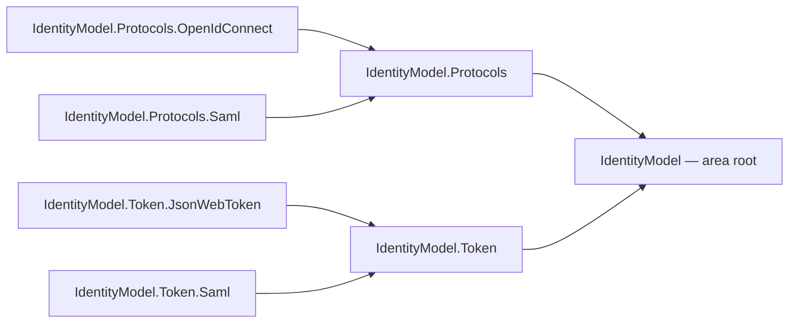

# IdentityModel

The shared authentication and identity contract foundation for Cohesion. Every
resource under `resources/*` that authenticates a caller — and IdentityHub
itself — depends on this family for one normalized identity surface instead of
inventing service-local identity types.

## Project map

An arrow means "references": `IdentityModel.Token --> IdentityModel` reads
`Assimalign.Cohesion.IdentityModel.Token` references `Assimalign.Cohesion.IdentityModel`.



Solid edges are the references this area permits; the dependency arrow always points from the
consumer to what it consumes.

The full reference graph for every Cohesion assembly, including the exact external dependencies
collapsed above, is in [docs/DEPENDENCIES.md](../../docs/DEPENDENCIES.md).

## Projects

| Project | Role |
|---|---|
| `Assimalign.Cohesion.IdentityModel` | The dependency anchor. Canonical identity domain model: subjects, application identities, credentials, claims and attributes, sessions, authentication results — plus the cross-protocol claim canonicalization seam (`IdentityClaimMapper` / `Canonicalize`) that maps OpenID Connect claims and SAML attributes onto one canonical vocabulary with provenance preserved. |
| `Assimalign.Cohesion.IdentityModel.Protocols` | Shared, transport-agnostic protocol abstractions: party roles, published-entity metadata, message envelopes, response status, validation results, logout semantics, binding descriptors. |
| `Assimalign.Cohesion.IdentityModel.Protocols.OpenIdConnect` | OpenID Connect contract branch: discovery/client metadata, authorization/token/ID token/UserInfo/logout contracts, spec-oriented validation. |
| `Assimalign.Cohesion.IdentityModel.Protocols.Saml` | SAML 2.0 contract branch: assertions, protocol messages, entity metadata, bindings. |
| `Assimalign.Cohesion.IdentityModel.Token` | Protocol-neutral token and assertion normalization between the root contracts and the concrete token packages. |
| `Assimalign.Cohesion.IdentityModel.Token.JsonWebToken` | Concrete JOSE / JWT document behavior (compact parsing, ES256 writing, header and claim fidelity, document validation, reusable RSA/ECDSA signature verification). |
| `Assimalign.Cohesion.IdentityModel.Token.Saml` | Concrete SAML 2.0 assertion token behavior (statements, conditions, subject confirmation fidelity). |

## Layering

IdentityModel is an L1 foundation library family (see `docs/programs/DELIVERY_ROADMAP.md`
for the layering model). It sits below every service platform: L2 runtime
composition and L3 service platforms (IdentityHub, Web, Database, …) consume
these contracts; nothing in this family depends on hosting, transport, or
service runtime concerns.

Two independent branches hang off the root anchor, each protocol in its own
project so protocols can expand — and new identity protocols be added — without
touching the shared base or each other:

```
                    Assimalign.Cohesion.IdentityModel        (no Cohesion dependencies)
                   /                                  \
   …IdentityModel.Protocols                        …IdentityModel.Token
     /                 \                             /              \
 …Protocols.OpenIdConnect  …Protocols.Saml   …Token.JsonWebToken  …Token.Saml
```

Protocol *contracts* live in the `Protocols` branch: the shared `…Protocols`
base plus one project per protocol. Token packages own concrete token
*document* behavior, including format-specific cryptographic execution that does not require
transport or key management. The JWT package therefore writes ES256 compact JWS values and
verifies RSA/ECDSA signatures, while callers still own keys and trust policy. The protocol and
token branches never reference each other; transport-bound readers, metadata retrievers, and
key-management implementations remain separate descendant projects.

## Dependencies

- None. The root package references only the BCL, and the family references
  only itself in the direction shown above. No `Microsoft.Extensions.*`, no
  transport, no serializer dependencies.

## Further Reading

- [Assimalign.Cohesion.IdentityModel/docs/OVERVIEW.md](Assimalign.Cohesion.IdentityModel/docs/OVERVIEW.md)
- [Assimalign.Cohesion.IdentityModel/docs/DESIGN.md](Assimalign.Cohesion.IdentityModel/docs/DESIGN.md) —
  the family design: ownership boundaries, namespace map, dependency rules,
  standards references, and non-goals.
