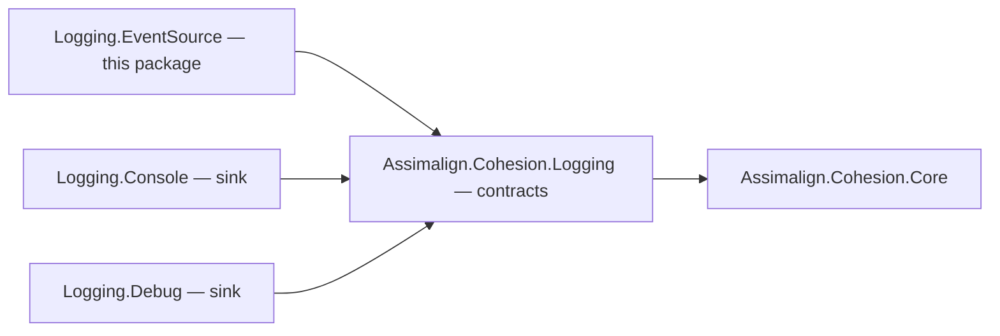

# Assimalign.Cohesion.Logging.EventSource Design

## Design Intent

Cohesion libraries report on themselves through internal `System.Diagnostics.Tracing` event sources
and never through a public logging type (`.claude/rules/event-source.md`). That keeps foundation
libraries free of any logging dependency, makes every disabled event nearly free, and lets
out-of-process tools read the events with no code at all. What it does not give an application is those
events in *its own* log sinks. This package is that tap: an `EventListener` that enables the chosen
sources and writes each event into an `ILoggerFactory` as an ordinary `ILoggerEntry`.

## Family map

The package sits beside the sinks and depends only on the logging contracts (an arrow means
"references"):

| Package | Role |
| --- | --- |
| `Assimalign.Cohesion.Logging` | Contracts, entry model, factory composition. |
| `Assimalign.Cohesion.Logging.Console` / `.Debug` | Sinks: `ILoggerProvider`s that write entries somewhere. |
| `Assimalign.Cohesion.Logging.EventSource` | A source of entries: forwards event-source events into a factory. |

No instrumented library references this package, and none needs to: the contract between them is the
event source's *name*. An instrumented library references no Logging package at all.

## Why an inbound bridge

`Microsoft.Extensions.Logging.EventSource` goes the other way: it is a sink that writes `ILogger`
entries out to an event source so tracing tools can collect them. The requirement here is the reverse —
a developer must be able to see the framework's internal events without the framework exposing them —
so this package reads event sources and writes entries. Tracing tools already read Cohesion's sources
directly by name, so they need nothing from this package. An outbound sink is a separate, still-open
question (see *Non-goals*).

## Why an extension on `ILoggerFactory` that returns `IDisposable`

- **Not a provider.** An `ILoggerProvider` is a sink the factory writes *to*; this component writes
  *into* a factory. Registering it as a provider would give it no factory to write into.
- **Not a builder verb, yet.** A listener must write into a *built* factory and stop when the application
  says so. `ILoggerFactoryBuilder` has no seam for a component that lives exactly as long as the factory
  it builds, so a `builder.Logging.ForwardEventSources()` verb would have nothing to attach to. Adding that
  seam to the Logging root is tracked as follow-up work.
- **Not a public class.** The implementation derives from `EventListener`, whose public surface
  (`EnableEvents`, `DisableEvents`, the `EventWritten` event) would let callers bypass the forwarding
  rules. The public API is the verb and an options object; the listener stays internal behind the
  `IDisposable` it returns. That keeps the package interface-first without a one-member interface.

## Selecting sources

`EventSourceForwardingOptions.Sources` is a list of name prefixes matched case-insensitively — the same
semantics as a `LoggerFilterRule` category, and ETW provider names are case-insensitive as well. The
default, `Assimalign.Cohesion.`, selects every Cohesion source and only those; a runtime source such as
`System.Net.Security` is opted into by adding its prefix. Sources created after forwarding starts are
matched as they are constructed.

## One knob for verbosity

The options have no level. Each matching source is enabled at the most verbose `EventLevel` whose
entries the factory would accept for that source's category, found by asking the category's logger
`IsEnabled`:

| Logger accepts | Source enabled at |
| --- | --- |
| `Debug` (or `Trace`) | `Verbose` |
| `Information` | `Informational` |
| `Warning` | `Warning` |
| `Error` | `Error` |
| `Critical` | `Critical` |
| nothing | not enabled |

So `AddRule("Assimalign.Cohesion.Connections", LogLevel.Debug)` both admits verbose connection entries
and turns verbose events on at the source — one setting, in the place developers already filter logs.
A level the factory rejects is never enabled, and a disabled event costs the instrumented library one
`IsEnabled` check. The factory resolves its rules when a category's logger is created, so the level is
decided once per source, when the source is attached.

## Event to entry

| Entry | From |
| --- | --- |
| `Category` | The event source name. |
| `Level` | `Critical`/`Error`/`Warning` → their namesakes; `Informational` and `LogAlways` → `Information`; `Verbose` → `Debug`. Event 0, `EventSourceMessage` — EventSource reporting its own instrumentation error, such as a payload that does not match its method — → `Warning`. |
| `Message` | The event's `Message` template formatted with its payload (invariant culture). An event without a template, or whose template does not match its payload, uses its event name. Event 0 uses its text verbatim. |
| `Attributes` | Every payload field by its payload name, plus `EventId`, `EventName`, and `ActivityId` when non-empty. A payload field keeps its value when its name collides with one of those keys. |
| `Timestamp` | The event's timestamp, as UTC. |

Periodic `EventCounters` payloads are not forwarded. They reach every listener of a source whose
counters a tool enabled, and turning them into log lines would flood the sink with gauge readings that
belong in `dotnet-counters`.

## Threading and failure model

- **Synchronous.** `EventListener` delivers events on the thread that raised them, and entries are
  written there. There is no queue to size, drain, or lose on shutdown; the cost is that a slow sink
  slows the instrumented operation, the same trade every synchronous logger makes.
- **Nothing escapes.** EventSource rethrows a listener's exception into the code that raised the event,
  and `OnEventSourceCreated` runs inside the source's construction — usually a type initializer. Both
  callbacks therefore catch everything: a sink that throws loses that event, and a factory that throws
  from `Create` leaves that source unforwarded. Neither can break the instrumented library.
- **No recursion.** An event raised on a thread that is already forwarding one — a sink that itself
  uses an instrumented library — is dropped instead of forwarded, so a sink cannot feed itself.
- **The constructor race.** `EventListener`'s constructor reports every existing source through
  `OnEventSourceCreated` before the derived constructor has run. Those sources are held in a list the
  field initializers create (field initializers run before the base constructor) and attached once the
  factory and prefixes are set; a source created concurrently on another thread goes through the same
  lock, so none is missed or attached twice.
- **Factory disposal.** After the factory is disposed, loggers it already created write to disposed
  providers (which drop the entries) and new sources fail to attach, silently. Dispose the forwarding
  handle before the factory.
- **One handle per factory.** Each handle is its own listener; two forward every event twice.

## Namespace

The package pins `RootNamespace` to the family namespace, `Assimalign.Cohesion.Logging`, like the
Console and Debug sinks. A namespace named `Assimalign.Cohesion.Logging.EventSource` would make the simple
name `EventSource` bind to that namespace, not to `System.Diagnostics.Tracing.EventSource`, in all code
inside `Assimalign.Cohesion.Logging` and its sub-namespaces — the well-known cost of
`Microsoft.Extensions.Logging.EventSource`. Tests follow the family's
`Assimalign.Cohesion.Logging.Tests` namespace for the same reason.

## AOT posture

No reflection, no runtime code generation, no serialization. `EventListener` and `EventWrittenEventArgs`
are trim-safe, and the package builds with no trim or AOT analyzer warnings. A NativeAOT application
compiles EventSource out unless it sets `<EventSourceSupport>true</EventSourceSupport>`; without it the
forwarder is inert — no events, no errors.

## Non-goals

- **No outbound sink** (writing `ILogger` entries *to* an event source for tracing tools). It would need
  its own event source and a loop guard against this forwarder, and nothing requires it yet.
- **No counter forwarding.** Counters are periodic measurements, not events; `dotnet-counters` and the
  OpenTelemetry area own that path.
- **No asynchronous queue.** See *Synchronous* above; a buffering layer is a sink concern.
- **No scope or activity mapping.** Event `ActivityId`s are carried as an attribute; they are not turned
  into `IScopedLogger` scopes.
- **No keyword filtering.** Cohesion sources define no keywords; a source that needs keyword selection is
  better enabled by a tool.
