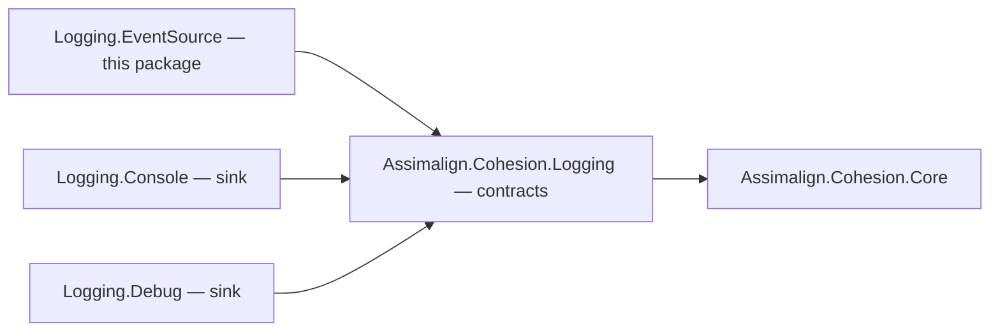

# Assimalign.Cohesion.Logging.EventSource Design

## Design Intent

Cohesion libraries report on themselves through internal `System.Diagnostics.Tracing` event sources
and never through a public logging type (`.claude/rules/event-source.md`). That keeps foundation
libraries free of any logging dependency, makes every disabled event nearly free, and lets
out-of-process tools read the events with no code at all. What it does not give an application is those
events in *its own* log sinks. This package is that tap: an `EventListener` that enables the chosen
sources and writes each event into an `ILoggerFactory` as an ordinary `ILoggerEntry`.

## Family map

The package sits beside the sinks and depends only on the logging contracts (an arrow means
"references"):

```mermaid
flowchart LR
    Forwarding["Logging.EventSource — this package"] --> Logging["Assimalign.Cohesion.Logging — contracts"]
    Console["Logging.Console — sink"] --> Logging
    Debug["Logging.Debug — sink"] --> Logging
    Logging --> Core["Assimalign.Cohesion.Core"]
```

| Package | Role |
| --- | --- |
| `Assimalign.Cohesion.Logging` | Contracts, entry model, factory composition. |
| `Assimalign.Cohesion.Logging.Console` / `.Debug` | Sinks: `ILoggerProvider`s that write entries somewhere. |
| `Assimalign.Cohesion.Logging.EventSource` | A source of entries: forwards event-source events into a factory. |

No instrumented library references this package, and none needs to: the contract between them is the
event source's *name*. An instrumented library references no Logging package at all.

## Why an inbound bridge

`Microsoft.Extensions.Logging.EventSource` goes the other way: it is a sink that writes `ILogger`
entries out to an event source so tracing tools can collect them. The requirement here is the reverse —
a developer must be able to see the framework's internal events without the framework exposing them —
so this package reads event sources and writes entries. Tracing tools already read Cohesion's sources
directly by name, so they need nothing from this package. An outbound sink is a separate, still-open
question (see *Non-goals*).

## Two entry points, one forwarder

The forwarder is an `ILoggerForwarder` (`Assimalign.Cohesion.Logging`): a component that writes entries
*into* a factory. There are two ways to get one, and they create the same internal listener.

| Entry point | Owner | Use it when |
| --- | --- | --- |
| `ILoggerFactoryBuilder.AddEventSourceForwarding(options)` | The factory: it creates the forwarder as the last step of its construction and disposes it before its providers. | The factory is built from a builder, which includes every Cohesion host (`WebApplicationBuilder.Logging`). |
| `ILoggerFactory.ForwardEventSources(options)` | The caller, who must dispose it before the factory. | Forwarding has to start or stop independently of the factory, or the factory was not built by you. |

- **The builder verb is the default.** Forwarding starts before any application code runs against the
  factory, so the events raised while the application starts — listeners binding, connections opening —
  are forwarded, and there is no handle to hold. The prefixes are validated and copied when the verb is
  called, so a bad option fails at registration and a later change to the options changes nothing.
- **Not a host service.** Starting and stopping forwarding with the host (an `IHostService` with
  `StartAsync`/`StopAsync`) was considered and rejected (#1036). Enabling an `EventListener` is
  synchronous and nothing is queued, so the tasks would always be complete and `StopAsync` would promise
  a flush that does not exist. A forwarder started as one host service among others misses the events of
  services started before it. Logging is an L1 library and cannot reference Hosting in any case; if a
  host ever needs to drive forwarding, that adapter belongs in the hosting family.
- **Not a provider.** An `ILoggerProvider` is a sink the factory writes *to*; this component writes
  *into* a factory. Registering it as a provider would give it no factory to write into.
- **Not a public class.** The implementation derives from `EventListener`, whose public surface
  (`EnableEvents`, `DisableEvents`, the `EventWritten` event) would let callers bypass the forwarding
  rules. The public API is two verbs and an options object; the listener stays internal behind
  `ILoggerForwarder`.

## Packaging: an opt-in package, not an App kernel member

`Assimalign.Cohesion.Logging.EventSource` stays an ordinary NuGet package that an application references
when it wants forwarding; it is not a member of the `Assimalign.Cohesion.App` hosting kernel. The kernel
is derived from the hosting roots' own dependency closure (`build-system.md`), and no host needs this
package to run: forwarding is a diagnostic choice an application makes, and an application that never
forwards should not ship the assembly. Revisit if a hosting root starts forwarding by default.

## Selecting sources

`EventSourceForwardingOptions.Sources` is a list of name prefixes matched case-insensitively — the same
semantics as a `LoggerFilterRule` category, and ETW provider names are case-insensitive as well. The
default, `Assimalign.Cohesion.`, selects every Cohesion source and only those; a runtime source such as
`System.Net.Security` is opted into by adding its prefix. Sources created after forwarding starts are
matched as they are constructed.

## One knob for verbosity

The options have no level. Each matching source is enabled at the most verbose `EventLevel` whose
entries the factory would accept for that source's category, found by asking the category's logger
`IsEnabled`:

| Logger accepts | Source enabled at |
| --- | --- |
| `Debug` (or `Trace`) | `Verbose` |
| `Information` | `Informational` |
| `Warning` | `Warning` |
| `Error` | `Error` |
| `Critical` | `Critical` |
| nothing | not enabled |

So `AddRule("Assimalign.Cohesion.Connections", LogLevel.Debug)` both admits verbose connection entries
and turns verbose events on at the source — one setting, in the place developers already filter logs.
A level the factory rejects is never enabled, and a disabled event costs the instrumented library one
`IsEnabled` check. The factory resolves its rules when a category's logger is created, so the level is
decided once per source, when the source is attached.

## Event to entry

| Entry | From |
| --- | --- |
| `Category` | The event source name. |
| `Level` | `Critical`/`Error`/`Warning` → their namesakes; `Informational` and `LogAlways` → `Information`; `Verbose` → `Debug`. Event 0, `EventSourceMessage` — EventSource reporting its own instrumentation error, such as a payload that does not match its method — → `Warning`. |
| `Message` | The event's `Message` template formatted with its payload (invariant culture). An event without a template, or whose template does not match its payload, uses its event name. Event 0 uses its text verbatim. |
| `Attributes` | Every payload field by its payload name, plus `EventId`, `EventName`, and `ActivityId` when non-empty. A payload field keeps its value when its name collides with one of those keys. |
| `Timestamp` | The event's timestamp, as UTC. |

Periodic `EventCounters` payloads are not forwarded. They reach every listener of a source whose
counters a tool enabled, and turning them into log lines would flood the sink with gauge readings that
belong in `dotnet-counters`.

## Threading and failure model

- **Synchronous.** `EventListener` delivers events on the thread that raised them, and entries are
  written there. There is no queue to size, drain, or lose on shutdown; the cost is that a slow sink
  slows the instrumented operation, the same trade every synchronous logger makes.
- **Nothing escapes.** EventSource rethrows a listener's exception into the code that raised the event,
  and `OnEventSourceCreated` runs inside the source's construction — usually a type initializer. Both
  callbacks therefore catch everything: a sink that throws loses that event, and a factory that throws
  from `Create` leaves that source unforwarded. Neither can break the instrumented library.
- **No recursion.** An event raised on a thread that is already forwarding one — a sink that itself
  uses an instrumented library — is dropped instead of forwarded, so a sink cannot feed itself.
- **The constructor race.** `EventListener`'s constructor reports every existing source through
  `OnEventSourceCreated` before the derived constructor has run. Those sources are held in a list the
  field initializers create (field initializers run before the base constructor) and attached once the
  factory and prefixes are set; a source created concurrently on another thread goes through the same
  lock, so none is missed or attached twice.
- **Factory disposal.** A forwarder registered with the builder verb is disposed by the factory before
  its providers, so this cannot happen to it. A forwarder from `ForwardEventSources` that outlives its
  factory writes to disposed providers (which drop the entries) and fails to attach new sources, silently:
  dispose it before the factory.
- **One forwarder per factory.** Each forwarder is its own listener; two forward every event twice.

## Namespace

The package pins `RootNamespace` to the family namespace, `Assimalign.Cohesion.Logging`, like the
Console and Debug sinks. A namespace named `Assimalign.Cohesion.Logging.EventSource` would make the simple
name `EventSource` bind to that namespace, not to `System.Diagnostics.Tracing.EventSource`, in all code
inside `Assimalign.Cohesion.Logging` and its sub-namespaces — the well-known cost of
`Microsoft.Extensions.Logging.EventSource`. Tests follow the family's
`Assimalign.Cohesion.Logging.Tests` namespace for the same reason.

## AOT posture

No reflection, no runtime code generation, no serialization. `EventListener` and `EventWrittenEventArgs`
are trim-safe, and the package builds with no trim or AOT analyzer warnings. A NativeAOT application
compiles EventSource out unless it sets `<EventSourceSupport>true</EventSourceSupport>`; without it the
forwarder is inert — no events, no errors.

## Non-goals

- **No outbound sink** (writing `ILogger` entries *to* an event source for tracing tools). It would need
  its own event source and a loop guard against this forwarder, and nothing requires it yet.
- **No counter forwarding.** Counters are periodic measurements, not events; `dotnet-counters` and the
  OpenTelemetry area own that path.
- **No asynchronous queue.** See *Synchronous* above; a buffering layer is a sink concern.
- **No scope or activity mapping.** Event `ActivityId`s are carried as an attribute; they are not turned
  into `IScopedLogger` scopes.
- **No keyword filtering.** Cohesion sources define no keywords; a source that needs keyword selection is
  better enabled by a tool.
