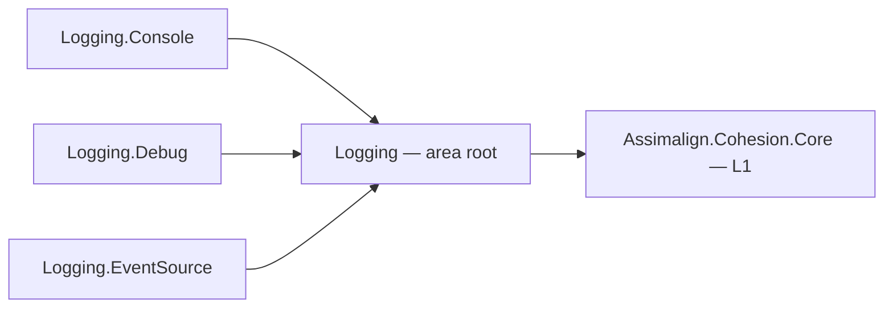

# Logging

The Cohesion logging family: the structured log entry model and logger contracts, the factory that
fans entries out to sinks, the sinks themselves, and the bridge that brings the framework's own
`EventSource` diagnostics into those sinks.

## Project map

An arrow means "references": `Logging.Console --> Logging` reads
`Assimalign.Cohesion.Logging.Console` references `Assimalign.Cohesion.Logging`.

Every package references only the area root, which references only `Assimalign.Cohesion.Core`. The full
reference graph is in [docs/DEPENDENCIES.md](../../docs/DEPENDENCIES.md).

## Projects

| Project | Role |
|---|---|
| `Assimalign.Cohesion.Logging` | Contracts and composition: `ILoggerEntry`, `ILogger`, `ILoggerProvider`, `ILoggerFactory` and its builder, filter rules, scopes, and enrichers. |
| `Assimalign.Cohesion.Logging.Console` | Sink: writes entries to console text writers. |
| `Assimalign.Cohesion.Logging.Debug` | Sink: writes entries to `System.Diagnostics.Debug`. |
| `Assimalign.Cohesion.Logging.EventSource` | Bridge: forwards `System.Diagnostics.Tracing` events — every Cohesion library's internal event source by default — into an `ILoggerFactory`. |

## Layering

L1. The family depends on `Assimalign.Cohesion.Core` and nothing else, and has no
`Microsoft.Extensions.*` dependency. By convention a Cohesion library reports on its *own* behavior
through an internal event source rather than a logging dependency (`.claude/rules/event-source.md`);
`Logging.EventSource` turns those events into entries when an application asks for them. The App hosting kernel
carries the root and `Logging.Console`; `Logging.Debug` and `Logging.EventSource` are ordinary NuGet
packages.

## Further Reading

- [Assimalign.Cohesion.Logging/docs/DESIGN.md](Assimalign.Cohesion.Logging/docs/DESIGN.md) — the entry
  model, factory composition, and filter-rule selection.
- [Assimalign.Cohesion.Logging.EventSource/docs/DESIGN.md](Assimalign.Cohesion.Logging.EventSource/docs/DESIGN.md)
  — the EventSource bridge.
- [docs/EVENT_SOURCES.md](../../docs/EVENT_SOURCES.md) — the event sources Cohesion ships.
