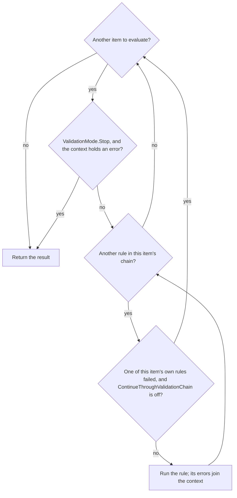
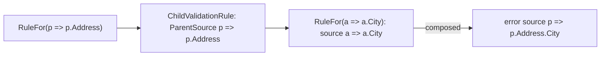

# Assimalign.Cohesion.ObjectValidation Design

## Design Intent

The library breaks validation into explicit layers so callers can author reusable profiles and then execute them through a single validator. That keeps rule definition and runtime validation separate.

## Architecture

- Validator coordinates profile execution and produces ValidationResult objects.
- ValidationProfile and descriptor types capture the fluent rule configuration model.
- ValidationOptions control which failures are reported (`ValidationMode` between members,
  `ContinueThroughValidationChain` within one member's rules) and whether a failure throws; see "Which
  Failures Are Reported".

## Which Failures Are Reported

Two options decide which failures a validation reports, and each works at its own level:

- **`ValidationMode` decides between items**, one item per `RuleFor` or `RuleForEach` member. `Cascade`,
  the default, evaluates every item and reports each one that fails. `Stop` evaluates no further item once
  the context holds an error, so only the first failing item is reported. `Validator` applies it between
  items.
- **`ContinueThroughValidationChain` decides within one item's rule chain.** Off, the default, the chain
  stops at the first of the item's rules that fails; on, every chained rule runs. The item applies it
  between its own rules.

| `ValidationMode` | `ContinueThroughValidationChain` | Reported |
| --- | --- | --- |
| `Cascade` (default) | off (default) | Every failing member, each with its first failing rule's errors |
| `Cascade` | on | Every failing rule of every member |
| `Stop` | off | The first failing member, with its first failing rule's errors |
| `Stop` | on | Every failing rule of the first failing member |

**An item's chain stops on its own failure only.** `ValidationItem` and `ValidationItemCollection` note
when one of the item's own rules reports an error and stop the chain on that; they do not look at the
context's errors, which also hold everything the items before this one reported, and any error the caller
added before validating. Stopping on those is `Stop`'s job. Until #1206 the items checked
`context.Errors.Any()`, so with the defaults the first failing member stopped every member after it: the
default behaved like `Stop`, and a request body with three invalid members was answered with one error.
The flag is a local of each evaluation, not state on the item, because profiles and their items are
shared by every validation that uses them.

The two decisions, as the validator and each item take them:



- **Collections.** A `RuleForEach` item runs each rule over every element, so the rule that fails
  reports each failing element, and the chain then stops for the whole collection, not per element.
- **Nested profiles.** `ChildRules` and `UseProfile` evaluate each nested item against a context of its
  own and apply `Stop` between nested items, so both levels work the same way inside a nested profile. To
  the parent member, the nested profile is one rule: everything it reports counts as that rule's errors.
- **`ThrowExceptionOnFailure`** changes nothing that is evaluated. The validator throws after evaluating,
  when the context holds an error.

**Evaluation order is declaration order.** A profile's items run in the order its members are declared (a
`When` block's members where the block is declared), and each item's rules in the order they are chained.
"First" above means first in that order: with the defaults, a member whose chain has several failing rules
reports the first of them, and `Stop` reports the first-declared failing member. `ValidationItemQueue` and
`ValidationRuleQueue` are first-in, first-out, as `IValidationRuleQueue` says: enumeration, the indexer,
copies, `Peek` and `Pop` all start at the entry pushed first. `ValidationContext<T>` keeps its errors and
invocations in the order they are added, so `ValidationResult.Errors` lists failures in declaration order.
A nested profile's errors sit in place under their parent member, and a collection's are listed rule by
rule, each rule's element by element.

The context's collections changed with the queues, and for the same reason. Had the errors stayed on a
stack, `ValidationResult.Errors` would have listed members newest first, and a nested profile's errors, which
are copied into every enclosing context, would have been reversed once per level of nesting.

Until #1221 both queues enumerated newest first and the context held its errors on a stack. A chain reported
its last failing rule: `RuleFor(x => x.Name).NotEmpty().MinLength(3)` on `""` reported `MinLength`'s message,
not `NotEmpty`'s. `Stop` reported the last-declared failing member, and Web.Validation's `errors` map listed
members in reverse declaration order.

## A Rule That Throws

A rule reports a failure by adding errors to its context; an exception is a fault, not a failure. A nested
profile's rules (`ChildRules`, `UseProfile`) and a custom rule's delegate (`Custom`) run arbitrary code, and
an exception from either propagates out of `Validate` and `ValidateAsync`: validation fails closed.

Until #1292 both rules caught every exception and returned `false`, which an item records as "rule not
invoked". A throwing nested profile or custom delegate therefore reported no error and the value passed;
Web.Validation let such a body through to the handler. A null nested object is still skipped, explicitly: the
nested rule's `object` overload returns an empty, successful context for `null`.

The built-in rules (`NotEmpty`, `GreaterThan`, the length and pattern rules, and so on) still catch their own
exceptions and report "not invoked", which may be an intended skip for a null or incomparable value but is
not stated; #1293 decides each rule's behavior explicitly. A `Matches` match that runs out of time is the one
case already decided: it fails the rule (see "Pattern Rules on Untrusted Input").

## Pattern Rules on Untrusted Input

Web.Validation runs a profile's rules on request bodies, so the client chooses the input each rule sees. The
two pattern rules bound what that input can cost.

- **`EmailAddress` runs in linear time.** Its pattern is built once per process and matched by the
  non-backtracking engine (`RegexOptions.NonBacktracking`). The pattern has no backreference, lookaround or
  atomic group, so that engine accepts exactly the addresses the backtracking engine did. A differential run of
  the two engines over 1.4 million generated inputs found no difference. Until #1377 the rule called the static
  `Regex.IsMatch`, whose backtracking engine took quadratic time on this pattern: `a@a.` followed by 16,000
  letters and a `!` cost 27.9 s of CPU. The timeout is explicitly infinite, because a process-wide
  `REGEX_DEFAULT_MATCH_TIMEOUT` would otherwise make a slow match throw, and the rule would report "not
  invoked" and pass the value.
- **An address is capped at the RFC 5321 sizes (§4.5.3.1) before it is matched.** It may hold 254 octets in
  all, which is the 256-octet path less its angle brackets. Its local part, everything before the last `@`, may
  hold 64. The domain's own 255-octet limit is then always met. Octets are counted in UTF-8, as an
  internationalized address travels under SMTPUTF8, so 33 `ü` characters are a 66-octet local part. The cap is
  the one intended change in which addresses pass: before it, a longer address that matched the pattern
  passed.
- **The pattern is otherwise unchanged, quirks included.** It is case-sensitive outside a quoted local part,
  so `Ada@example.com` fails, and its `$` accepts one trailing line feed.
- **`Matches` runs a caller's pattern in linear time when the non-backtracking engine supports it.** The rule
  first builds the pattern with the caller's options plus `RegexOptions.NonBacktracking`. That engine runs in
  time linear in the value's length, and for `IsMatch` it accepts the values the backtracking engine does; the
  engines differ only in captures, which the rule does not read. So `^(a+)+$` costs microseconds on any input.
  The engine rejects backreferences, lookarounds, atomic groups, conditionals, balancing groups and `\G`, and
  the `RightToLeft` and `ECMAScript` options. For those the rule falls back to the backtracking engine. A
  caller who passes `RegexOptions.NonBacktracking` gets no fallback: an unsupported construct throws
  `NotSupportedException` from `Matches`. The library owns no `Matches` pattern of its own.
- **Every match has a one-second budget** (`MatchValidationRule.DefaultMatchTimeout`), whatever the
  process-wide default. Web.Rewrite gives a string pattern the same budget. It is what bounds a pattern only the
  backtracking engine supports, and a backstop on the linear engine. A match that runs out of time fails the
  rule. The rule's catch-all would otherwise record the timeout as "not invoked", and the value would pass.
- **The budget is per match, not per validation.** `RuleForEach` runs the rule on every element, so a body of N
  strings checked by a backtracking-only pattern can cost N seconds of CPU. Another item's `MaxLength` on the
  collection does not prevent that, because a failing item does not stop the others (only `ValidationMode.Stop`
  does). A profile that checks a client-sized collection should use a pattern the non-backtracking engine
  supports.
- **`Matches` builds its pattern once, where the profile declares the rule,** with the caller's options. An
  invalid pattern or option combination throws `ArgumentException` from `Matches`. Until #1377 the static
  `Regex.IsMatch` threw on every validation instead, the rule was recorded as "not invoked", and every value
  passed. The options now apply as well: the rule used to follow a match with the options by a second match
  without them, so `RegexOptions.IgnoreCase` had no effect.

## Concurrency

A validator, its profiles, their items and their rules are built once and shared by every validation that
uses them: Web.Validation registers one validator per model type and every request validates through it.
Evaluation therefore keeps per-validation state in the `ValidationContext` and in locals, never on a
shared object.

- **Timing.** Each validation and each rule invocation is timed from a `Stopwatch.GetTimestamp()` local
  and reported in `TimeSpan` ticks (`Stopwatch.GetElapsedTime`). Until #1291 the validator rented a
  `Stopwatch` from an unsynchronized static pool on every validation, and each item rented one in its
  constructor and restarted it on every evaluation. Concurrent validations raced on the pool's list, which
  could hand a validation `null`, and they shared one stopwatch per item. The pool's `ElapsedTicks` were
  also `Stopwatch` ticks, read as `TimeSpan` ticks, which is wrong wherever the timer is not 10 MHz.
- **Known shared state.** A rule's `ParentContext` is still assigned on the shared rule before it runs,
  so two concurrent validations with different options can run a nested profile with the other's options
  (#1207). Errors never cross between validations: each lands in its own context.

## NativeAOT Posture

The library is NativeAOT-clean: no `System.Linq.Expressions.Expression.Compile` and no other
dynamic-code or reflection-emit path remains, so `IsAotCompatible=true` holds with no `IL2026`/
`IL3050` findings. Two seams were hardened without changing the authoring model:

- **Member access is compile-free.** `RuleFor`/`RuleForEach` still accept an
  `Expression<Func<T, TMember>>` member selector (the expression body doubles as the member name for
  the error `Source`), but the value is read by walking the expression's already-resolved
  `PropertyInfo`/`FieldInfo` metadata in `ValidationItemBase.GetValue` rather than by compiling a
  delegate. Walking resolved member metadata is reflection-only and AOT-safe, and the historical
  null-in-chain behavior (a null owner yields the member's default) is preserved by the surrounding
  try/catch.
- **Conditional predicates are delegate-first.** `When(...)` on `IValidationRuleDescriptor<T>` and
  `IValidationCondition<T>` now takes a `Func<T, bool>` rather than an `Expression<Func<T, bool>>`, so
  no predicate is compiled at run time. Inline lambda call sites (`When(p => p.Age >= 18, ...)`) bind
  to the delegate parameter unchanged; only a call site that first materialized an
  `Expression<Func<T, bool>>` variable is a (rare) source break.

## Error Sources

An error's `Source` names what failed. A rule's default source is its member selector's text
(`p => p.Name`), and a profile can set another through the rule's error callback
(`NotEmpty(error => error.Source = "name")`), which is kept as written.

**Nested profiles report under their parent member.** `ChildRules` and `UseProfile` validate a member
with a profile of its own type, whose selectors start from that type (`a => a.City`). The nested
rule (`ChildValidationRule`) records the parent member's selector and composes each nested error's
default source under it, so the error reads `p => p.Address.City`; two levels deep it reads
`p => p.Order.Address.City`. Before this, a nested error carried only the nested selector, and errors
on equally named members of different nested objects (`Shipping.City`, `Billing.City`) could not be
told apart. Under `RuleForEach`, nested sources name the collection member (`p => p.Addresses.City`)
without an element index: the collection item evaluates its rules per element without passing the
index to them.

Web request validation (`Assimalign.Cohesion.Web.Validation`) reports these sources to clients as the
member path after the selector parameter (`Address.City`).



## Layout Example

```text
Assimalign.Cohesion.ObjectValidation/
  src/
    Assimalign.Cohesion.ObjectValidation.csproj
    Abstractions/
    Exceptions/
    Extensions/
    Internal/
    Properties/
  tests/
  docs/
    OVERVIEW.md
    DESIGN.md
```

## Example 1: Create a validator with a profile

```csharp
IValidator validator = Validator.Create(builder =>
{
    builder.AddProfile(new PersonValidationProfile());
});
```

## Example 2: Validate a model instance

```csharp
var person = new Person();
ValidationResult result = validator.Validate(person);
```
