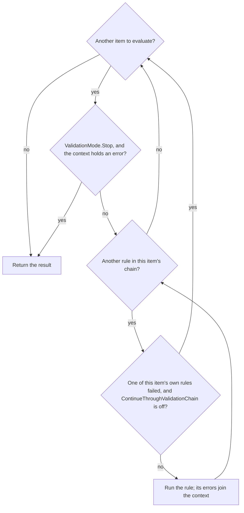
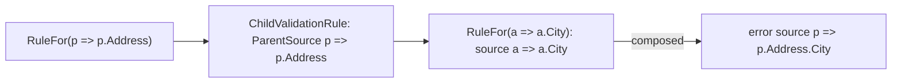

# Assimalign.Cohesion.ObjectValidation Design

## Design Intent

The library breaks validation into explicit layers so callers can author reusable profiles and then execute them through a single validator. That keeps rule definition and runtime validation separate.

## Architecture

- Validator coordinates profile execution and produces ValidationResult objects.
- ValidationProfile and descriptor types capture the fluent rule configuration model.
- ValidationOptions control which failures are reported (`ValidationMode` between members,
  `ContinueThroughValidationChain` within one member's rules) and whether a failure throws; see "Which
  Failures Are Reported".

## Which Failures Are Reported

Two options decide which failures a validation reports, and each works at its own level:

- **`ValidationMode` decides between items**, one item per `RuleFor` or `RuleForEach` member. `Cascade`,
  the default, evaluates every item and reports each one that fails. `Stop` evaluates no further item once
  the context holds an error, so only the first failing item is reported. `Validator` applies it between
  items.
- **`ContinueThroughValidationChain` decides within one item's rule chain.** Off, the default, the chain
  stops at the first of the item's rules that fails; on, every chained rule runs. The item applies it
  between its own rules.

| `ValidationMode` | `ContinueThroughValidationChain` | Reported |
| --- | --- | --- |
| `Cascade` (default) | off (default) | Every failing member, each with its first failing rule's errors |
| `Cascade` | on | Every failing rule of every member |
| `Stop` | off | The first failing member, with its first failing rule's errors |
| `Stop` | on | Every failing rule of the first failing member |

**An item's chain stops on its own failure only.** `ValidationItem` and `ValidationItemCollection` note
when one of the item's own rules reports an error and stop the chain on that; they do not look at the
context's errors, which also hold everything the items before this one reported, and any error the caller
added before validating. Stopping on those is `Stop`'s job. Until #1206 the items checked
`context.Errors.Any()`, so with the defaults the first failing member stopped every member after it: the
default behaved like `Stop`, and a request body with three invalid members was answered with one error.
The flag is a local of each evaluation, not state on the item, because profiles and their items are
shared by every validation that uses them.

The two decisions, as the validator and each item take them:



- **Collections.** A `RuleForEach` item runs each rule over every element, so the rule that fails
  reports each failing element, and the chain then stops for the whole collection, not per element.
- **Nested profiles.** `ChildRules` and `UseProfile` evaluate each nested item against a context of its
  own and apply `Stop` between nested items, so both levels work the same way inside a nested profile. To
  the parent member, the nested profile is one rule: everything it reports counts as that rule's errors.
- **`ThrowExceptionOnFailure`** changes nothing that is evaluated. The validator throws after evaluating,
  when the context holds an error.

**Evaluation order is declaration order.** A profile's items run in the order its members are declared (a
`When` block's members where the block is declared), and each item's rules in the order they are chained.
"First" above means first in that order: with the defaults, a member whose chain has several failing rules
reports the first of them, and `Stop` reports the first-declared failing member. `ValidationItemQueue` and
`ValidationRuleQueue` are first-in, first-out, as `IValidationRuleQueue` says: enumeration, the indexer,
copies, `Peek` and `Pop` all start at the entry pushed first. `ValidationContext<T>` keeps its errors and
invocations in the order they are added, so `ValidationResult.Errors` lists failures in declaration order.
A nested profile's errors sit in place under their parent member, and a collection's are listed rule by
rule, each rule's element by element.

The context's collections changed with the queues, and for the same reason. Had the errors stayed on a
stack, `ValidationResult.Errors` would have listed members newest first, and a nested profile's errors, which
are copied into every enclosing context, would have been reversed once per level of nesting.

Until #1221 both queues enumerated newest first and the context held its errors on a stack. A chain reported
its last failing rule: `RuleFor(x => x.Name).NotEmpty().MinLength(3)` on `""` reported `MinLength`'s message,
not `NotEmpty`'s. `Stop` reported the last-declared failing member, and Web.Validation's `errors` map listed
members in reverse declaration order.

## NativeAOT Posture

The library is NativeAOT-clean: no `System.Linq.Expressions.Expression.Compile` and no other
dynamic-code or reflection-emit path remains, so `IsAotCompatible=true` holds with no `IL2026`/
`IL3050` findings. Two seams were hardened without changing the authoring model:

- **Member access is compile-free.** `RuleFor`/`RuleForEach` still accept an
  `Expression<Func<T, TMember>>` member selector (the expression body doubles as the member name for
  the error `Source`), but the value is read by walking the expression's already-resolved
  `PropertyInfo`/`FieldInfo` metadata in `ValidationItemBase.GetValue` rather than by compiling a
  delegate. Walking resolved member metadata is reflection-only and AOT-safe, and the historical
  null-in-chain behavior (a null owner yields the member's default) is preserved by the surrounding
  try/catch.
- **Conditional predicates are delegate-first.** `When(...)` on `IValidationRuleDescriptor<T>` and
  `IValidationCondition<T>` now takes a `Func<T, bool>` rather than an `Expression<Func<T, bool>>`, so
  no predicate is compiled at run time. Inline lambda call sites (`When(p => p.Age >= 18, ...)`) bind
  to the delegate parameter unchanged; only a call site that first materialized an
  `Expression<Func<T, bool>>` variable is a (rare) source break.

## Error Sources

An error's `Source` names what failed. A rule's default source is its member selector's text
(`p => p.Name`), and a profile can set another through the rule's error callback
(`NotEmpty(error => error.Source = "name")`), which is kept as written.

**Nested profiles report under their parent member.** `ChildRules` and `UseProfile` validate a member
with a profile of its own type, whose selectors start from that type (`a => a.City`). The nested
rule (`ChildValidationRule`) records the parent member's selector and composes each nested error's
default source under it, so the error reads `p => p.Address.City`; two levels deep it reads
`p => p.Order.Address.City`. Before this, a nested error carried only the nested selector, and errors
on equally named members of different nested objects (`Shipping.City`, `Billing.City`) could not be
told apart. Under `RuleForEach`, nested sources name the collection member (`p => p.Addresses.City`)
without an element index: the collection item evaluates its rules per element without passing the
index to them.

Web request validation (`Assimalign.Cohesion.Web.Validation`) reports these sources to clients as the
member path after the selector parameter (`Address.City`).



## Layout Example

```text
Assimalign.Cohesion.ObjectValidation/
  src/
    Assimalign.Cohesion.ObjectValidation.csproj
    Abstractions/
    Exceptions/
    Extensions/
    Internal/
    Properties/
  tests/
  docs/
    OVERVIEW.md
    DESIGN.md
```

## Example 1: Create a validator with a profile

```csharp
IValidator validator = Validator.Create(builder =>
{
    builder.AddProfile(new PersonValidationProfile());
});
```

## Example 2: Validate a model instance

```csharp
var person = new Person();
ValidationResult result = validator.Validate(person);
```
