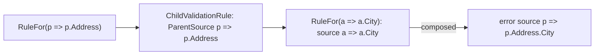

# Assimalign.Cohesion.ObjectValidation Design

## Design Intent

The library breaks validation into explicit layers so callers can author reusable profiles and then execute them through a single validator. That keeps rule definition and runtime validation separate.

## Architecture

- Validator coordinates profile execution and produces ValidationResult objects.
- ValidationProfile and descriptor types capture the fluent rule configuration model.
- ValidationOptions control execution behavior such as stop-on-first-failure and throw-on-failure.

## NativeAOT Posture

The library is NativeAOT-clean: no `System.Linq.Expressions.Expression.Compile` and no other
dynamic-code or reflection-emit path remains, so `IsAotCompatible=true` holds with no `IL2026`/
`IL3050` findings. Two seams were hardened without changing the authoring model:

- **Member access is compile-free.** `RuleFor`/`RuleForEach` still accept an
  `Expression<Func<T, TMember>>` member selector (the expression body doubles as the member name for
  the error `Source`), but the value is read by walking the expression's already-resolved
  `PropertyInfo`/`FieldInfo` metadata in `ValidationItemBase.GetValue` rather than by compiling a
  delegate. Walking resolved member metadata is reflection-only and AOT-safe, and the historical
  null-in-chain behavior (a null owner yields the member's default) is preserved by the surrounding
  try/catch.
- **Conditional predicates are delegate-first.** `When(...)` on `IValidationRuleDescriptor<T>` and
  `IValidationCondition<T>` now takes a `Func<T, bool>` rather than an `Expression<Func<T, bool>>`, so
  no predicate is compiled at run time. Inline lambda call sites (`When(p => p.Age >= 18, ...)`) bind
  to the delegate parameter unchanged; only a call site that first materialized an
  `Expression<Func<T, bool>>` variable is a (rare) source break.

## Error Sources

An error's `Source` names what failed. A rule's default source is its member selector's text
(`p => p.Name`), and a profile can set another through the rule's error callback
(`NotEmpty(error => error.Source = "name")`), which is kept as written.

**Nested profiles report under their parent member.** `ChildRules` and `UseProfile` validate a member
with a profile of its own type, whose selectors start from that type (`a => a.City`). The nested
rule (`ChildValidationRule`) records the parent member's selector and composes each nested error's
default source under it, so the error reads `p => p.Address.City`; two levels deep it reads
`p => p.Order.Address.City`. Before this, a nested error carried only the nested selector, and errors
on equally named members of different nested objects (`Shipping.City`, `Billing.City`) could not be
told apart. Under `RuleForEach`, nested sources name the collection member (`p => p.Addresses.City`)
without an element index: the collection item evaluates its rules per element without passing the
index to them.

Web request validation (`Assimalign.Cohesion.Web.Validation`) reports these sources to clients as the
member path after the selector parameter (`Address.City`).



## Layout Example

```text
Assimalign.Cohesion.ObjectValidation/
  src/
    Assimalign.Cohesion.ObjectValidation.csproj
    Abstractions/
    Exceptions/
    Extensions/
    Internal/
    Properties/
  tests/
  docs/
    OVERVIEW.md
    DESIGN.md
```

## Example 1: Create a validator with a profile

```csharp
IValidator validator = Validator.Create(builder =>
{
    builder.AddProfile(new PersonValidationProfile());
});
```

## Example 2: Validate a model instance

```csharp
var person = new Person();
ValidationResult result = validator.Validate(person);
```
