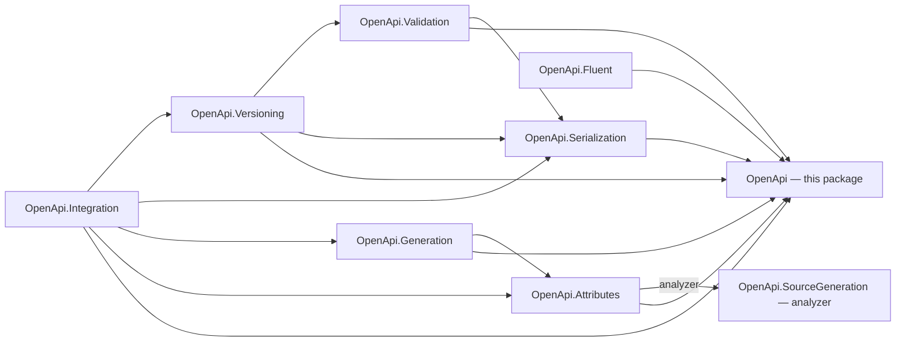

# Assimalign.Cohesion.OpenApi — Design

## Design intent

A single, version-aware object model that can represent the union of the officially published
OpenAPI 3.0.x, 3.1.x, and 3.2.x description surfaces. Callers author one graph; the line a document
targets is recorded on `OpenApiDocument.SpecVersion`, and downstream packages (serialization,
validation) adapt behavior per line by consulting one shared **capability matrix** rather than
re-deriving version differences from scattered conditionals.

This package is the foundation of the OpenApi family. It carries **no serialization-format and no
service-runtime concerns** — those live in sibling packages — so the model stays reusable by fluent
authoring, attribute/source-generation, and Web/ApiManager integration without dragging in JSON, YAML,
or hosting dependencies.

## Why a concrete data model (not interface-first)

The repo's interface-first rule (`.claude/rules/general-rules.md`) targets *behaviors and services* — things with swappable
implementations. An OpenAPI document is **data**, not behavior: there is exactly one shape for an `Info`
Object or a `Schema` Object. Modeling each element as a public concrete class mirrors the repo's
existing wire/data models (`DnsMessage`, `DnsRecord`, `HttpCookie`) and keeps authoring ergonomic
(object initializers, collection initializers).

The *behaviors* in the family — reading, writing, validating — **are** interface-first
(`IOpenApiReader`, `IOpenApiWriter`, `IOpenApiValidator`, `IOpenApiValidationRule`) with `internal`
implementations, exactly as the rule intends.

> A future session should not "correct" the element types into interfaces. The concreteness is
> deliberate and matches the data-model precedent in this repo.

## Unified superset model + capability matrix

One set of element types carries every field from all three lines. Version-specific behavior is made
explicit through two cooperating pieces:

- `OpenApiSpecVersion` — the line a document targets (`V3_0`, `V3_1`, `V3_2`).
- `OpenApiVersionCapabilities` — the **single source of truth** mapping each `OpenApiFeature` to the
  versions that support it, plus the canonical version string for each line and a parser from the raw
  `openapi` field. Serialization gates field *emission* on it; validation gates field *placement* on
  it. Keeping both consumers on one matrix is what prevents the writer and the validator from drifting.

### Version capability matrix (Story L01.01.15.01.03)

| Feature (`OpenApiFeature`) | 3.0.4 | 3.1.2 | 3.2.0 | Notes |
|---|:---:|:---:|:---:|---|
| `InfoSummary` | – | ✅ | ✅ | `info.summary` |
| `LicenseIdentifier` | – | ✅ | ✅ | SPDX `license.identifier` (excl. with `url`) |
| `Webhooks` | – | ✅ | ✅ | top-level `webhooks` |
| `JsonSchemaDialect` | – | ✅ | ✅ | top-level `jsonSchemaDialect` |
| `ComponentsPathItems` | – | ✅ | ✅ | `components.pathItems` |
| `ReferenceSummaryAndDescription` | – | ✅ | ✅ | `summary`/`description` beside `$ref` |
| `MutualTlsSecurityScheme` | – | ✅ | ✅ | `type: mutualTLS` |
| `SchemaNullableKeyword` | ✅ | – | – | 3.0 `nullable`; 3.1+ uses a `"null"` type entry |
| `SchemaTypeArray` | – | ✅ | ✅ | `type: [..., "null"]` |
| `SchemaNumericExclusiveBounds` | – | ✅ | ✅ | numeric `exclusiveMinimum/Maximum` (3.0 = boolean) |
| `SchemaConst` | – | ✅ | ✅ | JSON Schema `const` |
| `SchemaExamples` | – | ✅ | ✅ | schema-level `examples` array |
| `SchemaExtendedVocabulary` | – | ✅ | ✅ | 2020-12 keywords: `$defs`, `$id`, `$schema`, `$anchor`, `$dynamicRef`/`$dynamicAnchor`, `$comment`, `if`/`then`/`else`, `dependentRequired`/`dependentSchemas`, `prefixItems`, `contains`/`minContains`/`maxContains`, `patternProperties`, `propertyNames`, `unevaluatedItems`/`unevaluatedProperties`, `contentEncoding`/`contentMediaType`/`contentSchema` |
| `SchemaReferenceSiblingKeywords` | – | ✅ | ✅ | keywords beside `$ref` in Schema Objects |
| `SchemaBooleanForm` | – | ✅ | ✅ | boolean schemas `true`/`false` |
| `PathItemAdditionalOperations` | – | – | ✅ | `additionalOperations` |
| `DocumentSelf` | – | – | ✅ | top-level `$self` |
| `TagExtendedMetadata` | – | – | ✅ | tag `summary`/`parent`/`kind` |
| `OAuthDeviceAuthorizationFlow` | – | – | ✅ | OAuth `deviceAuthorization` flow (+ `deviceAuthorizationUrl`) |
| `ServerName` | – | – | ✅ | `server.name` |
| `PathItemQueryOperation` | – | – | ✅ | `query` fixed operation field (HTTP QUERY) |
| `ParameterQuerystringLocation` | – | – | ✅ | `in: querystring` |
| `ParameterCookieStyle` | – | – | ✅ | `style: cookie` |
| `MediaTypeStreamingFields` | – | – | ✅ | `itemSchema`, `prefixEncoding`, `itemEncoding` on Media Type; nested `encoding`/`prefixEncoding`/`itemEncoding` on Encoding |
| `MediaTypeReference` | – | – | ✅ | Reference Object as a `content` map value |
| `ResponseSummary` | – | – | ✅ | `response.summary` |
| `ExampleDataAndSerializedValues` | – | – | ✅ | example `dataValue`/`serializedValue` |
| `DiscriminatorDefaultMapping` | – | – | ✅ | discriminator `defaultMapping` |
| `XmlNodeType` | – | – | ✅ | xml `nodeType` (deprecates `attribute`/`wrapped`) |
| `SecuritySchemeOAuth2MetadataUrl` | – | – | ✅ | `oauth2MetadataUrl` (RFC 8414) |
| `SecuritySchemeDeprecated` | – | – | ✅ | security scheme `deprecated` |
| `ComponentsMediaTypes` | – | – | ✅ | `components.mediaTypes` |
| `SecurityRequirementUriReference` | – | – | ✅ | Security Requirement names as Security Scheme URIs |

### Two normalized version differences

Rather than expose every wire form, the model normalizes the two cases that would otherwise force
callers to think per-version. The serializer adapts them on the way out:

- **Nullability** — author `Type` + `Nullable`. 3.0 emits the `nullable` keyword; 3.1+ emits a type
  array (`["string","null"]`).
- **Exclusive bounds** — `ExclusiveMinimum`/`ExclusiveMaximum` are numeric. 3.0 emits the paired
  `minimum`/`maximum` value plus a boolean flag; 3.1+ emits the numeric keyword directly.

### Full JSON Schema surfaces (3.1+)

From 3.1 onward a Schema Object is a superset of JSON Schema draft 2020-12, which forces three shapes
onto the model beyond the keyword list itself:

- **Multi-type unions** — `Types` (an ordered list) is the authoritative surface; `Type` remains as a
  convenience accessor over the head of the list so the dominant single-type case stays ergonomic.
  `SchemaType.Null` is never stored: readers strip a `"null"` entry into `Nullable`, and writers add it
  back for 3.1+ targets, so both spellings normalize to one wire form. A multi-entry list targeting 3.0
  emits only the first type; validation flags the rest (`SchemaTypeArray`).
- **Boolean schema forms** — `BooleanValue` marks the whole schema as the JSON Schema literal `true` or
  `false`. Targeting 3.0 (which has no boolean form) the writer falls back to the structural
  equivalents `{}` and `{"not": {}}`; validation flags the placement (`SchemaBooleanForm`).
- **Keywords beside `$ref`** — a schema may carry `Reference` *and* other keywords (3.1+). Writing for
  3.0 emits `$ref` alone (siblings are meaningless there and are dropped); validation flags the
  combination (`SchemaReferenceSiblingKeywords`).

## The neutral node tree (`OpenApiNode`)

`example`, `default`, `enum`, `const`, and specification-extension (`x-`) values are arbitrary data.
They are represented by the format-agnostic `OpenApiNode` tree (`OpenApiObjectNode`, `OpenApiArrayNode`,
`OpenApiValueNode`) that lives here in the model. This is a *data* concern, not a *format* concern, so
it belongs to the model.

Critically, the serialization package reuses this same tree as its intermediate representation for the
**entire** document: model → node tree (all version logic) → text. JSON and YAML differ only in the
final node-tree-to-text renderer. That is the seam that made the YAML reader/writer (#532, built on
the Cohesion `Content.Yaml` engine) a drop-in addition without touching the model or the version logic.

## Error model

Recoverable problems (missing required fields, version mismatches, unresolved references) are **not**
thrown — they are reported as `OpenApiDiagnostic` values by the validation package. `OpenApiException`
(area-scoped root, inherits `Exception` per the AGENTS area-root rule) is reserved for hard programming
errors such as a structurally impossible node.

## Project family and ownership boundaries

Story L01.01.15.01.04 planned the family with a stricter rule than the one it was built to: every
package would depend on the root model and on no sibling. The built family keeps the part that matters.
This package references nothing in the family, every other package references it, and the graph is
acyclic. It does have sibling references, and each one reuses a sibling's behavior instead of
duplicating it:

- **Validation → Serialization:** the official-schema conformance stage checks the serialized document.
- **Generation → Attributes:** generation consumes the attributes' intermediate metadata.
- **Versioning → Serialization, Validation:** a transform deep-copies by a serialization round trip and
  reports version fit by running the validator.
- **Integration → Attributes, Generation, Serialization, Versioning:** the contracts compose all four.

The graph below draws those references; an arrow means "references". The labeled edge is an analyzer
reference: Attributes carries the source generator inside its package, and nothing references the
generator at run time.

| Package | Responsibility | Depends on |
|---|---|---|
| `Assimalign.Cohesion.OpenApi` | Canonical model, version capability matrix, node tree | — |
| `…OpenApi.Serialization` | Model ↔ node-tree mapping; JSON and YAML I/O | model, Content.Yaml |
| `…OpenApi.Validation` | Diagnostics + structural/semantic/version rules; official-schema stage | model, serialization |
| `…OpenApi.Fluent` | Fluent authoring builders | model |
| `…OpenApi.Attributes` | Attribute model, intermediate metadata, and mapper; carries the source generator | model |
| `…OpenApi.SourceGeneration` | AOT-safe attribute discovery → metadata registry (build time, under `analyzers/`) | — |
| `…OpenApi.Generation` | Metadata → version-targeted document | model, attributes |
| `…OpenApi.Versioning` | 3.0 ↔ 3.1 ↔ 3.2 transforms with diagnostics | model, serialization, validation |
| `…OpenApi.Integration` | Web/ApiManager contracts: endpoint source, description provider, import/export | model, attributes, generation, serialization, versioning |

Which of these ship, and how, is in the [area README](../../README.md) (*Project family* and *Source
generator delivery*).

Boundaries that exist to preserve specific properties: the model stays free of serialization so YAML
and future formats are additive; attribute discovery is isolated so it can be source-generated (no
runtime reflection, NativeAOT-safe); validation is separable so the official-schema conformance stage
can plug in without bloating the model; and the model carries no hosting concern so Web/ApiManager
integration is built through adapters, not by leaking request-pipeline types inward.

## AOT posture

`<IsAotCompatible>true</IsAotCompatible>` (inherited). The model is plain data with no reflection, no
dynamic code, and no runtime serialization. Serialization uses `System.Text.Json`'s `Utf8JsonReader`/
`Utf8JsonWriter` and `JsonDocument` only — no reflection-based (de)serialization, so the whole family
is trimming- and NativeAOT-safe.

## Non-goals (Wave 1)

- Fluent authoring, attribute model, source generation, version *transforms*, advanced authoring
  surfaces, official-example compliance corpus, and Web/ApiManager integration (later waves).
- A full JSON Schema 2020-12 conformance engine — the official-schema validation stage is an exposed
  extension point, not yet implemented.
- The JSON Schema `$vocabulary` keyword — meta-schema authoring is out of scope; unknown `$` keywords
  are not round-tripped.
- *Resolution* semantics for `$self`, `$id`, `$anchor`, and `$dynamicRef` — the fields are modeled and
  round-tripped verbatim; base-URI computation and reference resolution across documents are a later
  concern (they matter to the compliance corpus, not to the model shape).
