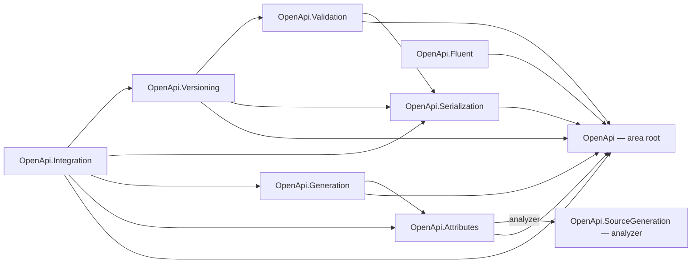

# OpenApi

The OpenApi area provides a code-first, version-aware foundation for producing and validating OpenAPI
descriptions across the officially published **3.0.4**, **3.1.2**, and **3.2.0** lines. It is an L1
foundation library family: it has no dependency on Web, ApiManager, or any service runtime, so L2/L3
service layers can compose it through contracts and adapters rather than inheriting hosting concerns.

## Project map

An arrow means "references": `OpenApi.Serialization --> OpenApi` reads
`Assimalign.Cohesion.OpenApi.Serialization` references `Assimalign.Cohesion.OpenApi`. The one labeled
edge, `OpenApi.Attributes --> OpenApi.SourceGeneration`, is an analyzer reference: the generator runs at
build time and ships inside the Attributes package, so it is neither a runtime nor a package dependency
(see *Source generator delivery*).

Solid edges are the references this area permits; the dependency arrow always points from the
consumer to what it consumes.

The full reference graph for every Cohesion assembly, including the exact external dependencies
collapsed above, is in [docs/DEPENDENCIES.md](../../docs/DEPENDENCIES.md).

## Layering

- **L1 (this area):** the document model, serialization, and validation — pure description machinery.
- **L2/L3 (future):** Web endpoint metadata and ApiManager contract workflows feed this foundation
  through integration contracts (Wave 3), keeping service runtime concerns out of the root model.

## Project family

Dependency direction is one-way: every package depends on the root model; no package depends on a
sibling except through the model.

| Package | Responsibility | Depends on | Status |
|---|---|---|---|
| [`Assimalign.Cohesion.OpenApi`](./Assimalign.Cohesion.OpenApi/) | Canonical version-aware model, capability matrix, `OpenApiNode` value tree | — | Implemented |
| [`Assimalign.Cohesion.OpenApi.Serialization`](./Assimalign.Cohesion.OpenApi.Serialization/) | Model ↔ node-tree mapping; JSON and YAML read/write | model, Content.Yaml | Implemented |
| [`Assimalign.Cohesion.OpenApi.Validation`](./Assimalign.Cohesion.OpenApi.Validation/) | Diagnostics model; structural, semantic, and version-placement rules | model | Implemented |
| [`Assimalign.Cohesion.OpenApi.Fluent`](./Assimalign.Cohesion.OpenApi.Fluent/) | Version-aware fluent authoring builders | model | Implemented |
| [`Assimalign.Cohesion.OpenApi.Attributes`](./Assimalign.Cohesion.OpenApi.Attributes/) | Attribute authoring model + intermediate metadata + mapper | model | Implemented |
| [`Assimalign.Cohesion.OpenApi.SourceGeneration`](../../analyzers/Assimalign.Cohesion.OpenApi.SourceGeneration/) | AOT-safe compile-time attribute discovery → metadata registry | — (build time; shipped inside attributes) | Implemented |
| [`Assimalign.Cohesion.OpenApi.Generation`](./Assimalign.Cohesion.OpenApi.Generation/) | Metadata → version-targeted document generation | model, attributes | Implemented |
| [`Assimalign.Cohesion.OpenApi.Versioning`](./Assimalign.Cohesion.OpenApi.Versioning/) | Version targets + 3.0↔3.1↔3.2 transforms with diagnostics | model, serialization, validation | Implemented |
| [`Assimalign.Cohesion.OpenApi.Integration`](./Assimalign.Cohesion.OpenApi.Integration/) | Web/ApiManager integration contracts (endpoint source, description provider, import/export) | attributes, generation, serialization, versioning | Implemented |

The **compliance suite** — the vendored official OpenAPI example corpus, round-trip/format-equivalence
and validation over every example, version-upgrade fixtures, and the
[coverage matrix](./Assimalign.Cohesion.OpenApi/docs/COVERAGE.md) — lives in the root model project's
[`tests/`](./Assimalign.Cohesion.OpenApi/tests/). The corpus and its `CorpusFixtures` locator are shared
assets under `tests/Shared/`, exposed through `tests/Shared/OpenApiCorpus.props` so any test project that
needs the corpus imports the same files rather than duplicating them.

These boundaries are advisory architecture guidance. They exist to preserve, respectively: additive
format support (YAML and beyond) without touching the model; source-generator-first, reflection-free
attribute discovery for NativeAOT; a pluggable official-schema validation stage; and a clean
Web/ApiManager integration seam.

## Source generator delivery

`Assimalign.Cohesion.OpenApi.SourceGeneration` has no package of its own. It ships inside
`Assimalign.Cohesion.OpenApi.Attributes` at `analyzers/dotnet/cs/`, through a
`CohesionAnalyzerReference` in the Attributes project. That is the precedent `ObjectMapping` and `Core`
set for an ordinary NuGet library that carries a generator.

- **Why Attributes.** The generator sees only the compilation it runs in, and every compilation that
  applies the attributes references Attributes. The SDK loads analyzers from every package in the
  restore graph, so a project that references only `OpenApi.Generation` or `OpenApi.Integration` gets
  the generator through their Attributes dependency; this was checked against locally packed packages.
  The emitted registry compiles against Attributes' metadata records and the root model's enums, so the
  package that brings the generator also brings everything its output needs.
- **Inside this repository** a project reference carries no analyzer, so a project that needs the
  registry adds `<CohesionAnalyzerReference Include="Assimalign.Cohesion.OpenApi.SourceGeneration" />`,
  as the Generation and Integration test projects do.
- **Rejected alternatives.** Carrying it in `OpenApi.Generation`: an assembly that only declares
  annotated endpoints has no reason to reference Generation, so its annotations would compile with no
  registry. A package of its own: no analyzer in this repository ships alone, and an opt-in generator
  lets a project apply the attributes and silently emit nothing. A shared framework's
  `CohesionFrameworkAnalyzer` entry, the way `SourceGeneration.Web` reaches `Sdk.Web` applications:
  OpenApi is in no framework, and a targeting pack reaches only SDK consumers. If OpenApi joins
  `App.Web`, that framework's member list needs the entry as well. Not shipping it: the runtime mapper
  needs attribute instances, and reading them off an assembly takes reflection that the NativeAOT
  posture rules out.

The full reasoning is in the generator's
[docs/DESIGN.md](../../analyzers/Assimalign.Cohesion.OpenApi.SourceGeneration/docs/DESIGN.md)
("Delivery").

## Standards

Supports OpenAPI 3.0.4, 3.1.2, and 3.2.0 with version-aware authoring, serialization, and validation.
Where schema files and specification text disagree, the specification text is authoritative per the
OpenAPI Initiative publications.

The **version capability matrix** — which model surface applies to which OpenAPI line — is published in
[`Assimalign.Cohesion.OpenApi/docs/DESIGN.md`](./Assimalign.Cohesion.OpenApi/docs/DESIGN.md) and enforced
by `OpenApiVersionCapabilities`, the single source of truth consumed by both serialization (field
emission) and validation (field placement).

## Status and roadmap

Wave 1 (model + JSON/YAML serialization + validation) is implemented; YAML rides the Cohesion
`Content.Yaml` engine through the node-tree seam. Subsequent work covers fluent authoring, the
attribute model and AOT source generator, version transforms, advanced authoring surfaces, an
official example/upgrade compliance corpus, and Web/ApiManager integration contracts.

See each package's `docs/OVERVIEW.md` and `docs/DESIGN.md` for detail.
