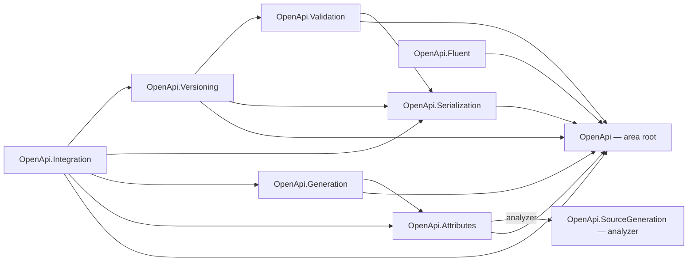

# OpenApi

The OpenApi area provides a code-first, version-aware foundation for producing and validating OpenAPI
descriptions across the officially published **3.0.4**, **3.1.2**, and **3.2.0** lines. It is an L1
foundation library family: it has no dependency on Web, ApiManager, or any service runtime, so L2/L3
service layers can compose it through contracts and adapters rather than inheriting hosting concerns.

## Project map

An arrow means "references": `OpenApi.Serialization --> OpenApi` reads
`Assimalign.Cohesion.OpenApi.Serialization` references `Assimalign.Cohesion.OpenApi`. The one labeled
edge, `OpenApi.Attributes --> OpenApi.SourceGeneration`, is an analyzer reference: the generator runs at
build time and ships inside the Attributes package, so it is neither a runtime nor a package dependency
(see *Source generator delivery*).



Solid edges are the references this area permits; the dependency arrow always points from the
consumer to what it consumes.

The full reference graph for every Cohesion assembly, including the exact external dependencies
collapsed above, is in [docs/DEPENDENCIES.md](../../docs/DEPENDENCIES.md).

## Layering

- **L1 (this area):** the document model, serialization, validation, fluent and attribute authoring,
  document generation, version transforms, and the integration contracts — pure description machinery.
- **L2/L3:** the Web layer and ApiManager build on the `OpenApi.Integration` contracts, keeping service
  runtime concerns out of the root model. The Web OpenAPI adapter
  ([`Assimalign.Cohesion.Web.OpenApi`](../../resources/Web/Assimalign.Cohesion.Web.OpenApi/), #152) is
  the first: it implements `IOpenApiEndpointSource` over the Web route table. ApiManager does not yet.

## Project family

The root model references nothing in the family, and every other package references it. Sibling
references exist as well, and each points from a package to one whose behavior it reuses:

- **Validation → Serialization:** the official-schema conformance stage checks the serialized document.
- **Generation → Attributes:** generation consumes the attributes' intermediate metadata.
- **Versioning → Serialization, Validation:** a transform deep-copies by a serialization round trip and
  reports version fit by running the validator.
- **Integration → Attributes, Generation, Serialization, Versioning:** the contracts compose all four.

Fluent and Attributes reference only the root. The graph is acyclic, and no package references Web,
ApiManager, or any service runtime.

| Package | Responsibility | Depends on | Release |
|---|---|---|---|
| [`Assimalign.Cohesion.OpenApi`](./Assimalign.Cohesion.OpenApi/) | Canonical version-aware model, capability matrix, `OpenApiNode` value tree | — | NuGet package |
| [`Assimalign.Cohesion.OpenApi.Serialization`](./Assimalign.Cohesion.OpenApi.Serialization/) | Model ↔ node-tree mapping; JSON and YAML read/write | model, Content.Yaml | NuGet package |
| [`Assimalign.Cohesion.OpenApi.Validation`](./Assimalign.Cohesion.OpenApi.Validation/) | Diagnostics model; structural, semantic, and version-placement rules | model, serialization | NuGet package |
| [`Assimalign.Cohesion.OpenApi.Fluent`](./Assimalign.Cohesion.OpenApi.Fluent/) | Version-aware fluent authoring builders | model | NuGet package |
| [`Assimalign.Cohesion.OpenApi.Attributes`](./Assimalign.Cohesion.OpenApi.Attributes/) | Attribute authoring model + intermediate metadata + mapper | model | NuGet package, carrying the source generator |
| [`Assimalign.Cohesion.OpenApi.SourceGeneration`](../../analyzers/Assimalign.Cohesion.OpenApi.SourceGeneration/) | AOT-safe compile-time attribute discovery → per-assembly provider + composed metadata registry | — (build time; shipped inside attributes) | Inside the Attributes package |
| [`Assimalign.Cohesion.OpenApi.Generation`](./Assimalign.Cohesion.OpenApi.Generation/) | Metadata → version-targeted document generation | model, attributes | NuGet package |
| [`Assimalign.Cohesion.OpenApi.Versioning`](./Assimalign.Cohesion.OpenApi.Versioning/) | Version targets + 3.0↔3.1↔3.2 transforms with diagnostics | model, serialization, validation | NuGet package |
| [`Assimalign.Cohesion.OpenApi.Integration`](./Assimalign.Cohesion.OpenApi.Integration/) | Web/ApiManager integration contracts (endpoint source, description provider, import/export) | model, attributes, generation, serialization, versioning | NuGet package |

Every package in the table is implemented. The eight libraries are built and tested on Linux, Windows,
and macOS by `.github/workflows/library-openapi.yml` and are listed in the release inventory
(`installer/scripts/modules/CohesionPackaging.psm1`), so a release publishes each as its own package.
The generator is built and tested by `.github/workflows/analyzers.yml` and reaches consumers only inside
the Attributes package. No OpenApi package is a member of a shared framework, so an application, an
`Sdk.Web` one included, references the packages it uses.

The **compliance suite** — the vendored official OpenAPI example corpus, round-trip/format-equivalence
and validation over every example, version-upgrade fixtures, and the
[coverage matrix](./Assimalign.Cohesion.OpenApi/docs/COVERAGE.md) — lives in the root model project's
[`tests/`](./Assimalign.Cohesion.OpenApi/tests/). The corpus and its `CorpusFixtures` locator are shared
assets under `tests/Shared/`, exposed through `tests/Shared/OpenApiCorpus.props` so any test project that
needs the corpus imports the same files rather than duplicating them.

These boundaries are advisory architecture guidance. They exist to preserve, respectively: additive
format support (YAML and beyond) without touching the model; source-generator-first, reflection-free
attribute discovery for NativeAOT; a pluggable official-schema validation stage; and a clean
Web/ApiManager integration seam.

## Source generator delivery

`Assimalign.Cohesion.OpenApi.SourceGeneration` has no package of its own. It ships inside
`Assimalign.Cohesion.OpenApi.Attributes` at `analyzers/dotnet/cs/`, through a
`CohesionAnalyzerReference` in the Attributes project. That is the precedent `ObjectMapping` and `Core`
set for an ordinary NuGet library that carries a generator.

- **Why Attributes.** The generator sees only the compilation it runs in, and every compilation that
  applies the attributes references Attributes. The SDK loads analyzers from every package in the
  restore graph, so a project that references only `OpenApi.Generation` or `OpenApi.Integration` gets
  the generator through their Attributes dependency; this was checked against locally packed packages.
  The emitted code compiles against Attributes' metadata records and provider contract and the root
  model's enums, so the package that brings the generator also brings everything its output needs.
- **Inside this repository** a project reference carries no analyzer, so a project that needs the
  registry adds `<CohesionAnalyzerReference Include="Assimalign.Cohesion.OpenApi.SourceGeneration" />`,
  as the Generation and Integration test projects do.
- **Rejected alternatives.** Carrying it in `OpenApi.Generation`: an assembly that only declares
  annotated endpoints has no reason to reference Generation, so its annotations would compile with no
  registry. A package of its own: no analyzer in this repository ships alone, and an opt-in generator
  lets a project apply the attributes and silently emit nothing. A shared framework's
  `CohesionFrameworkAnalyzer` entry, the way `SourceGeneration.Web` reaches `Sdk.Web` applications:
  OpenApi is in no framework, and a targeting pack reaches only SDK consumers. If OpenApi joins
  `App.Web`, that framework's member list needs the entry as well. Not shipping it: the runtime mapper
  needs attribute instances, and reading them off an assembly takes reflection that the NativeAOT
  posture rules out.

The full reasoning is in the generator's
[docs/DESIGN.md](../../analyzers/Assimalign.Cohesion.OpenApi.SourceGeneration/docs/DESIGN.md)
("Delivery").

## Combining metadata from several assemblies

An application whose annotated endpoints are spread over several assemblies reads all of them from its
own generated registry, with no runtime discovery:

```csharp
using Assimalign.Cohesion.OpenApi.Generated;
using Assimalign.Cohesion.OpenApi.Generation;

var input = new OpenApiGenerationInput
{
    Operations = OpenApiMetadataRegistry.Operations,
    Schemas = OpenApiMetadataRegistry.Schemas,
    Tags = OpenApiMetadataRegistry.Tags,
    SecuritySchemes = OpenApiMetadataRegistry.SecuritySchemes
};
```

Each annotated assembly gets a generated public provider class with an assembly-unique name, which
implements `IOpenApiMetadataProvider` and is advertised with `[assembly: OpenApiMetadataProvider]`; that
interface and attribute are the hand-written contract in `OpenApi.Attributes`. The generator in a
referencing compilation reads those attributes at compile time and emits an **internal**
`OpenApiMetadataRegistry` that constructs every advertised provider: referenced assemblies first,
ordered by assembly name, then the compilation's own. Every assembly the compilation references
contributes, including the transitive references an SDK project passes to the compiler, and the
application needs no annotations of its own to get the registry. Because each registry is internal, any
number of annotated assemblies compose without CS0433 or CS0436. The one exception is
`InternalsVisibleTo`: a friend assembly that names the registry gets CS0436 and still binds its own
registry, which is the complete one.

Design, ordering, hand-written providers, and the alternatives rejected are in the generator's
[docs/DESIGN.md](../../analyzers/Assimalign.Cohesion.OpenApi.SourceGeneration/docs/DESIGN.md)
("Composing metadata across assemblies").

## Standards

Supports OpenAPI 3.0.4, 3.1.2, and 3.2.0 with version-aware authoring, serialization, and validation.
Where schema files and specification text disagree, the specification text is authoritative per the
OpenAPI Initiative publications.

The **version capability matrix** — which model surface applies to which OpenAPI line — is published in
[`Assimalign.Cohesion.OpenApi/docs/DESIGN.md`](./Assimalign.Cohesion.OpenApi/docs/DESIGN.md) and enforced
by `OpenApiVersionCapabilities`, the single source of truth consumed by both serialization (field
emission) and validation (field placement).

## Status and roadmap

The planned family is implemented: the model, JSON and YAML serialization (YAML rides the Cohesion
`Content.Yaml` engine through the node-tree seam), validation, fluent and attribute authoring with the
AOT source generator, document generation, version transforms, the advanced authoring surfaces, and the
Web/ApiManager integration contracts, with the official example and upgrade compliance corpus in the
root project's tests. All eight libraries and the generator are in the release. The first
service-layer consumer is the Web OpenAPI adapter (`Assimalign.Cohesion.Web.OpenApi`, #152), which builds
on Integration, Attributes, and Generation and passes the schemas it derives from System.Text.Json
contracts through the metadata's optional `Schema` members (Attributes DESIGN, "Pass-through schemas").

See each package's `docs/OVERVIEW.md` and `docs/DESIGN.md` for detail.
