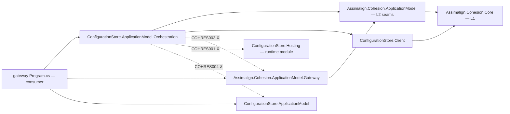
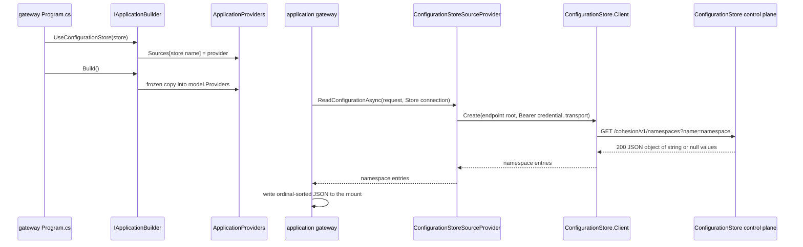
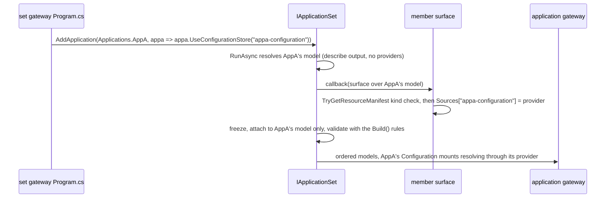

# Assimalign.Cohesion.ConfigurationStore.ApplicationModel.Orchestration — Design

## Intent

Libraries never depend on resources. The gateway (`libraries/ApplicationModel/**`) therefore cannot
know how a ConfigurationStore serves configuration. It resolves a `<source>:<key>` mount only
through an `IResourceSourceProvider` that the application registered in its
`ApplicationProviders.Sources` (`IApplicationBuilder.Providers` for a builder,
`IApplicationProviderBuilder.Providers` for an application-set member). This package holds the ConfigurationStore half of that
contract, which is the area's wire knowledge (route, query, credential presentation, and JSON
shape), behind the seam `Assimalign.Cohesion.ApplicationModel` defines. It is the first
`Assimalign.Cohesion.<Area>.ApplicationModel.Orchestration` package kind in the area, per owner
decision 1 of the 2026-09-25 BYO design.

Registration is explicit. A gateway that never calls `builder.UseConfigurationStore(store)` — or,
for an application-set member, `member.UseConfigurationStore("<store>")` in that member's callback —
gets no ConfigurationStore behaviour. `Build()`, and an application set for each member, validates the
provider registrations against the model, so a `settings:<namespace>` mount with no provider is
rejected there, and the error names this package and verb.

## Dependency direction

In the diagram below, an arrow means "references". The consumer's gateway `Program.cs` is the
composition root. It references the gateway, this package, and (for the typed resource) the area
ApplicationModel package. This package references only the ApplicationModel seams and the Core-only
ConfigurationStore client.

The three dotted edges are forbidden, and the build enforces each one on this project:

- **No `Assimalign.Cohesion.ApplicationModel.Gateway*` reference (COHRES003).** The gateway consumes
  the seam, and the provider implements it. Neither side knows the other's type.
- **No `ConfigurationStore.Hosting` reference (COHRES001).** The provider speaks the wire protocol
  through the client. It never loads the store runtime.
- **No `ConfigurationStore.ApplicationModel` reference (COHRES004).** That package references
  `Assimalign.Cohesion.Hosting.Resources`, and no area feature library may resolve a
  `Assimalign.Cohesion.Hosting*` assembly. The verb takes the plain `IApplicationResourceDescriptor`
  rather than the typed ConfigurationStore descriptor for the same reason.

`ConfigurationStore.Client` references no ApplicationModel assembly (owner decision O2 keeps client
packages framework-eligible), so the edge between the two runs one way only.

| Package | Role |
| --- | --- |
| `Assimalign.Cohesion.ApplicationModel` | Defines `IResourceSourceProvider`, `ApplicationProviders`, `ResourceSourceRequest`, and `ResourceProviderConnection` |
| `Assimalign.Cohesion.ConfigurationStore.Client` | Sends the authenticated namespace read and parses the document |
| `Assimalign.Cohesion.ConfigurationStore.ApplicationModel.Orchestration` | Binds the two: the provider and the `UseConfigurationStore` verb |

## Registration and read

The sequence below runs from `UseConfigurationStore` through `builder.Providers`, the provider, and
the client, to the ConfigurationStore control plane.

### The verb

`UseConfigurationStore(store)` writes one entry, `builder.Providers.Sources[store.Resource.Name]`,
and returns the builder. It touches no other provider role, such as the certificate authority,
trust store, command inputs, telemetry, credential issuer, or callers. If the descriptor wraps a
manifest-backed resource of another kind, the verb throws `ArgumentException` immediately. A
resource without a manifest is registered, and its kind is checked at `Build()`.
`ApplicationProviders.Sources` rejects the reserved names `parameter` and `literal`. `Build()`
copies the registrations into `IApplicationModel.Providers` as a frozen snapshot.

The verb is idempotent and never silently replaces a registration it did not make, the same
conflict rule as `UseSecretStore`. Calling it again for the same store keeps the existing
`ConfigurationStoreSourceProvider`. A provider of another type already registered under the
store's name (an application's own `IResourceSourceProvider`, say) is an
`InvalidOperationException`, and the registration is left as it was.

Registration stays dependency-free, with no container, configuration binding, or I/O.

### Application-set members: the by-name verb

A member of an application set arrives as a model imported from its own gateway's describe output.
Providers are code, so that model carries none, and it has no descriptors to hand the verb above.
The set gateway therefore registers the member's store by name, in the member's own callback:
`set.AddApplication(Applications.AppA, appa => appa.UseConfigurationStore("appa-configuration"))`.
The by-name verb extends `IApplicationProviderBuilder` — the surface the set hands the callback —
and returns that surface.

- The kind check uses the manifest `IApplicationProviderBuilder.TryGetResourceManifest` finds —
  the member's resolved resource — and names the resource's application (the lookup also finds another
  application's external or `--realize` closure resource); a name the surface does not know is
  registered and left to validation, which rejects a missing resource or another application's.
- The registration belongs to the member alone. Two members that each declare a store called
  `settings` each register their own provider, and a member that did not register one fails at set
  start, naming the member and `application.UseConfigurationStore("settings")`. Nothing is inherited
  by name from another member or from the set.
- Conflict, idempotence, and reserved-name rules are those of the descriptor verb.

`IApplicationBuilder` and `IApplicationProviderBuilder` are separate interfaces (owner decision
O45, 2026-09-27): the builder does not extend the member surface, so the by-name verb is not a
builder verb. An application built in code registers its store with the descriptor verb, which
returns `IApplicationBuilder` for chaining builder verbs; both verbs write the same
`ApplicationProviders`. The default builder implements both interfaces, so code holding it can cast
it to `IApplicationProviderBuilder` and call the by-name verb, as this package's tests do. There is
deliberately no `IApplicationBuilder` by-name overload: besides keeping the two surfaces apart, with
one `builder.UseConfigurationStore(null)` would be ambiguous between the descriptor and the name.

### The read

`ReadConfigurationAsync` checks the request before it opens a transport:

1. `Kind` must be `Configuration`. Otherwise it throws `NotSupportedException`, the same
   refusal the gateway gave before the seams ("Configuration mounts require ConfigurationStore").
2. `Store` must be present and its `ResourceKind` must be `ConfigurationStore`, compared
   case-insensitively as in the gateway's kind checks. Otherwise it throws `ArgumentException`.
3. `ControlPlaneAddress` must be an endpoint URI (`Uri.ThrowIfNotEndpoint`). The bearer
   credential must not be blank (`ClientCredential`).

It then creates a transport and calls
`ConfigurationStoreClient.Create(endpointRoot, credential, transport).GetNamespaceAsync(key)`.
The transport is disposed after the call.

**Endpoint root.** The gateway builds `ControlPlaneAddress` from the observed endpoint plus the
manifest control-plane path (`/cohesion/v1` by default). The store does not route by that path: it
serves `/cohesion/v1/namespaces` beneath the base of its `api` endpoint. Before the seams, the gateway
read that route from the observed endpoint root, which has no path. The provider therefore rebuilds
that root from the address's scheme, host, and port (`Uri.CreateEndpoint`). A custom
`CohesionControlPlanePath` then reads exactly what it read before.
`ConfigurationStoreClient.CreateForControlPlane` is not used. It only redirects command routes, and
would append `/cohesion/v1/namespaces` a second time.

**Transport.** Each read gets a new `HttpMessageInvoker` over a `SocketsHttpHandler` with redirects
and cookies disabled. The connection's `ServerCertificateValidator` is installed as the TLS
validation callback when present. These settings, and the per-read ownership, match the gateway's
`GatewayHttpTransport`. The factory is an internal constructor seam so tests can substitute a
recording handler.

## Wire equivalence

For the same observed endpoint, credential, and namespace, the provider sends exactly the
request the gateway's former built-in store client sent (`GatewayStoreClient.ReadConfigurationAsync`,
removed when the gateway moved onto `model.Providers`):

| Aspect | Value |
| --- | --- |
| Method and path | `GET <scheme>://<host>:<port>/cohesion/v1/namespaces` |
| Query | `name=<Uri.EscapeDataString(namespace)>` |
| Headers | `Accept: application/json`, `Authorization: Bearer <credential>` |
| Body | none |
| Success | the JSON object deserialized to `IReadOnlyDictionary<string, string?>` with `null` values kept |

The ordinal-sorted JSON the mount receives is still produced by the gateway, which serializes the
returned dictionary. Serialization never moves into a provider.

## Errors and cancellation

| Condition | Result |
| --- | --- |
| `request` is `null` | `ArgumentNullException` |
| Mount kind is not `Configuration` | `NotSupportedException` (no request sent) |
| No `Store` connection, or a non-ConfigurationStore one | `ArgumentException` (no request sent) |
| Invalid or non-HTTP(S) control-plane address, blank credential, blank namespace | `ArgumentException` (no request sent) |
| Store unreachable or non-success status (`401`, `403`, `404`, ...) | `HttpRequestException` whose `StatusCode` is the store's status |
| Empty, malformed, non-object, or JSON `null` document | `JsonException` |
| Cancelled token | `OperationCanceledException` |

A namespace the store does not hold is `404`, which is an `HttpRequestException`. It is not an
empty map. `ReadConfigurationAsync` returns a non-nullable dictionary, and the gateway reports a
missing namespace as an unresolved mount, as it did before the seams.
`ReadSecretAsync` and `ReadCertificateAsync` keep their interface defaults and throw
`NotSupportedException`.

## AOT posture

The package adds no serialization, because the client's source-generated
`ConfigurationStoreClientJsonContext` parses the document. It uses no reflection or dynamic code
and inherits the repository's `net10.0`, trimming, and NativeAOT settings.

## Testing

The tests drive the provider two ways:

- Against a recording `HttpMessageHandler`, asserting the exact request. One test compares that
  request with the one the gateway's legacy client call produced for the same inputs.
- Against a real, authenticating `ConfigurationStore.Hosting` host, with the control-plane address
  a gateway would hand it. This covers values including `null`, and `404`/`403`/`401`.

The verb tests assert what lands in `builder.Providers` and in the built model's frozen snapshot.
`ConfigurationStoreSetMemberTests` run an application set through a real `ApplicationModel.Gateway`
(a test-project reference; the package references no gateway): two imported members with equal
store names each call `UseConfigurationStore("configuration")`, and each member's Configuration
mount resolves through the real provider and HTTP transport against its own loopback store double,
with an audience-bound credential issued for that member. A member without the registration, and a
by-name registration of a resource of another kind, fail at set start naming the member.
Test projects are exempt from the resource guards by path, so the host harness may reference the
runtime module that this package may not.

## Non-goals

- Secrets, certificates, trust, or command inputs. The SecretStore Orchestration package owns
  those roles.
- Cross-application stores. A `<source>` that names another application's resource is rejected
  at `Build()` (owner decision 4) and is a follow-up for when the store resources mature.
- Caching, retrying, or watching namespaces. The gateway resolves mounts on each reconcile pass.
- Shared-framework delivery. The package is NuGet-only.
