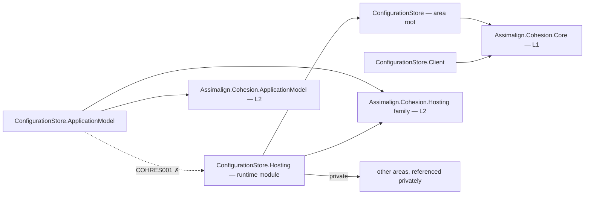

# ConfigurationStore

ConfigurationStore is the L3 resource area for durable, named configuration namespaces. Its
default host serves namespace snapshots and declarative mutations over the resource control-plane
endpoint; values are configuration rather than secrets and are stored as plain JSON beneath the
`data` volume.

## Project map

An arrow means "references": `ConfigurationStore.Hosting --> ConfigurationStore` reads
`ConfigurationStore.Hosting` references `Assimalign.Cohesion.ConfigurationStore`.



Solid edges are the references this area permits. The dotted edge is the one `COHRES001`
rejects: **no library in the area may reference its own `ConfigurationStore.Hosting` runtime
module**, and the declarative `.ApplicationModel` package in particular never does — generated
code in an opted-in consumer executable joins the two sides at run time through
`Assimalign.Cohesion.Hosting.Resources.ResourceRuntime` instead. The area root and its feature
libraries likewise reference no `Assimalign.Cohesion.Hosting*` library at all (`COHRES004`).

The full reference graph for every Cohesion assembly, including the exact external dependencies
collapsed above, is in [docs/DEPENDENCIES.md](../../docs/DEPENDENCIES.md).

## Projects

- `Assimalign.Cohesion.ConfigurationStore` defines the public area-root application and builder contracts alongside the existing loader abstraction.
- `Assimalign.Cohesion.ConfigurationStore.ApplicationModel` supplies the manifest-backed typed resource, strict StatefulSet planner, and default control plane.
- `Assimalign.Cohesion.ConfigurationStore.Client` is the thin, Core-only HTTP protocol client used by gateways to read configuration namespace snapshots and carry generic commands.
- `Assimalign.Cohesion.ConfigurationStore.Hosting` provides the concrete creation entry point, durable store, ES256 bootstrap verification, and HTTP protocol host.

## Layering and dependencies

As an L3 service platform, ConfigurationStore composes the shared Hosting, Hosting.Resources,
IdentityModel, and private Web transport primitives rather than defining a second lifecycle or HTTP
stack. The ApplicationModel package remains orchestration-only and COHAM001-guarded.

The client package is the narrow O13 orchestration exception: a gateway may reference it for
mount-source resolution and command delivery, but the client never references `*.Hosting` and is
not delivered through the `App.ConfigurationStore` shared framework. Gateway platform
implementation assemblies continue to avoid ConfigurationStore ApplicationModel packages;
generated application gateway projects consume the area package for its typed resource and planner.

## Project documentation

- [Root overview](./Assimalign.Cohesion.ConfigurationStore/docs/OVERVIEW.md)
- [Root design](./Assimalign.Cohesion.ConfigurationStore/docs/DESIGN.md)
- [ApplicationModel overview](./Assimalign.Cohesion.ConfigurationStore.ApplicationModel/docs/OVERVIEW.md)
- [ApplicationModel design](./Assimalign.Cohesion.ConfigurationStore.ApplicationModel/docs/DESIGN.md)
- [Hosting overview](./Assimalign.Cohesion.ConfigurationStore.Hosting/docs/OVERVIEW.md)
- [Hosting design](./Assimalign.Cohesion.ConfigurationStore.Hosting/docs/DESIGN.md)
- [Client overview](./Assimalign.Cohesion.ConfigurationStore.Client/docs/OVERVIEW.md)
- [Client design](./Assimalign.Cohesion.ConfigurationStore.Client/docs/DESIGN.md)

## Application composition (O34)

The root contracts are hosting-free (O34): `IConfigurationStoreApplication` exposes `Context`, `StartAsync`, and `StopAsync`; `IConfigurationStoreApplicationContext` exposes `ContentRootPath`. `IConfigurationStoreApplicationBuilder` owns area declarations and `Build()`. The root and feature packages reference no `Assimalign.Cohesion.Hosting*` library; COHRES004 enforces the boundary.

`ConfigurationStoreApplication.CreateBuilder(args)` returns the public concrete `ConfigurationStoreApplicationBuilder`; its `Build()` returns the public `ConfigurationStoreApplication : Host<ConfigurationStoreApplicationContext>`. The public `ConfigurationStoreApplicationContext` implements `IConfigurationStoreApplicationContext`, reading `ContentRootPath` from the host environment. The application explicitly forwards the root lifecycle contract to `IHost`, and consumers use the concrete application for `RunAsync` and `await using`. Runtime options and supporting services remain internal.

```csharp
using Assimalign.Cohesion.ConfigurationStore.Hosting;

ConfigurationStoreApplicationBuilder builder = ConfigurationStoreApplication.CreateBuilder(args);
// Add area declarations and optional hosting services before Build().
await using ConfigurationStoreApplication application = builder.Build();
await application.RunAsync();
```
