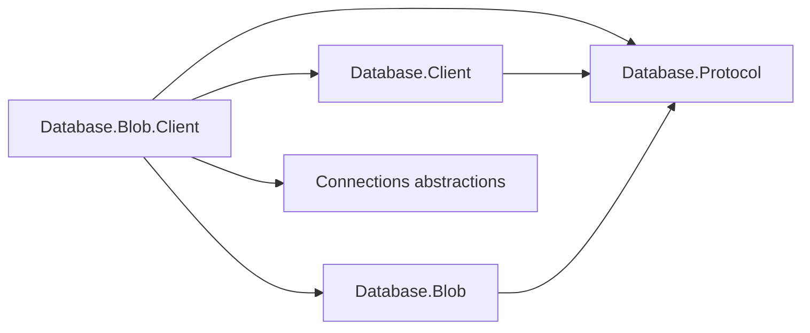
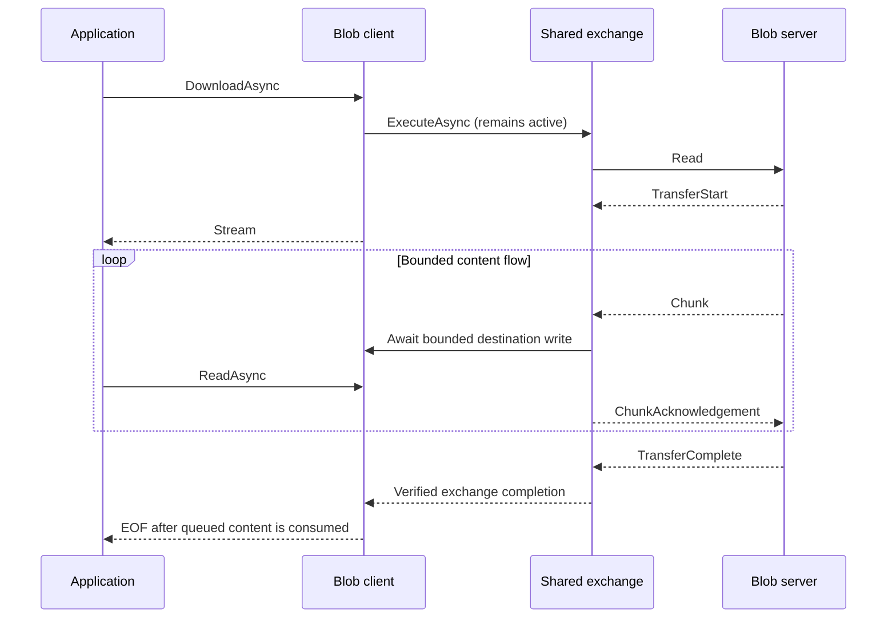

# Blob client design

## Ownership and family

The typed client binds `Database.Client` to the exact `BlobProtocol.Family` instance.
`IBlobClient.ConnectAsync` rents an authenticated shared connection and wraps its lease in
`IBlobConnection`. Database selection happens in the shared handshake and is immutable;
Blob requests carry container and object names only. The client never chooses a concrete
transport and owns no parallel handshake, frame parser, or connection pool.

The dependency arrows below point from each consuming package to its dependency.

| Package | Responsibility |
| --- | --- |
| `Assimalign.Cohesion.Database.Blob.Client` | Typed operation APIs, bounded download/list materialization, client errors |
| `Assimalign.Cohesion.Database.Client` | Pool leases, transport dialing, startup handshake, complete framed exchanges |
| `Assimalign.Cohesion.Database.Blob` | Blob codecs, shared transfer state machine, engine and server |
| `Assimalign.Cohesion.Database.Protocol` | Family validation, frame envelope, startup and error vocabulary |
| `Assimalign.Cohesion.Connections` | Transport-neutral connection factory |

Public APIs are new client interfaces, a static factory, options, and a typed exception.
Existing engine, protocol, and shared client interfaces are unchanged. Explicit codecs and
ordinary generic delegates keep the implementation NativeAOT compatible without reflection.

## Upload and atomic publication

Upload sends `Write(container, name, overwrite)` followed by `BlobProtocolTransfer.SendAsync`.
The shared Blob helper sends start metadata, reads one at-most-65,536-byte source chunk,
sends it, and waits for a cumulative acknowledgement before advancing the source. It verifies
known length and finishes with `TransferComplete(actualLength)`. The client then requires a
second `TransferComplete` from the server with the same count: this is publication acknowledgement.
The caller's stream stays open on success, cancellation, and failure.

Acknowledgement of each chunk only establishes destination acceptance. The server's explicit
transaction publishes metadata after verified transfer completion, successful destination
disposal, and commit. Premature EOF, incorrect counts, failed source reads, cancellation, or
disconnect during reception abort the transaction. A preexisting blob remains visible until
replacement commits; no partial replacement or partial new blob is readable.

There is no idempotency token or exactly-once claim. If the client sends completion and then
loses the connection or is canceled, the server may already have committed the complete blob.
A failed client call alone cannot distinguish that outcome from an aborted upload. Successful
return is stronger: it confirms receipt of the matching publication acknowledgement.

## Streaming downloads and bounded memory

`IDatabaseProtocolExchange` must consume a complete exchange before returning and prohibits
retaining its frame reader or writer after return. A download therefore keeps that exchange
running as an asynchronous producer. The public `DownloadAsync` returns only after this producer
validates `TransferStart`; errors before startup fail the method itself. The producer passes
the metadata and frame adapters to `BlobProtocolTransfer.ReceiveAsync`. It does not implement
another chunk or acknowledgement state machine.

The returned `Stream` reads from a single-slot bounded queue. The destination adapter copies
one received chunk into a queue entry because incoming frame payload ownership belongs to
the frame reader. Once the queue fills, destination writes wait for consumer progress, which
also stops further protocol acknowledgements. Content memory is bounded by the consumer's
current chunk, one queued chunk, a pending destination chunk, and a fixed number of frame/source
buffers, independent of object length. Caller-controlled read/copy buffers are additional.
The server must use file-backed storage for objects larger than its heap; an in-memory engine
necessarily retains its stored content.

The sequence shows when streaming may return to the caller while the shared exchange stays active.

The producer records failure independently of queue completion. Reads consult that sticky
failure before returning content and before returning EOF. Queue exhaustion alone never
means success: EOF requires verified protocol completion. A server error, connection truncation,
or invalid count throws `BlobClientException`, even if earlier reads yielded valid chunks.
Subsequent reads continue to throw. Consumers must discard partial destination content if a
copy fails. Streams are read-only, sequential, and reject simultaneous reads; length and seek
are unsupported even when the server declared a length.

## Cancellation, disposal, and pooled leases

Each connection allows only one exchange. Starting another while one is active fails promptly
with `InvalidOperationException`. The typed connection retains its shared pool lease until it
is disposed; a background producer cannot accidentally return that lease while using frames.
Normal verified completion releases the operation slot, even if some verified bytes remain
in the download's bounded local queue. Dispose downloads before starting subsequent work.

The download-start token is linked to the connection lifetime and remains active on the
returned stream. A token passed to any asynchronous read cancels the whole transfer, including
a producer blocked on a full queue or awaiting a wire frame. Stream disposal cancels an
unfinished producer, waits for its completion and connection teardown, and discards remaining
queued bytes. It suppresses already-recorded transfer failures; reads are the error surface.
Disposing a fully completed stream leaves the connection healthy. Connection disposal cancels
and joins any current operation before returning its lease. Disposing a pooled client follows
the shared ownership rule: dispose rented connections first.

Cancellation surfaces as `OperationCanceledException`. Failed source streams may also propagate
their own exception types; transport-style failures are translated by the shared client.
After any failed exchange, the client immediately returns its invalidated rental so transport
closure wakes the server and causes unfinished uploads to roll back. No retry or resume occurs.

## Errors and metadata operations

A model reader adapter recognizes shared `Error` frames and throws `BlobClientException`
with their original code and message before the generic transfer helper can collapse them
into `ProtocolException`. This exception deliberately derives from `DatabaseException`, not
`DatabaseClientException`: the shared pool considers `ExecutionFailure` reusable for completed
tabular commands, whereas every Blob server error terminates its session. The adapter therefore
makes shared exchange invalidation unconditional without changing an existing interface.
Other shared client errors are translated to the same Blob exception after invalidation.

Delete accepts only an operation completion count of zero or one. Properties accepts a single
matching item followed by completion(1), or completion(0) for absence. Listings yield metadata
through another one-slot queue, validating prefix membership and the final item count.
Early enumeration disposal cancels the producer and invalidates an unfinished exchange. The
metadata protocol has no per-item acknowledgement; this client bounds its own queue, but a
transport without backpressure may buffer an entire listing. Blob content retains its explicit
one-chunk acknowledgement window regardless of transport behavior.

Every server error, including ordinary missing-container or overwrite rejection, closes the
connection. Rent another connection to continue. Missing blob properties and deletion misses
are normal null/false results; downloading a missing blob is an error. Local malformed frames,
ordering mistakes, and truncation map to `ProtocolViolation`; transport failures map to `Internal`.
Deadline behavior comes from supplied cancellation tokens and server lifecycle options.

## Scope and verification

This package does not provision databases or containers, expose SQL commands, multiplex
requests, retry operations, resume content, introduce transport-specific convenience APIs,
or expose a buffered byte-array content API. Tests use `Connections.InMemory`, including
nonseekable content, interrupted uploads, cancellation in both directions, server errors,
scoping, pooling, and a file-backed transfer materially larger than a child process's managed heap.

The family integration exposed two concrete limitations: transfer helpers originally accepted
only `ProtocolChannel` while shared exchanges expose frame reader/writer pairs, and shared
pool error reuse is based on SQL-like error codes. Additive helper overloads and the model
error adapter solve this without changing existing public interfaces; the phase escalation
record documents the design pressure for future models.
