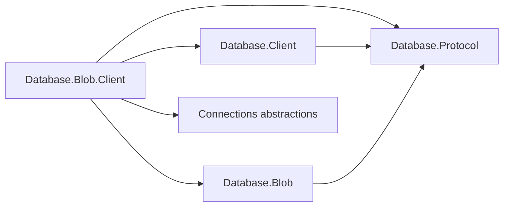
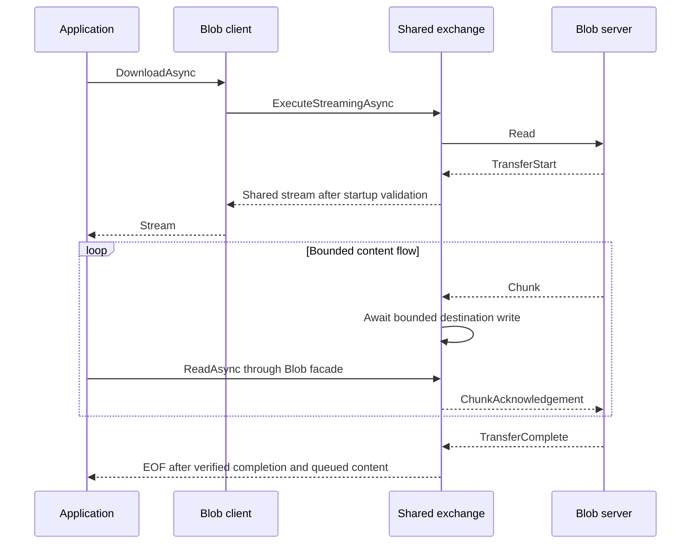

# Blob client design

## Ownership and family

The typed client binds `Database.Client` to the exact `BlobProtocol.Family` instance.
`BlobClient.ConnectAsync` rents an authenticated shared connection and wraps its lease in
the sealed `BlobConnection`. Database selection happens in the shared handshake and is immutable;
Blob requests carry container and object names only. The client never chooses a concrete
transport and owns no parallel handshake, frame parser, or connection pool.

The dependency arrows below point from each consuming package to its dependency.

```mermaid
flowchart LR
    Client["Database.Blob.Client"] --> Shared["Database.Client"]
    Client --> Blob["Database.Blob"]
    Client --> Connections["Connections abstractions"]
    Client --> Protocol["Database.Protocol"]
    Shared --> Protocol
    Blob --> Protocol
```

| Package | Responsibility |
| --- | --- |
| `Assimalign.Cohesion.Database.Blob.Client` | Typed operation APIs, Blob transfer validation, bounded list materialization, client errors |
| `Assimalign.Cohesion.Database.Client` | Pool leases, transport dialing, startup handshake, framed exchanges, bounded streaming lifetime |
| `Assimalign.Cohesion.Database.Blob` | Blob codecs, shared transfer state machine, engine and server |
| `Assimalign.Cohesion.Database.Protocol` | Family validation, frame envelope, startup and error vocabulary |
| `Assimalign.Cohesion.Connections` | Transport-neutral connection factory |

Public APIs are a sealed client with its `Create` factory, a sealed connection, options, and a typed exception.
Blob consumes the shared streaming exchange contract without changing its own caller-facing
connection contract or its model's wire protocol. Explicit codecs and ordinary generic
delegates keep the implementation compatible with `net10.0` and NativeAOT without reflection.
The streaming migration adds no dependencies or shipped-library `InternalsVisibleTo` grants.

## Upload and atomic publication

Upload sends `Write(container, name, overwrite)` followed by `BlobProtocolTransfer.SendAsync`.
The shared Blob helper sends start metadata, reads one at-most-65,536-byte source chunk,
sends it, and waits for a cumulative acknowledgement before advancing the source. It verifies
known length and finishes with `TransferComplete(actualLength)`. The client then requires a
second `TransferComplete` from the server with the same count: this is publication acknowledgement.
The caller's stream stays open on success, cancellation, and failure.

Acknowledgement of each chunk only establishes destination acceptance. The server's explicit
transaction publishes metadata after verified transfer completion, successful destination
disposal, and commit. Premature EOF, incorrect counts, failed source reads, cancellation, or
disconnect during reception abort the transaction. A preexisting blob remains visible until
replacement commits; no partial replacement or partial new blob is readable.

There is no idempotency token or exactly-once claim. If the client sends completion and then
loses the connection or is canceled, the server may already have committed the complete blob.
A failed client call alone cannot distinguish that outcome from an aborted upload. Successful
return is stronger: it confirms receipt of the matching publication acknowledgement.

## Streaming downloads and bounded memory

Downloads derive from `DatabaseStreamingExchange`. Its `OpenCoreAsync` phase sends the Blob read
request and validates `TransferStart`; `DownloadAsync` returns only after that validation,
so errors before startup fail the method itself. Its `CopyToCoreAsync` phase passes the metadata,
frame adapters, and borrowed destination stream to `BlobProtocolTransfer.ReceiveAsync`, which
verifies chunks, counts, acknowledgements, and terminal completion. This is Blob-specific wire
work. The shared client runs the producer and owns the content stream and its lifetime.
`BlobDownloadStream` is only an exception facade over that shared stream.

The shared content stream reads from a single-slot bounded queue. The shared destination
adapter copies received content into entries no larger than 65,536 bytes because incoming
frame payload ownership belongs to the frame reader. Once the queue fills, destination writes
wait for consumer progress, which also stops further protocol acknowledgements. Content memory
is bounded by the consumer's
current chunk, one queued chunk, a pending destination chunk, and a fixed number of frame/source
buffers, independent of object length. Caller-controlled read/copy buffers are additional.
The server must use file-backed storage for objects larger than its heap; an in-memory engine
necessarily retains its stored content.

The sequence shows when streaming may return to the caller while the shared exchange stays active.

```mermaid
sequenceDiagram
    participant A as Application
    participant C as Blob client
    participant E as Shared exchange
    participant S as Blob server
    A->>C: DownloadAsync
    C->>E: ExecuteStreamingAsync
    E->>S: Read
    S-->>E: TransferStart
    E-->>C: Shared stream after startup validation
    C-->>A: Stream
    loop Bounded content flow
        S-->>E: Chunk
        E->>E: Await bounded destination write
        A->>E: ReadAsync through Blob facade
        E-->>S: ChunkAcknowledgement
    end
    S-->>E: TransferComplete
    E-->>A: EOF after verified completion and queued content
```

The shared producer records failure independently of queue completion. Reads consult that sticky
failure before returning content and before returning EOF. Queue exhaustion alone never
means success: EOF requires verified protocol completion. A server error, connection truncation,
or invalid count throws `BlobClientException`, even if earlier reads yielded valid chunks.
Subsequent reads continue to throw. Consumers must discard partial destination content if a
copy fails. Streams are read-only, sequential, and reject simultaneous reads; length and seek
are unsupported even when the server declared a length.

## Cancellation, disposal, and pooled leases

Each connection allows only one exchange. Starting another while one is active fails promptly
with `InvalidOperationException`. Downloads call `DatabaseConnection.ExecuteStreamingAsync`,
so a healthy typed connection retains its caller-owned shared pool lease until connection
disposal; a background producer cannot accidentally return that lease while using frames.
Normal verified completion releases the operation slot, even if some verified bytes remain
in the download's bounded local queue. Dispose downloads before starting subsequent work.

The download-start token remains active on the returned stream. Disposing the connection
cancels and joins an active producer. A token passed to any asynchronous read cancels the whole transfer, including
a producer blocked on a full queue or awaiting a wire frame. Synchronous or asynchronous stream
disposal cancels an unfinished producer, waits for its completion and connection teardown, and
discards remaining
queued bytes. It suppresses already-recorded transfer failures; reads are the error surface.
Disposing a fully completed stream leaves the connection healthy. Connection disposal cancels
and joins any current operation before returning its lease. Disposing a pooled client follows
the shared ownership rule: dispose rented connections first.

Cancellation surfaces as `OperationCanceledException`. Failed source streams may also propagate
their own exception types; transport-style failures are translated by the shared client.
After any failed exchange, the client immediately returns its invalidated rental so transport
closure wakes the server and causes unfinished uploads to roll back. No retry or resume occurs.

## Errors and metadata operations

A model reader adapter recognizes shared `Error` frames and throws `DatabaseClientException`
with their original code and message before `BlobProtocolTransfer` can collapse them into
`ProtocolException`. Preserving diagnostics at that helper boundary remains necessary, but
the adapter no longer changes the exception type to force pool invalidation. The shared pool
uses the exchange's completion evidence instead of inspecting the error code. Blob failures
never certify that the session is reusable: every Blob server error terminates its session,
and an abandoned transfer may retain unread frames.

The typed operation boundary and the download stream facade translate shared client errors to
`BlobClientException` only after shared health processing. This retains the existing Blob error
surface, original wire code, and sticky read failures. Ordinary Blob operations also retain their
frame-only adapters for completed transport pipes that report `InvalidOperationException`:
these preserve existing Blob upload and metadata diagnostics without changing SQL or Key-Value
transport behavior. Downloads use the shared streaming frame adapters for that normalization.
These adapters do not control connection health or intercept errors from caller-owned streams.
Blob-specific codecs, transfer validation,
acknowledgements, publication acknowledgement, metadata shapes, and typed exception mapping
remain in Blob; producer coordination, content buffering, cancellation, and connection release
belong to the shared client.

Delete accepts only an operation completion count of zero or one. Properties accepts a single
matching item followed by completion(1), or completion(0) for absence. Listings yield metadata
through another one-slot queue, validating prefix membership and the final item count.
Early enumeration disposal cancels the producer and invalidates an unfinished exchange. The
metadata protocol has no per-item acknowledgement; this client bounds its own queue, but a
transport without backpressure may buffer an entire listing. Blob content retains its explicit
one-chunk acknowledgement window regardless of transport behavior.

Every server error, including ordinary missing-container or overwrite rejection, closes the
connection. Rent another connection to continue. Missing blob properties and deletion misses
are normal null/false results; downloading a missing blob is an error. Local malformed frames,
ordering mistakes, and truncation map to `ProtocolViolation`; transport failures map to `Internal`.
Deadline behavior comes from supplied cancellation tokens and server lifecycle options.

A failed dial is the one transport failure with its own code. It reaches `ConnectAsync` as the
core's `DatabaseClientException` with `ProtocolErrorCode.ConnectionFailure` (owner decision 39;
the core's `DESIGN.md`, "Lifecycle and errors"). `BlobClientException` keeps that code, and the
core exception, which keeps the transport's exception, is its inner exception. A canceled dial
throws `OperationCanceledException` unchanged (`BlobClientDialFailureTests`).

## Diagnostics

The client reports through one internal event source named for its assembly,
`Assimalign.Cohesion.Database.Blob.Client` (`src/Internal/EventSource/BlobClientEventSource.cs`).
Start and stop carry the `Transfers` keyword (`0x1`).

| Id | Event | Level | Keyword | Payload |
| --- | --- | --- | --- | --- |
| 1 | `TransferStart` | Verbose | `Transfers` | `database`, `operation` (`Upload`, `Download`, `Delete`, `GetProperties` or `List`), `container` |
| 2 | `TransferStop` | Verbose | `Transfers` | `database`, `operation`, `container`, `bytes` (the content an upload sent or a download received; zero otherwise), `durationMilliseconds` |
| 3 | `TransferFailed` | Error | — | `database`, `operation`, `container`, `code` (the wire code), `exceptionMessage`, `durationMilliseconds` |
| 4 | `ListCleanupFailed` | Verbose | — | `database`, `container`, `exceptionType`, `exceptionMessage` |

Upload, delete, properties and listing are written around the private `ExecuteCoreAsync` every one
of them runs through. A download starts in `DownloadAsync` and stops when its last chunk is
verified, inside the download exchange's copy, which can be after `DownloadAsync` returned its
stream. A failure before the stream opens is written by `DownloadAsync`; one after it, by the copy,
through an exception filter that declines it, with the code the shared client gives it (its own
for a coded failure, `ProtocolViolation` for malformed frames, `Internal` otherwise). A
cancellation, or an enumeration or download stream disposed early, writes neither stop nor
failure. Event 4 reports a failure the listing's cleanup swallows only when its consumer never saw
it: the failure the enumeration already surfaced, and the cancellation the cleanup itself causes,
are not written.

Only a coded failure (`DatabaseClientException`), or any failure of a download's copy, ends a start
with event 3. A cancellation, which is how a timeout surfaces, or an uncoded exception before the
copy (an overlapping exchange, a disposed connection) leaves the start without a stop or a failure,
and because event 3 is not a stop, an activity-tracking tool leaves a failed transfer's activity
open. Pairing every start with a stop, as `System.Net.Http`'s `RequestStart`/`RequestStop` do, is
an owner decision on the event-source plan's catalog.

Container names are identifiers and are written; blob names may be user data and are never
written, nor is any content. The server names the blob in some of its failure messages
(`Blob '…' does not exist.`, `Blob '…' already exists.`), so event 3 replaces the transfer's blob
name in the message it writes with `<redacted>`. The shared core's `ExchangeFailed` writes no
statement-level server message at all (Database.Client `DESIGN.md`, "Diagnostics"). Timestamps
are taken only while a listener takes the source, and the byte count is read without boxing the
result. No counters.

`BlobClientEventSourceTests` checks the name, the strict manifest, each member's transfer once (the
download's stop with its received bytes, and a refused download's failure), an upload refused over
an existing blob, no blob name in any event (the refusals' messages included), and event 4 from a
scripted listing whose worker fails after the consumer stopped taking items.

## Scope and verification

This package does not provision databases or containers, expose SQL commands, multiplex
requests, retry operations, resume content, introduce transport-specific convenience APIs,
or expose a buffered byte-array content API. Tests use `Connections.InMemory`, including
nonseekable content, interrupted uploads, cancellation in both directions, server errors,
scoping, pooling, and a file-backed transfer materially larger than a child process's managed heap.

The shared streaming contract also supports test-level consumers from a second model, so
future Documents and Graph clients can supply their own startup and content protocol without
copying Blob's former queue, producer, cancellation, or rental-release machinery. Listings
remain a Blob-owned bounded typed enumeration: they produce metadata items rather than a
content stream and validate Blob-specific prefix and item-count rules.

## Concrete types (concrete-types plan, phase 5, #1261)

The package has no public interface left and no `Abstractions/` folder
([plan](../../../../docs/programs/DATABASE_CONCRETE_TYPES_PLAN.md) §7, "P5, as landed").

| Type | Shape | Was |
|---|---|---|
| `BlobClient` | sealed; `Create(BlobClientOptions)` over a private constructor | the static `BlobClient` factory, `IBlobClient` and the internal `DefaultBlobClient` |
| `BlobConnection` | sealed; internal constructor; moved out of `Internal/` | `IBlobConnection` and the internal `BlobConnection` |

The connection's private exchanges are leaves of the shared bases: the materialized operations'
`BlobExchange<TResult>` of `DatabaseProtocolExchange<TResult>`, and the download's
`BlobDownloadExchange` of `DatabaseStreamingExchange`. `BlobExchange` never calls
`MarkResponseComplete`, so every failed Blob exchange still discards its connection: a transfer
can leave unread frames even when its error code is `ExecutionFailure`. Studio's Blob workspace
was retyped to the sealed types.
