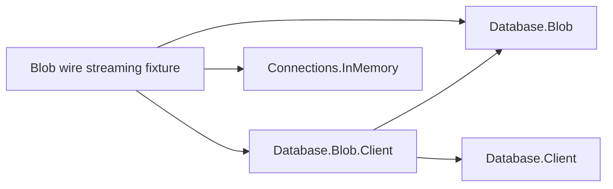

# Blob wire streaming fixture design

The client, server, transport and engine run in the same heap-constrained process,
so an unbounded buffer on either side fails the same acceptance test. File storage
keeps the engine's durable contents outside the managed heap. The input stream is
nonseekable and generates each requested chunk; the download feeds incremental
SHA-256 rather than a memory stream. A separate bounded loop derives the expected
digest before the transfer.

The executable references the typed client, the server's engine package, and the test transport.

The fixture rejects a heap above 64 MiB and transfers 256 MiB + 123 bytes. It also
checks the committed length/content type, maximum source read size, verified EOF,
and engine health. The parent starts a fresh process because GC heap limits must
be effective before runtime initialization. An eight-minute child timeout and a
ten-minute parent timeout turn protocol hangs into failures.

All resources use asynchronous disposal in reverse ownership order. NativeAOT is
optional for developer verification; the same source is built by ordinary tests.
