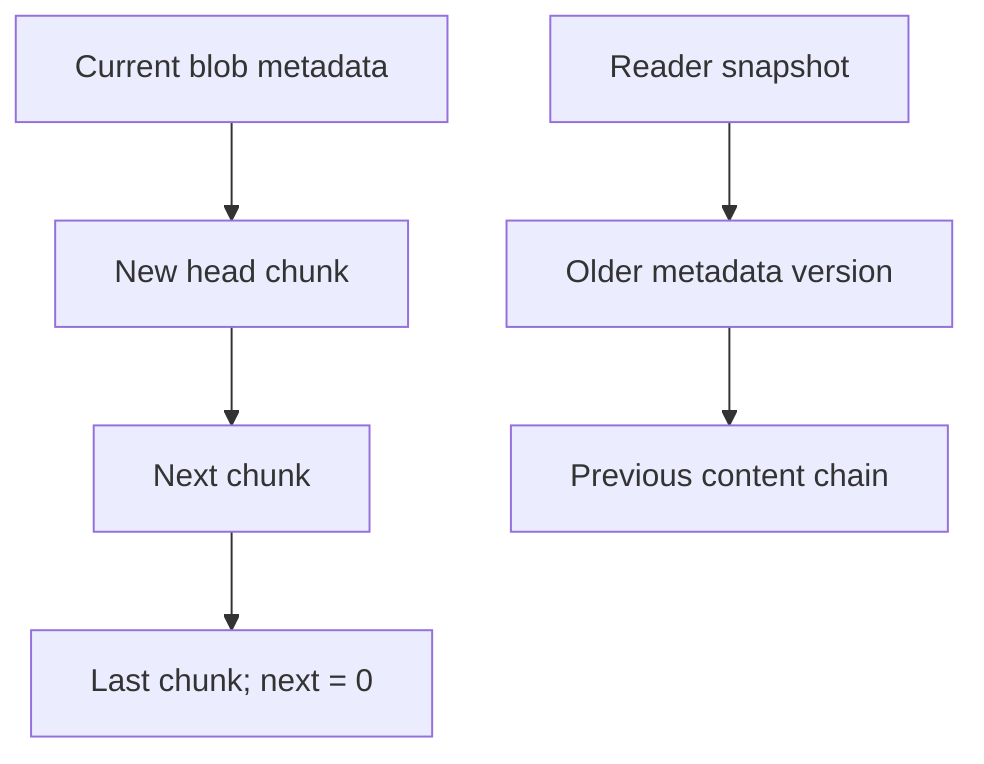
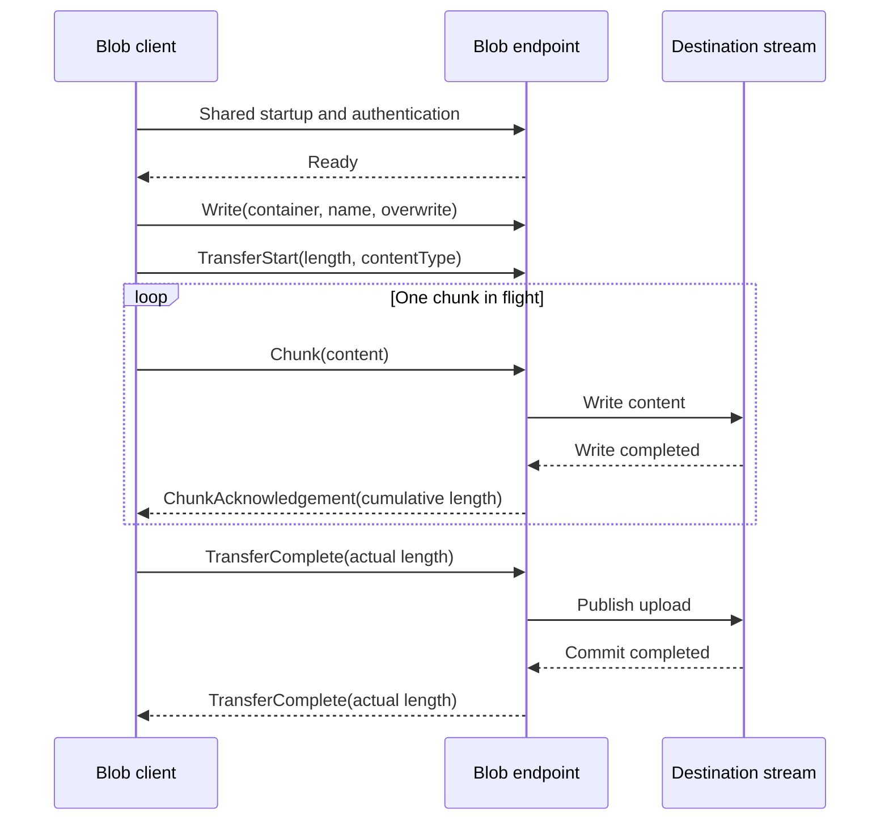

# Blob engine design

## Composition and lifetime

The engine owns one Blob.Storage file set, one TransactionCoordinator, and one Blob.Catalog
per logical database. Metadata and content share the same data file and journal. This differs
from Key-Value's separate catalog file because a blob's head pointer must have the same commit
decision as its chunk chain. All paging, CRC checks, page allocation, WAL records, recovery,
transaction coordination, locks, and version reclamation come from the shared kernels.

| Package | Responsibility |
| --- | --- |
| `Assimalign.Cohesion.Database.Blob` | Database/session/container lifetimes, ownership, publication, Blob wire family |
| `Assimalign.Cohesion.Database.Protocol` | Shared framing, handshake, versioning, errors and family-bound channels |
| `Assimalign.Cohesion.Database.Blob.Catalog` | Metadata versions, directory and ordered listings |
| `Assimalign.Cohesion.Database.Blob.Storage` | Stream adapters and chunk encoding |
| `Assimalign.Cohesion.Database.Transactions` | MVCC contexts, coordinator, locks and version ledger |
| `Assimalign.Cohesion.Database.Storage` | Shared page pool, allocator, WAL, CRC and physical recovery |

Engine creation starts four dedicated background threads: checkpoint, WAL flush, page
write-back, and version purge. Each worker is exposed through `Workers`. The engine reports
Running until disposal or a worker fault; an unexpected worker fault reports Faulted. Disposal
is idempotent, stops and joins every worker, then aborts active transactions and durably closes
all open databases. It attempts every database close even if one fails. Synchronous and grouped
commit modes both wait for durable commit; grouped commits use the engine's flush signal and
the kernel's bounded self-help window.

File-backed databases use `<RootPath>/<database>/blob.dat`, `blob.log`, and `blob.bak`.
Database names are single file-name components, compared ignoring case; invalid path components
are rejected. Database enumeration includes persisted databases and opens them through recovery.
`TryGetDatabase` addresses the open instance set. Container and blob names are ordinal and
case-sensitive; a slash in a blob name is ordinary name content, never a database selector.

## Chunk chain and disk compatibility

A visible catalog metadata version references the head of an immutable content chain. Each
chunk references its successor; zero ends the chain. Empty objects have zero head and length.
Replacement metadata references a new chain; readers holding an older snapshot continue to
reference the old chain until their streams close. The diagram shows those references.

The authoritative byte layouts are documented in
[Blob.Storage DESIGN](../../Assimalign.Cohesion.Database.Blob.Storage/docs/DESIGN.md) and
[Blob.Catalog DESIGN](../../Assimalign.Cohesion.Database.Blob.Catalog/docs/DESIGN.md).
Both use kernel slotted pages and a 16-byte prefix: little-endian UInt64 writer at offset 0
and UInt64 deleter at offset 8. The record kind at offset 16 distinguishes container metadata
(1), blob metadata (2), and chunks (3). Metadata uses owner-zero pages; content uses nonzero
owners. Packed locations store the page identifier in the high 48 bits and slot in the low
16 bits. The catalog carries content length, content type, original creation and latest
modification timestamps, a durable unique entity tag, CRC-32 and the head location. The chunk
format specifies its own format byte and link/payload offsets in the storage document.

## Atomic publication and recovery

An upload holds one logical `ITransactionContext`. Each full chunk applies in a small physical
statement bracket through `TransactionCoordinator.ApplyStatementAsync`; each created record
is tracked by the shared version store. The stream holds one chunk buffer, not the object.
Flush can persist chunks while leaving them unpublished. Successful disposal finishes the last
chunk, tombstones replaced content, saves metadata, and commits the automatic transaction.
Inside an explicit transaction it only finishes the statement; transaction commit publishes
all its changes together. Entity tags reserve values from the durable storage sequence allocator,
so repeated writes in one transaction also get distinct tags.

Failure or cancellation aborts the logical transaction. On restart the shared page recovery
replays physical brackets, then the coordinator classifies logical transactions and scrubs
uncommitted writer stamps before catalog loading. Checkpoints go through the coordinator so
the checkpoint record preserves every active logical sequence across WAL truncation. A crash
after some chunk brackets commit therefore leaves no visible partial blob. The metadata directory
is rebuilt from metadata pages after recovery and listing never scans content pages.

Deletion tombstones metadata and all chunks in the same logical transaction. Version purge
reclaims them after every reader snapshot that could see them ends, returning empty pages to
the kernel free-space map. Undo, purge, and recovery operate in bounded physical batches, and
the kernel reads recovery journal frames sequentially rather than retaining their page images.
The version ledger and page directory retain small per-record/page identifiers; the payload
itself stays on disk. File-backed storage is required when content exceeds available memory.

## Sessions, concurrency and ownership

The existing `IDatabaseSession.Database` seam returns a session-bound `IBlobDatabase` facade.
It does not add a session parameter to the settled Blob interfaces. Containers from that view
use the same coordinator and explicit transaction. Direct engine database instances and their
containers instead use automatic transactions. Session disposal invalidates bound containers
and streams. Snapshot and ReadCommitted isolation are supported; unsupported isolation is
rejected rather than weakened. Read operations pin the selected snapshot until stream disposal.
An explicit ReadCommitted operation also retains a fixed snapshot pin so an earlier writer
committing during download cannot advance the purge horizon past its selected content.

Mutations take the shared lock manager's database exclusive lock before physical application.
This conservative first version serializes writers for the upload lifetime; snapshot readers
continue concurrently. Under that lock, the engine compares snapshot-visible metadata with
the latest state and rejects stale writes. A session admits only one active operation/stream.
This avoids overlapping uploads in the same transaction replacing the same original version.

Containers carry stable identities distinct from their names, so a dropped and recreated
container cannot be addressed through an obsolete handle. Runtime creation marks them Adhoc.
Dropping a Schema-owned container throws `DatabaseObjectLockedException` with its name,
owning schema, and `DROP CONTAINER`, matching SQL's ownership semantics. There is no Blob
schema provisioner; tests directly save a Schema marker through the catalog.

## Verification and limits

### Container ownership discovery (C2)

`IBlobDatabase.GetContainersAsync`, `IBlobContainer.GetBlobsAsync`, and
`IBlobContainer.GetPropertiesAsync` already provide object discovery. Ownership is the only
additional surface: the `IBlobContainer.GetOwnershipAsync()` extension reads a read-only property
bag containing `OWNER` (`DatabaseObjectOwner.Adhoc` or `DatabaseObjectOwner.Schema`) and
`OWNING_SCHEMA` (the compiled schema name, or null). These names and meanings match SQL's
`COHESION_SCHEMA.OBJECT_OWNERSHIP`; the existing container handle supplies the object identity.
No public interface changes, replacement listing API, or Blob statement language are introduced.

The extension reads the container's current catalog version through the same operation snapshot
as blob reads. Explicit Snapshot transactions retain their visibility; ReadCommitted operations
read fresh metadata. Automatic operations read current committed metadata. Results are detached
read-only dictionaries, never stored metadata copies that require synchronization. Mutation
through `IDictionary` (assignment, add, remove, or clear) throws the documented BCL diagnostic
`NotSupportedException`; its explanatory message is localized by the runtime. There is no
ownership write operation.

Ownership remains scoped to the handle's database and session. The stable container id is
checked before reading, so a dropped and recreated container cannot be inspected through a
stale handle; disposed sessions and canceled operations retain their ordinary diagnostics.
An external `IBlobContainer` implementation that does not support this engine extension receives
`DatabaseException` with "This blob container does not support ownership discovery."

The Shouldly suites cover chunk boundaries, empty objects, replacements, metadata/prefix
listing, page and content CRC, snapshots, rollback, stale writers, cancellation, ownership,
logical database lifecycle and scope guards. A child process round-trips a 128 MiB object with
a 64 MiB managed heap and reopens the persisted object. A separate fixture is killed with
unfinished replacement and new-object chains after checkpoint/write-back passes; restart keeps
the committed object and hides both unfinished writes.

## Blob wire family

The model package owns the Blob message family; `Database.Protocol` supplies framing and the
immutable family seam. `BlobProtocol.Family` binds one `ProtocolChannel` to Blob for its entire
lifetime. The listener endpoint selects this family before reading startup; no model discriminator
is added to the handshake. All family identifiers below are model-scoped: another model may use
the same byte on its own endpoint, but the Blob channel cannot switch interpreters during a session.
An independent client must connect to a configured Blob endpoint and complete the shared
Startup → Authenticate → AuthenticateResponse → Ready exchange before sending a Blob request.
Startup selects the database; container and object names never select or switch databases.

The shared envelope remains a big-endian UInt32 payload byte count followed by one message-type
byte, then that many payload bytes. The shared envelope caps payloads at 16 MiB. Blob content
instead uses nonempty chunks of at most 65,536 bytes, so an object can exceed both a frame and
available memory. No object-sized allocation or seeking is needed by either transfer helper.
The sender retains one reusable 65,536-byte array; the receiver materializes and writes one
bounded frame at a time. Incoming framing still enforces the shared 16 MiB ceiling before
allocation, and Blob decoding rejects a content frame larger than its stricter 65,536-byte bound.

Version 1.0 defines the following complete payload layouts. Integers are big-endian. A `text`
field is an Int32 UTF-8 byte length followed by exactly that many UTF-8 bytes, without a
terminator. Each text field is limited to 65,535 bytes, and invalid UTF-8, negative lengths,
missing bytes, and trailing bytes are protocol violations. Container and object names must
be nonempty and compare ordinally, case-sensitively. No Unicode normalization is applied.

| Byte | Message | Direction | Payload in order |
| --- | --- | --- | --- |
| 64 | `Read` | Client → server | `text container`, `text name` |
| 65 | `Write` | Client → server | `text container`, `text name`, UInt8 overwrite (`0` or `1`) |
| 66 | `TransferStart` | Content sender → receiver | Int64 length (`-1` unknown, otherwise nonnegative), `text contentType` (empty means unspecified) |
| 67 | `Chunk` | Content sender → receiver | 1–65,536 raw content bytes; no inner prefix |
| 68 | `TransferComplete` | Content sender → receiver, or server → client upload acknowledgement | Int64 actual content byte count, nonnegative |
| 69 | `ChunkAcknowledgement` | Content receiver → sender | Int64 cumulative accepted content byte count, nonnegative |

`Read` returns `TransferStart`, zero or more chunks, and `TransferComplete`. A `Write` request
is immediately followed by that transfer in the opposite direction. The sender waits for a
`ChunkAcknowledgement` after every chunk before reading more source content. The receiver writes
the chunk to its destination before acknowledging the cumulative count. Duplicate, out-of-order,
or incorrect acknowledgement counts fail the transfer. This one-chunk window bounds content in
flight even on transports without backpressure, including `Connections.InMemory`. The accepted
tradeoff is one round trip per chunk; a future window extension would require explicit negotiation
rather than silently increasing memory requirements.

The receiver checks cumulative content against a declared nonnegative length before writing an
excess chunk and checks completion against both the actual count and the declared count. With
unknown length, the completion count still must equal actual received bytes. Empty objects send
start and completion with no chunks. Chunk acknowledgement means the destination accepted the
bytes; it never means the object was published or durably committed. On upload, after receiving
and verifying `TransferComplete`, the server publishes through its storage transaction, then
sends its own `TransferComplete` with the verified length as the success acknowledgement.

This exchange shows the upload request, the bounded content flow, and publication acknowledgement:

Only one request or transfer is active per connection; no transfer IDs or multiplexing exist.
Shared Ping/Pong are used between operations. A shared Error frame may terminate an exchange;
`BlobProtocolTransfer` converts it to `ProtocolException` including its stable code and message.
Any unexpected frame, EOF before completion, malformed payload, source failure, destination
failure, or cancellation aborts the transfer. Discard that connection instead of attempting to
resume at an uncertain frame boundary. A server must abort the associated upload transaction,
never publish a partial destination through successful stream disposal. Connection closure also
cancels a sender waiting for acknowledgement. Callers should supply cancellation deadlines.

`BlobProtocolTransfer` owns only the content sequence. It neither authenticates nor dispatches
requests, commits destination storage, sends the final publication acknowledgement, closes the
channel, or disposes caller streams. `ReceiveAsync` returns the content type and verified actual
length, replacing an initially unknown length. Concrete Blob clients and server dispatch remain
separate work (#214 and its server integration); no concrete transport is referenced here.
Public codecs use explicit binary operations and strict UTF-8, with no reflection or object
serialization. Shared protocol version remains 1.0 because these are first-use Blob endpoint
messages and SQL/Key-Value payloads and identifiers remain unchanged.

`BlobProtocolTests` use `Connections.InMemory` for authenticated request/transfer exchanges in
both directions. A generated non-seekable source and validating non-seekable destination move
16 MiB + 173 bytes without owning payload arrays. They verify content and a maximum 65,536-byte
gap between source reads and destination acceptance, even though that transport has no automatic
pipe backpressure. Additional tests fix independent wire vectors and cover empty/unknown lengths,
short reads, malformed encodings, completion-count mismatches, and cancellation while awaiting
an acknowledgement. Existing Blob test source files are unchanged.

Names and metadata must fit one kernel record. Streams are sequential and not thread-safe.
Applications must dispose them; no finalizer commits a forgotten upload. Blob has no query
language, wire client, security policy, replication, or compiled schema provisioning here.
Public interfaces remain unchanged, and the builder verb references only the area root seam.
