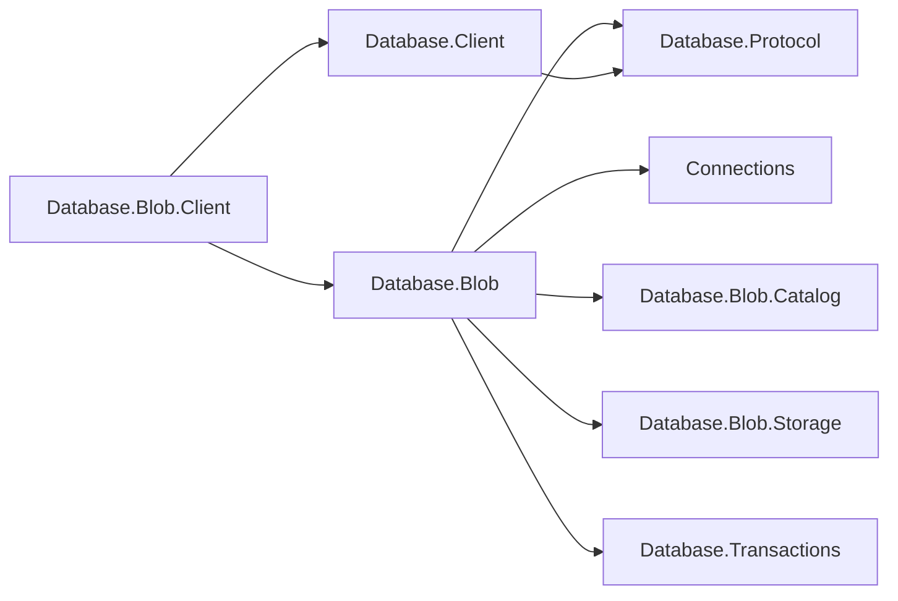
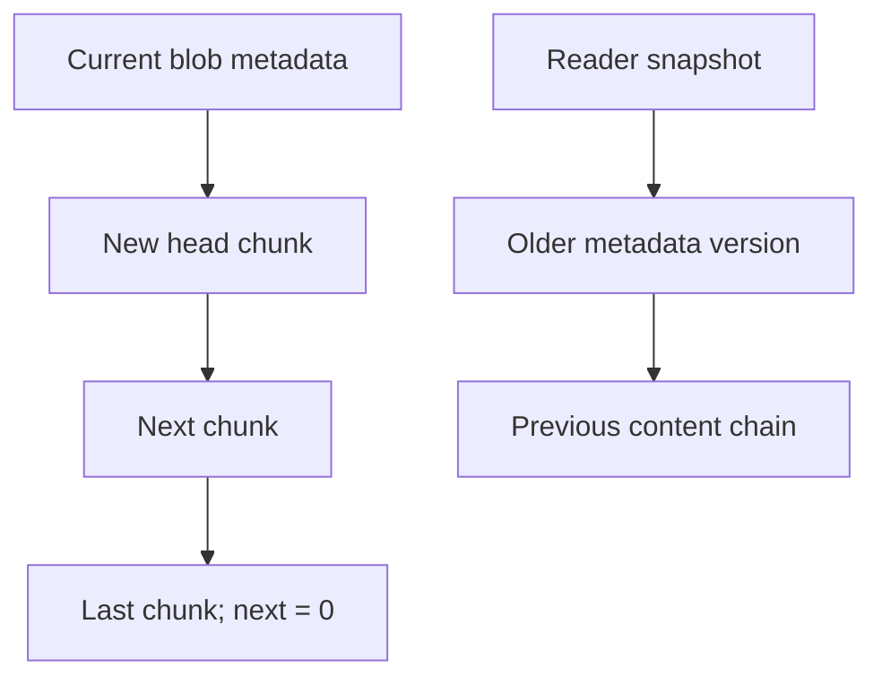
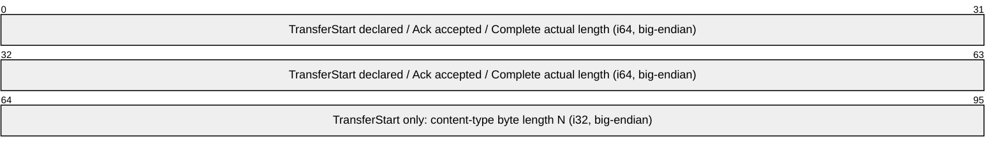
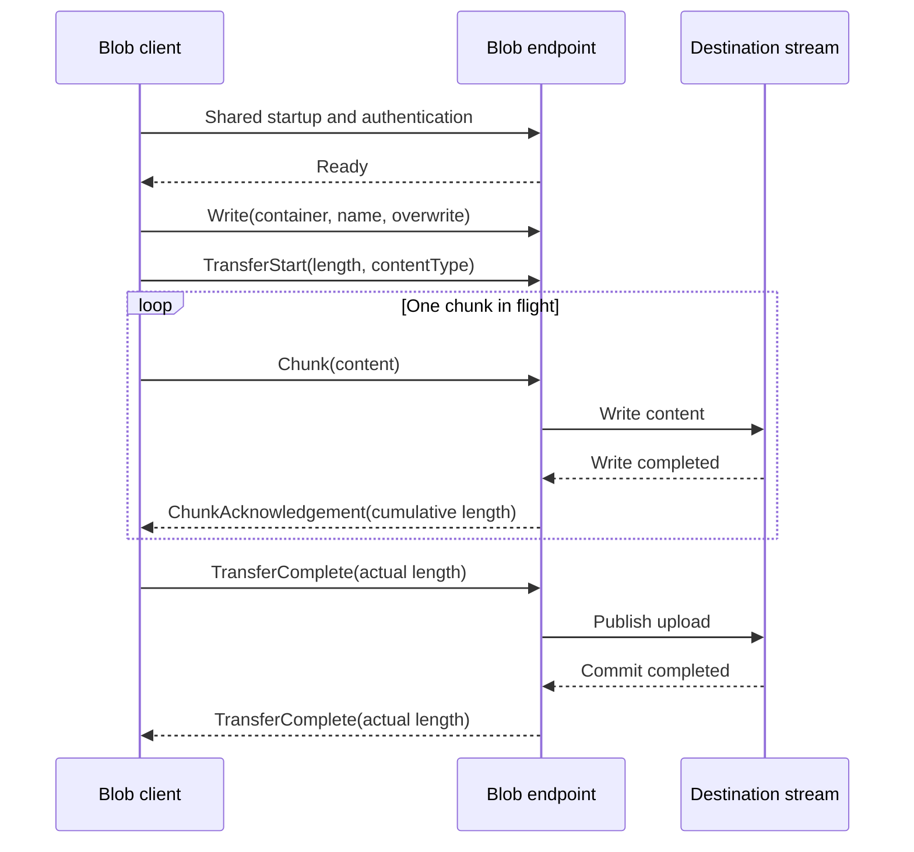

# Blob engine design

## String comparison and collation (#1025)

Blob remains ordinal-only. Container and blob names, equality, sorted listings,
and prefix filtering use case-sensitive .NET ordinal string rules, with no case
or accent folding. Administrative database lookup remains ordinal-ignore-case.
Blob content is opaque bytes and is never linguistically compared. SQL database
defaults and column/expression `COLLATE` have no effect on names, metadata, or
content; configurable blob-name collation is deferred.

## Composition and lifetime

The engine owns one Blob.Storage file set, one TransactionCoordinator, and one Blob.Catalog
per logical database. Metadata and content share the same data file and journal. This differs
from Key-Value's separate catalog file because a blob's head pointer must have the same commit
decision as its chunk chain. All paging, CRC checks, page allocation, WAL records, recovery,
transaction coordination, locks, and version reclamation come from the shared kernels.

The model client depends on the engine-owned message family and the shared connection client;
the engine server depends only on transport abstractions. These are reference directions.

```mermaid
flowchart LR
    Client["Database.Blob.Client"] --> Blob["Database.Blob"]
    Client --> SharedClient["Database.Client"]
    Blob --> Protocol["Database.Protocol"]
    SharedClient --> Protocol
    Blob --> Connections["Connections"]
    Blob --> Catalog["Database.Blob.Catalog"]
    Blob --> Storage["Database.Blob.Storage"]
    Blob --> Transactions["Database.Transactions"]
```

| Package | Responsibility |
| --- | --- |
| `Assimalign.Cohesion.Database.Blob` | Database/session/container lifetimes, ownership, publication, Blob wire family and server |
| `Assimalign.Cohesion.Database.Blob.Client` | Typed streaming operations over shared connection exchanges |
| `Assimalign.Cohesion.Connections` | Generic connection and listener contracts; no concrete transport |
| `Assimalign.Cohesion.Database.Protocol` | Shared framing, handshake, versioning, errors and family-bound channels |
| `Assimalign.Cohesion.Database.Blob.Catalog` | Metadata versions, directory and ordered listings |
| `Assimalign.Cohesion.Database.Blob.Storage` | Stream adapters and chunk encoding |
| `Assimalign.Cohesion.Database.Transactions` | MVCC contexts, coordinator, locks and version ledger |
| `Assimalign.Cohesion.Database.Storage` | Shared page pool, allocator, WAL, CRC and physical recovery |

Engine creation starts four dedicated background threads: checkpoint, WAL flush, page
write-back, and version purge. Each worker is exposed through `Workers`. The engine reports
Running, Faulted while a worker keeps failing, and Disposed after disposal. Disposal
is idempotent, stops and joins every worker, then aborts active transactions and durably closes
all open databases. It attempts every database close even if one fails. Synchronous and grouped
commit modes both wait for durable commit; grouped commits use the engine's flush signal and
the kernel's bounded self-help window.

A worker failure never ends a worker (#1268). Each worker catches per database: a failed
checkpoint, page write-back or group flush of one database is reported
(`DatabaseEngineWorker.ReportFailure`, the worker's `Fault`), the pass goes on to the next
database, and later passes skip that database for `DatabaseEngineWorker.FailureBackoff` (one
second, PostgreSQL's error sleep, `src/backend/postmaster/checkpointer.c:286-346`,
`bgwriter.c:154-205`) while every other database keeps the worker's full pace (#1268 review); the
first pass that finishes that database's work clears its record. A failure that took a database offline — a
failed durable flush (#1243) or drain of the journal's append buffer (#1252), or a header slot
write that failed (#1268), after which no checkpoint could truncate its journal — is not the
worker's: every later operation is refused
with `COHDBB002`, the workers skip the database, and the engine lists it in `OfflineDatabases`.
The root engine base's pump runs a worker again after the backoff if its loop ever ends early,
and the engine then reports Faulted until disposal; a `DatabaseEngineWorker`, the only kind the
engine attaches since phase 4 of the concrete-types plan, records a failed pass instead and its
loop lets nothing escape. Each pump thread is named for its worker (`{engine}/wal-flush` and its
siblings; it was `{engine}/{kind}` before phase 4). Before #1268 one unexpected exception ended a
worker for good.
`BlobWorkerResilienceTests` covers each case, a group flush's drain and its fsync both. It also
checks that a database whose checkpoints keep failing leaves the other database a pace a
worker-wide backoff cannot reach: over a shared six-second window more than twice the backoff's
checkpoints, the floor that fails every worker-wide backoff or stall of one backoff a pass, with
the median second's share of the no-fault checkpoints as a secondary signal. A smaller worker-wide
slowdown can pass; the deterministic signal that would catch it is required follow-up work (the
SQL engine's DESIGN.md, "Engine-owned background workers"). It also checks that a writer queued
for the database writer lock when the database goes offline (a
header slot write, a journal fsync or a journal drain failing) gets the coded refusal at once
instead of waiting for the reopen: an offline database undoes nothing, so the writer holding the
lock keeps it, and the coordinator ends every lock wait instead
(`TransactionCoordinator.AbandonLockWaits`, wired to the storage's offline hook). The holder keeps
the lock even when its own upload's journal drain takes the database offline: the failed upload
aborts its explicit transaction (#1225), and the abort rolls nothing back and releases nothing (the
holder's context stays open and active, and no undo waits for a retry), so the queued writer is
refused, never granted. The queued writer queues before the fault and does
nothing that drains: a container lookup is an autocommit read whose commit drains the journal, and
one that commits after the fault gets the unconfirmed commit of #1243 instead of the refusal.

**A database closed outside the engine is forgotten once its close ends** (owner decision 33 of
2026-10-06, #1289). A holder may dispose a database directly or through `session.Database`; the
close then tells the engine (`BlobDatabaseEngine.ForgetClosedDatabaseCore`, through the root's
shared `DatabaseRegistry.Forget`), which stops tracking it, so a later `OpenDatabaseAsync` opens
it again from its files: a new instance with every committed blob. An in-memory database reopens
with its blobs too, because the engine keeps each in-memory file set's streams until its own
disposal releases them (`DatabaseMemoryFiles`) and the open copies the closed streams' bytes and
runs the same recovery over them (#1272); before #1272 an in-memory reopen got empty storage.
While the close runs, the engine still tracks the closing database, so the workers'
closed-database skips ("Concrete types", option B) still cover it; an open waits for the close,
`TryGetDatabase` does not report
the database, and a drop or the engine's disposal waits for it, so nothing reuses the files under
the close. Before decision 33 the database stayed registered until it was dropped, and the open
refused it with `ObjectDisposedException`. The forget reads the engine's lock-free instance
snapshot and takes the engine's lock only through a bounded `Monitor.TryEnter` loop, because a
drop, an offline reopen and the engine's disposal dispose a database while holding that lock,
and that disposal waits for a close a holder started. The same wait means a holder's close that
stalls (a fsync that does not answer) stalls the engine's other registry operations, the wire
server's handshake among them, until it ends, and a drop's token is not observed meanwhile (root
`DESIGN.md`, "A stalled close stalls the engine's registry").
`BlobEngineTests.OpenDatabaseAsync_DatabaseClosedOutsideTheEngine_ShouldReopenItWithItsBlobs`
closes a database both ways, in memory and on disk, with an upload of an uncommitted transaction:
the reopened instance is new, holds the committed blobs (a small one and a 100,000-byte one)
byte for byte and not the uncommitted one, takes uploads, and a second close and open keeps them.
The server test that closes a database outside the engine asserts that the reopen serves it
again over the wire and in process.

File-backed databases use `<RootPath>/<database>/blob.dat`, `blob.log`, and `blob.bak`.
Database names are single file-name components, compared ignoring case; invalid path components
are rejected. Database enumeration includes persisted databases and opens them through recovery.
`TryGetDatabase` addresses the open instance set. Container and blob names are ordinal and
case-sensitive; a slash in a blob name is ordinary name content, never a database selector.
A file set in another storage format (#1251) is refused by the storage before its journal is
read, and the engine names the database: "Database 'x' cannot be opened. COHDBS001: …", the
storage's `StorageFormatException` as its inner exception, the files byte-identical
(`BlobEngineTests`).

## Chunk chain and disk compatibility

A visible catalog metadata version references the head of an immutable content chain. Each
chunk references its successor; zero ends the chain. Empty objects have zero head and length.
Replacement metadata references a new chain; readers holding an older snapshot continue to
reference the old chain until their streams close. The diagram shows those references.

```mermaid
flowchart TD
    Cur["Current blob metadata"] --> Head["New head chunk"]
    Head --> Next["Next chunk"]
    Next --> End["Last chunk; next = 0"]
    Old["Older metadata version"] --> Prev["Previous content chain"]
    Reader["Reader snapshot"] --> Old
```

The authoritative byte layouts are documented in
[Blob.Storage DESIGN](../../Assimalign.Cohesion.Database.Blob.Storage/docs/DESIGN.md) and
[Blob.Catalog DESIGN](../../Assimalign.Cohesion.Database.Blob.Catalog/docs/DESIGN.md).
Both use kernel slotted pages and a 16-byte prefix: little-endian UInt64 writer at offset 0
and UInt64 deleter at offset 8. The record kind at offset 16 distinguishes container metadata
(1), blob metadata (2), and chunks (3). Metadata uses owner-zero pages; content uses nonzero
owners. Packed locations store the page identifier in the high 48 bits and slot in the low
16 bits. The catalog carries content length, content type, original creation and latest
modification timestamps, a durable unique entity tag, CRC-32 and the head location. The chunk
format specifies its own format byte and link/payload offsets in the storage document.

## Atomic publication and recovery

An upload holds one logical `TransactionContext`. Each full chunk applies in a small physical
statement bracket through `TransactionCoordinator.ApplyStatementAsync`; each created record
is tracked by the shared version store. The stream holds one chunk buffer, not the object.
Flush can persist chunks while leaving them unpublished. Successful disposal finishes the last
chunk, tombstones replaced content, saves metadata, and commits the automatic transaction.
Inside an explicit transaction it only finishes the statement; transaction commit publishes
all its changes together. Entity tags reserve values from the durable storage sequence allocator,
so repeated writes in one transaction also get distinct tags.

Failure or cancellation aborts the logical transaction; inside an explicit transaction the
transaction then waits, Faulted, for the caller's rollback (see
[Failed operations in explicit transactions](#failed-operations-in-explicit-transactions-1225)).
The storage stream hands its abort callback the failure it throws to its caller, so the
transaction can report what aborted it. On restart the shared page recovery
replays physical brackets, then the coordinator classifies logical transactions and scrubs
uncommitted writer stamps before catalog loading. Checkpoints go through the coordinator so
the checkpoint record preserves every active logical sequence across WAL truncation. A crash
after some chunk brackets commit therefore leaves no visible partial blob. The metadata directory
is rebuilt from metadata pages after recovery and listing never scans content pages.

Deletion tombstones metadata and all chunks in the same logical transaction. Version purge
reclaims them after every reader snapshot that could see them ends, returning empty pages to
the kernel free-space map. Undo, purge, and recovery operate in bounded physical batches, and
the kernel reads recovery journal frames sequentially rather than retaining their page images.
The version ledger and page directory retain small per-record/page identifiers; the payload
itself stays on disk. File-backed storage is required when content exceeds available memory.

## Sessions, concurrency and ownership

Container operations exist only on the session (owner decision 32 of 2026-10-06):
`BlobDatabaseSession.CreateContainerAsync`, `GetContainerAsync`, `DropContainerAsync` and
`GetContainersAsync` run in its active transaction when one is open, and otherwise each in an
automatic transaction; containers it returns are bound to it and use the same coordinator and
explicit transaction, without a session parameter on their operations. Until decision 32 the
database carried session-less copies whose containers used automatic transactions outside any
session. The engine has one writer at a time, so a write through one of them (a create, a drop,
an upload or a delete) while the caller's own session held an explicit transaction's writer lock
waited for that transaction, and a caller that awaited it before ending the transaction waited
until the call's token was canceled. With the session as the one entry point that self-wait
cannot happen. `session.Database` is the unbound database (option B of the concrete-types plan,
§6.6): disposing it closes the database for every session, never the session itself. Once that
close ends the engine forgets the database, and a later `OpenDatabaseAsync` opens it again with
its blobs, in memory as on disk ("Composition and lifetime", owner decision 33). Session
disposal invalidates bound containers and streams.
Snapshot and ReadCommitted isolation are supported; unsupported isolation is
rejected rather than weakened. Read operations pin the selected snapshot until stream disposal.
An explicit ReadCommitted operation also retains a fixed snapshot pin so an earlier writer
committing during download cannot advance the purge horizon past its selected content.

Mutations take the shared lock manager's database exclusive lock before physical application.
This conservative first version serializes writers for the upload lifetime; snapshot readers
continue concurrently. Under that lock, the engine compares snapshot-visible metadata with
the latest state and rejects stale writes. A session admits only one active operation/stream.
This avoids overlapping uploads in the same transaction replacing the same original version.
When a transaction ends, the lock manager releases its grants and fails the requests it still has
queued, so an operation whose session closes or whose transaction rolls back while it waits for
the writer lock fails at once. A request queued just after that release is granted later, so
the operation also checks its context once the grant arrives and releases the grant if the
transaction has ended (`BlobLifecycleTests`); without that check the database writer lock stayed
granted to an ended transaction and every later writer waited forever. The kernel sets an ended
transaction's state before it releases its locks, which is what makes the check sufficient. The
Documents and Graph engines have the same check, and KeyValuePair has it for key locks. The
release goes through the coordinator's lock manager, which leaves it to the transaction manager
while the manager still tracks the transaction: a rolled-back transaction whose undo the kernel
had to defer keeps the writer lock until the version-purge pass completes the undo, so a late
operation's clean-up cannot hand the next writer the lock over blob versions the undo has not
removed yet (#1226, `Database.Transactions` DESIGN.md, "Ending a transaction").

### Failed operations in explicit transactions (#1225)

An operation that fails inside an explicit transaction aborts the whole transaction. Blob
storage cannot undo one operation: an upload writes a physical bracket per chunk, and a delete
tombstones the chain chunk by chunk and its metadata separately, while `Database.Transactions`
undoes a writer only as a whole transaction, with no savepoints. Until #1225 the session then
dropped the rolled-back transaction from view, so the next operation silently ran in autocommit
and the caller's `RollbackAsync` threw. The session now follows the contract the Graph engine set
in #1188 (Graph [DESIGN.md](../../Assimalign.Cohesion.Database.Graph/docs/DESIGN.md#failed-statements-in-explicit-transactions-1188)),
with its own code, `COHDBB001`; the Documents engine follows the same contract with `COHDBD001`,
and its [DESIGN.md](../../Assimalign.Cohesion.Database.Documents/docs/DESIGN.md#failed-statements-in-explicit-transactions-1225)
records the reference-engine evidence (PostgreSQL, Neo4j, RavenDB) both engines follow.

1. The failure rolls the transaction's work back at once and releases its locks, so the aborted
   transaction blocks no other writer while it waits for the caller. (When the undo itself fails,
   the kernel keeps the writer lock until its version-purge pass completes the undo; see
   `Database.Transactions` DESIGN.md, "Ending a transaction".)
2. The transaction stays the session's `CurrentTransaction` and reports `TransactionState.Faulted`.
   Every later operation on the session fails with `COHDBB001`: `OpenWriteAsync`,
   `OpenReadAsync`, `GetPropertiesAsync`, `DeleteAsync`, `GetBlobsAsync` and `GetOwnershipAsync`
   on session-bound containers, and the session's own container operations
   (`CreateContainerAsync`, `GetContainerAsync`, `DropContainerAsync`, `GetContainersAsync`).
   `BeginTransactionAsync` fails with
   `COHDBB001` too. The error names the original failure in its message (`Cause: ...`) and carries
   it as `InnerException`. A refused operation does not change the transaction.
3. `RollbackAsync` succeeds, leaves none of the transaction's writes, and returns the session to
   autocommit. Disposing the transaction or the session ends it the same way. A rollback of any
   transaction that did not commit may be repeated and raises nothing; a rollback of a committed
   transaction is refused. This holds when the rollback, or the session's disposal, runs while an
   operation of the transaction is still running on another thread (a large delete tombstoning
   its chain chunk by chunk, an upload between chunks): the kernel admits no physical bracket of a
   transaction whose end has begun and waits for the one already applying before it undoes the
   transaction (Transactions [DESIGN.md](../../Assimalign.Cohesion.Database.Transactions/docs/DESIGN.md#ending-a-transaction-under-a-running-statement)),
   so the running operation fails with `DatabaseTransactionAbortedException` and writes nothing
   that outlives the rollback. Before that rule, the operation went on stamping chunks with the
   rolled-back sequence after the undo; once a checkpoint truncated the abort record, recovery
   read those tombstones as committed and the purge reclaimed the content of a blob that was never
   deleted. An operation still waiting for the writer lock fails at once.
4. `CommitAsync` fails with `COHDBB001`, commits nothing, and ends the transaction (`RolledBack`).
   It keeps that answer after the transaction has ended some other way, so a host's commit gets
   `COHDBB001` whether it runs before or after the server session's teardown disposed the
   transaction. A commit after the session closed fails with `COHDBB001` too, naming the closure
   ("The session closed before the transaction ended.") when no operation failed first, or the
   operation the closure aborted ("The blob session closed while the operation was running.",
   an open stream included). A
   commit the kernel aborts throws `DatabaseTransactionAbortedException` and leaves the
   transaction `Faulted` and ended. A commit while an operation of the transaction still runs (a
   stream still open, or an operation waiting for the writer lock) is refused before it starts
   ("An operation of the transaction is still running; commit after it completes.") and leaves
   the transaction active.
5. Every failure of an operation that started counts: an unknown container, an upload refused
   because the blob exists and `Overwrite` is false, a snapshot conflict, an upload stream whose
   chunk write, publication or cancellation fails after it persisted chunks, a canceled wait for
   the writer lock, a read stream whose read fails (a canceled `ReadAsync`, a checksum mismatch, a
   storage error), and a stream whose disposal fails. Failures that come before an operation
   starts leave the transaction unchanged: argument validation (a null, empty or whitespace name,
   an invalid read buffer), a read on an operation that already ended, `ExecuteAsync` (Blob has no
   statement language), and the refusal of a second concurrent operation on the session.
6. Autocommit operations are unaffected: a failure ends only its own operation transaction.
7. A rollback or commit observes its cancellation token only before it starts, and one that has
   started runs to completion and always ends the transaction (#1226): the transaction kernel
   completes a started rollback whatever fails (a lost abort record is ignored, and a failed undo
   is retried by the kernel with the writer lock held), and it aborts a commit it cannot complete.
   Until #1226 a journal or storage failure could leave the context active behind a failed
   rollback, and the session kept the transaction `Faulted`, refusing work with `COHDBB001`, until a
   later rollback completed; that end-failure state is gone, as it is in Graph. The kernel still
   refuses a rollback before it starts while the database closes (`ObjectDisposedException`: the
   manager's disposal flags itself before it claims any end, so every end refused during the
   close fails this way); the context then stays active only until disposal's own abort ends it,
   the session refuses operations in the ended transaction ("being committed or rolled back;
   start the operation after it ends."),
   another `RollbackAsync` fails the same way while the close runs and is accepted once the
   close's abort ended the context, and a `CommitAsync` commits nothing.

Transaction-kernel failures cross the engine boundary translated (`DatabaseTransactionDeadlockException`,
`DatabaseTransactionAbortedException`, and `DatabaseTransactionCommitUnconfirmedException` for a
commit whose record was written but could not be made durable, which leaves the transaction
`Committed`), never as the kernel's own exception types, for operations
and for every end of the explicit transaction: commit, rollback, disposal, the session's closure,
and the abort an operation failure starts. One translation (`BlobDatabase.TranslateKernelFailure`)
serves them all. The unconfirmed commit's message leads with the model's code on every path, the
explicit commit and an upload's own commit alike (owner decision 24 of 2026-10-06, #1272):
`COHDBB002: Database '{name}' went offline while a transaction was committing: ...`, built by the
root's `DatabaseTransactionCommitUnconfirmedException.Create(code, database, cause)` with the
kernel's `TransactionCommitUnconfirmedException` as its inner exception; before #1272 this path
carried the kernel's message alone. The lifecycle is the Documents state diagram with operations
in place of statements. Since phase 4 of the concrete-types plan the end state machine this
section describes is the root `DatabaseTransaction` base's, and the session state, the "already active" check and the
one-operation hold are the root `DatabaseSession` base's; the model supplies `COHDBB001`,
`COHDBB002`, the kernel calls and this translation ([Concrete types](#concrete-types-concrete-types-plan-phase-4-1260)).

Over the wire a failure is terminal (see "Server lifecycle and failure semantics"): the server
writes `ExecutionFailure` and closes the connection, and the session's teardown disposes the
engine session and so ends the transaction. That includes a failure that came before an
operation started, which leaves an in-process transaction unchanged: over the wire every failure,
pre-start refusals included, ends a host-opened transaction, because the connection ends with it.
So that the outcome never depends on timing, the server aborts a still-usable host transaction
with the failure before it writes `ExecutionFailure`. No later request can reach that transaction
over the same connection, and a request on a new connection runs in a new session. A host that
opened the transaction on `DatabaseServerSession.DatabaseSession` sees the contract's ROLLBACK
and COMMIT answers whichever of its call and the teardown runs first: ROLLBACK raises nothing,
and COMMIT fails with `COHDBB001` naming the failure. A teardown without a failure (the client
disconnects, a protocol violation, a server stop) ends the transaction too, and a later COMMIT
fails with `COHDBB001` naming the session's closure (`BlobTransactionFailureWireTests` in
`Blob.Client`). An upload always begins its own transaction on the server session, so an upload on
a connection whose engine session already has a host transaction is refused at BEGIN ("A
transaction or operation is already active on this session.", the root session base's message).
The exchanges run the bound session's own container operations (option B), so they join that
session's transaction.

Containers carry stable identities distinct from their names, so a dropped and recreated
container cannot be addressed through an obsolete handle. Runtime creation marks them Adhoc.
Dropping a Schema-owned container throws `DatabaseObjectLockedException` with its name,
owning schema, and `DROP CONTAINER`, matching SQL's ownership semantics. There is no Blob
schema provisioner; tests directly save a Schema marker through the catalog.

## Verification and limits

### Container ownership discovery (C2)

`GetContainersAsync` (on the session or the database), `BlobContainer.GetBlobsAsync`, and
`BlobContainer.GetPropertiesAsync` already provide object discovery. Ownership is the only
additional surface: `BlobContainer.GetOwnershipAsync()` reads a read-only property
bag containing `OWNER` (`DatabaseObjectOwner.Adhoc` or `DatabaseObjectOwner.Schema`) and
`OWNING_SCHEMA` (the compiled schema name, or null). These names and meanings match SQL's
`COHESION_SCHEMA.OBJECT_OWNERSHIP`; the existing container handle supplies the object identity.
No replacement listing API or Blob statement language is introduced. Until phase 4 of the
concrete-types plan the member was an extension over the former `IBlobContainer` interface that
cast to the internal implementation, so the interface did not widen; the sealed `BlobContainer`
carries it as an instance member (plan §5.2).

The member reads the container's current catalog version through the same operation snapshot
as blob reads. Explicit Snapshot transactions retain their visibility; ReadCommitted operations
read fresh metadata. Automatic operations read current committed metadata. Results are detached
read-only dictionaries, never stored metadata copies that require synchronization. Mutation
through `IDictionary` (assignment, add, remove, or clear) throws the documented BCL diagnostic
`NotSupportedException`; its explanatory message is localized by the runtime. There is no
ownership write operation.

Ownership remains scoped to the handle's database and session. The stable container id is
checked before reading, so a dropped and recreated container cannot be inspected through a
stale handle; disposed sessions and canceled operations retain their ordinary diagnostics. The
extension's two refusals are gone with it: a null container and a foreign implementation of the
interface ("This blob container does not support ownership discovery.") cannot reach an instance
member of the sealed type.

The Shouldly suites cover chunk boundaries, empty objects, replacements, metadata/prefix
listing, page and content CRC, snapshots, rollback, stale writers, cancellation, ownership,
logical database lifecycle and scope guards. A child process round-trips a 128 MiB object with
a 64 MiB managed heap and reopens the persisted object. A separate fixture is killed with
unfinished replacement and new-object chains after checkpoint/write-back passes; restart keeps
the committed object and hides both unfinished writes.

## Blob wire family

The model package owns the Blob message family; `Database.Protocol` supplies framing and the
immutable family seam. `BlobProtocol.Family` binds one `ProtocolChannel` to Blob for its entire
lifetime. The listener endpoint selects this family before reading startup; no model discriminator
is added to the handshake. All family identifiers below are model-scoped: another model may use
the same byte on its own endpoint, but the Blob channel cannot switch interpreters during a session.
An independent client must connect to a configured Blob endpoint and complete the shared
Startup → Authenticate → AuthenticateResponse → Ready exchange before sending a Blob request.
Startup selects the database; container and object names never select or switch databases.

The shared envelope uses frame bytes 0–3 for a big-endian UInt32 payload byte count, frame byte 4
for the message type, and frame byte 5 onward for exactly that many payload bytes. The shared
envelope caps payloads at 16 MiB. Blob content
instead uses nonempty chunks of at most 65,536 bytes, so an object can exceed both a frame and
available memory. No object-sized allocation or seeking is needed by either transfer helper.
The sender retains one reusable 65,536-byte array; the receiver materializes and writes one
bounded frame at a time. Incoming framing still enforces the shared 16 MiB ceiling before
allocation, and Blob decoding rejects a content frame larger than its stricter 65,536-byte bound.

Version 1.0 defines the following complete payload layouts. Integers are big-endian. A `text`
field is an Int32 UTF-8 byte length followed by exactly that many UTF-8 bytes, without a
terminator. Each text field is limited to 65,535 bytes, and invalid UTF-8, negative lengths,
missing bytes, and trailing bytes are protocol violations. Container and object names must
be nonempty and compare ordinally, case-sensitively. No Unicode normalization is applied.

| Byte | Message | Direction | Payload in order |
| --- | --- | --- | --- |
| 64 | `Read` | Client → server | `text container`, `text name` |
| 65 | `Write` | Client → server | `text container`, `text name`, UInt8 overwrite (`0` or `1`) |
| 66 | `TransferStart` | Content sender → receiver | Int64 length (`-1` unknown, otherwise nonnegative), `text contentType` (empty means unspecified) |
| 67 | `Chunk` | Content sender → receiver | 1–65,536 raw content bytes; no inner prefix |
| 68 | `TransferComplete` | Content sender → receiver, or server → client upload acknowledgement | Int64 actual content byte count, nonnegative |
| 69 | `ChunkAcknowledgement` | Content receiver → sender | Int64 cumulative accepted content byte count, nonnegative |
| 70 | `Delete` | Client → server | `text container`, `text name` |
| 71 | `GetProperties` | Client → server | `text container`, `text name` |
| 72 | `List` | Client → server | `text container`, `text prefix` (empty selects every object) |
| 73 | `Properties` | Server → client | `text name`, Int64 nonnegative length, UInt8 content-type presence (0 or 1), optional `text contentType`, UInt64 ETag, Int64 creation UTC ticks, Int64 modification UTC ticks, UInt32 CRC-32 |
| 74 | `OperationComplete` | Server → client | Int64 nonnegative result count |

Payload offsets restart at byte 0 after the shared five-byte frame header. `TransferStart` type 66
uses payload bytes 0–7 for a signed big-endian Int64 declared length (`-1` for unknown or a
nonnegative value), bytes 8–11 for a signed big-endian Int32 content-type byte length `N` from 0
through 65,535, and exactly `N` strict UTF-8 bytes starting at byte 12; its payload is therefore
exactly `12 + N` bytes. `TransferComplete` type 68 ends after payload byte 7 and uses that same
eight-byte signed big-endian Int64 slot for a nonnegative actual byte count.
`ChunkAcknowledgement` type 69 also ends after payload byte 7 and uses the slot for a nonnegative
cumulative accepted byte count. These decoders reject missing or trailing bytes. `Chunk` type 67
does not use this integer shape: its whole payload is 1–65,536 raw content bytes at offsets 0
through `N - 1`, with no inner length prefix.

This packet view shows the fixed transfer-control fields shared by those three control messages and
the `TransferStart`-only extension; its UTF-8 tail and the raw `Chunk` variant are specified above.

```mermaid
packet-beta
0-63: "TransferStart declared / Ack accepted / Complete actual length (i64, big-endian)"
64-95: "TransferStart only: content-type byte length N (i32, big-endian)"
```

Properties timestamps are ticks since 0001-01-01 UTC, limited to the DateTime range.
Content-type presence distinguishes null from an explicitly empty string. ETags retain all 64 bits.
Delete returns completion count 0 (absent) or 1 (deleted). Property reads return either completion
count 0, or one Properties frame followed by completion count 1. Listings emit one Properties
frame per object in ordinal name order, then completion with the exact object count. An error
replaces completion; no partial listing is a successfully completed result.

`Read` returns `TransferStart`, zero or more chunks, and `TransferComplete`. A `Write` request
is immediately followed by that transfer in the opposite direction. The sender waits for a
`ChunkAcknowledgement` after every chunk before reading more source content. The receiver writes
the chunk to its destination before acknowledging the cumulative count. Duplicate, out-of-order,
or incorrect acknowledgement counts fail the transfer. This one-chunk window bounds content in
flight even on transports without backpressure, including `Connections.InMemory`. The accepted
tradeoff is one round trip per chunk; a future window extension would require explicit negotiation
rather than silently increasing memory requirements.

The receiver checks cumulative content against a declared nonnegative length before writing an
excess chunk and checks completion against both the actual count and the declared count. With
unknown length, the completion count still must equal actual received bytes. Empty objects send
start and completion with no chunks. Chunk acknowledgement means the destination accepted the
bytes; it never means the object was published or durably committed. On upload, after receiving
and verifying `TransferComplete`, the server publishes through its storage transaction, then
sends its own `TransferComplete` with the verified length as the success acknowledgement.

This exchange shows the upload request, the bounded content flow, and publication acknowledgement:

```mermaid
sequenceDiagram
    participant C as Blob client
    participant S as Blob endpoint
    participant D as Destination stream
    C->>S: Shared startup and authentication
    S-->>C: Ready
    C->>S: Write(container, name, overwrite)
    C->>S: TransferStart(length, contentType)
    loop One chunk in flight
        C->>S: Chunk(content)
        S->>D: Write content
        D-->>S: Write completed
        S-->>C: ChunkAcknowledgement(cumulative length)
    end
    C->>S: TransferComplete(actual length)
    S->>D: Publish upload
    D-->>S: Commit completed
    S-->>C: TransferComplete(actual length)
```

Only one request or transfer is active per connection; no transfer IDs or multiplexing exist.
Shared Ping/Pong are used between operations. A shared Error frame may terminate an exchange;
`BlobProtocolTransfer` converts it to `ProtocolException` including its stable code and message.
Any unexpected frame, EOF before completion, malformed payload, source failure, destination
failure, or cancellation aborts the transfer. Discard that connection instead of attempting to
resume at an uncertain frame boundary. A server must abort the associated upload transaction,
never publish a partial destination through successful stream disposal. Connection closure also
cancels a sender waiting for acknowledgement. Callers should supply cancellation deadlines.

`BlobProtocolTransfer` owns only the content sequence. It neither authenticates nor dispatches
requests, commits destination storage, sends the final publication acknowledgement, closes the
channel, or disposes caller streams. `ReceiveAsync` returns the content type and verified actual
length, replacing an initially unknown length. Reader/writer overloads consume the shared
`DatabaseProtocolExchange` frame endpoints without requiring ownership of its ProtocolChannel.
The overload accepting pre-read metadata resumes immediately after a validated TransferStart;
the server uses it to open storage with the declared content type before accepting content.
The caller must retain exclusive access throughout and discard the exchange after failure.
No concrete transport is referenced here.
Public codecs use explicit binary operations and strict UTF-8, with no reflection or object
serialization. Shared protocol version remains 1.0 because these are first-use Blob endpoint
messages and SQL/Key-Value payloads and identifiers remain unchanged.

`BlobProtocolTests` use `Connections.InMemory` for authenticated request/transfer exchanges in
both directions. A generated non-seekable source and validating non-seekable destination move
16 MiB + 173 bytes without owning payload arrays. They verify content and a maximum 65,536-byte
gap between source reads and destination acceptance, even though that transport has no automatic
pipe backpressure. Additional tests fix independent wire vectors and cover empty/unknown lengths,
short reads, malformed encodings, completion-count mismatches, and cancellation while awaiting
an acknowledgement. Existing Blob test source files are unchanged.

Names and metadata must fit one kernel record. Streams are sequential and not thread-safe.
Applications must dispose them; no finalizer commits a forgotten upload. Blob has no query
language, built-in authorization policy, replication, or compiled schema provisioning here.
The wire family widened no engine type, and the builder verb references only the area root seam.

## Server lifecycle and failure semantics

`BlobDatabaseServer` owns one generic `IConnectionListener` and a concurrent session table.
It follows the SQL/Graph per-model server placement rather than depending on a shared server
implementation, and since phase 4 of the concrete-types plan its lifecycle is the root
`DatabaseServer` base's state machine, the one the SQL, KeyValuePair and Graph servers carried.
The engine stays owned by the composition root. Start binds the listener;
a bind failure attempts listener cleanup and is terminal. Stop and disposal are idempotent;
restart requires a fresh server and listener. The server's `Sessions` (and, until phase 6, its
`Context`) expose a point-in-time active-session snapshot. Non-running EngineState rejects
startup, handshakes, newly accepted connections, and new object operations with an unavailable
response where possible. A start refused because the engine is not `Running` ("The Blob engine is
{State} and cannot accept sessions.") is terminal like any failed start of the base: the start
core disposes the listener before the refusal propagates, and a later start throws
`ObjectDisposedException`. Before phase 4 that refusal left the server inert, so a later start
could retry and a later stop disposed the listener; keeping the retry would need a non-terminal
refusal path in the base (pending owner confirmation, plan §7).

A connection must finish startup and authentication within AuthenticationTimeout. The configured
authenticator receives the selected database, claimed principal and opaque evidence. Only after
successful authentication does the server create an engine session. All request handlers run
that `BlobDatabaseSession`'s own container operations; request payloads cannot switch databases,
create/drop them, or address another engine. MaxSessions includes connections awaiting authentication. Over-limit
connections receive Unavailable without becoming sessions. Rejection work is tracked and drained;
a blocked rejection write is bounded to five seconds and aborts on hard shutdown.

IdleTimeout applies while awaiting the next request, not to an active transfer. Shared Ping/Pong
is available between requests. Soft shutdown stops acceptance and idle/handshake waits; an active
exchange may finish, including transaction publication and its acknowledgement. Once
ShutdownDrainTimeout expires (or the Stop token is canceled after shutdown starts), the server
cancels active operations and aborts every remaining connection, then awaits cleanup before
releasing its listener. All three timeout options accept Timeout.InfiniteTimeSpan. An infinite
shutdown drain intentionally waits indefinitely for active work.
An unexpected accept-loop failure is rethrown by Stop only after accepted sessions and rejection
work have drained or been aborted and the listener has been released.

Every upload runs inside an explicit existing engine transaction. After validating TransferStart,
the server opens the session-bound destination using its content type and overwrite flag. It
consumes the existing one-chunk-window transfer helper. Only a verified TransferComplete permits
successful destination disposal and transaction commit. Failures roll back before destination
disposal, so stream finalization cannot accidentally publish a partial object. New failed objects
remain absent; failed replacements leave the previous committed object readable. The terminal
upload acknowledgement is sent only after commit succeeds. Loss of that acknowledgement can
leave the client uncertain even though the complete object committed; there is no exactly-once
retry or transfer-resumption guarantee.

Downloads read properties and content in one Snapshot transaction so a concurrent replacement
cannot mix old metadata with new bytes. Disposal releases the read snapshot. EOF before a valid
TransferComplete is always failure. Engine/storage errors during an exchange send the shared
ExecutionFailure error and close the session; protocol violations send ProtocolViolation and
close it. A broken transport may prevent delivery of the error itself, in which case the client
still observes premature closure rather than successful EOF. Every failure, caller cancellation,
or early client stream disposal discards the connection, allowing server lifetime cancellation to
abort work. Already delivered download bytes are provisional until successful EOF.

The Blob server tests cover all five operations against another database and another server with
matching names, authenticator evidence, session limits, idle/authentication timeouts, terminal
lifecycle, engine-state rejection (a start refused for a `Faulted` engine disposes the listener
once and stays stopped), both drain phases, and a blocked over-limit rejection. The
client suite supplies in-memory end-to-end failure cases and the constrained-heap wire round trip.

## Storage operations (#1243, #1254, #1226)

**A failed fsync takes the database offline (#1243).** When a durable flush of the
database's journal or data file fails, the storage goes offline (`Database.Storage`
DESIGN.md, "A failed durable flush takes the storage offline") and nothing more is written to
the file set, closing included — PostgreSQL's `PANIC` on a failed WAL fsync (`issue_xlog_fsync`,
`src/backend/access/transam/xlog.c:9877-9937`; the commit critical section in
`RecordTransactionCommit`, `src/backend/access/transam/xact.c:1470-1583`; and `data_sync_retry`
off, `src/backend/storage/file/fd.c:3966-3987`), scoped to the database.

- The upload whose commit flush failed gets `DatabaseTransactionCommitUnconfirmedException` from
  its stream's disposal, its message leading with `COHDBB002` (owner decision 24). Before #1243
  an upload's completion failures reached the caller untranslated (the kernel's own exception
  types) because the upload stream's callbacks bypassed the engine's translation; `BlobGuardedStream` now translates every write, flush, read and
  disposal failure the way the other operations' failures are translated, and the upload's abort
  records the translated cause.
- Every later operation — a new session, a container call, `OpenWriteAsync`, `OpenReadAsync`, a
  read from a download stream opened before the failure, that stream's disposal, BEGIN, and the
  COMMIT or ROLLBACK of a transaction open at the failure — is refused with
  `DatabaseOfflineException`, code `COHDBB002`, carrying the storage's `StorageOfflineException`.
- `BlobDatabaseServer` answers an operation on an existing session, and a handshake for the
  database, with `Unavailable` and the coded message.
- A storage bracket whose commit record was written before its flush failed is reported as
  unconfirmed, never refused (`StorageOfflineException.CommitRecordWritten`).
- The engine stays `Running`; `BlobDatabaseEngine.OfflineDatabases` names the database, and
  `Database.Hosting` reports the application unhealthy while it is listed.
- The workers skip the database; closing its sessions, transactions and streams writes nothing.
  `BlobDatabaseEngine.OpenDatabaseAsync(name)` disposes the offline instance without writing and
  reopens the file set, whose recovery keeps the unconfirmed upload if its commit record's bytes
  reached the media and aborts every transaction that was open.

`BlobStorageOperationsTests` covers it in process and over the wire with a fault-injecting
strategy over durable in-memory handles, reopening with and without the unconfirmed record's
bytes; the open transaction and the download are readers, because the engine's single database
writer lock would otherwise block the failing upload.

**Buffer pool and checkpoint options (#1254).** `BlobDatabaseEngineOptions` (and
`BlobDatabaseEngineBuilder`) carry `BufferPoolCapacity` (32 MiB; whole 8 KiB pages, at least
1 MiB), `CheckpointJournalSize` (256 MiB; zero for time only; not negative) and
`CheckpointInterval` (5 minutes, was 30 seconds), all validated by `Create`. The checkpoint worker
checkpoints a database when its journal reaches the size (its storage wakes the worker at once)
or when the interval passed and its journal received records, looking at most once a second
otherwise, through the transaction coordinator's apply gate. The worker never waits for the gate:
a statement that holds it runs the checkpoint as it ends (`TransactionCoordinator.TryCheckpoint`),
so a long upload bracket in one database cannot stop the other databases' checkpoints. An upload
of one large object is a
single transaction whose chunk brackets journal at least twice the object's size (the 128 MiB
streaming fixture's upload reached the 256 MiB default), so a size-triggered checkpoint can run
in the middle of it (a sharp checkpoint keeps the in-flight writer in its
anchor); the streaming fixture, whose recovery image must keep a 128 MiB object's whole journal,
sets `CheckpointJournalSize = 0`. An open database costs up to about 33 MiB of pool memory once it
touched that many pages, plus, in memory, its data and its journal (up to the checkpoint size,
briefly twice that while the buffer doubles past it, released by the checkpoint); the
constrained-heap wire round trip (a 256 MiB object through a 64 MiB heap) passes with the default
pool. The reasoning is in `Database.Storage` DESIGN.md ("Capacity", "Checkpoint triggers").

**Deferred undo is retried on its own backoff (#1226).** The version-purge worker retries a
rollback's failed undo about 100 ms after the deferral, then at doubling delays up to
`MaintenanceInterval`, so a transient failure releases the database writer lock within about a
second (`Database.Transactions` DESIGN.md). A retry that fails makes the engine report
`Faulted`; the first pass with no failure and no undo still deferred clears it.

## Phase 29: deferred hosting composition

The owner-approved [Database hosting composition](../../../../docs/programs/DATABASE_HOSTING_DESIGN.md)
is implemented as `AddBlob((context, engine) => ...)` on
`IDatabaseApplicationBuilder`. This replaces `AddBlobDatabase`. The model callback
runs during application Build and receives the sealed `BlobDatabaseEngineBuilder`.
It configures the complete option set, including `FileSystemPath? RootPath`,
durability, identity and worker intervals; it neither binds configuration nor
accesses a service container. Retained builder options and factories reject
mutation after the first engine Build attempt.

`AddWorker` and `AddServer` take factories typed over the engine
(`Func<BlobDatabaseEngine, DatabaseEngineWorker>`,
`Func<BlobDatabaseEngine, DatabaseServer>`) whose engine argument exists before
the factory runs, so a model-specific factory needs no cast. A factory runs when
its product is attached, so it sees the products attached before it; every worker
is attached before any server. The engine schedules custom workers through the
root `DatabaseEngineWorker` base, and refuses a worker whose name another worker
of the engine has. The engine owns successful factory products and cleans them up
on subsequent construction failure. Nested servers must front that exact engine.
The application snapshots each engine's Servers for start/stop; disposing the
engine disposes its servers and custom workers.

`BlobDatabaseEngine.Create(options)` remains the standalone entry point.
Application factory registrations are application-owned; instance registrations
remain caller-owned, including their nested components. All four named database
operations now take `DatabaseName`, with the existing implicit string conversion
preserving ordinary literal call sites. Empty/default names are rejected.

The explicit requirement for StorageStrategy superseded the draft's statement
that this model lacks a storage injection parameter. The internal
`BlobStorageStrategy` provides create/open/drop, existence and discovery using
the existing `BlobStorage` product. It overrides RootPath without allocating
default files; returned storage is engine-owned and the strategy itself is
borrowed. Durability is supplied explicitly, and opening must defer
checkpointing until engine recovery. Default file/memory selection remains
unchanged. Since phase 4 of the concrete-types plan the strategy is
`internal abstract` (D9): no shipped code implemented the former public
`IBlobStorageStrategy`, so the options and builder property are internal and
only this assembly's test doubles (fault-injecting and recording) supply one.

`BlobDatabaseEngine.CreateBuilder()` exposes the model builder for the
concrete hosting builder's `AddEngine(name, build => ...)` overload. The consumer
assigns resolved configuration/service values, registers nested server/worker
factories, and returns `Build()`; the model package still never sees DI. The
builder implements no root interface: no Hosting code consumed
`IDatabaseEngineBuilder`.

## Concrete types (concrete-types plan, phase 4, #1260)

The model is the fourth to adopt the root bases
([plan](../../../../docs/programs/DATABASE_CONCRETE_TYPES_PLAN.md) §7), after KeyValuePair,
Graph and Documents. Its public types are sealed leaves; it has no public interface left, and no
`Abstractions/` folder. Its child root collapsed the same way: `BlobCatalog` is a sealed type
behind its `Open` factory.

| Type | Base | Was |
|---|---|---|
| `BlobDatabaseEngine` | `DatabaseEngine` | a sealed `IDatabaseEngine` |
| `BlobDatabase` | `DatabaseInstance` | `IBlobDatabase`, the internal `BlobDatabaseInstance`, and the session-bound view `BlobSessionDatabase` a session returned as its database |
| `BlobDatabaseSession` | `DatabaseSession` | an internal `IDatabaseSession` |
| `BlobDatabaseTransaction` | `DatabaseTransaction` | an internal `IDatabaseTransaction` |
| `BlobDatabaseServer` | `DatabaseServer` | a sealed `IDatabaseServer` |
| `BlobDatabaseServerSession` (internal) | `DatabaseServerSession` | an internal `IDatabaseServerSession` |
| `BlobContainer` | none | `IBlobContainer`, its internal implementation, and the `GetOwnershipAsync` extension |
| `BlobDatabaseEngineBuilder` | none | `IBlobDatabaseEngineBuilder` and its internal implementation |
| `BlobStorageStrategy` (internal abstract) | none | `IBlobStorageStrategy` |

- **Option B for the session's database** (plan §6.6). The session-bound view gave `Dispose` two
  meanings: disposing a session's database closed the session, disposing the database itself
  closed the database. The session now runs its container operations itself
  (`CreateContainerAsync`, `GetContainerAsync`, `DropContainerAsync`, `GetContainersAsync`,
  in its transaction), and `session.Database` is the unbound `BlobDatabase`, whose disposal closes
  the database. So `session.Database` creates sessions after the session closed (the view refused
  with "The blob session is closed."), and disposing it closes the database for every session,
  not the session. Since owner decision 33 the engine forgets the closed database once its close
  ends and the next open opens it again; until then it refused the reopen with
  `ObjectDisposedException` until the database was dropped or the engine recreated, as a directly
  disposed database always was. Phase 4 also kept the database's own container operations, in
  autocommit; owner decision 32 removed them, so the session is the one entry point and a write
  can no longer wait on its caller's own explicit transaction ("Sessions, concurrency and
  ownership"). Its workers leave a closed database alone
  (`BlobDatabase.IsClosed`, and `BlobDatabaseEngine.IsOpen` is false for it), so the engine stays
  `Running` and its server keeps serving the other databases: the version-purge worker skips it in
  its pass and its trigger wait, and the checkpointer through `BlobCheckpointWorker.IsCheckpointDue`,
  which is false for a closed database (the pass is the engines' shared one, and its `IsOpen` check
  covers only a checkpoint that raced the close). The flush and write-back workers visit storages,
  so they still visit the closed database's storage: write-back writes nothing to a disposed
  storage, and a flush of one does nothing when no commit is pending and otherwise ends in an
  `ObjectDisposedException` that `IsOpen(BlobStorage)` tolerates. Without the skip, the
  version-purge worker failed on the closed database's disposed coordinator every pass, which left
  the engine `Faulted` for good and its server refusing every start, connection and handshake;
  option B made that reachable from a session's own property. The checkpointer's skip came with
  #1289: a close that was not idle leaves the journal untruncated (when its retry of a deferred
  undo still fails, the close keeps that writer in flight, #1226), so the closed storage stayed due
  for a checkpoint it refuses with `StorageTransactionException`, and a checkpoint failure recorded
  for the database before the close never ended, which kept the engine `Faulted`.
  `BlobWorkerResilienceTests.CheckpointWorker_FailingDatabaseClosedWithAWriterInFlight_ShouldEndItsFailureAndLeaveTheEngineRunning`
  records a checkpoint failure for a database whose page writes fail, closes it with a rolled-back
  transaction's undo deferred behind a bracket that holds every page, and asserts that the
  checkpointer's failure ends and the engine runs again (without the skip it stayed `Faulted` for
  the test's 30 seconds). The wire server and Studio run the session's operations.
- **Typed surface without casts.** The engine re-exposes `CreateDatabaseAsync`,
  `OpenDatabaseAsync` and `GetDatabasesAsync` typed (`BlobDatabase`) with `new` members over the
  base's public members; a database re-exposes its `Engine` and `CreateSessionAsync`
  (`BlobDatabaseSession`); a session its `Database`, `CurrentTransaction` and both
  `BeginTransactionAsync` overloads (`BlobDatabaseTransaction`); the server its `Engine`; the
  internal server session its `DatabaseSession`, covariantly. Each `new` member awaits or reads the
  base's public member and casts once, so the base's checks always run.
  `TryGetDatabase(DatabaseName, out BlobDatabase)` is a typed overload of the base's lookup, not a
  `new` member: an `out var` call binds it, and an explicitly typed `out DatabaseInstance` binds
  the base's.
- **What the bases own now.** The engine base owns the name, the model, the workers' pumps (the
  model no longer compiles `shared/DatabaseEngineWorkerPump.cs`), the state fold, composition and
  the disposal order; the database base owns the disposed flag; the session base owns the session
  state, the session's transaction, the "already active" check and the operation hold (the
  model's former reservation flag and operation set, at most one operation at a time, a stream's
  until its disposal); the transaction base owns the whole end state machine, the admission of
  operations (the model's former operation counter) and the abort; the server base owns the
  lifecycle; the server session base owns the identity, the negotiated version and the
  authenticated principal (pending owner confirmation of rule 6, plan §7). The model supplies its
  vocabulary: `COHDBB001`, `COHDBB002`, the kernel calls and the translation of the kernel's
  exceptions. It keeps its per-operation rule (#1225): a failed operation aborts the explicit
  transaction through the base's `AbortAsync`, and an operation holds the session from its start
  to its end.
- **What changed for a caller** (plan §6.4): a closed session fails every operation with "The
  session is closed." (was "The blob session is closed."); BEGIN refuses a closed session, then
  an active transaction or operation ("A transaction or operation is already active on this
  session.", was "A transaction or stream is already active on this session."), then a canceled
  token, before the isolation-level and offline refusals, which came first; on an offline database
  BEGIN from the session that holds an open transaction fails "already active" (was `COHDBB002`),
  and a canceled token is refused by `CreateSessionAsync`, both execute seams and BEGIN before
  `COHDBB002`, and so are the seams' argument errors, a null request and a blank statement (the
  container and blob operations keep their order, the offline refusal first); BEGIN refuses a
  transaction the kernel ended under its caller with `COHDBB001`, where it reported the disposed
  database; BEGIN and both execute seams refuse a closed session as closed before they check its
  database, so a closed session of a dropped or closed database reports "The session is closed."
  where it reported `ObjectDisposedException` (the container and blob operations check the
  database first and still report it); the request seam's refusal names the session's container
  operations ("Blob sessions have no query language. Use the session's container operations.",
  was "… Use the IBlobDatabase exposed by session.Database."); a commit after the session closed an
  active transaction names "The session closed before the transaction ended." (was "The blob
  session closed before the transaction ended."); a commit while an operation of the transaction
  runs fails with "An operation of the transaction is still running; commit after it completes."
  (was "Dispose every blob stream before committing its transaction."); an operation refused after
  the caller's own end says the transaction "ended before the operation started" where it
  reported `COHDBB001` without a cause; a session that fails to close reports "The session failed
  to close." (was "One or more blob operations failed to close."); and the engine's disposal
  aggregate is "One or more components of engine '{name}' failed to close." (was "One or more blob
  engine components failed to close."), with the databases that fail to close as one component,
  nested in "One or more blob databases failed to close." when there are several. The engine's
  guards check an empty name, then disposal, then the token, and the model's
  single-file-name-component rule after them (it checked the whole name, then the token, then
  disposal); `GetDatabasesAsync` checks disposal when it is called; a blank `EngineName` is
  refused by `Create` and `Build` (`ArgumentException`, parameter `EngineName`); a worker whose
  name another worker of the engine has is refused (the model never checked names); each worker's
  pump thread is named for the worker (it was `{engine}/{kind}`); and a server start refused for
  the engine's state is terminal ("Server lifecycle and failure semantics").
- **Unchanged for Blob**, though the bases now carry it: every commit of an aborted transaction,
  a second one and one after the teardown included, reporting `COHDBB001` with the cause (the
  model's teardown already closed the transaction with a cause); the `Faulted` state of a
  transaction whose session closed while its database was offline; the one-operation hold's
  refusal, "Dispose the active blob stream before starting another operation on this session.";
  the refusal of an operation while the caller's commit or rollback runs ("… start the operation
  after it ends.", which the model already worded for operations);
  the worker disposal order (last attached first); the server's accept-loop failure rethrown by
  stop after the drain; and the database's disposal steps (the coordinator, then the storage),
  which a disposal through the engine now awaits asynchronously.
